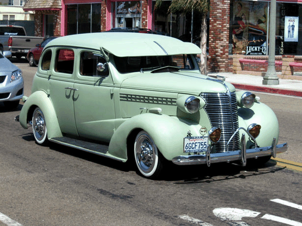
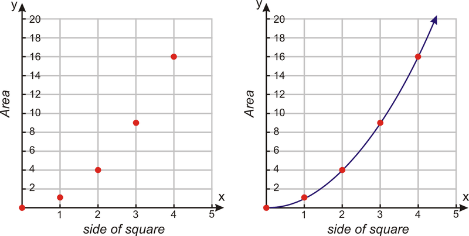
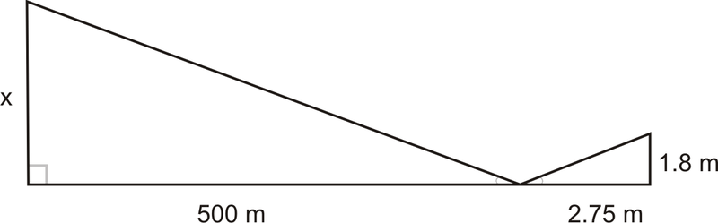
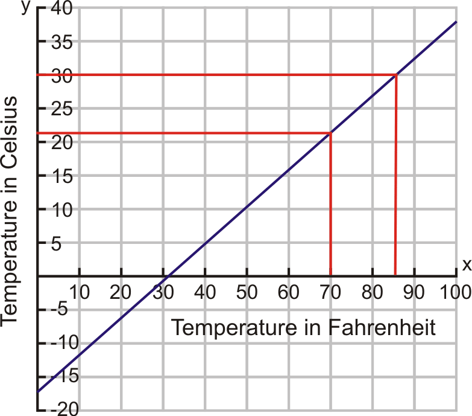
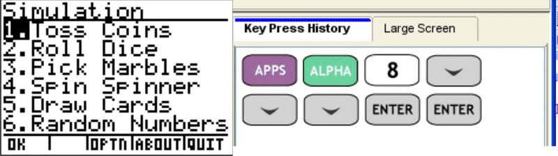
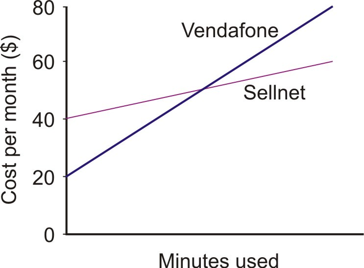
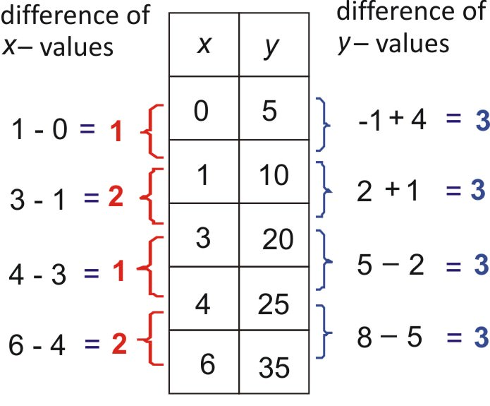
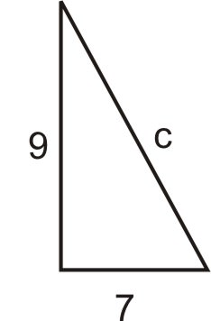
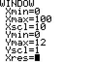
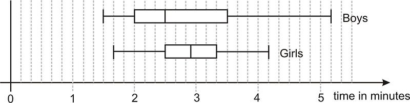

<!--
author:   Melissa Kramer; Anne Gloag; Andrew Gloag

email:    LiaScript@web.de

version:  0.0.1

language: en

narrator: US English Female

comment:  CK-12 Foundation’s Basic Algebra FlexBook® textbook is an introduction to the algebraic topics of functions, equations, and graphs for middle-school and high-school students.

logo:     ../cover.jpg

tags:      algebra, equations, exponential functions, expressions, factorization, functions, graphs, quadratic equations, real numbers, systems of equations, mathematics

-->

# CK-12 Algebra - Basic

> This document was automatically translated to LiaScript from
>
> https://www.ck12.org/book/ck-12-algebra-basic/

## 1.0 Expressions, Equations, and Functions

<article>

The study of expressions, equations, and functions is the basis of mathematics. Each mathematical subject requires knowledge of manipulating equations to solve for a variable. Careers such as automobile accident investigators, quality control engineers, and insurance originators use equations to determine the value of variables.

Throughout this chapter, you will learn how to choose the best variables to describe a situation, simplify an expression using the Order of Operations, describe functions in various ways, write equations, and solve problems using a systematic approach.

</article>

### 1.1 Variable Expressions

<article>

Who Speaks Math, Anyway?
------------------------

When someone is having trouble with algebra, they may say, “I don’t speak math!” While this may seem weird to you, it is a valid statement. Math, like English, French, Spanish, or Arabic, is a secondary language that you must learn in order to be successful. There are verbs and nouns in math, just like in any other language. In order to understand math, you must practice the language.

A verb is a “doing” word, such as run, jump, or drive. Mathematics verbs are also “doing” words. A math verb is called an **operation.** Operations can be something you have used before, such as addition, multiplication, subtraction, or division. They can also be more complex, like an exponent or square root.

**Example:** Suppose you have a job earning $8.15 per hour. What could you use to quickly find out how much money you would earn for different hours of work?

**Solution:** You could make a list of all the possible hours, but that would take forever! So instead, you let the “hours you work” be replaced with a symbol, like $h$ for hours, and write an equation such as:

$$
amount \ of \ money = 8.15(h)
$$

A noun is usually described as a person, place, or thing. In mathematics, nouns are called numbers and **variables.** A variable is a symbol, usually an English letter, written to replace an unknown or changing quantity.

a. the number of cars on a road

b. time in minutes of a ball bounce

c. distance from an object

**Solution:** There are many options, but here are a few to think about.

a. Cars is the changing value, so $c$ is a good choice.

b. Time is the changing value, so $t$ is a good choice.

c. Distance is the varying quantity, so $d$ is a good choice.

Why Do They Do That?
--------------------

Just like in the English language, mathematics uses several words to describe one thing. For example, _sum, addition, more than,_ and _plus_ all mean to add numbers together. The following definition shows an example of this.

**Definition:** To **evaluate** means to follow the verbs in the math sentence. **Evaluate** can also be called simplify or answer.

To begin to evaluate a mathematical **expression**, you must first **substitute** a number for the variable.

**Definition:** To **substitute** means to replace the variable in the sentence with a value.

Now try out your new vocabulary.

**Example:** EVALUATE $7y-11$, when $y = 4$.

**Solution:** Evaluate means to follow the directions, which is to take 7 times $y$ and subtract 11. Because $y$ is the number 4,

$$
\begin{align*}
&7 \times 4 - 11 && \text{We have ``substituted'' the number 4 for}\ y.\\
&28 - 11 && \text{Multiplying}\ 7 \ \text{and}\ 4\\
&17 && \text{Subtracting}\ 11 \ \text{from}\ 28\\
&\text{The solution is}\ 17.
\end{align*}
$$

Because algebra uses variables to represent the unknown quantities, the multiplication symbol $\times$ is often confused with the variable $x$. To help avoid confusion, mathematicians replace the multiplication symbol with parentheses ( ), the multiplication dot $\cdot$, or by writing the expressions side by side.

**Example:** Rewrite $P = 2 \times l + 2 \times w$ with alternative multiplication symbols.

**Solution:** $P = 2 \times l + 2 \times w$ can be written as $P = 2 \cdot l + 2 \cdot w$

It can also be written as $P = 2l + 2w$.

The following is a real-life example that shows the importance of evaluating a mathematical variable.

**Example:** To prevent major accidents or injuries, these horses must be fenced in a rectangular pasture. If the dimensions of the pasture are 300 feet by 225 feet, how much fencing should the ranch hand purchase to enclose the pasture?

**Solution:** Begin by drawing a diagram of the pasture and labeling what you know.

$$
L + L + W + W.
$$

By substituting the dimensions of the pasture for the variables $L$ and $W$, the expression becomes

$$
300 + 300 + 225 + 225.
$$

Now we must evaluate by adding the values together. The ranch hand must purchase 1,050 feet of fencing.

------------

Sample explanations for some of the practice exercises below are available by viewing the following video. Note that there is not always a match between the number of the practice exercise in the video and the number of the practice exercise listed in the following exercise set.  However, the practice exercise is the same in both. [CK-12 Basic Algebra: Variable Expressions](http://www.youtube.com/watch?v=aoXUWSwiDzE) (12:26)

In 1 – 4, write the expression in a more condensed form by leaving out a multiplication symbol.

1.  $2 \times 11x$
2.  $1.35 \cdot y$
3.  $3 \times \frac{1}{4}$
4.  $\frac{1}{4} \cdot z$

In 5 – 9, evaluate the expression.

5.  $5m + 7$ _when_ $m = 3$.
6.  $\frac{1}{3} (c)$ _when_ $c = 63$.
7.  $8.15($h$) _when_ $h = 40$.
8.  $(k-11) \div 8$ _when_ $k = 43$.
9.  Evaluate $(-2)^2 + 3(j)$ _when_ $j = -3$.

In 10 – 17, evaluate the expressions. Let $a = -3, \ b = 2, \ c = 5,$ _and_ $d = -4$.

10. $2a + 3b$
11. $4c + d$
12. $5ac - 2b$
13. $\frac{2a}{c - d}$
14. $\frac{3b}{d}$
15. $\frac{a - 4b}{3c + 2d}$
16. $\frac{1}{a + b}$
17. $\frac{ab}{cd}$

In 18 – 25, evaluate the expressions. Let $x = -1, \ y = 2, \ z = -3,$ and $w=4$.

18. $8x^3$
19. $\frac{5x^2}{6z^3}$
20. $3z^2 - 5w^2$
21. $x^2 - y^2$
22. $\frac{z^3 + w^3}{z^3 - w^3}$
23. $2x^2 - 3x^2 + 5x - 4$
24. $4w^3 + 3w^2 - w + 2$
25. $3 + \frac{1}{z^2}$

In 26 – 30, choose an appropriate variable to describe each situation.

26. The number of hours you work in a week
27. The distance you travel
28. The height of an object over time
29. The area of a square
30. The number of steps you take in a minute

In 31 – 35, underline the math verb(s) in the sentence.

31. The product of six and $v$
32. Four plus $y$ minus six
33. Sixteen squared
34. $U$ divided by 3 minus eight
35. The square root of 225

In 36 – 40, evaluate the real-life problems.

36. The measurement around the widest part of these holiday bulbs is called their _circumference._ The formula for circumference is $2(r) \pi$, where $\pi \approx 3.14$ and $r$ is the radius of the circle. Suppose the radius is 1.25 inches. Find the _circumference._ 
    
    \[Figure 4\]
    
37. The dimensions of a piece of notebook paper are 8.5 inches by 11 inches. Evaluate the writing area of the paper. The formula for area is length $\times$ width.
38. Sonya purchases 16 cans of soda at $0.99 each. What is the amount Sonya spent on soda?
39. Mia works at a job earning $4.75 per hour. How many hours should she work to earn $124.00?
40. The area of a square is the side length squared. Evaluate the area of a square with side length 10.5 miles.

</article>

### 1.2 Order of Operations

<article>

The Mystery of Math Verbs
-------------------------

Some math verbs are “stronger” than others and must be done first. This method is known as the **Order of Operations.**

A mnemonic (a saying that helps you remember something difficult) for the **Order of Operations** is PEMDAS - Please Excuse My Daring Aunt Sophie.

The Order of Operations:

Whatever is found inside **PARENTHESES** must be done first. **EXPONENTS** are to be simplified next. **MULTIPLICATION** and **DIVISION** are equally important and must be performed moving left to right. **ADDITION** and **SUBTRACTION** are also equally important and must be performed moving left to right.

**Example 1:** Use the Order of Operations to simplify $(7-2) \times 4 \div 2-3$

**Solution:** First, we check for parentheses. Yes, there they are and must be done first.

$$
(7 - 2) \times 4 \div 2 - 3 = (5) \times 4 \div 2 - 3
$$

Next we look for exponents (little numbers written a little above the others). No, there are no exponents so we skip to the next math verb.

Multiplication and division are equally important and must be done from left to right.

$$
\begin{align*}
5 \times 4 \div 2 - 3 & = 20 \div 2 - 3\\
20 \div 2 - 3 & = 10 - 3
\end{align*}
$$

Finally, addition and subtraction are equally important and must be done from left to right.

$10-3 = 7$ This is our answer.

**Example 2:** Use the Order of Operations to simplify the following expressions.

a) $3 \times 5-7 \div 2$

b) $3 \times (5 - 7) \div 2$

c) $(3 \times 5) - (7 \div 2)$

**Solutions:**

a) There are no parentheses and no exponents. Go directly to multiplication and division from left to right: $3 \times 5 - 7 \div 2 = 15 - 7 \div 2 = 15 - 3.5$

Now subtract: $15 - 3.5 = 11.5$

b) Parentheses must be done first: $3 \times (-2) \div 2$

There are no exponents, so multiplication and division come next and are done left to right: $3 \times (-2) \div 2 = -6 \div 2 = -3$

c) Parentheses must be done first: $(3 \times 5) - (7 \div 2) = 15 - 3.5$

There are no exponents, multiplication, division, or addition, so simplify:

$$
15 - 3.5 = 11.5
$$

Parentheses are used two ways. The first is to alter the Order of Operations in a given expression, such as example (b). The second way is to clarify an expression, making it easier to understand.

Some expressions contain no parentheses while others contain several sets of parentheses. Some expressions even have parentheses inside parentheses! When faced with **nested parentheses**, start at the innermost parentheses and work outward.

**Example 3:** Use the Order of Operations to simplify $8-[19-(2+5)-7]$

**Solution:** Begin with the innermost parentheses:

$$
8-[19-(2+5)-7]=8-[19-7-7]
$$

Simplify according to the Order of Operations:

$$
8-[19-7-7]=8-[5]=3
$$

Evaluating Algebraic Expressions with Fraction Bars
---------------------------------------------------

Fraction bars count as grouping symbols for PEMDAS, and should be treated as a set of parentheses. All numerators and all denominators can be treated as if they have invisible parentheses. When **real** parentheses are also present, remember that the innermost grouping symbols should be evaluated first. If, for example, parentheses appear on a numerator, they would take precedence over the fraction bar. If the parentheses appear outside of the fraction, then the fraction bar takes precedence.

**Example 4:** Use the Order of Operations to simplify the following expressions.

a) $\frac{z + 3}{4} - 1$ _when_ $z = 2$

b) $\left (\frac{a+2}{b+4} - 1 \right ) + b$ _when_ $a = 3$ and $b = 1$

c) $2 \times \left ( \frac{w + (x - 2z)}{(y + 2)^2} - 1 \right )$ _when_ $w = 11, \ x = 3, \ y = 1$ and $z = -2$

**Solutions:** Begin each expression by substituting the appropriate value for the variable:

a) $\frac{(2+3)}{4} -1 = \frac{5}{4} -1$. Rewriting 1 as a fraction, the expression becomes:

$$
\frac{5}{4} - \frac{4}{4} = \frac{1}{4}
$$

b) $\frac{(3+2)}{(1+4)} = \frac{5}{5} = 1$

$(1 - 1) + b$ Substituting 1 for _b,_ the expression becomes $0 + 1 = 1$

c) $2 \left ( \frac{[11+(3-2(-2))]}{[(1+2)^2)]} - 1 \right ) = 2 \left ( \frac{(11+7)}{3^2}  -1 \right ) = 2 \left (\frac{18}{9} - 1 \right )$

Continue simplifying: $2\left ( \frac{18}{9} - \frac{9}{9} \right ) = 2 \left ( \frac{9}{9} \right ) = 2(1)= 2$

Using a Calculator to Evaluate Algebraic Expressions
----------------------------------------------------

A calculator, especially a graphing calculator, is a very useful tool in evaluating algebraic expressions. The graphing calculator follows the Order of Operations, PEMDAS. In this section, we will explain two ways of evaluating expressions with the graphing calculator.

**Method #1:** This method is the direct input method. After substituting all values for the variables, you type in the expression, symbol for symbol, into your calculator.

_Evaluate_ $[3(x^2 - 1)^2 - x^4 + 12] + 5x^3 - 1$ _when_ $x = -3$.

$$
[3((-3)^2 -1)^2 - (-3)^4 + 12] + 5(-3)^3 - 1
$$

The potential error here is that you may forget a sign or a set of parentheses, especially if the expression is long or complicated. Make sure you check your input before writing your answer. An alternative is to type the expression in by appropriate chunks – do one set of parentheses, then another, and so on.

**Method #2:** This method uses the STORE function of the Texas Instrument graphing calculators, such as the TI-83, TI-84, or TI-84 Plus.

_First, store the value $x = -3$ in the calculator. Type_ -3 **\[STO\]** $x$. (_The letter $x$ can be entered using the_ $x$\-**\[VAR\]** _button or_ **\[ALPHA\] + \[STO\]**). _Then type in the expression in the calculator and press_ **\[ENTER\]**.

Note: On graphing calculators there is a difference between the minus sign and the negative sign. When we stored the value negative three, we needed to use the negative sign, which is to the left of the **\[ENTER\]** button on the calculator. On the other hand, to perform the subtraction operation in the expression we used the minus sign. The minus sign is right above the plus sign on the right.

You can also use a graphing calculator to evaluate expressions with more than one variable.

_Evaluate the expression:_ $\frac{3x^2 - 4y^2 + x^4}{(x + y)^{\frac{1}{2}}}$ _for_ $x = -2, y = 1$.

 $\div$ (denominator). Press **\[ENTER\]** to obtain the answer $-.8\bar{8}$ or $-\frac{8}{9}$.")

Practice Set
------------

Sample explanations for some of the practice exercises below are available by viewing the following video. Note that there is not always a match between the number of the practice exercise in the video and the number of the practice exercise listed in the following exercise set.  However, the practice exercise is the same in both. [CK-12 Basic Algebra: Order of Operations](http://www.youtube.com/watch?v=3Po3nfITsok) (14:23)

Use the Order of Operations to simplify the following expressions.

1.  $8 - (19 - (2 + 5) - 7)$
2.  $2 + 7 \times 11 - 12 \div 3$
3.  $(3 + 7) \div (7 - 12)$
4.  $\frac{2 \cdot (3 + (2 - 1))}{4 - (6 + 2)} - (3 - 5)$
5.  $8 \cdot 5 + 6^2$
6.  $9 \div 3 \times 7 - 2^3 + 7$
7.  $8 + 12 \div 6 + 6$
8.  $(7^2-3^2) \div 8$

Evaluate the following expressions involving variables.

9.  $\frac{jk}{j + k}$ when $j = 6$ and $k = 12$.
10. $2y^2$ when $x = 1$ and $y = 5$
11. $3x^2 + 2x + 1$ when $x = 5$
12. $(y^2 - x)^2$ when $x = 2$ and $y = 1$

Evaluate the following expressions involving variables.

13. $\frac{4x}{9x^2 - 3x + 1}$ when $x = 2$
14. $\frac{z^2}{x + y} + \frac{x^2}{x - y}$ when $x = 1, \ y = -2$, and $z = 4$.
15. $\frac{4xyz}{y^2 - x^2}$ when $x = 3, \ y = 2$, and $z = 5$
16. $\frac{x^2 - z^2}{xz - 2x(z - x)}$ when $x = -1$ and $z = 3$

The formula to find the volume of a square pyramid is $V=\frac{s^2 (h)}{3}$. Evaluate the volume for the given values.

17. $s=4\ inches,h=18\ inches$
18. $s=10\ feet,h=50\ feet$
19. $h=7\ meters,s=12\ meters$
20. $h=27\ feet,s=13\ feet$
21. $s=16\ cm,h=90\ cm$

In 22 – 25, insert parentheses in each expression to make a true equation.

22. $5 - 2 \cdot 6 - 4 + 2 = 5$
23. $12 \div 4 + 10 - 3 \cdot 3 + 7 = 11$
24. $22 - 32 - 5 \cdot 3 - 6 = -25$
25. $12 - 8 - 4 \cdot 5 = -8$

In 26 – 29, evaluate each expression using a graphing calculator.

26. $x^2 + 2x - xy$ when $x = 250$ and $y = -120$
27. $(xy - y^4)^2$ when $x = 0.02$ and $y = -0.025$
28. $\frac{x + y - z}{xy + yz + xz}$ when $x = \frac{1}{2}, \ y = \frac{3}{2}$, and $z = -1$
29. $\frac{(x + y)^2}{4x^2 - y^2}$ when $x = 3$ and $y = -5d$
30. The formula to find the volume of a spherical object (like a ball) is $V = \frac{4}{3}(\pi)r^3$, where $r =$ the radius of the sphere. Determine the volume for a grapefruit with a radius of 9 cm.

**Mixed Review**

31. Let $x = -1$. Find the value of $-9x + 2$.
32. The area of a trapezoid is given by the equation $A = \frac{h}{2}(a + b)$. Find the area of a trapezoid with bases $a = 10 \ cm, b = 15 \ cm$, and height $h = 8 \ cm$. 
    
    \[Figure 4\]
    
33. The area of a circle is given by the formula $A = \pi r^2$. Find the area of a circle with radius $r = 17$ inches. 
    
    \[Figure 5\]

</article>

### 1.3 Patterns and Expressions

<article>

In mathematics, especially in algebra, we look for patterns in the numbers that we see. Using mathematical verbs and variables studied in lessons 1.1 and 1.2, expressions can be written to describe a pattern.

**Definition:** An **algebraic expression** is a mathematical phrase combining numbers and/or variables using mathematical operations.

 twenty-eight times the number of people who enter the park._”")

The English phrase above can be translated (written in another language) into an algebraic expression. Using mathematical verbs and nouns learned from previous lessons, any sentence can be written as an algebraic expression.

**Example 1:** Write an algebraic expression for the following phrase.

_The product of $c$ and 4._

**Solution:** The verb is _product_, meaning “to multiply.” Therefore, the phrase is asking for the answer found by multiplying $c$ and 4. The nouns are the number 4 and the variable $c$. The expression becomes $4 \times c, \ 4(c)$, or using shorthand, $4c$.

**Example 2:** Write an expression to describe the amount of revenue of the theme park.

**Solution:** An appropriate variable to describe the number of people could be $p$. Rewriting the English phrase into a mathematical phrase, it becomes $28 \times p$.

Using Words to Describe Patterns
--------------------------------

Sometimes patterns are given in _tabular_ format (meaning presented in a table). An important job of analysts is to describe a pattern so others can understand it.

**Example 3:** Using the table below, describe the pattern in words.

$$
\begin{align*}
&& x && -1 && 0 && 1 && 2 && 3 && 4\\
&& y && -5 && 0 && 5 && 10 && 15 && 20
\end{align*}
$$

**Solution:** We can see from the table that $y$ is five times bigger than $x$. Therefore, the pattern is that the “$y$ value is five times larger than the $x$ value.”

**Example 4:** Using the table below, describe the pattern in words and in an expression.

Zarina has a $100 gift card and has been spending money in small regular amounts. She checks the balance on the card weekly, and records the balance in the following table.

| **Week #** | **Balance ($)** |
| --- | --- |
| 1   | 100 |
| 2   | 78  |
| 3   | 56  |
| 4   | 34  |

**Solution:** Each week the amount of her gift card is $22 less than the week before. The pattern in words is: _“The gift card started at $100 and is decreasing by $22 each week.”_

The expression found in example 4 can be used to answer many situations. Suppose, for instance, that Zarina has been using her gift card for 4 weeks. By substituting the number 4 for the variable $w$, it can be determined that Zarina has $12 left on her gift card.

**Solution:**

$$
100-22w
$$

When $w = 4$, the expression becomes

$$
\begin{align*}
&100-22(4)\\
&100-88\\
&12
\end{align*}
$$

After 4 weeks, Zarina has $12 left on her gift card.

Practice Set
------------

Sample explanations for some of the practice exercises below are available by viewing the following video. Note that there is not always a match between the number of the practice exercise in the video and the number of the practice exercise listed in the following exercise set.  However, the practice exercise is the same in both. [CK-12 Basic Algebra: Patterns and Equations](http://www.youtube.com/watch?v=rUT0pa87m7E) (13:18)

For exercises 1 – 15, translate the English phrase into an algebraic expression. For the exercises without a stated variable, choose a letter to represent the unknown quantity.

1.  Sixteen more than a number
2.  The quotient of $h$ and 8
3.  Forty-two less than $y$
4.  The product of $k$ and three
5.  The sum of $g$ and $-7$
6.  $r$ minus 5.8
7.  6 more than 5 times a number
8.  6 divided by a number minus 12
9.  A number divided by $-11$
10. 27 less than a number times four
11. The quotient of 9.6 and $m$
12. 2 less than 10 times a number
13. The quotient of $d$ and five times $s$
14. 35 less than $x$
15. The product of 6, $-9$, and $u$

In exercises 16 – 24, write an English phrase for each algebraic expression

16. $J - 9$
17. $\frac{n}{14}$
18. $17-a$
19. $3l-16$
20. $\frac{1}{2} (h)(b)$
21. $\frac{b}{3} + \frac{z}{2}$
22. $4.7-2f$
23. $5.8 + k$
24. $2l+2w$

In exercises 25 – 28, define a variable to represent the unknown quantity and write an expression to describe the situation.

25. The _unit cost_ represents the quotient of the total cost and number of items purchased. Write an expression to represent the unit cost of the following: The total cost is $14.50 for $n$ objects.
26. The area of a square is the side length squared.
27. The total length of ribbon needed to make dance outfits is 15 times the number of outfits.
28. What is the remaining amount of chocolate squares if you started with 16 and have eaten some?
29. Describe a real-world situation that can be represented by $h + 9$.
30. What is the difference between $\frac{7}{m}$ and $\frac{m}{7}$?

In questions 31 – 33, write the pattern of the table: a) in words and b) with an algebraic expression.

31. Number of workers and number of video games packaged

$$
\begin{align*}
&\text{People} && 0 && 1 && 2 && 5 && 10 && 50 && 200\\
&\text{Amount} && 0 && 65 && 87 && 109 && 131 && 153 && 175
\end{align*}
$$

32. The number of hours worked and the total pay

$$
\begin{align*}
&\text{Hours} && 1 && 2 && 3 && 4 && 5 && 6\\
&\text{Total Pay} && 15 && 22 && 29 && 36 && 43 && 50
\end{align*}
$$

33. The number of hours of an experiment and the total number of bacteria

$$
\begin{align*}
&\text{Hours} && 0 && 1 && 2 && 5 && 10\\
&\text{Bacteria} && 0 && 2 && 4 && 32 && 1024
\end{align*}
$$

34. With each filled seat, the number of people on a Ferris wheel doubles.
    1.  Write an expression to describe this situation.
    2.  How many people are on a Ferris wheel with 17 seats filled?
35. Using the theme park situation from the lesson, how much revenue would be generated by 2,518 people?

**Mixed Review**

36. Use parentheses to make the equation true: $10+6 \div 2-3=5$.
37. Find the value of $5x^2 - 4y$ for $x = -4$ and $y = 5$.
38. Find the value of $\frac{x^2y^3}{x^3 + y^2}$ for $x = 2$ and $y=-4$.
39. Simplify: $2 - (t - 7)^2 \times (u^3 - v)$ when $t = 19, u = 4$, and $v = 2$.
40. Simplify: $2 - (19 - 7)^2 \times (4^3 - 2)$.

</article>

### 1.4 Equations and Inequalities

<article>

When an algebraic expression is set equal to another value, variable, or expression, a new mathematical sentence is created. This sentence is called an **equation.**

**Definition:** An **algebraic equation** is a mathematical sentence connecting an expression to a value, a variable, or another expression with an equal sign (=).

Consider the theme park situation from lesson 1.3. Suppose there is a concession stand selling burgers and French fries. Each burger costs $2.50 and each order of French fries costs $1.75. You and your family will spend exactly $25.00 on food. How many burgers can be purchased? How many orders of fries? How many of each type can be purchased if your family plans to buy a combination of burgers and fries?

These words can be used to symbolize the equal sign:

_Exactly, equivalent, the same as, identical, is_

The word _exactly_ is synonymous with equal, so this word is directing us to write an equation. Using the methods learned in lessons 1.2 and 1.3, read every word in the sentence and translate each into mathematical symbols.

**Example 1:** Your family is planning to purchase only burgers. How many can be purchased with $25.00?

**Solution:**

Step 1: Choose a variable to represent the unknown quantity, say $b$ for burgers.

Step 2: Write an equation to represent the situation: $2.50 b = 25.00$.

Step 3: Think. What number multiplied by 2.50 equals 25.00?

The solution is 10, so your family can purchase exactly ten burgers.

**Example 2:** Translate the following into equations:

a) _9 less than twice a number is_ 33.

b) _Five more than four times a number is_ 21.

c) $20.00 _was one-quarter of the money spent on pizza._

**Solutions:**

a) Let “a number” be $n$. So, twice a number is $2n$.

Nine less than that is $2n - 9$.

The word _is_ means the equal sign, so $2n - 9 = 33$.

b) Let “a number” be $x$. So five more than four times a number is 21 can be written as: $4x + 5 = 21$.

c) Let “of the money” be $m$. The equation could be written as $\frac{1}{4} m = 20.00$.

**Definition:** The **solution** to an equation or inequality is the value (or multiple values) that make the equation or inequality true.

Using statement (c) from example 2, find the solution.

\frac{1}{4} m = 20.00
$$

Think: One-quarter can also be thought of as _divide by four._ What divided by 4 equals 20.00?

The solution is 80. So, the money spent on pizza was $80.00.

Checking an answer to an equation is almost as important as the equation itself. By substituting the value for the variable, you are making sure both sides of the equation balance.

**Example 3:** Check that $x = 5$ is the solution to the equation $3x + 2 = -2x + 27$.

**Solution:** To check that $x = 5$ is the solution to the equation, substitute the value of 5 for the variable, $x$:

$$
\begin{align*}
3x + 2 &= -2x + 27\\
3 \cdot x + 2 &= -2 \cdot x + 27\\
3 \cdot 5 + 2 &= -2 \cdot 5 + 27\\
15 + 2 &= -10 + 27\\
17 &= 17
\end{align*}
$$

Because $17 = 17$ is a true statement, we can conclude that $x = 5$ is a solution to $3x + 2 = -2x + 27$.

**Example 4:** Is $z = 3$ a solution to $z^2 + 2z = 8$?

**Solution:** Begin by substituting the value of 3 for $z$.

$$
\begin{align*}
3^2 + 2(3) &= 8\\
9 + 6 &= 8\\
15 &= 8
\end{align*}
$$

Because $15 = 8$ is NOT a true statement, we can conclude that $z = 3$ is not a solution to $z^2 + 2z = 8$.

Sometimes Things Are Not Equal
------------------------------

In some cases there are multiple answers to a problem or the situation requires something that is not exactly equal to another value. When a mathematical sentence involves something other than an equal sign, an **inequality** is formed.

**Definition:** An **algebraic inequality** is a mathematical sentence connecting an expression to a value, a variable, or another expression with an inequality sign.

Listed below are the most common inequality signs.

$>$ “greater than”

$\ge$ “greater than or equal to”

$\le$ “less than or equal to”

$<$ “less than”

$\neq$ “not equal to”

Below are several examples of inequalities.

$$
\begin{align*}
3x < 5 && x^2 + 2x - 1 > 0 && \frac{3x}{4} \ge \frac{x}{2} - 3 && 4 - x \le 2x
\end{align*}
$$

**Example 5:** Translate the following into an inequality: Avocados cost $1.59 per pound. How many pounds of avocados can be purchased for less than $7.00?

**Solution:** Choose a variable to represent the number of pounds of avocados purchased, say $a$.

$$
1.59(a)<7
$$

You will be asked to solve this inequality in the exercises

--------------------------------------

Unlike equations, inequalities typically have more than one solution. Checking solutions to inequalities is more complex than checking solutions to equations. The key to checking a solution to an inequality is to choose a number that occurs within the solution set.

**Example 6:** Check that $m \le 10$ is a solution to $4m + 30 \le 70$.

**Solution:** If the solution set is true, any value less than or equal to 10 should make the original inequality true.

Choose a value less than 10, say 4. Substitute this value for the variable $m$.

$$
\begin{align*}
&4(4) + 30\\
&16 + 30\\
&46 \le 70
\end{align*}
$$

The value found when $m = 4$ is less than 70. Therefore, the solution set is true.

Why was the value 10 not chosen? Endpoints are not chosen when checking an inequality because the direction of the inequality needs to be tested. Special care needs to be taken when checking the solutions to an inequality.

Practice Set
------------

Sample explanations for some of the practice exercises below are available by viewing the following video. Note that there is not always a match between the number of the practice exercise in the video and the number of the practice exercise listed in the following exercise set.  However, the practice exercise is the same in both. [CK-12 Basic Algebra: Equations and Inequalities](http://www.youtube.com/watch?v=hJ-_OoCHTks) (16:11)

1.  Define _solution_.
2.  What is the difference between an algebraic equation and an algebraic inequality? Give an example of each.
3.  What are the five most common inequality symbols?

In 4 – 11, define the variables and translate the following statements into algebraic equations.

4.  Peter’s Lawn Mowing Service charges $10 per job and $0.20 per square yard. Peter earns $25 for a job.
5.  Renting the ice-skating rink for a birthday party costs $200 plus $4 per person. The rental costs $324 in total.
6.  Renting a car costs $55 per day plus $0.45 per mile. The cost of the rental is $100.
7.  Nadia gave Peter 4 more blocks than he already had. He already had 7 blocks.
8.  A bus can seat 65 passengers or fewer.
9.  The sum of two consecutive integers is less than 54.
10. An amount of money is invested at 5% annual interest. The interest earned at the end of the year is greater than or equal to $250.
11. You buy hamburgers at a fast food restaurant. A hamburger costs $0.49. You have at most $3 to spend. Write an inequality for the number of hamburgers you can buy.

In 12 – 15, check that the given number is a solution to the corresponding equation.

12. $a = -3; \ 4a + 3 = -9$
13. $x = \frac{4}{3}; \ \frac{3}{4}x + \frac{1}{2} = \frac{3}{2}$
14. $y = 2; \ 2.5y - 10.0 = -5.0$
15. $z = -5; \ 2(5 - 2z) = 20 - 2(z - 1)$

For exercises 16 – 19, check that the given number is a solution to the corresponding inequality.

16. $x = 12; \ 2(x + 6) \le 8x$
17. $z = -9; \ 1.4z + 5.2 > 0.4z$
18. $y = 40; \ -\frac{5}{2}y + \frac{1}{2} < - 18$
19. $t = 0.4; \ 80 \ge 10(3t + 2)$

In 20 – 24, find the value of the variable.

20. $m + 3 = 10$
21. $6 \times k = 96$
22. $9 - f = 1$
23. $8h = 808$
24. $a + 348 = 0$
25. Using the burger and French fries situation from the lesson, give three combinations of burgers and fries your family can buy without spending more than $25.00.
26. Solve the avocado inequality from Example 5 and check your solution.
27. You are having a party and are making sliders. Each person will eat 5 sliders. There will be seven people at your party. How many sliders do you need to make?
28. The cost of a Ford Focus is 27% of the price of a Lexus GS 450h. If the price of the Ford is $15,000, what is the price of the Lexus?
29. On your new job you can be paid in one of two ways. You can either be paid $1000 per month plus 6% commission on total sales or be paid $1200 per month plus 5% commission on sales over $2000. For what amount of sales is the first option better than the second option? Assume there are always sales over $2000.
30. Suppose your family will purchase only orders of French fries using the information found in the opener of this lesson. How many orders of fries can be purchased for $25.00?

**Mixed Review**

31. Translate into an algebraic equation: 17 less than a number is 65.
32. Simplify the expression: $3^4 \div (9 \times 3)+6-2$.
33. Rewrite the following without the multiplication sign: $A = \frac{1}{2} \cdot b \cdot h$.
34. The volume of a box without a lid is given by the formula $V = 4x (10-x)^2$, where $x$ is a length in inches and $V$ is the volume in cubic inches. What is the volume of the box when $x=2$?

</article>

### 1.5 Functions as Rules and Tables

<article>

Instead of purchasing a one-day ticket to the theme park, Joseph decided to pay by ride. Each ride costs $2.00. To describe the amount of money Joseph will spend, several mathematical concepts can be used.

**Example 1:** Using Joseph’s situation, write the following:

a. An expression representing his total amount spent

b. An equation that shows Joseph wants to spend exactly $22.00 on rides

c. An inequality that describes the fact that Joseph will not spend more than $26.00 on rides

**Solution:** The variable in this situation is the number of rides Joseph will pay for. Call this $r$.

a. $2(r)$

b. $2(r) = 22$

c. $2(r) \le 26$

In addition to an expression, equation, or inequality, Joseph’s situation can be expressed in the form of a function or a table.

**Definition:** A **function** is a relationship between two variables such that the input value has ONLY one output value.

Writing Equations as Functions
------------------------------

A function is a set of ordered pairs in which the first coordinate, usually $x$, matches with exactly one second coordinate, $y$. Equations that follow this definition can be written in function notation. The $y$ coordinate represents the **dependent variable**, meaning the values of this variable depend upon what is substituted for the other variable.

Consider Joseph’s equation $m = 2r$. Using function notation, the value of the equation (the money spent $m$) is replaced with $f(r)$. $f$ represents the function name and $(r)$ represents the variable. In this case the parentheses do not mean multiplication; they separate the function name from the **independent variable.**

&nbsp;

$$
\begin{align*}
& \quad \ input\\
& \quad \ \ \ \downarrow\\
& \quad \underbrace{f(x)}= y \leftarrow output\\
& \ function\\
& \quad \ \ box
\end{align*}
$$

**Example 2:** Rewrite the following equations in function notation.

a. $y=7x-3$

b. $d=65t$

c. $F=1.8C+32$

**Solution:**

a. According to the definition of a function, $y=f(x)$, so $f(x)=7x-3$.

b. This time the dependent variable is $d$. Function notation replaces the dependent variable, so $d = f(t) = 65t$.

c. $F = f(C) = 1.8C + 32$

Why Use Function Notation?
--------------------------

Why is it necessary to use function notation? The necessity stems from using multiple equations. Function notation allows one to easily decipher between the equations. Suppose Joseph, Lacy, Kevin, and Alfred all went to the theme park together and chose to pay $2.00 for each ride. Each person would have the same equation $m=2r$. Without asking each friend, we could not tell which equation belonged to whom. By substituting function notation for the dependent variable, it is easy to tell which function belongs to whom. By using function notation, it will be much easier to graph multiple lines (Chapter 4).

**Example 3:** Write functions to represent the total each friend spent at the park.

**Solution:** $J(r)= 2r$ represents Joseph’s total, $L(r)= 2r$ represents Lacy's total, $K(r)= 2r$ represents Kevin's total, and $A(r)= 2r$ represents Alfred’s total.

Using a Function to Generate a Table
------------------------------------

A function really is an equation. Therefore, a table of values can be created by choosing values to represent the **independent variable.** The answers to each substitution represent $f(x)$.

Use Joseph’s function to generate a table of values. Because the variable represents the number of rides Joseph will pay for, negative values do not make sense and are not included in the value of the independent variable.

| $R$ | $J(r) = 2r$ |
| --- | --- |
| 0   | $2(0) = 0$ |
| 1   | $2(1) = 2$ |
| 2   | $2(2) = 4$ |
| 3   | $2(3) = 6$ |
| 4   | $2(4) = 8$ |
| 5   | $2(5) = 10$ |
| 6   | $2(6) = 12$ |

As you can see, the list cannot include every possibility. A table allows for precise organization of data. It also provides an easy reference for looking up data and offers a set of coordinate points that can be plotted to create a graphical representation of the function. A table does have limitations; namely it cannot represent infinite amounts of data and it does not always show the possibility of fractional values for the independent variable.

Domain and Range of a Function
------------------------------

The set of all possible input values for the independent variable is called the **domain.** The domain can be expressed in words, as a set, or as an inequality. The values resulting from the substitution of the domain represent the **range** of a function.

The domain of Joseph’s situation will not include negative numbers because it does not make sense to ride negative rides. He also cannot ride a fraction of a ride, so decimals and fractional values do not make sense as input values. Therefore, the values of the independent variable _r_ will be whole numbers beginning at zero.

Domain: All whole numbers

The values resulting from the substitution of whole numbers are whole numbers times two. Therefore, the **range** of Joseph’s situation is still whole numbers just twice as large.

Range: All even whole numbers

**Example 4:** A tennis ball is bounced from a height and bounces back to 75% of its previous height. Write its function and determine its domain and range.

**Solution:** The function of this situation is $h(b)= 0.75b$, where $b$ represents the previous bounce height.

Domain: The previous bounce height can be any positive number, so $b \ge 0$.

Range: The new height is 75% of the previous height, and therefore will also be any positive number (decimal or whole number), so the range is **all positive real numbers.**

**Multimedia Link** For another look at the domain of a function, see the following video where the narrator solves a sample problem from the California Standards Test about finding the domain of an unusual function. [Khan Academy CA Algebra I Functions](http://www.youtube.com/watch?v=NRB6s77nx2g) (6:34)

Write a Function Rule
---------------------

In many situations, data is collected by conducting a survey or an experiment. To visualize the data, it is arranged into a table. Most often, a function rule is needed to predict additional values of the independent variable.

**Example 5:** _Write a function rule for the table._

$$
\begin{align*}
& \text{Number of CDs} && 2 && 4 && 6 && 8 && 10\\
& \text{Cost}\ (\$) && 24 && 48  && 72  && 96  && 120
\end{align*}
$$

We can write the function rule.

$\text{Cost} = \$12 \times  \text{number of CDs}$ or $f(x) = 12x$

**Example 6:** _Write a function rule for the table._

$$
\begin{align*}
&& x && -3  && -2 && -1 && 0 && 1 && 2 && 3\\
&& y && \quad 3 && \quad 2 && \quad 1 && 0 && 1 && 2 && 3
\end{align*}
$$

**Solution:** The values of the dependent variable are always the positive outcomes of the input values. This relationship has a special name, the absolute value. The function rule looks like this: $f(x) = |x|$.

Represent a Real-World Situation with a Function
------------------------------------------------

Let’s look at a real-world situation that can be represented by a function.

**Example 7:** _Maya has an internet service that currently has a monthly access fee of $11.95 and a connection fee of $0.50 per hour. Represent her monthly cost as a function of connection time._

**Solution:** Let $x=$ the number of hours Maya spends on the internet in one month and let $y=$ Maya’s monthly cost. The monthly fee is $11.95 with an hourly charge of $0.50.

The total cost $=$ flat fee $+$ hourly fee $\times$ number of hours. The function is $y = f(x) = 11.95 + 0.50x$

Practice Set
------------

Sample explanations for some of the practice exercises below are available by viewing the following video. Note that there is not always a match between the number of the practice exercise in the video and the number of the practice exercise listed in the following exercise set.  However, the practice exercise is the same in both. [CK-12 Basic Algebra: Domain and Range of a Function](http://www.youtube.com/watch?v=O0uUVH8dRiU) (12:52)

!?[video](https://www.youtube.com/watch?v=O0uUVH8dRiU)

1.  Rewrite using function notation: $y= \frac{5}{6} x-2$.
2.  What is one benefit of using function notation?
3.  Define _domain._
4.  _True or false?_ Range is the set of all possible inputs for the independent variable.
5.  Generate a table from $-5 \le x \le 5$ for $f(x)= -(x)^2- 2$
6.  Use the following situation for question 6: _Sheri is saving for her first car. She currently has $515.85 and is savings $62 each week._
    1.  Write a function rule for the situation.
    2.  Can the domain be “all real numbers"? Explain your thinking.
    3.  How many weeks would it take Sheri to save $1,795.00?

In 7 - 11, identify the domain and range of the function.

7.  Dustin charges $10 per hour for mowing lawns.
8.  Maria charges $25 per hour for math tutoring, with a minimum charge of $15.
9.  $f(x) = 15x - 12$
10. $f(x) = 2x^2 + 5$
11. $f(x)=\frac{1}{x}$
12. What is the range of the function $y = x^2 - 5$ when the domain is $-2$, $-1$, 0, 1, 2?
13. What is the range of the function $y = 2x - \frac{3}{4}$ when the domain is $-2.5$, 1.5, 5?
14. Angie makes $6.50 per hour working as a cashier at the grocery store. Make a table of values that shows her earning for the input values 5, 10, 15, 20, 25, 30.
15. The area of a triangle is given by: $A = \frac{1}{2}bh$. If the base of the triangle is 8 centimeters, make a table of values that shows the area of the triangle for heights 1, 2, 3, 4, 5, and 6 centimeters.
16. Make a table of values for the function $f(x) = \sqrt{2x + 3}$ for the input values $-1$, 0, 1, 2, 3, 4, 5.
17. Write a function rule for the table.

$$
\begin{align*}
&& x && 3 && 4 && 5 && 6\\
&& y && 9 && 16 && 25 && 36
\end{align*}
$$

18. Write a function rule for the table.

$$
\begin{align*}
&\text{hours} && 0 && 1 && 2 && 3\\
&\text{cost} && 15 && 20 && 25 && 30
\end{align*}
$$

19. Write a function rule for the table.

$$
\begin{align*}
&& x && 0 && 1 && 2 && 3\\
&& y && 24 && 12 && 6 && 3
\end{align*}
$$

20. Write a function that represents the number of cuts you need to cut a ribbon in $x$ number of pieces.
21. Solomon charges a $40 flat rate and $25 per hour to repair a leaky pipe. Write a function that represents the total fee charged as a function of hours worked. How much does Solomon earn for a three-hour job?
22. Rochelle has invested $2500 in a jewelry making kit. She makes bracelets that she can sell for $12.50 each. How many bracelets does Rochelle need to make before she breaks even?
23. Make up a situation in which the domain is all real numbers but the range is all whole numbers.

**Mixed Review**

24. Compare the following numbers $23 \ \underline{\;\;\;\;\;} \ 21.999$.
25. Write an equation to represent the following: the quotient of 96 and 4 is $g$.
26. Write an inequality to represent the following: 11 minus $b$ is at least 77.
27. Find the value of the variable $k:13(k)=169$.

Quick Quiz
----------

1. Write a function rule to describe the following table:

$$
\begin{align*}
&\# \ \text{of Books} && 1 && 2 && 3 && 4 && 5 && 6\\
&\text{Cost} && 4.75 && 5.25 && 5.75 && 6.25 && 6.75 && 7.25
\end{align*}
$$

2. Simplify: $84 \div [(18-16) \times 3]$.

3. Evaluate the expression $\frac{2}{3} (y+6)$ when $y=3$.

4. Rewrite using function notation: $y = \frac{1}{4} x^2$.

5. You purchased six video games for $29.99 each and three DVD movies for $22.99. What is the total amount of money you spent?

</article>

### 1.6 Functions as Graphs

<article>

Once a table has been created for a function, the next step is to visualize the relationship by graphing the coordinates _(independent value, dependent value)._ In previous courses, you have learned how to plot ordered pairs on a coordinate plane. The first coordinate represents the horizontal distance from the origin (the point where the axes intersect). The second coordinate represents the vertical distance from the origin.

 we start at the origin.")

Because the first coordinate is positive four, we move 4 units to the right.

From this location, since the second coordinate is positive two, we move 2 units up.

(a) (5, 3)

(b) (–2, 6)

(c) (3, –4)

(d) (–5, –7)

**Solution:** We show all the coordinate points on the same plot.

For a positive $x$ value we move to the right.

For a negative $x$ value we move to the left.

For a positive $y$ value we move up.

For a negative $y$ value we move down.

When referring to a coordinate plane, also called a Cartesian plane, the four sections are called **quadrants.** The first quadrant is the upper right section, the second quadrant is the upper left, the third quadrant is the lower left and the fourth quadrant is the lower right.

.")

| $r$ | $J(r) = 2r$ |
| --- | --- |
| 0   | $2(0) = 0$ |
| 1   | $2(1) = 2$ |
| 2   | $2(2) = 4$ |
| 3   | $2(3) = 6$ |
| 4   | $2(4) = 8$ |
| 5   | $2(5) = 10$ |
| 6   | $2(6) = 12$ |

)$. The dots are not connected because the domain of this function is all whole numbers. By connecting the points we are indicating that all values between the ordered pairs are also solutions to this function. Can Joseph ride $2 \frac{1}{2}$ rides? Of course not! Therefore, we leave this situation as a **scatter plot.**")

**Example 2:** Graph the function that has the following table of values.

$$
\begin{align*}
&\text{Side of the Square} && 0 && 1 && 2 && 3 && 4\\
&\text{Area of the Square} && 0 && 1 && 4 && 9 && 16
\end{align*}
$$

**Solution:** The table gives us five sets of coordinate points:

(0, 0), (1, 1), (2, 4), (3, 9), (4, 16).

To graph the function, we plot all the coordinate points. Because the length of a square can be fractional values, but not negative, the domain of this function is all positive real numbers, or $x \ge 0$. This means the ordered pairs can be connected with a smooth curve. This curve will continue forever in the positive direction, shown by an arrow.

-------------------------------------

In many cases, you are given a graph and asked to determine its function. From a graph, you can read pairs of coordinate points that are on the curve of the function. The coordinate points give values of dependent and independent variables. These variables are related to each other by a rule. It is important we make sure this rule works for all the points on the curve.

In this course, you will learn to recognize different kinds of functions. There will be specific methods that you can use for each type of function that will help you find the function rule. For now, we will look at some basic examples and find patterns that will help us figure out the relationship between the dependent and independent variables.

**Example 3:** The graph below shows the distance that an inchworm covers over time. Find the function rule that shows how distance and time are related to each other.

$$
\begin{align*}
&\text{Time} && 0 && 1 && 2 && 3 && 4 && 5 && 6\\
&\text{Distance} && 0 && 1.5 && 3 && 4.5 && 6 && 7.5 && 9
\end{align*}
$$

We can see that for every minute the distance increases by 1.5 feet. We can write the function rule as:

$\text{Distance} = 1.5 \times \ \text{time}$

The equation of the function is $f(x) = 1.5x$

Analyze the Graph of a Real-World Situation
-------------------------------------------

Graphs are used to represent data in all areas of life. You can find graphs in newspapers, political campaigns, science journals, and business presentations.

Here is an example of a graph you might see reported in the news. Most mainstream scientists believe that increased emissions of greenhouse gases, particularly carbon dioxide, are contributing to the warming of the planet. The graph below illustrates how carbon dioxide levels have increased as the world has industrialized.

1900 - 285 parts per million

1930 - 300 parts per million

1950 - 310 parts per million

1990 - 350 parts per million

In Chapter 9, you will learn how to approximate an equation to fit this data using a graphing calculator.

Determining Whether a Relation Is a Function
--------------------------------------------

You saw that a function is a **relation** between the independent and the dependent variables. It is a rule that uses the values of the independent variable to give the values of the dependent variable. A function rule can be expressed in words, as an equation, as a table of values, and as a graph. All representations are useful and necessary in understanding the relation between the variables.

**Definition:** A **relation** is a set of ordered pairs.

Mathematically, a function is a special kind of relation.

**Definition:** A **function** is a relation between two variables such that the independent value has EXACTLY one dependent value.

This usually means that each $x-$value has only one $y-$value assigned to it. But, not all functions involve $x$ and $y$.

Consider the relation that shows the heights of all students in a class. The domain is the set of people in the class and the range is the set of heights. Each person in the class cannot be more than one height at the same time. This relation is a function because for each person there is exactly one height that belongs to him or her.

**Example 4:** _Determine if the relation is a function._

a) (1, 3), (–1, –2), (3, 5), (2, 5), (3, 4)

b) (–3, 20), (–5, 25), (–1, 5), (7, 12), (9, 2)

**Solution:**

a) To determine whether this relation is a function, we must follow the definition of a function. Each $x-$coordinate can have ONLY one $y-$coordinate. However, since the $x-$coordinate of 3 has two $y-$coordinates, 4 and 5, this relation is NOT a function.

b) Applying the definition of a function, each $x-$coordinate has only one $y-$coordinate. Therefore, this relation is a function.

Determining Whether a Graph Is a Function
-----------------------------------------

One way to determine whether a relation is a function is to construct a **flow chart** linking each dependent value to its matching independent value. Suppose, however, all you are given is the graph of the relation. How can you determine whether it is a function?

You could organize the ordered pairs into a table or a flow chart, similar to the student and height situation. This could be a lengthy process, but it is one possible way. A second way is to use the **Vertical Line Test.** Applying this test gives a quick and effective visual to decide if the graph is a function.

**Theorem:** Part A) A relation is a function if there are no vertical lines that intersect the graphed relation in more than one point.

Part B) If a graphed relation does not intersect a vertical line in more than one point, then that relation is a function.

Is this graphed relation a function?

 through the graph, we can see that the vertical line intersects the circle more than once. Therefore, this graph is NOT a function.")

Here is a second example:

**Example 4:** _Determine if the relation is a function._

**For more information:**

**Watch this YouTube video giving step-by-step instructions of the Vertical Line Test.** [CK-12 Basic Algebra: Vertical Line Test](http://www.youtube.com/watch?v=-xvD-n4FOJQ) (3:11)

Practice Set
------------

Sample explanations for some of the practice exercises below are available by viewing the following video. Note that there is not always a match between the number of the practice exercise in the video and the number of the practice exercise listed in the following exercise set.  However, the practice exercise is the same in both. [CK-12 Basic Algebra: Functions as Graphs](http://www.youtube.com/watch?v=jQ-fS2lsslU) (9:34)

In 1 – 5, plot the coordinate points on the Cartesian plane.

1.  (4, –4)
2.  (2, 7)
3.  (–3, –5)
4.  (6, 3)
5.  (–4, 3)

Using the coordinate plane below, give the coordinates for a – e.

6.  
    
    \[Figure 13\]
    

In 7 – 9, graph the relation on a coordinate plane. According to the situation, determine whether to connect the ordered pairs with a smooth curve or leave as a scatter plot.

7.  $$
    \begin{align*}
    && X && -10 && -5 && 0 && 5 && 10\\
    && Y && -3 && -0.5 && 2 && 4.5 && 7
    \end{align*}
    $$
    
8.  .

| **Side of cube (in inches)** | **Volume of cube (in inches$^3$)** |
| --- | --- |
| 0   | 0   |
| 1   | 1   |
| 2   | 8   |
| 3   | 27  |
| 4   | 64  |

9.  .

| **Time (in hours)** | **Distance (in miles)** |
| --- | --- |
| –2  | –50 |
| –1  | 25  |
| 0   | 0   |
| 1   | 5   |
| 2   | 50  |

In 10 – 12, graph the function.

10. Brandon is a member of a movie club. He pays a $50 annual membership and $8 per movie.
11. $f(x) = (x - 2)^2$
12. $f(x) = 3.2^x$

In 13 – 16, determine if the relation is a function.

13. (1, 7), (2, 7), (3, 8), (4, 8), (5, 9)
14. (1, 1), (1, –1), (4, 2), (4, –2), (9, 3), (9, –3)

15. $$
    \begin{align*}
    &\text{Age} && 20 && 25 && 25 && 30 && 35\\
    &\text{Number of jobs by that age} && 3 && 4 && 7 && 4 && 2
    \end{align*}
    $$
    
16. $$
    \begin{align*}
    && x && -4 && -3 && -2 && -1 && 0\\
    && y && 16 && 9 && 4 && 1 && 0
    \end{align*}
    $$
    

In 17 and 18, write a function rule for the graphed relation.

17. 
    
    \[Figure 14\]
    
18. 
    
    \[Figure 15\]
    
19. The students at a local high school took the Youth Risk Behavior Survey. The graph below shows the percentage of high school students who reported that they were current smokers. A person qualifies as a current smoker if he/she has smoked one or more cigarettes in the past 30 days. What percentage of high school students were current smokers in the following years?

(a) 1991

(b) 1996

(c) 2004

(d) 2005

(a) 1940

(b) 1955

(c) 1980

(d) 1995

. What is the median income of a male who has the following years of education?")

(a) 10 years of education

(b) 17 years of education

What is the median income of a female who has the same years of education?

(c) 10 years of education

(d) 17 years of education

22. 
    
    \[Figure 19\]
    
23. 
    
    \[Figure 20\]
    

**Mixed Review**

24. A theme park charges $12 entry to visitors. Find the money taken if 1296 people visit the park.
25. A group of students are in a room. After 25 students leave, it is found that $\frac{2}{3}$ of the original group are left in the room. How many students were in the room at the start?
26. Evaluate the expression: $\frac{x^2+9}{y+2}, y = 3$ _and_ $x=4$.
27. The amount of rubber needed to make a playground ball is found by the formula $A  = 4 \pi r^2$, where $r=radius$. Determine the amount of material needed to make a ball with a 7-inch radius.

</article>

### 1.7 A Problem-Solving Plan

<article>

Much of mathematics apply to real-world situations. To think critically and to problem solve are mathematical abilities. Although these capabilities may be the most challenging, they are also the most rewarding.

To be successful in applying mathematics in real-life situations, you must have a “toolbox” of strategies to assist you. The last few lessons of many chapters in this FlexBook® textbook are devoted to filling this toolbox so you to become a better problem solver and tackle mathematics in the real world.

Step #1: Read and Understand the Given Problem
----------------------------------------------

Every problem you encounter gives you clues needed to solve it successfully. Here is a checklist you can use to help you understand the problem.

$\surd$ Read the problem carefully. Make sure you read all the sentences. Many mistakes have been made by failing to fully read the situation.

$\surd$ Underline or highlight key words. These include mathematical operations such as _sum, difference, product,_ and mathematical verbs such as _equal, more than, less than, is._ Key words also include the nouns the situation is describing such as _time, distance, people,_ etc.

$\surd$ Ask yourself if you have seen a problem like this before. Even though the nouns and verbs may be different, the general situation may be similar to something else you’ve seen.

$\surd$ What are you being asked to do? What is the question you are supposed to answer?

$\surd$ What facts are you given? These typically include numbers or other pieces of information.

Once you have discovered what the problem is about, the next step is to declare what variables will represent the nouns in the problem. Remember to use letters that make sense!

Step #2: Make a Plan to Solve the Problem
-----------------------------------------

The next step in the problem-solving plan is to **make a plan** or **develop a strategy.** How can the information you know assist you in figuring out the unknown quantities?

Here are some common strategies that you will learn.

* Making a table
* Looking for a pattern
* Using guess and check
* Working backwards
* Using a formula
* Reading and making graphs
* Writing equations
* Using linear models
* Using dimensional analysis
* Using the right type of function for the situation

In most problems, you will use a combination of strategies. For example, drawing a diagram and looking for patterns are good strategies for most problems. Also, making a table and drawing a graph are often used together. The “writing an equation” strategy is the one you will work with the most frequently in your study of algebra.

Step #3: Solve the Problem and Check the Results
------------------------------------------------

Once you develop a plan, you can use it to **solve the problem.**

The last step in solving any problem should always be to **check and interpret** the answer. Here are some questions to help you to do that.

* Does the answer make sense?
* If you substitute the solution into the original problem, does it make the sentence true?
* Can you use another method to arrive at the same answer?

Step #4: Compare Alternative Approaches
---------------------------------------

Sometimes a certain problem is best solved by using a specific method. Most of the time, however, it can be solved by using several different strategies. When you are familiar with all of the problem-solving strategies, it is up to you to choose the methods that you are most comfortable with and that make sense to you. In this book, we will often use more than one method to solve a problem. This way we can demonstrate the strengths and weaknesses of different strategies when applied to different types of problems.

Regardless of the strategy you are using, you should always implement the problem-solving plan when you are solving word problems. Here is a summary of the problem-solving plan.

**Step 1:** Understand the problem.

**Step 2:** Devise a plan – Translate. Come up with a way to solve the problem. Set up an equation, draw a diagram, make a chart, or construct a table as a start to begin your problem-solving plan.

**Step 3:** Carry out the plan – Solve.

**Step 4:** Check and Interpret: Check to see if you have used all your information. Then look to see if the answer makes sense.

Solve Real-World Problems Using a Plan
--------------------------------------

**Example 1:** Jeff is 10 years old. His younger brother, Ben, is 4 years old. How old will Jeff be when he is twice as old as Ben?

**Solution:** Begin by understanding the problem. Highlight the key words.

**Jeff** is **10** years old. His younger brother, **Ben**, is **4** years old. **How old** will Jeff be **when he is twice as old as Ben**?

The question we need to answer is. “What is Jeff’s age when he is twice as old as Ben?”

You could guess and check, use a formula, make a table, or look for a pattern.

The key is “twice as old.” This clue means two times, or double Ben’s age. Begin by doubling possible ages. Let’s look for a pattern.

$4 \times 2 = 8$. Jeff is already older than 8.

$5 \times 2 = 10$. This doesn’t make sense because Jeff is already 10.

$6 \times 2 = 12$. In two years, Jeff will be 12 and Ben will be 6. Jeff will be twice as old.

Jeff will be 12 years old.

**Example 2:** Matthew is planning to harvest his corn crop this fall. The field has 660 rows of corn with 300 ears per row. Matthew estimates his crew will have the crop harvested in 20 hours. How many ears of corn will his crew harvest per hour?

Matthew is planning to harvest his corn crop this fall. The field has **660 rows** of corn with **300 ears per row**. Matthew estimates his crew will have the **crop harvested in 20 hours. How many ears of corn** will his crew **harvest per hour**?

You could draw a picture (it may take a while), write an equation, look for a pattern, or make a table. Let’s try to use reasoning.

We need to figure out how many ears of corn are in the field. $660(300) = 198,000$. This is how many ears are in the field. It will take 20 hours to harvest the entire field, so we need to divide 198,000 by 20 to get the number of ears picked per hour.

$$
\frac{198,000}{20} = 9,900
$$

The crew can harvest 9,900 ears per hour.

Practice Set
------------

Sample explanations for some of the practice exercises below are available by viewing the following video. Note that there is not always a match between the number of the practice exercise in the video and the number of the practice exercise listed in the following exercise set.  However, the practice exercise is the same in both. [CK-12 Basic Algebra: Word Problem-Solving Plan 1](http://www.youtube.com/watch?v=Xz6rT9k8ftg) (10:12)

1.  What are the four steps to solving a problem?
2.  Name three strategies you can use to help make a plan. Which one(s) are you most familiar with already?
3.  Which types of strategies work well together? Why?
4.  Suppose Matthew’s crew takes 36 hours to harvest the field. How many ears per hour will they harvest?
5.  Why is it difficult to solve Ben and Jeff’s age problem by drawing a diagram?
6.  How do you check a solution to a problem? What is the purpose of checking the solution?
7.  There were 12 people on a jury, with four more women than men. How many women were there?
8.  A rope 14 feet long is cut into two pieces. One piece is 2.25 feet longer than the other. What are the lengths of the two pieces?
9.  A sweatshirt costs $35. Find the total cost if the sales tax is 7.75%.
10. This year you got a 5% raise. If your new salary is $45,000, what was your salary before the raise?
11. It costs $250 to carpet a room that is $14 \ ft \times 18 \ ft$. How much does it cost to carpet a room that is $9 \ ft \times 10 \ ft$?
12. A department store has a 15% discount for employees. Suppose an employee has a coupon worth $10 off any item and she wants to buy a $65 purse. What is the final cost of the purse if the employee discount is applied before the coupon is subtracted?
13. To host a dance at a hotel, you must pay $250 plus $20 per guest. How much money would you have to pay for 25 guests?
14. It costs $12 to get into the San Diego County Fair and $1.50 per ride. If Rena spent $24 in total, how many rides did she go on?
15. An ice cream shop sells a small cone for $2.92, a medium cone for $3.50, and a large cone for $4.25. Last Saturday, the shop sold 22 small cones, 26 medium cones, and 15 large cones. How much money did the store earn?
16. The sum of angles in a triangle is 180 degrees. If the second angle is twice the size of the first angle and the third angle is three times the size of the first angle, what are the measures of the angles in the triangle?

**Mixed Review**

17. Choose an appropriate variable for the following situation: _It takes Lily 45 minutes to bathe and groom a dog. How many dogs can she groom in an 9-hour day?_
18. Translate the following into an algebraic inequality: _Fourteen less than twice a number is greater than or equal to 16._
19. Write the pattern of the table below in words and using an algebraic equation.

$$
\begin{align*}
&& x && -2 && -1 && 0 && 1\\
&& y && -8 && -4 && 0 && 4
\end{align*}
$$

20. Check that $m=4$ is a solution to $3y-11 \ge -3$.
21. What is the domain and range of the graph below? 
    
    \[Figure 3\]

</article>

### 1.8 Problem-Solving Strategies: Make a Table; Look for a Pattern

<article>

This lesson focuses on two of the strategies introduced in the previous chapter: making a table and looking for a pattern. These are the most common strategies you have used before algebra. Let’s review the four-step problem-solving plan from Lesson 1.7.

**Step 1:** Understand the problem.

**Step 2:** Devise a plan – Translate. Come up with a way to solve the problem. Set up an equation, draw a diagram, make a chart, or construct a table as a start to begin your problem-solving plan.

**Step 3:** Carry out the plan – Solve.

**Step 4:** Check and Interpret: Check to see if you used all your information. Then look to see if the answer makes sense.

Using a Table to Solve a Problem
--------------------------------

When a problem has data that needs to be organized, a table is a highly effective problem-solving strategy. A table is also helpful when the problem asks you to record a large amount of information. Patterns and numerical relationships are easier to see when data are organized in a table.

**Example 1:** _Josie takes up jogging. In the first week she jogs for 10 minutes per day, in the second week she jogs for 12 minutes per day. Each week, she wants to increase her jogging time by 2 minutes per day. If she jogs six days per week each week, what will be her total jogging time in the sixth week?_

**Solution:** Organize the information in a table

| **Week 1** | **Week 2** | **Week 3** | **Week 4** |
| --- | --- | --- | --- |
| **10 minutes** | **12 minutes** | **14 minutes** | **16 minutes** |
| **60 min/week** | **72 min/week** | **84 min/week** | **96 min/week** |

We can see the pattern that the number of minutes is increasing by 12 each week. Continuing this pattern, Josie will run 120 minutes in the sixth week.

Don’t forget to check the solution! The pattern starts at 60 and adds 12 each week after the first week. The equation to represent this situation is $t = 60 + 12(w - 1)$. By substituting 6 for the variable of $w$, the equation becomes $t = 60 + 12(6 - 1) = 60 + 60 = 120$

Solve a Problem by Looking for a Pattern
----------------------------------------

Some situations have a readily apparent pattern, which means that the pattern is easy to see. In this case, you may not need to organize the information into a table. Instead, you can use the pattern to arrive at your solution.

**Example 2:** _You arrange tennis balls in triangular shapes as shown. How many balls will there be in a triangle that has 8 layers?_

$$
\begin{align*}
&1 && 2 && 3 && \quad \ \ 4\\
&1 && 3 && 6 && 6 + 4 = 10
\end{align*}
$$

To find the number of tennis balls in 8 layers, continue the pattern.

&nbsp;

$$
\begin{align*}
& \qquad \ 5 && \qquad \ 6 && \qquad \ 7 && \qquad \ 8\\
&10+5=15 && 15+6=21 && 21+7=28 && 28+8=36
\end{align*}
$$

There will be 36 tennis balls in the 8 layers.

**Check:** Each layer of the triangle has one more ball than the previous one. In a triangle with 8 layers, each layer has the same number of balls as its position. When we add these we get:

$1 + 2 + 3 + 4 + 5 + 6 + 7 + 8 = 36$ balls

**The answer checks out.**

Comparing Alternative Approaches to Solving Problems
----------------------------------------------------

In this section, we will compare the methods of “Making a Table” and “Looking for a Pattern” by using each method in turn to solve a problem.

**Example 3:** _Andrew cashes a $180 check and wants the money in $10 and $20 bills. The bank teller gives him 12 bills. How many of each kind of bill does he receive?_

**Solution:** **Method 1: Making a Table**

$$
\begin{align*}
&\text{Tens} && 0 && 2 && 4 && 6 && 8 && 10 && 12 && 14 && 16 && 18\\
&\text{Twenties} && 9 && 8 && 7 && 6 && 5 && 4 && 3 && 2 && 1 && 0
\end{align*}
$$

The combination that has a sum of 12 is six $10 bills and six $20 bills.

**Method 2: Using a Pattern**

The pattern is that for every pair of $10 bills, the number of $20 bills reduces by one. Begin with the most number of $20 bills. For every $20 bill lost, add two $10 bills.

$$
6(\$10) + 6(\$20) = \$180
$$

**Check:** Six $10 bills and six $20 bills $=6(\$10) + 6(\$20) = \$60 + \$120 = \$180$.

Using These Strategies to Solve Problems
----------------------------------------

**Example 4:** _Students are going to march in a homecoming parade. There will be one kindergartener, two first-graders, three second-graders, and so on through $12^{th}$ grade. How many students will be walking in the homecoming parade?_

Could you make a table? Absolutely. Could you look for a pattern? Absolutely.

**Solution 1:** Make a table:

$$
\begin{align*}
&& K && 1 && 2 && 3 && 4 && 5 && 6 && 7 && 8 && 9 && 10 && 11 && 12\\
&&1 && 2 && 3 && 4 && 5 && 6 && 7 && 8 && 9 && 10 && 11 && 12 && 13
\end{align*}
$$

The solution is the sum of all the numbers, 91. There will be 91 students walking in the homecoming parade.

**Solution 2:** Look for a pattern.

The pattern is: The number of students is one more than their grade level. Therefore, the solution is the sum of numbers from 1 (kindergarten) through 13 ($12^{th}$ grade). The solution is 91.

Practice Set
------------

Sample explanations for some of the practice exercises below are available by viewing the following video. Note that there is not always a match between the number of the practice exercise in the video and the number of the practice exercise listed in the following exercise set.  However, the practice exercise is the same in both. [CK-12 Basic Algebra: Word Problem-Solving Strategies](http://www.youtube.com/watch?v=SpDIXJ2I2D4) (12:51)

1.  Go back and find the solution to the problem in Example 1.
2.  Britt has $2.25 in nickels and dimes. If she has 40 coins in total how many of each coin does she have?
3.  A pattern of squares is placed together as shown. How many squares are in the $12^{th}$ diagram? 
    
    \[Figure 5\]
    
4.  Oswald is trying to cut down on drinking coffee. His goal is to cut down to 6 cups per week. If he starts with 24 cups the first week, cuts down to 21 cups the second week, and drops to 18 cups the third week, how many weeks will it take him to reach his goal?
5.  Taylor checked out a book from the library and it is now 5 days late. The late fee is 10 cents per day. How much is the fine?
6.  How many hours will a car traveling at 75 miles per hour take to catch up to a car traveling at 55 miles per hour if the slower car starts two hours before the faster car?
7.  Grace starts biking at 12 miles per hour. One hour later, Dan starts biking at 15 miles per hour, following the same route. How long would it take him to catch up with Grace?
8.  Lemuel wants to enclose a rectangular plot of land with a fence. He has 24 feet of fencing. What is the largest possible area that he could enclose with the fence?

**Mixed Review**

9.  Determine if the relation is a function: $\left \{(2,6),(-9,0),(7,7),(3,5),(5,3) \right \}.$
10. Roy works construction during the summer and earns $78 per job. Create a table relating the number of jobs he could work, $j$, and the total amount of money he can earn, $m$.
11. Graph the following order pairs: (4,4); (–5,6), (–1,–1), (–7,–9), (2,–5)
12. Evaluate the following expression: $-4(4z - x + 5)$; use $x = -10,$ and $z = -8.$
13. The area of a circle is given by the formula $A = \pi r^2$. Determine the area of a circle with radius 6 mm.
14. Louie bought 9 packs of gum at $1.19 each. How much money did he spend?
15. Write the following without the multiplication symbol: $16 \times \frac{1}{8} c.$

</article>

### 1.9 Chapter 1 Review

<article>

Define the following words:

1.  Domain
2.  Range
3.  Solution
4.  Evaluate
5.  Substitute
6.  Operation
7.  Variable
8.  Algebraic expression
9.  Equation
10. Algebraic inequality
11. Function
12. Independent variable

Evaluate the following expressions.

13. $3y (7 - (z - y))$; use $y = -7$ and $z = 2$
14. $\frac{m + 3n - p}{4}$; use $m = 9, \ n = 7,$ and $p = 2$
15. $|p| - \left (\frac{n}{2} \right )^3$; use $n = 2$ and $p = 3$
16. $|v-21|, \ v=-70$

Choose an appropriate variable to describe the situation.

17. The number of candies you can eat in a day
18. The number of tomatoes a plant can grow
19. The number of cats at a humane society
20. The amount of snow on the ground
21. The number of water skiers on a lake
22. The number of geese migrating south
23. The number of people at a trade show

The surface area of a sphere is found by the formula $A = 4 \pi r^2$. Determine the surface area for the following radii/diameters.

24. $radius=10 \ inches$
25. $radius=2.4 \ cm$
26. $diameter=19 \ meters$
27. $radius=0.98 \ mm$
28. $diameter=5.5 \ inches$

Insert parentheses to make a true equation.

29. $1 + 2 \cdot 3 + 4 = 15$
30. $5 \cdot 3 - 2 + 6 = 35$
31. $3 + 1 \cdot 7 - 2^2 \cdot 9 - 7 = 24$
32. $4 + 6 \cdot 2 \cdot 5 - 3 = 40$
33. $3^2 + 2 \cdot 7 - 4 = 33$

Translate the following into an algebraic equation or inequality.

34. Thirty-seven more than a number is 612.
35. The product of $u$ and –7 equals 343.
36. The quotient of $k$ and 18
37. Eleven less than a number is 43.
38. A number divided by –9 is –78.
39. The difference between 8 and $h$ is 25.
40. The product of 8, –2, and $r$
41. Four plus $m$ is less than or equal to 19.
42. Six is less than $c$.
43. Forty-two less than $y$ is greater than 57.

Write the pattern shown in the table with words and with an algebraic equation.

44. $$
    \begin{align*}
    &\text{Movies watched} && 0 && 1 && 2 && 3 && 4 && 5\\
    &\text{Total time} && 0 && 1.5 && 3 && 4.5 && 6 && 7.5
    \end{align*}
    $$
    
45. A case of donuts is sold by the half-dozen. Suppose 168 people purchase cases of donuts. How many individual donuts have been sold?
46. Write an inequality to represent the situation: _Peter’s Lawn Mowing Service charges $10 per mowing job and $35 per landscaping job. Peter earns at least $8,600 each summer._

Check that the given number is a solution to the given equation or inequality.

47. $t=0.9, \ 54 \le 7(9t+5)$
48. $f=2; \ f+2+5f = 14$
49. $p=-6; \ 4p-5p \le 5$
50. Logan has a cell phone service that charges $18 dollars per month and $0.05 per text message. Represent Logan’s monthly cost as a function of the number of texts he sends per month.
51. An online video club charges $14.99 per month. Represent the total cost of the video club as a function of the number of months that someone has been a member.
52. What is the domain and range for the following graph? 
    
    \[Figure 1\]
    
53. Henry invested $5,100 in a vending machine service. Each machine pays him $128. How many machines does Henry need to install to break even?
54. Is the following relation a function? 
    
    \[Figure 2\]
    

Solve the following questions using the 4-step problem-solving plan.

55. Together, the Raccoons and the Pelicans won 38 games. If the Raccoons won 13 games, how many games did the Pelicans win?
56. Elmville has 250 fewer people than Maplewood. Elmville has 900 people. How many people live in Maplewood?
57. The cell phone Bonus Plan gives you 4 times as many minutes as the Basic Plan. The Bonus Plan gives you a total of 1200 minutes. How many minutes does the Basic Plan give?
58. Margarite exercised for 24 minutes each day for a week. How many total minutes did Margarite exercise?
59. The downtown theater costs $1.50 less than the mall theater. Each ticket at the downtown theater costs $8. How much do tickets at the mall theater cost?
60. Mega Tape has 75 more feet of tape than everyday tape. A roll of Mega Tape has 225 feet of tape. How many feet does everyday tape have?
61. In bowling DeWayne got 3.5 times as many strikes as Junior. If DeWayne got 28 strikes, how many strikes did Junior get?

</article>

### 1.10 Chapter 1 Test

<article>

1.  Write the following as an algebraic equation and determine its value. _On the stock market, Global First hit a price of $255 on Wednesday. This was $59 greater than the price on Tuesday. What was the price on Tuesday?_
2.  The oak tree is 40 feet taller than the maple. Write an expression that represents the height of the oak.
3.  Graph the following ordered pairs: (1, 2), (2, 3), (3, 4), (4, 5) (5, 6), (6, 7).
4.  Determine the domain and range of the following function: 
    
    \[Figure 1\]
    
5.  Is the following relation a function? Explain your answer. $\left \{(3, 2), (3, 4), (5, 6), (7, 8) \right \}$
6.  Evaluate the expression if $a=2,\ b=3, \ c=4; \ (5bc)-a$.
7.  Simplify: $3[36 \div (3+6)]$.
8.  Translate into an algebraic equation and find the value of the variable. _One-eighth of a pizza costs $1.09. How much was the entire pizza?_
9.  Use the 4-step problem-solving method to determine the solution: _The freshman class has 17 more girls than boys. There are 561 freshmen. How many are girls?_
10. Underline the math verb in this sentence: The quotient of 8 and $y$ is 48.
11. Jesse packs 16 boxes per hour. Complete the table to represent this situation.

$$
\begin{align*}
&\text{Hours} && 0 && 2 && 4 && 5 && 8 && 10 && 12 && 14\\
&\text{Boxes}
\end{align*}
$$

12. A group of students are in a room. After 18 leave, it is found that $\frac{7}{8}$ of the original number of students remain. How many students were in the room in the beginning?
13. What are the domain and range of the following relation: $\left \{(2, 3), (4, 5), (6, 7), (-2, -3), (-3, -4) \right \}?$
14. Write a function rule for the table:

$$
\begin{align*}
& \text{Time in hours,}\ x && 0  && 1 && 2 && 3 && 4\\
& \text{Distance in miles,}\ y && 0  && 60  && 120  && 180  && 240
\end{align*}
$$

15. Determine if the given number is a solution to the inequality: $\frac{6 - y}{y} > -8; \ y = 6$

Texas Instruments Resources
---------------------------

**_In the CK-12 Texas Instruments Algebra I FlexBook® resource, there are graphing calculator activities designed to supplement the objectives for some of the lessons in this chapter. See http://www.ck12.org/flexr/chapter/9611._**

</article>

## 2.0 Properties of Real Numbers

<article>

Real numbers are all around us. The majority of numbers calculated are considered **real numbers.** This chapter defines a real number and explains important properties and rules that apply to real numbers.

</article>

### 2.1 Integers and Rational Numbers

<article>

Integers and rational numbers are important in daily life. The price per square yard of carpet is a rational number. The number of frogs in a pond is expressed using an integer. The organization of real numbers can be drawn as a **hierarchy**. Look at the hierarchy below.

**Definition:** A **rational number** is a number that can be written in the form $\frac{a}{b}$, where $a$ and $b$ are integers _and_ $b \ne 0$.

A Review of Fractions
---------------------

You can think of a rational number as a fraction of a cake. If you cut the cake into $b$ slices, your share is $a$ of those slices. For example, when we see the rational number $\frac{1}{2}$, we imagine cutting the cake into two parts. Our share is one of those parts. Visually, the rational number $\frac{1}{2}$ looks like this.

* **Proper fractions** are rational numbers where the numerator is less than the denominator. A proper fraction represents a number less than one. With a proper fraction you always end up with less than a whole cake!
* **Improper fractions** are rational numbers where the numerator is greater than the denominator. Improper fractions can be rewritten as a mixed number – an integer plus a proper fraction. An improper fraction represents a number greater than one.
* **Equivalent fractions** are two fractions that give the same numerical value when evaluated. For example, look at a visual representation of the rational number $\frac{2}{4}$.

$\left (\frac{2}{4}\right ) = \left (\frac{\cancel{2}\cdot 1}{\cancel{2}\cdot 2 \cdot 1}\right )$ We then re-multiply the remaining factors. $\left (\frac{2}{4}\right ) = \left (\frac{1}{2}\right )$

Therefore, $\frac{1}{2} = \frac{2}{4}$. This process is called **reducing** the fraction, or writing the fraction in lowest terms. Reducing a fraction does not change the value of the fraction; it simplifies the way we write it. When we have canceled all common factors, we have a fraction in its **simplest form**.

**Example 1:** _Classify and simplify the following rational numbers_.

a) $\left (\frac{3}{7}\right )$

b) $\left (\frac{9}{3}\right )$

c) $\left (\frac{50}{60}\right )$

**Solution:**

a) Because both 3 and 7 are prime numbers, $\frac{3}{7}$ is a proper fraction written in its simplest form.

b) The numerator is larger than the denominator; therefore, this is an improper fraction.

$$
\frac{9}{3}= \frac{3 \times 3}{3}= \frac{3}{1}=3
$$

c) This is a proper fraction; $\frac{50}{60}= \frac{5 \times 2 \times 5}{6 \times 2 \times 5}= \frac{5}{6}$

Ordering Rational Numbers
-------------------------

To order rational numbers is to arrange them according to a set of directions, such as ascending (lowest to highest) or descending (highest to lowest). Ordering rational numbers is useful when determining which unit cost is the cheapest.

**Example 2:** _Cans of tomato sauce come in three sizes: 8 ounces, 16 ounces, and 32 ounces. The costs for each size are $0.59, $0.99, and $1.29, respectively. Find the unit cost and order the rational numbers in ascending order._

**Solution:** Use proportions to find the cost per ounce. $\frac{\$0.59}{8} = \frac{\$0.07375}{ounce}; \ \frac{\$0.99}{16} = \frac{\$0.061875}{ounce}; \ \frac{\$1.29}{32} = \frac{\$0.0403125}{ounce}$. Arranging the rational numbers in ascending order: 0.0403125, 0.061875, 0.07375

**Example 3:** _Which is greater_ $\frac{3}{7}$ _or_ $\frac{4}{9}$?

**Solution:** Begin by creating a common denominator for these two fractions. Which number is evenly divisible by 7 and 9? $7 \times 9 = 63$, therefore the common denominator is 63.

$$
\begin{align*}
\frac{3 \times 9}{7 \times 9} = \frac{27}{63} && \frac{4 \times 7}{9 \times 7} = \frac{28}{63}
\end{align*}
$$

Because $28 > 27, \ \frac{4}{9} > \frac{3}{7}$

For more information regarding how to order fractions, watch this YouTube video.

[Khan Academy: Ordering Fractions](http://www.youtube.com/watch?v=Llt-KkHugRQ)

Graph and Compare Integers
--------------------------

More specific than the rational numbers are the **integers.** Integers are whole numbers and their negatives. When comparing integers, you will use the math verbs such as less than, greater than, approximately equal to, and equal to. To graph an integer on a number line, place a dot above the number you want to represent.

**Example 4:** _Compare the numbers 2 and –5._

**Solution:** First, we will plot the two numbers on a number line.

In the diagram above, we can see that 2 is farther to the right on the number line than –5, so we say that 2 is greater than –5. We use the symbol > to mean “greater than.”

Therefore, $2 > -5$.

Numbers and Their Opposites
---------------------------

Every number has an **opposite,** which represents the same distance from zero but in the other direction.

The **Additive Inverse Property:** For any real number $a, \ a + (- a) = 0$.

Absolute Value
--------------

**Absolute value** represents the distance from zero when graphed on a number line. For example, the number 7 is 7 units away from zero. The number –7 is also 7 units away from zero. The absolute value of a number is the distance it is from zero, so the absolute value of 7 and the absolute value of –7 are both 7.

We **write** the absolute value of –7 like this $|-7|$

We **read** the expression $|x|$ like this: “the absolute value of $x$.”

* Treat absolute value expressions like parentheses. If there is an operation inside the absolute value symbols, evaluate that operation first.
* The absolute value of a number or an expression is **always** positive or zero. It cannot be negative. With absolute value, we are only interested in how far a number is from zero, not the direction.

**Example 5:** _Evaluate the following absolute value expressions._

a) $|5 + 4|$

b) $3 - |4 - 9|$

c) $|-5 - 11|$

d) $-|7-22|$

**Solution:**

a) 

$$
\begin{align*}
|5 + 4| &= |9|\\
&= 9
\end{align*}
$$

b) 

$$
\begin{align*}
3 - |4 - 9| &= 3 - |-5|\\
&= 3 - 5\\
&= -2
\end{align*}
$$

c) 

$$
\begin{align*}
|-5-11|&=|-16|\\
&= 16
\end{align*}
$$

d) 

$$
\begin{align*}
-|7 - 22| &= -|-15|\\
&= -(15)\\
&= -15
\end{align*}
$$

Practice Set
------------

Sample explanations for some of the practice exercises below are available by viewing the following video. Note that there is not always a match between the number of the practice exercise in the video and the number of the practice exercise listed in the following exercise set. However, the practice exercise is the same in both. [CK-12 Basic Algebra: Integers and Rational Numbers](http://www.youtube.com/watch?v=kyu-IQ-gBIg) (13:00)

1.  Define absolute value.
2.  What are the three types of fractions?
3.  Give an example of a real number that is not an integer.
4.  What standards separate a rational number from an irrational number?
5.  The tick-marks on the number line represent evenly spaced integers. Find the values of $a, b, c, d,$ and $e$. 
    
    \[Figure 6\]
    

In 6 – 8, determine what fraction of the whole each shaded region represents.

6.  
    
    \[Figure 7\]
    
7.  
    
    \[Figure 8\]
    
8.  
    
    \[Figure 9\]
    

In 9 – 12, place the following sets of rational numbers in order from least to greatest.

9.  $\frac{1}{2}, \frac{1}{3}, \frac{1}{4}$
10. $\frac{11}{12}, \frac{12}{11}, \frac{13}{10}$
11. $\frac{39}{60}, \frac{49}{80}, \frac{59}{100}$
12. $\frac{7}{11}, \frac{8}{13}, \frac{12}{19}$

In 13 – 18, find the simplest form of the following rational numbers.

13. $\frac{22}{44}$
14. $\frac{9}{27}$
15. $\frac{12}{18}$
16. $\frac{315}{420}$
17. $\frac{19}{101}$
18. $\frac{99}{11}$

In 19 – 24, find the opposite of each of the following.

19. 1.001
20. –9.345
21. (16 – 45)
22. (5 – 11)
23. $(x + y)$
24. $(x - y)$

In 25 – 34, simplify.

25. $|-98.4|$
26. $|123.567|$
27. $-|16-98|$
28. $11 - |-4|$
29. $|4 - 9|-|-5|$
30. $|-5-11|$
31. $7-|22-15-19|$
32. $-|-7|$
33. $|-2-88| - |88 + 2|$
34. $|-5-99| + -|16-7|$

In 35 – 38, compare the two real numbers.

35. 8 and 7.99999
36. –4.25 and $\frac{-17}{4}$
37. 65 and –1
38. 10 units left of zero and 9 units right of zero
39. _A frog is sitting perfectly on top of number 7 on a number line. The frog jumps randomly to the left or right, but always jumps a distance of exactly 2. Describe the set of numbers that the frog may land on, and list all the possibilities for the frog’s position after exactly 5 jumps._ 
    
    \[Figure 10\]
    
40. Will a real number always have an additive identity? Explain your reasoning.

**Mixed Review**

41. Evaluate the following expression: $\frac{5}{6} d + 7a^2$; _use_ $a=(-1), \ d=24$.
42. The length of a rectangle is one more inch than its width. If the perimeter is 22 inches, what are the dimensions of the rectangle?
43. Determine if $x=-2$ is a solution to $4x+7 \le 15$.
44. Simplify: $\frac{(7+3) \div 2 \times 3^2-5}{(58-8)}$.

</article>

### 2.2 Addition of Rational Numbers

<article>

A football team gains 11 yards on one play then loses 5 yards on another play and loses 2 yards on the third play. What is the total yardage loss or gain?

A loss can be expressed as a negative integer. A gain can be expressed as a positive integer. To find the net gain or loss, the individual values must be added together. Therefore, the sum is $11 + (-5) + (-2) = 4$. The team has a net gain of 4 yards.

Addition can also be shown using a number line. If you need to add $2 + 3$, start by making a point at the value of 2 and move three integers to the right. The ending value represents the sum of the values.

**Solution:** Begin by making a point at –2 and moving three units to the right. The final value is 1, so $-2 + 3 = 1.$

.")

**Example 2:** _Find the sum of $2 - 3$ using a number line._

**Solution:** Begin by making a point at 2. The expression represents subtraction, so we will count three jumps to the left.

Algebraic Properties of Addition
--------------------------------

In Lesson 2.1, you learned the Additive Inverse Property. This property states that the sum of a number and its opposite is zero. Algebra has many other properties that help you manipulate and organize information.

The **Commutative Property of Addition:** For all real numbers $a$,and $b$, $a + b = b + a$.

To _commute_ means to change locations, so the Commutative Property of Addition allows you to rearrange the objects in an addition problem.

The **Associative Property of Addition:** For all real numbers $a, \ b,$ and $c$, $(a + b)+ c = a + (b + c).$

To _associate_ means to group together, so the Associative Property of Addition allows you to regroup the objects in an addition problem.

The **Identity Property of Addition:** For any real number $a, \ a + 0 = a.$

This property allows you to use the fact that the sum of any number and zero is the original value.

**Example 3:** _Simplify the following using the properties of addition:_

a) $9 + ( 1 + 22)$

b) $4,211 + 0$

**Solution:**

a) It is easier to regroup $9 + 1$, so by applying the Associative Property of Addition, $(9 + 1) + 22 = 10 + 22 = 32.$

b) The Additive Identity Property states the sum of a number and zero is itself; therefore, $4,211 + 0 = 4,211.$

Nadia and Peter are building sand castles on the beach. Nadia built a castle two feet tall, stopped for ice-cream, and then added one more foot to her castle. Peter built a castle one foot tall before stopping for a sandwich. After his sandwich, he built up his castle by two more feet. Whose castle is the taller?

$ feet tall. Peter’s castle is $(1 + 2)$ feet tall. According to the **Commutative Property of Addition,** the two castles are the same height.")

Adding Rational Numbers
-----------------------

To add rational numbers, we must first remember how to rewrite mixed numbers as improper fractions. Begin by multiplying the denominator of the mixed number to the whole value. Add the numerator to this product. This value is the numerator of the improper fraction. The denominator is the original.

**Example 4:** _Write_ $11 \frac{2}{3}$ as an improper fraction:

**Solution:** $3 \times 11 = 33 + 2 = 35$. This is the numerator of the improper fraction.

$$
11 \frac{2}{3} = \frac{35}{3}
$$

Now that we know how to rewrite a mixed number as an improper fraction, we can begin to add rational numbers. There is one thing to remember when finding the sum or difference of rational numbers: The denominators must be equivalent.

The **Addition Property of Fractions:** For all real numbers $a, \ b,$ and $c, \ \frac{a}{c} + \frac{b}{c} = \frac{a+b}{c}.$

Watch this video for further explanation on adding fractions with unlike denominators. This video shows how to add fractions using a visual model.

http://www.teachertube.com/viewVideo.php?video_id=103926&title=Adding_Fractions_with_Unlike_Denominators

Practice Set
------------

Sample explanations for some of the practice exercises below are available by viewing the following video. Note that there is not always a match between the number of the practice exercise in the video and the number of the practice exercise listed in the following exercise set. However, the practice exercise is the same in both. [CK-12 Basic Algebra: Addition of Rational Numbers](http://www.youtube.com/watch?v=BKEtsv9MbyY) (7:40)

In exercises 1 and 2, write the sum represented by the moves on the number line.

1.  
    
    \[Figure 5\]
    
2.  
    
    \[Figure 6\]
    

Find the sum. Write the answer in its **simplest form.**

3.  $\frac{3}{7} + \frac{2}{7}$
4.  $\frac{3}{10} + \frac{1}{5}$
5.  $\frac{5}{16} + \frac{5}{12}$
6.  $\frac{3}{8} + \frac{9}{16}$
7.  $\frac{8}{25} + \frac{7}{10}$
8.  $\frac{1}{6} + \frac{1}{4}$
9.  $\frac{7}{15} + \frac{2}{9}$
10. $\frac{5}{19} + \frac{2}{27}$
11. $-2.6 + 11.19$
12. $-8 + 13$
13. $-7.1 + (-5.63)$
14. $9.99 + (-0.01)$
15. $4 \frac{7}{8} + 1\frac{1}{2}$
16. $-3 \frac{1}{3} + \left (-2 \frac{3}{4} \right )$

In 17 – 20, which property of addition does each situation involve?

17. Whichever order your groceries are scanned at the store, the total will be the same.
18. Suppose you go buy a DVD for $8.00, another for $29.99, and a third for $14.99. You can add $(8 + 29.99) + 14.99$ or you can add $8 + (29.99 + 14.99)$ to obtain the total.
19. Shari’s age minus the negative of Jerry’s age equals the sum of the two ages.
20. Kerri has 16 apples and has added zero additional apples. Her current total is 16 apples.
21. Nadia, Peter, and Ian are pooling their money to buy a gallon of ice cream. Nadia is the oldest and gets the greatest allowance. She contributes half of the cost. Ian is next oldest and contributes one third of the cost. Peter, the youngest, gets the smallest allowance and contributes one fourth of the cost. They figure that this will be enough money. When they get to the check-out, they realize that they forgot about sales tax and worry there will not be enough money. Amazingly, they have exactly the right amount of money. What fraction of the cost of the ice cream was added as tax?
22. A blue whale dives 160 feet below the surface then rises 8 feet. Write the addition problem and find the sum.
23. The temperature in Chicago, Illinois one morning was $-8^\circ F$. Over the next six hours the temperature rose 25 degrees Fahrenheit. What was the new temperature?

In 24 – 30, evaluate each expression for $v = 5.8.$

24. $9.1 + v$
25. $v+(-v)$
26. $-v+4.12$
27. $-23.14+ -v$
28. $7.86+(-v)$
29. $-v+3.5$
30. $-v+v$

**Mixed Review**

31. Find the opposite of –72.
32. Evaluate $|16-29+78-114|.$
33. What is the domain and range of the following: $\left \{(2,-1),(3,0),(4,6),(1,-3) \right \}?$
34. Write a rule for the table:

| **Volume (in cubic inches)** | **Mass (in grams)** |
| --- | --- |
| 1   | 20.1 |
| 2   | 40.2 |
| 3   | 60.3 |
| 4   | 80.4 |

</article>

### 2.3 Subtraction of Rational Numbers

<article>

In the previous two lessons, you have learned how to find the opposite of a rational number and to add rational numbers. You can use these two concepts to subtract rational numbers. Suppose you want to find the difference of 9 and 12. Symbolically, it would be $9 - 12$. Begin by placing a dot at nine and move to the **left** 12 units.

9 - 12 = -3
$$

**Rule:** To subtract a number, add its opposite.

$$
\begin{align*}
3 - 5 = 3 + (-5) = -2 && 9 - 16 = 9 + (-16) = -7
\end{align*}
$$

A special case of this rule can be written when trying to subtract a negative number.

The **Opposite-Opposite Property:** For any real numbers $a$ and $b, \ a-(-b) = a + b$.

**Example 1:** _Simplify_ $-6 - (-13).$

**Solution:** Using the Opposite-Opposite Property, the double negative is rewritten as a positive.

$$
-6 - (-13) = -6 + 13 = 7
$$

**Example 2:** _Simplify_ $\frac{5}{6} - \left ( - \frac{1}{18} \right ).$

**Solution:** Begin by using the Opposite-Opposite Property.

$$
\frac{5}{6} + \frac{1}{18}
$$

Next, create a common denominator: $\frac{5 \times 3}{6 \times 3} + \frac{1}{18} = \frac{15}{18} + \frac{1}{18}.$

Add the fractions: $\frac{16}{18}.$

Reduce: $\frac{2 \times 2 \times 2 \times 2}{3 \times 3 \times 2} = \frac{8}{9}.$

Evaluating Change Using a Variable Expression
---------------------------------------------

You have learned how to graph a function by using an algebraic expression to generate a table of values. Using the table of values you can find the **change in the dependent values** between any two independent values.

In Lesson 1.5, you wrote an expression to represent the pattern of the total cost to the number of CDs purchased. The table is repeated below:

$$
\begin{align*}
&\text{Number of CDs} && 2 && 4 && 6 && 8 && 10\\
&\text{Cost (\$)} && 24 && 48 && 72 && 96 && 120
\end{align*}
$$

To determine the change, you must find the difference between the **dependent values** and divide it by the difference in the **independent values.**

**Example 2:** _What is the cost of a CD?_

**Solution:** We begin by finding the difference between the cost of two values. For example, the change in cost between 4 CDs and 8 CDs.

$$
96-48 = 48
$$

Next, we find the difference between the number of CDs.

$$
\begin{align*}
&&&8 - 4  = 4\\
&\text{Finally, we divide.}&& \quad \frac{48}{4}=12
\end{align*}
$$

Practice Set
------------

Sample explanations for some of the practice exercises below are available by viewing the following video. Note that there is not always a match between the number of the practice exercise in the video and the number of the practice exercise listed in the following exercise set. However, the practice exercise is the same in both. [CK-12 Basic Algebra: Subtraction of Rational Numbers](http://www.youtube.com/watch?v=lLIo4kGRBEw) (10:22)

In 1 – 20, subtract the following rational numbers. Be sure that your answer is in the **simplest form.**

1.  $9 - 14$
2.  $2 - 7$
3.  $21 - 8$
4.  $8 - (-14)$
5.  $-11 - (-50)$
6.  $\frac{5}{12} - \frac{9}{18}$
7.  $5.4 - 1.01$
8.  $\frac{2}{3} - \frac{1}{4}$
9.  $\frac{3}{4} - \frac{1}{3}$
10. $\frac{1}{4} - \left (- \frac{2}{3} \right )$
11. $\frac{15}{11} - \frac{9}{7}$
12. $\frac{2}{13} - \frac{1}{11}$
13. $-\frac{7}{8} - \left (- \frac{8}{3} \right )$
14. $\frac{7}{27} - \frac{9}{39}$
15. $\frac{6}{11} - \frac{3}{22}$
16. $-3.1 - 21.49$
17. $\frac{13}{64} - \frac{7}{40}$
18. $\frac{11}{70} - \frac{11}{30}$
19. $-68 - (-22)$
20. $\frac{1}{3} - \frac{1}{2}$
21. Determine the change in $y$ between (1, 9) and (5, –14).
22. Consider the equation $y = 3x + 2$. Determine the change in $y$ between $x = 3$ and $x = 7.$
23. Consider the equation $y = \frac{2}{3}x + \frac{1}{2}$. Determine the change in $y$ between $x = 1$ and $x = 2$.
24. _True or false? If the statement is false, explain your reasoning._ The difference of two numbers is less than each number.
25. _True or false? If the statement is false, explain your reasoning._ A number minus its opposite is twice the number.
26. KMN stock began the day with a price of $4.83 per share. At the closing bell, the price dropped $0.97 per share. What was the closing price of KMN stock?

In 27 – 32, evaluate the expression. Assume $a=2, \ b= -3,$ and $c = -1.5.$

27. $(a-b)+c$
28. $|b+c|- a$
29. $a-(b+c)$
30. $|b|+ |c|+ a$
31. $7b+4a$
32. $(c-a)- b$

**Mixed Review**

33. Graph the following ordered pairs: $\left \{(0,0),(4,4),(7,1),(3,8) \right \}$. Is the relation a function?
34. Evaluate the expression when $m= \left (- \frac{2}{3} \right ): \ \frac{2^3+m}{4}$.
35. Translate the following into an algebraic equation: _Ricky has twelve more dollars than Stacy. Stacy has 5 less dollars than Aaron. The total of the friends’ money is $62._
36. Simplify $\frac{1}{3} + \frac{7}{5}$.
37. Simplify $\frac{21}{4} - \frac{2}{3}$.

</article>

### 2.4 Multiplication of Rational Numbers

<article>

When you began learning how to multiply whole numbers, you replaced repeated addition with the multiplication sign $(\times)$. For example,

$$
6 + 6 + 6 + 6 + 6 = 5 \times 6 = 30
$$

Multiplying rational numbers is performed the same way. We will start with the Multiplication Property of –1.

The **Multiplication Property of –1:** For any real numbers $a, (-1) \times a = -a$.

This can be summarized by saying, "A number times a negative is the opposite of the number."

**Example 1:** _Evaluate_ $-1 \cdot 9,876$.

**Solution:** Using the Multiplication Property of $-1$:  $\ -1 \cdot 9,876 = -9,876$.

This property can also be used when the values are negative, as shown in Example 2.

**Example 2:** _Evaluate_ $-1 \cdot -322$.

**Solution:** Using the Multiplication Property of $-1$:  $\ -1 \cdot -322 = 322$.

A basic algebraic property is the Multiplicative Identity. Similar to the Additive Identity, this property states that any value multiplied by 1 will result in the original value.

The **Multiplicative Identity Property:** For any real numbers $a, \ (1) \times a = a$.

A third property of multiplication is the Multiplication Property of Zero. This property states that any value multiplied by zero will result in zero.

The **Zero Property of Multiplication:** For any real numbers $a, \ (0) \times a = 0$.

Multiplying Rational Numbers
----------------------------

You’ve decided to make cookies for a party. The recipe you’ve chosen makes 6 dozen cookies, but you only need 2 dozen. How do you reduce the recipe?

For any real numbers $a, b, c,$ and $d$, where  $\ b  \neq 0$ and  $\ d  \neq 0$,

$$
\frac{a}{b} \cdot \frac{c}{d} = \frac{ac}{bd}
$$

**Example 3:** _The original cookie recipe calls for 8 cups flour. How much is needed for the reduced recipe?_

**Solution:** Begin by writing the multiplication situation. $8 \cdot \frac{1}{3}$. You need to rewrite this product in the form of the property above. In order to perform this multiplication, you need to rewrite 8 as the fraction $\frac{8}{1}$.

$$
8 \times \frac{1}{3} = \frac{8}{1} \times \frac{1}{3} = \frac{8 \cdot 1}{1 \cdot 3} = \frac{8}{3} = 2 \frac{2}{3}
$$

You will need $2 \ \frac{2}{3}$ cups flour.

Multiplication of fractions can also be shown visually. For example, to multiply $\frac{1}{3} \cdot \frac{2}{5}$, draw one model to represent the first fraction and a second model to represent the second fraction.

 on top of the other (divided in fifths vertically), you divide one whole rectangle into $bd$ smaller parts. Shade $ac$ smaller regions.")

$$
\frac{1}{3} \cdot \frac{2}{5} = \frac{2}{15}
$$

**Example 4:** _Simplify_ $\frac{3}{7} \cdot \frac{4}{5}.$

$$
\frac{3}{7} \cdot \frac{4}{5} = \frac{12}{35}
$$

Multiplication Properties
-------------------------

Properties that hold true for addition such as the Associative Property and Commutative Property also hold true for multiplication. They are summarized below.

The **Associative Property of Multiplication:** For any real numbers $a, \ b,$ and $c,$

$$
(a \cdot b)\cdot c = a \cdot (b \cdot c)
$$

The **Commutative Property of Multiplication:** For any real numbers $a$ and $b,$

$$
a(b) = b(a)
$$

The **Same Sign Multiplication Rule:** The product of two positive or two negative numbers is positive.

The **Different Sign Multiplication Rule:** The product of a positive number and a negative number is a negative number.

Solving Real-World Problems Using Multiplication
------------------------------------------------

**Solution:** Think of the bar as one whole.

$1- \frac{1}{4} = \frac{3}{4}$. This is the amount remaining after Bill takes his piece.

$\frac{1}{3} \times \frac{3}{4} = \frac{1}{4}$. This is the fraction Cindy receives.

$\frac{3}{4} - \frac{1}{4} = \frac{2}{4} = \frac{1}{2}$. This is the amount remaining after Cindy takes her piece.

Anne divides the remaining bar into two equal pieces. Every person receives $\frac{1}{4}$ of the bar.

**Example 6:** _Doris’s truck gets $10 \frac{2}{3}$ miles per gallon. Her tank is empty so she puts in $5 \frac{1}{2}$ gallons of gas._

_How far can she travel?_

**Solution:** Begin by writing each mixed number as an improper fraction.

$$
\begin{align*}
10 \frac{2}{3} = \frac{32}{3} && 5 \frac{1}{2} = \frac{11}{2}
\end{align*}
$$

Now multiply the two values together.

$$
\frac{32}{3} \cdot \frac{11}{2} = \frac{352}{6} = 58\frac{4}{6} = 58\frac{2}{3}
$$

Doris can travel $58 \ \frac{2}{3}$ miles on 5.5 gallons of gas.

Practice Set
------------

Sample explanations for some of the practice exercises below are available by viewing the following video. Note that there is not always a match between the number of the practice exercise in the video and the number of the practice exercise listed in the following exercise set. However, the practice exercise is the same in both. [CK-12 Basic Algebra: Multiplication of Rational Numbers](http://www.youtube.com/watch?v=lBi9bwz08EY) (8:56)

Multiply the following rational numbers.

1.  $\frac{1}{2} \cdot \frac{3}{4}$
2.  $-7.85 \cdot -2.3$
3.  $\frac{2}{5} \cdot \frac{5}{9}$
4.  $\frac{1}{3} \cdot \frac{2}{7} \cdot \frac{2}{5}$
5.  $4.5 \cdot -3$
6.  $\frac{1}{2} \cdot \frac{2}{3} \cdot \frac{3}{4} \cdot \frac{4}{5}$
7.  $\frac{5}{12} \times \frac{9}{10}$
8.  $\frac{27}{5} \cdot 0$
9.  $\frac{2}{3} \times \frac{1}{4}$
10. $-11.1 (4.1)$
11. $\frac{3}{4} \times \frac{1}{3}$
12. $\frac{15}{11} \times \frac{9}{7}$
13. $\frac{2}{7} \cdot -3.5$
14. $\frac{1}{13} \times \frac{1}{11}$
15. $\frac{7}{27} \times \frac{9}{14}$
16. $\left (\frac{3}{5} \right )^2$
17. $\frac{1}{11} \times \frac{22}{21} \times \frac{7}{10}$
18. $5.75 \cdot 0$

Multiply the following by negative one.

19. 79.5
20. $\pi$
21. $(x + 1)$
22. $|x|$
23. 25
24. –105
25. $x^2$
26. $(3 + x)$
27. $(3 - x)$

In 28 – 30, state the property that applies to each of the following situations.

28. A gardener is planting vegetables for the coming growing season. He wishes to plant potatoes and has a choice of a single 8 by 7 meter plot, or two smaller plots of 3 by 7 meters and 5 by 7 meters. Which option gives him the largest area for his potatoes?
29. Andrew is counting his money. He puts all his money into $10 piles. He has one pile. How much money does Andrew have?
30. Nadia and Peter are raising money by washing cars. Nadia is charging $3 per car, and she washes five cars in the first morning. Peter charges $5 per car (including a wax). In the first morning, he washes and waxes three cars. Who has raised the most money?

**Mixed Review**

31. Compare these rational numbers: $\frac{16}{27}$ _and_ $\frac{2}{3}$.
32. Define _rational numbers._
33. Give an example of a proper fraction. How is this different from an improper fraction?
34. Which property is being applied? $16 - (-14) = 16 + 14 = 30$
35. Simplify $11 \frac{1}{2} + \frac{2}{9}$.

Quick Quiz
----------

1.  Order from least to greatest: $\left (\frac{5}{6}, \ \frac{23}{26}, \ \frac{31}{32}, \ \frac{3}{14} \right )$.
2.  Simplify $\frac{5}{9} \times \frac{27}{4}.$
3.  Simplify $|-5 + 11| - |9 - 37|$.
4.  Add $\frac{21}{5} + \frac{7}{8}.$

</article>

### 2.5 The Distributive Property

<article>

You could begin this problem by deciding your variables.

Let $p=photograph, \ f=favors,$ and $c=candy.$

Next you can write an expression to represent the situation: $p + 2f + 5c.$

There are 28 students in class, so the teacher needs to repeat the bag 28 times. An easier way to write this is $28 \cdot (p + 2f + 5c).$

We can omit the multiplication symbol and write $28(p + 2f + 5c)$.

Therefore, the teacher needs $28p + 28(2f) + 28(5c)$ _or_ $28p + 56f + 140c.$

The teacher needs 28 photographs, 56 favors, and 140 pieces of candy to complete the end-of-year gift bags.

When you multiply an algebraic expression by another expression, you apply the **Distributive Property.**

The **Distributive Property:** For any real expressions $M, \ N,$ and $K$:

$$
\begin{align*}
& M(N+K)= MN+MK\\
& M(N-K)= MN-MK
\end{align*}
$$

**Example 1:** _Determine the value of $11(2 + 6)$ using both Order of Operations and the Distributive Property._

**Solution:** Using the Order of Operations: $11(2 + 6) = 11(8)= 88.$

Using the Distributive Property: $11(2 + 6) = 11(2) + 11(6)= 22 + 66 = 88.$

Regardless of the method, the answer is the same.

**Example 2:** _Simplify_ $7(3x - 5).$

**Solution 1:** Think of this expression as seven groups of $(3x -5)$. You could write this expression seven times and add all the like terms. $(3x-5)+(3x-5)+(3x-5)+(3x-5)+(3x-5)+(3x-5)+(3x-5)=21x-35$

**Solution 2:** Apply the Distributive Property. $7(3x-5)= 7(3x)+7(-5)= 21x-35$

**Example 3:** _Simplify_ $\frac{2}{7} (3y^2 - 11).$

**Solution:** Apply the Distributive Property.

$$
\begin{align*}
&\frac{2}{7} (3y^2 + -11)= \frac{2}{7} (3y^2) + \frac{2}{7}(-11)\\
&\frac{6y^2}{7}-\frac{22}{7}
\end{align*}
$$

Identifying Expressions Involving the Distributive Property
-----------------------------------------------------------

The Distributive Property often appears in expressions, and many times it does not involve parentheses as grouping symbols. In Lesson 1.2, we saw how the fraction bar acts as a grouping symbol. The following example involves using the Distributive Property with fractions.

**Example 4:** _Simplify_ $\frac{2x+4}{8}.$

**Solution:** Think of the denominator as: $\frac{2x+4}{8}= \frac{1}{8} (2x+4).$

Now apply the Distributive Property: $\frac{1}{8} (2x)+ \frac{1}{8}(4) = \frac{2x}{8} + \frac{4}{8}.$

Simplify: $\frac{x}{4} + \frac{1}{2}.$

Solve Real-World Problems Using the Distributive Property
---------------------------------------------------------

The Distributive Property is one of the most common mathematical properties seen in everyday life. It crops up in business and in geometry. Anytime we have two or more groups of objects, the Distributive Property can help us solve for an unknown.

**Example 5:** _An octagonal gazebo is to be built as shown below. Building code requires five-foot-long steel supports to be added along the base and four-foot-long steel supports to be added to the roof-line of the gazebo. What length of steel will be required to complete the project?_

**Solution:** Each side will require two lengths, one of five and one of four feet respectively. There are eight sides, so here is our equation.

$ feet.")

We can use the Distributive Property to find the total amount of steel.

Steel required $= 8 \times 4 + 8 \times 5 = 32 + 40$ feet.

A total of 72 feet of steel is needed for this project.

Practice Set
------------

Sample explanations for some of the practice exercises below are available by viewing the following video. Note that there is not always a match between the number of the practice exercise in the video and the number of the practice exercise listed in the following exercise set. However, the practice exercise is the same in both. [CK-12 Basic Algebra: Distributive Property](http://www.youtube.com/watch?v=ewEorPD4kdA) (5:39)

Use the Distributive Property to simplify the following expressions.

1.  $(x + 4) - 2(x + 5)$
2.  $\frac{1}{2}(4z + 6)$
3.  $(4 + 5)-(5 + 2)$
4.  $(x + 2 + 7)$
5.  $0.25 (6q + 32)$
6.  $y(x + 7)$
7.  $-4.2(h - 11)$
8.  $13x(3y + z)$
9.  $\frac{1}{2}(x - y) - 4$
10. $0.6(0.2x + 0.7)$
11. $(2 - j)(-6)$
12. $(r + 3)(-5)$
13. $6 + (x - 5) + 7$
14. $6 - (x - 5) + 7$
15. $4(m + 7) -6(4 - m)$
16. $-5(y - 11) + 2y$

Use the Distributive Property to simplify the following fractions.

17. $\frac{8x + 12}{4}$
18. $\frac{9x + 12}{3}$
19. $\frac{11x + 12}{2}$
20. $\frac{3y + 2}{6}$
21. $- \frac{6z - 2}{3}$
22. $\frac{7 - 6p}{3}$

In 23 – 25, write an expression for each phrase.

23. $\frac{2}{3}$ times the quantity of $n$ plus 16
24. Twice the quantity of $m$ minus 3
25. $-4x$ times the quantity of $x$ plus 2
26. A bookshelf has five shelves, and each shelf contains seven poetry books and eleven novels. How many of each type of book does the bookcase contain?
27. Use the Distributive Property to show how to simplify 6(19.99) in your head.
28. A student rewrote $4(9x + 10)$ as $36x + 10$. Explain the student’s error.
29. Use the Distributive Property to simplify 9(5998) in your head.
30. Amar is making giant holiday cookies for his friends at school. He makes each cookie with 6 oz of cookie dough and decorates each one with macadamia nuts. If Amar has 5 lbs of cookie dough $(1 \ lb = 16 \ oz)$ and 60 macadamia nuts, calculate the following.
    
    1.  How many **(full)** cookies can he make?
    2.  How many macadamia nuts can he put on each cookie, if each is supposed to be identical?
    
    
    
    \[Figure 3\]
    

**Mixed Review**

31. Translate into an inequality: _Jacob wants to go to Chicago for his class trip. He needs at least $244 for the bus, hotel stay, and spending money. He already has $104. How much more does he need to pay for his trip?_
32. Underline the math verb(s) in this sentence: _The product of 6 and a number is 4 less than 16._
33. Draw a picture to represent $3 \frac{3}{4}$.
34. Determine the change in $y$ of the equation $y = \frac{1}{6} x-4$ between $x=3$ and $x=9$.

</article>

### 2.6 Division of Rational Numbers

<article>

So far in this chapter, you have added, subtracted, and multiplied rational numbers. It now makes sense to learn how to divide rational numbers. We will begin with a definition of **inverse operations.**

Inverse operations "undo" each other.

For example, addition and subtraction are inverse operations because addition cancels subtraction and vice versa. The additive identity results in a sum of zero. In the same sense, multiplication and division are inverse operations. This leads into the next property: The Inverse Property of Multiplication.

**The Inverse Property of Multiplication:** For every nonzero number $a$, there is a multiplicative inverse $\frac{1}{a}$ such that $a \left ( \frac{1}{a} \right ) = 1$.

The values of $a$ and $\frac{1}{a}$ are called **reciprocals.** In general, two nonzero numbers whose product is 1 are reciprocals.

**Reciprocal:** The reciprocal of a nonzero rational number $\frac{a}{b}$ is $\frac{b}{a}$.

Note: The number zero does not have a reciprocal.

Using Reciprocals to Divide Rational Numbers
--------------------------------------------

When dividing rational numbers, use the following rule:

**“When dividing rational numbers, multiply by the ‘right’ reciprocal.”**

In this case, the “right” reciprocal means to take the reciprocal of the fraction on the right-hand side of the division operator.

**Example 1:** _Simplify_ $\frac{2}{9} \div \frac{3}{7}$.

**Solution:** Begin by multiplying by the “right” reciprocal.

$$
\frac{2}{9} \times \frac{7}{3} = \frac{14}{27}
$$

**Example 2:** _Simplify_ $\frac{7}{3} \div \frac{2}{3}$.

**Solution:** Begin by multiplying by the “right” reciprocal.

$$
\frac{7}{3} \div \frac{2}{3} = \frac{7}{3} \times \frac{3}{2} = \frac{7 \cdot 3} {2 \cdot 3} = \frac{7}{2}
$$

Instead of the division symbol $\div$, you may see a large fraction bar. This is seen in the next example.

**Example 3:** _Simplify_ $\frac{\frac{2}{3}}{\frac{7}{8}}$.

**Solution:** The fraction bar separating $\frac{2}{3}$ and $\frac{7}{8}$ indicates division.

$$
\frac{2}{3} \div \frac{7}{8}
$$

Simplify as in Example 2:

$$
\frac{2}{3} \times \frac{8}{7} = \frac{16}{21}
$$

Using Reciprocals to Solve Real-World Problems
----------------------------------------------

The need to divide rational numbers is necessary for solving problems in physics, chemistry, and manufacturing. The following example illustrates the need to divide fractions in physics.

**Example 4:** _Newton’s Second Law relates acceleration to the force of an object and its mass: $a = \frac{F}{m}$. Suppose $F = 7\frac{1}{3}$ and $m= \frac{1}{5}$. Find $a$, the acceleration._

**Solution:** Before beginning the division, the mixed number of force must be rewritten as an improper fraction.

Replace the fraction bar with a division symbol and simplify: $a = \frac{22}{3} \div \frac{1}{5}.$

$\frac{22}{3} \times \frac{5}{1} = \frac{110}{3} = 36 \frac{2}{3}$. Therefore, the acceleration is $36 \frac{2}{3} \ m/s^2.$

**Example 5:** _Anne runs a mile and a half in one-quarter hour. What is her speed in miles per hour?_

**Solution:** Use the formula $speed = \frac{distance}{time}$.

$$
s = 1.5 \div \frac{1}{4}
$$

Rewrite the expression and simplify: $s = \frac{3}{2} \cdot \frac{4}{1} = \frac{4 \cdot 3} {2 \cdot 1} = \frac{12}{2} = 6 \ mi/hr.$

Practice Set
------------

Sample explanations for some of the practice exercises below are available by viewing the following video. Note that there is not always a match between the number of the practice exercise in the video and the number of the practice exercise listed in the following exercise set. However, the practice exercise is the same in both. [CK-12 Basic Algebra: Division of Rational Numbers](http://www.youtube.com/watch?v=I0b5-7UuwQ8) (8:20)

1.  Define _inverse._
2.  What is the multiplicative inverse? How is this different from the additive inverse?

In 3 – 11, find the multiplicative inverse of each expression.

3.  100
4.  $\frac{2}{8}$
5.  $-\frac{19}{21}$
6.  7
7.  $- \frac{z^3}{2xy^2}$
8.  0
9.  $\frac{1}{3}$
10. $\frac{-19}{18}$
11. $\frac{3xy}{8z}$

In 12 – 20, divide the rational numbers. Be sure that your answer in the simplest form.

12. $\frac{5}{2} \div \frac{1}{4}$
13. $\frac{1}{2} \div \frac{7}{9}$
14. $\frac{5}{11} \div \frac{6}{7}$
15. $\frac{1}{2} \div \frac{1}{2}$
16. $- \frac{x}{2} \div \frac{5}{7}$
17. $\frac{1}{2} \div \frac{x}{4y}$
18. $\left ( - \frac{1}{3} \right ) \div \left ( - \frac{3}{5} \right )$
19. $\frac{7}{2} \div \frac{7}{4}$
20. $11 \div \left ( - \frac{x}{4} \right )$

In 21 – 23, evaluate the expression.

21. $\frac{x}{y}$ _for_ $x = \frac{3}{8}$ _and_ $y= \frac{4}{3}$
22. $4z \div u$ _for_ $u = 0.5$ _and_ $z = 10$
23. $\frac{-6}{m}$ _for_ $m= \frac{2}{5}$
24. The label on a can of paint states that it will cover 50 square feet per pint. If I buy a $\frac{1}{8}$\-pint sample, it will cover a square two feet long by three feet high. Is the coverage I get more, less, or the same as that stated on the label?
25. The world’s largest trench digger, “Bagger 288,” moves at $\frac{3}{8}$ mph. How long will it take to dig a trench $\frac{2}{3}$\-mile long?
26. A $\frac{2}{7}$ Newton force applied to a body of unknown mass produces an acceleration of $\frac{3}{10} \ m/s^2$. Calculate the mass of the body. Note: $\text{Newton} = kg \ m/s^2$
27. Explain why the reciprocal of a nonzero rational number is not the same as the opposite of that number.
28. Explain why zero does not have a reciprocal.

**Mixed Review**

Simplify.

29. $199 - (-11)$
30. $-2.3 - (-3.1)$
31. $|16-84|$
32. $|\frac{-11}{4}|$
33. $(4 \div 2 \times 6 + 10-5)^2$
34. Evaluate $f(x)= \frac{1}{9} (x-3); f(21)$.
35. Define _range._

</article>

### 2.7 Square Roots and Real Numbers

<article>

To answer this question, you will need to know how to find the square root of a number.

The **square root** of a number $n$ is any number such that $s^2 = n$.

Every positive number has two square roots, the positive and the negative. The symbol used to represent the square root is $\sqrt{x}$. It is assumed that this is the positive square root of $x$. To show both the positive and negative values, you can use the symbol $\pm$, read “plus or minus.”

For example:

$\sqrt{81}=9$ means the positive square root of 81.

$-\sqrt{81}= -9$ means the negative square root of 81.

$\pm \sqrt{81} = \pm 9$ means the positive or negative square root of 81.

**Example 1:** _The human chessboard measures 324 square meters. How long is one side of the square?_

**Solution:** The area of a square is $s^2 = Area$. The value of _Area_ can be replaced with 324.

$$
s^2=324
$$

The value of $s$ represents the square root of 324.

$$
s= \sqrt{324}=18
$$

The chessboard is 18 meters long by 18 meters wide.

Approximating Square Roots
--------------------------

When the square root of a number is a whole number, this number is called a **perfect square.** 9 is a perfect square because $\sqrt{9}=3$.

Not all square roots are whole numbers. Many square roots are irrational numbers, meaning there is no rational number equivalent. For example, 2 is the square root of 4 because $2 \times 2 = 4$. The number 7 is the square root of 49 because $7 \times 7 = 49$. What is the square root of 5?

There is no whole number multiplied by itself to equal five, so the $\sqrt{5}$ is not a whole number. To find the value of $\sqrt{5}$, we can use estimation.

To estimate the square root of a number, look for the perfect integers **less than** and **greater than** the value, then estimate the decimal.

**Example 2:** _Estimate_ $\sqrt{5}$.

**Solution:** The perfect square below 5 is 4 and the perfect square above 5 is 9. Therefore, $4<5<9$. Therefore, $\sqrt{5}$ is between $\sqrt{4}$ and $\sqrt{9}$, or $2< \sqrt{5}<3$. Because 5 is closer to 4 than 9, the decimal is a low value. $\sqrt{5} \approx 2.2$

Identifying Irrational Numbers
------------------------------

Recall the number hierarchy from Lesson 2.1. Real numbers have two categories: rational and irrational. If a value is not a perfect square, then it is considered an **irrational number.** These numbers cannot be written as a fraction because the decimal does not end **(non-terminating)** and does not repeat a pattern **(non-repeating)**. Although irrational square roots cannot be written as fractions, we can still write them **exactly**, without typing the value into a calculator.

For example, suppose you do not have a calculator and you need to find $\sqrt{18}$. You know there is no whole number squared that equals 18, so $\sqrt{18}$ is an irrational number. The value is between $\sqrt{16}=4$ and $\sqrt{25}=5$. However, we need to find an exact value of $\sqrt{18}$.

Begin by writing the **prime factorization** of $\sqrt{18}$. $\sqrt{18} = \sqrt{9 \times 2}= \sqrt{9} \times \sqrt{2}$. The $\sqrt{9} = 3$ but $\sqrt{2}$ does not have a whole number value. Therefore, the exact value of $\sqrt{18} = 3 \sqrt{2}$.

You can check your answer in the calculator by finding the decimal approximation for each square root.

**Example 3:** _Find the exact value_ $\sqrt{75}$.

**Solution:**

$$
\sqrt{75} = \sqrt{25 \times 3} = \sqrt{25} \times \sqrt{3} = 5 \sqrt{3}
$$

Classifying Real Numbers
------------------------

**Example 4:** _Using the chart found in Lesson 2.1, categorize the following numbers:_

a) 0

b) –1

c) $\frac{\pi}{3}$

d) $\frac{\sqrt{36}}{9}$

**Solutions:**

a) Zero is a whole number, an integer, a rational number, and a real number.

b) –1 is an integer, a rational number, and a real number.

c) $\frac{\pi}{3}$ is an irrational number and a real number.

d) $\frac{\sqrt{36}}{9} = \frac{6}{9} = \frac{2}{3}$. This is a rational number and a real number.

Graphing and Ordering Real Numbers
----------------------------------

Every real number can be positioned between two integers. Many times you will need to organize real numbers to determine the least value, greatest value, or both. This is usually done on a number line.

**Example 5:** _Plot the following rational numbers on the number line._

a) $\frac{2}{3}$

b) $-\frac{3}{7}$

c) $\frac{\pi}{2}$

d) $\frac{57}{16}$

**Solutions:**

a) $\frac{2}{3} = 0.\overline{6}$, which is between 0 and 1.  $-\frac{3}{7}$ is between –1 and 0. ")

\[Figure 3\]

c) $\frac{\pi}{2} \approx \frac{3.14159}{2} \approx 1.571$  $\frac{57}{16} = 3.5625$ ")

\[Figure 5\]

Practice Set
------------

Sample explanations for some of the practice exercises below are available by viewing the following video. Note that there is not always a match between the number of the practice exercise in the video and the number of the practice exercise listed in the following exercise set. However, the practice exercise is the same in both. [CK-12 Basic Algebra: Square Roots and Real Numbers](http://www.youtube.com/watch?v=BpBh8gvMifs) (10:18)

Find the following square roots **exactly without using a calculator**. Give your answer in the simplest form.

1.  $\sqrt{25}$
2.  $\sqrt{24}$
3.  $\sqrt{20}$
4.  $\sqrt{200}$
5.  $\sqrt{2000}$
6.  $\sqrt{\frac{1}{4}}$
7.  $\sqrt{\frac{9}{4}}$
8.  $\sqrt{0.16}$
9.  $\sqrt{0.1}$
10. $\sqrt{0.01}$

Use a calculator to find the following square roots. Round to two decimal places.

11. $\sqrt{13}$
12. $\sqrt{99}$
13. $\sqrt{123}$
14. $\sqrt{2}$
15. $\sqrt{2000}$
16. $\sqrt{0.25}$
17. $\sqrt{1.35}$
18. $\sqrt{0.37}$
19. $\sqrt{0.7}$
20. $\sqrt{0.01}$

Classify the following numbers. Include all the categories that apply to the number.

21. $\sqrt{0.25}$
22. $\sqrt{1.35}$
23. $\sqrt{20}$
24. $\sqrt{25}$
25. $\sqrt{100}$
26. Place the following numbers in numerical order, from lowest to highest. 
    
    $$
    \begin{align*}
    \frac{\sqrt{6}}{2} && \frac{61}{50} && \sqrt{1.5} && \frac{16}{13}
    \end{align*}
    $$
    
27. Use the marked points on the number line and identify each proper fraction.

28. Simplify $\frac{9}{4}\div 6$.
29. The area of a triangle is given by the formula $A= \frac{b(h)}{2}$, _where $b=$ base of the triangle and $h =$ height of the triangle_. Determine the area of a triangle with _base $= 3$ feet_ and _height $= 7$ feet_.
30. Reduce the fraction $\frac{144}{6}$.
31. Write a table for the situation: _Tracey jumps 60 times per minutes_. Let the minutes be $\left \{0,1,2,3,4,5,6\right \}$. What is the range of this function?

</article>

### 2.8 Problem-Solving Strategies: Guess and Check and Work Backwards

<article>

This lesson will expand your toolbox of problem-solving strategies to include **guess and check** and **work backwards**. Let’s begin by reviewing the four-step problem-solving plan.

**Step 1: Understand the problem.**

**Step 2: Devise a plan – Translate.**

**Step 3: Carry out the plan – Solve.**

**Step 4: Look – Check and Interpret.**

Develop and Use the Strategy: Guess and Check
---------------------------------------------

The strategy for the “guess and check” method is to guess a solution and use that guess in the problem to see if you get the correct answer. If the answer is too big or too small, then make another guess that will get you closer to the goal. You continue guessing until you arrive at the correct solution. The process might sound like a long one; however, the guessing process will often lead you to patterns that you can use to make better guesses along the way.

Here is an example of how this strategy is used in practice.

**Example 1:** _Nadia takes a ribbon that is 48 inches long and cuts it in two pieces. One piece is three times as long as the other. How long is each piece?_

**Solution:** We need to find two numbers that add to 48. One number is three times the other number.

$$
\begin{align*}
&\text{Guess} && 5 \ \text{and} \ 15 && \text{the sum is} \ 5 + 15 = 20 && \text{which is too small}\\
&\text{Guess bigger numbers} && 6 \ \text{and} \ 18 && \text{the sum is} \ 6 + 18 = 24 && \text{which is too small}
\end{align*}
$$

However, you can see that the previous answer is exactly half of 48.

Multiply 6 and 18 by two.

$$
\begin{align*}
\text{Our next guess is} && 12 \ \text{and} \ 36 && \text{the sum is} \ 12 + 36 = 48 && \text{This is correct}.
\end{align*}
$$

Develop and Use the Strategy: Work Backwards
--------------------------------------------

The “work backwards” method works well for problems in which a series of operations is applied to an unknown quantity and you are given the resulting value. The strategy in these problems is to start with the result and apply the operations in reverse order until you find the unknown. Let’s see how this method works by solving the following problem.

**Example 2:** _Anne has a certain amount of money in her bank account on Friday morning. During the day she writes a check for $24.50, makes an ATM withdrawal of $80, and deposits a check for $235. At the end of the day, she sees that her balance is $451.25. How much money did she have in the bank at the beginning of the day?_

**Solution:** We need to find the money in Anne’s bank account at the beginning of the day on Friday. From the unknown amount, we subtract $24.50 and $80 and we add $235. We end up with $451.25. We need to start with the result and apply the operations in reverse.

Start with $451.25. Subtract $235, add $80, and then add $24.50.

$$
451.25 - 235 + 80 + 24.50 = 320.75
$$

Anne had $320.75 in her account at the beginning of the day on Friday.

Plan and Compare Alternative Approaches to Solving Problems
-----------------------------------------------------------

Most word problems can be solved in more than one way. Often one method is more straightforward than others. In this section, you will see how different problem-solving approaches compare for solving different kinds of problems.

**Example 3:** _Nadia’s father is 36. He is 16 years older than four times Nadia’s age. How old is Nadia?_

**Solution:** This problem can be solved with either of the strategies you learned in this section. Let’s solve the problem using both strategies.

**Guess and Check Method:**

We need to find Nadia’s age.

We know that her father is 16 years older than four times her age, or $4 \times$ (Nadia’s age) + 16.

We know her father is 36 years old.

**Work Backwards Method:**

Nadia’s father is 36 years old.

To get from Nadia’s age to her father’s age, we multiply Nadia’s age by four and add 16.

Working backward means we start with the father’s age, subtract 16, and divide by 4.

Solve Real-World Problems Using Selected Strategies as Part of a Plan
---------------------------------------------------------------------

**Example 4:** _Hana rents a car for a day. Her car rental company charges $50 per day and $0.40 per mile. Peter rents a car from a different company that charges $70 per day and $0.30 per mile. How many miles do they have to drive before Hana and Peter pay the same price for the rental for the same number of miles?_

**Solution:** Hana’s total cost is $50 plus $0.40 times the number of miles.

Peter’s total cost is $70 plus $0.30 times the number of miles.

Guess the number of miles and use this guess to calculate Hana’s and Peter’s total cost.

Keep guessing until their total cost is the same.

$$
\begin{align*}
&\text{Guess} && 50 \ miles\\
&\text{Check} && \$50+\$0.40(50)=\$70 && \$70+\$0.30(50)=\$85 \\
&\text{Guess} && 60 \ miles\\
&\text{Check} && \$50+\$0.40(60)=\$74 && \$70+\$0.30(60)=\$88
\end{align*}
$$

Notice that for an increase of 10 miles, the difference between total costs fell from $15 to $14. To get the difference to zero, we should try increasing the mileage by 140 miles.

$$
\begin{align*}
&\text{Guess} && 200 \ miles\\
&\text{Check} && \$50+\$0.40(200)=\$130 && \$70+\$0.30(200)=\$130 && \text{correct}
\end{align*}
$$

Practice Set
------------

Sample explanations for some of the practice exercises below are available by viewing the following video. Note that there is not always a match between the number of the practice exercise in the video and the number of the practice exercise listed in the following exercise set. However, the practice exercise is the same in both. [CK-12 Basic Algebra: Problem Solving Word Problems 2](http://www.youtube.com/watch?v=s1QN7sSfBM8) (12:20)

1.  Finish the problem we started in Example 3.
2.  Nadia is at home and Peter is at school, which is 6 miles away from home. They start traveling toward each other at the same time. Nadia is walking at 3.5 miles per hour and Peter is skateboarding at 6 miles per hour. When will they meet and how far from home is their meeting place?
3.  Peter bought several notebooks at Staples for $2.25 each and he bought a few more notebooks at Rite-Aid for $2 each. He spent the same amount of money in both places and he bought 17 notebooks in total. How many notebooks did Peter buy in each store?
4.  Andrew took a handful of change out of his pocket and noticed that he was holding only dimes and quarters in his hand. He counted that he had 22 coins that amounted to $4. How many quarters and how many dimes does Andrew have?
5.  Anne wants to put a fence around her rose bed that is one and a half times as long as it is wide. She uses 50 feet of fencing. What are the dimensions of the garden?
6.  Peter is outside looking at the pigs and chickens in the yard. Nadia is indoors and cannot see the animals. Peter gives her a puzzle. He tells her that he counts 13 heads and 36 feet and asks her how many pigs and how many chickens are in the yard. Help Nadia find the answer.
7.  Andrew invests $8000 in two types of accounts: a savings account that pays 5.25% interest per year and a more risky account that pays 9% interest per year. At the end of the year, he has $450 in interest from the two accounts. Find the amount of money invested in each account.
8.  There is a bowl of candy sitting on our kitchen table. This morning Nadia takes one-sixth of the candy. Later that morning Peter takes one-fourth of the candy that’s left. This afternoon, Andrew takes one-fifth of what’s left in the bowl and finally Anne takes one-third of what is left in the bowl. If there are 16 candies left in the bowl at the end of the day, how much candy was there at the beginning of the day?
9.  Nadia can completely mow the lawn by herself in 30 minutes. Peter can completely mow the lawn by himself in 45 minutes. How long does it take both of them to mow the lawn together?

**Mixed Review**

10. Rewrite $\sqrt{500}$ as a simplified square root.
11. To which number category does $\frac{-2}{13}$ belong?
12. Simplify $\frac{1}{2}|19-65|-14$.
13. Which property is being applied? $16+4c+11=(16+11)+4c$
14. Is $\left \{(4,2),(4,-2),(9,3),(9,-3)\right \}$ a function?
15. Write using function notation: $y=\frac{1}{12} x-5$.
16. _Jordyn spent $36 on four cases of soda. How much was each case?_

</article>

### 2.9 Chapter 2 Review

<article>

Compare the real numbers.

1.  7 _and_ –11
2.  $\frac{4}{5}$ _and_ $\frac{11}{16}$
3.  $\frac{10}{15}$ _and_ $\frac{2}{3}$
4.  0.985 _and_ $\frac{31}{32}$
5.  –16.12 _and_ $\frac{-300}{9}$

Order the real numbers from least to greatest.

6.  $\frac{8}{11}, \frac{7}{10}, \frac{5}{9}$
7.  $\frac{2}{7}, \frac{1}{11}, \frac{8}{13}, \frac{4}{7}, \frac{8}{9}$

Graph these values on the same number line.

8.  $3\frac{1}{3}$
9.  –1.875
10. $\frac{7}{8}$
11. $0.1\bar{6}$
12. $\frac{-55}{5}$

Simplify by applying the Distributive Property.

13. $6n(-2+5n)-n(-3n-8)$
14. $7x+2(-6x+2)$
15. $-7x(x+5)+3(4x-8)$
16. $-3(-6r-5)-2r(1+6r)$
17. $1+3(p+8)$
18. $3(1-5k)-1$

Approximate the square root to the nearest hundredth.

19. $\sqrt{26}$
20. $\sqrt{330}$
21. $\sqrt{625}$
22. $\sqrt{121}$
23. $\sqrt{225}$
24. $\sqrt{11}$
25. $\sqrt{8}$

Rewrite the square root without using a calculator.

26. $\sqrt{50}$
27. $\sqrt{8}$
28. $\sqrt{80}$
29. $\sqrt{32}$

Simplify by combining like terms.

30. $8+b+1-7b$
31. $9n+9n+17$
32. $7h-3+3$
33. $9x+11-x-3+5x+2$

Evaluate.

34. $\frac{8}{5}-\frac{4}{3}$
35. $\frac{4}{3}-\frac{1}{2}$
36. $\frac{1}{6}+ 1 \frac{5}{6}$
37. $\frac{-5}{4}\times \frac{1}{3}$
38. $\frac{4}{9} \times \frac{7}{4}$
39. $-1\frac{5}{7} \times -2\frac{1}{2}$
40. $\frac{1}{9} \div -1\frac{1}{3}$
41. $\frac{-3}{2} \div \frac{-10}{7}$
42. $-3\frac{7}{10} \div 2\frac{1}{4}$
43. $1\frac{1}{5}-\left (-3\frac{3}{4}\right )$
44. $4 \frac{2}{3}+3\frac{2}{3}$
45. $5.4+(-9.7)$
46. $(-7.1)+(-0.4)$
47. $(-4.79)+(-3.63)$
48. $(-8.1)-(-8.9)$
49. $1.58-(-13.6)$
50. $(-13.6)+12-(-15.5)$
51. $(-5.6)-(-12.6)+(-6.6)$
52. $19.4+24.2$
53. $8.7+3.8+12.3$
54. $9.8-9.4$
55. $2.2-7.3$

List all the categories that apply to the following numbers.

56. 10.9
57. $\frac{-9}{10}$
58. $3\pi$
59. $\frac{\pi}{2}-\frac{\pi}{2}$
60. –21
61. 8

Which property has been applied?

62. $6.78+(-6.78)=0$
63. $9.8+11.2+1.2=9.8+1.2+11.2$
64. $3a+(4a+8)=(3a+4a)+8$
65. $\frac{4}{3}-\left (-\frac{5}{6}\right )=\frac{4}{3}+\frac{5}{6}$
66. $(1)j=j$
67. $8(11)\left (\frac{1}{8}\right )=8\left (\frac{1}{8}\right )(11)$

Solve the real-world situation.

68. Carol has 18 feet of fencing and purchased an additional 132 inches. How much fencing does Carol have?
69. Ulrich is making cookies for a fundraiser. Each cookie requires $\frac{3}{8}$\-pound of dough. He has 12 pounds of cookie dough. How many cookies can Ulrich make?
70. Herrick bought 11 DVDs at $19.99 each. Use the Distributive Property to show how Herrick can calculate mentally the amount of money he will need.
71. Bagger 288 is a trench digger, which moves at $\frac{3}{8} \ miles/hour$. How long will it take to dig a trench 14 miles long?
72. Georgia started with a given amount of money, $a$. She spent $4.80 on a large latte, $1.20 on an English muffin, $68.48 on a new shirt, and $32.45 for a present. She now has $0.16. How much money, $a$, did Georgia have in the beginning?
73. The formula for an area of a square is $A=s^2$. A square garden has an area of 145 meters$^2$. Find the length of the garden exactly.

</article>

### 2.10 Chapter 2 Test

<article>

Simplify by using the Distributive Property.

1.  $-3+7(3a-2)$
2.  $8(3+2q)+5(q+3)$

Simplify.

3.  $8p-5p$
4.  $9z+33-2z-15$
5.  $-\frac{9}{5}\div 2$
6.  $1\frac{6}{7}\times 5\frac{3}{4}$
7.  $\frac{1}{2}-3\frac{2}{3}$
8.  $\frac{3}{14}+\frac{15}{8}$
9.  $3.5-5-10.4$
10. $\frac{1}{6}-(-6.5)\times \frac{6}{5}$

Simplify the square root exactly without a calculator.

11. $\sqrt{125}$
12. $\sqrt{18}$
13. How is the multiplicative inverse different from the additive inverse?
14. A square plot of land has an area of $168 \ miles^2$. To the nearest tenth, what is the length of the land?
15. Troy plans to equally divide 228 candies by 16 people. Can this be done? Explain your answer.
16. Laura withdrew $15 from the ATM, wrote a check for $46.78, and deposited her paycheck of $678.12. After her deposit she had $1123.45 in her account. How much money did Laura begin with?
17. Will the area of a circle always be an irrational number? Explain your reasoning.
18. When would you use the Commutative Property of Multiplication? Give an example to help illustrate your explanation.

Texas Instruments Resources
---------------------------

**_In the CK-12 Texas Instruments Algebra I FlexBook® resource, there are graphing calculator activities designed to supplement the objectives for some of the lessons in this chapter. See http://www.ck12.org/flexr/chapter/9612._**

</article>

## 3.0 Linear Equations

<article>

Aside from simplifying algebraic expressions and graphing functions, solving equations is one of the most important concepts in mathematics. To successfully manipulate an equation, you must understand and be able to apply the rules of mathematics.

![0](media/81.png "Figure 3: 

</article>

### 3.1 One-Step Equations

<article>

It’s Easier than You Think
--------------------------

You have been solving equations since the beginning of this textbook, although you may not have recognized it. For example, in Lesson 1.4, you determined the answer to the pizza problem below.

$20.00 _was one-quarter of the money spent on pizza._

$\frac{1}{4} m=20.00$ What divided by 4 equals 20.00?

The solution is 80. So, the amount of money spent on pizza was $80.00.

By working through this question mentally, you were applying mathematical rules and solving for the variable $m$.

**Definition:** To **solve** an equation means to write an equivalent equation that has the variable by itself on one side. This is also known as **isolating the variable.**

In order to begin solving equations, you must understand three basic concepts of algebra: inverse operations, equivalent equations, and the Addition Property of Equality.

Inverse Operations and Equivalent Equations
-------------------------------------------

In Lesson 1.2, you learned how to simplify an expression using the Order of Operations: **P**arentheses, **E**xponents, **M**ultiplication and **D**ivision completed in order from left to right, and **A**ddition and **S**ubtraction (also completed from left to right). Each of these operations has an **inverse.** Inverse operations “undo” each other when combined.

For example, the inverse of addition is subtraction. The inverse of an exponent is a root.

**Example 1:** _Determine the inverse of division._

**Solution:** To undo dividing something, you would multiply.

By applying the same inverse operations to each side of an equation, you create an **equivalent equation**.

**Definition: Equivalent equations** are two or more equations having the same solution.

The Addition Property of Equality
---------------------------------

Just like Spanish, chemistry, or even music, mathematics has a set of rules you must follow in order to be successful. These rules are called properties, theorems, or axioms. They have been proven or agreed upon years ago, so you can apply them to many different situations.

For example, the **Addition Property of Equality** allows you to apply the same operation to each side of the equation, or “what you do to one side of an equation you can do to the other.”

**The Addition Property of Equality**

For all real numbers $a, b,$ and $c$:

If $a = b$, then $a + c = b + c$.

Solving One-Step Equations Using Addition or Subtraction
--------------------------------------------------------

Because subtraction can be considered “adding a negative,” the Addition Property of Equality also works if you need to subtract the same value from each side of an equation.

**Example 2:**

_Solve for_ $y$_:_ $16 = y-11$.

**Solution:** When asked to solve for $y$, your goal is to write an equivalent equation with the variable $y$ isolated on one side.

Write the original equation $16 = y-11$.

Apply the Addition Property of Equality $16 + 11 = y - 11 + 11$

Simplify by adding like terms $27 = y$.

The solution is $y = 27$.

**Example 3:** _One method to weigh a horse is to load it into an empty trailer with a known weight and reweigh the trailer. A Shetland pony is loaded onto a trailer that weighs 2,200 pounds empty. The trailer is then reweighed. The new weight is 2,550 pounds. How much does the pony weigh?_

**Solution:** Choose a variable to represent the weight of the pony, say $p$.

Write an equation $2550 = 2200 + p$.

Apply the Addition Property of Equality $2550 - 2200 = 2200 + p - 2200.$

Simplify $350 = p$.

The Shetland pony weighs 350 pounds.

Equations that take one step to isolate the variable are called **one-step equations**. Such equations can also involve multiplication or division.

Solving One-Step Equations Using Multiplication or Division
-----------------------------------------------------------

**The Multiplication Property of Equality**

For all real numbers $a, b$, and $c$:

_If_ $a = b$, _then_ $a(c)= b(c).$

**Example 4:**

_Solve for_ $k: -8k= -96.$

**Solution:** Because $-8k= -8  \times k$, the inverse operation of multiplication is division. Therefore, we must cancel multiplication by applying the Multiplication Property of Equality.

Write the original equation $-8k= -96$.

Apply the Multiplication Property of Equality $-8k \div -8 = -96 \div -8.$

The solution is $k= 12$.

When working with fractions, you must remember: $\frac{a}{b} \times \frac{b}{a} = 1$. In other words, in order to cancel a fraction using division, you really must multiply by its reciprocal.

**Example 5:** _Solve_ $\frac{1}{8} \cdot x = 1.5$.

The variable $x$ is being multiplied by one-eighth. Instead of dividing two fractions, we multiply by the reciprocal of $\frac{1}{8}$, which is 8.

$$
\begin{align*}
\cancel{8} \left (\frac{1}{\cancel{8}} \cdot x \right ) & = 8(1.5) \\
x & = 12
\end{align*}
$$

Solving Real-World Problems Using Equations
-------------------------------------------

As was mentioned in the chapter opener, many careers base their work on manipulating linear equations. Consider the botanist studying bamboo as a renewable resource. She knows bamboo can grow up to 60 centimeters per day. If the specimen she measured was 1 meter tall, how long would it take to reach 5 meters in height? By writing and solving this equation, she will know exactly how long it should take for the bamboo to reach the desired height.

**Example 6:** In good weather, tomato seeds can grow into plants and bear ripe fruit in as few as 19 weeks. Lorna planted her seeds 11 weeks ago. How long must she wait before her tomatoes are ready to be picked?

**Solution:** The variable in question is the number of weeks until the tomatoes are ready. Call this variable $w$.

Write an equation $w + 11 = 19.$

Solve for $w$ by using the Addition Property of Equality.

$$
\begin{align*}
w + 11 - 11 & = 19 - 11 \\
w & =8
\end{align*}
$$

**Example 7:** _In 2004, Takeru Kobayashi of Nagano, Japan, ate_ $53 \frac{1}{2}$ _hot dogs in 12 minutes. He broke his previous world record, set in 2002, by three more hot dogs. Calculate:_

a) How many minutes it took him to eat one hot dog.

b) How many hot dogs he ate per minute.

c) What his old record was.

**Solution:**

a) Write an equation, letting $m$ represent the number of minutes to eat one hot dog. Then, $53.5m = 12$

Applying the Multiplication Property of Equality,

$$
\begin{align*}
\frac{53.5m}{53.5} & = \frac{12}{53.5} \\
m & = 0.224\ minutes
\end{align*}
$$

It took approximately 0.224 minutes or 13.44 seconds to eat one hot dog.

Questions b) and c) are left for you to complete in the exercises.

Practice Set
------------

Sample explanations for some of the practice exercises below are available by viewing the following video. Note that there is not always a match between the number of the practice exercise in the video and the number of the practice exercise listed in the following exercise set. However, the practice exercise is the same in both. [CK-12 Basic Algebra: One-Step Equations](http://www.youtube.com/watch?v=9DxrF6Ttws4) (12:30)

Solve for the given variable.

1.  $x + 11 = 7$
2.  $x - 1.1 = 3.2$
3.  $7x = 21$
4.  $4x = 1$
5.  $\frac{5x}{12} = \frac{2}{3}$
6.  $x + \frac{5}{2} = \frac{2}{3}$
7.  $x - \frac{5}{6} = \frac{3}{8}$
8.  $0.01x = 11$
9.  $q - 13 = -13$
10. $z + 1.1 = 3.0001$
11. $21s = 3$
12. $t + \frac{1}{2} = \frac{1}{3}$
13. $\frac{7f}{11} = \frac{7}{11}$
14. $\frac{3}{4} = - \frac{1}{2} \cdot y$
15. $6r = \frac{3}{8}$
16. $\frac{9b}{16} = \frac{3}{8}$
17. Peter is collecting tokens on breakfast cereal packets in order to get a model boat. In eight weeks he has collected 10 tokens. He needs 25 tokens for the boat. Write an equation and determine the following information.
    1.  How many more tokens he needs to collect, $n$.
    2.  How many tokens he collects per week, $w$.
    3.  How many more weeks remain until he can send off for his boat, $r$.
18. Juan has baked a cake and wants to sell it in his bakery. He is going to cut it into 12 slices and sell them individually. He wants to sell it for three times the cost of making it. The ingredients cost him $8.50, and he allowed $1.25 to cover the cost of electricity to bake it. Write equations that describe the following statements.
    1.  The amount of money that he sells the cake for $(u)$.
    2.  The amount of money he charges for each slice $(c)$.
    3.  The total profit he makes on the cake $(w)$.
19. Solve the remaining two questions regarding Takeru Kobayashi in Example 7.

**Mixed Review**

20. Simplify $\sqrt{48}$.
21. Classify 6.23 according to the real number chart.
22. Reduce $\frac{118}{4}$.
23. Graph the following ordered pairs: $\left \{(2,-2),(4,-1),(5,-5),(3,-2) \right \}$.
24. Define _evaluate_.
25. Underline the math verb in this sentence: The difference between $m$ and $n$ is 16.
26. What property is illustrated here? $4(a + 11.2) = 4(a) + 4(11.2)$

</article>

### 3.2 Two-Step Equations

<article>

Suppose Shaun weighs 146 pounds and wants to lose enough weight to wrestle in the 130-pound class. His nutritionist designed a diet for Shaun so he will lose about 2 pounds per week. How many weeks will it take Shaun to weigh enough to wrestle in his class?

This is an example that can be solved by working backward (Lesson 2.8). In fact, you may have already found the answer by using this method. _The solution is 8 weeks_.

By translating this situation into an algebraic sentence, we can begin the process of **solving equations**. To solve an equation means to “undo” all the operations of the sentence, leaving a value for the variable.

Translate Shaun’s situation into an equation.

$$
-2w + 146 = 130
$$

This sentence has two operations: addition and multiplication. To find the value of the variable, we must use both properties of Equality: the Addition Property of Equality and the Multiplication Property of Equality.

**Procedure to Solve Equations of the Form** $ax + b =$ **_some number:_**

1. Use the Addition Property of Equality to get the variable term $ax$ alone on one side of the equation:

$$
ax = some\ number
$$

2. Use the Multiplication Property of Equality to get the variable $x$ alone on one side of the equation:

$$
x = some\ number
$$

**Example 1:** _Solve Shaun’s problem._

**Solution:** $-2 w + 146 = 130$

Apply the Addition Property of Equality: $-2w + 146 - 146 = 130-146.$

Simplify: $-2w = -16.$

Apply the Multiplication Property of Equality: $-2w \div -2 = -16 \div -2.$

The solution is $w = 8$.

It will take 8 weeks for Shaun to weigh 130 pounds.

Solving Equations by Combining Like Terms
-----------------------------------------

Michigan has a 6% sales tax. Suppose you made a purchase and paid $95.12, including tax. How much was the purchase before tax?

Begin by determining the noun that is unknown and choose a letter as its representation.

The purchase price is unknown so this is our variable. Call it $p$. Now translate the sentence into an algebraic equation.

$$
\begin{align*}
price + (0.06) price & = total\ amount \\
p + 0.06p & = 95.12
\end{align*}
$$

To solve this equation, you must know how to **combine like terms.**

**Like terms** are expressions that have **identical** variable parts.

According to this definition, you can only combine like terms if they are identical. **Combining like terms only applies to addition and subtraction!** This is not a true statement when referring to multiplication and division.

The numerical part of an algebraic term is called the **coefficient**. To combine like terms, you add (or subtract) the coefficients of the identical variable parts.

**Example 2:** _Identify the like terms, then combine._

$$
10b + 7bc + 4c + (-8b)
$$

**Solution:** Like terms have identical variable parts. The only terms having identical variable parts are $10b$ and $-8b$. To combine these like terms, add them together.

$$
10b + 7bc + 4c + -8b = 2b + 7bc + 4c
$$

You will now apply this concept to the Michigan sales tax situation.

**Example 3:** _What was the purchase amount from this section's opening scenario?_

**Solution:** $p + 0.06p = 95.12$

Combine the like terms: $p + 0.06p = 1.06p$, since $p = 1p.$

Simplify: $1.06p = 95.12.$

Apply the Multiplication Property of Equality: $1.06p \div 1.06 = 95.12 \div 1.06.$

Simplify: $p = 89.74.$

The price before tax was $89.74.

The next several examples show how algebraic equations can be created to solve real-world situations.

**Solution:** Translate the sentence into an equation. The number of hours it took to complete the job is unknown, so call it $h$.

Write the equation: $65 + 75(h) = 196.25.$

Apply the Addition Property and simplify.

$$
65 + 75(h)-65 = 196.25-65
$$

$$
75(h)=131.25
$$

Apply the Multiplication Property of Equality: $75(h)\div 75 = 131.25 \div 75.$

Simplify: $h = 1.75.$

The plumber worked for 1.75 hours, or 1 hour, 45 minutes. Since he started at 9:30, the repair was completed at 11:15.

**Example 5:** _To determine the temperature in Fahrenheit, multiply the Celsius temperature by 1.8 then add 32. Determine the Celsius temperature if it is_ $89^\circ F$.

**Solution:** Translate the sentence into an equation. The temperature in Celsius is unknown; call it $C$.

Write the equation: $1.8C + 32 = 89.$

Apply the Addition Property and simplify.

$$
\begin{align*}
1.8C + 32 - 32 & = 89 - 32 \\
1.8C & = 57
\end{align*}
$$

Apply the Multiplication Property of Equality: $1.8C \div 1.8 = 57 \div 1.8.$

Simplify: $C = 31.67.$

If the temperature is $89^\circ F$, then it is $31.67^\circ C$.

Practice Set
------------

Sample explanations for some of the practice exercises below are available by viewing the following video. Note that there is not always a match between the number of the practice exercise in the video and the number of the practice exercise listed in the following exercise set. However, the practice exercise is the same in both. [CK-12 Basic Algebra: Two-Step Equations](http://www.youtube.com/watch?v=tuVd355R-OQ) (13:50)

1.  Define _like terms_. Give an example of a pair of like terms and a pair of unlike terms.
2.  Define _coefficient_.

In 3 – 7, combine the like terms.

3.  $-7x + 39x$
4.  $3x^2 + 21x + 5x + 10x^2$
5.  $6xy + 7y + 5x + 9xy$
6.  $10ab + 9-2ab$
7.  $-7mn-2mn^2-2mn + 8$
8.  Explain the procedure used to solve $-5y-9=74$

Solve and check your solution.

9.  $1.3x - 0.7x = 12$
10. $6x-1.3=3.2$
11. $5x-(3x+2)=1$
12. $4(x+3)=1$
13. $5q - 7 = \frac{2}{3}$
14. $\frac{3}{5}x + \frac{5}{2} = \frac{2}{3}$
15. $s - \frac{3s}{8} = \frac{5}{6}$
16. $0.1y + 11  =0$
17. $\frac{5q-7}{12} = \frac{2}{3}$
18. $\frac{5(q-7)}{12} = \frac{2}{3}$
19. $33t - 99 = 0$
20. $5p - 2 =32$
21. $14x + 9x = 161$
22. $3m - 1 + 4m = 5$
23. $8x + 3 = 11$
24. $24 = 2x + 6$
25. $66 = \frac{2}{3}k$
26. $\frac{5}{8} = \frac{1}{2}(a + 2)$
27. $16 = -3d - 5$
28. Jayden purchased a new pair of shoes. Including a 7% sales tax, he paid $84.68. How much did his shoes cost before sales tax?
29. A mechanic charges $98 for parts and $60 per hour for labor. Your bill totals $498.00, including parts and labor. How many hours did the mechanic work?
30. An electric guitar and amp set costs $1195.00. You are going to pay $250 as a down payment and pay the rest in 5 equal installments. How much should you pay each month?
31. Jade is stranded downtown with only $10 to get home. Taxis cost $0.75 per mile, but there is an additional $2.35 hire charge. Write a formula and use it to calculate how many miles she can travel with her money. Determine how many miles she can ride.
32. Jasmin’s dad is planning a surprise birthday party for her. He will hire a bouncy castle and provide party food for all the guests. The bouncy castle costs $150 dollars for the afternoon, and the food will cost $3.00 per person. Andrew, Jasmin’s dad, has a budget of $300. Write an equation to help him determine the maximum number of guests he can invite.

**Mixed Review**

33. Trish showed her work solving the following equation. What did she do incorrectly? 
    
    $$
    \begin{align*}
    -2c & = 36 \\
    c & = 18
    \end{align*}
    $$
    
34. Write an equation for the following situation: _Yoshi had $d$ dollars, spent $65, and earned $12. He had $96 left._
35. Find the domain of the following graph.
36. Is it a function? Explain your answer. 
    
    \[Figure 2\]
    
37. Find the difference: $\frac{1}{2}- \frac{15}{9}$.
38. What is the additive identity?
39. Find the opposite of –4.1398.

</article>

### 3.3 Multi-Step Equations

<article>

So far in this chapter you have learned how to solve one-step equations of the form $y=ax$ and two-step equations of the form $y = ax+b$. This lesson will expand upon solving equations to include solving multi-step equations and equations involving the Distributive Property.

Solving Multi-Step Equations by Combining Like Terms
----------------------------------------------------

In the last lesson, you learned the definition of like terms and how to combine such terms. We will use the following situation to further demonstrate solving equations involving like terms.

You are hosting a Halloween party. You will need to provide 3 cans of soda per person, 4 slices of pizza per person, and 37 party favors. You have a total of 79 items. How many people are coming to your party?

This situation has several pieces of information: soda cans, slices of pizza, and party favors. Translate this into an algebraic equation.

$$
3p + 4p + 37 = 79
$$

This equation requires three steps to solve. In general, to solve any equation you should follow this procedure.

**Procedure to Solve Equations:**

1. Remove any parentheses by using the Distributive Property or the Multiplication Property of Equality.

2. Simplify each side of the equation by combining like terms.

3. Isolate the $ax$ term. Use the Addition Property of Equality to get the variable on one side of the equal sign and the numerical values on the other.

4. Isolate the variable. Use the Multiplication Property of Equality to get the variable alone on one side of the equation.

5. Check your solution.

**Example 1:** _Determine the number of party-goers in the opening example._

**Solution:** $3p + 4p + 37 = 79$

Combine like terms: $7p+37=79.$

Apply the Addition Property of Equality: $7p+37-37=79-37.$

Simplify: $7p=42.$

Apply the Multiplication Property of Equality: $7p \div 7=42 \div 7.$

The solution is $p=6$.

There are six people coming to the party.

Solving Multi-Step Equations by Using the Distributive Property
---------------------------------------------------------------

When faced with an equation such as $2(5x+9)=78$, the first step is to remove the parentheses. There are two options to remove the parentheses. You can apply the Distributive Property or you can apply the Multiplication Property of Equality. This lesson will show you how to use the Distributive Property to solve multi-step equations.

**Example 2:** _Solve for_ $x$_:_ $2(5x+9)=78.$

**Solution:** Apply the Distributive Property: $10x+18=78.$

Apply the Addition Property of Equality: $10x+18-18=78-18.$

Simplify: $10x=60.$

Apply the Multiplication Property of Equality: $10x \div 10 = 60 \div 10.$

The solution is $x=6$.

Check: Does $10(6) + 18 = 78?$ Yes, so the answer is correct.

**Example 3:** _Kashmir needs to fence in his puppy. He will fence in three sides, connecting it to his back porch. He wants the run to be 12 feet long and he has 40 feet of fencing. How wide can Kashmir make his puppy enclosure?_

**Solution:** Translate the sentence into an algebraic equation. Let $w$ represent the width of the enclosure.

$$
w + w + 12 = 40
$$

Solve for $w$.

$$
\begin{align*}
2w + 12 & = 40 \\
2w + 12 - 12 & = 40-12 \\
2w & = 28 \\
2w \div 2 & = 28 \div 2 \\
w & = 14
\end{align*}
$$

The dimensions of the enclosure are 14 feet wide by 12 feet long.

Practice Set
------------

Sample explanations for some of the practice exercises below are available by viewing the following video. Note that there is not always a match between the number of the practice exercise in the video and the number of the practice exercise listed in the following exercise set. However, the practice exercise is the same in both. [CK-12 Basic Algebra: Multi-Step Equations](http://www.youtube.com/watch?v=a5uNoOnEy_A) (15:01)

In 1 – 23, solve the equation.

1.  $3(x - 1) - 2(x + 3) = 0$
2.  $7(w + 20) - w = 5$
3.  $9(x - 2) = 3x + 3$
4.  $2 \left (5a - \frac{1}{3} \right ) = \frac{2}{7}$
5.  $\frac{2}{9} \left (i + \frac{2}{3} \right ) = \frac{2}{5}$
6.  $4 \left (v + \frac{1}{4} \right ) = \frac{35}{2}$
7.  $22=2(p+2)$
8.  $-(m+4)=-5$
9.  $48=4(n+4)$
10. $\frac{6}{5} \left (v- \frac{3}{5} \right ) = \frac{6}{25}$
11. $-10(b-3)=-100$
12. $6v + 6(4v+1)=-6$
13. $-46=-4(3s+4)-6$
14. $8(1+7m)+6=14$
15. $0=-7(6+3k)$
16. $35=-7(2-x)$
17. $-3(3a+1)-7a=-35$
18. $-2 \left (n+ \frac{7}{3} \right )=- \frac{14}{3}$
19. $- \frac{59}{60} = \frac{1}{6} \left (- \frac{4}{3} r-5 \right )$
20. $\frac{4y+3}{7} = 9$
21. $(c+3)-2c-(1-3c)=2$
22. $5m-3[7-(1-2m)]=0$
23. $f-1+2f+f-3=-4$
24. Find four consecutive even integers whose sum is 244.
25. Four more than two-thirds of a number is 22. What is the number?
26. The total cost of lunch is $3.50, consisting of a juice, a sandwich, and a pear. The juice cost 1.5 times as much as the pear. The sandwich costs $1.40 more than the pear. What is the price of the pear?
27. Camden High has five times as many desktop computers as laptops. The school has 65 desktop computers. How many laptops does it have?
28. A realtor receives a commission of $7.00 for every $100 of a home’s selling price. How much was the selling price of a home if the realtor earned $5,389.12 in commission?

**Mixed Review**

29. Simplify $1 \frac{6}{7} \times \frac{2}{3}$.
30. Define _evaluate_.
31. Simplify $\sqrt{75}$.
32. Solve for $m: \frac{1}{9} m=12$.
33. Evaluate: $((-5) - (-7) - (-3)) \times (-10)$.
34. Subtract: $0.125- \frac{1}{5}$.

</article>

### 3.4 Equations with Variables on Both Sides

<article>

As you may now notice, equations come in all sizes and styles. There are single-step, double-step, and multi-step equations. In this lesson, you will learn how to solve equations with a variable appearing on each side of the equation. The process you need to solve this type of equation is similar to solving a multi-step equation. The procedure is repeated here.

**Procedure to Solve Equations:**

1. Remove any parentheses by using the Distributive Property or the Multiplication Property of Equality.

2. Simplify each side of the equation by combining like terms.

3. Isolate the $ax$ term. Use the Addition Property of Equality to get the variable on one side of the equal sign and the numerical values on the other.

4. Isolate the variable. Use the Multiplication Property of Equality to get the variable alone on one side of the equation.

5. Check your solution.

To solve this problem, you could use the “guess and check” method. You are looking for a particular week in which the bank accounts are equal. This could take a long time! You could also translate the sentence into an equation. The number of weeks is unknown so this is our variable, call it $w$. Now translate this situation into an algebraic equation:

$$
125 + 20w =43 + 37w
$$

This is a situation in which the variable $w$ appears on both sides of the equation. To begin to solve for the unknown, we must use the Addition Property of Equality to gather the variables on one side of the equation.

**Example 1:** _Determine when Sarah and Karen will have the same amount of money._

**Solution:** Using the Addition Property of Equality, move the variables to one side of the equation:

$$
125+20w-20w=43+37w-20w
$$

Simplify: $125=43+17w$

Solve using the steps from Lesson 3.3.

$$
\begin{align*}
125-43 & =43-43+17w \\
82 & =17w \\
82 \div 17 & =17w \div 17 \\
w & \approx 4.82
\end{align*}
$$

It will take about 4.8 weeks for Sarah and Karen to have equal amounts of money.

**Example 2:** _Solve for_ $h:3(h+1)= 11h-23.$

**Solution:** First you must remove the parentheses by using the Distributive Property.

$$
3h+3= 11h-23
$$

Gather the variables on one side.

$$
3h-3h+3= 11h-3h-23
$$

Simplify.

$$
3=8h-23
$$

Solve using the steps from Lesson 3.3.

$$
\begin{align*}
3+23 & =8h-23+23 \\
26 & =8h \\
26 \div 8 & = 8h \div 8 \\
h & = \frac{13}{4} =3.25
\end{align*}
$$

**Multimedia Link:** Watch this video: for further information on how to solve an equation with a variable on each side of the equation.

Practice Set
------------

Sample explanations for some of the practice exercises below are available by viewing the following video. Note that there is not always a match between the number of the practice exercise in the video and the number of the practice exercise listed in the following exercise set. However, the practice exercise is the same in both. [CK-12 Basic Algebra: Equations with Variables on Both Sides](http://www.youtube.com/watch?v=xMsG9hvqzbY) (9:28)

In 1 – 13, solve the equation.

1.  $3(x-1) = 2 (x+3)$
2.  $7(x+20) = x + 5$
3.  $9(x-2) = 3x + 3$
4.  $2 \left (a - \frac{1}{3} \right ) = \frac{2}{5} \left (a + \frac{2}{3} \right )$
5.  $\frac{2}{7} \left (t + \frac{2}{3} \right ) = \frac{1}{5} \left (t - \frac{2}{3} \right )$
6.  $\frac{1}{7} \left (v + \frac{1}{4} \right ) = 2 \left (\frac{3v}{2} - \frac{5}{2} \right )$
7.  $\frac{y - 4}{11} = \frac{2}{5} \cdot \frac{2y + 1}{3}$
8.  $\frac{z}{16} = \frac{2(3z + 1)}{9}$
9.  $\frac{q}{16} + \frac{q}{6} = \frac{(3q+1)}{9} + \frac{3}{2}$
10. $21 + 3b = 6 - 6 (1 - 4b)$
11. $-2x + 8 = 8(1 - 4x)$
12. $3(-5v - 4) = -6v - 39$
13. $-5 (5k + 7) = 25 + 5k$
14. Manoj and Tamar are arguing about how a number trick they heard goes. Tamar tells Andrew to think of a number, multiply it by five, and subtract three from the result. Then Manoj tells Andrew to think of a number, add five, and multiply the result by three. Andrew says that whichever way he does the trick he gets the same answer. What was Andrew's number?
15. I have enough money to buy five regular priced CDs and have $6 left over. However, all CDs are on sale today for $4 less than usual. If I borrow $2, I can afford nine of them. How much are CDs on sale for today?
16. Jaime has a bank account with a balance of $412 and is saving $18 each week. George has a bank account with a balance of $874 and is spending $44 dollars each week. When will the two have the same amount of money?
17. Cell phone plan A charges $75.00 each month and $0.05 per text. Cell phone plan B charges $109 dollars and $0.00 per text.
    1.  At how many texts will the two plans charge the same?
    2.  Suppose you plan to text 3,000 times per month. Which plan should you choose? Why?
18. To rent a dunk tank, Modern Rental charges $150 per day. To rent the same tank, Budgetwise charges $7.75 per hour.
    1.  When will the two companies charge the same?
    2.  You will need the tank for a 24-hour fund raise-a-thon. Which company should you choose?

**Mixed Review**

19. Solve for $t:\ -12+t=-20$.
20. Solve for $r:\ 3r-7r=32$.
21. Solve for $e:\ 35=5(e+2)$.
22. 25 more than four times a number is 13. What is the number?
23. Find the opposite of $9 \frac{1}{5}$. Write your answer as an improper fraction.
24. Evaluate $(|b|-a)-(|d|-a)$. Let $a=4,\ b=-6$, and $d=5$.
25. Give an example of an integer that is not a counting number.

Quick Quiz
----------

1.  Determine the inverse of addition.
2.  Solve for $w:\ -4w=16.$
3.  Write an equation to represent the situation and solve. _Shauna ran the 400 meter dash in 56.7 seconds, 0.98 seconds less than her previous time. What was her previous time?_
4.  Solve for $b:\ \frac{1}{2} b+5=9.$
5.  Solve for $q:\ 3q+5-4q=19.$

</article>

### 3.5 Ratios and Proportions

<article>

**Ratios** and **proportions** have a fundamental place in mathematics. They are used in geometry, size changes, and trigonometry. This lesson expands upon the idea of fractions to include ratios and proportions.

A **ratio** is a fraction comparing two things with the same units.

A **rate** is a fraction comparing two things with different units.

You have experienced rates many times: 65 _mi_/_hour_, $1.99/_pound_, $3.79/$yd^2$. You have also experienced ratios. A “student to teacher” ratio shows approximately how many students one teacher is responsible for in a school.

**Example 1:** _The State Dining Room in the White House measures approximately 48 feet long by 36 feet wide. Compare the length of the room to the width, and express your answer as a ratio._

**Solution:**

$$
\frac{48\ feet}{36\ feet} = \frac{4}{3}
$$

The length of the State Dining Room is $\frac{4}{3}$ the width.

A **proportion** is a statement in which two fractions are equal: $\frac{a}{b} = \frac{c}{d}$.

**Example 2:** _Is_ $\frac{2}{3} = \frac{6}{12}$ _a proportion?_

**Solution:** Find the least common multiple of 3 and 12 to create a common denominator.

$$
\frac{2}{3} = \frac{8}{12} \neq \frac{6}{12}
$$

This is NOT a proportion because these two fractions are not equal.

A ratio can also be written using a colon instead of the fraction bar.

$\frac{a}{b} = \frac{c}{d}$ can also be read, “$a$ is to $b$ as $c$ is to $d$” or $a:b = c:d.$

The values of $a$ and $d$ are called the **extremes** of the proportion and the values of $b$ and $c$ are called the **means**. To solve a proportion, you can use the **cross products**.

The **Cross Products of a Proportion:**

If $\frac{a}{b} = \frac{c}{d}$, then $ad=bc$.

**Example 3:** _Solve_ $\frac{a}{9} = \frac{7}{6}$.

**Solution:** Apply the Cross Products of a Proportion.

$$
\begin{align*}
6a & =7(9) \\
6a & =63
\end{align*}
$$

Solve for $a$.

$$
a=10.5
$$

To solve using a proportion, you need to translate the statement into an algebraic sentence. The key to writing correct proportions is to keep the units the same in each fraction.

$$
\begin{align*}
\frac{miles}{time} = \frac{miles}{time} && \frac{miles}{time} \neq \frac{time}{miles}
\end{align*}
$$

You will be asked to solve this problem in the practice set.

Practice Set
------------

Sample explanations for some of the practice exercises below are available by viewing the following video. Note that there is not always a match between the number of the practice exercise in the video and the number of the practice exercise listed in the following exercise set.  However, the practice exercise is the same in both. [CK-12 Basic Algebra: Ratio and Proportion](http://www.youtube.com/watch?v=WfqgFBGet7s) (10:25)

Write the following comparisons as ratios. Simplify fractions where possible.

1.  $150 to $3
2.  150 boys to 175 girls
3.  200 minutes to 1 hour
4.  10 days to 2 weeks

In 5 – 10, write the ratios as a unit rate.

5.  54 hotdogs to 12 minutes
6.  5000 lbs to 250 $in^2$
7.  20 computers to 80 students
8.  180 students to 6 teachers
9.  12 meters to 4 floors
10. 18 minutes to 15 appointments
11. Give an example of a proportion that uses the numbers 5, 1, 6, and 30
12. In the following proportion, identify the means and the extremes: $\frac{5}{12} = \frac{35}{84}$

In 13 – 23, solve the proportion.

13. $\frac{13}{6} = \frac{5}{x}$
14. $\frac{1.25}{7} = \frac{3.6}{x}$
15. $\frac{6}{19} = \frac{x}{11}$
16. $\frac{1}{x} = \frac{0.01}{5}$
17. $\frac{300}{4} = \frac{x}{99}$
18. $\frac{2.75}{9} = \frac{x}{\left (\frac{2}{9} \right )}$
19. $\frac{1.3}{4} = \frac{x}{1.3}$
20. $\frac{0.1}{1.01} = \frac{1.9}{x}$
21. $\frac{5p}{12} = \frac{3}{11}$
22. $- \frac{9}{x} = \frac{4}{11}$
23. $\frac{n+1}{11} = -2$
24. A restaurant serves 100 people per day and takes in $908. If the restaurant were to serve 250 people per day, what might the cash collected be?
25. The highest mountain in Canada is Mount Yukon. It is $\frac{298}{67}$ the size of Ben Nevis, the highest peak in Scotland. Mount Elbert in Colorado is the highest peak in the Rocky Mountains. Mount Elbert is $\frac{220}{67}$ the height of Ben Nevis and $\frac{44}{48}$ the size of Mont Blanc in France. Mont Blanc is 4800 meters high. How high is Mount Yukon?
26. At a large high school, it is estimated that two out of every three students have a cell phone, and one in five of all students have a cell phone that is one year old or less. Out of the students who own a cell phone, what proportion own a phone that is more than one year old?
27. The price of a Harry Potter Book on Amazon.com is $10.00. The same book is also available used for $6.50. Find two ways to compare these prices.
28. To prepare for school, you purchased 10 notebooks for $8.79. How many notebooks can you buy for $5.80?
29. It takes 1 cup mix and $\frac{3}{4}\$  cup water to make 6 pancakes. How much water and mix is needed to make 21 pancakes?
30. Ammonia is a compound consisting of a 1:3 ratio of nitrogen and hydrogen atoms. If a sample contains 1,983 hydrogen atoms, how many nitrogen atoms are present?
31. The Eagles have won 5 out of their last 9 games. If this trend continues, how many games will they have won in the 63-game season?
32. Solve the train situation described earlier in this lesson.

**Mixed Review**

33. Solve $\frac{15}{16} \div \frac{5}{8}$.
34. Evaluate $|9-108|$.
35. Simplify: $8(8-3x)-2(1+8x)$.
36. Solve for $n: \ 7(n+7)=-7$.
37. Solve for $x: \ -22=-3+x$.
38. Solve for $u: \ 18=2u$.
39. Simplify: $- \frac{1}{7}- \left (-1 \frac{1}{3} \right )$.
40. Evaluate: $5\times \frac{p}{6} |n|$ when $n=10$ _and_ $p=-6$.
41. Make a table for $-4 \le x \le 4$ _for_ $f(x)= \frac{1}{8} x + 2$.
42. Write as an English phrase: $y + 11$.

</article>

### 3.6 Scale and Indirect Measurement

<article>

We are occasionally faced with having to make measurements of things that would be difficult to measure directly: the height of a tall tree, the width of a wide river, the height of the moon’s craters, even the distance between two cities separated by mountainous terrain. In such circumstances, measurements can be made **indirectly**, using proportions and similar triangles. Such indirect methods link measurement with geometry and numbers. In this lesson, we will examine some of the methods for making indirect measurements.

In the last lesson, you learned the different ways to write a ratio: using the fraction bar, using a colon, and in words. Outside of mathematics books, ratios are often written as two numbers separated by a colon (:). Here is a table that compares ratios written in two different ways.

| **Ratio** | **Is Read As** | **Equivalent To** |
| --- | --- | --- |
| 1:20 | one to twenty | $\left (\frac{1}{20} \right )$ |
| 2:3 | two to three | $\left (\frac{2}{3} \right )$ |
| 1:1000 | one to one-thousand | $\left (\frac{1}{1000} \right )$ |

If a map had a scale of 1:1000 (“one to one-thousand”), one unit of measurement on the map (1 inch or 1 centimeter, for example) would represent 1000 of the same units on the ground. A 1:1 (one to one) map would be a map as large as the area it shows!

The scale is the ratio of distance on the map to the corresponding distance in real life and can be written as a proportion.

$$
\frac{\text{dist.on map}}{\text{real dist.}} = \frac{1}{100, 000}
$$

By substituting known values, the proportion becomes:

$$
\begin{align*}
\frac{8.8 \ cm}{\text{real dist.} (x)} & = \frac{1}{100,000} && \text{Cross multiply}. \\
880000 \ cm & = x && 100 \ cm = 1\ m. \\
x & = 8800 \ m && 1000 \ m = 1\ km.
\end{align*}
$$

The distance from Fleet Street to Borough Road is $8800\ m$ or $8.8\ km$.

We could, in this case, use our intuition: the $1 \ cm = 1 \ km$ scale indicates that we could simply use our reading in centimeters to give us our reading in km. Not all maps have a scale this simple. In general, you will need to refer to the map scale to convert between measurements on the map and distances in real life!

**Example 1:** _Oscar is trying to make a scale drawing of the Titanic, which he knows was 883 feet long. He would like his drawing to be 1:500 scale. How long, in inches, must his sheet of paper be?_

**Solution:** We can reason that since the scale is 1:500 that the paper must be $\frac{883}{500} = 1.766\ feet$ long. Converting to inches gives the length at $12 (1.766) \ in = 21.192 \ in$.

The paper should be at least 22 _inches_ long.

Not everything has a scale. Architecture such as the St. Louis Arch, St. Basil’s Cathedral, or the Eiffel Tower does not have a scale written on the side. It may be necessary to measure such buildings. To do so requires knowledge of similar figures and a method called **indirect measurement**.

**Similar figures** are often used to make indirect measurements. Two shapes are said to be **similar** if they are the same shape and “in proportion.” The ratio of every measurable length in one figure to the corresponding length in the other is the same. **Similar triangles** are often used in indirect measurement.

1.  He measures out a point 500 meters from the base of the tower, and places a small mirror flat on the ground.
2.  He stands behind the mirror in such a spot that standing upright he sees the top of the tower reflected in the mirror.
3.  He measures both the distance from the spot where he stands to the mirror (2.75 meters) and the height of his eyes from the ground (1.8 meters).

_Explain how Anatole is able to determine the height of the Eiffel Tower from these numbers and determine what that height is._

First, we will draw and label a scale diagram of the situation.

This means that the ratio of the long leg in the large triangle to the length of the long leg in the small triangle is the **same ratio** as the length of the short leg in the large triangle to the length of the short leg in the small triangle.

$$
\begin{align*}
\frac{500 \ m}{2.75 \ m} & = \frac{x}{1.8 \ m} \\ 
1.8 \cdot \frac{500}{2.75} & = \frac{x}{1.8} \cdot 1.8 \\
327.3 & \approx x
\end{align*}
$$

The Eiffel Tower, according to this calculation, is approximately 327.3 meters high.

**Example 2:** _Bernard is looking at a lighthouse and wondering how high it is. He notices that it casts a long shadow, which he measures at 200 meters long. At the same time, he measures his own shadow at 3.1 meters long. Bernard is 1.9 meters tall. How tall is the lighthouse?_

You can see there are two right triangles. The angle at which the sun causes the shadow from the lighthouse to fall is the same angle at which Bernard’s shadow falls. We have two similar triangles, so we can again say that the ratio of the corresponding sides is the same.

\begin{align*}
\frac{200 \ m}{3.1 \ m} & = \frac{x}{1.9 \ m} \\
1.9 \cdot \frac{200 \ m}{3.1 \ m} & = \frac{x}{1.9 \ m} \cdot 1.9 \\
122.6 & \approx x
\end{align*}
$$

The lighthouse is approximately 122.6 meters tall.

Practice Set
------------

Sample explanations for some of the practice exercises below are available by viewing the following video. Note that there is not always a match between the number of the practice exercise in the video and the number of the practice exercise listed in the following exercise set.  However, the practice exercise is the same in both. [CK-12 Basic Algebra: Scale and Indirect Measurement](http://www.youtube.com/watch?v=GfNB14D55gQ) (10:44)

1.  Define _similar figures_.
2.  What is true about similar figures?
3.  What is the process of _indirect measurement?_ When is indirect measurement particularly useful?
4.  State the Law of Reflection. How does this law relate to similar figures?
5.  A map has a 1 _inch_ : 20 _mile_ scale. If two cities are 1,214 miles apart, how far apart would they be on this map?
6.  What would a scale of 1 _mile_ : 1 _mile_ mean on a map? What problems would the cartographer encounter?
7.  A woman 66 inches tall stands beside a tree. The length of her shadow is 34 inches and the length of the tree’s shadow is 98 inches. To the nearest foot, how tall is the tree? 
    
    \[Figure 7\]
    
8.  Use the scale diagram above to determine:
    1.  The length of the helicopter (cabin to tail)
    2.  The height of the helicopter (floor to rotors)
    3.  The length of one main rotor
    4.  The width of the cabin
    5.  the diameter of the rear rotor system
9.  On a sunny morning, the shadow of the Empire State Building is 600 feet long. At the same time, the shadow of a yardstick (3 feet long) is 1 foot, $5 \frac{1}{4}$ inches. How high is the Empire State building?
10. Omar and Fredrickson are 12.4 inches apart on a map with a scale of 1.2 inches : 15 miles. How far apart are their two cities in miles?
11. A man 6 feet tall is standing next to a dog. The man’s shadow is 9 feet and the dog’s shadow is 6 feet. How tall is the dog?
12. A model house is 12 inches wide. It was built with a ratio of 3 inches : 4 meters. How wide is the actual house?
13. Using the diagram below and assuming the two triangles are similar, find $DE$, the length of $\overline{DE}$. 
    
    \[Figure 8\]
    
14. A 42.9-foot flagpole casts a 253.1-foot shadow. What is the length of the shadow of a woman 5 feet 5 inches standing next to the flagpole?

**Mixed Review**

15. Solve for $n: \ -(7-7a)+4a=-23+3a$.
16. How is evaluating different from solving? Provide an example to help you illustrate your explanation.
17. Simplify $\sqrt{243}$.
18. Simplify: $2(8g+2)-1+4g-(2-5g)$.
19. Draw a graph that is not a function. Explain why your picture is not a function.
20. Jose has $\frac{2}{3}$ the amount of money that Chloe has. Chloe has four dollars less than Huey. Huey has $26. How much does Jose have?

</article>

### 3.7 Percent Problems

<article>

A **percent** is a ratio whose denominator is 100. Before we can use percent to solve problems, let's review how to convert percents to decimals and fractions and vice versa.

To convert a decimal to a percent, multiply the decimal by 100.

**Example:** Convert 0.3786 to a percent.

$$
0.3786 \times 100=37.86\%
$$

To convert a percentage to a decimal, divide the percentage by 100.

**Example:** Convert 98.6% into a decimal.

$$
98.6 \div 100 = 0.986
$$

When converting fractions to percent, we can substitute $\frac{x}{100}$ for $x\%$, where $x$ is the unknown.

**Example:** _Express_ $\frac{3}{5}$ _as a percent._

We start by representing the unknown as $x\%$ or $\frac{x}{100}$.

$$
\begin{align*}
\left (\frac{3}{5} \right)  & = \frac{x}{100} && \text{Cross multiply}. \\
5x & = 100 \cdot 3 \\
5x & = 300 \\
x & = \frac{300}{5} = 60 && \text{Divide both sides by}\ 5\ \text{to solve for}\ x. \\
\left (\frac{3}{5} \right)  & = 60\%
\end{align*}
$$

Now that you remember how to convert between decimals and percents, you are ready for the Percent Equation.

The Percent Equation
--------------------

$$
part = \% \ rate \times base
$$

The key words in a percent equation will help you translate it into a correct algebraic equation. Remember the equal sign symbolizes the word **“is”** and the multiplication symbol symbolizes the word **“of.”**

**Example 1:** _Find_ 30% _of_ 85.

**Solution:** You are asked to find the part of 85 that is 30%. First, translate into an equation.

$$
n=30. \times 85
$$

Convert the percent to a decimal and simplify.

$$
\begin{align*}
n & =0.30 \times 85 \\
n & =25.5
\end{align*}
$$

**Example 2:** _50 is 15% of what number?_

**Solution:** Translate into an equation.

$$
50 = 15. \times w
$$

Rewrite the percent as a decimal and solve.

$$
\begin{align*}
50 & = 0.15 \times w \\
\frac{50}{0.15} & = \frac{0.15 \times w}{0.15} \\
333 \frac{1}{3} & = w
\end{align*}
$$

For more help with the percent equation, watch this 4-minute video recorded by Ken’s MathWorld. [How to Solve Percent Equations](http://www.youtube.com/watch?v=fLI7OZIxDtg) (4:10)

Finding the Percent of Change
-----------------------------

A useful way to express changes in quantities is through percent. You have probably seen signs such as “20% more free,” or “save 35% today.” When we use percent to represent a change, we generally use the formula:

$$
\text{Percent change} = \left (\frac{\text{final amount - original amount}}{\text{original amount}}  \right ) \times 100\%
$$

A **positive** percent change would thus be an **increase**, while a **negative** change would be a **decrease.**

**Example 3:** _A school of 500 students is expecting a 20% increase in students next year. How many students will the school have?_

**Solution:** Using the percent of change equation, translate the situation into an equation. Because the 20% is an increase, it is written as a positive value.

$$
\text{Percent change} = \left (\frac{\text{final amount - original amount}}{\text{original amount}}  \right ) \times 100\%
$$

$$
\begin{align*}
20. & = \left (\frac{\text{final amount} - 500}{500} \right ) \times 100. && \text{Divide both sides by}\ 100. .\\
& && \text{Let}\ x = \text{final amount}. \\
0.2 & = \frac{x - 500}{500} && \text{Multiply both sides by}\ 500. \\
100 & = x - 500 && \text{Add}\ 500\ \text{to both sides}. \\
600 & = x
\end{align*}
$$

The school will have 600 students next year.

**Example 4:** _A $150 mp3 player is on sale for 30% off. What is the price of the player?_

**Solution:** Using the percent of change equation, translate the situation into an equation. Because the 30% is a discount, it is written as a negative.

$$
\text{Percent change} = \left (\frac{\text{final amount - original amount}}{\text{original amount}}  \right ) \times 100\%
$$

$$
\begin{align*}
\left (\frac{x- 150} {150} \right ) \cdot 100. & = - 30. && \text{Divide both sides by}\ 100\%. \\
\left (\frac{x - 150}{150} \right )  &= -0.3. && \text{Multiply both sides by}\ 150. \\
x - 150  = 150 (-0.3) &= -45 && \text{Add}\ 150\ \text{to both sides}. \\
x & = -45 + 150 \\
x & = 105
\end{align*}
$$

The mp3 player will cost $105.

Many real situations involve percents. Consider the following.

In 2004, the **US Department of Agriculture** had 112,071 employees, of which 87,846 were Caucasian. Of the remaining minorities, African-American and Hispanic employees had the two largest demographic groups, with 11,754 and 6899 employees respectively.$^*$

a) Calculate the total percentage of minority (non-Caucasian) employees at the USDA.

b) Calculate the percentage of African-American employees at the USDA.

c) Calculate the percentage of minority employees at the USDA who were neither African-American nor Hispanic.

a) Use the percent equation $\text{Rate} \times \text{Total} = \text{Part}$. The **_total_** number of employees is 112,071. We know that the number of Caucasian employees is 87,846, which means that there must be $(112,071 - 87,846) = 24,225$ non-Caucasian employees. This is the **_part_**.

$$
\begin{align*}
\text{Rate} \times 112,071 & = 24,225 && \text{Divide both sides by}\ 112,071. \\
\text{Rate} & \approx 0.216 && \text{Multiply by}\ 100 \ \text{to obtain percent}. \\
\text{Rate} & \approx 21.6\%
\end{align*}
$$

Approximately 21.6% of USDA employees in 2004 were from minority groups.

b) $\text{Total} = 112,071 \ \text{Part} = 11,754$

$$
\begin{align*}
\text{Rate} \times 112,071 & = 11,754 && \text{Divide both sides by}\ 112,071. \\
\text{Rate} & \approx 0.105 && \text{Multiply by}\ 100 \ \text{to obtain percent}. \\
\text{Rate} & \approx 10.5\%
\end{align*}
$$

Approximately 10.5% of USDA employees in 2004 were African-American.

c) We now know there are 24,225 non-Caucasian employees. That means there must be $(24,225 - 11,754 - 6899) = 5572$ minority employees who are neither African-American nor Hispanic. The part is 5572.

$$
\begin{align*}
\text{Rate} \times 112,071 & = 5572 && \text{Divide both sides by}\ 112,071. \\
\text{Rate} & \approx 0.05 && \text{Multiply by}\ 100 \ \text{to obtain percent}. \\
\text{Rate} & \approx 5\%
\end{align*}
$$

Approximately 5% of USDA minority employees in 2004 were neither African-American nor Hispanic.

Practice Set
------------

Sample explanations for some of the practice exercises below are available by viewing the following video. Note that there is not always a match between the number of the practice exercise in the video and the number of the practice exercise listed in the following exercise set.  However, the practice exercise is the same in both. [CK-12 Basic Algebra: Percent Problems](http://www.youtube.com/watch?v=1LtBcfk1uHg) (14:15)

Express the following decimals as percents.

1.  0.011
2.  0.001
3.  0.91
4.  1.75
5.  20

Express the following fractions as a percent (round to two decimal places when necessary).

6.  $\frac{1}{6}$
7.  $\frac{5}{24}$
8.  $\frac{6}{7}$
9.  $\frac{11}{7}$
10. $\frac{13}{97}$

Express the following percentages as reduced fractions.

11. 11%
12. 65%
13. 16%
14. 12.5%
15. 87.5%

Find the following.

16. 32% of 600 is what number?
17. $\frac{3}{4}\%$ of 16 is what number?
18. 9.2% of 500 is what number
19. 8 is 20% of what number?
20. 99 is 180% of what number?
21. What percent of 7.2 is 45?
22. What percent of 150 is 5?
23. What percent of 50 is 2500?
24. A Realtor earns 7.5% commission on the sale of a home. How much commission does the Realtor make if the home sells for $215,000?
25. The fire department hopes to raise $30,000 to repair a fire house. So far the department has raised $1,750.00. What percent is this of their goal?
26. A $49.99 shirt goes on sale for $29.99. By what percent was the shirt discounted?
27. A TV is advertised on sale. It is 35% off and has a new price of $195. What was the pre-sale price?
28. An employee at a store is currently paid $9.50 per hour. If she works a full year, she gets a 12% pay raise. What will her new hourly rate be after the raise?
29. Store A and Store B both sell bikes, and both buy bikes from the same supplier at the same prices. Store A has a 40% mark-up for their prices, while store B has a 90% mark-up. Store B has a permanent sale and will always sell at 60% off those prices. Which store offers the better deal?
30. 788 students were surveyed about their favorite type of television show. 18% stated that their favorite show was reality-based. How many students said their favorite show was reality-based?

**Mixed Review**

31. List the property used at each step of solving the following equation:

$$
\begin{align*}
4(x-3) & = 20 \\
4x-12 & =20 \\
4x & = 32 \\
x & = 8
\end{align*}
$$

32. The volume of a cylinder is given by the formula $Volume = \pi r^2 h$, _where_ $r=$ _radius and_ $h =$ _height of the cylinder_. Determine the volume of a soup can with a 3-_inch_ radius and a 5.5-_inch_ height.
33. Circle the math noun in this sentence: _Jerry makes holiday baskets for his youth group. He can make one every 50 minutes. How many baskets can Jerry make in 25 hours?_
34. When is making a table a good problem-solving strategy? When may it not be such a good strategy?
35. Solve for $w:\ \frac{10}{w} = \frac{12}{3}$.

</article>

### 3.8 Problem-Solving Strategies: Use a Formula

<article>

Some problems are easily solved by applying a formula, such as the Percent Equation or the area of a circle. In this lesson, you will include using formulas in your toolbox of problem-solving strategies.

_An architect is designing a room that is going to be twice as long as it is wide. The total square footage of the room is going to be_ 722 _square feet. What are the dimensions in feet of the room?_

$, where $l=$ _length_ and $w=$ _width_. From the situation, we know the length is twice as long as the width. Translating this into an algebraic equation, we get:")

$$
A=(2w)w
$$

Simplifying the equation: $A=2w^2$

Substituting the known value for $A$: $722=2w^2$

$$
\begin{align*}
2w^2 & = 722 && \text{Divide both sides by} \ 2. \\
w^2 & = 361 && \text{Take the square root of both sides}. \\ 
w & = \sqrt{361} = 19 \\
2w & = 2 \times 19 = 38 \\
w  & = 19
\end{align*}
$$

The width is 19 feet and the length is 38 feet.

Practice Set
------------

Sample explanations for some of the practice exercises below are available by viewing the following video. Note that there is not always a match between the number of the practice exercise in the video and the number of the practice exercise listed in the following exercise set.  However, the practice exercise is the same in both. [CK-12 Basic Algebra: Word Problem Solving 3](http://www.youtube.com/watch?v=LRKMoqrMbGw) (11:06)

1.  Patricia is building a sandbox for her daughter. It's going to be five feet wide and eight feet long. She wants the height of the sandbox to be four inches above the height of the sand. She has 30 cubic feet of sand. How high should the sandbox be?
2.  A 500-sheet stack of copy paper is 1.75 inches high. The paper tray on a commercial copy machine holds a two-foot-high stack of paper. Approximately how many sheets is this?
3.  It was sale day at Macy’s and everything was 20% less than the regular price. Peter bought a pair of shoes, and using a coupon, got an additional 10% off the discounted price. The price he paid for the shoes was $36. How much did the shoes cost originally?
4.  Peter is planning to show a video file to the school at graduation, but he's worried that the distance the audience sits from the speakers will cause the sound and the picture to be out of sync. If the audience sits 20 meters from the speakers, what is the delay between the picture and the sound? (The speed of sound in air is 340 meters per second).
5.  Rosa has saved all year and wishes to spend the money she has on new clothes and a vacation. She will spend 30% more on the vacation than on clothes. If she saved $1000 in total, how much money (to the nearest whole dollar) can she spend on the vacation?
6.  On a DVD, data is stored between a radius of 2.3 cm and 5.7 cm. Calculate the total area available for data storage in square cm.
7.  If a Blu-ray $^{TM}$ DVD stores 25 gigabytes (GB), what is the **_storage density_**, in GB per square cm ?
8.  The volume of a cone is given by the formula $Volume = \frac{\pi r^2 (h)}{3}$, where $r=$ _radius_, and $h=$ _height of cone_. Determine the amount of liquid a paper cone can hold with a 1.5-inch diameter and a 5-inch height.
9.  Consider the conversion $1 \ meter = 39.37 \ inches$. How many inches are in a kilometer? (Hint: A kilometer is equal to 1,000 meters)
10. Yanni’s motorcycle travels $108 \ miles/hour$. $1 \ mph = 0.44704 \  meters/second$. How many meters did Yanni travel in 45 seconds?
11. The area of a rectangle is given by the formula $A=l(w)$. A rectangle has an area of 132 square centimeters and a length of 11 centimeters. What is the perimeter of the rectangle?
12. The surface area of a cube is given by the formula: $Surface Area=6x^2$, where $x=$ _side of the cube._ Determine the surface area of a die with a 1-inch side length.

**Mixed Review**

13. Write the ratio in simplest form: 14:21.
14. Write the ratio in simplest form: 55:33.
15. Solve for $a:\ \frac{15a}{36} = \frac{45}{12}$.
16. Solve for $x:\ \frac{4x+5}{5} = \frac{2x+7}{7}$.
17. Solve for $x:\ 4(x-7)+x = 2$.
18. What is 24% of 96?
19. Find the sum: $4 \frac{2}{5}- \left (- \frac{7}{3} \right )$.

</article>

### 3.9 Chapter 3 Review

<article>

Solve for the variable.

1.  $a + 11.2 = 7.3$
2.  $9.045+j=27$
3.  $11 = b + \frac{5}{7}$
4.  $-22 = -3 + k$
5.  $-9 = n-6$
6.  $-6+l=-27$
7.  $\frac{s}{2} = -18$
8.  $29= \frac{e}{27}$
9.  $u \div -66 = 11$
10. $-5f = -110$
11. $76=-19p$
12. $-h=-9$
13. $\frac{q+1}{11} = -2$
14. $-2-2m=-22$
15. $-5+ \frac{d}{6} = -7$
16. $32=2b-3b+5b$
17. $9=4h+14h$
18. $u-3u-2u=144$
19. $2i+5-7i=15$
20. $-10=t+15-4t$
21. $\frac{1}{2} k-16+2 \frac{1}{2} k=0$
22. $\frac{-1543}{120} = \frac{3}{5} x + \frac{11}{4} \left (- \frac{11}{5} x + \frac{8}{5} \right )$
23. $- 5.44x + 5.11 (7.3x + 2) = - 37.3997 + 6.8x$
24. $-5(5r+7) = 25+5r$
25. $-7p + 37 = 2(-6p + 1)$
26. $3(-5y-4)=-6y-39$
27. $5(a-7)+2(a-3(a-5) )=0$

Write the following comparisons as ratios. Simplify when appropriate.

28. 10 boys to 25 students
29. 96 apples to 42 pears
30. $600 to $900
31. 45 miles to 3 hours

Write the following as a unit rate.

32. $4.99 for 16 ounces of turkey burger
33. 40 computers to 460 students
34. 18 teachers to 98 students
35. 48 minutes to 15 appointments

Solve the proportion.

36. Solve for $n: \ - \frac{6}{n - 7} = - \frac{2}{n + 1}$.
37. Solve for $x: \ - \frac{9}{5} = \frac{x - 7}{x + 10}$.
38. Solve for $b: \ \frac{5b}{12} = \frac{3}{11}$.
39. Solve for $n: \ - \frac{12}{n} = \frac{5}{2n + 6}$.

Write the decimal as a percent.

40. 0.4567
41. 2.01
42. 0.005
43. 0.043

Write each percent as a decimal.

44. 23.5%
45. 0.08%
46. 0.025%
47. 125.4%

Write each percent as a fraction.

48. 78%
49. 11.2%
50. 10.5%
51. $33.\bar{3}\%$

Solve using the Percent Equation.

52. 32.4 is 45% of what number?
53. 58.7 is what percent of 1,000?
54. What is 12% of 78?
55. The original price is $44 and the mark-up is 20%. What is the new price?
56. An item originally priced $240 has a 15% discount. What is the new price?
57. A pair of shoes originally priced $89.99 is discounted to $74.99. What is the percent of mark-down?
58. A salon’s haircut rose in price from $10 to $14. What is the percent of mark-up?
59. An item costing $c$ dollars decreased $48, resulting in a 30% mark-down. What was the original price?
60. The width of a rectangle is 15 units less than its length. The perimeter of the rectangle is 98 units. What is the rectangle’s length?
61. George took a cab from home to a job interview. The cab fare was $4.00 plus $0.25 per mile. His total fare was $16.75. How many miles did he travel?
62. The sum of twice a number and 38 is 124. What is the number?
63. The perimeter of a square parking lot is 260 yards. What are the dimensions of the parking lot?
64. A restaurant charges $3.79 for $\frac{1}{8}$ of a pie. At this rate, how much does the restaurant charge for the entire pie?
65. A 60-watt light bulb consumes 0.06 _kilowatts/hour_ of energy. How long was the bulb left on if it consumed 5.56 _kilowatts/hour_ of energy?
66. A $6 \frac{1}{2}$\-foot-tall car casts a 33.2-foot shadow. Next to the car is an elephant casting a 51.5-foot shadow. How tall is the elephant?
67. Two cities are 87 miles apart. How far would they be on a map with a scale of 5 _inches_ : 32 _miles?_

</article>

### 3.10 Chapter 3 Test

<article>

1.  School lunch rose from $1.60 to $2.35. What was the percent of mark-up?
2.  Solve for $c: \ \frac{3c}{8} = 11$.
3.  Write 6.35 as a percent.
4.  Write the following as a simplified ratio: 85 tomatoes to 6 plants.
5.  Yvonne made 12 more cupcakes than she did yesterday. She made a total of 68 cupcakes over the two days. How many cupcakes did she make the second day?
6.  A swing set 8 feet tall casts a 4-foot-long shadow. How long is the shadow of a lawn gnome 4 feet tall?
7.  Solve the proportion: $\frac{v}{v-2} = - \frac{9}{5}$.
8.  Find the distance between Owosso and Perry if they are 16 cm on a map with a scale of 21 _km_ : 4 _cm_.
9.  Solve for $j: \ - \frac{13}{4} - \frac{3}{2} \left (\frac{3}{4} j - \frac{4}{5} \right )= - \frac{14}{5}$.
10. Solve for $m: \ 2m(2-4)+5m(-8)=9$.
11. Job A pays $15 plus $2.00 per hour. Job B pays $3.75 per hour. When will the two jobs pay exactly the same?
12. Solve for $k: \ 9.0604 + 2.062k = 0.3(2.2k + 5.9)$.
13. Solve for $a: \ -9-a = 15$.
14. 46 tons is 11% of what?
15. 17% of what is 473 meters?
16. Find the percent of change from 73 to 309.
17. JoAnn wants to adjust a bread recipe by tripling its ingredients. If the recipe calls for $4 \frac{1}{3}$ cups of pastry flour, how much should she use?
18. A sweater originally marked $80.00 went on sale for $45. What was the percent of change?

Texas Instruments Resources
---------------------------

**_In the CK-12 Texas Instruments Algebra I FlexBook® resource, there are graphing calculator activities designed to supplement the objectives for some of the lessons in this chapter. See http://www.ck12.org/flexr/chapter/9613._**

</article>

## 4.0 Graphing Linear Equations and Functions

<article>

The ability to graph linear equations and functions is important in mathematics. In fact, graphing equations and solving equations are two of the most important concepts in mathematics. If you master these, all mathematical subjects will be much easier, even Calculus!

This chapter focuses on the visual representations of linear equations. You will learn how to graph lines from equations and write functions of graphed lines. You will also learn how to find the slope of a line and how to use a slope to interpret a graph.

Weather, such as temperature and the distance of a thunderstorm can be predicted using linear equations. You will learn about these applications and more in this chapter.

 coordinate has the form $(x,y)$.

The 2-D plane that is used to graph coordinates or equations is called a **Cartesian plane** or a coordinate plane. This 2-D plane is named after its creator, Rene Descartes. The Cartesian plane is separated into four **quadrants** by two **axes**. The horizontal axis is called the **$x-$axis** and the vertical axis is called the **$y-$axis**. The quadrants are named using Roman Numerals. The image below illustrates the quadrant names.

. The second value of the ordered pair is the **_$y-$value_**. This value moves along the $y-$axis (vertically). This ordered pair provides the direction of the coordinate.")

**_Multimedia Link:_** For more information on the Cartesian plane and how to graph ordered pairs, visit Purple Math’s - http://www.purplemath.com/modules/plane.htm - website.

**Example 1:** Find the coordinates of points $Q$ and $R$.

$$
Q=(3,-2)
$$

The coordinates of $R$ are found in a similar way. The $x-$coordinate is +5 (five units in the positive $x$ direction). The $y-$coordinate is –2 (two units in the negative $y$ direction).

$$
R=(5,-2).
$$

Words of Wisdom from the Graphing Plane
---------------------------------------

Not all axes will be labeled for you. There will be many times you are required to label your own axes. Some problems may require you to graph only the first quadrant. Others need two or all four quadrants. The tic marks do not always count by ones. They can be marked in increments of 2, 5, or even $\frac{1}{2}$. The axes do not even need to have the same increments! The Cartesian plane below shows an example of this.

The increments by which you count your axes should MAXIMIZE the clarity of the graph.

A **relation** is a set of ordered pairs.

A **function** is a relation in which every $x-$coordinate matches with exactly one $y-$coordinate.

The set of all possible $x-$coordinates is the **domain.**

The set of all possible $y-$coordinates is called the **range.**

Graphing Given Tables and Rules
-------------------------------

If you kept track of the amount of money you earned for different hours of babysitting, you created a relation. You can graph the information in this table to visualize the relationship between these two variables.

\begin{align*}
& \text{Hours} && 4 && 5 && 10 && 12 && 16 && 18\\
& \text{Total \$} && 12 && 15 && 30 && 36 && 48 && 54
\end{align*}
$$

The domain of the situation would be **_all positive real numbers_**. You can babysit for a fractional amount of time but not a negative amount of time. The domain would also be **_all positive real numbers_**. You can earn fractional money, but not negative money.

If you read a book and can read twenty pages an hour, there is a relationship between how many hours you read and how many pages you read. You may even know that you could write the formula as either:

$$
\begin{align*}
n & = 20 \cdot h && n = \text{number of pages;} && h = \text{time measured in hours. OR...}\\
h & = \frac{n}{20}
\end{align*}
$$

To graph this relation, you could make a chart. By picking values for the number of hours, you can determine the number of pages read. By graphing these coordinates, you can visualize the relation.

| **Hours** | **Pages** |
| --- | --- |
| 1   | 20  |
| 1.5 | 30  |
| 2   | 40  |
| 3.5 | 70  |
| 5   | 100 |

Practice Set
------------

Sample explanations for some of the practice exercises below are available by viewing the following video. Note that there is not always a match between the number of the practice exercise in the video and the number of the practice exercise listed in the following exercise set.  However, the practice exercise is the same in both. [CK-12 Basic Algebra: The Coordinate Plane](http://www.youtube.com/watch?v=VhNkWdLGpmA) (6:50)

In questions 1 – 6, identify the coordinate of the given letter.

1.  D
2.  A
3.  F
4.  E
5.  B
6.  C

7.  (4, 2)
8.  (–3, 5.5)
9.  (4, –4)
10. (–2, –3)
11. $\left (\frac{1}{2}, -\frac{3}{4}\right )$
12. (–0.75, 1)
13. $\left (-2\frac{1}{2}, -6\right )$
14. (1.60, 4.25)

In 15 – 22, using the directions given in each problem, find and graph the coordinates on a Cartesian plane.

15. Six left, four down
16. One-half right, one-half up
17. Three right, five down
18. Nine left, seven up
19. Four and one-half left, three up
20. Eight right, two up
21. One left, one down
22. One right, three-quarter down
23. Plot the vertices of triangle $ABC:(0, 0),(4, -3),(6, 2)$.
24. The following three points are three vertices of square $ABCD$. Plot them on a coordinate plane then determine what the coordinates of the fourth point, $D$, would be. Plot that fourth point and label it. $A(-4,-4) \ B(3,-4) \ C(3,3)$
25. Does the ordered pair (2, 0) lie in a quadrant? Explain your thinking.
26. Why do you think (0, 0) is called the origin?
27. Becky has a large bag of M&Ms that she knows she should share with Jaeyun. Jaeyun has a packet of Starburst candy. Becky tells Jaeyun that for every Starburst he gives her, she will give him three M&Ms in return. If $x$ is the number of Starburst that Jaeyun gives Becky, and $y$ is the number of M&Ms he gets in return, then complete each of the following.
    1.  Write an algebraic rule for $y$ in terms of $x$.
    2.  Make a table of values for $y$ with $x$ values of 0, 1, 2, 3, 4, 5.
    3.  Plot the function linking $x$ and $y$ on the following scale $0 \le x \le 10,0 \le y \le 10$.
28. Consider the rule: $y=\frac{1}{4} x+8$. Make a table. Then graph the relation.
29. Ian has the following collection of data. Graph the ordered pairs and make a conclusion from the graph.

| **Year** | **% of Men Employed in the United States** |
| --- | --- |
| 1973 | 75.5 |
| 1980 | 72.0 |
| 1986 | 71.0 |
| 1992 | 69.8 |
| 1997 | 71.3 |
| 2002 | 69.7 |
| 2005 | 69.6 |
| 2007 | 69.8 |
| 2009 | 64.5 |

**Mixed Review**

30. Find the sum: $\frac{3}{8}+\frac{1}{5}-\frac{5}{9}$.
31. Solve for $m: 0.05m+0.025(6000-m)=512$.
32. Solve the proportion for $u: \frac{16}{u-8}=\frac{36}{u}$.
33. What does the Additive Identity Property allow you to do when solving an equation?
34. Shari has 28 apples. Jordan takes $\frac{1}{4}$ of the apples. Shari then gives away 3 apples. How many apples does Shari have?
35. The perimeter of a triangle is given by the formula $Perimeter=a+b+c$, where $a, b,$ and $c$ are the lengths of the sides of a triangle. The perimeter of $\triangle ABC$ is 34 inches. One side of the triangle is 12 inches. A second side is 7 inches. How long is the remaining side of the triangle?
36. Evaluate $\frac{y^2-16+10y+2x}{2}$, _for_ $x=2$ _and_ $y=-2.$

</article>

### 4.2 Graphs of Linear Equations

<article>

In Chapter 3, you learned how to solve equations in one variable. The answer was of the form _variable_ = _some number_. In this lesson, you will learn how to solve equations with two variables. Below are several examples of two-variable equations:

$$
\begin{align*}
p& =20(h)\\
m& =8.15(h)\\
y& =4x+7
\end{align*}
$$

You have seen each of these equations in a previous lesson. Their solutions are not one value because there are _two variables_. The solutions to these equations are _pairs of numbers_. These pairs of numbers can be graphed in a Cartesian plane.

The solutions to an equation in two variables are sets of ordered pairs.

The solutions to a **linear equation** are the coordinates on the graphed line.

By making a table, you are finding the solutions to the equation with two variables.

Example: _A taxi fare costs more the further you travel. Taxis usually charge a fee on top of the per-mile charge. In this case, the taxi charges $3 as a set fee and $0.80 per mile traveled. Find all the possible solutions to this equation._

Solution: Here is the equation linking the cost in dollars $(y)$ to hire a taxi and the distance traveled in miles $(x)$: $y=0.8x+3$.

This is an equation in two variables. By creating a table, we can graph these ordered pairs to find the solutions.

| **$x$ (miles)** | **$y$ (cost $)** |
| --- | --- |
| 0   | 3   |
| 10  | 11  |
| 20  | 19  |
| 30  | 27  |
| 40  | 35  |

**_Multimedia Link:_** To see more simple examples of graphing linear equations by hand, view the video

[Khan Academy graphing lines](http://www.youtube.com/watch?v=2UrcUfBizyw) (9:49)

.

The narrator of the video models graphing linear equations by using a table of values to plot points and then connecting those points with a line. This process reinforces the procedure of graphing lines by hand.

Graphs of Horizontal and Vertical Lines
---------------------------------------

Not all graphs are slanted or **oblique**. Some are horizontal or vertical. Read through the next situation to see why.

Example: _“Mad-cabs” have an unusual offer going on. They are charging $7.50 for a taxi ride of any length within the city limits. Graph the function that relates the cost of hiring the taxi $(y)$ to the length of the journey in miles $(x)$._

Solution: No matter the mileage, your cab fare will be $7.50. To see this visually, create a graph. You can also create a table to visualize the situation.

$ | **Cost** $(y)$ |")
| --- | --- |
| 0   | 7.50 |
| 10  | 7.50 |
| 15  | 7.50 |
| 25  | 7.50 |
| 60  | 7.50 |

Because the mileage can be anything, the equation should relate only to the restricted value, in this case, $y$. The equation that represents this situation is:

$$
y=7.50
$$

Whenever there is an equation of the form $y= \text{constant}$, the graph is a horizontal line that intercepts the $y-$axis at the value of the constant.

Similarly, if there is an equation of the form $x=\text{constant}$, the graph is a vertical line that intercepts the $x-$axis at the value of the constant. Notice that this is a relation but not a function because each $x$ value (there’s only one in this case) corresponds to many (actually an infinite number) $y$ values.

**Example 1:** _Plot the following graphs._

(a) $y=4$

(b) $y=-4$

(c) $x=4$

(d) $x=-4$

**Solution:**

(a) $y=4$ is a horizontal line that crosses the $y-$axis at 4.

(b) $y=-4$ is a horizontal line that crosses the $y-$axis at –4.

(c) $x=4$ is a vertical line that crosses the $x-$axis at 4.

(d) $x=-4$ is a vertical line that crosses the $x-$axis at –4.

-----------------------

Analyzing linear graphs is a part of life – whether you are trying to decide to buy stock, figure out if your blog readership is increasing, or predict the temperature from a weather report. Although linear graphs can be quite complex, such as a six-month stock graph, many are very basic to analyze.

The graph below shows the solutions to the price before tax and the price after tax at a particular store. Determine the price after tax of a $6.00 item.

By finding the appropriate $x-$_abscissa_ ($6.00), you can find the solution, the $y-$_ordinate_ (approximately $6.80). Therefore, the price after tax of a $6.00 item is approximately $6.80.

Practice Set
------------

Sample explanations for some of the practice exercises below are available by viewing the following video. Note that there is not always a match between the number of the practice exercise in the video and the number of the practice exercise listed in the following exercise set.  However, the practice exercise is the same in both. [CK-12 Basic Algebra: Graphs of Linear Equations](http://www.youtube.com/watch?v=rgvysb9emcQ) (13:09)

1.  What are the solutions to an equation in two variables? How is this different from an equation in one variable?
2.  What is the equation for the $x-$_axis_?
3.  What is the equation for the $y-$_axis_?
4.  Using the tax graph from the lesson, determine the net cost of an item costing $8.00 including tax.
5.  Using the temperature graph from the lesson, determine the following:
    1.  The Fahrenheit temperature of $0^\circ C$
    2.  The Fahrenheit temperature of $30^\circ C$
    3.  The Celsius temperature of $0^\circ F$
    4.  The Celsius equivalent to water boiling $(212^\circ F$)
6.  Graph the following equations on **separate** Cartesian planes.
    1.  $y=-2$
    2.  $7=x$
    3.  $4.5=y$
    4.  $x=8$

The graph below shows a conversion chart for converting between the weight in kilograms to weight in pounds. Use it to convert the following measurements.

8.  9 kilograms into weight in pounds
9.  12 pounds into weight in kilograms
10. 17 pounds into weight in kilograms

Write the equations for the graphed lines pictured below.

12. $B$
13. $C$
14. $A$
15. $D$
16. At the airport, you can change your money from dollars into Euros. The service costs $5, and for every additional dollar you get 0.7 Euros. Make a table for this information and plot the function on a graph. Use your graph to determine how many Euros you would get if you give the exchange office $50.
17. **_Think of a number. Triple it, and then subtract seven from your answer_**. Make a table of values and plot the function that this sentence represents.

Find the solutions to each equation by making a table and graphing the coordinates.

18. $y=2x+7$
19. $y=0.7x-4$
20. $y=6-1.25x$

**Mixed Review**

21. Find the percent of change: An item costing $17 now costs $19.50.
22. Give an example of an ordered pair located in Quadrant III.
23. Jodi has $\frac{1}{3}$ of a pie. Her little brother asks for half of her slice. How much pie does Jodi have?
24. Solve for $b: b+16=3b-2$.
25. What is 16% of 97?
26. Cheyenne earned a 73% on an 80-question exam. How many questions did she answer correctly?
27. List four math verbs.

</article>

### 4.3 Graphs Using Intercepts

<article>

As you may have seen in the previous lesson, graphing solutions to an equation of two variables can be time-consuming. Fortunately, there are several ways to make graphing solutions easier. This lesson will focus on graphing a line by finding its intercepts. Lesson 4.5 will show you how to graph a line using its slope and $y-$intercept.

In geometry, there is a postulate that states, “Two points determine a line.” Therefore, to draw any line, all you need is two points. One way is to find its **intercepts**.

An **intercept** is the point at which a graphed equation crosses an axis.

The $x-$**intercept** is an ordered pair at which the line crosses the $x-$axis (the horizontal axis). Its ordered pair has the form $(x,0)$.

The $y-$**intercept** is an ordered pair at which the line crosses the $y-$axis (the vertical axis). Its ordered pair has the form $(0,y)$

By finding the intercepts of an equation, you can quickly graph all the possible solutions to the equation.

Finding Intercepts Using Substitution
-------------------------------------

Remember that the Substitution Property allows the replacement of a variable with a numerical value or another expression. You can use this property to help find the intercepts of an equation.

**Example:** _Graph_ $2x+3y=-6$ _using its intercepts_.

**Solution:** The $x-$intercept has an ordered pair $(x,0)$. Therefore, the $y-$coordinate has a value of zero. By substituting zero for the variable of $y$, the equation becomes:

$$
2x+3(0)=-6
$$

Continue solving for $x$:

$$
\begin{align*}
2x+0& =-6\\
2x& =-6\\
x& =-3
\end{align*}
$$

The $x-$intercept has an ordered pair of (–3, 0).

**Repeat** the process to find the $y-$intercept. The ordered pair of the $y-$intercept is $(0,y)$. Using substitution,

$$
\begin{align*}
2(0)+3y& =-6\\
3y& =-6\\
y& =-2
\end{align*}
$$

The $y-$intercept has the ordered pair (0, –2).

To graph the line formed by the solutions of the equation $2x+3y=-6$, graph the two intercepts and connect them with a straight line.

**Solution:** Determine the $x-$intercept by substituting zero for the variable $y$.

$$
\begin{align*}
4x-2(0)& =8\\
4x& =8\\
x& =2
\end{align*}
$$

The ordered pair of the $x-$intercept is (2, 0). By repeating this process, you find the $y-$intercept has the ordered pair (0, –4). Graph these two ordered pairs and connect with a line.

--------------------------------------------

By finding an intercept, you are substituting the value of zero in for one of the variables.

To find the $x-$**intercept**, substitute zero for the $y$\-**value**.

To find the $y-$**intercept**, substitute zero for the $x$\-**value**.

A second method of finding the intercepts is called the Cover-Up Method. Using the Multiplication Property of Zero $a(0)=0$, you can “cover-up” the other variable and solve for the intercept you wish to find.

**Example:** _Graph_ $-7x-3y=21$ _using its intercepts_.

**Solution:** To solve for the $y-$intercept we set $x=0$ and cover up the $x$ term:

\begin{align*}
-3y& =21\\
y& =-7 && (0,-7) \ \text{is the} \ y-intercept \text.
\end{align*}
$$

To solve for the $x-$intercept, cover up the $y-$variable and solve for $x$:

\begin{align*}
-7x& =21\\
x& =-3 && (-3,0) \ \text{is the} \ x-intercept \text.
\end{align*}
$$

Now graph by first plotting the intercepts then drawing a line through these points.

 and burgers cost $1.25 (including bun and salad). Plot a graph that shows all the combinations of hot dogs and burgers he could buy for the barbecue, spending exactly $30._")

**Solution:** Begin by translating this sentence into an algebraic equation. Let $y=$ _the number of hot dogs_ and $x=$ _the number of burgers_.

$$
1.25(x)+ 0.75(y)=30
$$

Find the intercepts of the graph. This example will use the Cover-Up Method. Feel free to use Substitution if you prefer.

\begin{align*}
0.75y& =30\\
y& =40 && y-intercept(0,40)
\end{align*}
$$

\begin{align*}
1.25x& =30\\
x& =24 && x-intercept(24,0)
\end{align*}
$$

By graphing Jose’s situation, you can determine the combinations of hot dogs and burgers he can purchase for exactly $30.00.

------------

Sample explanations for some of the practice exercises below are available by viewing the following video. Note that there is not always a match between the number of the practice exercise in the video and the number of the practice exercise listed in the following exercise set.  However, the practice exercise is the same in both. [CK-12 Basic Algebra: Graphing Using Intercepts](http://www.youtube.com/watch?v=6zixwWZ88tk) (12:18)

1.  Define _intercept_.
2.  What is the ordered pair for an $x-$intercept?
3.  Explain the process of the Cover-Up Method.

Find the intercepts for the following equations using substitution.

4.  $y=3x-6$
5.  $y=-2x+4$
6.  $y=14x-21$
7.  $y=7-3x$

Find the intercepts of the following equations using the Cover-Up Method.

8.  $5x-6y=15$
9.  $3x-4y=-5$
10. $2x+7y=-11$
11. $5x+10y=25$
12. Do you prefer the Substitution Method or the Cover-Up Method? Why?

In 13 – 24, use any method to find the intercepts and then graph the equation.

13. $y=2x+3$
14. $6(x-1)=2(y+3)$
15. $x-y=5$
16. $x+y=8$
17. $4x+9y=0$
18. $\frac{1}{2} x+4y=12$
19. $x-2y=4$
20. $7x-5y=10$
21. $4x-y=-3$
22. $x-y=0$
23. $5x+y=5$
24. $7x-2y=-6$
25. Which intercept does a vertical line have?
26. Does the equation $y=5$ have both an $x-$intercept and a $y-$intercept? Explain your answer.
27. Write an equation having only an $x-$intercept at (–4, 0).
28. How many equations can be made with only one intercept at (0, 0)? Hint: Draw a picture to help you.
29. What needs to be done to the following equation **before** you can use either method to find its intercepts? $3(x+2)=2(y+3)$
30. At the local grocery store, strawberries cost $3.00 per pound and bananas cost $1.00 per pound. If I have $10 to spend between strawberries and bananas, draw a graph to show what combinations of each I can buy and spend exactly $10.
31. A movie theater charges $7.50 for adult tickets and $4.50 for children. If the $900 theater takes in ticket sales for a particular screening, draw a graph that depicts the possibilities for the number of adult tickets and the number of child tickets sold.
32. In football, touchdowns are worth 6 points, field goals are worth 3 points, and safeties are worth 2 points. Suppose there were no safeties and the team scored 36 points. Graph the situation to determine the combinations of field goals and touchdowns the team could have had.

**Mixed Review**

Determine whether each ordered pair is a solution to the equation.

33. $5x+2y=23;(7,-6)$ _and_ (3, 4)
34. $3a-2b=6;(0,3)$ _and_ $\left (\frac{5}{3},\frac{-1}{2}\right )$.
35. Graph the solutions to the equation $x=-5$.
36. Solve: $\frac{4}{5} k-16=-\frac{1}{4}$.
37. Is the following relation a function? $\left \{(-1,1),(0,0),(1,1),(2,3),(0,6)\right \}$
38. Using the number categories in Lesson 2.1, what is the best way to describe the domain of the following situation: _The number of donuts purchased at a coffee shop on a particular day?_
39. Find the percent of change: _Old price_ = $1,299; _new price_ = $1,145.

</article>

### 4.4 Slope and Rate of Change

<article>

The pitch of a roof, the slant of a ladder against a wall, the incline of a road, and even your treadmill incline are all examples of slope.

The **slope** of a line measures its steepness (either negative or positive).

For example, if you have ever driven through a mountain range, you may have seen a sign stating, “10% incline.” The percent tells you how steep the incline is. You have probably seen this on a treadmill too. The incline on a treadmill measures how steep you are walking uphill. Below is a more formal definition of slope.

The **slope** of a line is the vertical change divided by the horizontal change.

In the figure below, a car is beginning to climb up a hill. The height of the hill is 3 meters and the length of the hill is 4 meters. Using the definition above, the slope of this hill can be written as $\frac{3 \ meters}{4 \ meters}=\frac{3}{4}$. Because $\frac{3}{4}=75\%$, we can say this hill has a 75% positive slope.

Slope=\frac{vertical \ change}{horizontal \ change}=\frac{-3}{4}
$$

The slope in this instance is negative because the car is traveling downhill.

Another way to think of slope is: $slope=\frac{rise}{run}$.

When graphing an equation, slope is a very powerful tool. It provides the directions on how to get from one ordered pair to another. To determine slope, it is helpful to draw a **_slope-triangle_**.

Using the following graph, choose two ordered pairs that have integer values such as (–3, 0) and (0, –2). Now draw in the slope triangle by connecting these two points as shown.

$$
slope=\frac{rise}{run}
$$

Starting at the left-most coordinate, count the number of vertical units and horizontal units it took to get to the right-most coordinate.

$$
slope=\frac{rise}{run}=\frac{-2}{+3}=-\frac{2}{3}
$$

**Example 1:** Find the slope of the line graphed below.

**Solution:** Begin by finding two pairs of ordered pairs with integer values: (1, 1) _and_ (0, –2).

Count the number of vertical units to get from the left ordered pair to the right.

Count the number of horizontal units to get from the left ordered pair to the right.

$$
Slope=\frac{rise}{run}=\frac{+3}{+1}=\frac{3}{1}
$$

A more algebraic way to determine a slope is by using a formula. The formula for slope is:

The slope between any two points $(x_1,y_1 )$ and $(x_2,y_2)$ is: $slope=\frac{y_2-y_1}{x_2-x_1}$.

$(x_1,y_1)$ represents one of the two ordered pairs and $(x_2,y_2)$ represents the other. The following example helps show this formula.

**Example 2:** Using the slope formula, determine the slope of the equation graphed in Example 1.

**Solution:** Use the integer ordered pairs used to form the slope triangle: (1, 1) _and_ (0, –2). Since (1, 1) is written first, it can be called $(x_1,y_1)$. That means $(0,-2)=(x_2,y_2)$

Use the formula: $slope=\frac{y_2-y_1}{x_2-x_1}=\frac{-2-1}{0-1}=\frac{-3}{-1}=\frac{3}{1}$

As you can see, the slope is the same regardless of the method you use. If the ordered pairs are fractional or spaced very far apart, it is easier to use the formula than to draw a slope triangle.

Types of Slopes
---------------

Slopes come in four different types: negative, zero, positive, and undefined. The first graph of this lesson had a negative slope. The second graph had a positive slope. Slopes with zero slopes are lines without any steepness, and undefined slopes cannot be computed.

Any line with a slope of zero will be a **horizontal** line with equation $y = some \ number$.

Any line with an undefined slope will be a **vertical** line with equation $x = some \ number$.

We will use the next two graphs to illustrate the previous definitions.

_Sample:_ (–4, 3) _and_ (1, 3). Choose one ordered pair to represent $(x_1,y_1)$ and the other to represent $(x_2,y_2)$.

Now apply the formula: $slope=\frac{y_2-y_1}{x_2-x_1}=\frac{3-3}{1-(-4)}=\frac{0}{1+4}=0$.

To determine the slope of _line_ $B$, you need to find two ordered pairs on this line with integer values and apply the formula.

_Sample:_ (5, 1) _and_ (5, –6)

$$
slope=\frac{y_2-y_1}{x_2-x_1}=\frac{-6-1}{5-5}=\frac{-7}{0}=Undefined
$$

It is impossible to divide by zero, so the slope of _line_ $B$ cannot be determined and is called **undefined**.

Finding Rate of Change
----------------------

When finding the slope of real-world situations, it is often referred to as **rate of change**. “Rate of change” means the same as “slope.” If you are asked to find the rate of change, use the slope formula or make a slope triangle.

**Example 3:** _Andrea has a part-time job at the local grocery store. She saves for her vacation at a rate of $15 every week. Find her rate of change._

**Solution:** Begin by finding two ordered pairs. You can make a chart or use the Substitution Property to find two coordinates.

_Sample:_ (2, 30) and (10, 150). Since (2, 30) is written first, it can be called $(x_1,y_1)$. That means $(10,150)=(x_2,y_2)$.

Use the formula: $slope=\frac{y_2-y_1}{x_2-x_1}=\frac{150-30}{10-2}=\frac{120}{8}=\frac{15}{1}$.

Andrea’s rate of change is $15/1 _week_.

**Multimedia Link:** For more information regarding rates of change, visit NCTM’s website for an interactive – http://standards.nctm.org/document/eexamples/chap6/6.2/part2.htm – rate of change activity.

**Example 4:** _A candle has a starting length of 10 inches. Thirty minutes after lighting it, the length is 7 inches. Determine the rate of change in the length of the candle as it burns. Determine how long the candle takes to completely burn to nothing._

**Solution:** Begin by finding two ordered pairs. The candle begins at 10 inches in length. So at time “zero”, the length is 10 inches. The ordered pair representing this is (0, 10). 30 minutes later, the candle is 7 inches, so (30, 7). Since (0, 10) is written first, it can be called $(x_1,y_1)$. That means $(30,7)=(x_2,y_2)$.

Use the formula: $slope=\frac{y_2-y_1}{x_2-x_1}=\frac{7-10}{30-0}=\frac{-3}{30}=-\frac{1}{10}$.

The candle has a rate of change is –1 _inch_/10 _minutes_. To find the length of time it will take for the candle to burn out, you can create a graph, use guess and check, or solve an equation.

Example: _Examine the following graph. It represents a journey made by a large delivery truck on a particular day. During the day, the truck made two deliveries, each one taking one hour. The driver also took a one-hour break for lunch. Identify what is happening at each stage of the journey (stages $A$ through $E$)._

Here is the driver's journey.

A. The truck sets off and travels 80 miles in 2 hours.

B. The truck covers no distance for 1 hour.

C. The truck covers $(120 - 80) = 40$ miles in 1 hour.

D. The truck covers no distance for 2 hours.

E. The truck covers 120 miles in 2 hours.

**Solution:** To identify what is happening at each leg of the driver’s journey, you are being asked to find each rate of change.

The rate of change for _line segment_ $A$ can be found using either the formula or the slope triangle. Using the slope triangle, $vertical \ change=80$ and the $horizontal \ change=2$.

$slope=\frac{rise}{run}=\frac{80 \ miles}{2 \ hours}= 40 \ miles/1 \ hour$.

Segments $B$ and $D$ are horizontal lines and each has a slope of zero.

The rate of change for _line segment_ $C$ using the slope formula: $\text{Rate of change} = \frac{\triangle y}{\triangle x} = \frac{(120-80) \ miles}{(4-3) \ hours}= 40 \ \text{miles per hour}$.

The rate of change for _line segment_ $E$ using the slope formula: $\text{Rate of change} = \frac{\triangle y}{\triangle x} = \frac{(0-120) \ miles}{(8-6) \ hours}= \frac{-120 \ miles}{2 \ hours}=-60 \ \text{miles per hour}$. The truck is traveling at **negative** 60 mph. A better way to say this is that the truck is **returning home at a rate of 60** **_mph_**.

Practice Set
------------

Sample explanations for some of the practice exercises below are available by viewing the following video. Note that there is not always a match between the number of the practice exercise in the video and the number of the practice exercise listed in the following exercise set.  However, the practice exercise is the same in both. [CK-12 Basic Algebra: Slope and Rate of Change](http://www.youtube.com/watch?v=Iqws-qzyZwc) (13:42)

1.  Define _slope_.
2.  How is slope related to rate of change? In what ways is it different?
3.  Describe the two methods used to find slope. Which one do you prefer and why?
4.  What is the slope of all vertical lines? Why is this true?
5.  What is the slope of all horizontal lines? Why is this true?

Using the graphed coordinates, find the slope of each line.

6.  
    
    \[Figure 8\]
    
7.  
    
    \[Figure 9\]
    
8.  
    
    \[Figure 10\]
    

In 9 – 21, find the slope between the two given points.

9.  (–5, 7) and (0, 0)
10. (–3, –5) and (3, 11)
11. (3, –5) and (–2, 9)
12. (–5, 7) and (–5, 11)
13. (9, 9) and (–9, –9)
14. (3, 5) and (–2, 7)
15. $\left (\frac{1}{2},\frac{3}{4}\right )$ and (–2, 6)
16. (–2, 3) and (4, 8)
17. (–17, 11) and (4, 11)
18. (31, 2) and (31, –19)
19. (0, –3) and (3, –1)
20. (2, 7) and (7, 2)
21. (0, 0) and $\left (\frac{2}{3},\frac{1}{4}\right )$
22. Determine the slope of $y=16$.
23. Determine the slope of $x=-99$.
24. The graph below is a distance-time graph for Mark’s 3.5-mile cycle ride to school. During this particular ride, he rode on cycle paths but the terrain was hilly. His speed varied depending upon the steepness of the hills. He stopped once at a traffic light and at one point he stopped to mend a tire puncture. Identify the rate of change for each section of the graph.

26. Jenna earns $60 every $2\frac{1}{2} \ weeks$. What is her rate of change?
27. Geoffrey has a rate of change of 10 _feet_/1 _second_. Write a situation that could fit this slope.

**Mixed Review**

28. Find the intercepts of $3x-5y=10$.
29. Graph the line $y=-6$.
30. Draw a line with a negative slope passing through the point (3, 1).
31. Draw a graph to represent the number of quarter and dime combinations that equal $4.00.
32. What is the domain and range of the following: $\left \{(-2,2),(-1,1),(0,0),(1,1),(2,2)\right \}$?
33. Solve for $y: 16y-72=36$.
34. Describe the process used to solve an equation such as: $3x+1=2x-35$.
35. Solve the proportion: $\frac{6}{a}=\frac{14}{2a+1}$.

Quick Quiz
----------

1.  Find the intercepts of $3x+6y=25$ and graph the equation.
2.  Find the slope between (8, 5) and (–5, 6).
3.  Graph $f(x)=2x+1$.
4.  Graph the ordered pair with the following directions: 4 units west and 6 units north of the origin.
5.  Using the graph below, list two “trends” about this data. A **trend** is something you can conclude about the given data.

\[Figure 12\]

</article>

### 4.5 Graphs Using Slope-Intercept Form

<article>

So far in this chapter, you have learned how to graph the solutions to an equation in two variables by making a table and by using its intercepts. The last lesson introduced the formulas for slope. This lesson will combine intercepts and slope into a new formula.

You have seen different forms of this formula several times in this chapter. Below are several examples.

$$
\begin{align*}
2x+5& =y\\
y& =\frac{-1}{3} x+11\\
d & =60(h)+45
\end{align*}
$$

The proper name given to each of these equations is **slope-intercept form** because each equation tells the slope and the $y-$intercept of the line.

The **slope-intercept form of an equation** is: $y=(slope)x+(y-$intercept).

$y=(m)x+b$, where $m = slope$ and $b = y-$intercept

This equation makes it quite easy to graph the solutions to an equation of two variables because it gives you two necessary values:

1.  The starting position of your graph (the $y-$intercept)
2.  The directions to find your second coordinate (the slope)

**Example 1:** _Determine the slope and the $y-$intercept of the first two equations in the opener of this lesson._

**Solution:** Using the definition of slope-intercept form; $2x+5=y$ has a slope of 2 and a $y-$intercept of

(0, 5)

$y=\frac{-1}{3}x+11$ has a slope of $\frac{-1}{3}$ and a $y-$intercept of (0, 11)

Slope-intercept form applies to many equations, even those that do not look like the “standard” equation.

**Example:** _Determine the slope and $y-$intercept of $7x=y$._

**Solution:** At first glance, this does not look like the “standard” equation. However, we can substitute values for the slope and $y-$intercept.

$$
7x+0=y
$$

This means the slope is 7 and the $y-$intercept is 0.

**Example:** _Determine the slope and $y-$intercept of $y=5$_.

**Solution:** Using what you learned in the last lesson, the slope of every line of the form $y=some \ number$ is zero because it is a horizontal line. Rewriting our original equation to fit slope-intercept form yields:

$$
y=(0)x+5
$$

Therefore, the slope is zero and the $y-$intercept is (0, 5).

You can also use a graph to determine the slope and $y-$intercept of a line.

**Example:** _Determine the slope and $y-$intercept of the lines graphed below._

**Solution:** Beginning with line $a$, you can easily see the graph crosses the $y-$axis (the $y-$intercept) at (0, 5). From this point, find a second coordinate on the line crossing at a **lattice point**.

. The line also passes through (2, 3).")

$$
\text{slope} \ m=\frac{\triangle y}{\triangle x} = \frac{-2}{2}=-1
$$

_Line_ $b$: The $y-$intercept is (0, 2). The line also passes through (1, 5).

$$
\text{slope} \ m = \frac{\triangle y}{\triangle x} = \frac{3}{1}=3
$$

The remaining lines will be left for you in the Practice Set.

Graphing an Equation Using Slope-Intercept Form
-----------------------------------------------

Once we know the slope and the $y-$intercept of an equation, it is quite easy to graph the solutions.

Example: _Graph the solutions to the equation_ $y=2x+5$.

Solution: The equation is in slope-intercept form. To graph the solutions to this equation, you should start at the $y-$intercept. Then, using the slope, find a second coordinate. Finally, draw a line through the ordered pairs.

**Solution:** Using the definition of slope-intercept form, this equation has a $y-$intercept of (0, 5) and a slope of $\frac{-3}{1}$.

------------------------

**Parallel lines** will never **intersect**, or cross. The only way for two lines never to cross is if the method of finding additional coordinates is the same.

Therefore, it's true that **parallel lines** have the same slope.

You will use this concept in Chapter 5 as well as in geometry.

**Example 3:** _Determine the slope of any line parallel to_ $y=-3x+5$

**Solution:** Because parallel lines have the same slope, the slope of any line parallel to $y=-3x+5$ must also be –3.

Practice Set
------------

Sample explanations for some of the practice exercises below are available by viewing the following video. Note that there is not always a match between the number of the practice exercise in the video and the number of the practice exercise listed in the following exercise set.  However, the practice exercise is the same in both. [CK-12 Basic Algebra: Graphs Using Slope-Intercept Form](http://www.youtube.com/watch?v=9wOalujeZf4) (11:11)

In 1 – 7, identify the slope and $y-$intercept for the equation.

1.  $y=2x+5$
2.  $y=-0.2x+7$
3.  $y=x$
4.  $y=3.75$
5.  $\frac{2}{3}x-9=y$
6.  $y=-0.01x+10,000$
7.  $7+\frac{3}{5} x=y$

In 8 – 14, identify the slope of the following lines.

9.  $C$
10. $A$
11. $G$
12. $B$
13. $D$
14. $E$

In 15 – 20, identify the slope and $y-$intercept for the following functions.

16. $A$
17. $F$
18. $B$
19. $E$
20. $C$
21. Determine the slope and $y-$intercept of $-5x+12=20$.

Plot the following functions on a graph.

22. $y=2x+5$
23. $y=-0.2x+7$
24. $y=-x$
25. $y=3.75$
26. $\frac{2}{7} x-4=y$
27. $y=-4x+13$
28. $-2+\frac{3}{8} x=y$
29. $y=\frac{1}{2}+2x$

In 30 – 37, state the slope of the line parallel to the line given.

30. $y=2x+5$
31. $y=-0.2x+7$
32. $y=-x$
33. $y=3.75$
34. $y=-\frac{1}{5}x-11$
35. $y=-5x+5$
36. $y=-3x+11$
37. $y=3x+3.5$

**Mixed Review**

38. Graph $x = 4$ on the Cartesian plane.
39. Solve for $g: |8-11|+4g=99$.
40. What is the Order of Operations? When is the Order of Operations used?
41. Give an example of a negative irrational number.
42. Give an example of a positive rational number.
43. _True or false:_ An integer will always be considered a rational number.

</article>

### 4.6 Direct Variation

<article>

At the local farmer’s market, you saw someone purchase 5 pounds of strawberries and pay $12.50. You want to buy strawberries too, but you want only 2 pounds. How much would you expect to pay?

, you would pay $25.00 (twice $12.50), and if you did not buy any strawberries you would pay nothing.")

**Direct Variation** can be expressed as the equation $y=(k)x$, where $k$ is called the constant of variation.

Direct variation occurs when:

* The fraction $\frac{rise}{run}$ or $\frac{change \ in \ y}{change \ in \ x}$ is always the same, and
* The ordered pair (0, 0) is a solution to the situation.

**Example:** _If $y$ varies directly with $x$ according to the relationship $y=k \cdot x$, and $y=7.5$ when $x=2.5$, determine the constant of proportionality, $k$._

**Solution:** We can solve for the constant of proportionality using substitution.

Substitute $x=2.5$ and $y=7.5$ into the equation $y=k \cdot x$.

$$
\begin{align*}
7.5 & = k(2.5) && \text{Divide both sides by} \ 2.5.\\
\frac{7.5}{2.5}& =k=3
\end{align*}
$$

The constant of variation (or the constant of proportionality) is 3.

You can use this information to graph this direct variation situation. Remember that all direct variation situations cross the origin. You can plot the ordered pair (0, 0) and use the constant of variation as your slope.

$$
\begin{align*}
y& =\frac{2}{x}\\
y& =5x-1\\
2x+y& =6
\end{align*}
$$

**Solution:** In equation 1, the variable is in the denominator of the fraction, violating the definition.

In equation 2, there is a $y-$intercept of –1, violating the definition.

In equation 3, there is also a $y-$intercept, violating the definition.

Translating a Sentence into a Direct Variation Equation
-------------------------------------------------------

Direct variation equations use the same phrase to give the reader a clue. The phrase is either “directly proportional” or “varies directly.”

**Example:** _The area of a square varies directly as the square of its side._

**Solution:** The first variable you encounter is “area.” Think of this as your $y$. Think the phrase “varies directly” means $= (k)\times$. The second variable is “square of its side.” Call this letter $s$.

Now translate into an equation: $y=(k)\times s^2$.

You’ve written your first direct variation equation.

**Example 2:** The distance you travel is directly proportional to the time you have been traveling. Write this situation as a direct variation equation.

**Solution:** The first variable is _distance_; call it $d$. The second variable is _time you have been traveling_, call it $t$. Apply the direct variation definition:

$$
d=(k) \times t
$$

Solving Real-World Situations Using Direct Variation
----------------------------------------------------

Direct variation has numerous real-world examples. You have already seen three examples: the area of a square is directly proportional to its side length; the distance you travel varies directly as the time you have been driving; and the total cost is directly proportional to the number of pounds of strawberries you purchase.

**Newton's Second Law**

In 1687, Sir Isaac Newton published the famous _Principea Mathematica_. It contained his Second Law of Motion. This law is often written as: $F=m \cdot a$, _where_ $F=$ _the amount of force applied to an object with mass_ $(m)$ and $a=$ _acceleration._

Acceleration is given in the units _meters_/_second_$^2$ and force is given in units of _Newtons_.

**Example:** _If a 175 Newton force causes a heavily loaded shopping cart to accelerate down the aisle with an acceleration of $2.5\ m/s^2$, calculate:_

(i) _The mass of the shopping cart._

(ii) _The force needed to accelerate the same cart at $6 \ m/s^2$._

**Solution:** (i) This question is basically asking us to solve for the constant of proportionality. Let us compare the two formulas.

$$
\begin{align*}
& y=k \cdot x && \text{The direct variation equation}\\
& F = m \cdot a && \text{Newton's Second law}
\end{align*}
$$

We see that the two equations have the same form. The variable $y$ is equal to force and $x$ is equal to acceleration.

$$
175=m \cdot 2.5
$$

Now solve for $m$, the constant of variation.

$$
\begin{align*}
\frac{175}{2.5} & =\frac{m \cdot 2.5}{2.5}\\
m & = 70
\end{align*}
$$

(ii) Now you know the constant of variation is 70. In this formula, 70 represents the mass. To find the force needed to move the cart at an accelerated rate of 6 _meters_/_second_, substitute 6 for $a$ and evaluate the equation.

When $a=6$, $F=70 \cdot 6=420$.

The force needed to accelerate the cart is 420 Newtons.

Solving Direct Variation Using Proportions
------------------------------------------

You can use the Cross Products Theorem of proportions to solve direct variation situations. Because the fraction $\frac{rise}{run}$ is constant in a direct variation situation, you can create a proportion.

Ohm’s Law states that the voltage $(V)$ is equal to the electrical current $(I)$ in amps times the resistance $(R)$ in ohms. Translating this to an equation, $V=I \cdot R$.

Suppose an electronics device passed a current of 1.3 amps at a voltage of 2.6 volts. What was the current when the voltage was increased to 12 volts?

Ohm’s Law matches with the definition of direct variation, so you can write a proportion. $\frac{2.6 \ volts}{1.3 \ amps}=\frac{12 \ volts}{I \ amps}$. Using the Cross Products Theorem, solve for $I$. $I=6$. Therefore, when the voltage was increased to 12 volts, the electronics device passed a current of 6 amps.

Practice Set
------------

Sample explanations for some of the practice exercises below are available by viewing the following video. Note that there is not always a match between the number of the practice exercise in the video and the number of the practice exercise listed in the following exercise set.  However, the practice exercise is the same in both. [CK-12 Basic Algebra: Direct Variation Models](http://www.youtube.com/watch?v=9M-B5qU7ezY) (11:11)

1.  Describe direct variation.
2.  What is the formula for direct variation? What does $k$ represent?
3.  What two methods can be used to solve a direct variation situation?
4.  _True or false_? Every linear equation is a direct variation situation.

Translate the following direct variation situations into equations. Choose appropriate letters to represent the varying quantities.

5.  The amount of money you earn is directly proportional to the number of hours you work.
6.  The weight of an object on the Moon varies directly with its weight on Earth.
7.  The volume of a gas is directly proportional to its temperature in Kelvin.
8.  The number of people served varies directly with the amount of ground meat used to make burgers.
9.  The amount of a purchase varies directly with the number of pounds of peaches.

Explain why each equation is not an example of direct variation.

10. $\frac{4}{x}=y$
11. $y=9$
12. $x=-3.5$
13. $y=\frac{1}{8} x+7$
14. $4x+3y=1$

Graph the following direct variation equations.

15. $y=\frac{4}{3}x$
16. $y=-\frac{2}{3}x$
17. $y=-\frac{1}{6}x$
18. $y=1.75x$
19. Is $y=6x-2$ an example of direct variation? Explain your answer.

In 20 – 24, determine the constant of variation in each exercise.

20. $y$ _varies directly as $x$; when $x=4,y=48$_
21. $d$ _varies directly as $t$; when $t=7,d=329$_
22. $l$ _varies directly as $h$; when $l=112$, $h=-16$_
23. $m$ _is directly proportional to $h$; when $m=461.50$, $h=89.6$_
24. $z$ _is directly proportional to $r;$ when $r=412,z=51.5$_
25. Determine the equation of the strawberry purchase in the opener of this lesson.
26. Dasan’s mom takes him to the video arcade for his birthday. In the first 10 minutes, he spends $3.50 playing games. If his allowance for the day is $20.00, how long can he keep playing games before his money is gone?
27. The current standard for low-flow showerheads is 2.5 gallons per minute. Calculate how long it would take to fill a 30-gallon bathtub using such a showerhead to supply the water.
28. An electrical device passes a force of 288 volts at 32 amps. Using Ohm’s Law, determine:
    1.  The constant of proportionality
    2.  The force needed to pass 65 amps
29. The diameter of a circle is directly proportional to its circumference. If a circle with a 2-inch diameter has a circumference of approximately 6.28 inches, what is the circumference of a 15-inch circle?
30. Amin is using a hose to fill his new swimming pool for the first time. He starts the hose at 10:00 P.M. and leaves it running all night. At 6:00 A.M. he measures the depth and calculates that the pool is four-sevenths full. At what time will his new pool be full?
31. Land in Wisconsin is for sale to property investors. A 232-acre lot is listed for sale for $200,500. Assuming the same price per acre, how much would a 60-acre lot sell for?
32. The force $(F)$ needed to stretch a spring by a distance $x$ is given by the equation $F=k \cdot x$, where $k$ is the spring constant (measured in Newtons per centimeter, N/cm). If a 12-Newton force stretches a certain spring by 10 cm, calculate:
    1.  The spring constant, $k$
    2.  The force needed to stretch the spring by 7 cm
    3.  The distance the spring would stretch with a 23-Newton force
33. Determine the equations of graphs $a - d$ below.

34. Graph $3x+4y=48$ using its intercepts.
35. Graph $y=\frac{2}{3} x-4$.
36. Solve for $u: 4(u+3)=3(3u-7)$.
37. Are these lines parallel? $y=\frac{1}{2} x-7$ and $2y=x+2$
38. In which quadrant is (–99, 100)?
39. Find the slope between (2, 0) and (3, 7).
40. Evaluate if $a=-3$ _and_ $b=4$: $\frac{1+4b}{2a-5b}$.

</article>

### 4.7 Linear Function Graphs

<article>

So far, the term **function** has been used to describe many of the equations we have been graphing. The concept of a function is extremely important in mathematics. Not all equations are functions. To be a function, for each value of $x$ there is one and only one value for $y$.

**Definition:** A **function** is a relationship between two variables such that the input value has ONLY one unique output value.

Recall from Lesson 1.5 that a function rule replaces the variable $y$ with its function name, usually $f(x)$. Remember that these parentheses do not mean multiplication. They separate the function name from the independent variable, $x$.

&nbsp;

$$
\begin{align*}
& \quad \ input\\
& \quad \ \ \ \downarrow\\
& \quad \underbrace{f(x)}= y \leftarrow output\\
& \ function\\
& \quad \ \ box
\end{align*}
$$

$f(x)$ is read “the function $f$ of $x$” or simply “$f$ of $x$.”

If the function looks like this: $h(x)=3x-1$, it would be read $h$ of $x$ equals 3 times $x$ minus 1.

Using Function Notation
-----------------------

Function notation allows you to easily see the input value for the independent variable inside the parentheses.

**Example:** Consider the function $f(x)=-\frac{1}{2} x^2$.

Evaluate $f(4)$.

**Solution:** The value inside the parentheses is the value of the variable $x$. Use the Substitution Property to evaluate the function for $x=4$.

$$
\begin{align*}
f(4)& =-\frac{1}{2}(4^2)\\
f(4)& = -\frac{1}{2} \cdot 16\\
f(4)& =-8
\end{align*}
$$

To use function notation, the equation must be written in terms of $x$. This means that the $y-$variable must be isolated on one side of the equal sign.

**Example:** Rewrite $9x+3y=6$ using function notation.

**Solution:** The goal is to rearrange this equation so the equation looks like $y=$. Then replace $y=$ with $f(x)=$.

$$
\begin{align*}
9x+3y& =6 && \text{Subtract} \ 9x \ \text{from both sides}.\\
3y& =6-9x && \text{Divide by} \ 3.\\
y& =\frac{6-9x}{3}=2-3x\\
f(x)& =2-3x
\end{align*}
$$

Functions as Machines
---------------------

You can think of a function as a machine. You start with an input (some value), the machine performs the operations (it does the work), and your output is the answer. For example, $f(x)=3x+2$ takes **_some number_**, $x$, multiplies it by 3 and adds 2. As a machine, it would look like this:

$, the solution is $f(2)=8$.")

**Example 1:** A function is defined as $f(x)=6x-36$. Determine the following:

a) $f(2)$

b) $f(p)$

**Solution:**

a) Substitute $x = 2$ into the function $f(x): \ f(2)=6 \cdot 2 - 36 = 12-36=-24$.

b) Substitute $x = p$ into the function $f(x): \ f(p)=6p-36$.

Graphing Linear Functions
-------------------------

You can see that the notation $f(x)=$ and $y=$ are interchangeable. This means you can substitute the notation $y=$ for $f(x)=$ and use all the concepts you have learned in this chapter.

$$
\begin{align*}
\text{Graph} \ f(x)& =\frac{1}{3}x+1\\
\text{Replace} \ f(x)& = \text{with} \ y=\\
y& =\frac{1}{3} x+1
\end{align*}
$$

This equation is in slope-intercept form. You can now graph the function by graphing the $y-$intercept and then using the slope as a set of directions to find your second coordinate.

**Example:** Graph $f(x)=\frac{3x+5}{4}$.

**Solution:** The first step is to rewrite the single fraction as two separate fractions.

$$
f(x)=\frac{3x+5}{4}=\frac{3}{4} x+\frac{5}{4}
$$

This equation is in slope-intercept form. The $y-$intercept is at the ordered pair (0, $\frac{5}{4}$) and the slope is $\frac{rise}{run}=\frac{3}{4}$. Beginning at the $y-$intercept and using the slope to find a second coordinate, you get the graph:

-----------------------------------------------

 and the taxes paid (in thousands of dollars) in red. The blue function represents a direct variation situation in which the constant of variation (or the **slope**) is 0.30, or a 30% tax rate. This direct variation represents a flat tax of 30%.")

The red line has three slopes. The first line from $0 to $15,000 has a slope of 0.20, or 20%. The second portion of the line from $15,000 to $45,000 has a slope of 0.25, or 25% tax rate. The slope of the line greater than $45,000 of salary is 0.35, or 35%.

Suppose you wanted to compare the amount of taxes you would pay if your salary was $60,000. If the blue line was $blue(s)$ and the red line was $red(s)$, then you would evaluate each function for $s=60,000$.

Using the graph, $blue(60)=18$ and $red(60)=15$. Therefore, you would pay more taxes with the blue line tax rate than the red line tax rate. We will look at how to use graphs as a problem-solving strategy in the next lesson.

Practice Set
------------

Sample explanations for some of the practice exercises below are available by viewing the following video. Note that there is not always a match between the number of the practice exercise in the video and the number of the practice exercise listed in the following exercise set.  However, the practice exercise is the same in both. [CK-12 Basic Algebra: Linear Function Graphs](http://www.youtube.com/watch?v=EmTvdKkAUtE) (11:49)

1.  How is $f(x)$ read?
2.  What does function notation allow you to do? Why is this helpful?
3.  Define _function_. How can you tell if a graph is a function?

In 4 – 7, tell whether the graph is a function. Explain your reasoning.

4.  
    
    \[Figure 4\]
    
5.  
    
    \[Figure 5\]
    
6.  
    
    \[Figure 6\]
    
7.  
    
    \[Figure 7\]
    

Rewrite each equation using function notation.

8.  $y=7x-21$
9.  $6x+8y=36$
10. $x=9y+3$
11. $y=6$
12. $d=65t+100$
13. $F=1.8C+32$
14. $s=0.10(m)+25,000$

In 15 – 19, evaluate $f(-3);f(7);f(0)$, and $f(z)$.

15. $f(x)=-2x+3$
16. $f(x)=0.7x+3.2$
17. $f(x)=\frac{5(2-x)}{11}$
18. $f(t)=\frac{1}{2} t^2+4$
19. $f(x)=3-\frac{1}{2} x$
20. The roasting guide for a turkey suggests cooking for 100 minutes plus an additional 8 minutes per pound.
    1.  Write a function for the roasting time, given the turkey weight in pounds $(x)$.
    2.  Determine the time needed to roast a 10-lb turkey.
    3.  Determine the time needed to roast a 27-lb turkey.
    4.  Determine the maximum size turkey you could roast in $4\frac{1}{2}$ hours.
21. $F(C)=1.8C+32$ is the function used to convert Celsius to Fahrenheit. Find $F(100)$ and explain what it represents.
22. A prepaid phone card comes with $20 worth of calls. Calls cost a flat rate of $0.16 per minute. Write the value of the card as a function of minutes per call. Use a function to determine the number of minutes of phone calls you can make with the card.
23. You can burn 330 calories during one hour of bicycling. Write this situation using $b(h)$ as the function notation. Evaluate $b(0.75)$ and explain its meaning.
24. Sadie has a bank account with a balance of $650.00. She plans to spend $55 per week.
    1.  Write this situation using function notation.
    2.  Evaluate her account after 10 weeks. What can you conclude?

**Mixed Review**

25. Simplify $-120\left (\frac{1}{2}\right )\left (\frac{3}{5}\right )$.
26. Find the sum: $7\frac{1}{4}+3\frac{2}{3}+5\frac{3}{4}$.
27. Simplify $-3(4m+11)$.
28. Is the following situation an example of a function? Let $x=$ _salary_ and $y=$_taxes paid._
29. $y$ varies directly as $z$, and $y=450$ when $z=6$. Find the constant of variation.
30. Car A uses 15 gallons of gasoline to drive 2.5 hours. How much gas would this car use if it were driving 30 minutes?

</article>

### 4.8 Problem-Solving Strategies: Read a Graph; Make a Graph

<article>

Graphing is a very useful tool when analyzing a situation. This lesson will focus on using graphs to help solve linear situations that occur in real life.

Remember the 4-Step Problem-Solving Plan:

1.  Understand the problem and underline or highlight key information.
2.  Translate the problem and devise a method to solve the problem.
3.  Carry out the plan and solve the problem.
4.  Check and interpret your answer. Does it make sense?

**Example:** _A cell phone company is offering its costumers the following deal. You can buy a new cell phone for $60 and pay a monthly flat rate of $40 per month for unlimited calls. How much money will this deal cost you after 9 months?_

**Solution:** Begin by translating the sentence into an algebraic equation.

$$
\text{cell phone} = \$60, \text{calling plan} = \$40 \ \text{per month}
$$

Let $m=$_the number of months_ and $t=$_total cost_. The equation becomes

$$
t(m)=60+40m
$$

You could use guess and check or solve this equation. However, this lesson focuses on using a graph to problem-solve. This equation is in slope-intercept form. By graphing the line of this equation, you will find all the ordered pairs that are solutions to the cell phone problem.

$$
\begin{align*}
\text{Phone} & = \$60\\
\text{Calling plan} & = \$40 \times 9 = \$360\\
\text{Total cost} & = \$420.
\end{align*}
$$

Our answer, $425.00 is approximately equal to the exact solution $420.00.

**Example:** _Christine took one hour to read 22 pages of_ “Harry Potter and the Order of the Phoenix.” _She has 100 pages left to read in order to finish the book. Assuming that she reads at a constant rate of pages per hour, how much time should she expect to spend reading in order to finish the book?_

 _and_ (1, 22).")

You can also think of this as a direct variation situation and solve it by writing a proportion.

$$
\frac{22 \ pages}{1 \ hour}=\frac{100 \ pages}{h \ hours}
$$

By using the Cross Products Theorem, you can find out $h \approx 4.55$. It will take Christine about 4.55 hours to read 100 pages, which is very close to your original estimate of 4.5 hours.

Practice Set
------------

Sample explanations for some of the practice exercises below are available by viewing the following video. Note that there is not always a match between the number of the practice exercise in the video and the number of the practice exercise listed in the following exercise set.  However, the practice exercise is the same in both. [CK-12 Basic Algebra: Word Problem Solving 4](http://www.youtube.com/watch?v=5EdbPz1ZVn0) (10:05)

1.  Using the following graph, determine these values:
    
    1.  The amount of earnings after 40 hours
    2.  How many hours it takes to earn $250.00
    3.  The slope of the line and what it represents
    4.  The $y-$intercept of the line and what it represents
    
    
    
    \[Figure 4\]
    
2.  A stretched spring has a length of 12 inches when a weight of 2 lbs is attached to it. The same spring has a length of 18 inches when a weight of 5 lbs is attached to it. It is known from physics that within certain weight limits, the function that describes how much a spring stretches with different weights is a linear function. What is the length of the spring when no weights are attached?

4.  A candle is burning at a linear rate. The candle measures five inches two minutes after it was lit. It measures three inches eight minutes after it was lit. What was the original length of the candle?
5.  Tali is trying to find the thickness of a page of his telephone book. To do this, he takes a measurement and finds out that 550 pages measure 1.25 inches. What is the thickness of one page of the phone book?
6.  Bobby and Petra are running a lemonade stand and they charge 45 cents for each glass of lemonade. To break even, they must make $25. How many glasses of lemonade must they sell to break even?
7.  The tip for a $78.00 restaurant bill is $9.20. What is the tip for a $21.50 meal?
8.  Karen left her house and walked at a rate of 4 _miles_/_hour_ for 30 minutes. She realized she was late for school and began to jog at a rate of 5.5 _miles_/_hour_ for 25 minutes. Using a graph, determine how far she is from her house at the end of 45 minutes.

**Mixed Review**

9.  Simplify $-4|-21-11|+16$.
10. Give an example of a direct variation equation and label its constant of variation.
11. Identify the slope and $y-$intercept: $\frac{5}{3} x=y-4$.
12. Suppose $A=(x,y)$ is located in quadrant I. Write a rule that would move $A$ into quadrant III.
13. Find the intercepts of $0.04x+0.06y=18$.
14. Evaluate $f(4)$ when $f(x)=\frac{3x^2}{8}$.

</article>

### 4.9 Chapter 4 Review

<article>

Define the following words:

1.  $x-$_intercept_
2.  $y-$_intercept_
3.  direct variation
4.  parallel lines
5.  rate of change

In 6 – 11, identify the coordinates using the graph below.

7.  $F$
8.  $A$
9.  $E$
10. $B$
11. $C$

In 12 – 16, graph the following ordered pairs on one Cartesian Plane.

12. $\left (\frac{1}{2},-4\right )$
13. (–6, 1)
14. (0, –5)
15. (8, 0)
16. $\left (\frac{3}{2},\frac{8}{4}\right )$

In 17 and 18, graph the function using the table.

17. .

| $x$ | $y$ |
| --- | --- |
| –2  | 7   |
| –1  | 9   |
| 0   | 11  |
| 1   | 13  |
| 2   | 15  |

18. $$
    \begin{align*}
    & d && 0 && 1 && 2 && 3 && 4 && 5 && 6\\
    & t && 0 && 75 && 150 && 225 && 300 && 375 && 450
    \end{align*}
    $$
    

In 19 – 24, graph the following lines on one set of axes.

19. $y=-\frac{3}{2}$
20. $x=4$
21. $y=5$
22. $x=-3$
23. $x=0$
24. $y=0$

In 25 – 28, find the intercepts of each equation.

25. $y=4x-5$
26. $5x+5y=20$
27. $x+y=7$
28. $8y-16x=48$

In 29 – 34, graph each equation using its intercepts.

29. $3x+7y=21$
30. $2y-5x=10$
31. $x-y=4$
32. $16x+8y=16$
33. $x+9y=18$
34. $7+y=\frac{1}{7} x$

In 35 – 44, find the slope between the sets of points.

35. (3, 20) and (19, 8)
36. (12, 5) and (12, 0)
37. $\left (\frac{-1}{2},5\right )$ and $\left (\frac{3}{2},3\right )$
38. (8, 3) and (12, 3)
39. (14, 17) and (–14, –22)
40. (1, 4) and (18, 6)
41. (10, 6) and (10, –6)
42. (–3, 2) and (19, 5)
43. (13, 9) and (2, 9)
44. (10, –1) and (–10, 6)

In 45 – 50, determine the rate of change.

45. Charlene reads 150 pages in 3 hours.
46. Benoit cuts 65 onions in 1.5 hours.
47. Brad drives 215 miles in 3.9 hours.
48. Reece completes 65 jumping jacks in one minute.
49. Harriet is charged $48.60 for 2,430 text messages.
50. Samuel can eat 65 hotdogs in 22 minutes.

In 51 – 55, identify the slope and the $y-$intercept of each equation.

51. $x+y=3$
52. $\frac{1}{3} x=7+y$
53. $y=\frac{2}{5} x+3$
54. $x=4$
55. $y=\frac{1}{4}$

In 56 – 60, graph each equation.

56. $y=\frac{5}{6} x-1$
57. $y=x$
58. $y=-2x+2$
59. $y=-\frac{3}{8} x+5$
60. $y=-x+4$

In 61 – 63, decide whether the given lines are parallel.

61. $3x+6y=8$ and $y=2x-8$
62. $y=x+7$ and $y=-7-x$
63. $2x+4y=16$ and $y=\frac{-1}{2} x+6$

In 64 – 70, evaluate the function for the indicated value.

64. $g(n)= -2|n - 3|;$ Find $g(7)$.
65. $h(a)=a^2-4a$; Find $h(8)$.
66. $p(t)=3t+1$; Find $p\left (\frac{1}{6}\right )$.
67. $g(x)=4|x|$; Find $g(-3)$.
68. $h(n)=\frac{1}{3} n-4$; Find $h(24)$.
69. $f(x)=\frac{x+8}{6}$; Find $f(20)$.
70. $r(c)=0.06(c)+c$; Find $r(26.99)$.
71. The distance traveled by a semi-truck varies directly with the number of hours it has been traveling. If the truck went 168 miles in 4 hours, how many miles will it go in 7 hours?
72. The function for converting Fahrenheit to Celsius is given by $C(F)=\frac{F-32}{1.8}$. What is the Celsius equivalent to $84^\circ F$?
73. Sheldon started with 32 cookies and is baking more at a rate of 12 _cookies_/30 _minutes_. After how many hours will Sheldon have 176 cookies?
74. Mixture $A$ has a 12% concentration of acid. Mixture $B$ has an 8% concentration of acid. How much of each mixture do you need to obtain a 60-ounce solution with 6 ounces of acid?
75. The amount of chlorine needed to treat a pool varies directly with its size. If a 5,000-gallon pool needs 5 units of chlorine, how much is needed for a 7,500-gallon pool?
76. The temperature (in Fahrenheit) outside can be predicted by crickets using the rule, “Count the number of cricket chirps in 15 seconds and add 40.” (i) Convert this expression to a function. Call it $T(c)$, where $T=$ _temperature_ and $c=$ _number of chirps in 15 seconds._ (ii) Graph this function. (iii) How many chirps would you expect to hear in 15 seconds if the temperature were $67^\circ F$? (iv) What does the $y-$intercept mean? (v) Are there values for which this graph would not predict well? Why?

</article>

### 4.10 Chapter 4 Test

<article>

Give the location of the following ordered pairs using the graph below.

1.  $A$
2.  $B$
3.  $C$

5.  Find the slope between –3, 5) _and_ (–1.25, –2.25).
6.  Find the intercepts of $6x+9y=54$.
7.  In 2004, the high school graduation rate in the state of New Jersey was 86.3%. In 2008, the high school graduation rate in New Jersey was 84.6%. Determine the average rate of change. Use this information to make a conclusion regarding the graduation rate in New Jersey (source: http://nces.ed.gov/pubs2010/2010341.pdf).
8.  Identify the slope and $y-$intercept of $4x+7y=28$.
9.  Identify the slope and $y-$intercept of $y=\frac{-3}{5} x-8$.
10. Graph $y=9$.
11. Graph the line containing (3, 5) and (3, –7). What type of line have you created?
12. The number of cups of milk is directly proportional to the number of quarts. If 26 quarts yields 104 cups of milk, how many cups of milk is 2.75 quarts?
13. Graph the direct variation situation using the table below:

$$
\begin{align*}
&0 && 1 && 2 && 3 && 4 && 5 && 6 && 7\\
& 0 && 2.25 && 4.5 && 6.75 && 9 && 11.25 && 13.5 && 15.75
\end{align*}
$$

14. $h$ _varies directly as_ $m$ when $m=4,h=27$. Find $h$ when $m=-5.5$.
15. $h(n)=\frac{1}{2} |6-n|+11$; _find_ $h(25)$
16. Are these lines parallel? $y=-2x+1$ _and_ $y=2x-1$
17. Mixture $A$ has a 2% hydrogen solution and mixture $B$ has a 1.5% hydrogen solution. How much of mixture $B$ needs to be added to 6 ounces of mixture $A$ to obtain a value of 0.51?

Texas Instruments Resources
---------------------------

**_In the CK-12 Texas Instruments Algebra I FlexBook® resource, there are graphing calculator activities designed to supplement the objectives for some of the lessons in this chapter. See http://www.ck12.org/flexr/chapter/9614._**

</article>

## 5.0 Writing Linear Equations

<article>

You saw in the last chapter that linear graphs and equations are used to describe a variety of real-life situations. In mathematics, the goal is to find an equation that explains a situation as presented in a problem. In this way, we can determine the rule that describes the relationship. Knowing the equation or rule is very important since it allows us to find the values for the variables. There are different ways to find the best equation to represent a problem. The methods are based on the information you can gather from the problem.

This chapter focuses on several formulas used to help write equations of linear situations, such as slope-intercept form, standard form, and point-slope form. This chapter also teaches you how to fit a line to data and how to use a fitted line to predict data.

</article>

### 5.1 Linear Equations in Slope-Intercept Form

<article>

Previously, you learned how to graph solutions to two-variable equations in slope-intercept form. This lesson focuses on how to write an equation for a graphed line. There are two things you will need from the graph to write the equation in slope-intercept form:

1.  The $y-$intercept of the graph
2.  The slope of the line

Having these two pieces of information will allow you to make the appropriate substitutions in the slope-intercept formula. Recall from the last chapter,

Slope-intercept form: $y=(slope)x+ (y-intercept)$ or $y=mx+b$

**Example 1:** Write the equation for a line with a slope of 4 and a $y-$intercept (0, –3).

**Solution:** Slope-intercept form requires two things: the slope and $y-$intercept. To write the equation, you substitute the values into the formula.

$$
\begin{align*}
y& =(slope)x+ (y-intercept)\\
y& =4x+(-3)\\
y& =4x-3
\end{align*}
$$

You can also use a graphed line to determine the slope and $y-$intercept.

**Example 2:** _Use the graph below to write its equation in slope-intercept form._

. Using the slope triangle, you can determine the slope is $\frac{rise}{run}=\frac{-3}{-1}=\frac{3}{1}$. Substituting the value 2 for $b$ and the value 3 for $m$, the equation for this line is $y=3x+2$.")

Writing an Equation Given the Slope and a Point
-----------------------------------------------

Sometimes it may be difficult to determine the $y-$intercept. Perhaps the $y-$intercept is rational instead of an integer. Maybe you don’t know the $y-$intercept. All you have is the slope and an ordered pair. You can use this information to write the equation in slope-intercept form. To do so, you will need to follow several steps.

**Step 1:** Begin by writing the formula for slope-intercept form $y=mx+b$.

**Step 2:** Substitute the given slope for $m$.

**Step 3:** Use the ordered pair you are given $(x, y)$ and substitute these values for the variables $x$ and $y$ in the equation.

**Step 4:** Solve for $b$ (the $y-$intercept of the graph).

**Step 5:** Rewrite the original equation in Step 1, substituting the slope for $m$ and the $y-$intercept for $b$.

**Example 3:** _Write an equation for a line with slope of 4 that contains the ordered pair (–1, 5)._

**Solution:**

**Step 1:** Begin by writing the formula for slope-intercept form.

$$
y=mx+b
$$

**Step 2:** Substitute the given slope for $m$.

$$
y=4x+b
$$

**Step 3:** Use the ordered pair you are given (–1, 5) and substitute these values for the variables $x$ and $y$ in the equation.

$$
5=(4)(-1)+b
$$

**Step 4:** Solve for $b$ (the $y-$intercept of the graph).

$$
\begin{align*}
5& =-4+b\\
5+4& =-4+4+b\\
9& =b
\end{align*}
$$

**Step 5:** Rewrite $y=mx+b$, substituting the slope for $m$ and the $y-$intercept for $b$.

$$
y=4x+9
$$

**Example 4:** Write the equation for a line with a slope of –3 containing the point (3, –5).

**Solution:** Using the five-steps from above:

$$
\begin{align*}
y& =(slope)x+(y-intercept)\\
y& =-3x+b\\
-5& =-3(3)+b\\
-5& =-9+b\\
4& =b\\
y& =-3x+4
\end{align*}
$$

Writing an Equation Given Two Points
------------------------------------

In many cases, especially real-world situations, you are given neither the slope nor the $y-$intercept. You might have only two points to use to determine the equation of the line.

To find an equation for a line between two points, you need two things:

1.  The $y-$intercept of the graph
2.  The slope of the line

Previously, you learned how to determine the slope between two points. Let’s repeat the formula here.

The slope between any two points $(x_1, y_1 )$ and $(x_2, y_2)$ is: $slope=\frac{y_2-y_1}{x_2-x_1}$.

The procedure for determining a line given two points is the same five-step process as writing an equation given the slope and a point.

**Example 5:** _Write the equation for the line containing the points (3, 2) and (–2, 4)._

**Solution:** You need the slope of the line. Find the line's slope by using the formula. Choose one ordered pair to represent $(x_1,y_1)$ and the other ordered pair to represent $(x_2,y_2)$.

$$
slope=\frac{y_2-y_1}{x_2-x_1}=\frac{4-2}{-2-3}=-\frac{2}{5}
$$

Now use the five-step process to find the equation for this line.

**Step 1:** Begin by writing the formula for slope-intercept form.

$$
y=mx+b
$$

**Step 2:** Substitute the given slope for $m$.

$$
y=\frac{-2}{5} x+b
$$

**Step 3:** Use one of the ordered pairs you are given (–2, 4) and substitute these values for the variables $x$ and $y$ in the equation.

$$
4=\left (\frac{-2}{5}\right )(-2)+b
$$

**Step 4:** Solve for $b$ (the $y-$intercept of the graph).

$$
\begin{align*}
4& =\frac{4}{5}+b\\
4-\frac{4}{5}& =\frac{4}{5}-\frac{4}{5}+b\\
\frac{16}{5}& =b
\end{align*}
$$

**Step 5:** Rewrite $y=mx+b$, substituting the slope for $m$ and the $y-$intercept for $b$.

$$
y=\frac{-2}{5} x+\frac{16}{5}
$$

**Example 6:** Write the equation for a line containing the points (–4, 1) and (–2, 3).

**Solution:**

1.  Start with the slope–intercept form of the line $y=mx+b$.
2.  Find the slope of the line: $m=\frac{y_2-y_1}{x_2-x_1}=\frac{3-1}{-2-(-4)}=\frac{2}{2}=1$.
3.  Substitute the value of slope for $m: y=(1)x+b$.
4.  Substitute the coordinate (–2, 3) into the equation for the variables $x$ and $y : 3=-2+b \Rightarrow b=5$.
5.  Rewrite the equation, substituting the slope for $m$ and the $y-$intercept for $b$: $y=x+5$.

Writing a Function in Slope-Intercept Form
------------------------------------------

Remember that a linear function has the form $f(x)=mx+b$. Here $f(x)$ represents the $y$ values of the equation or the graph. So $y=f(x)$ and they are often used interchangeably. Using the functional notation in an equation often provides you with more information.

For instance, the expression $f(x)=mx+b$ shows clearly that $x$ is the independent variable because you **substitute** values of $x$ into the function and perform a series of operations on the value of $x$ in order to calculate the values of the dependent variable, $y$.

**Example 7:** Consider the function $f(x)=3x-4.$ _Find_ $f(2), f(0),$ _and_ $f(-1)$.

**Solution:** Each number in parentheses is a value of $x$ that you need to substitute into the equation of the function.

f(2)=2; f(0)=-4; \ and \ f(-1)=-7
$$

Function notation tells you much more than the value of the independent variable. It also indicates a point on the graph. For example, in the above example, $f(-1)=-7$. This means the ordered pair (–1, –7) is a solution to $f(x)=3x-4$ and appears on the graphed line. You can use this information to write an equation for a function.

**Example 8:** _Write an equation for a line with $m=3.5$ and $f(-2)=1$_.

**Solution:** You know the slope and you know a point on the graph (–2, 1). Using the methods presented in this lesson, write the equation for the line.

Begin with slope-intercept form.

$$
\begin{align*}
&& y& =mx+b\\
\text{Substitute the value for the slope.} && y& =3.5x+b\\
\text{Use the ordered pair to solve for} \ b. && 1& =3.5(-2)+b\\
&& b& =8\\
\text{Rewrite the equation.} && y& =3.5x+8 \\
\text{or}    && f(x)& =3.5x+8
\end{align*}
$$

Solve Real-World Problems Using Linear Models
---------------------------------------------

Let’s apply the methods we just learned to a few application problems that can be modeled using a linear relationship.

**Example 9:** _Nadia has $200 in her savings account. She gets a job that pays $7.50 per hour and she deposits all her earnings in her savings account. Write the equation describing this problem in slope–intercept form. How many hours would Nadia need to work to have $500 in her account?_

$y=$ amount of money in Nadia’s savings account

$x=$ number of hours

The problem gives the $y-$intercept and the slope of the equation.

We are told that Nadia has $200 in her savings account, so $b=200$.

We are told that Nadia has a job that pays $7.50 per hour, so $m=7.50$.

By substituting these values in slope–intercept form $y=mx+b$, we obtain $y=7.5x+200$.

To answer the question, substitute $500 for the value of $y$ and solve.

$$
500 = 7.5x+200 \Rightarrow 7.5x=300 \Rightarrow x=40
$$

Nadia must work 40 hours if she is to have $500 in her account.

**Example 10:** _A stalk of bamboo of the family Phyllostachys nigra grows at steady rate of 12 inches per day and achieves its full height of 720 inches in 60 days. Write the equation describing this problem in slope–intercept form. How tall is the bamboo 12 days after it started growing?_

**Solution:** Define the variables.

$y=$ the height of the bamboo plant in inches

$x=$ number of days

The problem gives the slope of the equation and a point on the line.

The bamboo grows at a rate of 12 inches per day, so $m=12$.

We are told that the plant grows to 720 inches in 60 days, so we have the point (60, 720).

$$
\begin{align*}
\text{Start with the slope-intercept form of the line.} && y& =mx+b\\
\text{Substitute 12 for the slope.} && y& =12x+b\\
\text{Substitute the point} \ (60,720). && 720& =12(60)+b \Rightarrow b=0\\
\text{Substitute the value of} \ b \ \text{back into the equation.} && y& =12x
\end{align*}
$$

To answer the question, substitute the value $x=12$ to obtain $y=12(12)=144$ inches.

Practice Set
------------

Sample explanations for some of the practice exercises below are available by viewing the following video. Note that there is not always a match between the number of the practice exercise in the video and the number of the practice exercise listed in the following exercise set.  However, the practice exercise is the same in both.

[CK-12 Basic Algebra: Linear Equations in Slope-Intercept Form](http://www.youtube.com/watch?v=5fkh01mClLU) (14:58)

1.  What is the formula for slope-intercept form? What do the variables $m$ and $b$ represent?
2.  What are the five steps needed to determine the equation of a line given the slope and a point on the graph (not the $y-$intercept)?
3.  What is the first step in finding the equation of a line given two points?

In 4 – 20, find the equation of the line in slope–intercept form.

4.  The line has slope of 7 and $y-$intercept of –2.
5.  The line has slope of –5 and $y-$intercept of 6.
6.  The line has $\text{slope}=-2$ and a $y-$intercept = 7.
7.  The line has $\text{slope}=\frac{2}{3}$ and a $y-$intercept = $\frac{4}{5}$.
8.  The line has slope of $-\frac{1}{4}$ and contains point (4, –1).
9.  The line has slope of $\frac{2}{3}$ and contains point $\left(\frac{1}{2},1\right )$.
10. The line has slope of –1 and contains point $\left (\frac{4}{5},0\right )$.
11. The line contains points (2, 6) and (5, 0).
12. The line contains points (5, –2) and (8, 4).
13. The line contains points (3, 5) and (–3, 0).
14. The slope of the line is $-\frac{2}{3}$ and the line contains point (2, –2).
15. The slope of the line is –3 and the line contains point (3, –5).
16. The line contains points (10, 15) and (12, 20).
17. 
    
    \[Figure 5\]
    
18. 
    
    \[Figure 6\]
    
19. 
    
    \[Figure 7\]
    
20. 
    
    \[Figure 8\]
    

In 21 – 28, find the equation of the linear function in slope–intercept form.

21. $m=5, f(0)=-3$
22. $m=-2$ and $f(0)=5$
23. $m=-7, f(2)=-1$
24. $m=\frac{1}{3}, f(-1)=\frac{2}{3}$
25. $m=4.2, f(-3)=7.1$
26. $f\left (\frac{1}{4}\right )=\frac{3}{4}, f(0)=\frac{5}{4}$
27. $f(1.5)=-3, f(-1)=2$
28. $f(-1)=1$ and $f(1)=-1$
29. To buy a car, Andrew puts in a down payment of $1500 and pays $350 per month in installments. Write an equation describing this problem in slope-intercept form. How much money has Andrew paid at the end of one year?
30. Anne transplants a rose seedling in her garden. She wants to track the growth of the rose, so she measures its height every week. In the third week, she finds that the rose is 10 inches tall and in the eleventh week she finds that the rose is 14 inches tall. Assuming the rose grows linearly with time, write an equation describing this problem in slope-intercept form. What was the height of the rose when Anne planted it?
31. Ravi hangs from a giant exercise spring whose length is 5 m. When his child Nimi hangs from the spring, its length is 2 m. Ravi weighs 160 lbs. and Nimi weighs 40 lbs. Write the equation for this problem in slope-intercept form. What should we expect the length of the spring to be when his wife Amardeep, who weighs 140 lbs., hangs from it?
32. Petra is testing a bungee cord. She ties one end of the bungee cord to the top of a bridge and to the other end she ties different weights. She then measures how far the bungee stretches. She finds that for a weight of 100 lbs., the bungee stretches to 265 feet and for a weight of 120 lbs., the bungee stretches to 275 feet. Physics tells us that in a certain range of values, including the ones given here, the amount of stretch is a linear function of the weight. Write the equation describing this problem in slope–intercept form. What should we expect the stretched length of the cord to be for a weight of 150 lbs?

**Mixed Review**

33. Translate into an algebraic sentence: _One-third of a number is seven less than that number._
34. The perimeter of a square is 67 cm. What is the length of its side?
35. A hockey team played 17 games. They won two more than they lost. They lost 3 more than they tied. How many games did they win, lose, and tie?
36. Simplify $\frac{(30-4+4 \div 2) \div (21 \div 3)}{2}$.
37. What is the opposite of 16.76?
38. Graph the following on a number line: $\left \{6,\frac{11}{3},-5.65,\frac{21}{7}\right \}$.
39. Simplify: $[(-4+4.5)+(18-|-13|)+(-3.3)]$.

</article>

### 5.2 Linear Equations in Point-Slope Form

<article>

Equations can be written in many forms. The last lesson taught you how to write equations of lines in slope-intercept form. This lesson will provide a second way to write an equation of a line: **point-slope form**.

The line between any two points $(x_1,y_1)$ and $(x_2,y_2)$ can be written in the following equation: $y-y_1=m(x-x_1)$.

To write an equation in point-slope form, you need two things:

1.  The slope of the line
2.  A point on the line

**Example 1:** _Write an equation for a line containing_ (9, 3) and (4, 5).

**Solution:** Begin by finding the slope.

$$
slope=\frac{y_2-y_1}{x_2-x_1}=\frac{5-3}{4-9}=-\frac{2}{5}
$$

Instead of trying to find $b$ (the $y-$intercept), you will use the point-slope formula.

$$
\begin{align*}
y-y_1& =m(x-x_1)\\
y-3& = \frac{-2}{5}(x-9)
\end{align*}
$$

It doesn't matter which point you use.

You could also use the other ordered pair to write the equation:

$$
y-5= \frac{-2}{5}(x-4)
$$

These equations may look completely different, but by solving each one for $y$, you can compare the slope-intercept form to check your answer.

$$
\begin{align*}
y-3& = \frac{-2}{5} (x-9) \Rightarrow y=\frac{-2}{5} x+\frac{18}{5}+3\\
y& =\frac{-2}{5} x+\frac{33}{5}\\
y-5& =\frac{-2}{5} (x-4) \\
y& =\frac{-2}{5} x+\frac{8}{5}+5\\
y& =\frac{-2}{5} x+\frac{33}{5}
\end{align*}
$$

This process is called **rewriting in slope-intercept form.**

**Example 2:** Rewrite $y-5=3(x-2)$ in slope-intercept form.

**Solution:** Use the Distributive Property to simplify the right side of the equation.

$$
y-5=3x-6
$$

Solve for $y$:

$$
\begin{align*}
y-5+5& =3x-6+5\\
y& =3x-1
\end{align*}
$$

Graphing Equations Using Point-Slope Form
-----------------------------------------

If you are given an equation in point-slope form, it is not necessary to re-write it in slope-intercept form in order to graph it. The point-slope form of the equation gives you enough information so you can graph the line.

**Example 3:** _Make a graph of the line given by the equation $y-2=\frac{2}{3}(x+2)$_

**Solution:** Begin by rewriting the equation to make point-slope form: $y-2= \frac{2}{3}(x-(-2))$ Now we see that point (–2, 2) is on the line and that the $\text{slope}=\frac{2}{3}$. First plot point (–2, 2) on the graph.

---------------------------------------------

Remember from the previous lesson that $f(x)$ and $y$ are used interchangeably. Therefore, to write a function in point-slope form, you replace $y-y_1$ with $f(x)-y_1$.

**Example 4:** _Write the equation of the linear function in point-slope form._

$m=9.8$ and $f(5.5)=12.5$

**Solution:** This function has a slope of 9.8 and contains the ordered pair (5.5, 12.5). Substituting the appropriate values into point-slope form,

$$
y-12.5=9.8(x-5.5)
$$

Replacing $y-y_1$ with $f(x)-y_1$, the equation becomes

$$
\begin{align*}
f(x)-12.5& =9.8(x-5.5)\\
f(x)-12.5 =9.8x-53.9\\
f(x) =9.8x - 41.4
\end{align*}
$$

Solving Situations Involving Point-Slope Form
---------------------------------------------

Let’s solve some word problems where point-slope form is needed.

**Example 5:** _Marciel rented a moving truck for the day. Marciel remembers only that the rental truck company charges $40 per day and some amount of cents per mile. Marciel drives 46 miles and the final amount of the bill (before tax) is $63. What is the amount per mile the truck rental company charges? Write an equation in point-slope form that describes this situation. How much would it cost to rent this truck if Marciel drove 220 miles?_

 and (46, 63).")

**Step 1:** Begin by finding the slope: $\frac{63-40}{46-0}=\frac{23}{46}=\frac{1}{2}$.

**Step 2:** Substitute the slope for $m$ and one of the coordinates for $(x_1,y_1)$.

$$
y-40= \frac{1}{2} (x-0)
$$

To find out how much will it cost to rent the truck for 220 miles, substitute 220 for the variable $x$.

$$
\begin{align*}
y-40 & = \frac{1}{2} (220-0)\\
y-40 & =0.5(220) \Rightarrow y=\$150
\end{align*}
$$

Practice Set
------------

Sample explanations for some of the practice exercises below are available by viewing the following video. Note that there is not always a match between the number of the practice exercise in the video and the number of the practice exercise listed in the following exercise set.  However, the practice exercise is the same in both.

[CK-12 Basic Algebra: Linear Equations in Point-Slope Form](http://www.youtube.com/watch?v=zqCokP2vDGo) (9:38)

1.  What is the equation for a line containing the points $(x_1,y_1)$ and $(x_2,y_2)$ in point-slope form?
2.  In what ways is it easier to use point-slope form rather than slope-intercept form?

Write the equation for the line in point-slope form.

3.  Slope is $\frac{1}{3}$; $y-$intercept –4.
4.  Slope is $-\frac{1}{10}$ and contains (10, 2).
5.  Slope is –75 and contains point (0, 125).
6.  Slope is 10 and contains point (8, –2).
7.  The line contains points (–2, 3) and (–1, –2).
8.  The line contains the points (0, 0) and (1, 2).
9.  The line contains points (10, 12) and (5, 25).
10. The line contains points (2, 3) and (0, 3).
11. The line has slope $\frac{3}{5}$ and $y-$intercept –3.
12. The line has slope –6 and $y-$intercept 0.5.
13. The line contains the points (–4, –2) and (8, 12).

Write each equation in slope-intercept form.

14. $y-2=3(x-1)$
15. $y+4=\frac{-2}{3}(x+6)$
16. $0=x+5$
17. $y=\frac{1}{4}(x-24)$

In 18 – 25, write the equation of the linear function in point-slope form.

18. $m=-\frac{1}{5}$ and $f(0)=7$
19. $m=-12$ and $f(-2)=5$
20. $f(-7)=5$ and $f(3)=-4$
21. $f(6)=0$ and $f(0)=6$
22. $m=3$ and $f(2)=-9$
23. $m=-\frac{9}{5}$ and $f(0)=32$
24. $m=25$ and $f(0)=250$
25. $f(32)=0$ and $f(77)=25$
26. Nadia is placing different weights on a spring and measuring the length of the stretched spring. She finds that for a 100 gram weight the length of the stretched spring is 20 cm and for a 300 gram weight the length of the stretched spring is 25 cm. Write an equation in point-slope form that describes this situation. What is the unstretched length of the spring?
27. Andrew is a submarine commander. He decides to surface his submarine to periscope depth. It takes him 20 minutes to get from a depth of 400 feet to a depth of 50 feet. Write an equation in point-slope form that describes this situation. What was the submarine’s depth five minutes after it started surfacing?
28. Anne got a job selling window shades. She receives a monthly base salary and a $6 commission for each window shade she sells. At the end of the month, she adds up her sales and she figures out that she sold 200 window shades and made $2500. Write an equation in point-slope form that describes this situation. How much is Anne’s monthly base salary?

**Mixed Review**

29. Translate into a sentence: $4(j+2)=400$.
30. Evaluate $0.45 \cdot 0.25-24 \div \frac{1}{4}$.
31. The formula to convert Fahrenheit to Celsius is $C(F)=\frac{F-32}{1.8}$. What is the Celsius equivalent to $35^\circ F$?
32. Find the rate of change: The diver dove 120 meters in 3 minutes.
33. What percent of 87.4 is 106?
34. Find the percent of change: The original price was $25.00. The new price is $40.63.
35. Solve for $w: \ 606=0.045(w-4000)+0.07w$.

</article>

### 5.3 Linear Equations in Standard Form

<article>

As the past few lessons of this chapter have shown, there are several ways to write a linear equation. This lesson introduces another method: **standard form**. You have already seen examples of standard form equations in a previous lesson. For example, here are some equations written in standard form.

$$
\begin{align*}
0.75(h)+1.25(b)& =30\\
7x-3y& =21\\
2x+3y& =-6
\end{align*}
$$

The **standard form** of a linear equation has the form $Ax+By=C$, _where_ $A,B$, _and_ $C$ _are integers and_ $A$ _and_ $B$ _are_ **_not_** _both zero_.

Equations written in standard form do not have fractional **coefficients** and the variables are written on the same side of the equation.

You should be able to rewrite any of the formulas into an alternate form.

$$
\begin{align*}
Slope-intercept \ form & \leftrightarrow Standard \ form\\
Slope-intercept \ form & \leftrightarrow Point - slope \ form\\
Point-slope \ form & \leftrightarrow Standard \ form
\end{align*}
$$

**Example 1:** _Rewrite_ $\frac{3}{4}(h)+\frac{5}{4}(b)=30$ _in standard form_.

**Solution:** According to the definition of standard form, the coefficients must be integers. So we need to **clear the fractions** of the denominator using multiplication.

$$
\begin{align*}
\frac{3}{4} h+\frac{5}{4} b& =30 \rightarrow 4\left (\frac{3}{4} h+\frac{5}{4} b\right )=4(30)\\
3h+5b& =120
\end{align*}
$$

This equation is now in standard form, $A=3, B=5$, _and_ $C=120$.

**Example 2:** Rewrite $y-5=3(x-2)$ in standard form.

**Solution:** Use the Distributive Property to simplify the right side of the equation

$$
y-5=3x-6
$$

Rewrite this equation so the variables $x$ and $y$ are on the same side of the equation.

$$
\begin{align*}
y-5+6& =3x-6+6\\
y-y+1& =3x-y\\
1 &=3x-y, && \ \text{where A=3, B=-1, and C=1}.
\end{align*}
$$

**Example 3:** Rewrite $5x-7=y$ in standard form.

**Solution:** Rewrite this equation so the variables $x$ and $y$ are on the same side of the equation.

$$
\begin{align*}
5x-7+7& =y+7\\
5x-y& =y-y+7\\
5x-y& =7, && \ \text{where A=5, B=-1, and C=7}.
\end{align*}
$$

Finding Slope and $y-$Intercept of a Standard Form Equation
-----------------------------------------------------------

Slope-intercept form and point-slope form of a linear equation both contain the slope of the equation explicitly, but the standard form does not. Since the slope is such an important feature of a line, it is useful to figure out how you would find the slope if you were given the equation of the line in standard form.

Begin with standard form: $Ax+By=C$.

If you rewrite this equation in slope-intercept form, it becomes:

$$
\begin{align*}
Ax-Ax+By& =C-Ax\\
\frac{By}{B}& =\frac{-Ax+C}{B}\\
y& =\frac{-A}{B}x+\frac{C}{B}
\end{align*}
$$

When you compare this form to slope-intercept form, $y=mx+b$, you can see that the slope of a standard form equation is $\frac{-A}{B}$ and the $y-$intercept is $\frac{C}{B}$.

The **standard form** of a linear equation $Ax+By=C$ has the following:

$slope=\frac{-A}{B}$ and $y-intercept=\frac{C}{B}$.

**Example 4:** Find the slope and $y-$intercept of $2x-3y=-8$.

**Solution:** Using the definition of standard form, $A=2, B=-3,$ _and_ $C=-8$.

$$
\begin{align*}
slope & =\frac{-A}{B}=\frac{-2}{-3} \rightarrow \frac{2}{3}\\
y-intercept & =\frac{C}{B} =\frac{-8}{-3}\rightarrow \frac{8}{3}
\end{align*}
$$

The slope is $\frac{2}{3}$ and the $y-$intercept is $\frac{8}{3}$.

Applying Standard Form to Real-World Situations
-----------------------------------------------

**Example 5:** _Nimitha buys fruit at her local farmer’s market. This Saturday, oranges cost $2 per pound and cherries cost $3 per pound. She has $12 to spend on fruit. Write an equation in standard form that describes this situation. If she buys 4 pounds of oranges, how many pounds of cherries can she buy?_

The equation that describes this situation is: $2x+3y=12$

If she buys 4 pounds of oranges, we substitute $x=4$ in the equation and solve for $y$.

$2(4)+3y=12 \Rightarrow 3y=12-8 \Rightarrow 3y=4 \Rightarrow y=\frac{4}{3}$. Nimitha can buy $1\frac{1}{3}$ pounds of cherries.

**Example 6:** _Jethro skateboards part of the way to school and walks for the rest of the way. He can skateboard at 7 miles per hour and he can walk at 3 miles per hour. The distance to school is 6 miles. Write an equation in standard form that describes this situation. If Jethro skateboards for $\frac{1}{2}$ an hour, how long does he need to walk to get to school?_

The equation that describes this situation is $7x+3y=6$.

If Jethro skateboards $\frac{1}{2}$ hour, we substitute $x=0.5$ in the equation and solve for $y$.

$7(0.5)+3y=6 \Rightarrow 3y=6 - 3.5 \Rightarrow 3y=2.5 \Rightarrow y=\frac{5}{6}$. Jethro must walk $\frac{5}{6}$ of an hour.

Practice Set
------------

Sample explanations for some of the practice exercises below are available by viewing the following video. Note that there is not always a match between the number of the practice exercise in the video and the number of the practice exercise listed in the following exercise set.  However, the practice exercise is the same in both.

[CK-12 Basic Algebra: Linear Equations in Standard Form](http://www.youtube.com/watch?v=BaQXFstxCMo) (10:08)

1.  What is the standard form of a linear equation? What do $A,B$, and $C$ represent?
2.  What is the meaning of “clear the fractions”? How would you go about doing so?
3.  Consider the equation $Ax+By=C$. What are the slope and $y-$intercept of this equation?

Rewrite the following equations in standard form.

4.  $y=3x-8$
5.  $y=-x-6$
6.  $y=\frac{5}{3} x-4$
7.  $0.30x+0.70y=15$
8.  $5= \frac{1}{6} x-y$
9.  $y-7=-5(x-12)$
10. $2y=6x+9$
11. $y=\frac{9}{4}x+\frac{1}{4}$
12. $y+\frac{3}{5}=\frac{2}{3}(x-2)$
13. $3y+5=4(x-9)$

Find the slope and $y-$intercept of the following lines.

14. $5x-2y=15$
15. $3x+6y=25$
16. $x-8y=12$
17. $3x-7y=20$
18. $9x-9y=4$
19. $6x+y=3$
20. $x-y=9$
21. $8x+3y=15$
22. $4x+9y=1$

In 23 – 27, write each equation in standard form by first writing it in point-slope form.

23. $Slope = -1$ _through point_ (–3, 5)
24. $Slope = -\frac{1}{4}$ _through point_ (4, 0)
25. Line through (5, –2) and (–5, 4)
26. Line through (–3, –2) and (5, 1)
27. Line through (1, –1) and (5, 2)
28. The farmer’s market sells tomatoes and corn. Tomatoes are selling for $1.29 per pound and corn is selling for $3.25 per pound. If you buy 6 pounds of tomatoes, how many pounds of corn can you buy if your total spending cash is $11.61?
29. The local church is hosting a Friday night fish fry for Lent. They sell a fried fish dinner for $7.50 and a baked fish dinner for $8.25. The church sold 130 fried fish dinners and took in $2,336.25. How many baked fish dinners were sold?
30. Andrew has two part-time jobs. One pays $6 per hour and the other pays $10 per hour. He wants to make $366 per week. Write an equation in standard form that describes this situation. If he is only allowed to work 15 hours per week at the $10 per hour job, how many hours does he need to work per week at his $6 per hour job in order to achieve his goal?
31. Anne invests money in two accounts. One account returns 5% annual interest and the other returns 7% annual interest. In order not to incur a tax penalty, she can make no more than $400 in interest per year. Write an equation in standard form that describes this problem. If she invests $5000 in the 5% interest account, how much money does she need to invest in the other account?

**Mixed Review**

32. Write the following equation in slope-intercept form: $y-2=6(x-3)$.
33. Solve for $p:\frac{p-2}{7}=\frac{p+1}{6}$.
34. Describe the graph $x=1.5$.
35. Tell whether (4, –3) is a solution to $5x+3y=9$.
36. Give the coordinates of a point located in quadrant III.
37. Find the slope between (6, 6) and (16, 6).
38. Graph the equation $y=\frac{5}{9} x-7$.

</article>

### 5.4 Equations of Parallel and Perpendicular Lines

<article>

In a previous lesson, you learned how to identify parallel lines.

**Parallel lines** have the same slope.

In the following graph all the lines have the same slope. According to the definition, all these lines are parallel.

**Solution:** The slope of the first line is $\frac{1}{3}$. Any line parallel to this must also have a slope of $\frac{1}{3}$.

Find the slope of the second equation: $A=-3, B=9$

$$
slope=\frac{-A}{B}=\frac{3}{9} \rightarrow \frac{1}{3}
$$

These two lines have the same slope so they are parallel.

Slopes of Perpendicular Lines
-----------------------------

Lines can be parallel, **coincident** (overlap each other), or intersecting (crossing). Lines that intersect at $90^\circ$ angles have a special name: **perpendicular lines**. The slopes of perpendicular lines have a special property.

**Perpendicular lines** form a right angle. The product of their slopes is –1.

$$
m_1 \cdot m_2=-1
$$

**Example 2:** Verify that the following lines are perpendicular.

_Line_ $a$: passes through points (–2, –7) and (1, 5)

_Line_ $b$: passes through points (4, 1) and (–8, 4)

**Solution:** Find the slopes of each line.

$$
\begin{align*}
Line \ a: \frac{5-(-7)}{1-(-2)}=\frac{12}{3}=\frac{4}{1} && Line \ b: \frac{4-1}{-8-4}=\frac{3}{-12}=\frac{-1}{4}
\end{align*}
$$

To verify that the lines are perpendicular, the product of their slopes must equal –1.

$$
\frac{4}{1} \times \frac{-1}{4}=-1
$$

Because the product of their slopes is $-1$, lines $a$ and $b$ are perpendicular.

**Example 3:** Determine whether the two lines are parallel, perpendicular, or neither:

Line 1: $2x=y-10$; Line 2: $y=-2x+5$

**Solution:** Begin by finding the slopes of lines 1 and 2.

$$
\begin{align*}
2x+10& =y-10+10\\
2x+10& =y
\end{align*}
$$

The slope of the first line is 2.

$$
y=-2x+5
$$

The slope of the second line is –2.

These slopes are not identical, so these lines are not parallel.

To check if the lines are perpendicular, find the product of the slopes. $2 \times -2=-4$. The product of the slopes is not –1, so the lines are not perpendicular.

Lines 1 and 2 are neither parallel nor perpendicular.

Writing Equations of Parallel Lines
-----------------------------------

**Example 4:** _Find the equation parallel to the line $y=6x-9$ passing through (–1, 4)_.

**Solution:** Parallel lines have the same slope, so the slope will be 6. You have a point and the slope, so you can use point-slope form.

$$
\begin{align*}
y-y_1& =m(x-x_1)\\
y-4& =6(x+1)
\end{align*}
$$

You could rewrite it in slope-intercept form:

$$
\begin{align*}
y& =6x+6+4\\
y& =6x+10
\end{align*}
$$

Writing Equations of Perpendicular Lines
----------------------------------------

Writing equations of perpendicular lines is slightly more difficult than writing parallel line equations. The reason is because you must find the slope of the perpendicular line before you can proceed with writing an equation.

Example: _Find the equation perpendicular to the line $y=-3x+5$ that passes through point (2, 6)._

Solution: Begin by finding the slopes of the perpendicular line. Using the perpendicular line definition, $m_1 \cdot m_2=-1$. The slope of the original line is –3. Substitute that for $m_1$.

$$
-3 \cdot m_2=-1
$$

Solve for $m_2$, the slope of the perpendicular line.

$$
\begin{align*}
\frac{-3m_2}{-3}& =\frac{-1}{-3}\\
m_2& =\frac{1}{3}
\end{align*}
$$

The slope of the line perpendicular to $y=-3x+5$ is $\frac{1}{3}$.

You now have the slope and a point. Use point-slope form to write its equation.

$$
y-6= \frac{1}{3}(x-2)
$$

You can rewrite this in slope-intercept form: $y=\frac{1}{3} x-\frac{2}{3}+6$.

$$
y=\frac{1}{3} x+\frac{16}{3}
$$

**Example 4:** _Find the equation of the line perpendicular to the line $y=5$ and passing through (5, 4)._

**Solution:** The line $y=5$ is a horizontal line with slope of zero. The only thing that makes a $90^\circ$ angle with a horizontal line is a vertical line. Vertical lines have undefined slopes.

Since the vertical line must go through (5, 4), the equation is $x=5$.

**Multimedia Link:** For more help with writing lines, visit AlgebraLab.

Families of Lines
-----------------

A straight line has two very important properties, its **slope** and its $y-$**intercept**. The slope tells us how steeply the line rises or falls, and the $y-$intercept tells us where the line intersects the $y-$axis. In this section, we will look at two families of lines.

A **family of lines** is a set of lines that have something in common with each other. Straight lines can belong to two types of families: where the slope is the same and where the $y-$intercept is the same.

Family 1: The slope is the same
-------------------------------

Remember that lines with the same slope are parallel. Each line on the Cartesian plane below has an identical slope with different $y-$intercepts. All the lines look the same but they are shifted up and down the $y-$axis. As $b$ gets larger the line rises on the $y-$axis and as $b$ gets smaller the line goes lower on the $y-$axis. This behavior is often called a **vertical shift**.

---------------------------------------

The graph below shows several lines with the same $y-$intercept but varying slopes.

------------

Sample explanations for some of the practice exercises below are available by viewing the following video. Note that there is not always a match between the number of the practice exercise in the video and the number of the practice exercise listed in the following exercise set.  However, the practice exercise is the same in both.

[CK-12 Basic Algebra: Equations of Parallel and Perpendicular Lines](http://www.youtube.com/watch?v=9hryH94KFJA) (9:13)

1.  Define _parallel lines_.
2.  Define _perpendicular lines_.
3.  What is true about the slopes of perpendicular lines?
4.  What is a _family of lines?_

Determine the slope of a line a) parallel and b) perpendicular to each line given.

5.  $y=-5x+7$
6.  $2x+8y=9$
7.  $x=8$
8.  $y=-4.75$
9.  $y-2= \frac{1}{5}(x+3)$

In 10 – 16, determine whether the lines are parallel, perpendicular, or neither.

10. _Line_ $a:$ passing through points (–1, 4) and (2, 6); _Line_ $b:$ passing through points (2, –3) and (8, 1).
11. _Line_ $a:$ passing through points (4, –3) and (–8, 0); _Line_ $b:$ passing through points (–1, –1) and (–2, 6).
12. _Line_ $a:$ passing through points (–3, 14) and (1, –2); _Line_ $b:$ passing through points (0, –3) and (–2, 5).
13. _Line_ $a:$ passing through points (3, 3) and (–6, –3); _Line_ $b:$ passing through points (2, –8) and (–6, 4).
14. Line 1: $4y+x=8$; Line 2: $12y+3x=1$
15. Line 1: $5y+3x=1$; Line 2: $6y+10x=-3$
16. Line 1: $2y-3x+5=0$; Line 2: $y+6x=-3$
17. Find the equation of the line parallel to $5x-2y=2$ that passes through point (3, –2).
18. Find the equation of the line perpendicular to $y=-\frac{2}{5}x-3$ that passes through point (2, 8).
19. Find the equation of the line parallel to $7y+2x-10=0$ that passes through the point (2, 2).
20. Find the equation of the line perpendicular to $y+5=3(x-2)$ that passes through the point (6, 2).
21. Find the equation of the line through (2, –4) perpendicular to $y=\frac{2}{7} x+3$.
22. Find the equation of the line through (2, 3) parallel to $y=\frac{3}{2} x+5$.

In 23 – 26, write the equation of the family of lines satisfying the given condition.

23. All lines pass through point (0, 4).
24. All lines are perpendicular to $4x+3y-1=0$.
25. All lines are parallel to $y-3=4x+2$.
26. All lines pass through point (0, –1).
27. Write an equation for a line parallel to the equation graphed below.
28. Write an equation for a line perpendicular to the equation graphed below and passing through the ordered pair (0, –1). 
    
    \[Figure 4\]
    

**Mixed Review**

29. Graph the equation $2x-y=10$.
30. On a model boat, the stack is 8 inches high. The actual stack is 6 feet tall. How tall is the mast on the model if the actual mast is 40 feet tall?
31. The amount of money charged for a classified advertisement is directly proportional to the length of the advertisement. If a 50-word advertisement costs $11.50, what is the cost of a 70-word advertisement?
32. Simplify $\sqrt{112}$.
33. Simplify $\sqrt{12^2-7^2}$.
34. Is $\sqrt{3}-\sqrt{2}$ rational, irrational, or neither? Explain your answer.
35. Solve for $s: \ 15s=6(s+32)$.

Quick Quiz
----------

1. Write an equation for a line with slope of $\frac{4}{3}$ and $y-$intercept (0, 8).

2. Write an equation for a line containing (6, 1) and (7, –3).

3. A plumber charges $75 for a 2.5-hour job and $168.75 for a 5-hour job.

Assuming the situation is linear, write an equation to represent the plumber’s charge and use it to predict the cost of a 1-hour job.

4. Rewrite in standard form: $y=\frac{6}{5} x+11$.

5. Sasha took tickets for the softball game. Student tickets were $3.00 and adult tickets were $3.75. She collected a total of $337.50 and sold 75 student tickets. How many adult tickets were sold?

</article>

### 5.5 Fitting a Line to Data

<article>

The real-world situations you have been studying so far form linear equations. However, most data in life is messy and does not fit a line in slope-intercept form with 100% accuracy. Because of this tendency, people spend their entire career attempting to fit lines to data. The equations that are created to fit the data are used to make predictions, as you will see in the next lesson.

This lesson focuses on graphing **scatter plots** and using the scatter plot to find a linear equation that will best fit the data.

A **scatter plot** is a plot of all the ordered pairs in the table. This means that a scatter plot is a relation, and not necessarily a function. Also, the scatter plot is **discrete**, as it is a set of distinct points. Even when we expect the relationship we are analyzing to be linear, we should not expect that all the points would fit perfectly on a straight line. Rather, the points will be “scattered” about a straight line. There are many reasons why the data does not fall perfectly on a line. Such reasons include **measurement errors** and **outliers**.

**Measurement error** is the amount you are off by reading a ruler or graph.

An **outlier** is a data point that does not fit with the general pattern of the data. It tends to be “outside” the majority of the scatter plot.

Example: _Make a scatter plot of the following ordered pairs._

(0, 2), (1, 4.5), (2, 9), (3, 11), (4, 13), (5, 18), (6, 19.5)

Solution: Graph each ordered pair on one Cartesian plane.

----------------------

Notice that the points graphed on the plane above look like they might be part of a straight line, although they would not fit perfectly. If the points were perfectly lined up, it would be quite easy to draw a line through all of them and find the equation of that line. However, if the points are “scattered,” we try to find a line that best fits the data. The graph below shows several potential **lines of best fit**.

Writing Equations for Lines of Best Fit
---------------------------------------

Once you have decided upon your line of best fit, you need to write its equation by finding two points on it and using either:

* Point-slope form;
* Standard form; or
* Slope-intercept form.

The form you use will depend upon the situation and the ease of finding the $y-$intercept.

Using the red line from the example above, locate two points on the line.

Then $y=3.25x+b$.

Substitute (3, 11) into the equation. $11=3.25(3)+b \Rightarrow b = 1.25$

The equation for the line that fits the data best is $y=3.25x+1.25$.

Finding Equations for Lines of Best Fit Using a Calculator
----------------------------------------------------------

Graphing calculators can make writing equations of best fit easier and more accurate. Two people working with the same data might get two different equations because they would be drawing different lines. To get the most accurate equation for the line, we can use a graphing calculator. The calculator uses a mathematical algorithm to find the line that minimizes error between the data points and the line of best fit.

Example: _Use a graphing calculator to find the equation of the line of best fit for the following data:_ (3, 12), (8, 20), (1, 7), (10, 23), (5, 18), (8, 24), (11, 30), (2, 10).

Solution:

**Step 1:** _Input the data in your calculator_. Press **\[STAT\]** and choose the **\[EDIT\]** option.

**Step 2:** _Find the equation of the line of best fit._

Chose option number 4: $LinReg(ax+b)$ and press **\[ENTER\]**. The calculator will display $LinReg(ax+b)$.

Here $a$ represents the slope and $b$ represents the $y-$intercept of the equation. The linear regression line is $y=2.01x+5.94$.

**Step 3:** _Draw the scatter plot._

Choose Plot 1 and press **\[ENTER\]**.

Press the **On** option and choose the Type as scatter plot (the one highlighted in black).

Make sure that the $X$ list and $Y$ list names match the names of the columns of the table in Step 1.

Press **\[GRAPH\]** and adjust the window size so you can see all the points in the scatter plot.

**Step 4:** _Draw the line of best fit through the scatter plot._

Press **\[Y=\]**.

Enter the equation of the line of best fit that you just found: $Y_1 = 2.01X+5.94$.

Press **\[GRAPH\]**.

-------------------------------------------

Example: _Gal is training for a 5K race (a total of 5000 meters, or about 3.1 miles). The following table shows her times for each month of her training program. Assume here that her times will decrease in a straight line with time. Find an equation of a line of fit. Predict her running time if her race is in August._

** |")
| --- | --- | --- |
| January | 0   | 40  |
| February | 1   | 38  |
| March | 2   | 39  |
| April | 3   | 38  |
| May | 4   | 33  |
| June | 5   | 30  |

Solution: Begin by making a scatter plot of Gal’s running times. The independent variable, $x$, is the month number and the dependent variable, $y$, is the running time in minutes. Plot all the points in the table on the coordinate plane.

Choose two points on the line (0, 41) and (4, 34).

Find the equation of the line.

$$
\begin{align*}
m&=\frac{34-41}{4-0}=-\frac{7}{4}=-1\frac{3}{4}\\
y&=-\frac{7}{4}x+b\\
41&=-\frac{7}{4}(0)+b \Rightarrow b=41\\
y&=-\frac{7}{4}x+41
\end{align*}
$$

In a real-world problem, the slope and $y-$intercept have a physical significance.

\text{Slope} = \frac{number \ of \ minutes}{month}
$$

Since the slope is negative, the number of minutes Gal spends running a 5K race decreases as the months pass. The slope tells us that Gal’s running time decreases 1.75 minutes per month.

The $y-$intercept tells us that when Gal started training, she ran a distance of 5K in 41 minutes, which is just an estimate, since the actual time was 40 minutes.

The problem asks us to predict Gal’s running time in August. Since June is assigned to month number five, then August will be month number seven. Substitute $x=7$ into the line of best fit equation.

$$
y=-\frac{7}{4}(7)+41 = -\frac{49}{4}+41=-\frac{49}{4}+\frac{164}{4}=\frac{115}{4}=28\frac{3}{4}
$$

The equation predicts that Gal will be running the 5K race in 28.75 minutes.

Practice Set
------------

Sample explanations for some of the practice exercises below are available by viewing the following video. Note that there is not always a match between the number of the practice exercise in the video and the number of the practice exercise listed in the following exercise set.  However, the practice exercise is the same in both.

[CK-12 Basic Algebra: Fitting a Line to Data](http://www.youtube.com/watch?v=OhUkMQtBGmE) (7:48)

1.  What is a _scatter plot_? How is this different from other graphs you have created?
2.  Define _line of best fit_.
3.  What is an _outlier_? How can an outlier be spotted on a graph?
4.  What are the two methods of finding a line of best fit?
5.  Explain the steps needed to find a line of best fit “by hand.” What are some problems with using this method?

For each data set, draw the scatter plot and find the equation of the line of best fit by hand.

6.  (57, 45) (65, 61) (34, 30) (87, 78) (42, 41) (35, 36) (59, 35) (61, 57) (25, 23) (35, 34)
7.  (32, 43) (54, 61) (89, 94) (25, 34) (43, 56) (58, 67) (38, 46) (47, 56) (39, 48)
8.  (12, 18) (5, 24) (15, 16) (11, 19) (9, 12) (7, 13) (6, 17) (12, 14)
9.  (3, 12) (8, 20) (1, 7) (10, 23) (5, 18) (8, 24) (2, 10)

In 10 – 12, for each data set, use a graphing calculator to find the equation of the line of best fit.

10. (57, 45) (65, 61) (34, 30) (87, 78) (42, 41) (35, 36) (59, 35) (61, 57) (25, 23) (35, 34)
11. (32, 43) (54, 61) (89, 94) (25, 34) (43, 56) (58, 67) (38, 46) (47, 56) (95, 105) (39, 48)
12. (12, 18) (3, 26) (5, 24) (15, 16) (11, 19) (0, 27) (9, 12) (7, 13) (6, 17) (12, 14)
13. Shiva is trying to beat the samosa eating record. The current record is 53.5 samosas in 12 minutes. The following table shows how many samosas he eats during his daily practice for the first week of his training. Will he be ready for the contest if it occurs two weeks from the day he started training? What are the meanings of the slope and the $y-$intercept in this problem?

| **Day** | **No. of Samosas** |
| --- | --- |
| 1   | 30  |
| 2   | 34  |
| 3   | 36  |
| 4   | 36  |
| 5   | 40  |
| 6   | 43  |
| 7   | 45  |

14. Nitisha is trying to find the elasticity coefficient of a Superball. She drops the ball from different heights and measures the maximum height of the resulting bounce. The table below shows her data. Draw a scatter plot and find the equation. What is the initial height if the bounce height is 65 cm? What are the meanings of the slope and the $y-$intercept in this problem?

| **Initial height** **_(cm)_** | **Bounce height** **_(cm)_** |
| --- | --- |
| 30  | 22  |
| 35  | 26  |
| 40  | 29  |
| 45  | 34  |
| 50  | 38  |
| 55  | 40  |
| 60  | 45  |
| 65  | 50  |
| 70  | 52  |

15. Baris is testing the burning time of “BriteGlo” candles. The following table shows how long it takes to burn candles of different weights. Let's assume it’s a linear relation. We can then use a line to fit the data. If a candle burns for 95 hours, what must be its weight in ounces?

|     |     |
| --- | --- |Candle Burning Time Based on Candle Weight
| **Candle weight (oz)** | **Time (hours)** |
| --- | --- |
| 2   | 15  |
| 3   | 20  |
| 4   | 35  |
| 5   | 36  |
| 10  | 80  |
| 16  | 100 |
| 22  | 120 |
| 26  | 180 |

16. The table below shows the median California family income from 1995 to 2002 as reported by the U.S. Census Bureau. Draw a scatter plot and find the equation. What would you expect the median annual income of a Californian family to be in year 2010? What are the meanings of the slope and the $y-$intercept in this problem?

| **Year** | **Income** |
| --- | --- |
| 1995 | 53,807 |
| 1996 | 55,217 |
| 1997 | 55,209 |
| 1998 | 55,415 |
| 1999 | 63,100 |
| 2000 | 63,206 |
| 2001 | 63,761 |
| 2002 | 65,766 |

**Mixed Review**

17. Sheri bought an espresso machine and paid $119.64 including tax. The sticker price was $110.27. What was the percent of tax?
18. What are the means of $\frac{4}{x}=\frac{141}{98}$? What are the extremes?
19. Solve the proportion in question 18.
20. The distance traveled varies directly with the time traveled. If a car has traveled 328.5 miles in 7.3 hours, how many hours will it take to travel 82.8 miles?
21. Evaluate $t(x)=0.85x$ when $x=6015$.

</article>

### 5.6 Predicting with Linear Models

<article>

Numerical information appears in all areas of life. You can find it in newspapers, in magazines, in journals, on the television, or on the Internet. In the last lesson, you saw how to find the equation of a line of best fit. Using a line of best fit is a good method if the relationship between the dependent and independent variables is linear. Not all data fits a straight line, though. This lesson will show other methods to help estimate data values. These methods are useful in both linear and non-linear relationships.

Linear Interpolation
--------------------

**Linear interpolation** is useful when looking for a value between given data points. It can be considered as “filling in the gaps” of a table of data.

The strategy for linear interpolation is to use a straight line to connect the known data points on either side of the unknown point. Linear interpolation is often not accurate for non-linear data. If the points in the data set change by a large amount, linear interpolation may not give a good estimate.

Linear Extrapolation
--------------------

Linear extrapolation can help us estimate values that are either higher or lower than the values in the data set. Think of this as “the long-term estimate” of the data.

The strategy for linear extrapolation is to use a subset of the data instead of the entire data set. This is especially true for non-linear data you will encounter in later chapters. For this type of data, it is sometimes useful to extrapolate using the last two or three data points in order to estimate a value higher than the data range.

Collecting and Organizing Data
------------------------------

Data can be collected through various means, including surveys or experiments.

A **survey** is a data collection method used to gather information about individuals’ opinions, beliefs, or habits.

The information collected by the U.S. Census Bureau or the Center for Disease Control are examples of data gathered using surveys. The U.S. Census Bureau collects information about many aspects of the U.S. population.

An **experiment** is a controlled test or investigation.

Let’s say we are interested in how the median age for first marriages has changed during the $20^{th}$ century. The U.S. Census provides the following information about the median age at first marriage for males and females. Below is the table of data and its corresponding scatter plot.

| --- | --- | --- |
| 1890 | 26.1 | 22.0 |
| 1900 | 25.9 | 21.9 |
| 1910 | 25.1 | 21.6 |
| 1920 | 24.6 | 21.2 |
| 1930 | 24.3 | 21.3 |
| 1940 | 24.3 | 21.5 |
| 1950 | 22.8 | 20.3 |
| 1960 | 22.8 | 20.3 |
| 1970 | 23.2 | 20.8 |
| 1980 | 24.7 | 22.0 |
| 1990 | 26.1 | 23.9 |
| 2000 | 26.8 | 25.1 |

**Median Age of Males and Females at First Marriage by Year**

Solution: We will first use the method of interpolation because there is a “gap” needing to be filled. 1946 is between 1940 and 1950, so these are the data points we will use.

$$
\begin{align*}
\text{Slope} && m & = \frac{22.8 - 24.3}{1950 - 1940} = \frac{-1.5}{10}=-0.15\\
&& y& =-0.15x+b\\
&& 24.3 & = -0.15(1940)+b\\
&& b & = 315.3\\
\text{Equation} && y&=-0.15x+315.3
\end{align*}
$$

To estimate the median age of marriage of males in year 1946, substitute $x=1946$ in the equation.

$$
y=-0.15(1946)+315.3=23.4 \ years \ old
$$

Example: _The Center for Disease Control (CDC) has the following information regarding the percentage of pregnant women smokers organized by year. Estimate the percentage of pregnant women that were smoking in the year 1998_.

|     |     |
| --- | --- |Percent of Pregnant Women Smokers by Year
| **Year** | **Percent** |
| --- | --- |
| 1990 | 18.4 |
| 1991 | 17.7 |
| 1992 | 16.9 |
| 1993 | 15.8 |
| 1994 | 14.6 |
| 1995 | 13.9 |
| 1996 | 13.6 |
| 2000 | 12.2 |
| 2002 | 11.4 |
| 2003 | 10.4 |
| 2004 | 10.2 |

**Percent of Pregnant Women Smokers by Year**

$$
\begin{align*}
\text{Slope} && m&=\frac{12.2-13.6}{2000-1996}=\frac{-1.4}{4}=-0.35\\
&& y& =-0.35x + b\\
&& 12.2 & = -0.35(2000)+b\\
&& b& =712.2\\
\text{Equation} && y& =-0.35x+712.2
\end{align*}
$$

To estimate the percentage of pregnant women who smoked in year 1998, substitute $x=1998$ into the equation.

$$
y=-0.35(1998)+712.2=12.9\%
$$

Predicting Using an Equation
----------------------------

When linear interpolation and linear extrapolation do not produce accurate predictions, using the line of best fit (**linear regression**) may be the best choice. The “by hand” and calculator methods of determining the line of best fit were presented in the last lesson.

Example: The winning times for the women’s 100-meter race are given in the following table. Estimate the winning time in the year 2010. Is this a good estimate?

| **Winner** | **Ctry.** | **Year** | **Seconds** | **Winner** | **Ctry.** | **Year** | **Seconds** |
| --- | --- | --- | --- | --- | --- | --- | --- |
| Mary Lines | UK  | 1922 | 12.8 | Vera Krepkina | Sov. | 1958 | 11.3 |
| Leni Schmidt | Germ. | 1925 | 12.4 | Wyomia Tyus | USA | 1964 | 11.2 |
| Gertrurd Glasitsch | Germ. | 1927 | 12.1 | Barbara Ferrell | USA | 1968 | 11.1 |
| Tollien Schuurman | Neth. | 1930 | 12.0 | Ellen Strophal | E. Germ. | 1972 | 11.0 |
| Helen Stephens | USA | 1935 | 11.8 | Inge Helten | W. Germ. | 1975 | 11.0 |
| Lulu Mae Hymes | USA | 1939 | 11.5 | Marlies Gohr | E. Germ. | 1982 | 10.9 |
| Fanny Blankers-Koen | Neth. | 1943 | 11.5 | Florence Griffith Joyner | USA | 1988 | 10.5 |
| Marjorie Jackson | Austr. | 1952 | 11.4 |     |     |     |     |

Solution: Start by making a scatter plot of the data. Connect the last two points on the graph and find the equation of the line.

**Winning Times for the Women’s 100-meter Race by Year**

$^3 \text{Source}$: http://en.wikipedia.org/wiki/World_Record_progression_100_m_women.

\begin{align*}
\text{Slope} && m & =\frac{10.5 - 10.9}{1988-1982}=\frac{-0.4}{6}=-0.067\\
&& y& =-0.067x+b\\
&& 10.5& =-0.067(1988)+b\\
&& b& =143.7\\
\text{Equation} && y & =-0.067x+143.7
\end{align*}
$$

The winning time in year 2010 is estimated to be: $y=-0.067(2010)+143.7=\underline{9.03 \ \text{seconds}}$.

How accurate is this estimate? It is likely that it's not very accurate because 2010 is a long time from 1988. This example demonstrates the weakness of linear extrapolation. Estimates given by linear extrapolation are never as good as using the equation from the line of best fit method. In this particular example, the last data point clearly does not fit in with the general trend of the data so the slope of the extrapolation line is much steeper than it should be.

As a historical note, the last data point corresponds to the winning time for Florence Griffith Joyner in 1988. After her race, she was accused of using performance-enhancing drugs but this fact was never proven. In addition, there is a question about the accuracy of the timing because some officials said that the tail wind was not accounted for in this race even though all the other races of the day were impacted by a strong wind.

Practice Set
------------

Sample explanations for some of the practice exercises below are available by viewing the following video. Note that there is not always a match between the number of the practice exercise in the video and the number of the practice exercise listed in the following exercise set.  However, the practice exercise is the same in both. [CK-12 Basic Algebra: Predicting with Linear Models](http://www.youtube.com/watch?v=aVDiAGZmcPo) (11:46)

1.  What does it mean to _interpolate the data_? In which cases would this method be useful?
2.  How is interpolation different from extrapolation? In which cases would extrapolation be more beneficial?
3.  What was the problem with using the interpolation method to come up with an equation for the women’s Olympic winning times?
4.  Use the **Winning Times** data and determine an equation for the line of best fit.
5.  Use the **Median Age at First Marriage** data to estimate the age at marriage for females in 1946. Fit a line, by hand, to the data before 1970.
6.  Use the **Median Age at First Marriage** data to estimate the age at marriage for females in 1984. Fit a line, by hand, to the data from 1970 on in order to estimate this accurately.
7.  Use the **Median Age at First Marriage** data to estimate the age at marriage for males in 1995. Use linear interpolation between the 1990 and 2000 data points.
8.  Use the data from **Pregnant Women and Smoking** to estimate the percent of pregnant smokers in 1997. Use linear interpolation between the 1996 and 2000 data points.
9.  Use the data from **Pregnant Women and Smoking** to estimate the percent of pregnant smokers in 2006. Use linear extrapolation with the final two data points.
10. Use the **Winning Times** data to estimate the winning time for the female 100-meter race in 1920. Use linear extrapolation because the first two or three data points have a different slope than the rest of the data.
11. The table below shows the highest temperature vs. the hours of daylight for the $15^{th}$ day of each month in the year 2006 in San Diego, California. Using linear interpolation, estimate the high temperature for a day with 13.2 hours of daylight.

| **Hours of daylight** | **High temperature $(F)$** |
| --- | --- |
| 10.25 | 60  |
| 11.0 | 62  |
| 12  | 62  |
| 13  | 66  |
| 13.8 | 68  |
| 14.3 | 73  |
| 14  | 86  |
| 13.4 | 75  |
| 12.4 | 71  |
| 11.4 | 66  |
| 10.5 | 73  |
| 10  | 61  |

12. Use the table above to estimate the high temperature for a day with 9 hours of daylight using linear extrapolation. Is the prediction accurate? Find the answer using line of best fit.

</article>

### 5.7 Problem-Solving Strategies: Use a Linear Model

<article>

This chapter has focused on writing equations and determining lines of best fit. When we fit a line to data using interpolation, extrapolation, or linear regression, it is called **linear modeling.**

A **model** is an equation that best describes the data graphed in the scatter plot.

**Example 1**: _Dana heard something very interesting at school. Her teacher told her that if you divide the circumference of a circle by its diameter you always get the same number. She tested this statement by measuring the circumference and diameter of several circular objects. The following table shows her results._

From this data, estimate the circumference of a circle whose diameter is 12 inches. What about 25 inches? 60 inches?

Solution: Begin by creating a scatter plot and drawing the line of best fit.

|     |     |     |
| --- | --- | --- |Diameter and Circumference of Various Objects
| **Object** | **Diameter (inches)** | **Circumference (inches)** |
| --- | --- | --- |
| Table | 53  | 170 |
| Soda can | 2.25 | 7.1 |
| Cocoa tin | 4.2 | 12.6 |
| Plate | 8   | 25.5 |
| Straw | 0.25 | 1.2 |
| Propane tank | 13.3 | 39.6 |
| Hula hoop | 34.25 | 115 |

 and (8, 25.5).")

$$
\begin{align*}
&\text{Slope} && m = \frac{25.5 - 12}{8 - 0.25} = \frac{24.3}{7.75} = 3.14\\
&&& y = 3.14x + b\\
&&&1.2 = 3.14(0.25) + b \Rightarrow b = 0.42\\
&\text{Equation} && y = 3.14x + 0.42
\end{align*}
$$

$$
\begin{align*}
&\text{Diameter} = 12 \ \text{inches} \Rightarrow y = 3.14 (12) + 0.42 = \underline{38.1 \ \text{inches}}\\
&\text{Diameter} = 25 \ \text{inches} \Rightarrow y = 3.14 (25) + 0.42 = \underline{78.92 \ \text{inches}}\\
&\text{Diameter} = 60 \ \text{inches} \Rightarrow y = 3.14 (60) + 0.42 = \underline{188.82 \ \text{inches}}
\end{align*}
$$

In this problem, the $\text{slope} = 3.14$. This number should be very familiar to you—it is the number _pi_ rounded to the hundredths place. Theoretically, the circumference of a circle divided by its diameter is always the same and it equals 3.14 or $\pi$.

**Example 2**: _A cylinder is filled with water to a height of 73 centimeters. The water is drained through a hole in the bottom of the cylinder and measurements are taken at two-second intervals. The table below shows the height of the water level in the cylinder at different times._

_Find the water level at 15 seconds._

Solution: Begin by graphing the scatter plot. As you can see below, a straight line does not fit the majority of this data. Therefore, there is no line of best fit. Instead, use interpolation.

|     |     |
| --- | --- |Water Level in Cylinder at Various Times
| **Time (seconds)** | **Water level (cm)** |
| --- | --- |
| 0.0 | 73  |
| 2.0 | 63.9 |
| 4.0 | 55.5 |
| 6.0 | 47.2 |
| 8.0 | 40.0 |
| 10.0 | 33.4 |
| 12.0 | 27.4 |
| 14.0 | 21.9 |
| 16.0 | 17.1 |
| 18.0 | 12.9 |
| 20.0 | 9.4 |
| 22.0 | 6.3 |
| 24.0 | 3.9 |
| 26.0 | 2.0 |
| 28.0 | 0.7 |
| 30.0 | 0.1 |

")

\[Figure 3\]

To find the value at 15 seconds, connect points (14, 21.9) and (16, 17.1) and find the equation of the straight line.

$$
m=\frac{17.1-21.9}{16-14}=\frac{-4.8}{2}=-2.4
$$

$$
y=-2.4x+b \Rightarrow 21.9 = -2.4(14)+b \Rightarrow b =55.5
$$

Equation $y=-2.4x+55.5$

Substitute $x=15$ and obtain $y=-2.4(15)+55.5=19.5 \ cm$.

Practice Set
------------

Sample explanations for some of the practice exercises below are available by viewing the following video. Note that there is not always a match between the number of the practice exercise in the video and the number of the practice exercise listed in the following exercise set.  However, the practice exercise is the same in both. [CK-12 Basic Algebra: Using a Linear Model](http://www.youtube.com/watch?v=Gjv25aOuD00) (12:14)

1.  What is a mathematical model?
2.  What is _linear modeling_? What are the options to determine a linear model?
3.  Using the **Water Level** data, use interpolation to determine the height of the water at 17 seconds.

Use the Life Expectancy table below to answer the questions.

4.  Make a scatter plot of the data.
5.  Use a line of best fit to estimate the life expectancy of a person born in 1955.
6.  Use linear interpolation to estimate the life expectancy of a person born in 1955.
7.  Use a line of best fit to estimate the life expectancy of a person born in 1976.
8.  Use linear interpolation to estimate the life expectancy of a person born in 1976.
9.  Use a line of best fit to estimate the life expectancy of a person born in 2012.
10. Use linear extrapolation to estimate the life expectancy of a person born in 2012.
11. Which method gives better estimates for this data set? Why?

| **Birth Year** | **Life expectancy in years** |
| --- | --- |
| 1930 | 59.7 |
| 1940 | 62.9 |
| 1950 | 68.2 |
| 1960 | 69.7 |
| 1970 | 70.8 |
| 1980 | 73.7 |
| 1990 | 75.4 |
| 2000 | 77  |

The table below lists the high temperature for the first day of each month in 2006 in San Diego, California (Weather Underground). Use this table to answer the questions.

12. Draw a scatter plot of the data.
13. Use a line of best fit to estimate the temperature in the middle of the $4^{th}$ month (month 4.5).
14. Use linear interpolation to estimate the temperature in the middle of the $4^{th}$ month (month 4.5).
15. Use a line of best fit to estimate the temperature for month 13 (January 2007).
16. Use linear extrapolation to estimate the temperature for month 13 (January 2007).
17. Which method gives better estimates for this data set? Why?

| **Month number** | **Temperature $(F)$** |
| --- | --- |
| 1   | 63  |
| 2   | 66  |
| 3   | 61  |
| 4   | 64  |
| 5   | 71  |
| 6   | 78  |
| 7   | 88  |
| 8   | 78  |
| 9   | 81  |
| 10  | 75  |
| 11  | 68  |
| 12  | 69  |

**Mixed Review**

18. Simplify $6t(-2+7t)-t(4+3t)$.
19. Solve for $y: \frac{119}{8}=\frac{-10}{3}\left (y+\frac{7}{5}\right)-\frac{5}{2}$.
20. Determine the final cost. Original cost of jacket: $45.00; 15% percent markup; and 8% sales tax.
21. Write as a fraction: 0.096.
22. Is this function an example of direct variation? $g(t)=-35t+15$. Explain your answer.
23. The following data shows the number of youth-aged homicides at school during various years (source: http://nces.ed.gov/programs/crimeindicators/crimeindicators2009/tables/table_01_1.asp ). 
    
    $$
    \begin{align*}
    &\text{Year} && 1993 && 1995 && 1997 && 1999 && 2001 && 2003 && 2005 && 2007\\
    &\# && 34 && 28 && 28 && 33 && 14 && 18 && 22 && 30
    \end{align*}
    $$
    
    1.  Graph this data and connect the data points.
    2.  What conclusions can you make regarding this data?
    3.  There seems to be a large drop in school homicides between 1999 and 2001. What could have happened to cause such a large gap?
    4.  Make a prediction about 2009 using this data.

</article>

### 5.8 Problem-Solving Strategies: Dimensional Analysis

<article>

Real-world information is given in **dimensions**, or the units in which the value is measured. For example, the following are all examples of dimensions.

* Inches
* Feet
* Liters
* Micrograms
* Acres
* Hours
* Pounds
* Students

Analyzing dimensions can help you solve problems in travel, astronomy, physics, engineering, forensics, and quality. Solving problems by converting dimensions or canceling dimensions is the focus of this lesson.

")

\[Figure 2\]

Consider the distance formula $distance=rate \ \cdot \ time$. This formula can be rewritten for _rate_. $rate=\frac{distance}{time}$. If _distance_ is measured in kilometers, and _time_ is measured in hours, the rate would have the dimensions $\frac{kilometers}{hours}$.

You can treat dimensions as variables. Identical units can divide out, or cancel. For example, $\frac{kilometers}{hour} \cdot hour \rightarrow \frac{kilometers}{\cancel{hour}} \cdot \cancel{hour} \rightarrow kilometers$.

Sometimes the units will not divide out. In this case, a **conversion factor** is needed.

**Example**: _Convert_ $\frac{35 \ kilometers}{hour}$ _to meters_.

Solution: Since _kilometers_ $\neq$ _meters_, you need to **convert** kilometers to meters to get the answer. You know there are 1,000 meters in a kilometer. Therefore, you will need to multiply the original dimension by this factor.

$$
\begin{align*}
\frac{35 \ kilometers}{hour} \cdot \frac{1000 \ meters}{1 \ kilometer} \cdot hour \rightarrow \frac{35 \ \cancel{kilometers}}{\cancel{hour}} \cdot \frac{1000 \ meters}{1 \ \cancel{kilometer}} \cdot \cancel{hour} & = 35(1000)meters.\\
\frac{35\ kilometers}{hour}& =35,000 \ meters
\end{align*}
$$

The process of using units or dimensions to help solve a problem is called **dimensional analysis**. It is very useful in chemistry and travel, as shown in the examples below.

**Example**: _How many seconds are in a month?_

Solution: This situation can be solved easily using multiplication. However, the process you use when multiplying the values together is an example of dimensional analysis.

Begin with what you know:

* 60 seconds in one minute
* 60 minutes in one hour
* 24 hours in one day
* Approximately 30 days in one month

$$
\frac{60 \ seconds}{1 \ minute} \cdot \frac{60 \ minutes}{1 \ hour} \cdot \frac{24 \ hours}{1 \ day} \cdot \frac{30 \ days}{1 \ month}
$$

Identical units cross-cancel.

$$
\frac{60 \ seconds}{1 \ \cancel{minute}} \cdot \frac{60 \ \cancel{minutes}}{1 \ \cancel{hour}} \cdot \frac{24 \ \cancel{hours}}{1 \ \cancel{day}} \cdot \frac{30 \ \cancel{days}}{1 \ month}
$$

Multiply the fractions together.

$$
\frac{60 \cdot 60 \cdot 24 \cdot 30 \ seconds}{1 \cdot 1 \cdot 1 \cdot 1 \ month}=2,592,000\frac{seconds}{month}
$$

**Example 1:** _How many grams are in 5 pounds?_

**Solution:** Begin by writing all the conversions you know related to this situation.

$$
\begin{align*}
1 \ gram & \approx 0.0353 \ ounces\\
16 \ ounces & = 1 \ pound
\end{align*}
$$

Write your dimensional analysis.

$$
5 \ pounds \cdot \frac{16 \ ounces}{1 \ pound} \cdot \frac{1 \ gram}{0.0353 \ ounce}
$$

Cross-cancel identical units and multiply.

$$
5 \ \cancel{pounds} \cdot \frac{16 \ \cancel{ounces}}{1 \ \cancel{pound}} \cdot \frac{1 \ gram}{0.0353 \ \cancel{ounce}}=2226.29 \ grams
$$

A long list of conversion factors can be found at this website.

Practice Set
------------

1.  _True or false?_ Dimensional analysis is the study of space and time.
2.  By using dimensional analysis, what happens to identical units that appear diagonally in the multiplication of fractions?
3.  How many feet are in a mile?
4.  How many inches are in a mile?
5.  How many seconds are in a day?
6.  How many seconds are in a year?
7.  How many feet are in a furlong?
8.  How many inches are in 100 yards (one football field)?
9.  How many centimeters are in 5 inches?
10. How many meters are between first and second base (90 feet)?
11. How many meters are in 16 yards?
12. How many cups are in 6 liters?
13. How many cubic inches make up one ounce?
14. How many milliliters make up 8 ounces?
15. How many grams are in 100 pounds?
16. An allergy pill contains 25 mg of Diphenhydramine. If $1 \ gram=15.432 \ grains$, how many grains of this medication is in the allergy pill?
17. A healthy individual’s heart beats about 68 times per minute. How many beats per hour is this?
18. You live 6.2 miles from the grocery store. How many fathoms is this? ($6 \ feet=1 \ fathom$)
19. The cost of gas in England is 96.4 _pound sterling/liter_. How much is this in _U.S. dollars/gallon_? ($3.875\ litres=1 \ gallon$ and 1.47 _US $\$=1$ pound sterling_)
20. Light travels $\frac{186,000 \ miles}{second}$. How long is one light year?
21. Another way to describe light years is in _astronomical units_. If 1 $light \ year=63,240 \ AU$ _(astronomical units)_, how far in AUs is Alpha Centauri, which is 4.32 light years from the Earth?
22. How many square feet is 16 acres?
23. A person weighs 264 pounds. How many kilograms is this weight?
24. A car is traveling 65 _miles/hour_ and crosses into Canada. What is this speed in _km/hr_?
25. A large soda cup holds 32 ounces. What is this capacity in cubic inches?
26. A space shuttle travels 28,000 mph. What is this distance in _feet/second_?
27. How many hours are in a fortnight (two weeks)?
28. How many fortnights (two-week periods) are in 2 years?
29. A semi truck weighs 32,000 pounds empty. How many tons is this weight?
30. Which has the greatest volume: a 2-liter bottle of soda, one gallon of water, or 10 pints of human blood?

**Mixed Review**

31. Solve for $x: -2x+8=8(1-4x)$.
32. Simplify: $3-2(5-8h)+13h \cdot 3$.
33. Find the difference: $-26.375-\left (-14 \frac{1}{8}\right )$.
34. Find the product: $-2\frac{3}{7} \cdot \frac{9}{10}$.
35. Simplify: $\sqrt{80}$.
36. Is $5.\bar{5}$ an irrational number? Explain your answer.

Use the relation given for the following questions: $\left \{(0,8),(1,4),(2,2),(3,1),\left(4,\frac{1}{2}\right ),\left (5,\frac{1}{4}\right )\right \}$.

37. State the domain.
38. State the range.
39. Is this relation a function? Explain your answer.
40. What seems to be the pattern in this relation?

</article>

### 5.9 Chapter 5 Review

<article>

Find an equation of the line in slope-intercept form using the given information.

1.  (3, 4) with $slope= \frac{2}{3}$
2.  $slope=-5$, $y-intercept=9$
3.  $slope=-1$ containing (6, 0)
4.  containing (3.5, 1) and (9, 6)
5.  $slope = 3$, $y-$_intercept_ $=-1$
6.  $slope=\frac{-1}{3}$ containing (–3, –4)
7.  containing (0, 0) and (9, –8)
8.  $slope=\frac{5}{3}$, $y-$_intercept_ $=6$
9.  containing (5, 2) and (–6, –3)
10. $slope=3$ and $f(6)=1$
11. $f(2)=-5$ and $f(-6)=3$
12. $slope=\frac{3}{8}$ and $f(1)=1$

Find an equation of the line in point-slope form using the given information.

13. $slope=m$ containing $(x_1, y_1)$
14. $slope=\frac{1}{2}$ containing (-7, 5)
15. $slope=2$ containing (7, 0)

Graph the following equations.

16. $y+3=-(x-2)$
17. $y-7=\frac{-2}{3} (x+5)$
18. $y+1.5=\frac{3}{2}(x+4)$

Find the equation of the line represented by the function below in point-slope form.

19. $f(1)=-3$ and $f(6)=0$
20. $f(9)=2$ and $f(9)=-5$
21. $f(2)=0$ and $slope=\frac{8}{3}$

Write the standard form of the equation of each line.

22. $y-3=\frac{-1}{4}(x+4)$
23. $y=\frac{2}{7}(x-21)$
24. $-3x-25=5y$

Write the standard form of the line for each equation using the given information.

25. containing (0, –4) and (–1, 5)
26. $slope=\frac{4}{3}$ containing (3, 2)
27. $slope=5$ containing (5, 0)
28. Find the slope and $y-$intercept of $7x+5y=16$.
29. Find the slope and $y-$intercept of $7x-7y=-14$.
30. Are $\frac{1}{2} x+\frac{1}{2} y=5$ and $2x+2y=3$ parallel, perpendicular, or neither?
31. Are $x=4$ and $y=-2$ parallel, perpendicular, or neither?
32. Are $2x+8y=26$ and $x+4y=13$ parallel, perpendicular, or neither?
33. Write an equation for the line perpendicular to $y=3x+4$ containing (–5, 1).
34. Write an equation for the line parallel to $y=x+5$ containing (–4, –4).
35. Write an equation for the line perpendicular to $9x+5y=25$ containing (–4, 4).
36. Write an equation for the line parallel to $y=5$ containing (–7, 16).
37. Write an equation for the line parallel to $x=0$ containing (4, 6).
38. Write an equation for the line perpendicular to $y=-2$ containing (10, 10).
39. An Internet café charges $6.00 to use 65 minutes of their Wifi. It charges $8.25 to use 100 minutes. Suppose the relationship is linear.
    1.  Write an equation to model this data in point-slope form.
    2.  What is the price to acquire the IP address?
    3.  How much does the café charge per minute?
40. A tomato plant grows $\frac{1}{2}$ inch per week. The plant was 5 inches tall when planted.
    1.  Write an equation in slope-intercept form to represent this situation.
    2.  How many weeks will it take the plant to reach 18 inches tall?
41. Joshua bought a television and paid 6% sales tax. He then bought an albino snake and paid 4.5% sales tax. His combined purchases totaled $679.25.
    1.  Write an equation to represent Joshua’s purchases.
    2.  Graph all the possible solutions to this situation.
    3.  Give three examples that would be solutions to this equation.
42. Comfy Horse Restaurant began with a 5-gallon bucket of dishwashing detergent. Each day $\frac{1}{4}$ gallon is used.
    1.  Write an equation to represent this situation in slope-intercept form.
    2.  How long will it take to empty the bucket?
43. The data below shows the divorce rate per 1,000 people in the state of Wyoming for various years (source: Nation Masters). 
    
    $$
    \begin{align*}
    &\text{Year} && 2000	&& 2001	&& 2002	&& 2003	&& 2004	&& 2005	&& 2006	&& 2007\\
    &\text{Rate (per 1,000 people)} && 5.8 && 5.8 && 5.4 && 5.4 && 5.3 && 5.4 && 5.3 && 5.0
    \end{align*}
    $$
    
    1.  Graph the data in a scatter plot.
    2.  Fit a line to the data by hand.
    3.  Find the line of best fit by hand.
    4.  Using your model, what do you predict the divorce rate is in the state of Wyoming in the year 2011?
    5.  Repeat this process using your graphing calculator. How close was your line to the one the calculator provided?
44. The table below shows the percentage of voter turnout at presidential elections for various years (source The American Presidency Project). 
    
    $$
    \begin{align*}
    &\text{Year} && 1828 && 1844 && 1884 && 1908 && 1932 && 1956 && 1972 && 1988 && 2004\\
    &\% \ \text{of Voter Turnout} && 57.6 && 78.9 && 77.5 &&	65.4 &&	56.9 &&	60.6 &&	55.21 && 50.15 && 55.27
    \end{align*}
    $$
    
    1.  Draw a scatter plot of this data.
    2.  Use the linear regression feature on your calculator to determine a line of best fit and draw it on your graph.
    3.  Use the line of best fit to predict the voter turnout for the 2008 election.
    4.  What are some outliers to this data? What could be a cause for these outliers?
45. The data below shows the bacteria population in a Petri dish after $h$ hours. 
    
    $$
    \begin{align*}
    & h \ \text{hours} &&	0 && 1 && 2 && 3 && 4 && 5 && 6\\
    &\text{Bacteria present} && 100 && 200 && 400 &&	800 && 1600 && 3200 && 6400
    \end{align*}
    $$
    
    1.  Use the method of interpolation to find the number of bacteria present after 4.25 hours.
    2.  Use the method of extrapolation to find the number of bacteria present after 10 hours.
    3.  Could this data be best modeled with a linear equation? Explain your answer.
46. How many seconds are there in 3 months?
47. How many inches are there in a kilometer?
48. How many cubic inches are there in a gallon of milk?
49. How many square meters are there in 100 acres?
50. How many fathoms is 616 feet?

</article>

### 5.10 Chapter 5 Test

<article>

1.  Write $y=\frac{-3}{2} x+4$ in standard form.
2.  Write an equation in slope-intercept form for a line perpendicular to $y=\frac{1}{3} x+6$ containing (1, 2).
3.  Write an equation in point-slope form for a line containing (5, 3) and (–6, 0.5).
4.  What is the speed of a car travelling 80 _miles/hour_ in _feet/second_?
5.  How many kilometers are in a marathon (26.2 miles)?
6.  Lucas bought a 5-gallon container of paint. He plans to use $\frac{2}{3}$ gallon per room.
    1.  Write an expression to represent this situation.
    2.  How many rooms can Lucas paint before the container is empty?

7.  Are these two lines parallel, perpendicular, or neither? Explain your answer by showing your work: $y=3x-1$ and $-x+3y=6$.
8.  The table below gives the gross public debt of the U.S. Treasury for the years 2004–2007. 
    
    $$
    \begin{align*}
    &\text{Year} && 2004 && 2005 && 2006 && 2007\\
    &\text{Debt (in billions \$)} && 7,596.1 && 8,170.4 && 8,680.2 && 9,229.2
    \end{align*}
    $$
    
    1.  Make a scatter plot of the data.
    2.  Use the method of extrapolation to determine the gross public debt for 2009.
    3.  Find a linear regression line using a graphing calculator.
    4.  Use the equation found in (c) to determine the gross public debt for 2009.
    5.  Which answer seems more accurate, the linear model or the extrapolation?

9.  What is the process used to interpolate data?
10. Use the table below to answer the following questions. 
    
    $$
    \begin{align*}
    &\text{Hours (h)} && 0 && 1 && 2 && 3 && 4\\
    &\text{Percentage of mineral remaining} && 100 && 50 && 25 && 12.5 && 6.25
    \end{align*}
    $$
    
    1.  Draw a scatter plot to represent the data.
    2.  Would a linear regression line be the best way to represent the data?
    3.  Use the method of interpolation to find the percentage of mineral remaining when $h=2.75.$

Texas Instruments Resources
---------------------------

**_In the CK-12 Texas Instruments Algebra I FlexBook® resource, there are graphing calculator activities designed to supplement the objectives for some of the lessons in this chapter. See http://www.ck12.org/flexr/chapter/9615._**

</article>

## 6.0 Linear Inequalities and Absolute Value; An Introduction to Probability

<article>

This chapter moves beyond equations to the study of inequalities. Many situations have more than one correct answer. A police officer can issue a ticket for any speed exceeding the limit. A rider for the bumper boats must be less than 48 inches tall. Both these situations have many possible answers.

![0](media/193.png "Figure 1: 

</article>

### 6.1 Inequalities Using Addition and Subtraction

<article>

Verbs that translate into inequalities are:

$>$ “greater than”

$\ge$ “greater than or equal to”

$<$ “less than”

$\le$ “less than or equal to”

$\neq$ “not equal to”

**Definition:** An **algebraic inequality** is a mathematical sentence connecting an expression to a value, a variable, or another expression with an inequality sign.

Solutions to one-variable inequalities can be graphed on a number line or in a coordinate plane.

**Example:** _Graph the solutions to $t > 3$ on a number line._

**Solution:** The inequality is asking for all real numbers larger than 3.

**Example:** _Write the inequality pictured below._

$$
x \le 4
$$

Inequalities that “include” the value are shown as $\le$ or $\ge$. The line underneath the inequality stands for “or equal to.” We show this relationship by coloring in the circle above this value on the number line, as in the previous example. For inequalities without the “or equal to,” the circle above the value on the number line remains unfilled.

Four Ways to Express Solutions to Inequalities
----------------------------------------------

1. Inequality notation: The answer is expressed as an algebraic inequality, such as $d \le \frac{1}{2}$.

2. Set notation: The inequality is rewritten using set notation brackets { }. For example, $\left \{ d | d \le \frac{1}{2} \right \}$ is read, “The set of all values of $d$, such that $d$ is a real number less than or equal to one-half.”

3. Interval notation: This notation uses brackets to denote the range of values in an inequality.

1.  Square or “closed” brackets \[ \] indicate that the number is **included** in the solution
2.  Round or “open” brackets ( ) indicate that the number is **not included** in the solution.

Interval notation also uses the concept of infinity $\infty$ and negative infinity $- \infty$. For example, for all values of $d$ that are less than or equal to $\frac{1}{2}$, you could use set notation as follows: $\left . \left (-\infty, \frac{1}{2}\right \} \right .$.

4. As a graphed sentence on a number line.

**Example:** (8, 24) states that the solution is all numbers between 8 and 24 but **does not include** the numbers 8 and 24.

\[3, 12) states that the solution is all numbers between 3 and 12, **including** 3 but **not including** 12.

Inequalities Using Addition or Subtraction
------------------------------------------

To solve inequalities, you need some properties.

**Addition Property of Inequality:** For all real numbers $a, \ b,$ and $c$:

_If_ $x < a$, _then_ $x + b < a + b$.

_If_ $x < a$, _then_ $x - c < a - c$.

The two properties above are also true for $\le$ or $\ge$.

Because subtraction can also be thought of as **“add the opposite,”** these properties also work for subtraction situations.

Just like one-step equations, the goal is to **isolate the variable,** meaning to get the variable alone on one side of the inequality symbol. To do this, you will cancel the operations using inverses.

**Example:** _Solve for_ $x:\ x - 3 < 10$.

**Solution:** To isolate the variable $x$, you must cancel “subtract 3” using its inverse operation, addition.

$$
\begin{align*}
x-3+3 &< 10 + 3\\
x &< 13
\end{align*}
$$

Now, check your answer. Choose a number less than 13 and substitute it into your original inequality. If you choose 0, and substitute it you get:

$$
0 - 3 < 10 = -3 < 10
$$

What happens at 13? What happens with numbers greater than 13?

**Example:** _Solve for_ $x: \ x + 4 > 13$

**Solution:**

$$
\begin{align*}
\text{To solve the inequality} && x + 4 &> 13\\
\text{Subtract 4 from both sides of the inequality.} && x + 4 - 4 &> 13 - 4\\
\text{Simplify.} && x &> 9
\end{align*}
$$

------------------------------

As described in the chapter opener, inequalities appear frequently in real life. Solving inequalities is an important part of algebra.

**Example:** Write the following statement as an algebraic inequality. You must maintain a balance of at least $2,500 in your checking account to avoid a finance charge.

**Solution:** The key phrase in this statement is “at least.” This means you can have $2,500 or more in your account to avoid a finance charge.

Choose the variable to describe the money in your account, say $m$.

Write the inequality: $m \ge 2500$.

Graph the solutions using a number line.

**Solution:** To avoid a ticket, you must drive 65 or less. Choose a variable to describe your possible speed, say $s.$

Write the inequality $s \le 65.$

Graph the solutions to the inequality using a number line.

Practice Set
------------

Sample explanations for some of the practice exercises below are available by viewing the following video. Note that there is not always a match between the number of the practice exercise in the video and the number of the practice exercise listed in the following exercise set. However, the practice exercise is the same in both.

[CK-12 Basic Algebra: Inequalities Using Addition and Subtraction](http://www.youtube.com/watch?v=UTs4uZhu5t8) (7:48)

1.  What are the four methods of writing the solution to an inequality?

Graph the solutions to the following inequalities using a number line.

2.  $x < -3$
3.  $x \ge 6$
4.  $x > 0$
5.  $x \le 8$
6.  $x < -35$
7.  $x > -17$
8.  $x \ge 20$
9.  $x \le 3$

Write the inequality that is represented by each graph.

10. 
    
    \[Figure 6\]
    
11. 
    
    \[Figure 7\]
    
12. 
    
    \[Figure 8\]
    
13. 
    
    \[Figure 9\]
    
14. 
    
    \[Figure 10\]
    
15. 
    
    \[Figure 11\]
    
16. 
    
    \[Figure 12\]
    
17. 
    
    \[Figure 13\]
    

Write the inequality given by the statement. Choose an appropriate letter to describe the unknown quantity.

18. You must be at least 48 inches tall to ride the “Thunderbolt” Rollercoaster.
19. You must be younger than 3 years old to get free admission at the San Diego Zoo.
20. Charlie needs more than $1,800 to purchase a car.
21. Cheryl can have no more than six pets at her house.
22. The shelter can house no more than 16 rabbits.

Solve each inequality and graph the solution on the number line.

23. $x - 1 > -10$
24. $x - 1 \le -5$
25. $-20 + a \ge 14$
26. $x + 2 < 7$
27. $x + 8 \le -7$
28. $5 + t \ge \frac{3}{4}$
29. $x - 5 < 35$
30. $15 + g \ge -60$
31. $x - 2 \le 1$
32. $x - 8 > -20$
33. $11 + q > 13$
34. $x + 65 < 100$
35. $x - 32 \le 0$
36. $x + 68 \ge 75$
37. $16 + y \le 0$

**Mixed Review**

38. Write an equation containing (3, –6) and (–2, –2).
39. Simplify: $|2-11 \times 3| + 1$.
40. Graph $y=-5$ on a coordinate plane.
41. $y$ varies directly as $x$. When $x=-1, \ y = \frac{4}{5}$. Find $y$ when $x = \frac{16}{3}$.
42. Rewrite in slope-intercept form: $-2x + 7y = 63$

</article>

### 6.2 Inequalities Using Multiplication and Division

<article>

Equations are mathematical sentences in which the two sides have the same “weight.” By adding, subtracting, multiplying, or dividing the same value to both sides of the equation, the balance stays in check. However, inequalities begin off-balance. When you perform inverse operations, the inequality will remain off-balance. This is true with inequalities involving both multiplication and division.

Before we can begin to solve inequalities involving multiplication or division, you need to know two properties, the Multiplication Property of Inequalities and the Division Property of Inequalities.

**Multiplication Property of Inequality:** For all real positive numbers $a, \ b,$ and $c$:

_If_ $x < a$, _then_ $x(c)< a(c).$

_If_ $x > a$, _then_ $x(c) > a(c).$

**Division Property of Inequality:** For all real positive numbers $a, \ b,$ and $c$:

_If_ $x < a$, _then_ $x \div (c) < a \div (c).$

_If_ $x > a$, _then_ $x \div (c) > a \div (c).$

Consider the inequality $2x \ge 12$. To find the solutions to this inequality, we must isolate the variable $x$ by using the inverse operation of “multiply by 2,” which is dividing by 2.

$$
\begin{align*}
2x & \ge 12\\
\frac{2x}{2} & \ge \frac{12}{2}\\
x & \ge 6
\end{align*}
$$

This solution can be expressed in four ways. One way is already written, $x \ge 6$. Below are the three remaining ways to express this solution:

* $\left \{ x | x \ge 6 \right \}$
* $[6, \infty)$
* Using a number line: 
    
    \[Figure 1\]
    

**Example:** _Solve for_ $y: \frac{y}{5} \le 3$. _Express the solution using all four methods._

**Solution:** The inequality above is read, “$y$ divided by 5 is less than or equal to 3.” To isolate the variable $y$, you must cancel division using its inverse operation, multiplication.

$$
\begin{align*}
\frac{y}{5} \cdot \frac{5}{1} & \le 3 \cdot \frac{5}{1}\\
y & \le 15
\end{align*}
$$

One method of writing the solution is $y \le 15.$

The other three are:

* $(-\infty ,15]$
* $\left \{ y | y \le 15 \right \}$
* 
    
    \[Figure 2\]
    

Multiplying and Dividing an Inequality by a Negative Number
-----------------------------------------------------------

Notice that the two properties in this lesson focused on $c$ being only positive. This is because those particular properties of multiplication and division do not apply when the number being multiplied (or divided) is negative.

Think of it this way. When you multiply a value by –1, the number you get is the negative of the original.

$$
6(-1)=-6
$$

Multiplying each side of a sentence by –1 results in the opposite of both values.

$$
\begin{align*}
5x(-1)&=4(-1)\\
-5x&=-4
\end{align*}
$$

When multiplying by a negative, you are doing the “opposite” of everything in the sentence, including the verb.

$$
\begin{align*}
x&>4\\
x(-1)&>4(-1)\\
-x&<-4
\end{align*}
$$

This concept is summarized below.

**Multiplication/Division Rule of Inequality:** For any real number $a$, and any **negative** number $c$,

_If_ $x<a$, _then_ $x \cdot c > a \cdot c$

_If_ $x<a$, _then_ $\frac{x}{c} > \frac{a}{c}$

As with the other properties of inequalities, these also hold true for $\le$ _or_ $\ge$.

**Example 1:** _Solve for_ $r: -3r < 9$.

**Solution:** To isolate the variable $r$, we must cancel “multiply by –3” using its inverse operation, dividing by –3.

$$
\frac{-3r}{-3} < \frac{9}{-3}
$$

Since you are dividing by –3, everything becomes opposite, including the inequality sign.

$$
r > -3
$$

**Example 2:** _Solve for_ $p: 12p < -30$.

**Solution:** To isolate the variable $p$, we must cancel “multiply by 12” using its inverse operation, dividing by 12.

$$
\frac{12p}{12} < \frac{-30}{12}
$$

Because 12 is **not** negative, you do **not** switch the inequality sign.

$$
p < \frac{-5}{2}
$$

.

In set notation, the solution would be: $\left ( -\infty, \frac{-5}{2} \right )$

**Multimedia Link:** For more help with solving inequalities involving multiplication and division, visit Khan Academy's website: http://khanexercises.appspot.com/video?v=PNXozoJWsWc.

Practice Set
------------

Sample explanations for some of the practice exercises below are available by viewing the following video. Note that there is not always a match between the number of the practice exercise in the video and the number of the practice exercise listed in the following exercise set.  However, the practice exercise is the same in both.

[CK-12 Basic Algebra: Inequalities Using Multiplication and Division](http://www.youtube.com/watch?v=PNXozoJWsWc) (10:27)

1.  In which cases do you change the inequality sign?

Solve each inequality. Give the solution using inequality notation and with a solution graph.

2.  $3x \le 6$
3.  $\frac{x}{5} > - \frac{3}{10}$
4.  $-10x > 250$
5.  $\frac{x} {-7} \ge -5$
6.  $9x > - \frac{3}{4}$
7.  $\frac{x}{-15} \le 5$
8.  $620 x > 2400$
9.  $\frac{x}{20} \ge - \frac{7}{40}$
10. $-0.5x \le 7.5$
11. $75x \ge 125$
12. $\frac{x}{-3} > - \frac{10}{9}$
13. $\frac{k}{-14} \le 1$
14. $\frac{x}{-15} < 8$
15. $\frac{x}{2} > 40$
16. $\frac{x}{-3} \le -12$
17. $\frac{x}{25} < \frac{3}{2}$
18. $\frac{x}{-7} \ge 9$
19. $4x < 24$
20. $238 < 14d$
21. $-19m \le -285$
22. $-9x \ge - \frac{3}{5}$
23. $-5x \le 21$
24. The width of a rectangle is 16 inches. Its area is greater than 180 square inches.
    1.  Write an inequality to represent this situation.
    2.  Graph the possible lengths of the rectangle.
25. Ninety percent of some number is at most 45.
    1.  Write an inequality to represent the situation.
    2.  Write the solutions as an algebraic sentence.
26. Doubling Martha’s jam recipe yields at least 22 pints.
    1.  Write an inequality to represent the situation.
    2.  Write the solutions using interval notation.

**Mixed Review**

27. After 3 dozen cookies, Anna has fewer than 24 to make.
    1.  Write an inequality to represent this situation. Let $c=$ _the number of cookies Anna had to make._
    2.  Write the solutions in set notation.
28. Tracey’s checking account balance is $31.85. He needs to deposit enough money to pay his satellite T.V. bill, which is $97.12.
    1.  Write an inequality to represent this situation.
    2.  Write the solutions as an algebraic sentence.
29. Solve for $v: v=-|2-(-19)+6|.$
30. A piggy bank is filled with dimes and quarters. The total amount of money is $26.00.
    1.  Graph all the combinations that make this statement true.
    2.  If $13.50 is in quarters, how many dimes must be in the piggy bank?

</article>

### 6.3 Multi-Step Inequalities

<article>

The previous two lessons focused on one-step inequalities. Inequalities, like equations, can require several steps to isolate the variable. These inequalities are called **multi-step inequalities.** With the exception of the Multiplication/Division Property of Inequality, the process of solving multi-step inequalities is identical to solving multi-step equations.

**Procedure to Solve an Inequality:**

1.  Remove any parentheses by using the Distributive Property.
2.  Simplify each side of the inequality by combining like terms.
3.  Isolate the $ax$ term. Use the Addition/Subtraction Property of Inequality to get the variable on one side of the inequality sign and the numerical values on the other.
4.  Isolate the variable. Use the Multiplication/Division Property of Inequality to get the variable alone on one side of the inequality.
    1.  Remember to reverse the inequality sign if you are multiplying or dividing by a negative number.
5.  Check your solution.

**Example:** _Solve for_ $w: \ 6x-5<10$.

**Solution:** Begin by using the checklist above.

1. Parentheses? No

2. Like terms on the same side of inequality? No

3. Isolate the $ax$ term using the Addition Property.

$$
6x-5+5<10+5
$$

Simplify.

$$
6x<15
$$

4. Isolate the variable using the Multiplication or Division Property.

$$
\frac{6x}{6} < \frac{15}{6} = x < \frac{5}{2}
$$

5. Check your solution. Choose a number less than 2.5, say 0, and check using the original inequality.

$$
\begin{align*}
6(0)-5 &< 10?\\
-5 & < 10
\end{align*}
$$

Yes, the answer checks. $x < 2.5$

**Example:** _Solve for_ $x: \ -9x<-5x-15$

**Solution:** Begin by using the checklist above.

1. Parentheses? No

2. Like terms on the same side of inequality? No

3. Isolate the $ax$ term using the Addition Property.

$$
-9x+5x<-5x+5x-15
$$

Simplify.

$$
-4x<-15
$$

4. Isolate the variable using the Multiplication or Division Property.

$$
\frac{-4x}{-4} < \frac{-15}{-4}
$$

Because the number you are dividing by is negative, you must reverse the inequality sign.

$$
x>\frac{15}{4}  \rightarrow x > 3 \frac{3}{4}
$$

5. Check your solution by choosing a number larger than 3.75, say 10.

$$
\begin{align*}
-9(10)& <-5(10)-15?\\
\checkmark \ -90 & <-65
\end{align*}
$$

**Example:** _Solve for_ $x: \ 4x-2(3x-9) \le -4(2x-9)$.

**Solution:** Begin by using the previous checklist.

1. Parentheses? Yes. Use the Distributive Property to clear the parentheses.

$$
4x+(-2)(3x)+(-2)(-9)\le-4(2x)+(-4)(-9)
$$

Simplify.

$$
4x-6x+18 \le -8x+36
$$

2. Like terms on the same side of inequality? Yes. Combine these.

$$
-2x+18\le-8x+36
$$

3. Isolate the $ax$ term using the Addition Property.

$$
-2x+8x+18\le-8x+8x+36
$$

Simplify.

$$
\begin{align*}
6x+18 & \le36\\
6x+18-18 & \le36-18\\
6x & \le18
\end{align*}
$$

4. Isolate the variable using the Multiplication or Division Property.

$$
\frac{6x}{6} \le \frac{18}{6} \rightarrow x \le 3
$$

5. Check your solution by choosing a number less than 3, say –5.

$$
\begin{align*}
4(-5)-2(3 \cdot -5-9) & \le -4(2 \cdot -5-9)\\
\checkmark \ 28 & <76
\end{align*}
$$

Identifying the Number of Solutions to an Inequality
----------------------------------------------------

Inequalities can have infinitely many solutions, no solutions, or a finite set of solutions. Most of the inequalities you have solved to this point have an infinite amount of solutions. By solving inequalities and using the context of a problem, you can determine the number of solutions an inequality may have.

**Example:** Find the solutions to $x-5>x+6$.

**Solution:** Begin by isolating the variable using the Addition Property of Inequality.

$$
x-x-5>x-x+6
$$

Simplify.

$$
-5>6
$$

This is an untrue inequality. Negative five is never greater than six. Therefore, the inequality $x-5>x+6$ has no solutions.

Previously we looked at the following sentence: “The speed limit is 65 miles per hour.”

The algebraic sentence for this situation is: $s \le 65.$

**Example:** Find the solutions to $s \le 65.$

**Solution:** The speed at which you drive cannot be negative. Therefore, the set of possibilities using interval notation is \[0, 65\].

Solving Real-World Inequalities
-------------------------------

**Example:** In order to get a bonus this month, Leon must sell at least 120 newspaper subscriptions. He sold 85 subscriptions in the first three weeks of the month. How many subscriptions must Leon sell in the last week of the month?

**Solution:** The amount of subscriptions Leon needs is “at least” 120. Choose a variable to represent the varying quantity–the number of subscriptions, say $n$. The inequality that represents the situation is $n+85 \ge 120$.

Solve by isolating the variable $n$: $n \ge 35$.

Leon must sell 35 or more subscriptions to receive his bonus.

**Example:** The width of a rectangle is 12 inches. What must the length be if the perimeter is at least 180 inches? (Note: Diagram not drawn to scale.)

$$
12+12+x+x \ge 180
$$

Simplify and solve for the variable $x$:

$$
\begin{align*}
12+12+x+x & \ge 180 \rightarrow 24+2x \ge 180\\
2x & \ge 156\\
x & \ge 78
\end{align*}
$$

The length of the rectangle must be 78 inches or larger.

Practice Set
------------

Sample explanations for some of the practice exercises below are available by viewing the following video. Note that there is not always a match between the number of the practice exercise in the video and the number of the practice exercise listed in the following exercise set.  However, the practice exercise is the same in both.

[CK-12 Basic Algebra: Multi-Step Inequalities](http://www.youtube.com/watch?v=xOxvyeSl0uA) (8:02)

In 1 – 15, solve each of the inequalities and graph the solution set.

1.  $6x-5 < 10$
2.  $-9x < -5x-15$
3.  $-\frac{9x}{5} \le 24$
4.  $\frac{9x}{5}-7 \ge -3x+12$
5.  $\frac{5x-1}{4} > -2 (x+5)$
6.  $4x+3 < -1$
7.  $2x < 7x - 36$
8.  $5x >8x + 27$
9.  $5 - x < 9 + x$
10. $4-6x \le 2(2x+3)$
11. $5(4x+3)\ge 9(x-2)-x$
12. $2(2x-1)+3 < 5(x+3)-2x$
13. $8x-5(4x+1) \ge -1+2(4x-3)$
14. $2(7x-2)-3(x+2)< 4x-(3x+4)$
15. $\frac{2}{3}x-\frac{1}{2}(4x-1) \ge x+2(x-3)$
16. At the San Diego Zoo, you can either pay $22.75 for the entrance fee or $71 for the yearly pass, which entitles you to unlimited admission. At most, how many times can you enter the zoo for the $22.75 entrance fee before spending more than the cost of a yearly membership?
17. Proteek’s scores for four tests were 82, 95, 86, and 88. What will he have to score on his last test to average at least 90 for the term?
18. Raul is buying ties and he wants to spend $200 or less on his purchase. The ties he likes the best cost $50. How many ties could he purchase?
19. Virena's Scout Troop is trying to raise at least $650 this spring. How many boxes of cookies must they sell at $4.50 per box in order to reach their goal?

**Mixed Review**

20. Solve: $10 \ge -5f.$
21. Graph $y=-7$ on a coordinate plane.
22. Classify $\sqrt{5}$ using the real number hierarchy.
23. What are some problem-solving methods you have learned so far in this textbook? List one example for each method.
24. A circle has an area of $A=\pi r^2$. What is the radius of a circle with area of $196\pi \ in^2$?
25. Solve for $a: \frac{6}{a}=\frac{-22}{a+4}.$

</article>

### 6.4 Compound Inequalities

<article>

Inequalities that relate to the same topic can be written as a **compound inequality**. A compound inequality involves the connecting words **“and”** and **“or.”**

The word **and** in mathematics means the **intersection** between the sets.

“What the sets have in common.”

The word **or** in mathematics means the **union** of the sets.

“Combining both sets into one large set.”

Inequalities Involving “And”
----------------------------

Consider, for example, the speed limit situation from the previous lesson. Using interval notation, the solutions to this situation can be written as \[0, 65\]. As an inequality, what is being said it this:

The speed must be at least 0 mph and at most 65 mph.

Using inequalities to represent “at least” and “at most,” the following sentences are written:

$$
s \ge 0 \ \text{and} \ s \le 65
$$

This is an example of a compound inequality. It can be shortened by writing:

$$
0 \le s \le 65
$$

**Example:** Graph the solutions to $-40 \le y < 60$.

**Solution:** Color in a circle above –40 to represent “less than or equal to.” Draw an uncolored circle above 60. The variable is placed between these two values, so the solutions occur between these two numbers.

---------------------------

A restaurant offers discounts to children 3 years or younger or to adults over 65. Graph the possible ages eligible to receive the discount.

Begin by writing an inequality to represent each piece. “3 years or younger” means you must be born but must not have celebrated your fourth birthday.

$$
0 \le a < 4
$$

“Adults over 65” implies $a > 65$.

The word **or** between the phrases allows you to graph all the possibilities on one number line.

Solving “And” Compound Inequalities
-----------------------------------

When we solve compound inequalities, we separate the inequalities and solve each of them separately. Then, we combine the solutions at the end.

To solve $3x-5 < x + 9 \le 5x + 13$, begin by separating the inequalities.

$$
\begin{align*}
3x-5 & < x+9 &&&& \ x+9 \le 5x+13\\
2x & < 14 && \text{and} && \quad -4 \le 4x\\
x & < 7 && && \quad -1 \le x \ \text{or } x\ge -1
\end{align*}
$$

The answers are $x<7$ and $x \ge -1$ and can be written as $-1 \le x < 7$. You graph the solutions that satisfy both inequalities.

----------------------------------

To solve an “or” compound inequality, separate the individual inequalities. Solve each separately. Then combine the solutions to finish the problem.

To solve $9-2x \le 3$ or $3x+10 \le 6-x$, begin by separating the inequalities.

$$
\begin{align*}
9-2x & \le 3 &&&& 3x+10 \le 6-x\\
-2x & \le -6 && \text{or} && \ \qquad 4x \le -4\\
x & \ge 3 &&&& \qquad \ \ x \le -1
\end{align*}
$$

The answers are $x \ge 3$ or $x \le -1$.

----------------------------------------------------------

As you have seen in previous lessons, graphing calculators can be used to solve many complex algebraic sentences.

**Example:** Solve $7x-2 < 10x+1 < 9x+5$ using a graphing calculator.

**Solution:** This is a compound inequality $7x-2 < 10x+1$ and $10x+1 < 9x+5.$

To enter a compound inequality:

Press the **\[Y=\]** button.

The inequality symbols are found by pressing **\[TEST\]** **\[2nd\] \[MATH\]**

Enter the inequality as:

Y_1 = (7x-2 < 10x+1) \ AND \ (10x+1 < 9x+5)
$$

To enter the **\[AND\]** symbol, press **\[TEST\]**. Choose **\[LOGIC\]** on the top row and then select option 1.

The solutions are the values of $x$ for which $y=1$.

In this case, $-1 < x < 4$ .

--------------------------------------

**Solution:** We want to find the times when the ball is traveling between 20 ft/sec and 30 ft/sec inclusive. Begin by writing the inequality to represent the unknown values, $20 \le v \le 30$.

Replace the velocity formula $v=-32t+80$, with the minimum and maximum values.

$$
20 \le -32t + 80 \le 30
$$

Separate the compound inequality and solve each separate inequality.

$$
\begin{align*}
20 & \le -32t + 80 &&&& -32t + 80 \le 30\\
32t & \le 60 && \text{and} && \qquad \qquad 50 \le 32t\\
t & \le 1.875 &&&& \qquad \quad \ 1.56 \le t
\end{align*}
$$

$1.56 \le t \le 1.875$. Between 1.56 and 1.875 seconds, the ball is traveling between 20 ft/sec and 30 ft/sec.

Inequalities can also be combined with dimensional analysis.

**Example:** William’s pick-up truck gets between 18 and 22 miles per gallon of gasoline. His gas tank can hold 15 gallons of gasoline. If he drives at an average speed of 40 miles per hour, how much driving time does he get on a full tank of gas?

$$
\frac{t \ \cancel{hour}}{1 \ \cancel{tank}} \times \frac{1 \ \cancel{tank}}{15 \ gallons} \times \frac{40 \ miles}{1 \ \cancel{hour}} = \frac{40t}{45} \frac{miles}{gallon}
$$

Since the truck gets between 18 to 22 miles/gallon, you can write a compound inequality.

$$
18 \le \frac{40t}{15} \le 22
$$

Separate the compound inequality and solve each inequality separately.

$$
\begin{align*}
18 & \le \frac{40t}{15} &&&& \frac{40t}{15} \le 22\\
270 & \le 40t && \text{and} && \ 40t \le 330\\
6.75 & \le t &&&& \quad \ t \le 8.25
\end{align*}
$$

William can drive between 6.75 and 8.25 hours on a full tank of gas.

Practice Set
------------

Sample explanations for some of the practice exercises below are available by viewing the following video. Note that there is not always a match between the number of the practice exercise in the video and the number of the practice exercise listed in the following exercise set.  However, the practice exercise is the same in both.

[CK-12 Basic Algebra: Compound Inequalities](http://www.youtube.com/watch?v=A3xPhzs-KBI) (11:45)

1.  Describe the solution set to a compound inequality joined by the word “and.”
2.  How would your answer to question #1 change if the joining word was “or.”
3.  Write the process used to solve a compound inequality.

Write the compound inequalities represented by the following graphs.

4.  
    
    \[Figure 9\]
    
5.  
    
    \[Figure 10\]
    
6.  
    
    \[Figure 11\]
    
7.  
    
    \[Figure 12\]
    
8.  
    
    \[Figure 13\]
    
9.  
    
    \[Figure 14\]
    
10. 
    
    \[Figure 15\]
    

Graph each compound inequality on a number line.

11. $-4 \le x \le 6$
12. $x < 0$ or $x > 2$
13. $x \ge -8$ or $x \le -20$
14. $-15 < x \le 85$

In 15 – 30, solve the following compound inequalities and graph the solution on a number line.

15. $-5 \le x-4 \le 13$
16. $-2 < 4x -5 \le 11$
17. $\frac{x-2}{6} \le 2x-4$ or $\frac{x-2}{6} > x+5$
18. $1 \le 3x+4 \le 4$
19. $-12 \le 2 - 5x \le 7$
20. $\frac{3}{4} \le 2x+9 \le \frac{3}{2}$
21. $-2 < \frac{2x-1}{3} < -1$
22. $3x+2 \le 10$ or $3x+2 \ge 15$
23. $4x-1 \ge 7$ or $\frac{9x}{2} < 3$
24. $3-x < -4$ or $3-x > 10$
25. $2x - 7 \le -3$ or $2x - 3 > 11$
26. $-6d>48$ or $10+d>11$
27. $6+b<8$ or $b+6 \ge 6$
28. $4x+3 \le 9$ or $-5x+4 \le -12$
29. Using the golf ball example, find the times in which the velocity of the ball is between 50 _ft_/_sec_ _and_ 60 _ft/sec_.
30. Using the pick-up truck example, suppose William’s truck has a dirty air filter, causing the fuel economy to be between 16 and 18 miles per gallon. How many hours can William drive on a full tank of gas using this information?
31. To get a grade of B in her Algebra class, Stacey must have an average grade greater than or equal to 80 and less than 90. She received the grades of 92, 78, and 85 on her first three tests. Between which scores must her grade fall on her last test if she is to receive a grade of B for the class?

**Mixed Review**

32. Solve the inequality and write its solution in interval notation: $\frac{x+3}{2}<-4$.
33. Graph $2x-2y=6$ using its intercepts.
34. Identify the slope and $y-$intercept of $y+1=\frac{2}{5}(x-5)$.
35. A yardstick casts a one-foot shadow. What is the length of the shadow of a 16-foot tree?
36. George rents videos through a mail-order company. He can get 16 movies each month for $16.99. Sheri rents videos through instant watch. She pays $1.99 per movie. When will George pay less than Sheri?
37. Evaluate: $-2\frac{1}{5} \div 1\frac{3}{4}$.
38. Find a line parallel to $y=5x-2$ containing (1, 1).

</article>

### 6.5 Absolute Value Equations

<article>

In Chapter 2, this textbook introduced the operation **absolute value**. The absolute value of a number is the distance from zero on a number line. The numbers 4 and –4 are each four units away from zero on a number line. So, $|4|=4$ _and_ $|-4|=4$.

Below is a more formal definition of absolute value.

For any real number $x$,

$$
\begin{align*}
|x|& =x \ for \ all \ x \ge 0\\
|x|& =-x (read \ \text{the opposite of} \ x) \  for \ all \ x<0
\end{align*}
$$

The second part of this definition states that the absolute value of a negative number is its opposite (a positive number).

**Example 1:** _Evaluate_ $|-120|$.

**Solution:** The absolute value of a negative number is its inverse, or opposite. Therefore, $|-120|=-(-120)=120$.

Because the absolute value is always positive, it can be used to find the distance between two values on a number line.

The distance between two values $x$ and $y$ on a number line is found by:

$$
distance=|x-y| \ or \ |y-x|
$$

**Example 2:** _Find the distance between –5 and 8._

**Solution:** Use the definition of distance. Let $x=-5$ and $y=8$.

$$
distance=|-5-8|=|-13|
$$

The absolute value of –13 is 13, so –5 and 8 are 13 units apart.

Solving an Absolute Value Equation
----------------------------------

Absolute value situations can also involve unknown variables. For example, suppose the distance from zero is 16. What two points can this represent?

Begin by writing an absolute value sentence to represent this situation.

$$
16=|n|, \ where \ n=the \ missing \ value
$$

Which two numbers are 16 units from zero?

$$
n=16 \ or \ n=-16
$$

Absolute value situations can also involve distance from points other than zero. We treat such cases as compound inequalities, separating the two independent equations and solving separately.

**Example 3:** _Solve for_ $x: |x-4|=5$.

**Solution:** This equation looks like the distance definition

$$
distance=|x-y| \ or \ |y-x|
$$

The distance is 5, and the value of $y$ is 4. We are looking for two values that are five units away from four on a number line.

Visually, we can see the answers are –1 and 9.

Algebraically, we separate the two absolute value equations and solve.

$$
x-4=5 \ and \ x-4=-(5)
$$

By solving each, the solutions become:

$$
x=9 \ and \ x=-1
$$

Solve $|2x-7|=6$.

Begin by separating this into its separate equations.

$$
2x-7=6 \ and \ 2x-7=-6
$$

Solve each equation independently.

$$
\begin{align*}
2x-7& =6 && \qquad 2x-7=-6\\
2x-7+7& =6+7 && \ 2x-7+7=-6+7\\
2x& =13 && \qquad \ \ \quad 2x=1\\
x &=\frac{13}{2} && \qquad \qquad x=\frac{1}{2}
\end{align*}
$$

Example: _A company packs coffee beans in airtight bags. Each bag should weigh 16 ounces but it is hard to fill each bag to the exact weight. After being filled, each bag is weighed and if it is more than 0.25 ounces overweight or underweight, it is emptied and repacked. What are the lightest and heaviest acceptable bags?_

$$
|w-16|=0.25
$$

Separate and solve.

$$
\begin{align*}
w-16& =0.25 && w-16=-0.25\\
w& =16.25 && \qquad \ w=15.75
\end{align*}
$$

The lightest bag acceptable is 15.75 ounces and the heaviest bag accepted is 16.25 ounces.

Graphing an Absolute Value Equation
-----------------------------------

Absolute value equations can be graphed in a way that is similar to graphing linear equations. By making a table of values, you can get a clear picture of what an absolute value equation will look like.

Example: _Graph the solutions to_ $y=|x-1|$.

Solution: Make a table of values and plot the ordered pairs.

| $x$ | $y=\|x-1\|$ |
| --- | --- |
| –2  | $\|-2-1\|=3$ |
| –1  | $\|-1-1\|=2$ |
| 0   | $\|0-1\|=1$ |
| 1   | $\|1-1\|=0$ |
| 2   | $\|2-1\|=1$ |
| 3   | $\|3-1\|=2$ |

Every absolute value graph will make a “V”-shaped figure. It consists of two pieces: one with a negative slope and one with a positive slope. The point of their intersection is called the **vertex**. An absolute value graph is **symmetrical**, meaning it can be folded in half on its **line of symmetry**.

Absolute value equations can always be graphed by making a table of values. However, you can use the vertex and symmetry to help shorten the graphing process.

Step 1: Find the vertex by determining which value of $x$ makes the distance zero.

Step 2: Using this value as the center of the $x-$values, choose several values greater than this value and several values less than this value.

Example: Graph $y=|x+5|$.

Solution: Determine which $x-$value equals a distance of zero.

$$
\begin{align*}
0& =|x+5|\\
x& =-5
\end{align*}
$$

Therefore, (–5, 0) is the vertex of the graph and represents the center of the table of values.

Create the table and plot the ordered pairs.

| $x$ | $y=\|x+5\|$ |
| --- | --- |
| –7  | $\|-7+5\|=2$ |
| –6  | $\|-6+5\|=1$ |
| –5  | $\|-5+5\|=0$ |
| –4  | $\|-4+5\|=1$ |
| –3  | $\|-3+5\|=2$ |

Practice Set
------------

Sample explanations for some of the practice exercises below are available by viewing the following video. Note that there is not always a match between the number of the practice exercise in the video and the number of the practice exercise listed in the following exercise set.  However, the practice exercise is the same in both.

[CK-12 Basic Algebra: Absolute Value Equations](http://www.youtube.com/watch?v=u6zDpUL5RkU) (10:41)

Evaluate the absolute value.

1.  $|250|$
2.  $|-12|$
3.  $|-\frac{2}{5}|$
4.  $|\frac{1}{10}|$

Find the distance between the points.

5.  12 and –11
6.  5 and 22
7.  –9 and –18
8.  –2 and 3
9.  $\frac{2}{3}$ and –11
10. –10.5 and –9.75
11. 36 and 14

In 12 – 22, solve the absolute value equations and interpret the results by graphing the solutions on the number line.

12. $|x - 5| = 10$
13. $|5r-6|=9$
14. $1=\frac{|6+5z|}{5}$
15. $|8x|=32$
16. $|\frac{m}{8}|=1$
17. $|x+2|=6$
18. $|5x-2|=3$
19. $51=|1-5b|$
20. $8=3+|10y+5|$
21. $|4x-1|=19$
22. $8|x+6|=-48$
23. What two features of an absolute value graph help determine the appropriate $x-$values to use for a table?
24. The vertex of an absolute value equation is (0.5, 0). Give several $x-$values that would be appropriate for a table.

In 25 – 35, graph the function.

25. $y=|x+3|$
26. $y=|x-6|$
27. $y=|4x+2|$
28. $y=\left |\frac{x}{3}-4\right |$
29. $|x-4|=y$
30. $-|x-2|=y$
31. $y=|x|-2$
32. $y=|x|+3$
33. $y=\frac{1}{2} |x|$
34. $y=4|x|-2$
35. $y=\left |\frac{1}{2} x\right |+6$
36. A company manufactures rulers. Their 12-inch rulers pass quality control if they within $\frac{1}{32}$ inches of the ideal length. What is the longest and shortest ruler that can leave the factory?

**Mixed Review**

37. Solve: $6t-14<2t+7$.
38. The speed limit of a semi-truck on the highway is between 45 mph and 65 mph.
    1.  Write this situation as a compound inequality
    2.  Graph the solutions on a number line.
39. Lloyd can only afford transportation costs of less than $276 per month. His monthly car payment is $181 and he sets aside $25 per month for oil changes and other maintenance costs. How much can he afford for gas?
40. Simplify $\sqrt{12} \times \sqrt{3}$.
41. A hush puppy recipe calls for 3.4 ounces of flour for one batch of 8 hush puppies. You need to make 56 hush puppies. How much flour do you need?
42. What is the additive inverse of 124?
43. What is the multiplicative inverse of 14?
44. Define the _Addition Property of Equality_.

</article>

### 6.6 Absolute Value Inequalities

<article>

An absolute value inequality is a combination of two concepts: absolute values and linear inequalities. Therefore, to solve an absolute value inequality, you must use the problem-solving methods of each concept.

* To solve an absolute value equation, use the definition.
    * _If_ $d=|x-a|$, _then_ $x-a=d$ _OR_ $x-a= -d$.
* To solve a linear inequality, use the concepts learned in Lessons 2 and 3 of this chapter.
    * Remember, when dividing by a negative, the inequality symbol must be reversed!

Let’s begin by looking at an example.

$$
|x| \le 3
$$

Since $|x|$ represents the distance from zero, the solutions to this inequality are those numbers whose distance from zero is less than or equal to 3. The following graph shows this solution:

Below is a second example.

$$
|x|>2
$$

Since the absolute value of $x$ represents the distance from zero, the solutions to this inequality are those numbers whose distance from zero are more than 2. The following graph shows this solution.

1.  If $|x|<a$, then $x<a$ _or_ $x>-a$.
2.  If $|x|>a$, then $x>a$ _or_ $x<-a$.

**Example 1:** Solve $|x+5|>7$.

**Solution:** This equation fits situation 2. Therefore, $x+5>7$ _OR_ $x+5<-7$

Solve each inequality separately.

$$
\begin{align*}
x+5&>7 && x+5<-7 \\
x&>2 && \quad \ \ x<-12
\end{align*}
$$

The solutions are all values greater than two or less than –12.

Example: _The velocity of an object is given by the formula $v=25t-80$, where the time is expressed in seconds and the velocity is expressed in feet per second. Find the times when the velocity is greater than or equal to 60 feet per second._

Solution: We want to find the times when the velocity is greater than or equal to 60 feet per second. Using the formula for velocity $v=25t-80$ and substituting the appropriate values, we obtain the absolute value inequality $|25t-80|\ge 60$

This is an example like case 2. Separate and solve.

$25t-80 \ge 60$ or $25t-80 \le -60$

$25t \ge 140$ or $25t \le 20$

$t \ge 5.6$ or $t \le 0.8$

**Multimedia Links:** For more assistance with graphing absolute value inequalities, visit this YouTube video:

[Algebra - Inequalities with Absolute Value](http://www.youtube.com/watch?v=Jad08Q4puOc)

Or you can also visit this link on The Math Page: http://www.themathpage.com/alg/absolute-value.htm.

Practice Set
------------

Sample explanations for some of the practice exercises below are available by viewing the following video. Note that there is not always a match between the number of the practice exercise in the video and the number of the practice exercise listed in the following exercise set.  However, the practice exercise is the same in both.

[CK-12 Basic Algebra: Absolute Value Inequalities](http://www.youtube.com/watch?v=TvUCe6Bomy4) (3:26)

!?[video](https://www.youtube.com/watch?v=TvUCe6Bomy4)

1.  You are asked to solve $|a+1|\le 4$. What two inequalities does this separate into?

In 2 – 21, solve the inequality and show the solution graph.

2.  $|x| \le 6$
3.  $4 \le |a+4|$
4.  $|x| > 3.5$
5.  $6 > |10b+6|$
6.  $|x| < 12$
7.  $\left |\frac{w}{10}\right | < 2$
8.  $\left |\frac{x}{5}\right | \le 6$
9.  $|7x| \ge 21$
10. $|6c+5| < 47$
11. $|x-5| > 8$
12. $|x+7| < 3$
13. $|x-\frac{3}{4}| \le \frac{1}{2}$
14. $|2x-5| \ge 13$
15. $|5x+3|<7$
16. $\left |\frac{x}{3}-4\right | \le 2$
17. $\left |\frac{2x}{7}+9\right | > \frac{5}{7}$
18. $|-6t+3|+9 \ge 18$
19. $|9p+5|>23$
20. $|-2s-4|\le 6$
21. $\frac{|10m-5|}{8}>5$
22. A three-month-old baby boy weighs an average of 13 pounds. He is considered healthy if he is 2.5 pounds more or less than the average weight. Find the weight range that is considered healthy for three-month-old boys.

**Mixed Review**

23. Solve $|7u|=77$.
24. A map has a scale of $2 \ inch=125 \ miles$. How far apart would two cities be on the map if the actual distance is 945 miles?
25. Determine the domain and range: $\left \{(-9,0),(-6,0),(-4,0),(0,0),(3,0),(5,0)\right \}$.
26. Is the relation in question #25 a function? Explain your reasoning.
27. Consider the problem $3(2x-7)=100$. Lei says the first step to solving this equation is to use the Distributive Property to cancel the parentheses. Hough says the first step to solving this equation is to divide by 3. Who is right? Explain your answer.
28. Graph $4x+y=6$ using its intercepts.
29. Write $\frac{3}{30}$ as a percent. Round to the nearest hundredth.
30. Simplify $-5\frac{2}{3} \div \frac{71}{8}$.

</article>

### 6.7 Linear Inequalities in Two Variables

<article>

When a linear equation is graphed in a coordinate plane, the line splits the plane into two pieces. Each piece is called a **half plane**. The diagram below shows how the half planes are formed when graphing a linear equation.

$, you must also include all the other ordered pairs that could be solutions to the inequality. This is called the **solution set** and is shown by shading, or coloring, the half plane that includes the appropriate solutions.")

When graphing inequalities in two variables, you must remember when the value is included ($\le$ _or_ $\ge$) or not included ($<$ _or_ $>$). To represent these inequalities on a coordinate plane, instead of shaded or unshaded circles, we use solid and dashed lines. We can tell which half of the plane the solution is by looking at the inequality sign.

* $>$ The solution is the half plane above the line.
* $\ge$ The solution is the half plane above the line and also all the points on the line.
* $<$ The solution is the half plane below the line.
* $\le$ The solution is the half plane below the line and also all the points on the line.

The solution of $y > mx+b$ is the half plane above the line. The dashed line shows that the points on the line are not part of the solution.

**Solution:** This inequality is in a slope-intercept form. Begin by graphing the line. Then determine the half plane to color.

* The inequality is $\ge$, so the line is solid.
* The inequality states to shade the half plane above the boundary line.

**_Step 1:_** Graph the equation using the most appropriate method.

* Slope-intercept form uses the $y-$intercept and slope to find the line.
* Standard form uses the intercepts to graph the line.
* Point-slope uses a point and the slope to graph the line.

**_Step 2:_** If the equal sign is not included, draw a dashed line. Draw a solid line if the equal sign is included.

**_Step 3:_** Shade the half plane above the line if the inequality is “greater than.” Shade the half plane under the line if the inequality is “less than.”

Example: _A pound of coffee blend is made by mixing two types of coffee beans. One type costs $9.00 per pound and another type costs $7.00 per pound. Find all the possible mixtures of weights of the two different coffee beans for which the blend costs $8.50 per pound or less._

Solution: Begin by determining the appropriate letters to represent the varying quantities.

Let $x =$ weight of $9.00 per pound coffee beans in pounds and let $y =$ weight of $7.00 per pound coffee beans in pounds.

Translate the information into an inequality. $9x+7y \le 8.50$.

_Because the inequality is in standard form, it will be easier to graph using its intercepts._

Graph the inequality. The line will be solid. We shade below the line.

We graphed only the first quadrant of the coordinate plane because neither bag should have a negative weight.

The blue-shaded region tells you all the possibilities of the two bean mixtures that will give a total less than or equal to $8.50.

**Example 2:** _Julian has a job as an appliance salesman. He earns a commission of $60 for each washing machine he sells and $130 for each refrigerator he sells. How many washing machines and refrigerators must Julian sell to make $1,000 or more in commission?_

**Solution:** Determine the appropriate variables for the unknown quantities. Let $x =$ number of washing machines Julian sells and let $y =$ number of refrigerators Julian sells.

Now translate the situation into an inequality. $60x + 130y \ge 1,000$.

Graph the standard form inequality using its intercepts. When $x=0, y=7.692$. When $y=0, x=16.667$. The line will be solid.

We want the ordered pairs that are solutions to Julian making more than $1,000, so we shade the half plane above the boundary line.

----------------------------------------------------

Linear inequalities in one variable can also be graphed in the coordinate plane. They take the form of horizontal and vertical lines, however the process is identical to graphing **oblique**, or slanted, lines.

Example: _Graph the inequality $x>4$ on_: 1) _a number line and_ 2) _the coordinate plane._

Solution: Remember what the solution to $x>4$ looks like on a number line.

On a coordinate plane, the line $x=4$ is a vertical line four units to the right of the origin. The inequality **does not equal** four, so the vertical line is dashed. This shows the reader that the ordered pairs on the vertical line $x=4$ are not solutions to the inequality.

The inequality is looking for all $x-$coordinates larger than four. We then color the half plane to the right, symbolizing $x>4$.

$x \le -2$ or $x \ge 2$

Then graph each inequality on a coordinate plane.

In other words, the solution is all the coordinate points for which the value of $x$ is smaller than or equal to –2 and greater than or equal to 2. The solution is represented by the plane to the left of the vertical line $x=-2$ and the plane to the right of line $x=2$.

Both vertical lines are solid because points on the line are included in the solution.

------------

Sample explanations for some of the practice exercises below are available by viewing the following video. Note that there is not always a match between the number of the practice exercise in the video and the number of the practice exercise listed in the following exercise set.  However, the practice exercise is the same in both.

[CK-12 Basic Algebra: Graphing Inequalities](http://www.youtube.com/watch?v=unSBFwK881s) (8:03)

1.  Define _half plane._
2.  In which cases would the boundary line be represented by a dashed line?
3.  In which cases would the boundary line be represented by a solid line?
4.  What is a method to help you determine which half plane to color?

In 5 – 26, graph each inequality in a coordinate plane.

5.  $x < 20$
6.  $y \ge -5$
7.  $y \le 6$
8.  $|x| > 10$
9.  $|y| \le 7$
10. $y \le 4x+3$
11. $y > -\frac{x}{2}-6$
12. $y\le -\frac{1}{2} x+5$
13. $3x-4y \ge 12$
14. $x+7y < 5$
15. $y < -4x+4$
16. $y > \frac{7}{2}x+3$
17. $6x+5y>1$
18. $6x-5y\le 15$
19. $2x-y<5$
20. $y+5 \le -4x+10$
21. $x-\frac{1}{2}y \ge 5$
22. $y+4 \le -\frac{x}{3}+5$
23. $5x-2y > 4$
24. $30x+5y < 100$
25. $y \ge -x$
26. $6x-y < 4$
27. Lili can make yarn ankle bracelets and wrist bracelets. She has 600 yards of yarn available. It takes 6 yards to make one wrist bracelet and 8 yards to make one ankle bracelet. Find all the possible combinations of ankle bracelets and wrist bracelets she can make without going over her available yarn.
28. An ounce of gold costs $670 and an ounce of silver costs $13. Find all possible weights of silver and gold that makes an alloy (combination of metals) that costs less than $600 per ounce.
29. A phone company charges 50 cents per minute during the daytime and 10 cents per minute at night. How many daytime minutes and nighttime minutes would you have to use to pay more than $20.00 over a 24-hour period?
30. Jesu has $30 to spend on food for a class barbeque. Hot dogs cost $0.75 each (including the bun) and burgers cost $1.25 (including bun and salad). Plot a graph that shows all the combinations of hot dogs and burgers he could buy for the barbecue, spending less than $30.00.
31. At the local grocery store, strawberries cost $3.00 per pound and bananas cost $1.00 per pound. If I have $10 to spend between strawberries and bananas, draw a graph to show what combinations of each I can buy and spend at most $10.

**Mixed Review**

33. Graph $y=3|x-3|$.
34. Graph $y=\frac{5}{4} x-2$.
35. What is 14.75% of 29?
36. A shirt was sold for $31.99 after a 15% markup. What was the original price?
37. Using the formula to convert Celsius to Fahrenheit found in Lesson 4.7, determine the Fahrenheit equivalent to $16^\circ C$.
38. Charlene has 18 more apples than Raul. Raul has 36 apples. Write an equation to represent this situation and determine how many apples Charlene has.
39. Suppose you flip a coin. What are its possible outcomes?
40. How many degrees are in a circle?

</article>

### 6.8 Theoretical and Experimental Probability

<article>

So far in this text, you have solved problems dealing with definite situations. In the next several chapters, we will begin to look at a branch of mathematics that deals with **possible situations**. The study of probability involves applying formulas to determine the likelihood of an event occurring.

Almost all companies use some form of probability. Automotive companies want to determine the likelihood of their new vehicle being a big seller. Cereal manufacturers want to know the probability that their cereal will sell more than the competition. Pharmaceutical corporations need to know the likelihood of a new drug harming those who take it. Even politicians want to know the probability of receiving enough votes to win the election.

The set of all possible outcomes is called the **sample space** of the experiment.

The sample space for tossing a coin is $\left \{heads,\  tails\right \}$.

**Example 1:** _List the sample space for rolling a die._

**Solution:** A die is a six-sided figure with dots representing the numbers one through six. So the sample space is all the possible outcomes (i.e., what numbers could possibly be rolled).

$$
S=\left \{1,2,3,4,5,6,\right \}
$$

Once you have determined the number of items in the sample space, you can compute the probability of a particular **event**.

Any one possible outcome of the experiment is called an **event**.

**Theoretical probability** is a **ratio** expressing the ways to be successful to the total events in an experiment. A shorter way to write this is:

$$
\text{Probability} \ (success) = \frac{number \ of \ ways \ to \ get \ success}{total \ number \ of \ possible \ outcomes}
$$

Probabilities are expressed three ways:

* As a fraction
* As a percent
* As a decimal

Suppose you wanted to know the probability of landing a head or a tail when flipping a coin.

There would be **two** ways to get success and **two** possible outcomes.

$$
P(success)=\frac{2}{2}=1
$$

This is a very important concept of probability.

The sum of individual event probabilities has a sum of **100%**, or **1**.

**Example 2:** _Determine the theoretical probability of rolling a five on a die._

**Solution:** There are six events in the sample space. There is one way to roll a five.

$$
P(rolling \ a \ 5)=\frac{1}{6} \approx 16.67\%
$$

Conducting an Experiment
------------------------

Conducting an experiment for probability purposes is also called _probability simulation_. Suppose you wanted to conduct the coin experiment in the lesson opener. By grabbing a random coin, flipping it, and recording what lands up is a probability simulation. You can also simulate an experiment using a graphing calculator application.

Performing an Experiment Using the TI-84 Graphing Calculator
------------------------------------------------------------

There is an application on the TI calculators called the coin toss. Among others (including the dice roll, spinners, and picking random numbers), the coin toss is an excellent application for when you what to find the probabilities for a coin tossed more than four times or more than one coin being tossed multiple times.

$ the frequency label will show you how many of the tosses came up heads.")

The **experimental probability** is the ratio of the proposed outcome to the number of experiment trials.

$$
P(success)= \frac{number \ of \ times \ the \ event \ occurred}{total \ number \ of \ trials \ of \ experiment}
$$

**Example 3:** _Compare the theoretical probability of flipping a tail to the experimental probability of flipping a tail on a coin._

**Solution:** There are two events in the sample space. There is one way to flip a tail.

$$
P(flipping \ a \ tail)=\frac{1}{2}
$$

The coin toss simulation the calculator performed stated there were six tails out of ten tosses.

$$
P(flipping \ a \ tail)=\frac{6}{10}
$$

The experimental probability (60%) in this case is greater than the theoretical probability (50%).

Finding Odds For and Against
----------------------------

Odds are similar to probability with the exception of the ratio's denominator.

The **odds in favor** of an event is the ratio of the number of successful events to the number of non-successful events.

$$
\text{Odds} \ (success) = \frac{number \ of \ ways \ to \ get \ success}{number \ of \ ways \ to \ not \ get \ success}
$$

For example, suppose we were interested in the odds of rolling a 5 on a die.

$$
Odds \ against \ rolling \ a \ 5=  \frac{5}{1}
$$

**Example 4:** _Find the odds against rolling a number larger than 2 on a standard die._

**Solution:** There are four outcomes on a standard die larger than $2: \left \{3,4,5,6\right \}$.

$$
Odds \ against \ rolling>2= \frac{2}{4}
$$

Notice the “odds against” ratio is the **reciprocal** of the “odds in favor” ratio.

Practice Set
------------

1.  Define _experimental probability._
2.  How is experimental probability different from theoretical probability?
3.  Complete the table below, converting between probability values.

| **Fraction** | **Decimal** | **Percent** |
| --- | --- | --- |
|     |     | 98% |
|     | 0.015 |     |
| $\frac{1}{16}$ |     |     |
| $\frac{2}{3}$ |     |     |
|     |     | 62% |
|     | 0.73 |     |

Use the “SPINNER” application in the Probability Simulator for the following questions. Set the spinner to five pieces.

4.  What is the sample space?
5.  Find the theoretical probability $P$(_spinng_ $a$ 4).
6.  Conduct an experiment by spinning the spinner 15 times and recording each number the spinner lands on.
7.  What is the experimental probability $P$(_spinng_ $a$ 4)?
8.  Give an event with a 0% probability.

In 9 – 18, use a standard 52-card deck to answer the questions.

9.  How many values are in the sample space? What could be an easy way to list all these values?
10. Determine $P$(_King_).
11. What are the odds against drawing a face card?
12. What are the odds in favor of drawing a six?
13. Determine $P$(_Diamond_).
14. Determine $P$(_Nine of Clubs_).
15. Determine $P$(_King or_ 8 _of Hearts_).
16. What are the odds against drawing a spade?
17. What are the odds against drawing a red card?
18. Give an event with 100% probability.
19. Jorge says it has a 60% chance of raining tomorrow. Is this a strong likelihood? Explain your reasoning.
20. What is the probability there will be a hurricane in your area tomorrow? Why did you choose this percentage?

Consider flipping two coins at the same time.

21. Write the sample space.
22. What is the probability of flipping one head and one tail?
23. What is $P$(_both heads_)?
24. Give an event with 100% probability.
25. Conduct the experiment 20 times. Find the experimental probability for flipping both heads. Is this different from the theoretical probability?

**Mixed Review**

26. Graph the following inequality on a number line $-2 \le w<6$.
27. Solve and graph the solutions using a number line: $|n-3|>12$.
28. Is $n=4.175$ a solution to $|n-3|>12$?
29. Graph the function $g(x)=\frac{7}{2} x-8$.
30. Explain the pattern: 24, 19, 14, 9,....
31. Simplify $(-3)\left (\frac{(29)(2)-8}{-10}\right )$.

</article>

### 6.9 Chapter 6 Review

<article>

Vocabulary – In 1 – 12, define the term.

1.  Algebraic inequality
2.  Interval notation
3.  Intersection of sets
4.  Union of sets
5.  Absolute value
6.  Compound inequality
7.  Boundary line
8.  Half plane
9.  Solution set
10. Probability
11. Theoretical probability
12. Experimental probability
13. Find the distance between 16 and 104 on a number line.
14. Shanna needed less than one dozen eggs to bake a cake. Write this situation as an inequality and graph the appropriate solutions on a number line.
15. Yemi can walk no more than 8 dogs at once. Write this situation as an inequality and graph the appropriate solutions on a number line.

In 16 – 35, solve each inequality. Graph the solutions on a number line.

16. $y+7 \ge 36$
17. $16x<1$
18. $y-64<-64$
19. $5> \frac{t}{3}$
20. $0 \le 6-k$
21. $-\frac{3}{4} g \le 12$
22. $10 \ge \frac{q}{-3}$
23. $-14+m>7$
24. $4 \ge d+11$
25. $t-9 \le -100$
26. $\frac{v}{7}<-2$
27. $4x \ge -4$ and $\frac{x}{5}<0$
28. $n-1 < -5$ or $\frac{n}{3}\ge -1$
29. $\frac{n}{2}>-2$ and $-5n > -20$
30. $-35 + 3x > 5(x-5)$
31. $x+6-11x \ge -2(3+5x)+12(x+12)$
32. $-64 < 8(6+2k)$
33. $0 > 2(x+4)$
34. $-4(2n-7) \le 37-5n$
35. $6b+14 \le -8(-5b-6)$
36. How many solutions does the inequality $6b+14 \le -8(-5b-6)$ have?
37. How many solutions does the inequality $6x+11<3(2x-5)$ have?
38. Terry wants to rent a car. The company he’s chosen charges $25 a day and $0.15 per mile. If he rents is for one day, how many miles would he have to drive to pay at least $108?
39. Quality control can accept a part if it falls within $\pm$0.015 cm. The target length of the part is 15 cm. What is the range of values quality control can accept?
40. Strawberries cost $1.67 per pound and blueberries cost $1.89 per pound. Graph the possibilities that Shawna can buy with no more than $12.00.

Solve each absolute value equation.

41. $24=|8z|$
42. $\left |\frac{u}{4}\right |=-1.5$
43. $1=|4r-7|-2$
44. $|-9+x|=7$

Graph each inequality or equation.

45. $y=|x|-2$
46. $y=-|x+4|$
47. $y=|x+1|+1$
48. $y \ge -x+3$
49. $y<-3x+7$
50. $3x+y \le -4$
51. $y>\frac{-1}{4} x+6$
52. $8x-3y\le -12$
53. $x<-3$
54. $y>-5$
55. $-2<x\le 5$
56. $0\le y \le 3$
57. $|x|>4$
58. $|y|\le -2$

A spinner is divided into eight equally spaced sections, numbered 1 through 8. Use this information to answer the following questions.

59. Write the sample space for this experiment.
60. What is the theoretical probability of the spinner landing on 7?
61. Give the probability that the spinner lands on an even number.
62. What are the odds for landing on a multiple of 2?
63. What are the odds against landing on a prime number?
64. Use the TI Probability Simulator application “Spinner.” Create an identical spinner. Perform the experiment 15 times. What is the experimental probability of landing on a 3?
65. What is probability of the spinner landing on a number greater than 5?
66. Give an event with a 100% probability.
67. Give an event with a 50% probability.

</article>

### 6.10 Chapter 6 Test

<article>

1.  Consider a standard 52-card deck. Determine:
    1.  $P$(_red_ 4)
    2.  $P$(_purple Ace_)
    3.  $P$(_number card_)
2.  Solve $-7 \le y+7<5$
3.  Find the distance between (–1.5 and 9).
4.  Solve $23=|8-7r|+3$.
5.  Solve $|-7c| \ge 49$.
6.  Graph $x-2y \le 10$.
7.  Graph $y>-\frac{3}{5} x+4$.
8.  Graph $y=-|x-3|$.
9.  A bag contains 2 red socks, 3 blue socks, and 4 black socks.
    1.  If you choose one sock at a time, write the sample space.
    2.  Find $P$(_blue sock_).
    3.  Find the odds against drawing a black sock.
    4.  Find the odds for drawing a red sock.
10. $2(6+7r)>-12+8r$
11. $-56 \le 8 + 8(7x+6)$

Texas Instruments Resources
---------------------------

**_In the CK-12 Texas Instruments Algebra I FlexBook® resource, there are graphing calculator activities designed to supplement the objectives for some of the lessons in this chapter. See http://www.ck12.org/flexr/chapter/9616._**

</article>

## 7.0 Systems of Equations and Inequalities; Counting Methods

<article>

James is trying to expand his pastry business to include cupcakes and personal cakes. He has a limited amount of manpower to decorate the new items and a limited amount of material to make the new cakes. In this chapter, you will learn how to solve this type of situation.

</article>

### 7.1 Linear Systems by Graphing

<article>

In a previous chapter, you learned that the intersection of two sets is joined by the word “and.” This word also joins two or more equations or inequalities. A set of algebraic sentences joined by the word “and” is called a **system.**

The **solution(s)** to a system is the set of ordered pairs that is in common to each algebraic sentence.

**Example 1:** _Determine which of the points_ (1, 3), (0, 2), _or_ (2, 7) _is a solution to the following system of equations. 

$$
\begin{cases}
y = 4x - 1 \\
y = 2x + 3 \end{cases}
$$

_

**Solution:** A solution to a system is an ordered pair that is in common to all the algebraic sentences. To determine if a particular ordered pair is a solution, substitute the coordinates for the variables $x$ and $y$ in each sentence and check.

Check (1, 3) : 

$$
\begin{cases}
3 = 4(1)-1; \ 3=3. \ Yes, \ this \ ordered \ pairs \ checks. \\
3 = 2(1)+3; \ 3=5. \ No, \ this \ ordered \ pair \ does \ not \ check. \end{cases}
$$

Check (0, 2) : 

$$
\begin{cases}
2=4(0)-1; \ 2=-1. \ No, \ this \ ordered \ pair \ does \ not \ check. \\
2=2(0)+3; \ 2=3. \ No, \ this \ ordered \ pair \ does \ not \ check. \end{cases}
$$

Check (2, 7) : 

$$
\begin{cases}
7=4(2)-1; \ 7=7. \ Yes, \ this \ ordered \ pairs \ checks. \\
7=2(2)+3; \ 7=7. \ Yes, \ this \ ordered \ pairs \ checks. \end{cases}
$$

Because the coordinate (2, 7) works in both equations simultaneously, it is a solution to the system.

To determine the coordinate that is in common to each sentence in the system, each equation can be graphed. The point at which the lines **intersect** represents the solution to the system. The solution can be written two ways:

* As an ordered pair, such as (2, 7)
* By writing the value of each variable, such as $x=2, \ y=7$

Example: _Find the solution to the system_ 

$$
\begin{cases}
y=3x-5\\
y=-2x+5 \end {cases}
$$

.

Solution: By graphing each equation and finding the point of intersection, you find the solution to the system.

Each equation is written in slope-intercept form and can be graphed using the methods learned in Chapter 4.

The lines appear to intersect at the ordered pair (2, 1). Is this the solution to the system?

\begin{cases}
1=3(2)-5; \quad 1=1\\
1=-2(2)+5; \ 1=1 \end {cases}
$$

The coordinate checks in both sentences. Therefore, (2, 1) is a solution to the system 

$$
\begin{cases}
y=3x-5\\
y=-2x+5 \end{cases}
$$

.

**Example 2:** _Solve the system_ 

$$
\begin{cases}
x+y=2\\
\qquad y=3 \end{cases}
$$

.

**Solution:** The first equation is written in standard form. Using its intercepts will be the easiest way to graph this line.

The second equation is a horizontal line three units up from the origin.

.")

$$
\begin{cases}
-1+3=2; \ 2=2\\
\qquad 3=3 \end{cases}
$$

The coordinate is in common to each sentence and is a solution to the system.

The greatest strength of the graphing method is that it offers a very visual representation of a system of equations and its solution. You can see, however, that determining a solution from a graph would require very careful graphing of the lines and is really practical only when you are certain that the solution gives integer values for $x$ and $y$. In most cases, this method can offer only approximate solutions to systems of equations. For exact solutions, other methods are necessary.

Solving Systems Using a Graphing Calculator
-------------------------------------------

A graphing calculator can be used to find or check solutions to a system of equations. To solve a system graphically, you must graph the two lines on the same coordinate axes and find the point of intersection. You can use a graphing calculator to graph the lines as an alternative to graphing the equations by hand.

Using the system from the above example, 

$$
\begin{cases}
y=3x-5\\
y=-2x+5 \end{cases}
$$

, we will use the graphing calculator to find the approximate solutions to the system.

You already know the solution to the system is (2, 1). The window needs to be adjusted so an accurate picture is seen. Change your window to the **default window**.

Peter: $d=5t+20$

Nadia: $d=6t$

The question asks when Nadia catches Peter. The solution is the point of intersection of the two lines. Graph each equation and find the intersection.

")

\[Figure 10\]

The two lines cross at the coordinate $t=20, \ d=120$. This means after 20 seconds Nadia will catch Peter. At this time, they will be at a distance of 120 feet. Any time after 20 seconds Nadia will be farther from the starting line than Peter.

Practice Set
------------

Sample explanations for some of the practice exercises below are available by viewing the following video. Note that there is not always a match between the number of the practice exercise in the video and the number of the practice exercise listed in the following exercise set.  However, the practice exercise is the same in both.

[CK-12 Basic Algebra: Solving Linear Systems by Graphing](http://www.youtube.com/watch?v=5a6zpfl50go) (8:30)

1.  Define a _system_.
2.  What is the solution to a system?
3.  Explain the process of solving a system by graphing.
4.  What is one problem with using a graph to solve a system?
5.  What are the two main ways to write the solution to a system of equations?
6.  Suppose Horatio says the solution to a system is (4, –6). What does this mean visually?
7.  Where is the **“Intersection”** command located in your graphing calculator? What does it do?
8.  Using the example of Peter and Nadia's race from the lesson (Peter and Nadia like to race each other. Peter can run at a speed of 5 feet per second and Nadia can run at a speed of 6 feet per second. To be a good sport, Nadia likes to give Peter a head start of 20 feet), who is farther from the starting line at 19.99 seconds? At 20.002 seconds?

Determine which ordered pair satisfies the system of linear equations.

9.  $$
    \begin{cases}
    y=3x-2\\
    y=-x\end{cases}
    $$
    
     $;(1,4), \ (2,9), \ \left ( \frac{1}{2}, \ -\frac{1}{2} \right )$
10. $$
    \begin{cases}
    y=2x-3\\
    y=x+5\end{cases}
    $$
    
     $;(8,13), \ (-7,6), \ (0,4)$
11. $$
    \begin{cases}
    2x+y=8\\
    5x+2y=10\end{cases}
    $$
    
     $; (-9,1), \ (-6,20), \ (14,2)$
12. $$
    \begin{cases}
    3x+2y=6\\
    y=\frac{x}{2}-3\end{cases}
    $$
    
     $; \left ( 3, -\frac{3}{2} \right ), \ (-4,3), \ \left ( \frac{1}{2}, 4\right )$

In 13 – 22, solve the following systems by graphing.

13. $$
    y=x+3\!\\
    y =-x+3
    $$
    
14. $$
    y=3x-6\!\\
    y =-x+6
    $$
    
15. $$
    2x=4\!\\
    y =-3
    $$
    
16. $$
    y=-x+5\!\\
    -x+y =1
    $$
    
17. $$
    x+2y=8\!\\
    5x+2y =0
    $$
    
18. $$
    3x+2y=12\!\\
    4x-y =5
    $$
    
19. $$
    5x+2y=-4\!\\
    x-y = 2
    $$
    
20. $$
    2x+4=3y\!\\
    x-2y+4=0
    $$
    
21. $$
    y=\frac{x}{2}-3\!\\
    2x-5y = 5
    $$
    
22. $$
    y=4\!\\
    x =8-3y
    $$
    
23. Mary’s car is 10 years old and has a problem. The repair man indicates that it will cost her $1200.00 to repair her car. She can purchase a different, more efficient car for $4,500.00. Her present car averages about $2,000.00 per year for gas while the new car would average about $1,500.00 per year. Find the number of years for when the total cost of repair would equal the total cost of replacement.
24. Juan is considering two cell phone plans. The first company charges $120.00 for the phone and $30 per month for the calling plan that Juan wants. The second company charges $40.00 for the same phone, but charges $45 per month for the calling plan that Juan wants. After how many months would the total cost of the two plans be the same?
25. A tortoise and hare decide to race 30 feet. The hare, being much faster, decided to give the tortoise a head start of 20 feet. The tortoise runs at 0.5 feet/sec and the hare runs at 5.5 feet per second. How long will it be until the hare catches the tortoise?

**Mixed Review**

26. Solve for $h: 25 \ge |2h+5|$.
27. Subtract $\frac{4}{3}-\frac{1}{2}$.
28. You write the letters to ILLINOIS on separate pieces of paper and place them into a hat.
    1.  Find $P$(_drawing an_ $I$).
    2.  Find the odds for drawing an $L$.
29. Graph $x<2$ on a number line and on a Cartesian plane.
30. Give an example of an ordered pair in quadrant II.
31. The data below show the average life expectancy in the United States for various years.
    1.  Use the method of interpolation to find the average life expectancy in 1943.
    2.  Use the method of extrapolation to find the average life expectancy in 2000.
    3.  Find an equation for the line of best fit. How do the predictions of this model compare to your answers in questions a) and b)?

|     |     |     |     |
| --- | --- | --- | --- |U. S. Life Expectancy at Birth
| **Birth Year** | **Female** | **Male** | **Combined** |
| --- | --- | --- | --- |
| 1940 | 65.2 | 60.8 | 62.9 |
| 1950 | 71.1 | 65.6 | 68.2 |
| 1960 | 73.1 | 66.6 | 69.7 |
| 1970 | 74.7 | 67.1 | 70.8 |
| 1975 | 76.6 | 68.6 | 72.6 |
| 1980 | 77.5 | 70.0 | 73.7 |
| 1985 | 78.2 | 71.2 | 74.7 |
| 1990 | 78.8 | 71.8 | 75.4 |
| 1995 | 78.9 | 72.5 | 75.8 |
| 1998 | 79.4 | 73.9 | 76.7 |

</article>

### 7.2 Solving Systems by Substitution

<article>

While the graphical approach to solving systems is helpful, it may not always provide exact answers. Therefore, we will learn a second method to solving systems. This method uses the **Substitution Property of Equality**.

**Substitution Property of Equality:** If $y=$ _an algebraic expression_, then the algebraic expression can be substituted for any $y$ in an equation or an inequality.

Consider the racing example from the previous lesson.

_Peter and Nadia like to race each other. Peter can run at a speed of 5 feet per second and Nadia can run at a speed of 6 feet per second. To be a good sport, Nadia likes to give Peter a head start of 20 feet. How long does Nadia take to catch up with Peter? At what distance from the start does Nadia catch up with Peter?_

Peter: $d=5t+20$

Nadia: $d=6t$

We want to know when the two racers will be the same distance from the start. This means we can set the two equations equal to each other.

$$
5t+20=6t
$$

Now solve for $t$.

$$
\begin{align*}
5t-5t+20& =6t-5t\\
20& = 1t
\end{align*}
$$

After 20 seconds, Nadia will catch Peter.

Now we need to determine how far from the distance the two runners are. You already know $20=t$, so we will substitute to determine the distance. Using _either equation_, substitute the known value for $t$ and find $d$.

$$
d=5(20)+20 \rightarrow 120
$$

When Nadia catches Peter, the runners are 120 feet from the starting line.

The **Substitution Method** is useful when one equation of the system is of the form $y=$ _algebraic expression_ or $x=$ _algebraic expression_.

**Example 1:** _Solve the system_ 

$$
\begin{cases}
x+y=2\\
\qquad y=3 \end{cases}
$$

**Solution:** The second equation is solved for the variable $x$. Therefore, we can substitute the value “3” for any $y$ in the system.

$$
x+y=2 \rightarrow x+3=2
$$

Now solve the equation for $x:$ 

$$
\begin{align*}
x+3-3& =2-3\\
x & = -1
\end{align*}
$$

The $x-$coordinate of the intersection of these two equations is –1. Now we must find the $y-$coordinate using substitution.

$$
\begin{align*}
x+y & = 2 \rightarrow (-1)+y=2\\
-1+1+y& = 2+1\\
y & = 3
\end{align*}
$$

As seen in the previous lesson, the solution to the system is (–1, 3).

Example: _Find the solution to the system_ 

$$
\begin{cases}
y=3x-5\\
y=-2x+5 \end{cases}
$$

 _using substitution_.

Solution: Each equation is equal to the variable $y$, therefore the two algebraic expressions must equal each other.

$$
3x-5=-2x+5
$$

Solve for $x$.

$$
\begin{align*}
3x-5+5&=-2x+5+5\\
3x+2x&=-2x+2x+10\\
5x&=10\\
x&=2
\end{align*}
$$

The $x-$coordinate of the intersection of the two lines is 2. Now you must find the $y-$coordinate using **_either of the two equations_**.

$$
y=-2(2)+5=1
$$

The solution to the system is $x=2, \ y=1$ or (2, 1).

Solving Real-World Systems by Substitution
------------------------------------------

Example: _Anne is trying to choose between two phone plans. Vendaphone’s plan costs $20 per month, with calls costing an additional 25 cents per minute. Sellnet’s plan charges $40 per month, but calls cost only 8 cents per minute. Which should she choose?_

Solution: Anne’s choice will depend upon how many minutes of calls she expects to use each month. We start by writing two equations for the cost in dollars in terms of the minutes used. Since the number of minutes is the independent variable, it will be our $x$. Cost is dependent on minutes. The _cost per month_ is the _dependent_ variable and will be assigned $y$.

$$
\begin{align*}
& \text{For Vendafone} && y =0.25x+20\\
& \text{For Sellnet} && y = 0.08x+40
\end{align*}
$$

Use substitution to find the point that the two plans are the same. Each algebraic expression is equal to $y$, so they must equal each other.

$$
\begin{align*}
0.25x+20 & =0.08x+40 && \text{Subtract 20 from both sides.}\\
0.25x & = 0.08x+20 && \text{Subtract} \ 0.08x \ \text{from both sides.}\\
0.17x & = 20 && \text{Divide both sides by 0.17.}\\
x & = 117.65 \ \text{minutes} && \text{Rounded to two decimal places.}
\end{align*}
$$

We can now use our sketch, plus this information, to provide an answer. If Anne will use 117 minutes or fewer every month, she should choose Vendafone. If she plans on using 118 or more minutes, she should choose Sellnet.

Mixture Problems
----------------

Systems of equations arise in chemistry when mixing chemicals in solutions and can even be seen in things like mixing nuts and raisins or examining the change in your pocket!

By rearranging one sentence in an equation into $y=$ _algebraic expression_ or $x=$ _algebraic expression_, you can use the Substitution Method to solve the system.

Solution: Begin by choosing appropriate variables for the unknown quantities. Let $n=$ _the number of nickels_ and $d=$ _the number of dimes_.

There are seven coins in Nadia’s purse: $n+d=7$.

The total is 55 cents: $0.05n+0.10d=0.55$.

The system is: 

$$
\begin{cases}
\qquad \quad \ \ n+d=7\\
0.05n+0.10d=0.55 \end{cases}
$$

.

We can quickly rearrange the first equation to isolate $d$, the number of dimes: $d=7-n$.

Using the Substitution Property, every $d$ can be replaced with the expression $7-n$.

$$
\begin{align*}
0.05n+0.10(7-n)&=0.55\\
\text{Now solve for} \ n: \qquad 0.05n+0.70-0.10n&=0.55 \qquad \text{Distributive Property}\\
-0.05n+0.70&=0.55 \qquad \text{Add like terms.}\\
-0.05n&=-0.15 \quad \ \text{Subtract} \ 0.70.\\
n& =3 \qquad \quad \ \text{Divide by} \ -0.05.
\end{align*}
$$

Nadia has 3 nickels. There are seven coins in the purse; three are nickels so four must be dimes.

Check to make sure this combination is 55 cents: $0.05(3)+ 0.10(4)= 0.15+0.40=0.55$.

Chemical Mixtures
-----------------

Example: _A chemist has two containers, Mixture $A$ and Mixture $B$. Mixture $A$ has a 60% copper sulfate concentration. Mixture $B$ has a 5% copper sulfate concentration. The chemist needs to have a mixture equaling 500 mL with a 15% concentration. How much of each mixture does the chemist need?_

* Begin by stating the variables. Let $A = mixture \ A \ and \ B = mixture \ B$.
* The total mixture needs to have 500 mL of liquid.

Equation 1 (how much total liquid): $A+B=500$.

* The total amount of copper sulfate needs to be 15% of the total amount of solution (500 mL). $0.15 \cdot 500=75 \ ounces$

Equation 2 (how much copper sulfate the chemist needs): $0.60A+0.05B=75$

$$
\begin{cases}
A+B=500\\
0.60A+0.05B=75 \end{cases}
$$

By rewriting equation 1, the Substitution Property can be used: $A=500-B$.

Substitute the expression $500-B$ for the variable $A$ in the second equation.

$$
0.60(500-B)+0.05B=75
$$

Solve for $B$.

$$
\begin{align*}
300-0.60B+0.05B& =75 && \text{Distributive Property}\\
300-0.55B&=75 && \text{Add like terms.}\\
-0.55B&=-225 && \text{Subtract} \ 300.\\
B & \approx 409 \ mL
\end{align*}
$$

The chemist needs approximately 409 mL of mixture $B$. To find the amount of mixture $A$, use the first equation: $A+409=500$

$$
A=91 \ mL
$$

The chemist needs 91 milliliters of mixture $A$ and 409 milliliters of mixture $B$ to get a 500 mL solution with a 15% copper sulfate concentration.

Practice Set
------------

Sample explanations for some of the practice exercises below are available by viewing the following video. Note that there is not always a match between the number of the practice exercise in the video and the number of the practice exercise listed in the following exercise set.  However, the practice exercise is the same in both.

[CK-12 Basic Algebra: Solving Linear Systems by Substitution](http://www.youtube.com/watch?v=V7H1oUHXPkg) (9:21)

1.  Explain the process of solving a system using the Substitution Property.
2.  Which systems are easier to solve using substitution?

Solve the following systems. Remember to find the value for both variables!

3.  $$
    \begin{cases}
    y=-3\\
    6x-2y=0 \end{cases}
    $$
    
4.  $$
    \begin{cases}
    -3-3y=6\\
    y=-3x+4 \end{cases}
    $$
    
5.  $$
    \begin{cases}
    y=3x+16\\
    y=x+8 \end{cases}
    $$
    
6.  $$
    \begin{cases}
    y=-6x-3\\
    y=3 \end{cases}
    $$
    
7.  $$
    \begin{cases}
    y=-2x+5\\
    y=-1-8x \end{cases}
    $$
    
8.  $$
    \begin{cases}
    y=6+x\\
    y=-2x-15 \end{cases}
    $$
    
9.  $$
    \begin{cases}
    y=-2\\
    y=5x-17 \end{cases}
    $$
    
10. $$
    \begin{cases}
    x+y=5\\
    3x+y=15 \end{cases}
    $$
    
11. $$
    \begin{cases}
    12y-3x=-1\\
    x-4y=1 \end{cases}
    $$
    
12. $$
    x+2y=9\!\\
    3x+5y=20
    $$
    
13. $$
    x-3y=10\!\\
    2x+y=13
    $$
    
14. Solve the system 
    
    $$
    \begin{cases}
    y=\frac{1}{4} x-14\\
    y=\frac{19}{8} x+7 \end{cases}
    $$
    
     by graphing and substitution. Which method do you prefer? Why?
15. Of the two non-right angles in a right angled triangle, one measures twice that of the other. What are the angles? 
    
    \[Figure 5\]
    
16. The sum of two numbers is 70. They differ by 11. What are the numbers?
17. A rectangular field is enclosed by a fence on three sides and a wall on the fourth side. The total length of the fence is 320 yards. If the field has a total perimeter of 400 yards, what are the dimensions of the field? 
    
    \[Figure 6\]
    
18. A ray cuts a line forming two angles. The difference between the two angles is $18^\circ$. What does each angle measure? 
    
    \[Figure 7\]
    
19. I have $15.00 and wish to buy five pounds of mixed nuts for a party. Peanuts cost $2.20 per pound. Cashews cost $4.70 per pound. How many pounds of each should I buy?
20. A chemistry experiment calls for one liter of sulfuric acid at a 15% concentration, but the supply room only stocks sulfuric acid in concentrations of 10% and in 35%. How many liters of each should be mixed to give the acid needed for the experiment?
21. Bachelle wants to know the density of her bracelet, which is a mix of gold and silver. Density is total mass divided by total volume. The density of gold is 19.3 g/cc and the density of silver is 10.5 g/cc. The jeweler told her that the volume of silver used was 10 cc and the volume of gold used was 20 cc. Find the combined density of her bracelet.
22. Jeffrey wants to make jam. He needs a combination of raspberries and blackberries totaling six pounds. Blueberries cost $1.00 per pound, and raspberries cost $2.00 per pound. If Jeffrey can afford $11.60, how many pounds of each berry should he buy?

**Mixed Review**

23. The area of a square is $96 \ inches^2$. Find the length of a square exactly.
24. The volume of a sphere is $V= \frac{4}{3} \pi r^3$, where $r=radius$. Find the volume of a sphere with a diameter of 11 centimeters.
25. Find:
    1.  the additive inverse and
    2.  the multiplicative inverse of 7.6.
26. Solve for $x: \frac{1.5}{x}=6$.
27. The temperature in Fahrenheit can be approximated by crickets using the rule “Count the number of cricket chirps in 15 seconds and add 40.”
    1.  What is the domain of this function?
    2.  What is the range?
    3.  Would you expect to hear any crickets at $32^\circ F$? Explain your answer.
    4.  How many chirps would you hear if the temperature were $57^\circ C$?
28. Is 4.5 a solution to $45-6x \le 18$?

</article>

### 7.3 Solving Linear Systems by Addition or Subtraction

<article>

As you noticed in the previous lesson, solving a system algebraically will give you the most accurate answer and in some cases, it is easier than graphing. However, you also noticed that it took some work in several cases to rewrite one equation **before** you could use the Substitution Property. There is another method used to solve systems algebraically: the **elimination method**.

The purpose of the **elimination method** to solve a system is to cancel, or eliminate, a variable by either adding or subtracting the two equations. This method works well if both equations are in standard form.

**Example 1:** _If one apple plus one banana costs $1.25 and one apple plus two bananas costs $2.00, how much does it cost for one banana? One apple?_

**Solution:** Begin by defining the variables of the situation. Let $a=$ _the number of apples_ and $b=$ _the number of bananas_. By translating each purchase into an equation, you get the following system:

$$
\begin{cases}
a+b=1.25\\
a+2b=2.00 \end{cases}
$$

.

You could rewrite the first equation and use the Substitution Property here, but because both equations are in standard form, you can also use the elimination method.

Notice that each equation has the value $1a$. If you were to subtract these equations, what would happen?

$$
\begin{align*}
& \qquad a + b \ =1.25\\
&\underline{\;\;\;- (a+2b=2.00)\;\;\;}\\
& \qquad \quad -b =-0.75\\
& \qquad \qquad \ b =0.75
\end{align*}
$$

Therefore, one banana costs $0.75, or 75 cents. By subtracting the two equations, we were able to **eliminate** a variable and solve for the one remaining.

How much is one apple? Use the first equation and the Substitution Property.

$$
\begin{align*}
a+0.75&=1.25\\
a&=0.50 \rightarrow one \ apple \ costs \ 50 \ cents
\end{align*}
$$

Example: _Solve the system_ 

$$
\begin{cases}
3x+2y=11\\
5x-2y=13\end{cases}
$$

.

Solution: These equations would take much more work to rewrite in slope-intercept form to graph or to use the Substitution Property. This tells us to try to eliminate a variable. The coefficients of the $x-$variables have nothing in common, so adding will not cancel the $x-$variable.

Looking at the $y-$variable, you can see the coefficients are 2 and –2. By adding these together, you get zero. Add these two equations and see what happens.

&nbsp;

$$
\begin{align*}
& \qquad \ 3x+2y =11\\
&\underline{\;\; + \ (5x-2y) =13 \;\;}\\
& \qquad \ 8x+0y =24
\end{align*}
$$

The resulting equation is $8x=24$. Solving for $x$, you get $x=3$. To find the $y-$coordinate, choose _either equation_, and substitute the number 3 for the variable $x$.

$$
\begin{align*}
3(3)+2y&=11\\
9+2y&=11\\
2y&=2\\
y&=1
\end{align*}
$$

The point of intersection of these two equations is (3, 1).

Solution: We have two unknowns to solve for, so we will call the speed that Andrew paddles at $x$, and the speed of the river $y$. When traveling downstream, Andrew's speed is boosted by the river current, so his total speed is the canoe speed plus the speed of the river $(x+y)$. Upstream, his speed is hindered by the speed of the river. His speed upstream is $(x-y)$.

$$
\begin{align*}
\text{Downstream Equation} && x+y&=7\\
\text{Upstream Equation} && x-y&=1.5
\end{align*}
$$

Notice $y$ and $-y$ are additive inverses. If you add them together, their sum equals zero. Therefore, by adding the two equations together, the variable $y$ will cancel, leaving you to solve for the remaining variable, $x$.

&nbsp;

$$
\begin{align*}
& \qquad \ x+y=7\\
&\underline{\;\; + \ (x-y)=1.5 \;\;}\\
& \quad \ 2x+0y=8.5\\
& \qquad \quad \ \ 2x=8.5
\end{align*}
$$

Therefore, $x=4.25$; Andrew is paddling $4.25 \ miles/hour$. To find the speed of the river, substitute your known value into either equation and solve.

$$
\begin{align*}
4.25-y&=1.5\\
-y&=-2.75\\
y&=2.75
\end{align*}
$$

The stream’s current is moving at a rate of $2.75 \ miles/hour$.

**Multimedia Link:** For more help with solving systems by elimination, visit this site: http://www.teachertube.com/viewVideo.php?title=Solving_System_of_Equations_using_Elimination&video_id=10148 Teacher Tube video.

Practice Set
------------

Sample explanations for some of the practice exercises below are available by viewing the following video. Note that there is not always a match between the number of the practice exercise in the video and the number of the practice exercise listed in the following exercise set.  However, the practice exercise is the same in both.

[CK-12 Basic Algebra: Solving Linear Systems by Elimination](http://www.youtube.com/watch?v=vA-55wZtLeE) (12:44)

1.  What is the purpose of the elimination method to solve a system? When is this method appropriate?

In 2 – 10, solve each system using elimination.

2.  $$
    \begin{cases}
    6x+3y=-51\\
    8x-3y=-19 \end{cases}
    $$
    
3.  $$
    \begin{cases}
    2x+8y=-18\\
    -2x-5y=12 \end{cases}
    $$
    
4.  $$
    \begin{cases}
    -2x-5y=-10\\
    2x+8y=16 \end{cases}
    $$
    
5.  $$
    \begin{cases}
    8x-24y=-80\\
    -8x+5y=-15 \end{cases}
    $$
    
6.  $$
    \begin{cases}
    -x-6y=-18\\
    x-6y=-6 \end{cases}
    $$
    
7.  $$
    \begin{cases}
    5x-3y=-14\\
    x-3y=2 \end{cases}
    $$
    
8.  $$
    3x+4y=2.5\!\\
    5x-4y=25.5
    $$
    
9.  $$
    5x+7y=-31\!\\
    5x-9y=17
    $$
    
10. $$
    3y-4x=-33\!\\
    5x-3y=40.5
    $$
    
11. Nadia and Peter visit the candy store. Nadia buys three candy bars and four fruit roll-ups for $2.84. Peter also buys three candy bars, but he can afford only one fruit roll-up. His purchase costs $1.79. What is the cost of each candy bar and each fruit roll-up?
12. A small plane flies from Los Angeles to Denver with a tail wind (the wind blows in the same direction as the plane), and an air-traffic controller reads its ground-speed (speed measured relative to the ground) at 275 miles per hour. Another identical plane moving in the opposite direction has a ground-speed of 227 miles per hour. Assuming both planes are flying with identical air-speeds, calculate the speed of the wind.
13. An airport taxi firm charges a pick-up fee, plus an additional per-mile fee for any rides taken. If a 12-mile journey costs $14.29 and a 17-mile journey costs $19.91, calculate:
    1.  the pick-up fee
    2.  the per-mile rate
    3.  the cost of a seven-mile trip
14. Calls from a call-box are charged per minute at one rate for the first five minutes, then a different rate for each additional minute. If a seven-minute call costs $4.25 and a 12-minute call costs $5.50, find each rate.
15. A plumber and a builder were employed to fit a new bath, each working a different number of hours. The plumber earns $35 per hour, and the builder earns $28 per hour. Together they were paid $330.75, but the plumber earned $106.75 more than the builder. How many hours did each work?
16. Paul has a part-time job selling computers at a local electronics store. He earns a fixed hourly wage, but he can earn a bonus by selling warranties for the computers he sells. He works 20 hours per week. In his first week, he sold eight warranties and earned $220. In his second week, he managed to sell 13 warranties and earned $280. What is Paul’s hourly rate, and how much extra does he get for selling each warranty?

**Mixed Review**

17. Graph $y=|x|-5$.
18. Solve. Write the solution using interval notation and graph the solution on a number line: $-9\ge \frac{c}{-4}$.
19. The area of a rectangle is 1,440 square centimeters. Its length is ten times more than its width. What are the dimensions of the rectangle?
20. Suppose $f(x)=8x^2-10$. Find $f(-6)$.
21. Torrey is making candles from beeswax. Each taper candle needs 86 square inches and each pillar candle needs 264 square inches. Torrey has a total of 16 square feet of beeswax. Graph all the possible combinations of taper and pillar candles Torrey could make (Hint: $one \ square \ foot=144 \ square \ inches$).

</article>

### 7.4 Solving Linear Systems by Multiplication

<article>

This chapter has provided three methods to solve systems: graphing, substitution, and elimination through addition and subtraction. As stated in each lesson, these methods have strengths and weaknesses. Below is a summary.

**Graphing**

$\checkmark$ A good technique to visualize the equations and when both equations are in slope-intercept form.

* Solving a system by graphing is often imprecise and will not provide exact solutions.

**Substitution**

$\checkmark$ Works particularly well when one equation is in standard form and the second equation is in slope-intercept form.

$\checkmark$ Gives exact answers.

* Can be difficult to use substitution when both equations are in standard form.

**Elimination by Addition or Subtraction**

$\checkmark$ Works well when both equations are in standard form **and** the coefficients of one variable are additive inverses.

$\checkmark$ Answers will be exact.

* Can be difficult to use if one equation is in standard form and the other is in slope-intercept form.
* Addition or subtraction does not work if the coefficients of one variable are not additive inverses.

Although elimination by only addition and subtraction does not work without additive inverses, you can use the Multiplication Property of Equality and the Distributive Property to create additive inverses.

**Multiplication Property and Distributive Property:**

_If_ $ax+by=c$, _then_ $m(ax+by)=m(c)$ and $m(ax+by)=m(c)\rightarrow(am)x+(bm)y=mc$

While this definition box may seem complicated, it really states you can multiply the entire equation by a particular value and then use the Distributive Property to simplify. The value you are multiplying is called a **scalar**.

Example: _Solve the system_ 

$$
\begin{cases}
7x+4y=12\\
5x-2y=11 \end{cases}
$$

.

Solution: Neither variable has additive inverse coefficients. Therefore, simply adding or subtracting the two equations will not cancel either variable. However, there is a relationship between the coefficients of the $y-$variable.

$$
4 \ is \ the \ additive \ inverse \ of-2 \times (2)
$$

.

By multiplying the second equation by the scalar 2, you will create additive inverses of $y$. You can then add the equations.

$$
\begin{align*}
\begin{cases}
7x+4y=12\\
2(5x-2y=11) \end{cases} & \rightarrow \quad \begin{cases}
7x+4y=12\\
10x-4y=22 \end{cases}
\end{align*}
$$

$$
\begin{align*}
\text{Add the two equations.} && 17x&=34\\
\text{Divide by} \ 17. && x&=2
\end{align*}
$$

To find the $y-$value, use the Substitution Property in either equation.

$$
\begin{align*}
7(2)+4y&=12\\
14+4y&=12\\
4y&=-2\\
y&=-\frac{1}{2}
\end{align*}
$$

The solution to this system is $\left ( 2, -\frac{1}{2} \right )$.

Example: _Andrew and Anne both use the I-Haul truck rental company to move their belongings from home to the dorm rooms on the University of Chicago campus. I-Haul has a charge per day and an additional charge per mile. Andrew travels from San Diego, California, a distance of 2,060 miles in five days. Anne travels 880 miles from Norfolk, Virginia, and it takes her three days. If Anne pays $840 and Andrew pays $1,845.00, what does I-Haul charge:_

_a) per day?_

_b) per mile traveled?_

Solution: Begin by writing a system of linear equations: one to represent Anne and the second to represent Andrew. Let $x=$ _amount charged per day_ and $y=$ _amount charged per mile_.

$$
\begin{cases}
3x+880y=840\\
5x+2060y=1845 \end{cases}
$$

There are no relationships seen between the coefficients of the variables. Instead of multiplying one equation by a scalar, we must multiply both equations by the **least common multiple**.

The **least common multiple** is the smallest value that is divisible by two or more quantities **without a remainder**.

Suppose we wanted to eliminate the variable $x$ because the numbers are smaller to work with. The coefficients of $x$ must be additive inverses of the **least common multiple**.

$$
LCM \ of \ 3 \ and \ 5=15
$$

$$
\begin{align*}
\begin{cases}
-5(3x+880y=840)\\
3(5x+2060y=1845) \end{cases} & \rightarrow \quad \begin{cases}
-15x-4400y=-4200\\
15x+6180y=5535 \end{cases}
\end{align*}
$$

$$
\begin{align*}
&\text{Adding the two equations yields:} && 1780y =1335\\
&\text{Divide by} 1780 && \qquad \quad \ y=0.75
\end{align*}
$$

The company charges $0.75 per mile.

To find the amount charged per day, use the Substitution Property and either equation.

$$
\begin{align*}
5x+2060(0.75)&=1845\\
5x+1545&=1845\\
5x+1545-1545&=1845-1545\\
5x&=300\\
x&=60
\end{align*}
$$

I-Haul charges $60.00 per day and $0.75 per mile.

**Multimedia Link:** For even more practice, we have this video. One common type of problem involving systems of equations (especially on standardized tests) is “age problems.” In the following video, the narrator shows two examples of age problems, one involving a single person and one involving two people. [Khan Academy Age Problems](http://www.youtube.com/watch?v=bAUT_Pux73w) (7:13)

For more help with solving systems by eliminating a variable, visit this site: http://www.brightstorm.com/math/algebra/solving-systems-of-equations/solving-systems-of-equations-using-elimination - Brightstorm video. You may need to set up a free account with Brightstorm to finish watching the video.

Practice Set
------------

Sample explanations for some of the practice exercises below are available by viewing the following video. Note that there is not always a match between the number of the practice exercise in the video and the number of the practice exercise listed in the following exercise set.  However, the practice exercise is the same in both.

[CK-12 Basic Algebra: Solving Linear Systems by Multiplication](http://www.youtube.com/watch?v=wYrxKGt_bLg) (12:00)

!?[video](https://www.youtube.com/watch?v=wYrxKGt_bLg)

Find the least common multiple of the values given.

1.  5 and 7
2.  –11 and 6
3.  15 and 8
4.  7 and 12
5.  2 and 17
6.  –3 and 6
7.  6 and $\frac{1}{3}$
8.  3 and 111
9.  9 and 14
10. 5 and –5

List the scalar needed to create the additive inverse.

11. \_\_\_\_multiply by 6 to create additive inverse of 12.
12. \_\_\_\_multiply by 5 to create additive inverse of 35.
13. \_\_\_\_multiply by –10 to create additive inverse of 80.
14. \_\_\_\_multiply by –7 to create additive inverse of 63.
15. What could you multiply 11 by to create the additive inverse of 121?
16. What scalar could you multiply 4 by to create the additive inverse of –16?

Solve the following systems using multiplication.

17. $$
    5x-10y=15\!\\
    3x-2y=3
    $$
    
18. $$
    5x-y=10\!\\
    3x-2y=-1
    $$
    
19. $$
    5x+7y=15\!\\
    7x-3y=5
    $$
    
20. $$
    9x+5y=9\!\\
    12x+8y=12.8
    $$
    
21. $$
    4x-3y=1\!\\
    3x-4y=4
    $$
    
22. $$
    7x-3y=-3\!\\
    6x+4y=3
    $$
    

In 23 – 28, solve the systems using any method.

23. $$
    x=3y\!\\
    x-2y=-3
    $$
    
24. $$
    y=3x+2\!\\
    y=-2x+7
    $$
    
25. $$
    5x-5y=5\!\\
    5x+5y=35
    $$
    
26. $$
    y=-3x-3\!\\
    3x-2y+12=0
    $$
    
27. $$
    3x-4y=3\!\\
    4y+5x=10
    $$
    
28. $$
    9x-2y=-4\!\\
    2x-6y=1
    $$
    
29. Supplementary angles are two angles whose sum is $180^\circ$. Angles $A$ and $B$ are supplementary angles. The measure of Angle $A$ is $18^\circ$ less than twice the measure of Angle $B$. Find the measure of each angle.
30. A farmer has fertilizer in 5% and 15% solutions. How much of each type should he mix to obtain 100 liters of fertilizer in a 12% solution?
31. A 150-yard pipe is cut to provide drainage for two fields. If the length of one piece is three yards less than twice the length of the second piece, what are the lengths of the two pieces?
32. Mr. Stein invested a total of $100,000 in two companies for a year. Company A’s stock showed a 13% annual gain, while Company B showed a 3% loss for the year. Mr. Stein made an overall 8% return on his investment over the year. How much money did he invest in each company?
33. A baker sells plain cakes for $7 or decorated cakes for $11. On a busy Saturday, the baker started with 120 cakes, and sold all but three. His takings for the day were $991. How many plain cakes did he sell that day, and how many were decorated before they were sold?
34. Twice John’s age plus five times Claire’s age is 204. Nine times John’s age minus three times Claire’s age is also 204. How old are John and Claire?

**Mixed Review**

35. Baxter the golden retriever is lying in the sun. He casts a shadow of 3 feet. The doghouse he is next to is 3 feet tall and casts an 8-foot shadow. What is Baxter's height?
36. A botanist watched the growth of a lily. At 3 weeks, the lily was 4 inches tall. Four weeks later, the lily was 21 inches tall. Assuming this relationship is linear:
    1.  Write an equation to show the grow pattern of this plant.
    2.  How tall was the lily at the 5.5-week mark?
    3.  Is there a restriction on how high the plant will grow? Does your equation show this?
37. The “Wave” is an exciting pastime at football games. To prepare, students in a math class took the data in the table below.
    
    1.  Find a linear regression equation for this data. Use this model to estimate the number of seconds it will take for 18 students to complete a round of the wave.
    2.  Use the method of interpolation to determine the amount of time it would take 18 students to complete the wave.
    
    $$
    \begin{align*}
    & s \ (\text{number of students in wave})&& 4 && 8 && 12 && 16 && 20 && 24 && 28 && 30\\
    & t \ (\text{time in seconds to complete on full round}) && 2 && 3.2 && 4 && 5.6 && 7 && 7.9 && 8.6 && 9.1
    \end{align*}
    $$
    

Quick Quiz
----------

1.  Is (–3, –5) a solution to the system 
    
    $$
    \begin{cases}
    -3y=3x+6\\
    y=-3x+4 \end{cases}
    $$
    
    ?
2.  Solve the system: 
    
    $$
    \begin{cases}
    y=6x+17\\
    y=7x+20 \end{cases}
    $$
    
    .
3.  Joann and Phyllis each improved their flower gardens by planting daisies and carnations. Joann bought 10 daisies and 4 carnations and paid $52.66. Phyllis bought 3 daisies and 6 carnations and paid $43.11 How much was each daisy? How much was each carnation?
4.  Terry’s Rental charges $49 per day and $0.15 per mile to rent a car. Hurry-It-Up Rental charges a flat fee of $84 per day to rent a car. Write these two companies' charges in equation form and use the system to determine at what mileage the two companies will charge the same for a one-day rental.

</article>

### 7.5 Special Types of Linear Systems

<article>

Solutions to a system can have several forms:

* One intersection
* Two or more solutions
* No solutions
* An infinite amount of solutions

Inconsistent Systems
--------------------

This lesson will focus on the last two situations: systems with no solutions or systems with an infinite amount of solutions.

A system with parallel lines will have **no solutions**.

Remember from chapter 5 that parallel lines have the same slope. When graphed, the lines will have the same steepness with different $y-$intercepts. Therefore, parallel lines will never intersect, thus they have no solution.

$$
\begin{cases}
4y=5-3x\\
6x+8y=7 \end{cases}
$$

The first equation in this system is “almost” solved for $y$. Substitution would be appropriate to solve this system.

$$
\begin{cases}
4y=5-3x\\
6x+8y=7 \end{cases} \rightarrow \quad \begin{cases}
y=\frac{5}{4}-\frac{3}{4} x\\
6x+8y=7 \end{cases}
$$

Using the Substitution Property, replace the $y-$variable in the second equation with its algebraic expression in equation #1.

$$
\begin{align*}
&&6x+8\left ( \frac{5}{4}-\frac{3}{4} x \right )&=7\\
\text{Apply the Distributive Property.} && 6x+10-6x&=7\\
\text{Add like terms.} && 10&=7
\end{align*}
$$

You have solved the equation correctly, yet the answer does not make sense.

When solving a system of parallel lines, the final equation will be untrue.

Because $10 \neq 7$ and you have done your math correctly, you can say this system has “no solutions.”

A system with no solutions is called an **inconsistent system**.

Consistent Systems
------------------

**Consistent systems,** on the contrary, have at least one solution. This means there is at least one intersection of the lines. There are three cases for consistent systems:

* One intersection, as you have practiced the majority of this chapter
* Two or more intersections, as you will see when a quadratic equation intersects a linear equation
* Infinitely many intersections, as with **coincident lines**

")

\[Figure 3\]

**Coincident lines** are lines with the same slope and $y-$intercept. The lines completely overlap.

When solving a consistent system involving coincident lines, the solution has the following result.

$$
\begin{cases}
x+y=3\\
3x+3y=9 \end{cases}
$$

Multiply the first equation by –3: 

$$
\begin{cases}
-3(x+y=3)\\
3x+3y=9\end{cases} \rightarrow \quad  \begin{cases}
-3x-3y=-9\\
3x+3y=9 \end{cases}
$$

Add the equations together.

$$
0=0
$$

There are no variables left and you KNOW you did the math correctly. However, this is a true statement.

When solving a system of coincident lines, the resulting equation will be without variables and the statement will be **true**. You can conclude the system has an **infinite number of solutions**. This is called a **consistent-dependent system**.

**Example 1:** _Identify the system as consistent, inconsistent, or consistent-dependent._

$$
\begin{align*}
3x-2y&=4\\
9x-6y&=1
\end{align*}
$$

**Solution:** Because both equations are in standard form, elimination is the best method to solve this system.

Multiply the first equation by 3.

$$
\begin{align*}
3(3x-2y=4)&&9x-6y=12\\
& \qquad \qquad \qquad \qquad \Rightarrow & \qquad\\
9x-6y=1&&9x-6y=1
\end{align*}
$$

Subtract the two equations.

&nbsp; 

$$
\begin{align*}
& \ \ 9x-6y=12\\
& \underline{\;\; 9x-6y=1 \;\;}\\
& \qquad \quad \ 0=11 \quad \text{This Statement is not true.}
\end{align*}
$$

This is an untrue statement; therefore, you can conclude:

1.  These lines are parallel.
2.  The system has no solution.
3.  The system is inconsistent.

**Example 2**: _Two movie rental stores are in competition. Movie House charges an annual membership of $30 and charges $3 per movie rental. Flicks for Cheap charges an annual membership of $15 and charges $3 per movie rental. After how many movie rentals would Movie House become the better option?_

Solution: It should already be clear to see that Movie House will never become the better option, since its membership is more expensive and it charges the same amount per move as Flicks for Cheap.

The lines that describe each option have different $y-$intercepts, namely 30 for Movie House and 15 for Flicks for Cheap. They have the same slope, three dollars per movie. This means that the lines are parallel and the system is inconsistent.

Let’s see how this works algebraically.

Define the variables: Let $x=$ _number of movies rented_ and $y=$ _total rental cost_

$$
\begin{cases}
y=30+3x\\
y=15+3x \end{cases}
$$

Because both equations are in slope-intercept form, solve this system by substituting the second equation into the first equation.

$$
15+3x=30+3x\Rightarrow15=30
$$

This statement is always false. Therefore, the system is **inconsistent** with no solutions.

Practice Set
------------

Sample explanations for some of the practice exercises below are available by viewing the following video. Note that there is not always a match between the number of the practice exercise in the video and the number of the practice exercise listed in the following exercise set.  However, the practice exercise is the same in both.

[CK-12 Basic Algebra: Special Types of Linear Systems](http://www.youtube.com/watch?v=5qkyuHIE2GM) (15:18)

1.  Define an _inconsistent system_. What is true about these systems?
2.  What are the three types of consistent systems?
3.  You graph a system and see only one line. What can you conclude?
4.  You graph a system and see the lines have an intersection point. What can you conclude?
5.  The lines you graphed appear parallel. How can you verify the system will have no solution?
6.  You graph a system and obtain the following graph. Is the system consistent or inconsistent? How many solutions does the system have?

7.  $$
    3x-4y=13\!\\
    y=-3x-7
    $$
    
8.  $$
    4x+y=3\!\\
    12x+3y=9
    $$
    
9.  $$
    10x-3y=3\!\\
    2x+y=9
    $$
    
10. $$
    2x-5y=2\!\\
    4x+y=5
    $$
    
11. $$
    \frac{3x}{5}+y=3\!\\
    1.2x+2y=6
    $$
    
12. $$
    3x-4y=13\!\\
    y=-3x-7
    $$
    
13. $$
    3x-3y=3\!\\
    x-y=1
    $$
    
14. $$
    0.5x-y=30\!\\
    0.5x-y=-30
    $$
    
15. $$
    4x-2y=-2\!\\
    3x+2y=-12
    $$
    
16. $$
    3x+2y=4\!\\
    -2x+2y=24
    $$
    
17. $$
    5x-2y=3\!\\
    2x-3y=10
    $$
    
18. $$
    3x-4y=13\!\\
    y=-3x-y
    $$
    
19. $$
    5x-4y=1\!\\
    -10x+8y=-30
    $$
    
20. $$
    4x+5y=0\!\\
    3x=6y+4.5
    $$
    
21. $$
    -2y+4x=8\!\\
    y-2x=-4
    $$
    
22. $$
    x-\frac{y}{2}=\frac{3}{2}\!\\
    3x+y=6
    $$
    
23. $$
    0.05x+0.25y=6\!\\
    x+y=24
    $$
    
24. $$
    x+\frac{2y}{3}=6\!\\
    3x+2y=2
    $$
    
25. Peter buys two apples and three bananas for $4. Nadia buys four apples and six bananas for $8 from the same store. How much does one banana and one apple costs?
26. A movie rental store, CineStar, offers customers two choices. Customers can pay a yearly membership of $45 and then rent each movie for $2, or they can choose not to pay the membership fee and rent each movie for $3.50. How many movies would you have to rent before membership becomes the cheaper option?
27. A movie house charges $4.50 for children and $8.00 for adults. On a certain day, 1200 people enter the movie house and $8,375 is collected. How many children and how many adults attended?
28. Andrew placed two orders with an internet clothing store. The first order was for 13 ties and four pairs of suspenders, and it totaled $487. The second order was for six ties and two pairs of suspenders, and it totaled $232. The bill does not list the per-item price but all ties have the same price and all suspenders have the same price. What is the cost of one tie and of one pair of suspenders?
29. An airplane took four hours to fly 2400 miles in the direction of the jet-stream. The return trip against the jet-stream took five hours. What were the airplane’s speed in still air and the jet-stream's speed?
30. Nadia told Peter that she went to the farmer’s market, that she bought two apples and one banana, and that it cost her $2.50. She thought that Peter might like some fruit so she went back to the seller and bought four more apples and two more bananas. Peter thanked Nadia, but he told her that he did not like bananas, so he would pay her for only four apples. Nadia told him that the second time she paid $6.00 for the fruit. Please help Peter figure out how much to pay Nadia for four apples.

**Mixed Review**

31. A football stadium sells regular and box seating. There are twelve times as many regular seats as there are box seats. The total capacity of the stadium is 10,413. How many box seats are in the stadium? How many regular seats?
32. Find an equation for the line perpendicular to $y=-\frac{3}{5} x-8.5$ containing the point (2, 7).
33. Rewrite in standard form: $y=\frac{1}{6} x-4$.
34. Find the sum: $7 \frac{2}{3}+\frac{4}{5}$.
35. Divide $\frac{7}{8} \div -\frac{2}{3}$.
36. Is the product of two rational numbers always a rational number? Explain your answer.

</article>

### 7.6 Systems of Linear Inequalities

<article>

The chapter moves on to the concept of systems of linear inequalities. In the last chapter, you learned how to graph a linear inequality in two variables.

**_Step 1:_** Graph the equation using the most appropriate method.

* Slope-intercept form uses the $y-$intercept and slope to find the line.
* Standard form uses the intercepts to graph the line.
* Point-slope uses a point and the slope to graph the line.

**_Step 2:_** If the equal sign is not included draw a dashed line. Draw a solid line if the equal sign is included.

**_Step 3:_** Shade the half plane above the line if the inequality is “greater than.” Shade the half plane under the line if the inequality is “less than.”

In this section, we will learn how to graph two or more linear inequalities on the same coordinate plane. The inequalities are graphed separately on the same graph and **the solution for the system of inequalities** is the common shaded region between all the inequalities in the system.

The common shaded region of the system of inequalities is called the **feasible region**.

Example: _Solve the system of inequalities_ 

$$
\begin{cases}
2x+3y\le18\\
x-4y\le12 \end{cases}
$$

.

Solution: The first equation is written in standard form and can be graphed using its intercepts. The line is solid because the equal sign is included in the inequality. Since the inequality is less than or equal to, shade the half plane below the line.

$$
\begin{align*}
&\qquad \qquad \qquad \qquad \qquad \qquad \Rightarrow \\
&-4y \le -x+12  && y \ge \frac{x}{4}-3
\end{align*}
$$

The division by –4 causes the inequality to reverse. The line is solid again because the equal sign is included in the inequality. Shade the half plane above the boundary line because $y$ is **greater** than or equal.

.")

**Bounded** regions occur when more than two inequalities are graphed on the same coordinate plane, as in the next example.

Example: _Find the solution set to the following system._

$$
\begin{align*}
y & > 3x-4\\
y & < -\frac{9}{4}x+2\\
x & \ge 0\\
y & \ge 0
\end{align*}
$$

Solution: Graph each line and shade appropriately.

y > 3x-4
$$

y < - \frac{9}{4}x+2
$$

Finally we graph and $x \ge 0$ and $y \ge 0$, and the intersecting region is shown in the following figure.

--------------------------------------

In some cases, you are given the feasible region and asked to write the system of inequalities. To do this, you work in reverse order of graphing.

* Write the equation for the boundary line.
* Determine whether the sign should include “or equal to.”
* Determine which half plane is shaded.
* Repeat for each boundary line in the feasible region.

Example: _Write the system of inequalities shown below_.

$$
\begin{align*}
y & \le \frac{1}{4} x + 7\\
y & \ge -\frac{5}{2} x - 5
\end{align*}
$$

**Multimedia Link:** For more help with graphing systems of inequalities and how to use your graphing calculator to graph a system of inequalities, visit the [CK-12 Basic Algebra: 33 Graph System of Inequalities](http://www.youtube.com/watch?v=DA-wOuG-2qQ)

\- Teacher Tube video or this video by [CK-12 Basic Algebra: Graphing Systems of Linear Inequalities.](http://www.youtube.com/watch?v=Sph2ZB-sg6c&feature=channel)

!?[video](https://www.youtube.com/watch?v=Sph2ZB-sg6c)

\- Gdawgenterprises.

Linear Programming – Real-World Systems of Linear Inequalities
--------------------------------------------------------------

Entire careers are devoted to using systems of inequalities to ensure a company is making the most profit by producing the right combination of items or is spending the least amount of money to make certain items. **Linear programming** is the mathematical process of analyzing a system of inequalities to make the best decisions given the constraints of the situation.

**Constraints** are the particular restrictions of a situation due to time, money, or materials.

The goal is to locate the feasible region of the system and use it to answer a profitability, or **optimization**, question.

**Theorem:** The maximum or minimum values of an optimization equation occur at the vertices of the feasible region – at the points where the boundary lines intersect.

This theorem provides an important piece of information. While the individual colors of the inequalities will overlap, providing an infinite number of possible combinations, only the vertices will provide the maximum (or minimum) solutions to the optimization equation.

Let’s go back to the situation presented in the chapter opener.

James is trying to expand his pastry business to include cupcakes and personal cakes. He has 40 hours available to decorate the new items and can use no more than 22 pounds of cake mix. Each personal cake requires 2 pounds of cake mix and 2 hours to decorate. Each cupcake order requires one pound of cake mix and 4 hours to decorate. If he can sell each personal cake for $14.99 and each cupcake order for $16.99, how many personal cakes and cupcake orders should James make to make the most revenue?

There are four inequalities in this situation. First, state the variables. Let $p=$ _the number of personal cakes_ and $c=$ _the number of cupcake orders_.

Translate this into a system of inequalities.

$2p+1c \le 22$ – This is the amount of available cake mix.

$2p+4c \le 40$ – This is the available time to decorate.

$p \ge 0$ – You cannot make negative personal cakes.

$c \ge 0$ – You cannot make negative cupcake orders.

Now graph each inequality and determine the feasible region.

,(0, 10),(11, 0),(8, 6)}. According to our theorem, the optimization answer will **only occur** at one of these vertices.")

Write the optimization equation: How much of each type of order should James make to bring in the most revenue?

$$
14.99p+16.99c=maximum \ revenue
$$

Substitute each ordered pair to determine which makes the most money

$$
\begin{align*}
(0,0) & \rightarrow \$0.00\\
(0,10) & \rightarrow 14.99(0)+16.99(10)=\$169.90\\
(11,0) &\rightarrow 14.99(11)+16.99(0)=\$164.89\\
(8,6) & \rightarrow 14.99(8)+16.99(6)=\$221.86
\end{align*}
$$

To make the most revenue, James should make 8 personal cakes and 6 cupcake orders.

For more help with applying systems of linear inequalities, watch this video by http://www.phschool.com/atschool/academy123/english/academy123_content/wl-book-demo/ph-240s.html - PH School.

Practice Set
------------

Sample explanations for some of the practice exercises below are available by viewing the following video. Note that there is not always a match between the number of the practice exercise in the video and the number of the practice exercise listed in the following exercise set.  However, the practice exercise is the same in both.

[CK-12 Basic Algebra: Systems of Linear Inequalities](http://www.youtube.com/watch?v=5xQqwgS3O4U) (8:52)

!?[video](https://www.youtube.com/watch?v=5xQqwgS3O4U)

1.  What is _linear programming_?
2.  What is the _feasible region_ of a system of inequalities?
3.  How do constraints affect the feasible region?
4.  What is an optimization equation? What is its purpose?
5.  You have graphed a feasible region. Where are the maximum (or minimum) points of the optimization equation located?

Find the solution region of the following systems of inequalities.

6.  $$
    4y-5x<8\!\\
    -5x\ge16-8y
    $$
    
7.  $$
    5x-y \ge5\!\\
    2y-x \ge -10
    $$
    
8.  $$
    2x-3y \le 21\!\\
    x+4y \le 6\!\\
    3x+y \ge -4
    $$
    
9.  $$
    \begin{cases}
    y\ge\frac{1}{4} x-3\\
    y<\frac{13}{8} x+8 \end{cases}
    $$
    
10. $$
    \begin{cases}
    y\le\frac{3}{4} x-5\\
    y\ge -2x+2 \end{cases}
    $$
    
11. $$
    \begin{cases}
    y>-x+1\\
    y>\frac{1}{4} x+6 \end{cases}
    $$
    
12. $$
    \begin{cases}
    y>-\frac{1}{2} x+4\\
    x<-4 \end{cases}
    $$
    
13. $$
    \begin{cases}
    y\le6\\
    y>\frac{1}{4} x+6 \end{cases}
    $$
    

Write the system of inequalities for each feasible region pictured below.

14. 
    
    \[Figure 9\]
    
15. 
    
    \[Figure 10\]
    
16. 
    
    \[Figure 11\]
    

Given the following constraints find the maximum and minimum values for:

17. $z=-x+5y\!\\x+3y \le 0\!\\x-y \ge 0\!\\3x-7y \le 16$
18. _Find the maximum and minimum value of_ $z=2x+5y$ _given the constraints_. 
    
    $$
    \begin{align*}
    2x-y & \le 12\\4x+3y & \ge 0\\x-y & \ge 6
    \end{align*}
    $$
    
19. In Andrew’s Furniture Shop, he assembles both bookcases and TV stand. Each type of furniture takes him about the same time to assemble. He figures he has time to make at most 18 pieces of furniture by this Saturday. The materials for each bookcase cost him $20.00 and the materials for each TV stand cost him $45.00. He has $600.00 to spend on materials. Andrew makes a profit of $60.00 on each bookcase and a profit of $100.00 for each TV stand. Find how many of each piece of furniture Andrew should make so that he maximizes his profit.
20. You have $10,000 to invest, and three different funds from which to choose. The municipal bond fund offers a 5% return, the local bank CDs offer a 7% return, and a high-risk account offers an expected 10% return. To minimize risk, you decide not to invest any more than $1,000 in the high-risk account. For tax reasons, you need to invest at least three times as much in the municipal bonds as in the bank CDs. Assuming the year-end yields are as expected, what are the optimal investment amounts?

**Mixed Review**

21. Solve by elimination 
    
    $$
    \begin{cases}
    12x+8y=24\\
    -6x+3y=9 \end{cases}
    $$
    
    .
22. Solve $36=|5t-6|$.
23. Determine the intercepts of $y=-\frac{5}{6} x-3$.
24. Jerry’s aunt repairs upholstery. For three hours of work she charges $145. For nine hours of work she charges $355. Assuming this relationship is linear, write the equation for this line in point-slope form. How much would Jerry’s aunt charge for 1.25 hours of work?
25. Translate into an algebraic sentence and solve: “Yoder is four years younger than Kate. Kate is six years younger than Dylan. Dylan is 20.” How old is each person?

</article>

### 7.7 Probability and Permutations

<article>

Congratulations! You have won a free trip to Europe. On your trip you have the opportunity to visit 6 different cities. You are responsible for planning your European vacation. How many different ways can you schedule your trip? The answer may surprise you!

A **permutation** is an arrangement of objects in a specific order. It is the product of the counting numbers 1 through $n$.

$$
n!=n(n-1)(n-2)\cdot \ldots \cdot 1
$$

How many ways can you visit the European cities? There are 6 choices for the first stop. Once you have visited this city, you cannot return so there are 5 choices for the second stop, and so on.

$$
\underline{6} \cdot \underline{5} \cdot \underline{4} \cdot \underline{3} \cdot \underline{2} \cdot \underline{1}=720
$$

There are 720 different ways to plan your European vacation!

A permutation of $n$ **_objects_** arranged $k$ **_at a time_** is expressed as $_n P_k$.

$$
_n P_k =\frac{n!}{(n-k)!}
$$

**Example 1:** _Evaluate_ $_6P_3$.

**Solution:** This equation asks, “How many ways can 6 objects be chosen 3 at a time?”

There are 6 ways to choose the first object, 5 ways to choose the second object, and 4 ways to choose the third object.

$$
\underline{6} \cdot \underline{5} \cdot \underline{4}=120
$$

There are 120 different ways 6 objects can be chosen 3 at a time.

Example 1 can also be written using the formula for permutation: $_6P_3=\frac{6!}{(6-3)!}=\frac{6!}{3!}=6 \cdot 5 \cdot 4=120$.

Permutations and Graphing Calculators
-------------------------------------

Most graphing calculators have the ability to calculate a permutation.

_Evaluate $_6P_3$ using a graphing calculator._

Type the first value of the permutation, the $n$. Choose the **\[MATH\]** button, directly below the **\[ALPHA\]** key. Move the cursor once to the left to see this screen:

----------------------------

The letters of the word HOSPITAL are arranged at random. How many different arrangements can be made? What is the probability that the last letter is a vowel?

There are eight ways to choose the first letter, seven ways to choose the second, and so on. The total number of arrangements is 8!= 40,320.

There are three vowels in HOSPITAL; therefore, there are three possibilities for the last letter. Once this letter is chosen, there are seven choices for the first letter, six for the second, and so on.

$$
\underline{7} \cdot \underline{6} \cdot \underline{5} \cdot \underline{4} \cdot \underline{3} \cdot \underline{2} \cdot \underline{1} \cdot \underline{3}=15,120
$$

Probability, as you learned in a previous chapter, has the formula:

$$
\text{Probability} \ (success) = \frac{number \ of \ ways \ to \ get \ success}{total \ number \ of \ possible \ outcomes}
$$

There are 15,120 ways to get a vowel as the last letter; there are 40,320 total combinations.

$$
P(last \ letter \ is \ a \ vowel)=\frac{15,120}{40,320}=\frac{3}{8}
$$

**Multimedia Link:** For more help with permutations, visit the http://regentsprep.org/REgents/math/ALGEBRA/APR2/LpermProb.htm - Algebra Lesson Page by Regents Prep.

Practice Set
------------

1.  Define _permutation_.

In 2 – 19, evaluate each permutation.

2.  7!
3.  10!
4.  1!
5.  5!
6.  9!
7.  3!
8.  $4!+4!$
9.  $16!-5!$
10. $\frac{98!}{96!}$
11. $\frac{11!}{2!}$
12. $\frac{301!}{300!}$
13. $\frac{8!}{3!}$
14. $2!+9!$
15. $_{11} P_2$
16. $_5P_5$
17. $_5P_3$
18. $_{15}P_{10}$
19. $_{60}P_{59}$
20. How many ways can 14 books be organized on a shelf?
21. How many ways are there to choose 10 objects, four at a time?
22. How many ways are there to choose 21 objects, 13 at a time?
23. A running track has eight lanes. In how many ways can 8 athletes be arranged to start a race?
24. Twelve horses run a race.
    1.  How many ways can first and second places be won?
    2.  How many ways will all the horses finish the race?
25. Six actors are waiting to audition. How many ways can the director choose the audition schedule?
26. Jerry, Kerry, Larry, and Mary are waiting at a bus stop. What is the probability that Mary will get on the bus first?
27. How many permutations are there of the letters in the word “HEART”?
28. How many permutations are there of the letters in the word “AMAZING”?
29. Suppose I am planning to get a three-scoop ice cream cone with chocolate, vanilla, and Superman. How many ice cream cones are possible? If I ask the server to “surprise me,” what is the probability that the Superman scoop will be on top?
30. What is the probability you choose two cards (without replacement) from a standard 52-card deck and both cards are jacks?
31. The Super Bowl Committee has applications from 9 towns to host the next two Super Bowls. How many ways can they select the host if:
    1.  The town cannot host a Super Bowl two consecutive years?
    2.  The town can host a Super Bowl two consecutive years?

**Mixed Review**

32. Graph the solution to the following system: 
    
    $$
    \begin{align*}
    & 2x-3y > -9\\
    & y<1
    \end{align*}
    $$
    
33. Convert 24 _meters/minute_ to _feet/second_.
34. Solve for $t: |t-6| \le -14$.
35. Find the distance between 6.15 and –9.86.
36. Which of the following vertices provides the minimum cost according to the equation $12x+20y=cost: \ (3,6),(9,0),(6,2),(0,11)$?
37. Write the system of inequalities pictured below.
38. 
    
    \[Figure 4\]

</article>

### 7.8 Probability and Combinations

<article>

When the order of objects is not important and/or the objects are replaced, **combinations** are formed.

A **combination** is an arrangement of objects in no particular order.

Consider a sandwich with salami, ham, and turkey. It does not matter the order in which we place the deli meat, as long as it’s on the sandwich.

There is only one way to stack the meat on the sandwich if the order does not matter. However, if the order mattered, there are 3 choices for the first meat, 2 for the second, and one for the last choice: $\underline{3} \cdot \underline{2} \cdot \underline{1}=6$.

Combination \neq Permutation
$$

A combination of $n$ **_objects_** chosen $k$ **_at a time_** is expressed as $_nC_k$.

$$
_nC_k =\frac{n!}{k!(n-k)!}= \binom{n}{k}
$$

This is read “$n$ choose $k$.”

**Example 1:** _How many ways can 8 students be chosen from a class of 21?_

**Solution:** It does not matter how the eight students are chosen. Use the formula for combination rather than permutation.

$$
=\frac{21!}{8!(21-8)!}= 203,490
$$

There are 203,490 different ways to choose eight students from 21.

Example: The Senate is made of 100 people, two per state. How many different four-person committees are possible?

Solution: This question does not care how the committee members are chosen; we will use the formula for combination.

$$
\binom{100}{4}=\frac{100!}{4!(100-4)!}=3,921,225 \ ways
$$

That is a lot of possibilities!

Combinations on the Graphing Calculator
---------------------------------------

Just like permutations, most graphing calculators have the capability to calculate combinations. On the TI calculators, use these directions.

* Enter the $n$, or the total to choose from.
* Choose the **\[MATH\]** button, directly below the **\[ALPHA\]** key. Move the cursor once to the left to see this screen:

----------------------------

Combinations are used in probability when there is a replacement of objects or the order does not matter.

Suppose you have ten marbles: four blue and six red. You choose three marbles without looking. What is the probability that all three marbles are blue?

$$
\text{Probability} \ (success) = \frac{number \ of \ ways \ to \ get \ success}{total \ number \ of \ possible \ outcomes}
$$

There are $_4C_3$ ways to choose the blue marbles. There are $_{10}C_3$ total combinations.

$$
P(all \ 3 \ marbles \ are \ blue)= \frac{\binom{4}{3}}{\binom{10}{3}} = \frac{4}{120}=\frac{1}{30}
$$

There is approximately 3.33% chance of all three marbles being drawn are blue.

Practice Set
------------

1.  What is a _combination_? How is it different from a permutation?
2.  How many ways can you choose $k$ objects from $n$ possibilities?
3.  Why is $_3C_9$ impossible to evaluate?

In 4 – 19, evaluate the combination.

4.  $\binom{12}{2}$
5.  $\binom{8}{5}$
6.  $\binom{5}{1}$
7.  $\binom{3}{0}$
8.  $\binom{9}{9}$
9.  $\binom{9}{4}$
10. $\binom{20}{10}$
11. $\binom{19}{18}$
12. $\binom{20}{14}$
13. $\binom{13}{9}$
14. $_7C_3$
15. $_{11}C_5$
16. $_5C_4$
17. $_{13}C_9$
18. $_{20}C_5$
19. $_{15}C_{15}$
20. Your backpack contains 6 books. You select two at random. How many different pairs of books could you select?
21. Seven people go out for dinner. In how many ways can 4 order steak, 2 order vegan, and 1 order seafood?
22. A pizza parlor has 10 toppings to choose from. How many four-topping pizzas can be created?
23. Gooies Ice Cream Parlor offers 28 different ice creams. How many two-scooped cones are possible, given the order does not matter?
24. A college football team plays 14 games. In how many ways can the season end with 8 wins, 4 losses, and 2 ties?
25. Using the marble situation from the lesson, determine the probability that the three marbles chosen are all red?
26. Using the marble situation from the lesson, determine the probability that two marbles are red and the third is blue.
27. Using the Senate situation from the lesson, how many two-person committees can be made using Senators?
28. Your English exam has seven essays and you must answer four. How many combinations can be made?
29. The sociology test has 15 true/false questions. In how many ways can you answer 11 correctly?
30. Seven people are applying for two vacant school board positions; four are women, three are men. In how many ways can these vacancies be filled ...
    1.  With any two applicants?
    2.  With only women?
    3.  With one man and one woman?

**Mixed Review**

31. How many ways can 15 paintings be lined along a wall?
32. Your calculator gives an “Overload” error when trying to simplify $\frac{300!}{296!}$. What can you do to help evaluate this fraction?
33. Consider a standard six-sided die. What is the probability that the number rolled will be a multiple of 2?
34. Solve the following system: The sum of two numbers is 70.6 and the first number is one less than twice the second number. Find the two numbers.

</article>

### 7.9 Chapter 7 Review

<article>

1.  Match the following terms to their definitions.
    1.  System – Restrictions imposed by time, materials, or money
    2.  Feasible Region – A system with an infinite amount of solutions
    3.  Inconsistent System – An arrangement of objects when order matters
    4.  Constraints – A method used by businesses to determine the most profitable or least cost given constraints
    5.  Consistent-dependent System – An arrangement of objects in which order does not matter
    6.  Permutation – Two or more algebraic sentences joined by the word and
    7.  Combination – A system with no solutions
    8.  Linear programming - A solution set to a system of inequalities
2.  Where are the solutions to a system located?
3.  Suppose one equation of a system is in slope-intercept form and the other is in standard form. Which method presented in this chapter would be the most effective to solve this system? Why?
4.  Is (–3, –8) a solution to 
    
    $$
    \begin{cases}
    7x-4y=11\\
    x+2y=-19 \end{cases}
    $$
    
    ?
5.  Is (–1, 0) a solution to 
    
    $$
    \begin{cases}
    y=0\\
    8x+7y=8 \end{cases}
    $$
    
    ?

Solve the following systems by graphing.

6.  $$
    \begin{cases}
    y=-2\\
    y=-6x+1 \end{cases}
    $$
    
7.  $$
    \begin{cases}
    y=3-\frac{1}{3} x\\
    x+3y=4 \end{cases}
    $$
    
8.  $$
    \begin{cases}
    y=\frac{1}{2} x-6\\
    4y=2x-24 \end{cases}
    $$
    
9.  $$
    \begin{cases}
    y=-\frac{4}{5} x+7\\
    y=\frac{2}{5} x+1 \end{cases}
    $$
    
10. $$
    \begin{cases}
    x=2\\
    y=4\\
    y=\frac{1}{2} x+3 \end{cases}
    $$
    

Solve the following system by substitution.

11. $$
    \begin{cases}
    y=2x-7\\
    y+7=4x \end{cases}
    $$
    
12. $$
    \begin{cases}
    y=-3x+22\\
    y=-2x+16 \end{cases}
    $$
    
13. $$
    \begin{cases}
    y=3-\frac{1}{3} x\\
    x+3y=4 \end{cases}
    $$
    
14. $$
    \begin{cases}
    2x+y=-10\\
    y=x+14 \end{cases}
    $$
    
15. $$
    \begin{cases}
    y+19=-7x\\
    y=-2x-9 \end{cases}
    $$
    
16. $$
    \begin{cases}
    y=0\\
    5x=15 \end{cases}
    $$
    
17. $$
    \begin{cases}
    y=2x+5\\
    y=\frac{1}{2}x+2 \end{cases}
    $$
    
18. $$
    \begin{cases}
    7x+3y=3\\
    y=8 \end{cases}
    $$
    

Solve the following systems using elimination.

19. $$
    \begin{cases}
    2x+4y=-14\\
    -2x+4y=8 \end{cases}
    $$
    
20. $$
    \begin{cases}
    6x-9y=27\\
    6x-8y=24 \end{cases}
    $$
    
21. $$
    \begin{cases}
    3x-2y=0\\
    2y-3x=0 \end{cases}
    $$
    
22. $$
    \begin{cases}
    4x+3y=2\\
    -8x+3y=14 \end{cases}
    $$
    
23. $$
    \begin{cases}
    -8x+8y=8\\
    6x+y=1 \end{cases}
    $$
    
24. $$
    \begin{cases}
    7x-4y=11\\
    x+2y=-19 \end{cases}
    $$
    
25. $$
    \begin{cases}
    y=-2x-1\\
    4x+6y=10 \end{cases}
    $$
    
26. $$
    \begin{cases}
    x-6y=20\\
    2y-3x=-12 \end{cases}
    $$
    
27. $$
    \begin{cases}
    -4x+4y=0\\
    8x-8y=0 \end{cases}
    $$
    
28. $$
    \begin{cases}
    -9x+6y=-27\\
    -3x+2y=-9 \end{cases}
    $$
    

Graph the solution set to each system of inequalities.

29. $$
    \begin{cases}
    y>-\frac{3}{5} x-5\\
    y\ge-2x+2 \end{cases}
    $$
    
30. $$
    \begin{cases}
    y>\frac{13}{8} x+8\\
    y\ge \frac{1}{4} x-3 \end{cases}
    $$
    
31. $$
    \begin{cases}
    y\le \frac{3}{5} x-5\\
    y\ge-2x+8 \end{cases}
    $$
    
32. $$
    \begin{cases}
    y\le-\frac{7}{5} x-3\\
    y\ge \frac{4}{5} x+4 \end{cases}
    $$
    
33. $$
    \begin{cases}
    x<5\\
    y\ge\frac{9}{5}x-2 \end{cases}
    $$
    

Write a system of inequalities for the regions below.

34. 
    
    \[Figure 1\]
    
35. 
    
    \[Figure 2\]
    
36. Yolanda is looking for a new cell phone plan. Plan A charges $39.99 monthly for talking and $0.08 per text. Plan B charges $69.99 per month for an “everything” plan.
    1.  At how many texts will these two plans charge the same?
    2.  What advice would you give Yolanda?
37. The difference of two numbers is –21.3. The second number is 3 more than one-half the first number. What are the numbers?
38. Yummy Pie Company sells two kinds of pies: apple and blueberry. Nine apple pies and six blueberry pies cost $126.00. 12 apple pies and 12 blueberry pies cost $204.00. What is the cost of one apple pie and two blueberry pies?
39. A jet traveled 784 miles each way. The first half of the trip took seven hours, traveling with the wind. The trip back took 14 hours, traveling against the wind. Find the speed of the jet and the wind speed.
40. A canoe traveling downstream took one hour to travel 7 miles. On the return trip, traveling against the current, the same trip took 10.5 hours. What is the speed of the canoe? What is the speed of the river?
41. The yearly musical production is selling two types of tickets: adult and student. On Saturday, 120 student tickets and 45 adult tickets were sold, bringing in $1,102.50 in revenue. On Sunday, 35 student tickets and 80 adult tickets were sold, bringing in $890.00 in revenue. How much was each type of ticket?
42. Rihanna makes two types of jewelry: bracelets and necklaces. Each bracelet requires 36 beads and takes 1 hour to make. Each necklace requires 80 beads and takes 3 hours to make. Rihanna only has 600 beads and 20 hours of time. 1. Write the constraints of this situation as a system of inequalities. 2. Graph the feasible region and locate its vertices. 3. Rihanna makes $8.00 profit per bracelet and $7.00 profit per necklace. How many of each should she make to maximize her profit?
43. A farmer plans to plant two type of crops: soybeans and wheat. He has 65 acres of available land. He wants to plant twice as much soybeans as wheat. Wheat costs $30 per acre and soybeans cost $30 per acre. 1. Write the constraints as a system of inequalities. 2. Graph the feasible region and locate its vertices. 3. How many acres of each crop should the farmer plant in order to minimize cost?
44. How many ways can you organize 10 items on a shelf?
45. Evaluate 5!
46. Simplify $\frac{100!}{97!}$
47. How many ways can a football team of 9 be arranged if the kicker must be in the middle?
48. How many one-person committees can be formed from a total team of 15?
49. How many three-person committees can be formed from a total team of 15?
50. There are six relay teams running a race. How many different combinations of first and second place are there?
51. How many ways can all six relay teams finish the race?
52. Evaluate $\binom{14}{12}$.
53. Evaluate $\binom{8}{8}$ and explain its meaning.
54. A baked potato bar has 9 different choices. How many potatoes can be made with four toppings?
55. A bag contains six green marbles and five white marbles. Suppose you choose two without looking. What is the probability that both marbles will be green?
56. A principal wants to make a committee of four teachers and six students. If there are 22 teachers and 200 students, how many different committees can be formed?

</article>

### 7.10 Chapter 7 Test

<article>

1.  _True or false_? A shorter way to write a permutation is .
2.  Is (–17, 17) a solution to ?
3.  What is the primary difference between a combination and a permutation?
4.  An airplane is traveling a distance of 1,150 miles each way. Traveling against the wind, the trip takes 12.5 hours. Traveling with the wind, the same trip takes 11 hours. What is the speed of the plane? What is the speed of the wind?
5.  A solution set to a system of inequalities has two dashed boundary lines. What can you conclude about the coordinates on the boundaries?
6.  What does have to be to create a consistent-dependent system?
7.  Joy Lynn makes two different types of spring flower arrangements. The Mother’s Day arrangement has 8 roses and 6 lilies. The Graduation arrangement has 4 roses and 12 lilies. Joy Lynn can use no more than 120 roses and 162 lilies. If each Mother’s Day arrangement costs $32.99 and each Graduation arrangement costs $27.99, how many of each type of arrangement should Joy Lynn make to make the most revenue?
8.  Solve the system .
9.  Solve the system.
10. Solve .
11. How many solutions does the following system have?
12. The letters to the word VIOLENT are placed into a bag.
    1.  How many different ways can all the letters be pulled from the bag?
    2.  What is the probability that the last letter will be a consonant?
13. Suppose an ice cream shop has 12 different topping choices for an ice cream sundae. How many ways can you choose 5 of the 12 toppings?
14. A saleswoman must visit 13 cities exactly once without repeating. In how many ways can this be done?

Texas Instruments Resources
---------------------------

**_In the CK-12 Texas Instruments Algebra I FlexBook® resource, there are graphing calculator activities designed to supplement the objectives for some of the lessons in this chapter. See http://www.ck12.org/flexr/chapter/9617._**

</article>

## 8.0 Exponents and Exponential Functions

<article>

Exponential functions occur in daily situations; money in a bank account, population growth, the decay of carbon-14 in living organisms, and even a bouncing ball. Exponential equations involve **exponents**, or the concept of repeated multiplication. This chapter focuses on combining expressions using the properties of exponents. The latter part of this chapter focuses on creating exponential equations and using the models to predict.

 \times (positive \ number) &= negative \ number\\
(negative \ number) \times (negative \ number) &= positive \ number
\end{align*}
$$

For **even powers** of negative numbers, the answer will always be positive. Pairs can be made with each number and the negatives will be cancelled out.

$$
(-2)^4 = (-2)(-2)(-2)(-2) = (-2)(-2) \cdot (-2)(-2) = +16
$$

For **odd powers** of negative numbers, the answer is always negative. Pairs can be made but there will still be one negative number unpaired, making the answer negative.

$$
(-2)^5 = (-2)(-2)(-2)(-2)(-2) = (-2)(-2) \cdot (-2)(-2) \cdot (-2) = -32
$$

When we multiply the same numbers, each with different powers, it is easier to combine them before solving. This is why we use the **Product of Powers Property.**

**Product of Powers Property:** For all real numbers $\chi, \chi^n \cdot \chi^m = \chi^{n+m}$.

**Example 2:** _Multiply_ $\chi^4 \cdot \chi^5$.

**Solution:** $\chi^4 \cdot \chi^5 = \chi^{4+5} = \chi^9$

**Note** that when you use the product rule you DO NOT MULTIPLY BASES.

Example: $2^2 \cdot 2^3 \neq 4^5$

Another note is that this rule APPLIES ONLY TO TERMS THAT HAVE THE SAME BASE.

Example: $2^2 \cdot 3^3 \neq 6^5$

$$
\begin{align*}
& (x^4)^3 = x^4 \cdot x^4 \cdot x^4 \qquad \qquad 3 \ \text{factors of} \ x \ \text{to the power} \ 4.\\
& \underbrace{(x \cdot x \cdot x \cdot x}_{x^4}) \cdot \underbrace{(x \cdot x \cdot x \cdot x}_{x^4}) \cdot \underbrace{(x \cdot x \cdot x \cdot x}_{x^4})=\underbrace{(x \cdot x \cdot x \cdot x \cdot x \cdot x \cdot x \cdot x \cdot x \cdot x \cdot x \cdot x)}_{x^{12}}
\end{align*}
$$

This situation is summarized below.

**Power of a Product Property:** For all real numbers $\chi$,

$$
(\chi^n)^m = \chi^{n \cdot m}
$$

The Power of a Product Property is similar to the Distributive Property. Everything inside the parentheses must be taken to the power outside. For example, $(x^2y)^4=(x^2)^4 \cdot (y)^4=x^8y^4$. Watch how it works the long way.

$$
\underbrace{(x \cdot x \cdot y)}_{x^2y} \cdot \underbrace{(x \cdot x \cdot y)}_{x^2y} \cdot \underbrace{(x \cdot x \cdot y)}_{x^2y} \cdot \underbrace{(x \cdot x \cdot y)}_{x^2y}=\underbrace{(x \cdot x \cdot x \cdot x \cdot x \cdot x \cdot x \cdot x \cdot y \cdot y \cdot y \cdot y)}_{x^8y4}
$$

The Power of a Product Property does not work if you have a sum or difference inside the parenthesis. For example, $(\chi+\gamma)^2 \neq \chi^2 + \gamma^2$. Because it is an addition equation, it should look like $(\chi+\gamma)(\chi+\gamma)$.

**Example 3:** _Simplify_ $(\chi^2)^3$.

**Solution:** $(\chi^2)^3= \chi^{2\cdot 3} = \chi^6$

Practice Set
------------

Sample explanations for some of the practice exercises below are available by viewing the following video. Note that there is not always a match between the number of the practice exercise in the video and the number of the practice exercise listed in the following exercise set.  However, the practice exercise is the same in both.

[CK-12 Basic Algebra: Exponent Properties Involving Products](http://www.youtube.com/watch?v=zM_p7tfWvLU) (14:00)

1.  Consider $a^5$. 1. What is the base? 2. What is the exponent? 3. What is the power? 4. How can this power be written using repeated multiplication?

Determine whether the answer will be positive or negative. You do **not** have to provide the answer.

2.  $-(3^4)$
3.  $-8^2$
4.  $10 \times (-4)^3$
5.  What is the difference between $-5^2$ and $(-5)^2$?

Write in exponential notation.

6.  $2 \cdot 2$
7.  $(-3)(-3)(-3)$
8.  $y \cdot y \cdot y \cdot y \cdot y$
9.  $(3a)(3a)(3a)(3a)$
10. $4 \cdot 4 \cdot 4 \cdot 4 \cdot 4$
11. $3x \cdot 3x \cdot 3x$
12. $(-2a)(-2a)(-2a)(-2a)$
13. $6 \cdot 6 \cdot 6 \cdot x \cdot x \cdot y \cdot y \cdot y \cdot y$

Find each number.

14. $1^{10}$
15. $0^3$
16. $7^3$
17. $-6^2$
18. $5^4$
19. $3^4 \cdot 3^7$
20. $2^6 \cdot 2$
21. $(4^2)^3$
22. $(-2)^6$
23. $(0.1)^5$
24. $(-0.6)^3$

Multiply and simplify.

25. $6^3 \cdot 6^6$
26. $2^2 \cdot 2^4 \cdot 2^6$
27. $3^2 \cdot 4^3$
28. $x^2 \cdot x^4$
29. $x^2 \cdot x^7$
30. $(y^3)^5$
31. $(-2 y^4)(-3y)$
32. $(4a^2)(-3a)(-5a^4)$

Simplify.

33. $(a^3)^4$
34. $(xy)^2$
35. $(3a^2b^3)^4$
36. $(-2xy^4z^2)^5$
37. $(3x^2 y^3) \cdot (4xy^2)$
38. $(4xyz) \cdot (x^2y^3) \cdot (2yz^4)$
39. $(2a^3b^3)^2$
40. $(-8x)^3(5x)^2$
41. $(4a^2)(-2a^3)^4$
42. $(12xy)(12xy)^2$
43. $(2xy^2)(-x^2y)^2(3x^2y^2)$

**Mixed Review**

44. How many ways can you choose a 4-person committee from seven people?
45. Three canoes cross a finish line to earn medals. Is this an example of a permutation or a combination? How many ways are possible?
46. Find the slope between (–9, 11) and (18, 6).
47. Name the number set(s) to which $\sqrt{36}$ belongs.
48. Simplify $\sqrt{74x^2}$.
49. 78 is 10% of what number?
50. Write the equation for the line containing (5, 3) and (3, 1).

</article>

### 8.2 Exponential Properties Involving Quotients

<article>

In this lesson, you will learn how to simplify quotients of numbers and variables.

**Quotient of Powers Property:** For all real numbers $\chi, \frac{x^n}{x^m} =\chi^{n-m}$.

When dividing expressions with the same base, keep the base and subtract the exponent in the denominator (bottom) from the exponent in the numerator (top). When we have problems with different bases, we apply the rule separately for each base. To simplify $\frac{x^7}{x^4}$, repeated multiplication can be used.

$$
\begin{align*}
\frac{x^7}{x^4} &= \frac{\cancel{x} \cdot \cancel{x} \cdot \cancel{x} \cdot \cancel{x} \cdot x \cdot x \cdot x}{\cancel{x} \cdot \cancel{x} \cdot \cancel{x} \cdot \cancel{x}}=\frac{x \cdot x \cdot x}{1}=x^3\\
\frac{x^5y^3}{x^3y^2} &= \frac{\cancel{x} \cdot \cancel{x} \cdot \cancel{x} \cdot x \cdot x}{\cancel{x} \cdot \cancel{x} \cdot \cancel{x}} \cdot \frac{\cancel{y} \cdot \cancel{y} \cdot y}{\cancel{y} \cdot \cancel{y}}=\frac{x \cdot x}{1} \cdot \frac{y}{1}=x^2 y \ \text{OR} \ \frac{x^5y^3}{x^3y^2}=x^{5-3} \cdot y^{3-2}=x^2y
\end{align*}
$$

**Example 1:** _Simplify each of the following expressions using the_ **_quotient rule._**

(a) $\frac{x^{10}}{x^5}$

(b) $\frac{x^5 \gamma^4}{x^3 \gamma^2}$

**Solution:**

(a) $\frac{x^{10}}{x^5}=\chi^{10-5}=\chi^5$

(b) $\frac{x^5 \gamma^4}{x^3 \gamma^2}=\chi^{5-3} \cdot \gamma^{4-2}=\chi^2 \gamma^2$

**Power of a Quotient Property:** $\left(\frac{\chi^n}{\gamma^m}\right)^p = \frac{\chi^{n \cdot p}}{\gamma^{m \cdot p}}$

The power inside the parenthesis for the numerator and the denominator multiplies with the power outside the parenthesis. The situation below shows why this property is true.

$$
\left(\frac{x^3}{y^2}\right)^4=\left( \frac{x^3}{y^2} \right) \cdot \left( \frac{x^3}{y^2}\right) \cdot \left( \frac{x^3}{y^2} \right) \cdot \left( \frac{x^3}{y^2} \right)=\frac{(x \cdot x \cdot x) \cdot (x \cdot x \cdot x) \cdot (x \cdot x \cdot x) \cdot (x \cdot x \cdot x)}{(y \cdot y) \cdot (y \cdot y) \cdot (y \cdot y) \cdot (y \cdot y)}=\frac{x^{12}}{y^8}
$$

**Example 2:** _Simplify the following expression._

$$
\left( \frac{x^{10}}{\gamma^5} \right)^3
$$

**Solution:** $\left(\frac{x^{10}}{\gamma^5}\right)^3 = \frac{\chi^{10 \cdot 3}}{\gamma^{5 \cdot 3}} = \frac{\chi^{30}}{\gamma^{15}}$

Practice Set
------------

Sample explanations for some of the practice exercises below are available by viewing the following video. Note that there is not always a match between the number of the practice exercise in the video and the number of the practice exercise listed in the following exercise set.  However, the practice exercise is the same in both.

[CK-12 Basic Algebra: Exponent Properties Involving Quotients](http://www.youtube.com/watch?v=AR1uqNbjM5s) (9:22)

Evaluate the following expressions.

1.  $\frac{5^6}{5^2}$
2.  $\frac{6^7}{6^3}$
3.  $\frac{3^{10}}{3^4}$
4.  $\left(\frac{2^2}{3^3}\right)^3$

Simplify the following expressions.

5.  $\frac{a^3}{a^2}$
6.  $\frac{x^9}{x^5}$
7.  $\frac{x^{10}}{x^5}$
8.  $\frac{a^6}{a}$
9.  $\frac{a^5b^4}{a^3b^2}$
10. $\frac{4^5}{4^2}$
11. $\frac{5^7}{5^3}$
12. $\left( \frac{3^4}{5^2} \right)^2$
13. $\left( \frac{a^3b^4}{a^2b} \right)^3$
14. $\frac{x^6y^5}{x^2y^3}$
15. $\frac{6x^2y^3}{2xy^2}$
16. $\left( \frac{8a^7b^3}{2a^3b} \right)^2$
17. $(x^2)^2 \cdot \frac{x^6}{x^4}$
18. $\left( \frac{16 a^6}{4b^5} \right)^3 \cdot \frac{b^{16}}{a^{16}}$
19. $\frac{6a^3}{2a^2}$
20. $\frac{15x^5}{5x}$
21. $\left( \frac{18 a^{10}}{15 a^4} \right)^4$
22. $\frac{25y^5x^6}{20 yx^2}$
23. $\left( \frac{x^6 y^4}{x^4y^2} \right)^3$
24. $\left( \frac{6a^2}{4} \right)^2 \cdot \frac{5b}{3a}$
25. $\frac{(3ab)^2(4a^3b^4)^3}{(6a^2b)^4}$
26. $\frac{(2a^2bc^2)(6abc^3)}{4ab^2c}$

**Mixed Review**

27. Evaluate $x|z|-|z|$ when $x=8$ and $z=-4$.
28. Graph the solution set to the system 
    
    $$
    \begin{cases} 
    y<-x-2 \\
    y \ge -6x+3 
    \end{cases}
    $$
    
    .
29. Evaluate $\binom{8}{4}$.
30. Make up a situation that can be solved by 4!
31. Write the following as an algebraic sentence: _A number cubed is 8._

</article>

### 8.3 Zero, Negative, and Fractional Exponents

<article>

In the previous lessons, we have dealt with powers that are positive whole numbers. In this lesson, you will learn how to solve expressions when the exponent is zero, negative, or a fractional number.

**Exponents of Zero:** For all real numbers $\chi, \chi \neq 0, \chi^0=1$.

Example: $\frac{\chi^4}{\chi^4} = \chi^{4-4} = \chi^0 = 1$. This example is simplified using the Quotient of Powers Property.

Simplifying Expressions with Negative Exponents
-----------------------------------------------

The next objective is **negative exponents.** When we use the quotient rule and we subtract a greater number from a smaller number, the answer will become negative. The variable and the power will be moved to the denominator of a fraction. You will learn how to write this in an expression.

Example: $\frac{x^4}{x^6} =x^{4-6}=x^{-2}=\frac{1}{x^2}$. Another way to look at this is $\frac{\chi \cdot \chi \cdot \chi \cdot \chi}{\chi \cdot \chi \cdot \chi \cdot \chi \cdot \chi \cdot \chi}$. The four $\chi$s on top will cancel out with four $\chi$s on bottom. This will leave two $\chi$s remaining on the bottom, which makes your answer look like $\frac{1}{\chi^2}$.

**Negative Power Rule for Exponents:** $\frac{1}{\chi^n} = \chi^{-n}$ where $\chi \neq 0$

Example: $\chi^{-6} \gamma^{-2}= \frac{1}{\chi^6} \cdot \frac{1}{\gamma^2} = \frac{1}{\chi^6 \gamma^2}$. The negative power rule for exponents is applied to both variables separately in this example.

**Multimedia Link:** For more help with these types of exponents, watch this http://www.phschool.com/atschool/academy123/english/academy123_content/wl-book-demo/ph-241s.html - PH School video or visit the http://www.mathsisfun.com/algebra/negative-exponents.html - mathisfun website.

**Example 1:** _Write the following expressions without fractions._

(a) $\frac{2}{x^2}$

(b) $\frac{x^2}{y^3}$

**Solution:**

(a) $\frac{2}{x^2}=2x^{-2}$

(b) $\frac{x^2}{y^3}=x^2y^{-3}$

Notice in Example 1(a), the number 2 is in the numerator. This number is multiplied with $\chi^{-2}$. It could also look like this, $2 \cdot \frac{1}{\chi^2}$ to be better understood.

Simplifying Expressions with Fractional Exponents
-------------------------------------------------

The next objective is to be able to use fractions as exponents in an expression.

**Roots as Fractional Exponents:** $\sqrt[m]{a^n}=a^{\frac{n}{m}}$

Example: $\sqrt{a}=a^{\frac{1}{2}}, \sqrt[3]{a}=a^{\frac{1}{3}}, \sqrt[5]{a^2}=(a^2)^{\frac{1}{5}}=a^{\frac{2}{5}}=a^{\frac{2}{5}}$

**Example 2:** _Simplify the following expressions._

(a) $\sqrt[3]{\chi}$

(b) $\sqrt[4]{\chi^3}$

**Solution:**

(a) $\chi^{\frac{1}{3}}$

(b) $\chi^{\frac{3}{4}}$

It is important when evaluating expressions that you remember the Order of Operations. Evaluate what is inside the parentheses, then evaluate the exponents, then perform multiplication/division from left to right, then perform addition/subtraction from left to right.

**Example 3:** _Evaluate the following expression._

(a) $3 \cdot 5^2 - 10 \cdot 5+1$

**Solution:** $3 \cdot 5^2-10 \cdot 5+1=3 \cdot 25-10 \cdot 5+1=75-50+1=26$

Practice Set
------------

Sample explanations for some of the practice exercises below are available by viewing the following video. Note that there is not always a match between the number of the practice exercise in the video and the number of the practice exercise listed in the following exercise set.  However, the practice exercise is the same in both.

[CK-12 Basic Algebra: Zero, Negative, and Fractional Exponents](http://www.youtube.com/watch?v=tOuCdKqO6-s) (14:04)

Simplify the following expressions. Be sure the final answer includes only positive exponents.

1.  $x^{-1} \cdot y^2$
2.  $x^{-4}$
3.  $\frac{x^{-3}}{x^{-7}}$
4.  $x^{-1}$
5.  $2x^{-2}$
6.  $x^2y^{-3}$
7.  $3x^{-1}y^{-1}$
8.  $3x^{-3}$
9.  $a^2b^{-3}c^{-1}$
10. $4x^{-1}y^3$
11. $\frac{2x^{-2}}{y^{-3}}$
12. $a^{\frac{1}{2}} \cdot a^{\frac{1}{3}}$
13. $\left(a^{\frac{1}{3}}\right)^2$
14. $\frac{a^{\frac{5}{2}}}{a^{\frac{1}{2}}}$
15. $\left(\frac{x^2}{y^3}\right)^{\frac{1}{3}}$
16. $\frac{x^{-3}y^{-5}}{z^{-7}}$
17. $(x^{\frac{1}{2}} y^{-\frac{2}{3}})(x^2 y^{\frac{1}{3}})$
18. $\left(\frac{a}{b}\right)^{-2}$
19. $(3a^{-2}b^2c^3)^3$
20. $x^{-3} \cdot x^3$

Simplify the following expressions without any fractions in the answer.

21. $\frac{a^{-3}(a^5)}{a^{-6}}$
22. $\frac{5x^6y^2}{x^8y}$
23. $\frac{(4ab^6)^3}{(ab)^5}$
24. $\left(\frac{3x}{y^{\frac{1}{3}}}\right)^3$
25. $\frac{4a^2b^3}{2a^5b}$
26. $\left(\frac{x}{3y^2}\right)^3 \cdot \frac{x^2y}{4}$
27. $\left(\frac{ab^{-2}}{b^3}\right)^2$
28. $\frac{x^{-3}y^2}{x^2y^{-2}}$
29. $\frac{3x^2y^{\frac{3}{2}}}{xy^{\frac{1}{2}}}$
30. $\frac{(3x^3)(4x^4)}{(2y)^2}$
31. $\frac{a^{-2}b^{-3}}{c^{-1}}$
32. $\frac{x^{\frac{1}{2}}y^{\frac{5}{2}}}{x^{\frac{3}{2}}y^{\frac{3}{2}}}$

Evaluate the following expressions to a single number.

33. $3^{-2}$
34. $(6.2)^0$
35. $8^{-4} \cdot 8^6$
36. $(16^{\frac{1}{2}})^3$
37. $5^0$
38. $7^2$
39. $\left(\frac{2}{3}\right)^3$
40. $3^{-3}$
41. $16^{\frac{1}{2}}$
42. $8^{\frac{-1}{3}}$

In 43 – 45, evaluate the expression for $x=2, y=-1, z=3$.

43. $2x^2-3y^3+4z$
44. $(x^2-y^2)^2$
45. $\left(\frac{3x^2y^5}{4z}\right)^{-2}$
46. Evaluate $x^24x^3y^44y^2$ if $x=2$ and $y=-1$.
47. Evaluate $a^4(b^2)^3+2ab$ if $a=-2$ and $b=1$.
48. Evaluate $5x^2-2y^3+3z$ if $x=3, \ y=2,$ and $z=4$.
49. Evaluate $\left(\frac{a^2}{b^3}\right)^{-2}$ if $a=5$ and $b=3$.
50. Evaluate $3 \cdot 5^5 - 10 \cdot 5+1$.
51. Evaluate $\frac{2 \cdot 4^2-3 \cdot 5^2}{3^2}$.
52. Evaluate $\left(\frac{3^3}{2^2}\right)^{-2} \cdot \frac{3}{4}$.

**Mixed Review**

53. A quiz has ten questions: 7 true/false and 3 multiple choice. The multiple choice questions each have four options. How many ways can the test be answered?
54. Simplify $3a^4 b^4 \cdot a^{-3} b^{-4}$.
55. Simplify $(x^4 y^2 \cdot xy^0)^5$.
56. Simplify $\frac{v^2}{-vu^{-2} \cdot u^{-1} v^4}$.
57. Solve for $n: -6(4n+3)=n+32$.

</article>

### 8.4 Scientific Notation

<article>

Sometimes in mathematics numbers are huge. They are so huge that we use what is called scientific notation. It is easier to work with such numbers when we shorten their decimal places and multiply them by 10 to a specific power. In this lesson, you will learn how to use scientific notation by hand and on a calculator.

Powers of 10:

$$
\begin{align*}
100,000 &= 10^5\\
10,000 &= 10^4\\
1,000 &= 10^3\\
100 &= 10^2\\
10 &= 10^1
\end{align*}
$$

Using Scientific Notation for Large Numbers
-------------------------------------------

Example: If we divide 643,297 by 100,000 we get 6.43297. If we multiply this quotient by 100,000, we get back to our original number. But we have just seen that 100,000 is the same as $10^5$, so if we multiply 6.43297 by $10^5$, we should also get our original answer. In other words $6.43297 \times 10^5=643,297$ Because there are five zeros, the decimal moves over five places.

Solution: Look at the following examples:

$$
\begin{align*}
2.08 \times 10^4 &= 20,800\\
2.08 \times 10^3 &= 2,080\\
2.08 \times 10^2 &= 208\\
2.08 \times 10^1 &= 20.8\\
2.08 \times 10^0 &= 2.08
\end{align*}
$$

The power tells how many decimal places to move; positive powers mean the decimal moves to the right. A positive 4 means the decimal moves four positions the right.

**Example 1:** _Write in scientific notation._

653,937,000

**Solution:** $653,937,000=6.53937000 \times 100,000,000=6.53937 \times 10^8$

Oftentimes we do not keep more than a few decimal places when using scientific notation and we round the number to the nearest whole number, tenth, or hundredth depending on what the directions say. Rounding Example 1 could look like $6.5 \times 10^8$.

Using Scientific Notation for Small Numbers
-------------------------------------------

We’ve seen that scientific notation is useful when dealing with large numbers. It is also good to use when dealing with extremely small numbers.

Look at the following examples:

$$
\begin{align*}
2.08 \times 10^{-1} &= 0.208\\
2.08 \times 10^{-2} &= 0.0208\\
2.08 \times 10^{-3} &= 0.00208\\
2.08 \times 10^{-4} &= 0.000208
\end{align*}
$$

**Example 2:** _The time taken for a light beam to cross a football pitch is_ 0.0000004 _seconds. Write in scientific notation._

**Solution:** $0.0000004=4 \times 0.0000001=4 \times \frac{1}{10,000,000}=4 \times \frac{1}{10^7}=4 \times 10^{-7}$

Evaluating Expressions Using Scientific Notation
------------------------------------------------

When evaluating expressions with scientific notation, it is easiest to keep the powers of 10 together and deal with them separately.

Example: $(3.2 \times 10^6) \cdot (8.7 \times 10^{11}) = 3.2 \times 8.7 \cdot 10^6 \times 10^{11} = 27.84 \times 10^{17}=2.784 \times 10^1 \times 10^{17} = 2.784 \times 10^{18}$

Solution: It is best to keep one number before the decimal point. In order to do that, we had to make 27.84 become $2.784 \times 10^1$ so we could evaluate the expression more simply.

**Example 3:** _Evaluate the following expression._

(a) $(1.7 \times 10^6) \cdot (2.7 \times 10^{-11})$

(b) $(3.2 \times 10^6) \div (8.7 \times 10^{11})$

**Solution:**

(a) $(1.7 \times 10^6) \cdot (2.7 \times 10^{-11})=1.7 \times 2.7 \cdot 10^6 \times 10^{-11}=4.59 \times 10^{-5}$

(b) $(3.2 \times 10^6) \div (8.7 \times 10^{11})=\frac{3.2 \times 10^6}{8.7 \times 10^{11}}=\frac{3.2}{8.7} \times \frac{10^6}{10^{11}}=0.368 \times 10^{6-11} = 3.68 \times 10^{-1} \times 10^{-5}=3.68 \times 10^{-6}$

You must remember to keep the powers of ten together, and have 1 number before the decimal.

Scientific Notation Using a Calculator
--------------------------------------

Scientific and graphing calculators make scientific notation easier. To compute scientific notation, use the **\[EE\]** button. This is **\[2nd\] \[,\]** on some TI models or $[10^\chi]$, which is **\[2nd\] \[log\]**.

For example to enter $2.6 \times 10^5$ enter 2.6 **\[EE\]** 5.

Solving Real-World Problems Using Scientific Notation
-----------------------------------------------------

Solution: We know that percent means we divide by 100, and so our calculation for the mass (in kg) is $\frac{1}{100} \times \frac{1}{1,000,000} \times \frac{1}{1,000,000,000} \times \frac{1}{1,000,000,000} = 10^{-2} \times 10^{-6} \times 10^{-9} \times 10^{-9}$

Next, we use the product of powers rule we learned earlier in the chapter.

$$
10^{-2} \times 10^{-6} \times 10^{-9} \times 10^{-9}=10^{((-2)+(-6)+(-9)+(-9))}=10^{-26} \ kg.
$$

The mass of one lithium atom is approximately $1 \times 10^{-26} \ kg$.

Practice Set
------------

Sample explanations for some of the practice exercises below are available by viewing the following video. Note that there is not always a match between the number of the practice exercise in the video and the number of the practice exercise listed in the following exercise set.  However, the practice exercise is the same in both.

[CK-12 Basic Algebra: Scientific Notation](http://www.youtube.com/watch?v=i6lfVUp5RW8) (14:26)

Write the numerical value of the following expressions.

1.  $3.102 \times 10^2$
2.  $7.4 \times 10^4$
3.  $1.75 \times 10^{-3}$
4.  $2.9 \times 10^{-5}$
5.  $9.99 \times 10^{-9}$
6.  $(3.2 \times 10^6) \cdot (8.7 \times 10^{11})$
7.  $(5.2 \times 10^{-4}) \cdot (3.8 \times 10^{-19})$
8.  $(1.7 \times 10^6) \cdot (2.7 \times 10^{-11})$
9.  $(3.2 \times 10^6) \div (8.7 \times 10^{11})$
10. $(5.2 \times 10^{-4}) \div (3.8 \times 10^{-19})$
11. $(1.7 \times 10^6) \div (2.7 \times 10^{-11})$

Write the following numbers in scientific notation.

12. 120,000
13. 1,765,244
14. 63
15. 9,654
16. 653,937,000
17. 1,000,000,006
18. 12
19. 0.00281
20. 0.000000027
21. 0.003
22. 0.000056
23. 0.00005007
24. 0.00000000000954
25. The moon is approximately a sphere with radius $r=1.08 \times 10^3$ miles. Use the formula Surface $\text{Area}=4 \pi r^2$ to determine the surface area of the moon, in square miles. Express your answer in scientific notation, rounded to two significant figures.
26. The charge on one electron is approximately $1.60 \times 10^{-19}$ coulombs. One **Faraday** is equal to the total charge on $6.02 \times 10^{23}$ electrons. What, in coulombs, is the charge on one Faraday?
27. Proxima Centauri, the next closest star to our Sun, is approximately $2.5 \times 10^{13}$ miles away. If light from Proxima Centauri takes $3.7 \times 10^4$ hours to reach us from there, calculate the speed of light in miles per hour. Express your answer in scientific notation, rounded to two significant figures.

**Mixed Review**

28. 14 milliliters of a 40% sugar solution was mixed with 4 milliliters of pure water. What is the concentration of the mixture?
29. Solve the system 
    
    $$
    \begin{cases} 
      6x+3y=18\\
      -15=11y-5x 
    \end{cases}
    $$
    
    .
30. Graph the function by creating a table: $f(x)=2x^2$. Use the following values for $x: -5 \le x \le 5$.
31. Simplify $\frac{5a^6 b^2 c^{-6}}{a^{11} b}$. Your answer should have only positive exponents.
32. Each year Americans produce about 230 million tons of trash (Source: http://www.learner.org/interactives/garbage/solidwaste.html). There are 307,006,550 people in the United States. How much trash is produced per person per year?
33. The volume of a 3-dimensional box is given by the formula: $V=l(w)(h)$, where $l=$ _length,_ $w=$ _width,_ and $h=$ _height_ of the box. The box holds 312 cubic inches and has a length of 12 inches and a width of 8 inches. How tall is the box?

Quick Quiz
----------

1.  Simplify: $\frac{(2x^{-4}y^3)^{-3} \ \cdot \ x^{-3} y^{-2}}{-2x^0y^2}$.
2.  _True or false?_ $\left(\frac{5}{4}\right)^{-3}= -\frac{125}{64}$

</article>

### 8.5 Exponential Growth Functions

<article>

In previous lessons, we have seen the variable as the base. In exponential functions, the exponent is the variable and the base is a constant.

**General Form of an Exponential Function:** $y=a (b)^x$, where $a=$ _initial value_ and

$$
b= growth \ factor
$$

In exponential growth situations, the growth factor must be greater than one.

$$
b>1
$$

Example: _A colony of bacteria has a population of 3,000 at noon on Sunday. During the next week, the colony’s population doubles every day. What is the population of the bacteria colony at noon on Saturday?_

| **Day** | **0 (Sun)** | **1 (Mon)** | **2 (Tues)** | **3 (Wed)** | **4 (Thurs)** | **5 (Fri)** | **6 (Sat)** |
| --- | --- | --- | --- | --- | --- | --- | --- |
| Population (thousands) | 3   | 6   | 12  | 24  | 48  | 96  | 192 |

To get the population of bacteria for the next day we multiply the current day’s population by 2 because it doubles every day. If we define $x$ as the number of days since Sunday at noon, then we can write the following: $P= 3 \cdot 2^x$. This is a formula that we can use to calculate the population on any day. For instance, the population on Saturday at noon will be $P = 3 \cdot 2^6=3 \cdot 64 = 192$ thousand bacteria. We use $x=6$, since Saturday at noon is six days after Sunday at noon.

Graphing Exponential Functions
------------------------------

Example: Graph the equation using a table of values $y=2^x$.

Solution: Make a table of values that includes both negative and positive values of $x$. Substitute these values for $x$ to get the value for the $y$ variable.

| $x$ | $y$ |
| --- | --- |
| –3  | $\frac{1}{8}$ |
| –2  | $\frac{1}{4}$ |
| –1  | $\frac{1}{2}$ |
| 0   | 1   |
| 1   | 2   |
| 2   | 4   |
| 3   | 8   |

Plot the points on the coordinate axes to get the graph below. Exponential functions always have this basic shape: They start very small and then once they start growing, they grow faster and faster, and soon they become huge.

-----------------------------------------

The shape of the exponential graph changes if the constants change. The curve can become steeper or shallower.

Earlier in the lesson, we produced a graph for $y=2^x$. Let’s compare that graph with the graph of $y = 3 \cdot 2^x$.

| $x$ | $y$ |
| --- | --- |
| –2  | $3 \cdot 2^{-2} = 3 \cdot \frac{1}{2^2}  =\frac{3}{4}$ |
| –1  | $3 \cdot 2^{-1} = 3 \cdot \frac{1}{2^1}  = \frac{3}{2}$ |
| 0   | $3 \cdot 2^0 = 3$ |
| 1   | $3 \cdot 2^1 = 6$ |
| 2   | $3 \cdot 2^2 = 3 \cdot 4 = 12$ |
| 3   | $3 \cdot 2^3 = 3 \cdot 8 = 24$ |

We can see that the function $y=3 \cdot 2^x$ is bigger than the function $y=2^x$. In both functions, the value of $y$ doubles every time $x$ increases by one. However, $y=3 \cdot 2^x$ starts with a value of 3, while $y=2^x$ starts with a value of 1, so it makes sense that $y=3 \cdot 2^x$ would be bigger.

---------------------------------------------------

Example: _The population of a town is estimated to increase by 15% per year. The population today is 20,000. Make a graph of the population function and find out what the population will be ten years from now._

Remember, the general form of an exponential function is $y=a(b)^x$, where $a$ is the beginning value and $b$ is the total growth rate. The beginning value is 20,000. Therefore, $a=20,000$.

The population is keeping the original number of people and adding 15% more each year.

$$
100\%+15\%=115\%=1.15
$$

Therefore, the population is growing at a rate of 115% each year. Thus, $b=1.15$.

The function to represent this situation is $y=20,000 \ (1.15)^x$.

Now make a table of values and graph the function.

| $x$ | $y = 20 \cdot (1.15)^x$ |
| --- | --- |
| **–10** | 4.9 |
| **–5** | 9.9 |
| **0** | 20  |
| **5** | 40.2 |
| **10** | 80.9 |

The question asked in the problem was _“What will be the population of the town ten years from now?”_ To find the population exactly, we use $x=10$ in the formula. We find $y=20,000 \cdot (1.15)^{10}=80,912$.

Practice Set
------------

Sample explanations for some of the practice exercises below are available by viewing the following video. Note that there is not always a match between the number of the practice exercise in the video and the number of the practice exercise listed in the following exercise set.  However, the practice exercise is the same in both.

[CK-12 Basic Algebra: Exponential Growth Functions](http://www.youtube.com/watch?v=6WMZ7J0wwMI) (7:41)

1.  What is the general equation for an exponential equation? What do the variables represent?
2.  How is an exponential growth equation different from a linear equation?
3.  What is true about the growth factor of an exponential equation?
4.  _True or false?_ An exponential growth function has the following form: $f(x)=a(b)^x$, _where_ $a>1$ _and_ $b<1$?
5.  What is the $y-$intercept of all exponential growth functions?

Graph the following exponential functions by making a table of values.

6.  $y=3^x$
7.  $y=2^x$
8.  $y=5 \cdot 3^x$
9.  $y=\frac{1}{2} \cdot 4^x$
10. $f(x)=\frac{1}{3} \cdot 7^x$
11. $f(x)=2 \cdot 3^x$
12. $y=40 \cdot 4^x$
13. $y=3 \cdot 10^x$

Solve the following problems.

14. The population of a town in 2007 is 113,505 and is increasing at a rate of 1.2% per year. What will the population be in 2012?
15. A set of bacteria begins with 20 and doubles every 2 hours. How many bacteria would be present 15 hours after the experiment began?
16. The cost of manufactured goods is rising at the rate of inflation, about 2.3% per year. Suppose an item costs $12 today. How much will it cost five years from now due to inflation?
17. A chain letter is sent out to 10 people telling everyone to make 10 copies of the letter and send each one to a new person. Assume that everyone who receives the letter sends it to 10 new people and that it takes a week for each cycle. How many people receive the letter in the sixth week?
18. Nadia received $200 for her $10^{th}$ birthday. If she saves it in a bank with a 7.5% interest rate compounded yearly, how much money will she have in the bank by her $21^{st}$ birthday?

**Mixed Review**

19. Suppose a letter is randomly chosen from the alphabet. What is the probability the letter chosen is $M, K$, or $L$?
20. Evaluate $t^4 \cdot t^\frac{1}{2}$ when $t=9$.
21. Simplify $28-(x-16)$.
22. Graph $y-1=\frac{1}{3} (x+6)$.

</article>

### 8.6 Exponential Decay Functions

<article>

In the last lesson, we learned how to solve expressions that modeled exponential growth. In this lesson, we will be learning about exponential decay functions.

**General Form of an Exponential Function:** $y=a (b)^x$, where $a=$ _initial value_ and

$$
b = growth \ factor
$$

In exponential decay situations, the growth factor must be a fraction between zero and one.

$$
0 < b < 1
$$

Example: _For her fifth birthday, Nadia’s grandmother gave her a full bag of candy. Nadia counted her candy and found out that there were 160 pieces in the bag. Nadia loves candy, so she ate half the bag on the first day. Her mother told her that if she continues to eat at that rate, it will be gone the next day and she will not have any more until her next birthday. Nadia devised a clever plan. She will always eat half of the candy that is left in the bag each day. She thinks that she will get candy every day and her candy will never run out. How much candy does Nadia have at the end of the week? Would the candy really last forever?_

| **Day** | **0** | **1** | **2** | **3** | **4** | **5** | **6** | **7** |
| --- | --- | --- | --- | --- | --- | --- | --- | --- |
| **\# of Candies** | 160 | 80  | 40  | 20  | 10  | 5   | 2.5 | 1.25 |

You can see that if Nadia eats half the candies each day, then by the end of the week she has only 1.25 candies left in her bag.

Write an equation for this exponential function. Nadia began with 160 pieces of candy. In order to get the amount of candy left at the end of each day, we keep multiplying by $\frac{1}{2}$. Because it is an exponential function, the equation is:

$$
y=160 \cdot \frac{1}{2}^x
$$

Graphing Exponential Decay Functions
------------------------------------

Example: _Graph the exponential function_ $y=5 \cdot \left(\frac{1}{2}\right)^x$.

Solution: Start by making a table of values. Remember when you have a number to the negative power, you are simply taking the reciprocal of that number and taking it to the positive power. Example: $\left(\frac{1}{2}\right)^{-2}  = \left(\frac{2}{1}\right)^2  = 2^2$.

| $x$ | $y=5 \cdot \left(\frac{1}{2}\right)^x$ |
| --- | --- |
| –3  | $y =5 \left(\frac{1}{2}\right)^{-3}=40$ |
| –2  | $y =5 \left(\frac{1}{2}\right)^{-2}=20$ |
| –1  | $y =5 \left(\frac{1}{2}\right)^{-1}=10$ |
| 0   | $y =5 \left(\frac{1}{2}\right)^0=5$ |
| 1   | $y =5 \left(\frac{1}{2}\right)^1=\frac{5}{2}$ |
| 2   | $y =5 \left(\frac{1}{2}\right)^2=\frac{5}{4}$ |

Now graph the function.

Comparing Graphs of Exponential Decay Functions
-----------------------------------------------

Exponential growth and decay graphs look like opposites and can sometimes be mirror images.

Example: _Graph the functions_ $y=4^x$ _and_ $4^{-x}$ _on the same coordinate axes._

Solution: Here is the table of values and the graph of the two functions.

Looking at the values in the table, we see that the two functions are “reverse images” of each other in the sense that the values for the two functions are reciprocals.

| $x$ | $y=4^x$ | $y=4^{-x}$ |
| --- | --- | --- |
| –3  | $y=4^{-3} = \frac{1}{64}$ | $y=4^{-(-3)} = 64$ |
| –2  | $y=4^{-2} = \frac{1}{16}$ | $y=4^{-(-2)} = 16$ |
| –1  | $y=4^{-1} = \frac{1}{4}$ | $y=4^{-(-1)} = 4$ |
| 0   | $y=4^0 = 1$ | $y=4^{-(0)} = 1$ |
| 1   | $y=4^1 = 4$ | $y=4^{-(1)} =\frac{1}{4}$ |
| 2   | $y=4^2 = 16$ | $y=4^{-(2)} =\frac{1}{16}$ |
| 3   | $y=4^3 = 64$ | $y=4^{-(3)} = \frac{1}{64}$ |

Here is the graph of the two functions. Notice that these two functions are mirror images if the mirror is placed vertically on the $y-$axis.

-----------------------------------------------------------------

Example: _The cost of a new car is_ $32,000. _It depreciates at a rate of_ 15% _per year. This means that it loses_ 15% _of its value each year._

* _Draw the graph of the car’s value against time in years._
* _Find the formula that gives the value of the car in terms of time._
* _Find the value of the car when it is four years old._

Solution: Start by making a table of values. To fill in the values we start with 32,000 when $t=0$. Then we multiply the value of the car by 85% for each passing year. (Since the car loses 15% of its value, it keeps 85% of its value). Remember $85. =0.85$.

| **Time** | **Value (Thousands)** |
| --- | --- |
| 0   | 32  |
| 1   | 27.2 |
| 2   | 23.1 |
| 3   | 19.7 |
| 4   | 16.7 |
| 5   | 14.2 |

^x$.")

In this case: $y$ is the value of the car, $x$ is the time in years, $a=32,000$ is the starting amount in thousands, and $b=0.85$ since we multiply the value in any year by this factor to get the value of the car in the following year. The formula for this problem is $y=32,000 (0.85)^x$.

Finally, to find the value of the car when it is four years old, we use $x=4$ in the formula. Remember the value is in thousands.

$$
y=32,000(0.85)^4=16,704.
$$

Practice Set
------------

Sample explanations for some of the practice exercises below are available by viewing the following video. Note that there is not always a match between the number of the practice exercise in the video and the number of the practice exercise listed in the following exercise set.  However, the practice exercise is the same in both.

[CK-12 Basic Algebra: Exponential Decay Functions](http://www.youtube.com/watch?v=AXAMVxaxjDg) (10:51)

1.  Define _exponential decay._
2.  What is true about _“b”_ in an exponential decay function?
3.  Suppose $f(x)=a(b)^x$. What is $f(0)$? What does this mean in terms of the $y-$intercept of an exponential function?

Graph the following exponential decay functions.

4.  $y=\frac{1}{5}^x$
5.  $y=4 \cdot \left(\frac{2}{3}\right)^x$
6.  $y=3^{-x}$
7.  $y=\frac{3}{4} \cdot 6^{-x}$

Solve the following application problems.

8.  The cost of a new ATV (all-terrain vehicle) is $7200. It depreciates at 18% per year.
    1.  Draw the graph of the vehicle’s value against time in years.
    2.  Find the formula that gives the value of the ATV in terms of time.
    3.  Find the value of the ATV when it is ten years old.
9.  Michigan’s population is declining at a rate of 0.5% per year. In 2004, the state had a population of 10,112,620.
    1.  Write a function to express this situation.
    2.  If this rate continues, what will the population be in 2012?
    3.  When will the population of Michigan reach 9,900,000?
    4.  What was the population in the year 2000, according to this model?
10. A certain radioactive substance has a half-life of 27 years. An organism contains 35 grams of this substance on day zero.
    1.  Draw the graph of the amount remaining. Use these values for $x: x=0, 27, 54, 81, 108, 135.$
    2.  Find the function that describes the amount of this substance remaining after $x$ days.
    3.  Find the amount of radioactive substance after 92 days.
11. The percentage of light visible at $d$ meters is given by the function $V(d)=0.70^d$.
    1.  What is the growth factor?
    2.  What is the initial value?
    3.  Find the percentage of light visible at 65 meters.
12. A person is infected by a certain bacterial infection. When he goes to the doctor, the population of bacteria is 2 million. The doctor prescribes an antibiotic that reduces the bacteria population to $\frac{1}{4}$of its size each day.
    1.  Draw the graph of the size of the bacteria population against time in days.
    2.  Find the formula that gives the size of the bacteria population in terms of time.
    3.  Find the size of the bacteria population ten days after the drug was first taken.
    4.  Find the size of the bacteria population after two weeks (14 days).

**Mixed Review**

13. The population of Kindly, USA is increasing at a rate of 2.14% each year. The population in the year 2010 is 14,578.
    1.  Write an equation to model this situation.
    2.  What would the population of Kindly be in the year 2015?
    3.  Based on this model, what was the population in year 2000?
14. The volume of a sphere is given by the formula $v=\frac{4}{3} \pi r^3$. Find the volume of a sphere with a diameter of 11 inches.
15. Simplify $\frac{6x^2}{14y^3} \cdot \frac{7y}{x^8} \cdot x^0 y$.
16. Simplify $3(x^2 y^3 x)^2$.
17. Rewrite in standard form: $y-16+x=-4x+6y+1$.

</article>

### 8.7 Geometric Sequences and Exponential Functions

<article>

_Which would you prefer: being given one million dollars, or one penny the first day, double that penny the next day, and then double the previous day's pennies and so on for a month?_

At first glance you would think that a million dollars would be more. However, let’s use geometric sequences before we decide to see how the pennies add up. You start with a penny the first day and keep doubling each day until the end of the month (30 days).

$$
\begin{align*}
1^{st} \ \text{Day} && 1 \ \text{penny} & = 2^0\\
2^{nd} \ \text{Day} && 2 \ \text{pennies} &  = 2^1\\
3^{rd} \ \text{Day} && 4 \ \text{pennies} & = 2^2\\
4^{th} \ \text{Day} && 8 \ \text{pennies} & = 2^3\\
30^{th} \ \text{Day} && & = 2^{29}
\end{align*}
$$

**Geometric Sequence:** a sequence of numbers in which each number in the sequence is found by multiplying the previous number by a fixed amount called the common ratio.

$n^{th}$ term in a geometric sequence $a_n= a_1 r^{n-1}$ ($a_1 =$ first term, $r =$ common ratio)

The Common Ratio of a Geometric Sequence
----------------------------------------

The common ratio, $r$, in any geometric sequence can be found by dividing any term by the preceding term. If we know the common ratio in a sequence then we can find any term in the sequence.

**Example 1:** _Find the eighth term in the geometric sequence._

1, 2, 4,...

**Solution** First we need to find the common ratio $r=\frac{2}{1}=2$.

The eighth term is given by the formula $2=1 \cdot 2^7=128$.

In other words, to get the eighth term we started with the first term, which is 1, and multiplied by two seven times.

Graphing Geometric Sequences
----------------------------

Exponential graphs and geometric sequence graphs look very much alike. Exponential graphs are continuous, however, and the sequence graphs are discrete with distinct points ($1^{st}$ term and $2^{nd}$ term, etc).

Example: _A population of bacteria in a Petri dish increases by a factor of three every 24 hours. The starting population is 1 million bacteria. This means that on the first day the population increases to 3 million on the second day to 9 million and so on._

Solution: The population of bacteria is continuous. Even though we measured the population only every 24 hours, we know that it does not get from 1 million to 3 million all at once. Rather, the population changes bit by bit over the 24 hours. In other words, the bacteria are always there, and you can, if you so wish, find out what the population is at any time during a 24-hour period.

When we graph an exponential function, we draw the graph with a solid curve to show the function has values at any time during the day. On the other hand, when we graph a geometric sequence, we draw discrete points to show the sequence has value only at those points but not in between.

Here are graphs for the two examples previously given:

---------------------------------------------------------

Example: _A courtier presented the Indian king with a beautiful, hand-made chessboard. The king asked what he would like in return for his gift and the courtier surprised the king by asking for one grain of rice on the first square, two grains on the second, four grains on the third, etc. The king readily agreed and asked for the rice to be brought (from Meadows et al. 1972, p.29 via Porritt 2005). How many grains of rice does the king have to put on the last square?_

The courtier asked for one grain of rice on the first square, 2 grains of rice on the second square, 4 grains of rice on the third square and so on. We can write this as a geometric sequence.

1, 2, 4,...

The numbers double each time, so the common ratio is $r=2$.

The problem asks how many grains of rice the king needs to put on the last square. What we need to find is the $64^{th}$ term in the sequence. This means multiplying the starting term, 1, by the common ratio 64 times in a row. Let’s use the formula.

$a_n=a_1 r^{n-1}$, where $a_n$ is the $n^{th}$ term, $a_1$ Is the first term and $r$ is the common ratio.

$a_{64}=1 \cdot 2^{63}=9, 223, 372, 036, 854, 775, 808$ grains of rice.

Practice Set
------------

Sample explanations for some of the practice exercises below are available by viewing the following video. Note that there is not always a match between the number of the practice exercise in the video and the number of the practice exercise listed in the following exercise set.  However, the practice exercise is the same in both.

[CK-12 Basic Algebra: Geometric Sequences](http://www.youtube.com/watch?v=pXo0bG4iAyg) (10:45)

1.  Define a _geometric sequence._
2.  Using the chessboard example, how many grains of rice should be placed on the:
    1.  Fourth square?
    2.  Tenth square?
    3.  Twenty-fifth square?
    4.  $60^{th}$ square?
3.  Is the following an example of a geometric sequence? Explain your answer. –1, 1, –1, 1, –1, ...
4.  If you are given one penny the first day, double that penny the next day, and then double the previous day's pennies and so on for 20 days, how much money would you have?

Determine the constant ratio, $r$, for each geometric sequence.

5.  8, 6,...
6.  2, 4, 8, 16,...
7.  $9,3,\frac{1}{3},\frac{1}{9}, ...$
8.  2, –8, 32, –128

Determine the first five terms of each geometric sequence.

9.  $a_1=2, r=3$
10. $a_1=90, r=-\frac{1}{3}$
11. $a_1=6, r=-2$

Find the missing terms in each geometric series:

12. 3, \_\_\_\_, 48, 192, \_\_\_\_
13. 81, \_\_\_\_, \_\_\_\_, \_\_\_\_, 1
14. $\frac{9}{4}$, \_\_\_\_, \_\_\_\_, $\frac{2}{3}$, \_\_\_\_

Find the indicated term of each geometric series.

15. $a_1=4, r=2$ Find $a_6$.
16. $a_1=-7, r=-\frac{3}{4}$ Find $a_4$.
17. $a_1=-10, r=-3$ Find $a_{10}$.

18. A ball is tossed from a height of four feet. Each bounce is 80% as high as the previous bounce.
    1.  Write an equation to represent the situation.
    2.  How high is the ball after the fifth bounce?
19. An ant walks past several stacks of Lego blocks. There is one block in the first stack, three blocks in the second stack, and nine blocks in the third stack. In fact, in each successive stack there are triple the number of blocks there were in the previous stack.
    1.  How many blocks are in the eighth stack?
    2.  When is the stack 343 blocks high?
20. A super-ball has a 75% rebound ratio. When you drop it from a height of 20 feet, it bounces and bounces and bounces...
    1.  How high does the ball bounce after it strikes the ground for the third time?
    2.  How high does the ball bounce after it strikes the ground for the seventeenth time?
21. Anne goes bungee jumping off a bridge above water. On the initial jump, the bungee cord stretches by 120 feet. On the next bounce, the stretch is 60% of the original jump and each additional bounce stretches the rope by 60% of the previous stretch.
    1.  What will the rope stretch be on the third bounce?
    2.  What will the rope stretch be on the $12^{th}$ bounce?
22. A virus population doubles every 30 minutes. It begins with a population of 30.
    1.  How many viral cells will be present after 5 hours?
    2.  When will it reach 1,000,000 cells? Round to the nearest half-hour.
23. The half-life of the prescription medication Amiodarone is 25 days. Suppose a patient has a single dose of 12 mg of this drug in her system.
    1.  How much Amiodarone will be in the patient’s system after four half-life periods?
    2.  When will she have less than 3 mg of the drug in her system?
    3.  What is the growth factor of this situation?

**Mixed Review**

24. Translate into an algebraic sentence: _A number squared is less than 15 more than twice that number._
25. Give the slope and $y-$intercept of $y=\frac{2}{3} x-7$.
26. Evaluate 10!
27. Convert 6 miles to yards.
28. Simplify $\frac{5y^2-3y^2}{4y^{11}}$.
29. Simplify $3x^2 \cdot x^6+4x^3 x^5$.
30. Evaluate $\left(\frac{27}{64}\right)^{-\frac{1}{3}}$.

</article>

### 8.8 Problem-Solving Strategies

<article>

We have to deal with problem solving in everyday life. Therefore, it is important to know the steps you must take when problem solving.

Example: _Suppose $4000 is invested at a 6% interest rate compounded annually. How much money will there be in the bank at the end of five years? At the end of 20 years?_

Solution: Read the problem and summarize the information.

$4000 is invested at a 6% interest rate compounded annually. We want to know how much money we have after five years.

* Assign variables. Let $x=$ _time in years_ and $y=$ _amount of money in investment account_.
* We start with $4000 and each year we apply a 6% interest rate on the amount in the bank.
* The pattern is that each year we multiply the previous amount by the factor of $100\%+6\%=106\%=1.06$.
* Complete a table of values.

| **Time (years)** | **0** | **1** | **2** | **3** | **4** | **5** |
| --- | --- | --- | --- | --- | --- | --- |
| **Investment Amount ($)** | 4000 | 4240 | 4494.40 | 4764.06 | 5049.91 | 5352.90 |

Using the table, we see that at the end of five years we have $5352.90 in the investment account.

In the case of five years, we don’t need an equation to solve the problem. However, if we want the amount at the end of 20 years, it becomes too difficult to constantly multiply. We can use a formula instead.

Since we take the original investment and keep multiplying by the same factor of 1.06, that means we can use exponential notation.

$$
y=4000 \cdot (1.06)^x
$$

To find the amount after five years we use $x=5$ in the equation.

$$
y=4000 \cdot (1.06)^5=\$ 5352.90
$$

To find the amount after 20 years we use $x=20$ in the equation.

$$
y=4000 \cdot (1.06)^{20}=\$ 12,828.54
$$

To check our answers we can plug in some low values of $x$ to see if they match the values in the table:

$$
\begin{align*}
& x = 0 && 4000 \cdot (1.06)0 = 4000\\
& x = 1	&& 4000 \cdot (1.06)1 = 4240\\
& x = 2	&& 4000 \cdot (1.06)2 = 4494.40
\end{align*}
$$

The answers make sense because after the first year, the amount goes up by $240 (6% of $4000). The amount of increase gets larger each year and that makes sense because the interest is 6% of an amount that is larger and larger every year.

**Multimedia Link:** To learn more about how to use the correct exponential function, visit the http://regentsprep.org/REgents/math/ALGEBRA/AE7/ExpDecayL.htm - algebra lesson page by RegentsPrep.

Practice Set
------------

Sample explanations for some of the practice exercises below are available by viewing the following video. Note that there is not always a match between the number of the practice exercise in the video and the number of the practice exercise listed in the following exercise set.  However, the practice exercise is the same in both.

[CK-12 Basic Algebra: Word Problem Solving](http://www.youtube.com/watch?v=m5Tf6vgoJtQ) (7:21)

Apply the problem-solving techniques described in this section to solve the following problems.

1.  **Half-life** Suppose a radioactive substance decays at a rate of 3.5% per hour. What percent of the substance is left after six hours?
2.  **Population decrease** In 1990, a rural area has 1200 bird species. If species of birds are becoming extinct at the rate of 1.5% per decade (10 years), how many bird species will there be left in year 2020?
3.  **Growth** Nadia owns a chain of fast food restaurants that operated 200 stores in 1999. If the rate of increase is 8% annually, how many stores does the restaurant operate in 2007?
4.  **Investment** Peter invests $360 in an account that pays 7.25% compounded annually. What is the total amount in the account after 12 years?

</article>

### 8.9 Chapter 8 Review

<article>

Define the following words.

1.  Exponent
2.  Geometric Sequence

Use the product properties to simplify the following expressions.

3.  $5 \cdot 5 \cdot 5 \cdot 5$
4.  $(3x^2y^3) \cdot (4xy^2)$
5.  $a^3 \cdot a^5 \cdot a^6$
6.  $(\gamma^3)^5$
7.  $(x \cdot x^3 \cdot x^5)^{10}$
8.  $(2a^3 b^3)^2$

Use the quotient properties to simplify the following expressions.

9.  $\frac{c^5}{c^3}$
10. $\frac{a^6}{a}$
11. $\frac{a^5b^4}{a^3b^2}$
12. $\frac{x^4 y^5 z^2}{x^3 y^2 z}$

Simplify the following expressions.

13. $\frac{6^5}{6^5}$
14. $\frac{\gamma^2}{\gamma^5}$
15. $\frac{7^3}{7^6}$
16. $\frac{2}{\chi^3}$
17. $\sqrt[4]{\alpha^3}$
18. $\left(a^{\frac{1}{3}}\right)^2$
19. $\left(\frac{x^2}{y^3}\right)^{\frac{1}{3}}$

Write the following in scientific notation.

20. 557,000
21. 600,000
22. 20
23. 0.04
24. 0.0417
25. 0.0000301
26. The distance from the Earth to the moon: 384,403 km
27. The distance from Earth to Jupiter: 483,780,000 miles
28. According to the CDC, the appropriate level of lead in drinking water should not exceed 15 parts per billion (EPA’s Lead & Copper Rule).

Write the following in standard notation.

29. $3.53 \times 10^3$
30. $8.9 \times 10^6$
31. $2.12 \times 10^6$
32. $5.4 \times 10^1$
33. $7.9 \times 10^{-3}$
34. $4.69 \times 10^{-2}$
35. $1.8 \times 10^{-5}$
36. $8.41 \times 10^{-3}$

Make a graph of the following exponential growth/decay functions.

37. $\gamma=3 \cdot (6)^x$
38. $\gamma=2 \cdot \left(\frac{1}{3}\right)^x$
39. Marissa was given 120 pieces of candy for Christmas. She ate one-fourth of them on the first day, and one-fourth of the remainder each day after. Make a graph to find out in how many days Marissa will run out of candy.
40. Jacoby is given $1500 for his graduation. He wants to invest it. The bank gives a 12% investment rate each year. Make a graph to find out how much money Jacoby will have in the bank after six years.

Determine what the common ratio is for the following geometric sequences to finish to sequence.

41. 1, 3, \_\_, \_\_, 81
42. \_\_, 5, \_\_, 125, 625
43. 7, \_\_, 343, 2401, \_\_
44. 5, 1.5, \_\_, 0.135, \_\_
45. The population of ants in Ben’s room increases by three times daily. He starts with only two ants. Make a geometric sequence to determine how many ants will be in Ben’s room at the end of a 30-day month if he does not take care of the problem.

</article>

### 8.10 Chapter 8 Test

<article>

Simplify the following expressions.

1.  $x^3 \cdot x^4 \cdot x^5$
2.  $(a^3)^7$
3.  $(y^2 z^4)^7$
4.  $\frac{a^3}{a^5}$
5.  $\frac{x^3 y^2}{x^6 y^4}$
6.  $\left(\frac{3x^8 y^2}{9x^6 y^5}\right)^3$
7.  $\frac{3^4}{3^4}$
8.  $\frac{2}{x^3}$
9.  $\sqrt[3]{5^6}$

Complete the following story problems.

10. The intensity of a guitar amp is 0.00002. Write this in scientific notation.
11. Cole loves turkey hunting. He already has two after his first day of the hunting season. If this number doubles each day, how many turkeys will Cole have after 11 days? Make a table for the geometric sequence.
12. The population of a town increases by 20% each year. It first started with 89 people. What will the population be of the town after 15 years?
13. A radioactive substance decays 2.5% every hour. What percent of the substance will be left after nine hours?
14. After an exterminator comes to a house to exterminate cockroaches, the bugs leave the house at a rate of 16% an hour. If the house started with 100 cockroaches, how many will remain 3 hours after the arrival of the exterminator?

Texas Instruments Resources
---------------------------

**_In the CK-12 Texas Instruments Algebra I FlexBook® resource, there are graphing calculator activities designed to supplement the objectives for some of the lessons in this chapter. See http://www.ck12.org/flexr/chapter/9618._**

</article>

## 9.0 Polynomials and Factoring; More on Probability

<article>

This chapter will present a new type of function: the **polynomial.** Chances are, polynomials will be new to you. However, polynomials are used in many careers and real life situations - to model the population of a city over a century, to predict the price of gasoline, and to predict the volume of a solid. This chapter will also present basic **factoring** - breaking a polynomial into its linear factors. This will help you solve many quadratic equations found in Chapter 10.

 $5x^2 - 2x$

(b) $3x^2 - 2x^{-2}$

(c) $x\sqrt{x} - 1$

(d) $\frac{5}{x^3 + 1}$

(e) $4x^{\frac{1}{3}}$

(f) $4xy^2 - 2x^2y - 3 + y^3 - 3x^3$

**Solution:**

(a) $5x^2 - 2x$ This **_is_** a polynomial.

(b) $3x^2 - 2x^{-2}$ This is **_not_** a polynomial because it has a negative exponent.

(c) $x\sqrt{x} - 1$ This is **_not_** a polynomial because it has a square root.

(d) $\frac{5}{x^3 + 1}$ This is **_not_** a polynomial because the power of $x$ appears in the denominator.

(e) $4x^{\frac{1}{3}}$ This is **_not_** a polynomial because it has a fractional exponent.

(f) $4xy^2 - 2x^y - 3 + y^3 - 3x^3$ This **_is_** a polynomial.

Classifying Polynomials by Degree
---------------------------------

The **degree** of a polynomial is the largest exponent of a single term.

* $4x^3$ has a degree of 3 and is called a **cubic term** or $3^{rd}$ **order term**.
* $2x^2$ has a degree of 2 and is called a **quadratic term** or $2^{nd}$ **order term**.
* $-3x$ has a degree of 1 and is called a **linear term** or $1^{st}$ **order term.**
* 1 has a degree of 0 because there is no variable.

Polynomials can have more than one variable. Here is another example of a polynomial: $t^4-6s^3t^2-12st+4s^4-5$. This is a polynomial because all exponents on the variables are positive integers. This polynomial has five terms. **Note:** _The degree of a term is the sum of the powers on each variable in the term._

$t^4$ has a degree of 4, so it’s a $4^{th}$ order term.

$-6s^3t^2$ has a degree of 5, so it’s a $5^{th}$ order term.

$-12^{st}$ has a degree of 2, so it’s a $2^{nd}$ order term.

$4s^4$ has a degree of 4, so it’s a $4^{th}$ order term.

–5 is a constant, so its degree is 0.

Since the highest degree of a term in this polynomial is 5, this is a polynomial of degree 5 or a $5^{th}$ order polynomial.

**Example 2:** _Identify the coefficient on each term, the degree of each term, and the degree of the polynomial._

$$
x^4-3x^3y^2+8x-12
$$

**Solution:** The coefficients of each term in order are 1, –3, 8 and the constant is –12.

The degrees of each term are 4, 5, 1, and 0. Therefore, the degree of the polynomial is 5.

A **monomial** is a one-termed polynomial. It can be a constant, a variable, or a combination of constants and variables. Examples of monomials are: $b^2; \ 6; \ -2ab^2; \ \frac{1}{4} x^2$

Rewriting Polynomials in Standard Form
--------------------------------------

Often, we arrange the terms in a polynomial in **standard from** in which the term with the highest degree is first and is followed by the other terms in order of decreasing power. The first term of a polynomial in this form is called the _leading term_, and the coefficient in this term is called the _leading coefficient_.

**Example 3:** _Rearrange the terms in the following polynomials so that they are in standard form. Indicate the leading term and leading coefficient of each polynomial._

(a) $7-3x^3+4x$

(b) $ab-a^3+2b$

**Solution:**

(a) $7-3x^3+4x$ is rearranged as $-3x^3+4x+7$. The leading term is $-3x^3$ and the leading coefficient is –3.

(b) $ab-a^3+2b$ is rearranged as $-a^3+ab+2b$. The leading term is $-a^3$ and the leading coefficient is –1.

Simplifying Polynomials
-----------------------

A polynomial is simplified if it has no terms that are alike. **Like terms** are terms in the polynomial that have the same variable(s) with the same exponents, but they can have different coefficients.

$2x^2y$ and $5x^2y$ are like terms.

$6x^2y$ and $6xy^2$ are not like terms.

If we have a polynomial that has like terms, we simplify by combining them.

$$
\begin{align*}
& x^2 + \underline{6xy}-\underline{4xy} + y^2\\
& \qquad \nearrow \qquad \nwarrow\\
& \qquad \text{Like terms}
\end{align*}
$$

This polynomial is simplified by combining the like terms $6xy-4xy=2xy$. We write the simplified polynomial as $x^2+2xy+y^2$.

**Example 4:** _Simplify by collecting and combining like terms._

$$
a^3b^3 - 5ab^4 + 2a^3b - a^3b^3 + 3ab^4 - a^2b
$$

**Solution:** Use the Commutative Property of Addition to reorganize like terms then simplify.

$$
\begin{align*}
& = (a^3b^3-a^3b^3) + (-5ab^4+3ab^4) + 2a^3b-a^2b\\
& = 0-2ab^4+2a^3b-a^2b\\
& = -2ab^4+2a^3 b-a^2 b
\end{align*}
$$

Adding and Subtracting Polynomials
----------------------------------

To add or subtract polynomials, you have to group the like terms together and combine them to simplify.

**Example 5:** _Add and simplify_ $3x^2-4x+7$ _and_ $2x^3-4x^2-6x+5$.

**Solution:** Add $3x^2-4x+7$ and $2x^3-4x^2-6x+5$.

$$
\begin{align*}
(3x^2-4x+7)+(2x^3-4x^2-6x+5)&=2x^3+(3x^2-4x^2 )+(-4x-6x)+(7+5)\\
&=2x^3-x^2-10x+12
\end{align*}
$$

**Multimedia Link:** For more explanation of polynomials, visit http://www.purplemath.com/modules/polydefs.htm - Purplemath’s website.

**Example 6:** _Subtract_ $5b^2-2a^2$ _from_ $4a^2-8ab-9b^2$.

**Solution:**

$$
\begin{align*}
(4a^2-8ab-9b^2)-(5b^2-2a^2)&=[(4a^2- (-2a^2)]+(-9b^2-5b^2)-8ab\\
& = 6a^2-14b^2-8ab
\end{align*}
$$

Solving Real-World Problems Using Addition or Subtraction of Polynomials
------------------------------------------------------------------------

Polynomials are useful for finding the areas of geometric objects. In the following examples, you will see this usefulness in action.

**Example 7:** _Write a polynomial that represents the area of each figure shown._

(a)  ")

\[Figure 2\]

**Solution:** The blue square has area: $y \cdot y=y^2$.

The yellow square has area: $x \cdot x = x^2$.

The pink rectangles each have area: $x \cdot y =xy$.

$$
\begin{align*}
\text{Test area} & = y^2+x^2+xy+xy\\
& = y^2 + x^2 + 2xy
\end{align*}
$$

To find the area of the green region we find the area of the big square and subtract the area of the little square.

The big square has area $y \cdot y =y^2$.

The little square has area $x \cdot x = x^2$.

_Area of the green region_ $= y^2-x^2$

Practice Set
------------

Sample explanations for some of the practice exercises below are available by viewing the following video. Note that there is not always a match between the number of the practice exercise in the video and the number of the practice exercise listed in the following exercise set.  However, the practice exercise is the same in both.

[CK-12 Basic Algebra: Addition and Subtraction of Polynomials](http://www.youtube.com/watch?v=ZgFXL6SEUiI) (15:59)

Define the following key terms.

1.  Polynomial
2.  Monomial
3.  Degree
4.  Leading coefficient

For each of the following expressions, decide whether it is a polynomial. Explain your answer.

5.  $x^2+3x^{\frac{1}{2}}$
6.  $\frac{1}{3}x^2y-9y^2$
7.  $3x^{-3}$
8.  $\frac{2}{3}t^2-\frac{1}{t^2}$

Express each polynomial in standard form. Give the degree of each polynomial.

9.  $3-2x$
10. $8x^4-x+5x^2+11x^4-10$
11. $8-4x+3x^3$
12. $-16+5f^8-7f^3$
13. $-5+2x-5x^2+8x^3$
14. $x^2-9x^4+12$

Add and simplify.

15. $(x+8)+(-3x-5)$
16. $(8r^4-6r^2-3r+9)+(3r^3+5r^2+12r-9)$
17. $(-2x^2+4x-12) + (7x+x^2)$
18. $(2a^2b-2a+9)+(5a^2b-4b+5)$
19. $(6.9a^2-2.3b^2+2ab)+(3.1a-2.5b^2+b)$

Subtract and simplify.

20. $(-t+15t^2)-(5t^2+2t-9)$
21. $(-y^2+4y-5)-(5y^2+2y+7)$
22. $(-h^7+2h^5+13h^3+4h^2-h-1)-(-3h^5+20h^3-3h^2+8h-4)$
23. $(-5m^2-m)-(3m^2+4m-5)$
24. $(2a^2b-3ab^2+5a^2b^2)-(2a^2b^2+4a^2b-5b^2)$

Find the area of the following figures.

25. 
    
    \[Figure 3\]
    
26. 
    
    \[Figure 4\]
    
27. 
    
    \[Figure 5\]
    
28. 
    
    \[Figure 6\]
    

**Mixed Review**

29. Solve by graphing 
    
    $$
    \begin{cases}
    y=\frac{1}{3} x-4\\
    y=-4x+10 \end{cases}
    $$
    
    .
30. Solve for $u$: $12=- \frac{4}{u}$.
31. Graph $y=|x-4|+3$ on a coordinate plane.
    1.  State its domain and range.
    2.  How has this graph been shifted from the parent function $f(x)=|x|$?
32. Two dice are rolled. The sum of the values are recorded.
    1.  Define the sample space.
    2.  What is the probability the sum of the dice is nine?
33. Consider the equation $y=6500(0.8)^x$.
    1.  Sketch the graph of this function.
    2.  Is this exponential growth or decay?
    3.  What is the initial value?
    4.  What is its domain and range?
    5.  What is the value when $x=9.5$?
34. Write an equation for the line that is perpendicular to $y=-5$ and contains the ordered pair (6, –5)

</article>

### 9.2 Multiplication of Polynomials

<article>

When multiplying polynomials together, we must remember the exponent rules we learned in the last chapter, such as the Product Rule. This rule says that if we multiply expressions that have the same base, we just add the exponents and keep the base unchanged. If the expressions we are multiplying have coefficients and more than one variable, we multiply the coefficients just as we would any number. We also apply the product rule on each variable separately.

Example: $(2x^2 y^3) \times (3x^2 y)=(2\cdot3) \times (x^2 \cdot x^2) \times (y^3 \cdot y)=6x^4 y^4$

Multiplying a Polynomial by a Monomial
--------------------------------------

This is the simplest of polynomial multiplications. Problems are like that of the one above.

**Example 1:** _Multiply the following monomials._

(a) $(2x^2)(5x^3)$

(c) $(3xy^5)(-6x^4y^2)$

(d) $(-12a^2b^3c^4)(-3a^2b^2)$

**Solution:**

(a) $(2x^2)(5x^3)=(2 \cdot 5)\cdot (x^2 \cdot x^3) = 10x^{2+3}=10x^5$

(c) $(3xy^5)(-6x^4y^2)=-18x^{1+4}y^{5+2}=-18x^5y^7$

(d) $(-12a^2b^3c^4)(-3a^2b^2) = 36a^{2+2}b^{3+2}c^4=36a^4b^5c^4$

To multiply monomials, we use the **Distributive Property.**

**Distributive Property:** For any expressions $a, \ b$, and $c$, $a(b+c)=ab+ac$.

This property can be used for numbers as well as variables. This property is best illustrated by an area problem. We can find the area of the big rectangle in two ways.

$$
\begin{align*}
Area \ of \ the \ big \ rectangle & = Length \times Width\\
Length & = a, \ Width = b + c\\
Area & = a \times (b + c)
\end{align*}
$$

The area of the big rectangle can also be found by adding the areas of the two smaller rectangles.

$$
\begin{align*}
Area \ of \ red \ rectangle & = ab\\
Area \ of \ blue \ rectangle & = ac\\
Area \ of \ big \ rectangle & = ab + ac
\end{align*}
$$

This means that $a(b+c)=ab+ac$.

In general, if we have a number or variable in front of a parenthesis, this means that each term in the parenthesis is multiplied by the expression in front of the parenthesis.

$a(b+c+d+e+f+\ldots)=ab+ac+ad+ae+af+ \ldots$ The “...” means “and so on.”

**Example 2:** _Multiply $2x^3 y(-3x^4 y^2+2x^3 y-10x^2+7x+9)$._

**Solution:**

$$
\begin{align*}
& 2x^3 y(-3x^4 y^2+2x^3 y-10x^2+7x+9)\\
& = (2x^3 y)(-3x^4 y^2 )+(2x^3 y)(2x^3 y)+(2x^3 y)(-10x^2 )+(2x^3 y)(7x)+(2x^3 y)(9)\\
& = -6x^7 y^3+4x^6 y^2-20x^5 y+14x^4 y+18x^3 y
\end{align*}
$$

Multiplying a Polynomial by a Binomial
--------------------------------------

A binomial is a polynomial with two terms. The Distributive Property also applies for multiplying binomials. Let’s think of the first parentheses as one term. The Distributive Property says that the term in front of the parentheses multiplies with each term inside the parentheses separately. Then, we add the results of the products.

$(a+b)(c+d)=(a+b)\cdot c+(a+b)\cdot d$ Let’s rewrite this answer as $c\cdot (a+b)+d\cdot (a+b)$

We see that we can apply the Distributive Property on each of the parentheses in turn.

$$
c \cdot (a+b)+d\cdot (a+b)=c\cdot a+c \cdot b+d \cdot a+d \cdot b \ (\text{or} \ ca+cb+da+db)
$$

What you should notice is that when multiplying any two polynomials, **every term in one polynomial is multiplied by every term in the other polynomial**.

Example: _Multiply and simplify $(2x+1)(x+3)$._

Solution: We must multiply each term in the first polynomial with each term in the second polynomial. First, multiply the first term in the first parentheses by all the terms in the second parentheses.

$$
\begin{align*}
(2x)(x)+(2x)(3)+(1)(x)+(1)(3) & = 2x^2+6x+x+3\\
& = 2x^2+7x+3
\end{align*}
$$

**Multimedia Link:** For further help, visit http://www.purplemath.com/modules/polydefs.htm – Purplemath’s website – or watch [CK-12 Basic Algebra: Adding and Subtracting Polynomials](http://www.youtube.com/watch?v=IDpnNnjFB1c).

**Example 3:** _Multiply and simplify_ $(4x-5)(x-20)$.

**Solution:**

$$
\begin{align*}
(4x)(x)+(4x)(-20)+(-5)(x)+(-5)(-20)&=4x^2-80x-5x+100\\
& = 4x^2-85x+100
\end{align*}
$$

Solving Real-World Problems Using Multiplication of Polynomials
---------------------------------------------------------------

We can use multiplication to find the area and volume of geometric shapes. Look at these examples.

**Example 4**: _Find the area of the following figure._

$$
\begin{align*}
\text{Length} & = B+3, \ \text{Width}=B+2\\
\text{Area} &= (B+3)(B+2)\\
& = B^2+2B+3B+6\\
& = B^2+5B+6
\end{align*}
$$

**Example 5**: _Find the volume of the following figure._

$$
\begin{align*}
The \ volume \ of \ this \ shape & = (area \ of \ the \ base) \cdot (height).\\
\text{Area of the base} & = x(x+2)\\
& = x^2+2x
\end{align*}
$$

$$
\begin{align*}
Volume&=(area \ of \ base ) \times height\\
Volume&=(x^2+2x)(2x+1)
\end{align*}
$$

You are asked to finish this example in the practice questions.

Practice Set
------------

Sample explanations for some of the practice exercises below are available by viewing the following video. Note that there is not always a match between the number of the practice exercise in the video and the number of the practice exercise listed in the following exercise set.  However, the practice exercise is the same in both.

[CK-12 Basic Algebra: Multiplication of Polynomials](http://www.youtube.com/watch?v=fGThIRpWEE4) (9:49)

!?[video](https://www.youtube.com/watch?v=fGThIRpWEE4)

Multiply the following monomials.

1.  $(2x)(-7x)$
2.  $4(-6a)$
3.  $(-5a^2b)(-12a^3b^3)$
4.  $(-5x)(5y)$
5.  $y(xy^4)$
6.  $(3xy^2z^2)(15x^2yz^3)$

Multiply and simplify.

7.  $x^8 (xy^3+3x)$
8.  $2x(4x-5)$
9.  $6ab(-10a^2 b^3+c^5)$
10. $9x^3(3x^2-2x+7)$
11. $-3a^2b(9a^2-4b^2)$
12. $(x-2)(x+3)$
13. $(a+2)(2a)(a-3)$
14. $(-4xy)(2x^4 yz^3 -y^4 z^9)$
15. $(x-3)(x+2)$
16. $(a^2+2)(3a^2-4)$
17. $(7x-2)(9x-5)$
18. $(2x-1)(2x^2-x+3)$
19. $(3x+2)(9x^2-6x+4)$
20. $(a^2+2a-3)(a^2-3a+4)$
21. $(3m+1)(m-4)(m+5)$
22. Finish the volume example from Example 5 of the lesson. $Volume=(x^2+2x)(2x+1)$

Find the areas of the following figures.

23. 
    
    \[Figure 6\]
    
24. 
    
    \[Figure 7\]
    

Find the volumes of the following figures.

25. 
    
    \[Figure 8\]
    
26. 
    
    \[Figure 9\]
    

**Mixed Review**

27. Give an example of a fourth degree trinomial in the variable $n$.
28. Find the next four terms of the sequence $1,\frac{3}{2},\frac{9}{4},\frac{27}{8}, \ldots$
29. Reece reads three books per week.
    1.  Make a table of values for weeks zero through six.
    2.  Fit a model to this data.
    3.  When will Reece have read 63 books?
30. Write 0.062% as a decimal.
31. Evaluate $ab\left ( a+\frac{b}{4} \right )$ when $a=4$ and $b=-3$.
32. Simplify: $3s(3+6s)+6(5+3s)$.

</article>

### 9.3 Special Products of Polynomials

<article>

When we multiply two linear (degree of 1) binomials, we create a quadratic (degree of 2) polynomial with four terms. The middle terms are like terms so we can combine them and simplify to get a quadratic or $2^{nd}$ degree **trinomial** (polynomial with three terms). In this lesson, we will talk about some special products of binomials.

Finding the Square of a Binomial
--------------------------------

A special binomial product is the **square of a binomial**. Consider the following multiplication: $(x+4)(x+4)$. We are multiplying the same expression by itself, which means that we are squaring the expression. This means that:

$$
\begin{align*}
(x+4)(x+4) & = (x+4)^2\\
(x+4)(x+4) & = x^2+4x+4x+16=x^2+8x+16
\end{align*}
$$

This follows the general pattern of the following rule.

**Square of a Binomial:** $(a+b)^2=a^2+2ab+b^2$, _and_ $(a-b)^2=a^2-2ab+b^2$

Stay aware of the common mistake $(a+b)^2=a^2+b^2$. To see why $(a+b)^2 \neq a^2+b^2$, try substituting numbers for $a$ and $b$ into the equation (for example, $a=4$ and $b=3$), and you will see that it is _not_ a true statement. The middle term, $2ab$, is needed to make the equation work.

**Example 1:** _Simplify by multiplying:_ $(x+10)^2$.

**Solution:** Use the square of a binomial formula, substituting $a=x$ and $b=10$

$$
\begin{align*}
(a+b)^2&=a^2+2ab+b^2\\
(x+10)^2 & =(x)^2+2(x)(10)+(10)^2=x^2+20x+100
\end{align*}
$$

Finding the Product of Binomials Using Sum and Difference Patterns
------------------------------------------------------------------

Another special binomial product is the product of a sum and a difference of terms. For example, let’s multiply the following binomials.

$$
\begin{align*}
(x+4)(x-4) & = x^2-4x+4x-16\\
& = x^2-16
\end{align*}
$$

Notice that the middle terms are opposites of each other, so they cancel out when we collect like terms. This always happens when we multiply a sum and difference of the same terms.

$$
\begin{align*}
(a+b)(a-b)&=a^2-ab+ab-b^2\\
& =a^2-b^2
\end{align*}
$$

When multiplying a sum and difference of the same two terms, the middle terms cancel out. We get the square of the first term minus the square of the second term. You should remember this formula.

**Sum and Difference Formula:** $(a+b)(a-b) = a^2-b^2$

**Example 2:** _Multiply the following binomial and simplify._

$$
(5x+9)(5x-9)
$$

**Solution:** Use the above formula, substituting $a=5x$ and $b=9$. Multiply.

$$
(5x+9)(5x-9)=(5x)^2-(9)^2=25x^2-81
$$

Solving Real-World Problems Using Special Products of Polynomials
-----------------------------------------------------------------

Let’s now see how special products of polynomials apply to geometry problems and to mental arithmetic. Look at the following example.

Solution: $The \ area \ of \ the \ square = side \times side$

$$
\begin{align*}
\text{Area} & = (a+b)(a+b)\\
& = a^2+2ab+b^2
\end{align*}
$$

Notice that this gives a visual explanation of the square of binomials product.

$Area \ of \ big \ square: (a+b)^2 = Area \ of \ blue \ square = a^2+2 \ (area \ of \ yellow) = 2ab + area \ of \ red \ square = b^2$

The next example shows how to use the special products in doing fast mental calculations.

**Example 3:** _Find the products of the following numbers without using a calculator._

(a) $43 \times 57$

(b) $45^2$

**Solution:** The key to these mental “tricks” is to rewrite each number as a sum or difference of numbers you know how to square easily.

(a) Rewrite $43=(50-7)$ and $57=(50+7)$.

Then $43 \times 57 = (50-7)(50+7) = (50)^2-(7)^2=2500-49=2,451$.

(b) $45^2 = (40+5)^2 = (40)^2+2(40)(5) +(5)^2 = 1600+400+25=2,025$

Practice Set
------------

Sample explanations for some of the practice exercises below are available by viewing the following video. Note that there is not always a match between the number of the practice exercise in the video and the number of the practice exercise listed in the following exercise set.  However, the practice exercise is the same in both.

[CK-12 Basic Algebra: Special Products of Binomials](http://www.youtube.com/watch?v=bFtjG45-Udk) (10:36)

Use the special product for squaring binomials to multiply these expressions.

1.  $(x+9)^2$
2.  $(x-1)^2$
3.  $(2y+6)^2$
4.  $(3x-7)^2$
5.  $(7c+8)^2$
6.  $(9a^2+6)^2$
7.  $(b^2-1)^2$
8.  $(m^3+4)^2$
9.  $\left ( \frac{1}{4} t+2 \right )^2$
10. $(6k-3)^2$
11. $(a^3-7)^2$
12. $(4x^2+y^2)^2$
13. $(8x-3)^2$

Use the special product of a sum and difference to multiply these expressions.

14. $(2x-1)(2x+1)$
15. $(2x-3)(2x+3)$
16. $(4+6x)(4-6x)$
17. $(6+2r)(6-2r)$
18. $(-2t+7)(2t+7)$
19. $(8z-8)(8z+8)$
20. $(3x^2+2)(3x^2-2)$
21. $(x-12)(x+12)$
22. $(5a-2b)(5a+2b)$
23. $(ab-1)(ab+1)$

Find the area of the orange square in the following figure. It is the lower right shaded box.

24. 
    
    \[Figure 2\]
    

Multiply the following numbers using the special products.

25. $45\times 55$
26. $97 \times 83$
27. $19^2$
28. $56^2$
29. $876 \times 924$
30. $1002 \times 998$
31. $36 \times 44$

**Mixed Review**

32. Simplify $5x(3x+5)+11(-7-x)$.
33. Cal High School has grades nine through twelve. Of the school's student population, $\frac{1}{4}$ are freshmen, $\frac{2}{5}$ are sophomores, $\frac{1}{6}$ are juniors, and 130 are seniors. To the nearest whole person, how many students are in the sophomore class?
34. Kerrie is working at a toy store and must organize 12 bears on a shelf. In how many ways can this be done?
35. Find the slope between $\left ( \frac{3}{4},1 \right )$ and $\left ( \frac{3}{4}, -16 \right )$.
36. If $1 \ lb=454 \ grams$, how many kilograms does a 260-pound person weigh?
37. Solve for $v$: $|16-v|=3$.
38. Is $y=x^4+3x^2+2$ a function? Use the definition of a function to explain.

</article>

### 9.4 Polynomial Equations in Factored Form

<article>

We have been multiplying polynomials by using the Distributive Property, where all the terms in one polynomial must be multiplied by all terms in the other polynomial. In this lesson, you will start learning how to do this process using a different method called **factoring**.

**Factoring:** Take the factors that are common to all the terms in a polynomial. Then multiply the common factors by a parenthetical expression containing all the terms that are left over when you divide out the common factors.

**Method 1:** Find the areas of all the small rectangles and add them.

Blue rectangle $= ab$

Orange rectangle $= ac$

Red rectangle $=ad$

Green rectangle $=ae$

Purple rectangle $=2a$

Total area $=ab+ac+ad+ae+2a$

**Method 2:** Find the area of the big rectangle all at once.

$$
\begin{align*}
\text{Length} & = a\\
\text{Width} & = b+c+d+e+2\\
\text{Area} & = a(b+c+d+e=2)
\end{align*}
$$

The answers are the same no matter which method you use:

$$
ab+ac+ad+ae+2a=a(b+c+d+e+2)
$$

Using the Zero Product Property
-------------------------------

Polynomials can be written in **expanded form** or in **factored form**. Expanded form means that you have sums and differences of different terms:

$$
6x^4+7x^3-26x^2-17x+30
$$

Notice that the degree of the polynomial is four.

The **factored form** of a polynomial means it is written as a product of its factors.

The factors are also polynomials, usually of lower degree. Here is the same polynomial in factored form.

$$
(x-1)(x+2)(2x-3)(3x+5)
$$

Suppose we want to know where the polynomial $6x^4+7x^3-26x^2-17x+30$ equals zero. It is quite difficult to solve this using the methods we already know. However, we can use the Zero Product Property to help.

**Zero Product Property:** The only way a product is zero is if one or both of the terms are zero.

By setting the factored form of the polynomial equal to zero and using this property, we can easily solve the original polynomial.

$$
(x-1)(x+2)(2x-3)(3x+5)=0
$$

According to the property, for the original polynomial to equal zero, we have to set each term equal to zero and solve.

$$
\begin{align*}
(x-1)&=0 \rightarrow x=1\\
(x+2)&=0 \rightarrow x=-2\\
(2x-3)&=0 \rightarrow x=\frac{3}{2}\\
(3x+5)&=0 \rightarrow x=-\frac{5}{3}
\end{align*}
$$

The solutions to $6x^4+7x^3-26x^2-17x+30=0$ are $x=-2,-\frac{5}{3},1,\frac{3}{2}$.

**Example 2:** _Solve_ $(x-9)(3x+4)=0$.

**Solution:** Separate the factors using the Zero Product Property: $(x-9)(3x+4)=0$.

$$
\begin{align*}
x-9=0 && \text{or} && 3x+4=0\\
x=9 && && 3x=-4\\
&& && x=\frac{-4}{3}
\end{align*}
$$

Finding the Greatest Common Monomial Factor
-------------------------------------------

Once we get a polynomial in factored form, it is easier to solve the polynomial equation. But first, we need to learn how to factor. Factoring can take several steps because we want to factor completely so we cannot factor any more.

A **common factor** can be a number, a variable, or a combination of numbers and variables that appear in **every term** of the polynomial.

When a common factor is factored from a polynomial, you divide each term by the common factor. What is left over remains in parentheses.

**Example 3:** _Factor:_

1.  $15x-25$
2.  $3a+9b+6$

**Solution:**

1. We see that the factor of 5 divides evenly from all terms.

$$
15x-25=5(3x-5)
$$

2. We see that the factor of 3 divides evenly from all terms.

$$
3a+9b+6=3(a+3b+2)
$$

Now we will use examples where different powers can be factored and there is more than one common factor.

**Example 4:** _Find the greatest common factor._

(a) $a^3-3a^2+4a$

(b) $5x^3y-15x^2y^2+25xy^3$

**Solution:**

(a) Notice that the factor $a$ appears in all terms of $a^3-3a^2+4a$ but each term has a different power of $a$. The common factor is the lowest power that appears in the expression. In this case the factor is $a$.

Let’s rewrite $a^3-3a^2+4a=a(a^2)+a(-3a)+a(4)$

Factor $a$ to get $a(a^2-3a+4)$

(b) The common factors are $5xy$.

When we factor $5xy$, we obtain $5xy(x^2-3xy+5y^2)$.

Solving Simple Polynomial Equations by Factoring
------------------------------------------------

We already saw how we can use the Zero Product Property to solve polynomials in factored form. Here you will learn how to solve polynomials in expanded form. These are the steps for this process.

**Step 1: Rewrite** the equation in standard form such that: Polynomial expression $= 0$.

**Step 2: Factor** the polynomial completely.

**Step 3:** Use the zero-product rule to set **each factor equal to zero.**

**Step 4: Solve** each equation from step 3.

**Step 5: Check** your answers by substituting your solutions into the original equation.

**Example 5:** _Solve the following polynomial equation._

$$
x^2-2x=0
$$

**Solution:** $x^2-2x=0$

**Rewrite**: This is not necessary since the equation is in the correct form.

**Factor**: The common factor is $x$, so this factors as: $x(x-2)=0$.

**Set each factor equal to zero.**

$$
\begin{align*}
x=0 && \text{or} && x-2=0
\end{align*}
$$

**Solve**:

$$
\begin{align*}
x=0 && \text{or} && x=2
\end{align*}
$$

**Check**: Substitute each solution back into the original equation.

$$
\begin{align*}
x=0 && (0)^2-2(0)=0\\
x=2 && (2)^2-2(2)=0
\end{align*}
$$

**Answer** $x=0, \ x=2$

Practice Set
------------

Sample explanations for some of the practice exercises below are available by viewing the following video. Note that there is not always a match between the number of the practice exercise in the video and the number of the practice exercise listed in the following exercise set.  However, the practice exercise is the same in both.

[CK-12 Basic Algebra: Polynomial Equations in Factored Form](http://www.youtube.com/watch?v=zxz0WNVnF38) (9:29)

1.  What is the Zero Product Property? How does this simplify solving complex polynomials?

Factor the common factor from the following polynomials.

2.  $36a^2+9a^3-6a^7$
3.  $4x^3 y+12x+16y$
4.  $3x^3-21x$
5.  $5x^6+15x^4$
6.  $4x^3+10x^2-2x$
7.  $-10x^6+12x^5-4x^4$
8.  $12xy+24xy^2+36xy^3$
9.  $5a^3-7a$
10. $45y^{12}+30y^{10}$
11. $16xy^2z+4x^3y$

Why can’t the Zero Product Property be used to solve the following polynomials?

12. $(x-2)(x)=2$
13. $(x+6)+(3x-1)=0$
14. $(x^{-3})(x+7)=0$
15. $(x+9)-(6x-1)=4$
16. $(x^4)(\frac{1}{x^2}-1)=0$

Solve the following polynomial equations.

17. $x(x+12)=0$
18. $(2x+3)(5x-4)=0$
19. $(2x+1)(2x-1)=0$
20. $24x^2-4x=0$
21. $60m=45m^2$
22. $(x-5)(2x+7)(3x-4)=0$
23. $2x(x+9)(7x-20)=0$
24. $18y-3y^2=0$
25. $9x^2=27x$
26. $4a^2+a=0$
27. $b^2-3b=0$

**Mixed Review**

28. Rewrite in standard form: $-4x+11x^4-6x^7+1-3x^2$. State the polynomial's degree and leading coefficient.
29. Simplify $(9a^2-8a+11a^3)-(3a^2+14a^5-12a)+(9-3a^5-13a)$.
30. Multiply $\frac{1}{3} a^3$ by $(36a^4+6)$.
31. Melissa made a trail mix by combining $x$ ounces of a 40% cashew mixture with $y$ ounces of a 30% cashew mixture. The result is 12 ounces of cashews.
    1.  Write the equation to represent this situation.
    2.  Graph using its intercepts.
    3.  Give three possible combinations to make this sentence true.
32. Explain how to use mental math to simplify 8(12.99).

</article>

### 9.5 Factoring Quadratic Expressions

<article>

In this lesson, we will learn how to factor quadratic polynomials for different values of $a,\ b$, and $c$. In the last lesson, we factored common monomials, so you already know how to factor quadratic polynomials where $c=0$.

Factoring Quadratic Expressions in Standard From
------------------------------------------------

**Quadratic polynomials** are polynomials of degree 2. The standard form of a quadratic polynomial is $ax^2+bx+c$, _where_ $a,\ b$, _and_ $c$ _are real numbers_.

**Example 1:** _Factor_ $x^2+5x+6$.

**Solution:** We are looking for an answer that is a product of two binomials in parentheses: $(x+ \underline{\;\;\;\;\;\;\;\;\;\;\;} \ )(x + \underline{\;\;\;\;\;\;\;\;\;\;\;} \ )$.

To fill in the blanks, we want two numbers $m$ and $n$ that multiply to 6 and add to 5. A good strategy is to list the possible ways we can multiply two numbers to give us 6 and then see which of these pairs of numbers add to 5. The number six can be written as the product of.

$$
\begin{align*}
6&=1 \times 6 \qquad and \qquad 1+6=7\\
6&=2 \times 3 \qquad and \qquad 2+3=5
\end{align*}
$$

So the answer is $(x+2)(x+3)$.

We can check to see if this is correct by multiplying $(x+2)(x+3)$.

$x$ is multiplied by $x$ and $3 =x^2+3x$.

2 is multiplied by $x$ and $3 =2x+6$.

Combine the like terms: $x^2+5x+6$.

**Example 2:** _Factor_ $x^2-6x+8$.

**Solution:** We are looking for an answer that is a product of the two parentheses $(x+ \underline{\;\;\;\;\;\;\;\;\;\;\;} \ )(x + \underline{\;\;\;\;\;\;\;\;\;\;\;} \ )$.

The number 8 can be written as the product of the following numbers.

$8=1\cdot 8$ and $1+8=9$ Notice that these are two different choices.

$$
\begin{align*}
8&=(-1)(-8) && and && -1+(-8)=-9\\
8&=2 \times 4 && and && 2+4=6
\end{align*}
$$

**_And_**

$8=(-2)\cdot (-4)$ and $-2+(-4)=-6 \leftarrow$ This is the correct choice.

The answer is $(x-2)(x-4)$.

**Example 3:** _Factor_ $x^2+2x-15$.

**Solution:** We are looking for an answer that is a product of two parentheses $(x \pm \underline{\;\;\;\;\;\;\;\;\;\;\;} \ )(x \pm \underline{\;\;\;\;\;\;\;\;\;\;\;} \ )$.

In this case, we must take the negative sign into account. The number –15 can be written as the product of the following numbers.

$-15=-1 \cdot 15$ and $-1+15=14$ Notice that these are two different choices.

**And also,**

$-15=1 \cdot (-15)$ and $1+(-15)=-14$ Notice that these are two different choices.

$-15=(-3) \times 5$ _and_ $(-3)+5=2$ _This is the correct choice._

$-15=3 \times (-5)$ _and_ $3+(-5)=-2$

The answer is $(x-3)(x+5)$.

**Example 4:** _Factor_ $-x^2+x+6$.

**Solution:** First factor the common factor of –1 from each term in the trinomial. Factoring –1 changes the signs of each term in the expression.

$$
-x^2+x+6 = -(x^2-x-6)
$$

We are looking for an answer that is a product of two parentheses $(x \pm \underline{\;\;\;\;\;\;\;\;\;\;\;} \ )(x \pm \underline{\;\;\;\;\;\;\;\;\;\;\;} \ )$.

Now our job is to factor $x^2-x-6$.

The number –6 can be written as the product of the following numbers.

$$
\begin{align*}
&-6=(-1) \times 6 \qquad and \qquad (-1)+6=5\\
&-6=1 \times (-6) \qquad and \qquad 1+(-6)=-5\\
&-6=(-2) \times 3 \qquad and \qquad (-2)+3=1\\
&-6=2 \times (-3) \qquad and \qquad 2+(-3)=-1 \qquad This \ is \ the \ correct \ choice.
\end{align*}
$$

The answer is $-(x-3)(x+2)$.

**To Summarize:**

A quadratic of the form $x^2+bx+c$ factors as a product of two parenthesis $(x+m)(x+n)$.

* If $b$ and $c$ are positive then both $m$ and $n$ are positive.
    * Example $x^2+8x+12$ factors as $(x+6)(x+2)$.
* If $b$ is negative and $c$ is positive then both $m$ and $n$ are negative.
    * Example $x^2-6x+8$ factors as $(x-2)(x-4)$.
* If $c$ is negative then either $m$ is positive and $n$ is negative or vice-versa.
    * Example $x^2+2x-15$ factors as $(x+5)(x-3)$.
    * Example $x^2+34x-35$ factors as $(x+35)(x-1)$.
* If $a=-1$, factor a common factor of –1 from each term in the trinomial and then factor as usual. The answer will have the form $-(x+m)(x+n)$.
    * Example $-x^2+x+6$ factors as $-(x-3)(x+2)$.

Practice Set
------------

Sample explanations for some of the practice exercises below are available by viewing the following video. Note that there is not always a match between the number of the practice exercise in the video and the number of the practice exercise listed in the following exercise set.  However, the practice exercise is the same in both.

[CK-12 Basic Algebra: Factoring Quadratic Equations](http://www.youtube.com/watch?v=eF6zYNzlZKQ) (16:30)

Factor the following quadratic polynomials.

1.  $x^2+10x+9$
2.  $x^2+15x+50$
3.  $x^2+10x+21$
4.  $x^2+16x+48$
5.  $x^2-11x+24$
6.  $x^2-13x+42$
7.  $x^2-14x+33$
8.  $x^2-9x+20$
9.  $x^2+5x-14$
10. $x^2+6x-27$
11. $x^2+7x-78$
12. $x^2+4x-32$
13. $x^2-12x-45$
14. $x^2-5x-50$
15. $x^2-3x-40$
16. $x^2-x-56$
17. $-x^2-2x-1$
18. $-x^2-5x+24$
19. $-x^2+18x-72$
20. $-x^2+25x-150$
21. $x^2+21x+108$
22. $-x^2+11x-30$
23. $x^2+12x-64$
24. $x^2-17x-60$

**Mixed Review**

25. Evaluate $f(2)$ when $f(x)=\frac{1}{2} x^2-6x+4$.
26. The Nebraska Department of Roads collected the following data regarding mobile phone distractions in traffic crashes by teen drivers.
    1.  Plot the data as a scatter plot.
    2.  Fit a line to this data.
    3.  Predict the number of teenage traffic accidents attributable to cell phones in the year 2012.

| **Year ($y$)** | **Total ($n$)** |
| --- | --- |
| **2002** | 41  |
| **2003** | 43  |
| **2004** | 47  |
| **2005** | 38  |
| **2006** | 36  |
| **2007** | 40  |
| **2008** | 42  |
| **2009** | 42  |

27. Simplify $\sqrt{405}$.
28. Graph the following on a number line: $-\pi, \sqrt{2}, \frac{5}{3}, - \frac{3}{10}, \sqrt{16}$.
29. What is the multiplicative inverse of $\frac{9}{4}$?

Quick Quiz
----------

1.  Name the following polynomial. State its degree and leading coefficient $6x^2 y^4 z+6x^6-2y^5+11xyz^4$.
2.  Simplify $(a^2 b^2 c+11abc^5 )+(4abc^5-3a^2 b^2 c+9abc)$.
3.  A rectangular solid has dimensions $(a+2)$ by $(a+4)$ by $(3a)$. Find its volume.
4.  Simplify $-3hjk^3 (h^2 j^4 k+6hk^2)$.
5.  Find the solutions to $(x-3)(x+4)(2x-1)=0$.
6.  Multiply $(a-9b)(a+9b)$.

</article>

### 9.6 Factoring Special Products

<article>

When we learned how to multiply binomials, we talked about two special products: the Sum and Difference Formula and the Square of a Binomial Formula. In this lesson, we will learn how to recognize and factor these special products.

Factoring the Difference of Two Squares
---------------------------------------

We use the Sum and Difference Formula to factor a difference of two squares. A difference of two squares can be a quadratic polynomial in this form: $a^2-b^2$. Both terms in the polynomial are perfect squares. In a case like this, the polynomial factors into the sum and difference of the square root of each term.

$$
a^2-b^2=(a+b)(a-b)
$$

In these problems, the key is figuring out what the $a$ and $b$ terms are. Let’s do some examples of this type.

**Example 1:** _Factor the difference of squares._

(a) $x^2-9$

(b) $x^2y^2-1$

**Solution:**

(a) Rewrite as $x^2-9$ as $x^2-3^2$. Now it is obvious that it is a difference of squares.

We substitute the values of $a$ and $b$ for the Sum and Difference Formula:

$$
(x+3)(x-3)
$$

The answer is $x^2-9=(x+3)(x-3)$.

(b) Rewrite as $x^2y^2-1$ as $(xy)^2-1^2$. This factors as $(xy+1)(xy-1)$.

Factoring Perfect Square Trinomials
-----------------------------------

A **perfect square trinomial** has the form

$$
a^2+2ab+b^2 \qquad \text{or} \qquad a^2-2ab+b^2
$$

The **factored form** of a perfect square trinomial has the form

$$
\begin{align*}
&&(a+b)^2 \ if \ a^2+2(ab)+b^2\\
\text{And}\\
&&(a-b)^2 \ if \ a^2-2(ab)+b^2
\end{align*}
$$

In these problems, the key is figuring out what the $a$ and $b$ terms are. Let’s do some examples of this type.

Example: $x^2+8x+16$

Solution: Check that the first term and the last term are perfect squares.

$$
x^2+8x+16 \qquad \text{as} \qquad x^2+8x+4^2.
$$

Check that the middle term is twice the product of the square roots of the first and the last terms. This is true also since we can rewrite them.

$$
x^2+8x+16 \qquad \text{as} \qquad x^2+2 \cdot 4 \cdot x+4^2
$$

This means we can factor $x^2+8x+16$ as $(x+4)^2$.

**Example 2:** _Factor_ $x^2-4x+4$.

**Solution:** Rewrite $x^2-4x+4$ as $x^2+2 \cdot (-2) \cdot x+(-2)^2$.

We notice that this is a perfect square trinomial and we can factor it as: $(x-2)^2$.

Solving Polynomial Equations Involving Special Products
-------------------------------------------------------

We have learned how to factor quadratic polynomials that are helpful in solving polynomial equations like $ax^2+bx+c=0$. Remember that to solve polynomials in expanded form, we use the following steps:

**Step 1: Rewrite** the equation in standard form such that: Polynomial expression = 0.

**Step 2: Factor** the polynomial completely.

**Step 3:** Use the Zero Product Property to set **each factor equal to zero.**

**Step 4: Solve** each equation from step 3.

**Step 5: Check** your answers by substituting your solutions into the original equation.

**Example 3:** _Solve the following polynomial equations._

$$
x^2+7x+6=0
$$

**Solution:** No need to rewrite because it is already in the correct form.

**Factor:** We write 6 as a product of the following numbers:

$$
\begin{align*}
6& =6 \times 1 && \text{and} && 6+1=7\\
x^2+7x+6 & = 0 && \text{factors as} && (x+1)(x+6)=0
\end{align*}
$$

**Set each factor equal to zero:**

$$
x+1=0 \qquad \text{or} \qquad x+6=0
$$

**Solve:**

$$
x=-1 \qquad \text{or} \qquad x=-6
$$

**Check:** Substitute each solution back into the original equation.

$$
\begin{align*}
(-1)^2+7(-1)+6&=1+(-7)+6=0\\
(-6)^2+7(-6)+6&=36+(-42)+6=0
\end{align*}
$$

Practice Set
------------

Sample explanations for some of the practice exercises below are available by viewing the following video. Note that there is not always a match between the number of the practice exercise in the video and the number of the practice exercise listed in the following exercise set.  However, the practice exercise is the same in both.

[CK-12 Basic Algebra: Factoring Special Products](http://www.youtube.com/watch?v=BI_jmI4xRus) (10:08)

Factor the following perfect square trinomials.

1.  $x^2+8x+16$
2.  $x^2-18x+81$
3.  $-x^2+24x-144$
4.  $x^2+14x+49$
5.  $4x^2-4x+1$
6.  $25x^2+60x+36$
7.  $4x^2-12xy+9y^2$
8.  $x^4+22x^2+121$

Factor the following difference of squares.

9.  $x^2-4$
10. $x^2-36$
11. $-x^2+100$
12. $x^2-400$
13. $9x^2-4$
14. $25x^2-49$
15. $-36x^2+25$
16. $16x^2-81y^2$

Solve the following quadratic equations using factoring.

17. $x^2-11x+30=0$
18. $x^2+4x=21$
19. $x^2+49=14x$
20. $x^2-64=0$
21. $x^2-24x+144=0$
22. $4x^2-25=0$
23. $x^2+26x=-169$
24. $-x^2-16x-60=0$

**Mixed Review**

25. Find the value for $k$ that creates an infinite number of solutions to the system 
    
    $$
    \begin{cases}
    3x+7y=1\\
    kx-14y=-2 \end{cases}
    $$
    
    .
26. A restaurant has two kinds of rice, three choices of mein, and four kinds of sauce. How many plate combinations can be created if you choose one of each?
27. Graph $y-5= \frac{1}{3}(x+4)$. Identify its slope.
28. $600 was deposited into an account earning 8% interest compounded annually.
    1.  Write the exponential model to represent this situation.
    2.  How much money will be in the account after six years?
29. Divide $4 \frac{8}{9} \div -3\frac{1}{5}$.
30. Identify an integer than is even and not a natural number.

</article>

### 9.7 Factoring Polynomials Completely

<article>

We say that a polynomial is **factored completely** when we factor as much as we can and we are unable to factor any more. Here are some suggestions that you should follow to make sure that you factor completely.

$\checkmark$ Factor all common monomials first.

$\checkmark$ Identify special products such as difference of squares or the square of a binomial. Factor according to their formulas.

$\checkmark$ If there are no special products, factor using the methods we learned in the previous sections.

$\checkmark$ Look at each factor and see if any of these can be factored further.

**Example 1:** _Factor the following polynomials completely._

(a) $2x^2-8$

(b) $x^3+6x^2+9x$

**Solution:**

(a) Look for the common monomial factor. $2x^2-8=2(x^2-4)$. Recognize $x^2-4$ as a difference of squares. We factor $2(x^2-4)=2(x+2)(x-2)$. If we look at each factor we see that we can't factor anything else. The answer is $2(x+2)(x-2)$.

(b) Recognize this as a perfect square and factor as $x(x+3)^2$. If we look at each factor we see that we can't factor anything else. The answer is $x(x+3)^2$.

Factoring Common Binomials
--------------------------

The first step in the factoring process is often factoring the common monomials from a polynomial. Sometimes polynomials have common terms that are binomials. For example, consider the following expression.

$$
x(3x+2)-5(3x+2)
$$

You can see that the term $(3x+2)$ appears in both terms of the polynomial. This common term can be factored by writing it in front of a set of parentheses. Inside the parentheses, we write all the terms that are left over when we divide them by the common factor.

$$
(3x+2)(x-5)
$$

This expression is now completely factored. Let’s look at some examples.

**Example 2:** _Factor_ $3x(x-1)+4(x-1)$.

**Solution:** $3x(x-1)+4(x-1)$ has a common binomial of $(x-1)$.

When we factor the common binomial, we get $(x-1)(3x+4)$.

Factoring by Grouping
---------------------

It may be possible to factor a polynomial containing four or more terms by factoring common monomials from groups of terms. This method is called **factoring by grouping**. The following example illustrates how this process works.

**Example 3:** _Factor_ $2x+2y+ax+ay$.

**Solution:** There isn't a common factor for all four terms in this example. However, there is a factor of 2 that is common to the first two terms and there is a factor of $a$ that is common to the last two terms. Factor 2 from the first two terms and factor $a$ from the last two terms.

$$
2x+2y+ax+ay = 2(x+y) +a(x+y)
$$

Now we notice that the binomial $(x+y)$ is common to both terms. We factor the common binomial and get.

$$
(x+y)(2+a)
$$

Our polynomial is now factored completely.

We know how to factor Quadratic Trinomials $(ax^2+bx+c)$ where $a \neq 1$ using methods we have previously learned. To factor a quadratic polynomial where $a \neq 1$, we follow the following steps.

1.  We find the product $ac$.
2.  We look for two numbers that multiply to give $ac$ and add to give $b$.
3.  We rewrite the middle term using the two numbers we just found.
4.  We factor the expression by grouping.

Let’s apply this method to the following examples.

**Example 4:** _Factor_ $3x^2+8x+4$ _by grouping_.

**Solution:** Follow the steps outlined above.

$$
ac=3 \cdot 4=12
$$

The number 12 can be written as a product of two numbers in any of these ways:

$$
\begin{align*}
12&=1 \times 12 && and && 1+12=13\\
12 & =2 \times 6 && and && 2+6=8 \qquad \text{This is the correct choice}.
\end{align*}
$$

Rewrite the middle term as: $8x=2x+6x$, so the problem becomes the following.

$$
3x^2+8x+4 = 3x^2+2x+6x+4
$$

Factor an $x$ from the first two terms and 2 from the last two terms.

$$
x(3x+2)+2(3x+2)
$$

Now factor the common binomial $(3x+2)$.

$$
(3x+2)(x+2)
$$

Our answer is $(3x+2)(x+2)$.

In this example, all the coefficients are positive. What happens if the $b$ is negative?

**Example 5:** _Factor_ $6x^2-11x+4$ _by grouping_.

**Solution:** $ac=6 \cdot 4 = 24$

The number 24 can be written as a product of two numbers in any of these ways.

$$
\begin{align*}
24&=1\times 24 && and && 1+24=25\\
24&=(-1) \times (-24) && and && (-1)+(-24)=-25\\
24&=2 \times 12 && and && 2+12=14\\
24&=(-2) \times (-12) && and && (-2)+(-12)=-14\\
24&=3 \times 8 && and && 3+8=11\\
24&=(-3) \times (-8) && and && (-3)+(-8)=-11 \quad \text{This is the correct choice}.
\end{align*}
$$

Rewrite the middle term as $-11x=-3x-8x$, so the problem becomes:

$$
6x^2-11x+4=6x^2-3x-8x+4
$$

Factor by grouping. Factor a $3x$ from the first two terms and factor –4 from the last two terms.

$$
3x(2x-1)-4(2x-1)
$$

Now factor the common binomial $(2x-1)$.

Our answer is $(2x-1)(3x-4)$.

Solving Real-World Problems Using Polynomial Equations
------------------------------------------------------

Now that we know most of the factoring strategies for quadratic polynomials, we can see how these methods apply to solving real-world problems.

**Example 6:** _The product of two positive numbers is 60. Find the two numbers if one of the numbers is 4 more than the other._

**Solution:** $x=$ one of the numbers and $x+4$ equals the other number. The product of these two numbers equals 60. We can write the equation.

$$
x(x+4)=60
$$

Write the polynomial in standard form.

$$
\begin{align*}
x^2+4x&=60\\
x^2+4x-60&=0
\end{align*}
$$

**Factor:** $-60=6 \times(-10)$ _and_ $6+(-10)=-4$

$-60=-6 \times 10$ _and_ $-6+10=4$ This is the correct choice.

The expression factors as $(x+10)(x-6)=0$.

**Solve:**

$$
\begin{align*}
x+10=0 && x-6& =0\\
\text{or} \\
x=-10 && x& =6
\end{align*}
$$

Since we are looking for positive numbers, the answer must be positive.

$x=6$ for one number, and $x+4=10$ for the other number.

**Check:** $6 \cdot 10=60$ so the answer checks.

Practice Set
------------

Sample explanations for some of the practice exercises below are available by viewing the following video. Note that there is not always a match between the number of the practice exercise in the video and the number of the practice exercise listed in the following exercise set.  However, the practice exercise is the same in both.

[CK-12 Basic Algebra: Factor by Grouping and Factoring Completely](http://www.youtube.com/watch?v=X7B_tH4O-_s) (13:57)

Factor completely.

1.  $2x^2+16x+30$
2.  $12c^2-75$
3.  $-x^3+17x^2-70x$
4.  $6x^2-600$
5.  $-5t^2-20t-20$
6.  $6x^2+18x-24$
7.  $-n^2+10n-21$
8.  $2a^2-14a-16$
9.  $2x^2-512$
10. $12x^3+12x^2+3x$

Factor by grouping.

11. $6x^2-9x+10x-15$
12. $5x^2-35x+x-7$
13. $9x^2-9x-x+1$
14. $4x^2+32x-5x-40$
15. $12x^3-14x^2+42x-49$
16. $4x^2+25x-21$
17. $24b^3+32b^2-3b-4$
18. $2m^3+3m^2+4m+6$
19. $6x^2+7x+1$
20. $4x^2+8x-5$
21. $5a^3-5a^2+7a-7$
22. $3x^2+16x+21$
23. $4xy+32x+20y+160$
24. $10ab+40a+6b+24$
25. $9mn+12m+3n+4$
26. $4jk-8j^2+5k-10j$
27. $24ab+64a-21b-56$

Solve the following application problems.

28. One leg of a right triangle is seven feet longer than the other leg. The hypotenuse is 13 feet. Find the dimensions of the right triangle.
29. A rectangle has sides of $x+2$ and $x-1$. What value of $x$ gives an area of 108?
30. The product of two positive numbers is 120. Find the two numbers if one numbers is seven more than the other.
31. Framing Warehouse offers a picture-framing service. The cost for framing a picture is made up of two parts. The cost of glass is $1 per square foot. The cost of the frame is $2 per linear foot. If the frame is a square, what size picture can you get framed for $20.00?

**Mixed Review**

32. The area of a square varies directly with its side length.
    1.  Write the general variation equation to model this sentence.
    2.  If the area is 16 square feet when the side length is 4 feet, find the area when $s=1.5 \ feet$.
33. The **surface area** is the total amount of surface of a three-dimensional figure. The formula for the surface area of a cylinder is $SA=2 \pi r^2+2 \pi rh$, where $r=radius$ and $h=height \ of \ the \ cylinder$. Determine the surface area of a soup can with a radius of 2 inches and a height of 5.5 inches.
34. Factor $25g^2-36$. Solve this polynomial when it equals zero.
35. What is the greatest common factor of $343r^3 t, 21t^4$, and $63rt^5$?
36. Discounts to the hockey game are given to groups with more than 12 people.
    1.  Graph this solution on a number line
    2.  What is the domain of this situation?
    3.  Will a church group with 12 members receive a discount?

</article>

### 9.8 Probability of Compound Events

<article>

We begin this lesson with a reminder of probability.

The **experimental probability** is the ratio of the proposed outcome to the number of experiment trials.

$$
P(success)= \frac{number \ of \ times \ the \ event \ occured}{total \ number \ of \ trials \ of \ experiment}
$$

Probability can be expressed as a percentage, a fraction, a decimal, or a ratio.

This lesson will focus on **compound events** and the formulas used to determine the probability of such events.

**Compound events** are two simple events taken together, usually expressed as $A$ and $B$.

Independent and Dependent Events
--------------------------------

Example: Suppose you flip a coin and roll a die at the same time. What is the probability you will flip a head **_and_** roll a four?

These events are **independent**. Independent events occur when the outcome of one event does not affect the outcome of the second event. Rolling a four has no effect on tossing a head.

To find the probability of two **independent events**, multiply the probability of the first event by the probability of the second event.

$$
P(A \ and \ B)=P(A) \cdot P(B)
$$

Solution:

$$
\begin{align*}
P(tossing \ a \ head)&=\frac{1}{2}\\
P(rolling \ a \ 4)&=\frac{1}{6}\\
P(tossing \ a \ head \ AND \ rolling \ a \ 4)&=\frac{1}{2} \times \frac{1}{6}=\frac{1}{12}
\end{align*}
$$

When events depend upon each other, they are called **dependent events**. Suppose you randomly draw a card from a standard deck then randomly draw a second card **without replacing the first**. The second probability is now different from the first.

To find the probability of two **dependent events**, multiply the probability of the first event by the probability of the second event, _after the first event occurs_.

$$
P(A \ and \ B)=P(A) \cdot P(B \ following \ A)
$$

Example: Two cards are chosen from a deck of cards. What is the probability that they both will be face cards?

Solution: Let $A = 1st \ Face \ card \ chosen$ and $B = 2nd \ Face \ card \ chosen$. The total number of face cards in the deck is $4 \times 3 = 12$.

$$
\begin{align*}
P(A)&= \frac{12}{52}\\
P(B) & = \frac{11}{51}, \ \text{remember, one card has been removed.}
\end{align*}
$$

$$
\begin{align*}
P(A \ AND \ B)= \frac{12}{52} \times \frac{11}{51} \ & or \ P(A \cap B) = \frac{12}{52} \times \frac{11}{51} =\frac{33}{663}\\
P(A \cap B) & = \frac{11}{221}
\end{align*}
$$

Mutually Exclusive Events
-------------------------

Events that **cannot happen at the same time** are called **mutually exclusive** events. For example, a number cannot be both even and odd or you cannot have picked a single card from a deck of cards that is both a ten and a jack. **Mutually inclusive** events, however, can occur at the same time. For example a number can be both less than 5 and even or you can pick a card from a deck of cards that can be a club and a ten.

When finding the probability of events occurring at the same time, there is a concept known as the “double counting” feature. It happens when the intersection is counted twice.

=\phi$, because they cannot happen at the same time.")

To find the probability of either mutually exclusive events $A$ or $B$ occurring, use the following formula.

To find the probability of one or the other mutually exclusive or inclusive events, add the individual probabilities and subtract the probability they occur at the same time.

$$
P(A \ or \ B)=P(A)+P(B)-P(A \cap B)
$$

Example: Two cards are drawn from a deck of cards. Let:

$A$: $1^{st}$ card is a club

$B$: $1^{st}$ card is a 7

$C$: $2^{nd}$ card is a heart

Find the following probabilities:

(a) $P(A \ \text{or} \  B)$

(b) $P(B \ \text{or} \ A)$

(c) $P(A \ \text{and} \ C)$

Solution:

(a) 

$$
P(A \ or \ B)=\frac{13}{52}+\frac{4}{52}-\frac{1}{52}\!\\
P(A \ or \ B) =\frac{16}{52}\!\\
P(A \ or \ B) =\frac{4}{13}
$$

(b) 

$$
P(B \ or \ A)= \frac{4}{52} + \frac{13}{52}-\frac{1}{52}\!\\
P(B \ or \ A) = \frac{16}{52}\!\\
P(B \ or \ A) = \frac{4}{13}
$$

(c) 

$$
P(A \ and \ C) = \frac{13}{52} \times \frac{13}{52}\!\\
P(A \ and \ C) = \frac{169}{2704}\!\\
P(A \ and \ C) = \frac{1}{16}
$$

Practice Set
------------

1.  Define _independent events_.

Are the following events independent or dependent?

2.  Rolling a die and spinning a spinner
3.  Choosing a book from the shelf then choosing another book without replacing the first
4.  Tossing a coin six times then tossing it again
5.  Choosing a card from a deck, replacing it, and choosing another card
6.  If a die is tossed twice, what is the probability of rolling a 4 followed by a 5?
7.  Define _mutually exclusive_.

Are these events mutually exclusive or mutually inclusive?

8.  Rolling an even and an odd number on one die.
9.  Rolling an even number and a multiple of three on one die.
10. Randomly drawing one card and the result is a jack and a heart.
11. Randomly drawing one card and the result is black and a diamond.
12. Choosing one item and getting an orange and a fruit from the basket.
13. Choosing one tile and getting a vowel and a consonant from a Scrabble bag.
14. Two cards are drawn from a deck of cards. Determine the probability of each of the following events:
    1.  $P$(heart or club)
    2.  $P$(heart and club)
    3.  $P$(red or heart)
    4.  $P$(jack or heart)
    5.  $P$(red or ten)
    6.  $P$(red queen or black jack)
15. A box contains 5 purple and 8 yellow marbles. What is the probability of successfully drawing, in order, a purple marble and then a yellow marble? _{Hint: In order means they are not replaced.}_
16. A bag contains 4 yellow, 5 red, and 6 blue marbles. What is the probability of drawing, in order, 2 red, 1 blue, and 2 yellow marbles?
17. A card is chosen at random. What is the probability that the card is black and is a 7?

**Mixed Review**

18. A circle is inscribed within a square, meaning the circle's diameter is equal to the square’s side length. The length of the square is 16 centimeters. Suppose you randomly threw a dart at the figure. What is the probability the dart will land in the square, but not in the circle?
19. Why is $7-14x^4+7xy^5-1x^{-1}=8x^2 y^3$ not considered a polynomial?
20. Factor $72b^5 m^3 w^9-6(bm)^2 w^6$.
21. Simplify $2^5-7^3 a^3 b^7+3^5 a^3 b^7-2^3$.
22. Bleach breaks down cotton at a rate of 0.125% with each application. A shirt is 100% cotton.
    1.  Write the equation to represent the percentage of cotton remaining after $w$ washes.
    2.  What percentage remains after 11 washes?
    3.  After how many washes will 75% be remaining?
23. Evaluate $\frac{(100 \div 4 \times 2-49)^2}{9-2 \times 3+2^2}$.

</article>

### 9.9 Chapter 9 Review

<article>

Define the following words:

1.  Polynomial
2.  Monomial
3.  Trinomial
4.  Binomial
5.  Coefficient
6.  Independent events
7.  Factors
8.  Factoring
9.  Greatest common factor
10. Constant
11. Mutually exclusive
12. Dependent events

Identify the coefficients, constants, and the polynomial degrees in each of the following polynomials.

13. $x^5-3x^3+4x^2-5x+7$
14. $x^4-3x^3y^2+8x-12$

Rewrite the following in standard form.

15. $-4b+4+b^2$
16. $3x^2+5x^4-2x+9$

Add or subtract the following polynomials and simplify.

17. Add $x^2-2xy+y^2$ and $2y^2-4x^2$ and $10xy+y^3$.
18. Subtract $x^3-3x^2+8x+12$ from $4x^2+5x-9$.
19. Add $2x^3+3x^2 y+2y$ and $x^3-2x^2 y+3y$

Multiply and simplify the following polynomials.

20. $(-3y^4)(2y^2)$
21. $-7a^2bc^3(5a^2-3b^2-9c^2)$
22. $-7y(4y^2-2y+1)$
23. $(3x^2+2x-5)(2x-3)$
24. $(x^2-9)(4x^4+5x^2-2)$
25. $(2x^3+7)(2x^3-7)$

Square the binomials and simplify.

26. $(x^2+4)^2$
27. $(5x-2y)^2$
28. $(13x^2+2y)^2$

Solve the following polynomial equations.

29. $4x(x+6)(4x-9)=0$
30. $x(5x-4)=0$

Factor out the greatest common factor of each expression

31. $-12n+28n+4$
32. $45x^{10}+45x^7+18x^4$
33. $-16y^5-8y^5 x^2+40y^6 x^3$
34. $15u^4-10u^6-10u^3 v$
35. $-6a^9+20a^4 b+10a^3$
36. $12x+27y^2-27x^6$

Factor the difference of squares.

37. $x^2-100$
38. $x^2-1$
39. $16x^2-25$
40. $4x^2-81$

Factor the following expressions completely.

41. $5n^2+25n$
42. $7r^2+37r+36$
43. $4v^2+36v$
44. $336xy-288x^2+294y-252x$
45. $10xy-25x+8y-20$

Complete the following problems.

46. One leg of a right triangle is 3 feet longer than the other leg. The hypotenuse is 15 feet. Find the dimensions of the right triangle.
47. A rectangle has sides of $x+5$ and $x-3$. What value of $x$ gives an area of 48?
48. Are these two events mutually exclusive, mutually inclusive, or neither? “Choosing the sports section from a newspaper” and “choosing the times list for the movie theatre”
49. You spin a spinner with seven equal sections numbered one through seven **and** roll a six-sided cube. What is the probability that you roll a five on both the cube and the spinner?
50. You spin a spinner with seven equal sections numbered one through seven **and** roll a six-sided cube. Are these eventually mutually exclusive?
51. You spin a spinner with seven equal sections numbered one through seven **and** roll a six-sided cube. Are these events independent?
52. You spin a spinner with seven equal sections numbered one through seven **and** roll a six-sided cube. What is the probability you spin a 3, 4, or 5 on the spinner **or** roll a 2 on the cube?

</article>

### 9.10 Chapter 9 Test

<article>

Simplify the following expressions.

1.  $(4x^2+5x+1)-(2x^2-x-3)$
2.  $(2x+5)-(x^2+3x-4)$
3.  $(b+4c)+(6b+2c+3d)$
4.  $(5x^2+3x+3)+(3x^2-6x+4)$
5.  $(3x+4)(x-5)$
6.  $(9x^2+2)(x-3)$
7.  $(4x+3)(8x^2+2x+7)$

Factor the following expressions.

8.  $27x^2-18x+3$
9.  $9n^2-100$
10. $648x^2-32$
11. $81p^2-90p+25$
12. $6x^2-35x+49$

Solve the following problems.

13. A rectangle has sides of $x+7$ and $x-5$. What value of $x$ gives an area of 45?
14. The product of two positive numbers is 40. Find the two numbers if one of the numbers is 6 more than the other.
15. Give an example of two independent events. Determine the probability of each event. Use it to find:
    1.  $P(A \cup B)$
    2.  $P(A \cap B)$

16. The probability it will rain on any given day in Seattle is 45%. Find the probability that:
    1.  It will rain three days in a row.
    2.  It will rain one day, not the next, and rain again on the third day.

Texas Instruments Resources
---------------------------

**_In the CK-12 Texas Instruments Algebra I FlexBook® resource, there are graphing calculator activities designed to supplement the objectives for some of the lessons in this chapter. See http://www.ck12.org/flexr/chapter/9619._**

</article>

## 10.0 Quadratic Equations and Functions

<article>

As you saw in Chapter 8, algebraic functions not only produce straight lines but curved ones too. A special type of curved function is called a parabola. Perhaps you have seen the shape of a parabola before:

* The shape of the water from a drinking fountain
* The path a football takes when thrown
* The shape of an exploding firework
* The shape of a satellite dish
* The path a diver takes into the water
* The shape of a mirror in a car’s headlamp

Many real life situations model a quadratic equation. This chapter will explore the graph of a quadratic equation and how to solve such equations using various methods.

 of the curve.

The vertex of a parabola has an ordered pair $(h, k)$.

An equation of the form $y=ax^2$ forms a parabola.

If $a$ is positive, the parabola will open **upward.** The vertex will be a **minimum.**

If $a$ is negative, the parabola will open **downward.** The vertex will be a **maximum.**

The variable $a$ in the equation above is called the **leading coefficient** of the quadratic equation. Not only will it tell you if the parabola opens up or down, but it will also tell you the width.

If $a>1$ or $a<-1$, the parabola will be **narrow** about the line of symmetry.

If $-1 < a < 1$, the parabola will be **wide** about the line of symmetry.

**Example 1:** _Determine the direction and shape of the parabola formed by_ $y=-\frac{1}{2} x^2$.

**Solution:** The value of $a$ in the quadratic equation is –1.

* Because $a$ is negative, the parabola opens downward.
* Because $a$ is between –1 and 1, the parabola is wide about its line of symmetry.

Domain and Range
----------------

Several times throughout this textbook, you have experienced the terms **domain** and **range.** Remember:

* Domain is the set of all inputs ($x-$coordinates).
* Range is the set of all outputs ($y-$coordinates).

The domain of every quadratic equation is all real numbers $(\mathbb{R})$. The range of a parabola depends upon whether the parabola opens up or down.

If $a$ is positive, the range will be $y \ge k$.

If $a$ is negative, the range will be $y \le k$, where $k=y-$_coordinate of the vertex._

Vertical Shifts
---------------

Compare the five parabolas to the right. What do you notice?

The equation $y=ax^2+c$ is a parabola with a $y-$intercept of $(0, c)$.

The vertical movement along a parabola’s line of symmetry is called a **vertical shift.**

**Example 1:** _Determine the direction, shape, and $y-$intercept of the parabola formed by_ $y=\frac{3}{2} x^2-4$.

**Solution:** The value of $a$ in the quadratic equation is $\frac{3}{2}$.

* Because $a$ is positive, the parabola opens upward.
* Because $a$ is greater than 1, the parabola is narrow about its line of symmetry.
* The value of $c$ is –4, so the $y-$intercept is (0, –4).

Projectiles are often described by quadratic equations. When an object is dropped from a tall building or cliff, it does not travel at a constant speed. The longer it travels, the faster it goes. Galileo described this relationship between distance fallen and time. It is known as his kinematical law. It states the “distance traveled varies directly with the square of time.” As an algebraic equation, this law is:

$$
d=16t^2
$$

Use this information to graph the distance an object travels during the first six seconds.

| $t$ | $d$ |
| --- | --- |
| 0   | 0   |
| 1   | 16  |
| 2   | 64  |
| 3   | 144 |
| 4   | 256 |
| 5   | 400 |
| 6   | 576 |

**Example 2:** _Anne is playing golf. On the fourth tee, she hits a slow shot down the level fairway. The ball follows a parabolic path described by the equation,_ $y=x-0.04x^2$, _where_ $x=$ _distance in feet from the tee and_ $y=$ _height of the golf ball, in feet._

_Describe the shape of this parabola. What is its $y-$intercept?_

**Solution:** The value of $a$ in the quadratic equation is –0.04.

* Because $a$ is negative, the parabola opens downward.
* Because $a$ is between –1 and 1, the parabola is wide about its line of symmetry.
* The value of $c$ is 0, so the $y-$intercept is (0, 0).

The distance it takes a car to stop (in feet) given its speed (in miles per hour) is given by the function $d(s)=\frac{1}{20} \ s^2+s$. This equation is in standard form $f(x)=ax^2+bx+c$, where $a=\frac{1}{20}, b=1$, and $c=0$.

Graph the function by making a table of speed values.

| --- | --- |
| 0   | 0   |
| 10  | 15  |
| 20  | 40  |
| 30  | 75  |
| 40  | 120 |
| 50  | 175 |
| 60  | 240 |

* The parabola opens upward with a vertex at (0, 0).
* The line of symmetry is $x=0$.
* The parabola is wide about its line of symmetry.

Using the function to find the stopping distance of a car travelling 65 miles per hour yields:

$$
d(65)=\frac{1}{20} (65)^2+65=276.25 \ feet
$$

**Multimedia Link:** For more information regarding stopping distance, watch this [CK-12 Basic Algebra: Algebra Applications: Quadratic Functions](http://www.youtube.com/watch?v=v-Z2-jxCqVw).

Practice Set
------------

Sample explanations for some of the practice exercises below are available by viewing the following video. Note that there is not always a match between the number of the practice exercise in the video and the number of the practice exercise listed in the following exercise set.  However, the practice exercise is the same in both.

[CK-12 Basic Algebra: Graphs of Quadratic Functions](http://www.youtube.com/watch?v=RjkTEyO5Zso) (16:05)

1.  Define the following terms in your own words.
    1.  Vertex
    2.  Line of symmetry
    3.  Parabola
    4.  Minimum
    5.  Maximum
2.  Without graphing, how can you tell if $y=ax^2+bx+c$ opens up or down?
3.  Using the parabola below, identify the following:
    
    1.  Vertex
    2.  $y-$intercept
    3.  $x-$intercepts
    4.  Domain
    5.  Range
    6.  Line of symmetry
    7.  Is $a$ positive or negative?
    8.  Is $a$ $-1 < a < 1$ or $a<-1$ _or_ $a>1$?
    
    
    
    \[Figure 6\]
    
4.  Use the stopping distance function from the lesson to find:
    1.  $d(45)$
    2.  What speed has a stopping distance of about 96 feet?
5.  Using Galileo’s law $d=16t^2$, find the distance an object has fallen at 3.5 seconds.

Graph the following equations by making a table. Let $-3 \le x \le 3$. Determine the range of each equation.

6.  $y=2x^2$
7.  $y=-x^2$
8.  $y=x^2-2x+3$
9.  $y=2x^2+4x+1$
10. $y=-x^2+3$
11. $y=x^2-8x+3$
12. $y=x^2-4$

Which has a more positive $y-$intercept?

13. $y=x^2$ or $y=4x^2$
14. $y=2x^2+4$ or $y=\frac{1}{2} x^2+4$
15. $y=-2x^2-2$ or $y=-x^2-2$

Determine the direction, shape, and y-intercept of the parabola formed by each equation.

16. $y=\frac12x^2-2x-8$
17. $y=-3x^2+10x-21$
18. $y=2x^2+6x+4$

Determine the direction, shape, and y-intercept of the parabola formed by each equation.

19. $y=-2x^2-2x-3$
20. $y=3x^2$
21. $y=16-4x^2$

Which equation produces a parabola that is narrower around its line of symmetry?

22. $y=x^2$ or $y=4x^2$
23. $y=-2x^2$ or $y=-2x^2 -2$
24. $y=3x^2-3$ or $y=3x^2-6$

Graph the following functions by making a table of values. Use the $x-$ and $y-$intercepts to help you pick values for the table (factor completely and solve for $y=0$ to find the $x-$ intercepts.

25. $y=4x^2-4$
26. $y=-x^2+x+12$
27. $y=2x^2+10x+8$
28. $y=\frac{1}{2} x^2-2x$
29. $y=x-2x^2$
30. $y=4x^2-8x+4$
31. Nadia is throwing a ball to Peter. Peter does not catch the ball and it hits the ground. The graph shows the path of the ball as it flies through the air. The equation that describes the path of the ball is $y=4+2x-0.16x^2$. Here, $y$ is the height of the ball and $x$ is the horizontal distance from Nadia. Both distances are measured in feet. How far from Nadia does the ball hit the ground? At what distance, $x$, from Nadia, does the ball attain its maximum height? What is the maximum height? 
    
    \[Figure 7\]
    
32. Peter wants to enclose a vegetable patch with 120 feet of fencing. He wants to put the vegetable patch against an existing wall, so he needs fence for only three of the sides. The equation for the area is given by $a=120 x-x^2$. From the graph, find what dimensions of the rectangle would give him the greatest area. 
    
    \[Figure 8\]
    

**Mixed Review**

33. Factor $6u^2 v-11u^2 v^2-10u^2 v^3$ using its GCF.
34. Factor into primes: $3x^2+11x+10$.
35. Simplify $- \frac{1}{9} (63) \left(- \frac{3}{7} \right)$.
36. Solve for $b: |b+2|=9$.
37. Simplify $(4x^3 y^2 z)^3$.
38. What is the slope and $y-$intercept of $7x+4y=9?$

</article>

### 10.2 Solving Quadratic Equations by Graphing

<article>

Isaac Newton’s theory for projectile motion is represented by the equation:

$$
h(t)=- \frac{1}{2} (g) t^2+v_0 t+h_0
$$

* $t=$_time_ (_usually in seconds_)
* $g=$_gravity due to acceleration; either_ $9.8 m/s^2$ _or_ $32 ft/s^2$
* $v_0=$_initial velocity_
* $h_0=$_initial height of object_

Consider the following situation: “A quarterback throws a football at an initial height of 5.5 feet with an initial velocity of 35 feet per second.”

By substituting the appropriate information:

* $g=32$ because the information is given in feet
* $v_0=35$
* $h_0=5.5$

The equation becomes $h(t)=-\frac{1}{2} (32) t^2+35t+5.5 \rightarrow h(t)=-16t^2+35t+5.5$.

Using the concepts from the previous lesson, we know

* The value of $a$ is negative, so the parabola opens downward.
* The vertex is a maximum point.
* The $y-$intercept is (0, 5.5).
* The graph is narrow about its line of symmetry.

At what time will the football be 6 feet high? This equation can be solved by graphing the quadratic equation.

Solving a Quadratic Using a Calculator
--------------------------------------

Chapter 7 focused on how to solve systems by graphing. You can think of this situation as a system: 

$$
\begin{cases} 
  y=-16t^2+35t+5.5\\
  y=6 
\end{cases}
$$

. You are looking for the appropriate $x-$coordinates that give a $y-$coordinate of 6 feet. Therefore, you are looking for the **intersection** of the two equations.

Begin by typing the equations into the $[Y=]$ menu of your calculator. Adjust the window until you see the vertex, $y-$intercept, $x-$intercepts, and the horizontal line of 6 units.

")

\[Figure 2\]

$$
(0.014,6) \ and \ (2.172,6)
$$

At 0.014 seconds and again at 2.17 seconds, the football is six feet from the ground.

Using a Calculator to Find the Vertex
-------------------------------------

You can also use a graphing calculator to determine the **vertex** of the parabola. The vertex of this equation is a maximum point, so in the **\[CALCULATE\]** menu of the graphing option, look for **\[MAXIMUM\]**.

The calculator will ask, “RIGHT BOUND?” Move the cursor to the right of the vertex and hit **\[ENTER\].**

Hit **\[ENTER\]** to guess.

The maximum point on this parabola is (1.09, 24.64).

**Example 1:** _Will the football reach 25 feet high?_

**Solution:** The vertex represents the maximum point of this quadratic equation. Since its height is 24.64 feet, we can safely say the football will **not** reach 25 feet.

**Example 2:** _When will the football hit the ground, assuming no one will catch it?_

**Solution:** We know want to know at what time the height is zero. 

$$
\begin{cases} 
  y=-16t^2+35t+5.5 \\
  y=0 
\end{cases}
$$

. By repeating the process above and finding the intersection of the two lines, the solution is (2.33, 0). At 2.33 seconds, the ball will hit the ground.

The point at which the ball reaches the ground $(y=0)$ represents the $x-$**intercept** of the graph.

The $x-$intercept of a quadratic equation is also called a **root, solution,** or **zero.**

Example: _Determine the number of solutions to_ $y=x^2+4$.

Solution: Graph this quadratic equation, either by hand or with a graphing calculator. Adjust the calculator’s window to see both halves of the parabola, the vertex, the $x-$axis, and the $y-$intercept.

The solutions to a quadratic equation are also known as its $x-$**intercepts.** This parabola does not cross the $x-$axis. Therefore, this quadratic equation has **no real solutions.**

Solution: The perimeter of a rectangle is the sum of all four sides. Let $w=$ _width_ and $l=$ _length._ The perimeter of the tomato patch is $100=l+l+w+w \rightarrow 100=2l+2w$.

The area of a rectangle is found by the formula $A=l(w)$. We are looking for the intersection between the area and perimeter of the rectangular tomato patch. This is a system.

$$
\begin{cases} 
 100 = 2l+2w \\
 A = l(w) 
\end{cases}
$$

Before we can graph this system, we need to rewrite the first equation for either $l$ or $w$. We will then use the Substitution Property.

$$
\begin{align*}
100 &= 2l+2w \rightarrow 100-2l=2w\\
\frac{100-2l}{2} &= w \rightarrow 50-l=w
\end{align*}
$$

Use the Substitution Property to replace the variable $w$ in the second equation with the express $50-l$.

$$
A=l(50-l)=50l-l^2
$$

Graph this equation to visualize it.

")

\[Figure 7\]

The parabola opens downward so the vertex is a maximum. The maximum value is (25, 625). The length of the tomato patch should be 25 feet long to achieve a maximum area of 625 square feet.

Practice Set
------------

Sample explanations for some of the practice exercises below are available by viewing the following video. Note that there is not always a match between the number of the practice exercise in the video and the number of the practice exercise listed in the following exercise set.  However, the practice exercise is the same in both.

[CK-12 Basic Algebra: Solving Quadratic Equations by Graphing](http://www.youtube.com/watch?v=JHUju_Qkqbg) (10:51)

1.  What are the alternate names for the solution to a parabola?
2.  Define the following variables in the function $h(t)=-\frac{1}{2} (g) t^2+v_0 t+h_0$.
    1.  $h_0$
    2.  $t$
    3.  $v_0$
    4.  $g$
    5.  $h(t)$
3.  A rocket is launched from a height of 3 meters with an initial velocity of 15 meters per second.
    1.  Model the situation with a quadratic equation.
    2.  What is the maximum height of the rocket? When will this occur?
    3.  What is the height of the rocket after four seconds? What does this mean?
    4.  When will the rocket hit the ground?
    5.  At what time will the rocket be 13 meters from the ground?

How many solutions does the quadratic equation have?

4.  
    
    \[Figure 8\]
    
5.  
    
    \[Figure 9\]
    
6.  $-x^2+3=0$
7.  $2x^2+5x-7=0$
8.  $-x^2+x-3=0$

Find the zeros of the quadratic equations below. If necessary, round your answers to the nearest hundredth.

9.  $y=-x^2+4x-4$
10. $y=3x^2-5x$
11. $x^2+3x+6=0$
12. $-2x^2+x+4=0$
13. $x^2-9=0$
14. $x^2+6x+9=0$
15. $10x^2-3x^2=0$
16. $\frac{1}{2}x^2-2x+3=0$
17. $y=-3x^2+4x-1$
18. $y=9-4x^2$
19. $y=x^2+7x+2$
20. $y=-x^2-10x-25$
21. $y=2x^2-3x$
22. $y=x^2-2x+5$
23. Andrew is an avid archer. He launches an arrow that takes a parabolic path, modeled by the equation $y=-4.9t^2+48t$. Find how long it takes the arrow to come back to the ground.

For questions 24 – 26,

(a) Find the roots of the quadratic polynomial.

(b) Find the vertex of the quadratic polynomial.

24. $y=x^2+12x+5$
25. $y=x^2+3x+6$
26. $y=-x^2-3x+9$
27. Sharon needs to create a fence for her new puppy. She purchased 40 feet of fencing to enclose her rectangular yard. What dimensions will produce the greatest area for her puppy to play?
28. A baseball is hit toward the outfield. At the time the bat hits the ball, the ball is at a height of 5.2 feet and moving at velocity of 45 feet per second.
    1.  Write an equation to model this situation.
    2.  What is the height of the ball after 1 second?
    3.  What will be the maximum height of the ball?
    4.  When will the ball hit the ground?

**Mixed Review**

29. Factor $3r^2-4r+1$.
30. Simplify $(2+\sqrt{3})(4+\sqrt{3})$.
31. Write the equation in slope-intercept form and identify the slope and $y-$intercept: $9-3x+18y=0$.
32. The half life of a particular substance is 16 days. An organism has 100% of the substance on day zero. What is the percentage remaining after 44 days?
33. Multiply and write your answer in scientific notation: $0.00000009865 \times 123564.21$
34. A mixture of 12% chlorine is mixed with a second mixture containing 30% chlorine. The final solution must be 150 mL with a 20% concentration. How much of each mixture is needed?

</article>

### 10.3 Solving Quadratic Equations Using Square Roots

<article>

Suppose you needed to find the value of $x$ such that $x^2=81$. How could you solve this equation?

* Make a table of values.
* Graph this equation as a system.
* Cancel the square using its inverse operation.

The inverse of a square is a square root.

By applying the square root to each side of the equation, you get:

$$
\begin{align*}
x &= \pm \sqrt{81}\\
x &= 9 \ or \ x=-9
\end{align*}
$$

In general, the solution to a quadratic equation of the form $0=ax^2-c$ is:

$$
x=\sqrt{\frac{c}{a}} \ \text{or} \ x=- \sqrt{\frac{c}{a}}
$$

**Example 1:** _Solve_ $(x-4)^2-9=0$.

**Solution:** Begin by adding 9 to each side of the equation.

$$
(x-4)^2=9
$$

Cancel square by applying square root.

$$
x-4=3 \ or \ x-4=-3
$$

Solve both equations for $x: x=7 \ or \ x=1$

In the previous lesson, you learned Newton’s formula for projectile motion. Let’s examine a situation in which there is no initial velocity. When a ball is dropped, there is no outward force placed on its path; therefore, there is no initial velocity.

A ball is dropped from a 40-foot building. When does the ball reach the ground?

Using the equation from the previous lesson, $h(t)=-\frac{1}{2} (g) t^2+v_0 t+h_0$, and substituting the appropriate information, you get:

$$
\begin{align*}
&& 0 &=-\frac{1}{2} (32)t^2+(0)t+40\\
\text{Simplify} && 0 &= -16t^2+40\\
\text{Solve for} \ x: && -40 &= -16t^2\\
&& 2.5 &= t^2\\
&& t & \approx 1.58 \ and \ t \approx -1.58
\end{align*}
$$

Because $t$ is in seconds, it does not make much sense for the answer to be negative. So the ball will reach the ground at approximately 1.58 seconds.

Example: _A rock is dropped from the top of a cliff and strikes the ground 7.2 seconds later. How high is the cliff in meters?_

Solution: Using Newton’s formula, substitute the appropriate information.

$$
\begin{align*}
&& 0 &= -\frac{1}{2} (9.8)(7.2)^2+(0)(7.2)+ h_0\\
\text{Simplify:} && 0 &= -254.016+h_0\\
\text{Solve for} \ h_0: && h_0 &= 254.016
\end{align*}
$$

The cliff is approximately 254 meters tall.

Practice Set
------------

Sample explanations for some of the practice exercises below are available by viewing the following video. Note that there is not always a match between the number of the practice exercise in the video and the number of the practice exercise listed in the following exercise set.  However, the practice exercise is the same in both.

[CK-12 Basic Algebra: Solving Quadratic Equations by Square Roots](http://www.youtube.com/watch?v=55G8037gsKY) (11:03)

Solve each quadratic equation.

1.  $x^2=196$
2.  $x^2-1=0$
3.  $x^2-100=0$
4.  $x^2-16=0$
5.  $9x^2-1=0$
6.  $4x^2-49=0$
7.  $64x^2-9=0$
8.  $x^2-81=0$
9.  $25x^2-36=0$
10. $x^2-9=0$
11. $x^2-16=0$
12. $x^2-36=0$
13. $16x^2-49=0$
14. $(x-2)^2=1$
15. $(x+5)^2=16$
16. $(2x-1)^2-4=0$
17. $(3x+4)^2=9$
18. $(x-3)^2-25=0$
19. $x^2-6=0$
20. $x^2-20=0$
21. $3x^2-14=0$
22. $(x-6)^2=5$
23. $(4x+1)^2-8=0$
24. $(x+10)^2=2$
25. $2(x+3)^2=8$
26. How long does it take a ball to fall from a roof to the ground 25 feet below?
27. Susan drops her camera in the river from a bridge that is 400 feet high. How long is it before she hears the splash?
28. It takes a rock 5.3 seconds to splash in the water when it is dropped from the top of a cliff. How high is the cliff in meters?
29. Nisha drops a rock from the roof of a building 50 feet high. Ashaan drops a quarter from the top-story window, which is 40 feet high, exactly half a second after Nisha drops the rock. Which hits the ground first?
30. Victor drops an apple out of a window on the $10^{th}$ floor, which is 120 feet above ground. One second later, Juan drops an orange out of a $6^{th}$\-floor window, which is 72 feet above the ground. Which fruit reaches the ground first? What is the time difference between the fruits’ arrival to the ground?

**Mixed Review**

31. Graph $y=2x^2+6x+4$. Identify the following:
    1.  Vertex
    2.  $x-$intercepts
    3.  $y-$intercepts
    4.  axis of symmetry
32. How are the graphs of $y=x+3$ and $y=x^2+3$ different?
33. Determine the domain and range of $y=-(x-2)^2+7$.
34. The Glee Club is selling hot dogs and sodas for a fundraiser. On Friday, the club sold 112 hot dogs and 70 sodas and made $154.00. On Saturday, the club sold 240 hot dogs and 120 sodas and made $300.00. For how much did the Glee Club sell each soda and each hot dog?

</article>

### 10.4 Solving Quadratic Equations by Completing the Square

<article>

There are several ways to write an equation for a parabola:

* Standard form: $y=ax^2+bx+c$
* Factored form: $y=(x+m)(x+n)$
* **Vertex form:** $y=a(x-h)^2+k$

Vertex form of a quadratic equation: $y=a(x-h)^2+k$, where $(h,k)=$ _vertex of the parabola_ and $a=$ _leading coefficient_

**Example 1:** _Determine the vertex of_ $y=-\frac{1}{2} (x-4)^2-7$. _Is this a minimum or a maximum point of the parabola?_

**Solution:** Using the definition of vertex form, $h=4, k=-7$.

* The vertex is (4, –7).
* Because $a$ is negative, the parabola opens downward.
* Therefore, the vertex (4, –7) is a maximum point of the parabola.

Once you know the vertex, you can use symmetry to graph the parabola.

| $x$ | $y$ |
| --- | --- |
| 2   |     |
| 3   |     |
| 4   | –7  |
| 5   |     |
| 6   |     |

**Example 2:** _Write the equation for a parabola with_ $a=3$ _and vertex (–4, 5) in vertex form._

**Solution:** Using the definition of vertex form $y=a(x-h)^2+k, h=-4$ and $k=5$.

$$
\begin{align*}
y &= 3(x-(-4))^2+5\\
y &= 3(x+4)^2+5
\end{align*}
$$

Consider the quadratic equation $y=x^2+4x-2$. What is its vertex? You could graph this using your calculator and determine the vertex or you could **complete the square.**

Completing the Square
---------------------

Completing the square is a method used to create a **perfect square trinomial,** as you learned in the previous chapter.

A **perfect square trinomial** has the form $a^2+2(ab)+b^2$, which factors into $(a+b)^2$.

Example: Find the missing value to create a perfect square trinomial: $x^2+8x+?$.

Solution: The value of $a$ is $x$. To find $b$, use the definition of the middle term of the perfect square trinomial.

$$
\begin{align*}
&& 2(ab) &= 8x\\
a \ \text{is} \ x, && 2(xb) &= 8x\\
\text{Solve for} \ b: && \frac{2xb}{2x} &= \frac{8x}{2x} \rightarrow b=4
\end{align*}
$$

To complete the square you need the value of $b^2$.

$$
b^2=4^2=16
$$

The missing value is 16.

To complete the square, the equation must be in the form: $y=x^2+\left(\frac{1}{2} b \right )x+b^2$.

Looking at the above example, $\frac{1}{2}(8)=4$ and $4^2=16$.

**Example 3:** _Find the missing value to complete the square of_ $x^2+22x+$?. _Then factor._

**Solution:** Use the definition of the middle term to complete the square.

$$
\frac{1}{2} (b)=\frac{1}{2} (22)=11
$$

Therefore, $11^2=121$ and the perfect square trinomial is $x^2+22x+121$. Rewriting in its factored form, the equation becomes $(x+11)^2$.

Solve Using Completing the Square
---------------------------------

Once you have the equation written in vertex form, you can solve using the method learned in the last lesson.

Example: Solve $x^2+22x+121=0$.

Solution: By completing the square and factoring, the equation becomes:

$$
\begin{align*}
&& (x+11)^2 &= 0\\
\text{Solve by taking the square root:} && x+11 &= \pm0\\
\text{Separate into two equations:} && x+11 &=0 \ or \ x+11=0\\
\text{Solve for} \ x: && x &= -11
\end{align*}
$$

Example: Solve $x^2+10x+9=0$.

Solution: Using the definition to complete the square, $\frac{1}{2}(b)=\frac{1}{2}(10)=5$. Therefore, the last value of the perfect square trinomial is $5^2=25$. The equation given is

$$
x^2+10x+9=0, \ and \ 9 \neq 25
$$

Therefore, to complete the square, we must rewrite the standard form of this equation into vertex form.

Subtract 9: 

$$
x^2+10x=-9
$$

Complete the square: Remember to use the Addition Property of Equality.

$$
\begin{align*}
&& x^2+10x+25 &= -9+25\\
\text{Factor the left side.} && (x+5)^2 &= 16\\
\text{Solve using square roots.} && \sqrt{(x+5)^2} &= \pm \sqrt{16}\\
&& x+5 &=4 \ or \ x+5=-4\\
&& x &= -1 \ or \ x=-9
\end{align*}
$$

Example: _An arrow is shot straight up from a height of 2 meters with a velocity of 50 m/s_. What is the maximum height that the arrow will reach and at what time will that happen?

Solution: The maximum height is the vertex of the parabola. Therefore, we need to rewrite the equation in vertex form.

$$
\begin{align*}
\text{We rewrite the equation in vertext form.} && y &= -4.9t^2+50t+2\\
&& y-2 &= -4.9t^2+50t\\
&& y-2 &= -4.9(t^2-10.2t)\\
\text{Complete the square inside the parentheses.} && y-2-4.9(5.1)^2 &= -4.9(t^2-10.2t+(5.1)^2)\\
&& y-129.45 &= -4.9(t-5.1)^2
\end{align*}
$$

The maximum height is 129.45 meters.

**Multimedia Link:** Visit the http://www.mathsisfun.com/algebra/completing-square.html - mathisfun webpage for more explanation on completing the square.

Practice Set
------------

Sample explanations for some of the practice exercises below are available by viewing the following video. Note that there is not always a match between the number of the practice exercise in the video and the number of the practice exercise listed in the following exercise set.  However, the practice exercise is the same in both.

[CK-12 Basic Algebra: Solving Quadratic Equations by Completing the Square](http://www.youtube.com/watch?v=bNQY0z76M5A) (14:06)

1.  What does it mean to “complete the square”?
2.  Describe the process used to solve a quadratic equation by completing the square.
3.  Using the equation from the arrow in the lesson,
    1.  How high will an arrow be four seconds after being shot? After eight seconds?
    2.  At what time will the arrow hit the ground again?

Write the equation for the parabola with the given information.

4.  $a=a$, _vertex_ $=(h, k)$
5.  $a=\frac{1}{3}$, _vertex_ $=(1, 1)$
6.  $a=-2$, _vertex_ $=(-5, 0)$
7.  $a=1$, _vertex_ $=(1, –2)$
8.  $a=1$, _vertex_ $=(-3, 6)$

Complete the square for each expression.

9.  $x^2+5x$
10. $x^2-2x$
11. $x^2+3x$
12. $x^2-4x$
13. $3x^2+18x$
14. $2x^2-22x$
15. $8x^2-10x$
16. $5x^2+12x$

Solve each quadratic equation by completing the square.

17. $x^2-4x=5$
18. $x^2-5x=10$
19. $x^2+10x+15=0$
20. $x^2+15x+20=0$
21. $2x^2-18x=0$
22. $4x^2+5x=-1$
23. $10x^2-30x-8=0$
24. $5x^2+15x-40=0$

Rewrite each quadratic function in vertex form.

25. $y=x^2-6x$
26. $y+1=-2x^2-x$
27. $y=9x^2+3x-10$
28. $y=32x^2+60x+10$

For each parabola, find:

(a) The vertex

(b) $x-$intercepts

(c) $y-$intercept

(d) If it opens up or down

(e) Then graph the parabola

29. $y-4=x^2+8x$
30. $y=-4x^2+20x-24$
31. $y=3x^2+15x$
32. $y+6=-x^2+x$
33. $x^2-10x+25=9$
34. $x^2+18x+81=1$
35. $4x^2-12x+9=16$
36. $x^2+14x+49=3$
37. $4x^2-20x+25=9$
38. $x^2+8x+16=25$
39. Sam throws an egg straight down from a height of 25 feet. The initial velocity of the egg is 16 ft/sec. How long does it take the egg to reach the ground?
40. Amanda and Dolvin leave their house at the same time. Amanda walks south and Dolvin bikes east. Half an hour later they are 5.5 miles away from each other and Dolvin has covered three miles more than the distance that Amanda covered. How far did Amanda walk and how far did Dolvin bike?
41. Two cars leave an intersection. One car travels north; the other travels east. When the car traveling north had gone 30 miles, the distance between the cars was 10 miles more than twice the distance traveled by the car heading east. Find the distance between the cars at that time.

**Mixed Review**

42. A ball dropped from a height of four feet bounces 70% of its previous height. Write the first five terms of this sequence. How high will the ball reach on its $8^{th}$ bounce?
43. Rewrite in standard form: $y=\frac{2}{7} x-11$.
44. Graph $y=5 \left( \frac{1}{2} \right)^x$. Is this exponential growth or decay? What is the growth factor?
45. Solve for $r: |3r-4| \le 2$.
46. Solve for $m:-2m+6=-8(5m+4)$.
47. Factor $4a^2+36a-40$.

**Quick Quiz**

1.  Graph $y=-3x^2-12x-13$ and identify:
    1.  The vertex
    2.  The axis of symmetry
    3.  The domain and range
    4.  The $y-$intercept
    5.  The $x-$intercepts estimated to the nearest tenth
2.  Solve $y=x^2+9x+20$ by graphing.
3.  Solve for $x: 74=x^2-7$.
4.  A baseball is thrown from an initial height of 5 feet with an initial velocity of 100 _ft/sec._
    1.  What is the maximum height of the ball?
    2.  When will the ball reach the ground?
    3.  When is the ball 90 feet in the air?
5.  Solve by completing the square: $v^2-20v+25=6$

</article>

### 10.5 Solving Quadratic Equations Using the Quadratic Formula

<article>

This chapter has presented three methods to solve a quadratic equation:

* By graphing to find the zeros;
* By solving using square roots; and
* By using completing the square to find the solutions

This lesson will present a fourth way to solve a quadratic equation: using the Quadratic Formula.

History of the Quadratic Formula
--------------------------------

As early as 1200 BC, people were interested in solving quadratic equations. The Babylonians solved simultaneous equations involving quadratics. In 628 AD, Brahmagupta, an Indian mathematician, gave the first explicit formula to solve a quadratic equation. The Quadratic Formula was written as it is today by the Arabic mathematician Al-Khwarizmi. It is his name upon which the word “Algebra” is based.

The solution to any quadratic equation in standard form $0=ax^2+bx+c$ is

$$
x=\frac{-b \pm \sqrt{b^2-4ac}}{2a}
$$

Example: Solve $x^2+10x+9=0$ using the Quadratic Formula.

Solution: We know from the last lesson the answers are $x=-1$ _or_ $x=-9$.

By applying the Quadratic Formula and $a=1, b=10$, and $c=9$, we get:

$$
\begin{align*}
x &= \frac{-10 \pm \sqrt{(10)^2-4(1)(9)}}{2(1)}\\
x &= \frac{-10 \pm \sqrt{100-36}}{2}\\
x &= \frac{-10 \pm \sqrt{64}}{2}\\
x &= \frac{-10 \pm 8}{2}\\
x &= \frac{-10 + 8}{2} \ or \ x=\frac{-10-8}{2}\\
x &= -1 \ or \ x=-9
\end{align*}
$$

**Example 1:** _Solve_ $-4x^2+x+1=0$ _using the Quadratic Formula._

**Solution:**

$$
\begin{align*}
\text{Quadratic formula:} && x & =\frac{-b \pm \sqrt{b^2-4ac}}{2a}\\
\text{Plug in the values} \ a=-4, b=1, c=1. &&  x& =\frac{-1 \pm \sqrt{(1)^2-4(-4)(1)}}{2(-4)}\\
\text{Simplify.} &&  x & =\frac{-1 \pm \sqrt{1+16}}{-8}=\frac{-1 \pm \sqrt{17}}{-8}\\
\text{Separate the two options.} && x&=\frac{-1+\sqrt{17}}{-8} \ \text{and} \ x=\frac{-1-\sqrt{17}}{-8}\\
\text{Solve.} && x & \approx -.39 \ \text{and} \ x \approx .64
\end{align*}
$$

**Multimedia Link** For more examples of solving quadratic equations using the Quadratic Formula, see [Khan Academy Equation Part 2](http://www.youtube.com/watch?v=y19jYxzY8Y8) (9:14).

**Figure** 2 provides more examples of solving equations using the quadratic equation. This video is not necessarily different from the examples above, but it does help reinforce the procedure of using the Quadratic Formula to solve equations.

Finding the Vertex of a Quadratic Equation in Standard Form
-----------------------------------------------------------

The $x-$coordinate of the vertex of $0=ax^2+bx+c$ is $x=-\frac{b}{a}$

Which Method to Use?
--------------------

Usually you will not be told which method to use. You will have to make that decision yourself. However, here are some guidelines to which methods are better in different situations.

* **Graphing** – a good method to visualize the parabola and easily see the intersections. Not always precise.
* **Factoring** – best if the quadratic expression is easily factorable
* **Taking the square root** – is best used of the form $0=ax^2-c$
* **Completing the square** – can be used to solve any quadratic equation. It is a very important method for rewriting a quadratic function in vertex form.
* **Quadratic Formula** – is the method that is used most often for solving a quadratic equation. If you are using factoring or the Quadratic Formula, make sure that the equation is in standard form.

Example: _The length of a rectangular pool is 10 meters more than its width. The area of the pool is 875 square meters. Find the dimensions of the pool._

Solution: Begin by drawing a sketch. The formula for the area of a rectangle is $A=l(w)$.

\begin{align*}
A &= (x+10)(x)\\
875 &= x^2+10x
\end{align*}
$$

Now solve for $x$ using any method you prefer.

The result is $x=25$. So, the length of the pool is 35 meters and the width is 25 meters.

Practice Set
------------

The following video will guide you through a proof of the Quadratic Formula. [CK-12 Basic Algebra: Proof of Quadratic Formula](http://www.youtube.com/watch?v=r3SEkdtpobo) (7:44)

!?[video](https://www.youtube.com/watch?v=r3SEkdtpobo)

Sample explanations for some of the practice exercises below are available by viewing the following video. Note that there is not always a match between the number of the practice exercise in the video and the number of the practice exercise listed in the following exercise set.  However, the practice exercise is the same in both. [CK-12 Basic Algebra: Using the Quadratic Formula](http://www.youtube.com/watch?v=i7idZfS8t8w) (16:32)

!?[video](https://www.youtube.com/watch?v=i7idZfS8t8w)

1.  What is the Quadratic Formula? When is the most appropriate situation to use this formula?
2.  When was the first known solution of a quadratic equation recorded?

Find the $x-$coordinate of the vertex of the following equations.

3.  $x^2-14x+45=0$
4.  $8x^2-16x-42=0$
5.  $4x^2+16x+12=0$
6.  $x^2+2x-15=0$

Solve the following quadratic equations using the Quadratic Formula.

7.  $x^2+4x-21=0$
8.  $x^2-6x=12$
9.  $3x^2-\frac{1}{2}x=\frac{3}{8}$
10. $2x^2+x-3=0$
11. $-x^2-7x+12=0$
12. $-3x^2+5x=0$
13. $4x^2=0$
14. $x^2+6x+2=0$

Solve the following quadratic equations using the method of your choice.

15. $x^2-x=6$
16. $x^2-12=0$
17. $-2x^2+5x-3=0$
18. $x^2+7x-18=0$
19. $3x^2+6x=-10$
20. $-4x^2+4000x=0$
21. $-3x^2+12x+1=0$
22. $x^2+6x+9=0$
23. $81x^2+1=0$
24. $-4x^2+4x=9$
25. $36x^2-21=0$
26. $x^2+2x-3=0$
27. The product of two consecutive integers is 72. Find the two numbers.
28. The product of two consecutive odd integers is 1 less than 3 times their sum. Find the integers.
29. The length of a rectangle exceeds its width by 3 inches. The area of the rectangle is 70 square inches. Find its dimensions.
30. Suzie wants to build a garden that has three separate rectangular sections. She wants to fence around the whole garden and between each section as shown. The plot is twice as long as it is wide and the total area is 200 square feet. How much fencing does Suzie need? 
    
    \[Figure 2\]
    
31. Angel wants to cut off a square piece from the corner of a rectangular piece of plywood. The larger piece of wood is $4 \ \text{feet} \times 8 \ \text{feet}$ and the cut off part is $\frac{1}{3}$ of the total area of the plywood sheet. What is the length of the side of the square?
32. Mike wants to fence three sides of a rectangular patio that is adjacent the back of his house. The area of the patio is $192 \ ft^2$ and the length is 4 feet longer than the width. Find how much fencing Mike will need.
33. 
    
    \[Figure 3\]
    

**Mixed Review**

33. The theatre has three types of seating: balcony, box, and floor. There are four times as many floor seats as balcony. There are 200 more box seats than balcony seats. The theatre has a total of 1,100 seats. Determine the number of balcony, box, and floor seats in the theatre.
34. Write an equation in slope-intercept form containing (10, 65) and (5, 30).
35. 120% of what number is 60?
36. Name the set() of numbers to which $\sqrt{16}$ belongs.
37. Divide $6 \frac{1}{7} \div - 2 \frac{3}{4}$.
38. The set is the number of books in a library. Which of the following is the most appropriate domain for this set: all real numbers; positive real numbers; integers; or whole numbers? Explain your reasoning.

</article>

### 10.6 The Discriminant

<article>

You have seen parabolas that intersect the $x-$axis twice, once, or not at all. There is a relationship between the number of real $x-$intercepts and the Quadratic Formula.

**_Case 1:_** The parabola has two $x-$intercepts. This situation has two possible solutions for $x$, because the value inside the square root is positive. Using the Quadratic Formula, the solutions are $x=\frac{-b+\sqrt{b^2-4ac}}{2a}$ and $x=\frac{-b-\sqrt{b^2-4ac}}{2a}$.

* If $D>0$, the parabola will have two $x-$intercepts. The quadratic equation will have two real solutions.
* If $D=0$, the parabola will have one $x-$intercept. The quadratic equation will have one real solution.
* If $D<0$, the parabola will have no $x-$intercepts. The quadratic equation will have zero real solutions.

**Example 1:** _Determine the number of real solutions to_ $-3x^2+4x+1=0$.

**Solution:** By finding the value of its discriminant, you can determine the number of $x-$intercepts the parabola has and thus the number of real solutions.

$$
\begin{align*}
D &= b^2-4(a)(c)\\
D &= (4)^2-4(-3)(1)\\
D &= 16+12=28
\end{align*}
$$

Because the discriminant is positive, the parabola has two real $x-$intercepts and thus two real solutions.

Example: _Determine the number of solutions to_ $-2x^2+x=4$.

Solution: Before we can find its discriminant, we must write the equation in standard form $ax^2+bx+c=0$.

Subtract 4 from each side of the equation: $-2x^2+x-4=0$.

$$
\begin{align*}
\text{Find the discriminant.} && D &= (1)^2-4(-2)(-4)\\
&& D &= 1-32=-31
\end{align*}
$$

The value of the discriminant is negative; there are no real solutions to this quadratic equation. The parabola does not cross the $x-$axis.

**Example 2:** _Emma and Bradon own a factory that produces bike helmets. Their accountant says that their profit per year is given by the function $P=0.003x^2+12x+27,760$, where $x$ represents the number of helmets produced. Their goal is to make a profit of $40,000 this year. Is this possible?_

**Solution:** The equation we are using is $40,000=0.003x^2+12x+27,760$. By finding the value of its discriminant, you can determine if the profit is possible.

Begin by writing this equation in standard form:

$$
\begin{align*}
0 &= 0.003x^2+12x-12,240\\
D &= b^2-4(a)(c)\\
D &= (12)^2-4(0.003)(-12,240)\\
D &= 144+146.88=290.88
\end{align*}
$$

Because the discriminant is positive, the parabola has two real solutions. Yes, the profit of $40,000 is possible.

**Multimedia Link:** This http://sciencestage.com/v/20592/a-level-maths-:-roots-of-a-quadratic-equation-:-discriminant-:-examsolutions.html - video, presented by Science Stage, helps further explain the discriminant using the Quadratic Formula.

Practice Set
------------

Sample explanations for some of the practice exercises below are available by viewing the following video. Note that there is not always a match between the number of the practice exercise in the video and the number of the practice exercise listed in the following exercise set.  However, the practice exercise is the same in both.

[CK-12 Basic Algebra: Discriminant of Quadratic Equations](http://www.youtube.com/watch?v=JBSDQLZtjFo) (10:14)

1.  What is a discriminant? What does it do?
2.  What is the formula for the discriminant?
3.  Can you find the discriminant of a linear equation? Explain your reasoning.
4.  Suppose $D=0$. Draw a sketch of this graph and determine the number of real solutions.
5.  $D=-2.85$. Draw a possible sketch of this parabola. What is the number of real solutions to this quadratic equation.
6.  $D>0$. Draw a sketch of this parabola and determine the number of real solutions.

Find the discriminant of each quadratic equation.

7.  $2x^2-4x+5=0$
8.  $x^2-5x=8$
9.  $4x^2-12x+9=0$
10. $x^2+3x+2=0$
11. $x^2-16x=32$
12. $-5x^2+5x-6=0$

Determine the nature of the solutions of each quadratic equation.

13. $-x^2+3x-6=0$
14. $5x^2=6x$
15. $41x^2-31x-52=0$
16. $x^2-8x+16=0$
17. $-x^2+3x-10=0$
18. $x^2-64=0$

A solution to a quadratic equation will be irrational if the discriminant is **not a perfect square.** If the discriminant is a perfect square, then the solutions will be rational numbers. Using the discriminant, determine whether the solutions will be rational or irrational.

19. $x^2=-4x+20$
20. $x^2+2x-3=0$
21. $3x^2-11x=10$
22. $\frac{1}{2}x^2+2x+\frac{2}{3}=0$
23. $x^2-10x+25=0$
24. $x^2=5x$
25. Marty is outside his apartment building. He needs to give Yolanda her cell phone but he does not have time to run upstairs to the third floor to give it to her. He throws it straight up with a vertical velocity of 55 feet/second. Will the phone reach her if she is 36 feet up? (Hint: The equation for the height is given by $y=-32t^2+55t+4$.)
26. Bryson owns a business that manufactures and sells tires. The revenue from selling the tires in the month of July is given by the function $R=x(200-0.4x)$ where $x$ is the number of tires sold. Can Bryson’s business generate revenue of $20,000 in the month of July?
27. Marcus kicks a football in order to score a field goal. The height of the ball is given by the equation $y=-\frac{32}{6400}x^2+x$, where $y$ is the height and $x$ is the horizontal distance the ball travels. We want to know if Marcus kicked the ball hard enough to go over the goal post, which is 10 feet high.

**Mixed Review**

28. Factor $6x^2-x-12$.
29. Find the vertex of $y=-\frac{1}{4} x^2-3x-12=y$ by completing the square.
30. Solve using the Quadratic Formula: $-4x^2-15=-4x$.
31. How many centimeters are in four fathoms? (Hint: 1 _fathom_ = 6 _feet_)
32. Graph the solution to 
    
    $$
    \begin{cases} 
      3x+2y \le -4\\
      x-y>-3 
    \end{cases}
    $$
    
    .
33. How many ways can 3 toppings be chosen from 7 options?

</article>

### 10.7 Linear, Exponential, and Quadratic Models

<article>

So far in this text you have learned how to graph three very important types of equations.

* Linear equations in slope-intercept form $y=mx+b$
* Exponential equations of the form $y=a(b)^x$
* Quadratic equations in standard form $y=ax^2+bx+c$

In real-world applications, the function that describes some physical situation is not given. Finding the function is an important part of solving problems. For example, scientific data such as observations of planetary motion are often collected as a set of measurements given in a table. One job for the scientist is to figure out which function best fits the data. In this lesson, you will learn some methods that are used to identify which function describes the relationship between the dependent and independent variables in a problem.

Using Differences to Determine the Model
----------------------------------------

By finding the differences between the dependent values, we can determine the **degree** of the model for the data.

* If the first difference is the same value, the model will be **linear.**
* If the second difference is the same value, the model will be **quadratic.**
* If the number of times the difference has been taken exceeds five, the model may be exponential or some other special equation.

. This data can be modeled using a **linear regression line.**")

The equation to represent this data is $y=3x+2$

When we look at the difference of the $y-$values, we must make sure that we examine entries for which the $x-$values increase by the same amount.

For example, examine the values in the following table.

At first glance, this function might not look linear because the difference in the $y-$values is not always the same.

The equation is modeled by $y=5x+5$.

An example of a quadratic model would have the following look when taking the second difference.

-----------------------------------

Finding the difference involves subtracting the dependent values leading to a degree of the model. By taking the **ratio** of the values, one can obtain whether the model is exponential.

If the ratio of dependent values is the same, then the data is modeled by an **exponential** equation, as in the example below.

-----------------------------------------------

To enter data into your graphing calculator, find the **\[STAT\]** button. Choose **\[EDIT\].**

")

\[Figure 6\]

* **\[L1\]** represents your independent variable, your $x$.
* **\[L2\]** represents your dependent variable, your $y$.

Enter the data into the appropriate list. Using the first set of data to illustrate yields:

")

\[Figure 9\]

Look at the screen above. This is where you can find the **_quadratic regression line \[QUADREG\]_**, the **_cubic regression line \[CUBICREG\]_**, and the exponential regression line, **_\[EXPREG\]._**

Practice Set
------------

Sample explanations for some of the practice exercises below are available by viewing the following video. Note that there is not always a match between the number of the practice exercise in the video and the number of the practice exercise listed in the following exercise set.  However, the practice exercise is the same in both.

[CK-12 Basic Algebra: Linear, Quadratic, and Exponential Models](http://www.youtube.com/watch?v=CxEFOozrMSE) (8:15)

1.  The second set of differences have the same value. What can be concluded?
2.  Suppose you find the difference five different times and still don't come to a common value. What can you safely assume?
3.  Why would you test the ratio of differences?
4.  If you had a cubic ($3^{rd}$\-degree) function, what could you conclude about the differences?

Determine whether the data can be modeled by a linear equation, a quadratic equation, or neither.

5.  $$
    \begin{align*}
    & x && -4 && -3 && -2 && -1 && 0 && 1\\
    & y && 10 && 7 && 4 && 1 && -2 && -5
    \end{align*}
    $$
    
6.  $$
    \begin{align*}
    & x && -2 && -1 && 0 && 1 && 2 && 3\\
    & y && 4 && 3 && 2 && 3 && 6 && 11
    \end{align*}
    $$
    
7.  $$
    \begin{align*}
    & x && 0 && 1 && 2 && 3 && 4 && 5\\
    & y && 50 && 75 && 100 && 125 && 150 && 175
    \end{align*}
    $$
    
8.  $$
    \begin{align*}
    & x && -10 && -5 && 0 && 5 && 10 && 15\\
    & y && 10 && 2.5 && 0 && 2.5 && 10 && 22.5
    \end{align*}
    $$
    
9.  $$
    \begin{align*}
    & x && 1 && 2 && 3 && 4 && 5 && 6\\
    & y && 4 && 6 && 6 && 4 && 0 && -6
    \end{align*}
    $$
    
10. $$
    \begin{align*}
    & x && -3 && -2 && -1 && 0 && 1 && 2\\
    & y && -27 && -8 && -1 && 0 && 1 && 8
    \end{align*}
    $$
    

Can the following data be modeled with an exponential function?

11. $$
    \begin{align*}
    & x && 0 && 1 && 2 && 3 && 4 && 5\\
    & y && 200 && 300 && 1800 && 8300 && 25,800 && 62,700
    \end{align*}
    $$
    
12. $$
    \begin{align*}
    & x && 0 && 1 && 2 && 3 && 4 && 5\\
    & y && 120 && 180 && 270 && 405 && 607.5 && 911.25
    \end{align*}
    $$
    
13. $$
    \begin{align*}
    & x && 0 && 1 && 2 && 3 && 4 && 5\\
    & y && 4000 && 2400 && 1440 && 864 && 518.4 && 311.04
    \end{align*}
    $$
    

Determine whether the data is best represented by a quadratic, linear, or exponential function. Find the function that best models the data.

14. $$
    \begin{align*}
    & x && 0 && 1 && 2 && 3 && 4\\
    & y && 400 && 500 && 625 && 781.25 && 976.5625
    \end{align*}
    $$
    
15. $$
    \begin{align*}
    & x && -9 && -7 && -5 && -3 && -1 && 1\\
    & y && -3 && -2 && -1 && 0 && 1 && 2
    \end{align*}
    $$
    
16. $$
    \begin{align*}
    & x && -3 && -2 && -1 && 0 && 1 && 2 && 3\\
    & y && 14 && 4 && -2 && -4 && -2 && 4 && 14
    \end{align*}
    $$
    
17. As a ball bounces up and down, the maximum height it reaches continually decreases. The table below shows the height of the bounce with regard to time.
    1.  Using a graphing calculator, create a scatter plot of this data.
    2.  Find the quadratic function of best fit.
    3.  Draw the quadratic function of best fit on top of the scatter plot.
    4.  Find the maximum height the ball reaches.
    5.  Predict how high the ball is at 2.5 seconds.

| **Time (seconds)** | **Height (inches)** |
| --- | --- |
| 2   | 2   |
| 2.2 | 16  |
| 2.4 | 24  |
| 2.6 | 33  |
| 2.8 | 38  |
| 3.0 | 42  |
| 3.2 | 36  |
| 3.4 | 30  |
| 3.6 | 28  |
| 3.8 | 14  |
| 4.0 | 6   |

18. A chemist has a 250-gram sample of a radioactive material. She records the amount remaining in the sample every day for a week and obtains the following data.
    1.  Draw a scatter plot of the data.
    2.  Which function best suits the data: exponential, linear, or quadratic?
    3.  Find the function of best fit and draw it through the scatter plot.
    4.  Predict the amount of material present after 10 days.

| **Day** | **Weight(grams)** |
| --- | --- |
| 0   | 250 |
| 1   | 208 |
| 2   | 158 |
| 3   | 130 |
| 4   | 102 |
| 5   | 80  |
| 6   | 65  |
| 7   | 50  |

19. The following table show the pregnancy rate (per 1000) for U.S. women aged 15 – 19 (source: US Census Bureau). Make a scatter plot with the rate as the dependent variable and the number of years since 1990 as the independent variable. Find which model fits the data best. Use this model to predict the rate of teen pregnancy in the year 2010.

| **Year** | **Rate of Pregnancy (per 1000)** |
| --- | --- |
| 1990 | 116.9 |
| 1991 | 115.3 |
| 1992 | 111.0 |
| 1993 | 108.0 |
| 1994 | 104.6 |
| 1995 | 99.6 |
| 1996 | 95.6 |
| 1997 | 91.4 |
| 1998 | 88.7 |
| 1999 | 85.7 |
| 2000 | 83.6 |
| 2001 | 79.5 |
| 2002 | 75.4 |

**Mixed Review**

20. Cam bought a bag containing 16 cups of flour. He needs $2 \frac{1}{2}$ cups for each loaf of bread. Write this as an equation in slope-intercept form. When will Cam run out of flour?
21. A basketball is shot from an initial height of 7 feet with a velocity of 10 _ft/sec._
    1.  Write an equation to model this situation.
    2.  What is the maximum height the ball reaches?
    3.  What is the $y-$intercept? What does it mean?
    4.  When will the ball hit the ground?
    5.  Using the discriminant, determine whether the ball will reach 11 feet. If so, how many times?
22. Graph $y=|x-2|+3$. Identify the domain and range of the graph.
23. Solve $6 \ge -5(c+4)+10$.
24. Is this relation a function? $\{(-6,5),(-5,-3),(-2,-1),(0,-3),(2,5)\}$. If so, identify its domain and range.
25. Name and describe five problem-solving strategies you have learned so far in this chapter.

</article>

### 10.8 Problem-Solving Strategies: Choose a Function Model

<article>

As you learn more and more mathematical methods and skills, it is important to think about the purpose of mathematics and how it works as part of a bigger picture. Mathematics is used to solve problems that often arise from real-life situations. **Mathematical modeling** is a process by which we start with a real-life situation and arrive at a quantitative solution.

Modeling involves creating a set of mathematical equations that describes a situation, solving those equations, and using them to understand the real-life problem.

Often the model needs to be adjusted because it does not describe the situation as well as we wish.

A mathematical model can be used to gain understanding of a real-life situation by learning how the system works, which variables are important in the system, and how they are related to each other. Models can also be used to predict and forecast what a system will do in the future or for different values of a parameter. Lastly, a model can be used to estimate quantities that are difficult to evaluate exactly.

Mathematical models are like other types of models. The goal is not to produce an exact copy of the “real” object but rather to give a representation of some aspect of the real thing. The modeling process can be summarized as a flow chart:

Consider an experiment regarding the elasticity of a spring.

Example: _A spring is stretched as you attach more weight at its bottom. The following table shows the length of the spring in inches for different weights in ounces._

$$
\begin{align*}
& \text{Weight (oz)} && 0 && 2 && 4 && 6 && 8 && 10 && 12 && 14 && 16 && 18 && 20\\
& \text{Length (in)} && 2 && 2.4 && 2.8 && 3.2 && 3.5 && 3.9 && 4.1 && 4.4 && 4.6 && 4.7 && 4.8
\end{align*}
$$

a) Find the length of the spring as a function of the weight attached to it.

b) Find the length of the spring when you attach 5 ounces.

c) Find the length of the spring when you attach 19 ounces.

Solution: Begin by graphing the data to get a visual of what the model may look like.

* Nor does this graph seem to fit a parabolic shape; thus it is not modeled by a quadratic equation.
* The curve does not fit the exponential curves studied in Chapter 8.
* By taking the third set of differences, the value is approximately equal. Use the methods learned in the previous lesson to find a cubic regression equation. Check by graphing to see if this model is a good fit.

Example: _A golf ball is hit down a straight fairway. The following table shows the height of the ball with respect to time. The ball is hit at an angle of $70^\circ$ with the horizontal with a speed of 40 meters/sec_.

$$
\begin{align*}
& \text{Time (sec)} && 0 && 0.5 && 1.0 && 1.5 && 2.0 && 2.5 && 3.0 && 3.5 && 4.0 && 4.5 && 5.0 && 5.5 && 6.0 && 6.5 && 7.0\\
& \text{Height (meters)} && 0 && 17.2 && 31.5 && 42.9 && 51.6 && 57.7 && 61.2 && 62.3 && 61.0 && 57.2 && 51.0 && 42.6 && 31.9 && 19.0 && 4.1
\end{align*}
$$

a) _Find the height of the ball as a function of time._

b) _Find the height of the ball when $t=2.4 \ \text{seconds}$._

c) _Find the height of the ball when $t=6.2 \ \text{seconds}$._

This data fits a parabolic curve quite well. We can therefore conclude the best model for this data is a quadratic equation.

To solve part a), use the graphing calculator to determine the **quadratic regression line.**

$$
y=-4.92 x^2+34.7 x+1.2
$$

b) The height of the ball when $t=2.4 \ seconds$ is:

$$
y=-4.92(2.4)^2+34.7(2.4)+1.2=56.1 \ meters
$$

c) The height of the ball when $t=6.2 \ seconds$ is

$$
y=-4.92(6.2)^2+34.7(6.2)+1.2=27.2 \ meters
$$

Practice Set
------------

Sample explanations for some of the practice exercises below are available by viewing the following videos. Note that there is not always a match between the number of the practice exercise in the videos and the number of the practice exercise listed in the following exercise set.  However, the practice exercise is the same in both.

[CK-12 Basic Algebra: Identifying Quadratic Models](http://www.youtube.com/watch?v=o1npPDCq-4M) (8:05)

[CK-12 Basic Algebra: Identifying Exponential Models](http://www.youtube.com/watch?v=s8PKFcrrbNQ) (4:00)

!?[video](https://www.youtube.com/watch?v=s8PKFcrrbNQ)

[CK-12 Basic Algebra: Quadratic Regression](http://www.youtube.com/watch?v=z_hEVWSkQHo) (9:17)

!?[video](https://www.youtube.com/watch?v=z_hEVWSkQHo)

1.  A thin cylinder is filled with water to a height of 50 centimeters. The cylinder has a hole at the bottom that is covered with a stopper. The stopper is released at time $t=0 \ \text{seconds}$ and allowed to empty. The following data shows the height of the water in the cylinder at different times. 
    
    $$
    \begin{align*}
    & \text{Time (sec)} && 0 && 2 && 4 && 6 && 8 && 10 && 12 && 14 && 16 && 18 && 20 && 22 && 24\\
    & \text{Height (cm)} && 50 && 42.5 && 35.7 && 29.5 && 23.8 && 18.8 && 14.3 && 10.5 && 7.2 && 4.6 && 2.5 && 1.1 && 0.2
    \end{align*}
    $$
    
    1.  What seems to be the best model for this situation?
    2.  Find the linear regression line and determine the height of the water at 4.2 seconds.
    3.  Find a quadratic equation and determine the height of the water at 4.2 seconds.
    4.  Find a cubic regression line and determine the height of the water at 4.2 seconds.
    5.  Which of these seems to be the best fit?
    6.  Using the function of best fit, find the height of the water when $t=5 \ \text{seconds}$.
    7.  Using the function of best fit, find the height of the water when $t=13 \ \text{seconds}$.
2.  A scientist counts 2,000 fish in a lake. The fish population increases at a rate of 1.5 fish per generation but the lake has space and food for only 2,000,000 fish. The following table gives the number of fish (in thousands) in each generation. 
    
    $$
    \begin{align*}
    & \text{Generation} && 0 && 4 && 8 && 12 && 16 && 20 && 24 && 28\\
    & \text{Number (thousands)} && 2 && 15 && 75 && 343 && 1139 && 1864 && 1990 && 1999
    \end{align*}
    $$
    
    1.  Which function seems to best fit the data linear, quadratic, or exponential?
    2.  Find the model for the function of best fit.
    3.  Find the number of fish as a function of generation.
    4.  Find the number of fish in generation 10.
    5.  Find the number of fish in generation 25.
3.  Using the golf ball example, find the maximum height the ball reaches.
4.  Using the golf ball example, evaluate the height of the ball at 5.2 seconds.

**Mixed Review**

5.  Evaluate $2 \div 6 \cdot 5+3^2-11 \cdot 9^{\frac{1}{2}}$.
6.  60 shirts cost $812.00 to screen print. 115 shirts cost $1,126.00 to screen print. Assuming the relationship between the number of shirts and the total cost is linear, write an equation in point-slope form.
    1.  What is the start-up cost (the cost to set up the screen)?
    2.  What is the slope? What does it represent?
7.  Solve by graphing: $y=x^2+3x-1$.
8.  Simplify $\frac{\frac{6}{7}}{\frac{1}{2}}$.
9.  Newton’s Second Law states $F=m \cdot a$. Rewrite this equation to solve for $m$. Use it to determine the mass if the force is 300 Newtons and the acceleration is _$70 m/s^2.$_
10. The area of a square game board is 256 square inches. What is the length of one side?
11. Write as a percent: $\frac{3}{1000}$.

</article>

### 10.9 Chapter 10 Review

<article>

Define each term.

1.  Vertex
2.  Standard form for a quadratic equation
3.  Model
4.  Discriminant

Graph each function. List the vertex (round to the nearest tenth, if possible) and the range of the function.

5.  $y=x^2-6x+11$
6.  $y=-4x^2+16x-19$
7.  $y=-x^2-2x+1$
8.  $y=\frac{1}{2} x^2+8x+6$
9.  $y=x^2+4x$
10. $y=- \frac{1}{4} x^2+8x-4$
11. $y=(x+4)^2+3$
12. $y=-(x-3)^2-6$
13. $y=(x-2)^2+2$
14. $y=-(x+5)^2-1$

Rewrite in standard form.

15. $x-24=-5x^2$
16. $5+4a=a^2$
17. $-6-18a^2=-528$
18. $y=-(x+4)^2+2$

Solve each equation by graphing.

19. $x^2-8x+87=9$
20. $23x+x^2-104=4$
21. $13+26x=-x^2+11x$
22. $x^2-9x=119$
23. $-32+6x^2-4x=0$

Solve each equation by taking its square roots.

24. $x^2=225$
25. $x^2-2=79$
26. $x^2+100=200$
27. $8x^2-2=262$
28. $-6-4x^2=-65$
29. $703=7x^2+3$
30. $10+6x^2=184$
31. $2+6x^2=152$

Solve each equation by completing the square then taking its square roots.

32. $n^2-4n-3=9$
33. $h^2+10h+1=3$
34. $x^2+14x-22=10$
35. $t^2-10t=-9$

Determine the maximum/minimum point by completing the square.

36. $x^2-20x+28=-8$
37. $a^2+2a-63=-5$
38. $x^2+6x-33=4$

Solve each equation by using the Quadratic Formula.

39. $4x^2-3x=45$
40. $-5x+11x^2=15$
41. $-3r=12r^2-3$
42. $2m^2+10m=8$
43. $7c^2+14c-28=-7$
44. $3w^2-15=-3w$

In 45-50, for each quadratic equation, determine:

(a) the discriminant

(b) the number of real solutions

(c) whether the real solutions are rational or irrational

45. $4x^2-4x+1=0$
46. $2x^2-x-3=0$
47. $-2x^2-x-1=-2$
48. $4x^2-8x+4=0$
49. $-5x^2+10x-5=0$
50. $4x^2+3x+6=0$
51. Explain the difference between $y=x^2+ 4$ and $y=-x^2+4$.
52. Jorian wants to enclose his garden with fencing on all four sides. He has 225 feet of fencing. What dimensions would give him the largest area?
53. A ball is dropped off a cliff 70 meters high.
    1.  Using Newton’s equation, model this situation.
    2.  What is the leading coefficient? What does this value tell you about the shape of the parabola?
    3.  What is the maximum height of the ball?
    4.  Where is the ball after 0.65 seconds?
    5.  When will the ball reach the ground?
54. The following table shows the number of hours spent per person playing video games for various years in the United States. 
    
    $$
    \begin{align*}
    & x && 1995 && 1996 && 1997 && 1998 && 1999 && 2000\\
    & y && 24 && 25 && 37 && 43 && 61 && 70
    \end{align*}
    $$
    
    1.  What seems to be the best function for this data?
    2.  Find the best fit function.
    3.  Using your equation, predict the number of hours someone will spend playing video games in 2012.
    4.  Does this value seem possible? Explain your thoughts.
55. The table shows the amount of money spent (in billions of dollars) in the U.S. on books for various years. 
    
    $$
    \begin{align*}
    & x && 1990 && 1991 && 1992 && 1993 && 1994 && 1995 && 1996 && 1997 && 1998\\
    & y && 16.5 && 16.9 && 17.7 && 18.8 && 20.8 && 23.1 && 24.9 && 26.3 && 28.2
    \end{align*}
    $$
    
    1.  Find a linear model for this data. Use it to predict the dollar amount spent in 2008.
    2.  Find a quadratic model for this data. Use it to predict the dollar amount spent in 2008.
    3.  Which model seems more accurate? Use the best model to predict the dollar amount spent in 2012.
    4.  What could happen to change the value of 'c'?
56. The data below shows the number of U.S. hospitals for various years. 
    
    $$
    \begin{align*}
    & x && 1960 && 1965 && 1970 && 1980 && 1985 && 1990 && 1995 && 2000\\
    & y && 6876 && 7123 && 7123 && 6965 && 6872 && 6649 && 6291 && 5810
    \end{align*}
    $$
    
    1.  Find a quadratic regression line to fit this data.
    2.  Use the model to determine the maximum number of hospitals.
    3.  In which year was this?
    4.  In what years were there approximately 7,000 hospitals?
    5.  What seems to be the trend with this data?
57. A pendulum’s distance is measured and recorded in the following table. 
    
    $$
    \begin{align*}
    & swing && 1 && 2 && 3 && 4 && 5 && 6\\
    & length && 25 && 16.25 && 10.563 && 6.866 && 4.463 && 2.901
    \end{align*}
    $$
    
    1.  What seems to be the best model for this data?
    2.  Find a quadratic regression line to fit this data. Approximate the length of the seventh swing.
    3.  Find an exponential regression line to fit this data. Approximate the length of the seventh swing.

</article>

### 10.10 Chapter 10 Test

<article>

1.  _True or false?_ The vertex determines the domain of the quadratic function.
2.  Suppose the leading coefficient $a=-\frac{1}{3}$. What can you conclude about the shape of the parabola?
3.  Find the discriminant of the equation and determine the number of real solutions: $0=-2x^2+3x-2$.
4.  A ball is thrown upward from a height of four feet with an initial velocity of 45 _feet/second._
    1.  Using Newton’s law, write the equation to model this situation.
    2.  What is the maximum height of the ball?
    3.  When will the ball reach 10 feet?
    4.  Will the ball ever reach 36.7 feet?
    5.  When will the ball hit the ground?

In 5–9, solve the equation using any method.

5.  $2x^2=2x+40$
6.  $11j^2=j+24$
7.  $g^2=1$
8.  $-11r^2-5=-178$
9.  $x^2+8x-65=-8$
10. What is the vertex of $y=-(x-6)^2+5$? Does the parabola open up or down? Is the vertex a maximum or a minimum?
11. Graph $y=(x+2)^2-3$.
12. Evaluate the discriminant of the following function. How many real solutions does the quadratic equation have? $-5x^2-6x=1$
13. Suppose $D=-14$. What can you conclude about the solutions to the quadratic equation?
14. Rewrite in standard form: $y-7=-2(x+1)^2$.
15. Graph and determine the function's range and vertex: $y=-x^2+2x-2$.
16. Graph and determine the function's range and $y-$intercept: $y=\frac{1}{2} x^2+4x+5$.
17. The following information was taken from _USA Today_ regarding the number of cancer deaths for various years.

| **Year** | **Number of Deaths Per 100,000 men** |
| --- | --- |
| 1980 | 205.3 |
| 1985 | 212.6 |
| 1989 | 217.6 |
| 1993 | 212.1 |
| 1997 | 201.9 |

Cancer Deaths of Men (_Source: USA Today_)

(a) Find a linear regression line to fit this data. Use it to predict the number of male deaths caused by cancer in 1999.

(b) Find a quadratic regression line to fit this data. Use it to predict the number of male deaths caused by cancer in 1999.

(c) Find an exponential regression line to fit this data. Use it to predict the number of male deaths caused by cancer in 1999.

(d) Which seems to be the best fit for this data?

Texas Instruments Resources
---------------------------

**_In the CK-12 Texas Instruments Algebra I FlexBook® resource, there are graphing calculator activities designed to supplement the objectives for some of the lessons in this chapter. See http://www.ck12.org/flexr/chapter/9620._**

</article>

## 11.0 Radicals and Geometry Connections; Data Anaylsis

<article>

Radicals in mathematics are important. By using radicals as inverse operations to exponents, you can solve almost any exponential equation. Radicals such as the square root have been used for thousands of years. Square roots are extremely useful in geometry by finding the hypotenuse of a right triangle or solving for the side length of a square.

In this chapter you will learn the basics of radicals and apply these basics to geometry concepts, such as Pythagorean’s Theorem, the Distance Formula, and the Midpoint Formula. The last several sections of this chapter will discuss **data analysis**, a method used to analyze data by creating charts and graphs.

=\sqrt{x-h}+k$, where $x-h\ge0$ and $(h,k)$ represents the origin of the curve.

The graph of the **parent function** $f(x)=\sqrt{x}$ is shown below. The function is not defined for negative values of $x$; you cannot take the square root of a negative number and get a real value.

Example: Graph $f(x)=\sqrt{x}+4$ and compare it to the parent function.

Solution: This graph has been shifted vertically upward four units from the parent function $f(x)=\sqrt{x}$. The graph is shown below.

-------------------------------------------------

Graphing square root functions is similar to graphing linear, quadratic, or exponential functions. Use the following steps:

These figures should be side by side. Due to the captions, they have moved in a vertical alignment.

")

\[Figure 4\]

------------

Sample explanations for some of the practice exercises below are available by viewing the following video. Note that there is not always a match between the number of the practice exercise in the video and the number of the practice exercise listed in the following exercise set.  However, the practice exercise is the same in both.

[CK-12 Basic Algebra: Graphs of Square Root Functions](http://www.youtube.com/watch?v=outcfkh69U0) (15:01)

1.  In the definition of a square root function, why must $(x-h) \ge 0$?
2.  What is the domain and range of the parent function $f(x)=\sqrt{x}$?

Identify the ordered pair of the origin of each square root function.

3.  $f(x)=\sqrt{x-2}$
4.  $g(x)=\sqrt{x+4}+6$
5.  $h(x)=\sqrt{x-1}-1$
6.  $y=\sqrt{x}+3$
7.  $f(x)=\sqrt{2x}+4$

Graph the following functions on the same coordinate axes.

8.  $y=\sqrt{x}, \ y=2.5 \sqrt{x}$, and $y=-2.5 \sqrt{x}$
9.  $y=\sqrt{x}, \ y = 0.3 \sqrt{x}$, and $y=0.6 \sqrt{x}$
10. $y=\sqrt{x}, \ y=\sqrt{x-5}$, and $y=\sqrt{x+5}$
11. $y =\sqrt{x}, \ y = \sqrt{x} + 8$, and $y=\sqrt{x}-8$

In 12-20, graph the function.

12. $y = \sqrt{2x-1}$
13. $y = \sqrt{4x+4}$
14. $y = \sqrt{5-x}$
15. $y = 2\sqrt{x}+5$
16. $y = 3-\sqrt{x}$
17. $y = 4 + 2\sqrt{x}$
18. $y = 2\sqrt{2x+3}+1$
19. $y = 4 + 2\sqrt{2-x}$
20. $y = \sqrt{x+1}-\sqrt{4x-5}$
21. The length between any two consecutive bases of a baseball diamond is 90 feet. How much shorter is it for the catcher to walk along the diagonal from home plate to second base than the runner running from second to home?
22. The units of acceleration of gravity are given in feet per second squared. It is $g=32 \ ft/s^2$ at sea level. Graph the period of a pendulum with respect to its length in feet. For what length in feet will the period of a pendulum be two seconds? (Hint: The period of a pendulum is given by $T=2\pi\sqrt{\frac{L}{g}}$ where _T_ is time, _L_ is the length of the pendulum, and _g_ is acceleration due to gravity.)
23. The acceleration of gravity on the Moon is $1.6 \ m/s^2$. Graph the period of a pendulum on the Moon with respect to its length in meters. For what length, in meters, will the period of a pendulum be 10 seconds? (Hint: The period of a pendulum is given by $T=2\pi\sqrt{\frac{L}{g}}$ where _T_ is time, _L_ is the length of the pendulum, and _g_ is acceleration due to gravity.)
24. The acceleration of gravity on Mars is $3.69 \ m/s^2$. Graph the period of a pendulum on Mars with respect to its length in meters. For what length, in meters, will the period of a pendulum be three seconds? (Hint: The period of a pendulum is given by $T=2\pi\sqrt{\frac{L}{g}}$ where _T_ is time, _L_ is the length of the pendulum, and _g_ is acceleration due to gravity.)
25. The acceleration of gravity on the Earth depends on the latitude and altitude of a place. The value of $g$ is slightly smaller for places closer to the Equator than places closer to the Poles, and the value of $g$ is slightly smaller for places at higher altitudes that it is for places at lower altitudes. In Helsinki, the value of $g=9.819 \ m/s^2$, in Los Angeles the value of $g=9.796 \ m/s^2$, and in Mexico City the value of $g=9.779 \ m/s^2$. Graph the period of a pendulum with respect to its length for all three cities on the same graph. Use the formula to find the length (in meters) of a pendulum with a period of 8 seconds for each of these cities. (Hint: The period of a pendulum is given by $T=2\pi\sqrt{\frac{L}{g}}$ where _T_ is time, _L_ is the length of the pendulum, and _g_ is acceleration due to gravity.)

Graph the following functions using a graphing calculator.

26. $y=\sqrt{3x-2}$
27. $y=4+\sqrt{2-x}$
28. $y = \sqrt{x^2-9}$
29. $y = \sqrt{x} - \sqrt{x+2}$

**Mixed Review**

30. Solve $16=2x^2-3x+4$.
31. Write an equation for a line with slope of 0.2 containing the point (1, 10).
32. Are these lines parallel, perpendicular, or neither: $x+5y=16$ and $y=5x-3$?
33. Which of the following vertices minimizes the expression $20x+32y$?
    1.  (50, 0)
    2.  (0, 60)
    3.  (15, 30)
34. Is the following graph a function? Explain your reasoning. 
    
    \[Figure 6\]
    
35. Between which two consecutive integers is $\sqrt{205}$?

</article>

### 11.2 Radical Expressions

<article>

Radicals are the roots of values. In fact, the word _radical_ comes from the Latin word “radix,” meaning “root.” You are most comfortable with the square root symbol $\sqrt{x}$; however, there are many more radical symbols.

A **radical** is a mathematical expression involving a root by means of a radical sign.

$$
\begin{align*}
\sqrt[3]{y}=x && \text{because} \ x^3=y && \sqrt[3]{27}=3, \ because \ 3^3=27\\
\sqrt[4]{y}=x && \text{because} \ x^4=y && \sqrt[4]{16}=2 \ because \ 2^4=16\\
\sqrt[n]{y}=x && \text{because} \ x^n=y &&
\end{align*}
$$

Some roots do not have real values; in this case, they are called **undefined**.

Even roots of negative numbers are **undefined**.

$\sqrt[n]{x}$ is undefined when $n$ is an even whole number and $x<0$.

**Example 1:** _Evaluate the following radicals:_

* $\sqrt[3]{64}$
* $\sqrt[4]{-81}$

**Solution:** $\sqrt[3]{64} = 4$ because $4^3=64$

$\sqrt[4]{-81}$ _is undefined because_ $n$ _is an even whole number and_ $-81<0$.

In Chapter 8, you learned how to evaluate rational exponents:

$$
a^{\frac{x}{y}} \ where \ x=power \ and \ y=root
$$

This can be written in radical notation using the following property.

Rational Exponent Property: For integer values of $x$ and whole values of $y$:

$$
a^{\frac{x}{y}}= \sqrt[y]{a^x}
$$

Example: _Rewrite_ $x^{\frac{5}{6}}$ _using radical notation._

Solution: This is correctly read as the sixth root of $x$ to the fifth power. Writing in radical notation, $x^{\frac{5}{6}}=\sqrt[6]{x^5}$, _where_ $x^5>0$.

**Example 2:** _Evaluate_ $\sqrt[4]{4^2}$.

**Solution:** This is read, “The fourth root of four to the second power.”

$$
4^2=16
$$

The fourth root of 16 is 2; therefore,

$$
\sqrt[4]{4^2}=2
$$

In Chapter 1, Lesson 5, you learned how to simplify a square root. You can also simplify other radicals, like cube roots and fourth roots.

Example: _Simplify_ $\sqrt[3]{135}$.

Solution: Begin by finding the prime factorization of 135. This is easily done by using a factor tree.

\begin{align*}
&\sqrt[3]{135}= \sqrt[3]{3 \cdot 3 \cdot 3 \cdot 5} = \sqrt[3]{3^3} \cdot \sqrt[3]{5}\\
& 3 \sqrt[3]{5}
\end{align*}
$$

Adding or Subtracting Radicals
------------------------------

To add or subtract radicals, they must have the same root and radicand.

$$
a \sqrt[n]{x}+b\sqrt[n]{x}=(a+b)\sqrt[n]{x}
$$

**Example 3:** _Add_ $3\sqrt{5}+6\sqrt{5}$.

**Solution:** The value “$\sqrt{5}$” is considered a _like term_. Using the rule above,

$$
3 \sqrt{5}+6\sqrt{5}=(3+6) \sqrt{5}=9\sqrt{5}
$$

Example: _Simplify_ $2\sqrt[3]{13} + 6 \sqrt[3]{12}$.

Solution: The cube roots are not _like terms_, therefore there can be no further simplification.

In some cases, the radical may need to be reduced before addition/subtraction is possible.

**Example 4:** _Simplify_ $4\sqrt{3}+2\sqrt{12}$.

**Solution:** $\sqrt{12}$ _simplifies as_ $2\sqrt{3}$.

$$
\begin{align*}
4\sqrt{3}+2\sqrt{12} &\rightarrow 4\sqrt{3}+2\left ( 2\sqrt{3} \right )\\
4\sqrt{3}+4\sqrt{3}&=8\sqrt{3}
\end{align*}
$$

Multiplying or Dividing Radicals
--------------------------------

To multiply radicands, the roots must be the same.

$$
\sqrt[n]{a} \cdot \sqrt[n]{b}= \sqrt[n]{ab}
$$

Example: _Simplify_ $\sqrt{3} \cdot \sqrt{12}$.

Solution: $\sqrt{3} \cdot \sqrt{12}=\sqrt{36}=6$

Dividing radicals is more complicated. A radical in the denominator of a fraction is not considered simplified by mathematicians. In order to simplify the fraction, you must **rationalize the denominator.**

To **rationalize the denominator** means to remove any radical signs from the denominator of the fraction using multiplication.

**_Remember:_** 

$$
\sqrt{a} \times \sqrt{a}= \sqrt{a^2}=a
$$

**Example 1:** _Simplify_ $\frac{2}{\sqrt{3}}$.

**Solution:** We must clear the denominator of its radical using the property above. **_Remember_**, what you do to one piece of a fraction, you must do to all pieces of the fraction.

$$
\frac{2}{\sqrt{3}} \times \frac{\sqrt{3}}{\sqrt{3}}=\frac{2\sqrt{3}}{\sqrt{3^2}}=\frac{2\sqrt{3}}{3}
$$

Example: _Simplify_ $\frac{7}{\sqrt[3]{5}}$.

Solution: In this case, we need to make the number inside the cube root a perfect cube. We need to multiply the numerator and the denominator by $\sqrt[3]{5^2}$.

$$
\frac{7}{\sqrt[3]{5}} \cdot \frac{\sqrt[3]{5^2}}{\sqrt[3]{5^2}}=\frac{7^3\sqrt{25}}{\sqrt[3]{5^3}}=\frac{7^3\sqrt{25}}{5}
$$

Real-World Radicals
-------------------

Example: _A pool is twice as long as it is wide and is surrounded by a walkway of uniform width of 1 foot. The combined area of the pool and the walkway is_ 400 square-feet. _Find the dimensions of the pool and the area of the pool._

1.  **_Make a sketch._**
2.  **_Let_** $x=$ the width of the pool.
3.  **_Write an equation._** $Area=length \cdot width$

Combined length of pool and walkway $=2x+2$

Combined width of pool and walkway $=x+2$

$$
\text{Area}=(2x+2)(x+2)
$$

Since the combined area of pool and walkway is $400 \ ft^2$ we can write the equation.

$$
(2x+2)(x+2)=400
$$

**_4. Solve the equation:_**

$$
\begin{align*}
&& & (2x+2)(x+2)=400\\
& \text{Multiply in order to eliminate the parentheses}. && 2x^2+4x+2x+4=400\\
& \text{Collect like terms}. &&  2x^2+6x+4=400\\
& \text{Move all terms to one side of the equation}. && 2x^2+6x-396=0\\
& \text{Divide all terms by} \ 2. && x^2+3x-198=0
\end{align*}
$$

$$
\begin{align*}
x & = \frac{-b\pm \sqrt{b^2-4ac}}{2a}\\
& = \frac{-3 \pm \sqrt{3^2-4(1)(-198)}}{2(1)}\\
& = \frac{-3\pm \sqrt{801}}{2} \approx \frac{-3\pm 28.3}{2}
\end{align*}
$$

Use the Quadratic Formula. $x \approx 12.65$ or –15.65 feet

**_5. We can disregard the negative solution_** since it does not make sense for this context. Thus, we can check our answer of 12.65 by substituting the result in the area formula.

$$
\text{Area} = [2(12.65)+2)](12.65+2)=27.3 \cdot 14.65 \approx 400 \ ft^2.
$$

The answer checks out.

Practice Set
------------

Sample explanations for some of the practice exercises below are available by viewing the following videos. Note that there is not always a match between the number of the practice exercise in the videos and the number of the practice exercise listed in the following exercise set.  However, the practice exercise is the same in both.

[CK-12 Basic Algebra: Radical Expressions with Higher Roots](http://www.youtube.com/watch?v=iX7ivCww2ws) (8:46)

[CK-12 Basic Algebra: More Simplifying Radical Expressions](http://www.youtube.com/watch?v=VWlFMfPVmkU) (7:57)

[CK-12 Basic Algebra: How to Rationalize a Denominator](http://www.youtube.com/watch?v=gY5TvlHg4Vk) (10:18)

1.  For which values of $n$ is $\sqrt[n]{-16}$ undefined?

Evaluate each radical expression.

2.  $\sqrt{169}$
3.  $\sqrt[4]{81}$
4.  $\sqrt[3]{-125}$
5.  $\sqrt[5]{1024}$

Write each expression as a rational exponent.

6.  $\sqrt[3]{14}$
7.  $\sqrt[4]{zw}$
8.  $\sqrt{a}$
9.  $\sqrt[9]{y^3}$

Write the following expressions in simplest radical form.

10. $\sqrt{24}$
11. $\sqrt{300}$
12. $\sqrt[5]{96}$
13. $\sqrt{\frac{240}{567}}$
14. $\sqrt[3]{500}$
15. $\sqrt[6]{64x^8}$
16. $\sqrt[3]{48a^3b^7}$
17. $\sqrt[3]{\frac{16x^5}{135y^4}}$
18. _True or false_? $\sqrt[7]{5} \cdot \sqrt[6]{6}=\sqrt[42]{30}$

Simplify the following expressions as much as possible.

19. $3\sqrt{8}-6\sqrt{32}$
20. $\sqrt{180}+6\sqrt{405}$
21. $\sqrt{6}-\sqrt{27}+2\sqrt{54}+3\sqrt{48}$
22. $\sqrt{8x^3}-4x\sqrt{98x}$
23. $\sqrt{48a}+\sqrt{27a}$
24. $\sqrt[3]{4x^3}+x\sqrt[3]{256}$

Multiply the following expressions.

25. $\sqrt{6}\left ( \sqrt{10} + \sqrt{8} \right )$
26. $\left ( \sqrt{a} - \sqrt{b} \right ) \left ( \sqrt{a} + \sqrt{b} \right )$
27. $\left ( 2\sqrt{x}+ 5 \right ) \left ( 2\sqrt{x}+5 \right )$

Rationalize the denominator.

28. $\frac{7}{\sqrt{15}}$
29. $\frac{9}{\sqrt{10}}$
30. $\frac{2x}{\sqrt{5}x}$
31. $\frac{\sqrt{5}}{\sqrt{3}y}$
32. The volume of a spherical balloon is $950 cm^3$. Find the radius of the balloon. (Volume of a sphere $=\frac{4}{3} \pi R^3$)
33. A rectangular picture is 9 inches wide and 12 inches long. The picture has a frame of uniform width. If the combined area of picture and frame is $180 in^2$, what is the width of the frame?
34. The volume of a soda can is $355 \ cm^3$. The height of the can is four times the radius of the base. Find the radius of the base of the cylinder. (Hint: The volume of a soda can can be calculated using $V=\pi r^2 h$ where _r_ is the radius of the base, and _h_ is the height of the can.)

**Mixed Review**

35. An item originally priced $\$c$ is marked down 15%. The new price is $612.99. What is $c$?
36. Solve $\frac{x+3}{6}=\frac{21}{x}$.
37. According to the Economic Policy Institute (EPI), minimum wage in 1989 was $3.35 per hour. In 2009, it was $7.25 per hour. What is the average rate of change?
38. What is the vertex of $y=2(x+1)^2+4$? Is this a minimum or a maximum?
39. Using the minimum wage data (adjusted for inflation) compiled from EPI, answer the following questions.
    1.  Graph the data as a scatter plot.
    2.  Which is the best model for this data: linear, quadratic, or exponential?
    3.  Find the model of best fit and use it to predict minimum wage adjusted for inflation for 1999.
    4.  According to EPI, the 1999 minimum wage adjusted for inflation was $6.58. How close was your model?
    5.  Use interpolation to find minimum wage in 1962.

| **Year** | **Minimum Wage Adj. for Inflation** | **Year** | **Minimum Wage Adj. for Inflation** |
| --- | --- | --- | --- |
| 1947 | 3.40 | 1952 | 5.36 |
| 1957 | 6.74 | 1960 | 6.40 |
| 1965 | 7.52 | 1970 | 7.81 |
| 1978 | 7.93 | 1981 | 7.52 |
| 1986 | 6.21 | 1990 | 6.00 |
| 1993 | 6.16 | 1997 | 6.81 |
| 2000 | 6.37 | 2004 | 5.80 |
| 2006 | 5.44 | 2008 | 6.48 |
| 2009 | 7.25 |     |     |

</article>

### 11.3 Radical Equations

<article>

Solving radical equations is no different from solving linear or quadratic equations. Before you can begin to solve a radical equation, you must know how to cancel the radical. To do that, you must know its **inverse**.

| **Original Operation** | **Inverse Operation** |
| --- | --- |
| **Cube Root** | Cubing (to the third power) |
| **Square Root** | Squaring (to the second power) |
| **Fourth Root** | Fourth power |
| **“$n$th” Root** | “$n$th” power |

To solve a radical equation, you apply the solving equation steps you learned in previous chapters, including the inverse operations for roots.

**Example 1:** _Solve_ $\sqrt{2x-1}=5$.

**Solution:** The first operation that must be removed is the square root. Square both sides.

$$
\begin{align*}
\left ( \sqrt{2x-1} \right )^2&=5^2\\
2x-1&=25\\
2x&=26\\
x&=13
\end{align*}
$$

Remember to check your answer by substituting it into the original problem to see if it makes sense.

Example: _Solve_ $\sqrt{x+15}=\sqrt{3x-3}$.

Solution: Begin by canceling the square roots by squaring both sides.

$$
\begin{align*}
\left ( \sqrt{x+15} \right )^2&=\left ( \sqrt{3x-3} \right )^2\\
x+15&=3x-3\\
\text{Isolate the} \ x-\text{variable}: \qquad \qquad 18 & = 2x\\
x&=9
\end{align*}
$$

Check the solution: $\sqrt{9+15}=\sqrt{3(9)-3} \rightarrow \sqrt{24}=\sqrt{24}$. The solution checks.

Extraneous Solutions
--------------------

Not every solution of a radical equation will check in the original problem. This is called an **extraneous solution**. This means you can find a solution using algebra, but it will not work when checked. This is because of the rule in Lesson 11.2.

**Even roots of negative numbers are undefined.**

Example: Solve $\sqrt{x-3}-\sqrt{x}=1$.

Solution:

$$
\begin{align*}
\text{Isolate one of the radical expressions}. \qquad \ \sqrt{x-3}&=\sqrt{x}+1\\
\text{Square both sides}. \quad \left ( \sqrt{x-3} \right )^2 & = \left ( \sqrt{x}+1 \right )^2\\
\text{Remove parentheses}. \qquad \quad \ x-3&=\left ( \sqrt{x} \right )^2 + 2\sqrt{x}+1\\
\text{Simplify}. \qquad \quad \ x-3&=x+2\sqrt{x}+1\\
\text{Now isolate the remaining radical}. \qquad \qquad -4&=2\sqrt{x}\\
\text{Divide all terms by} \ 2. \qquad \qquad -2 &= \sqrt{x}\\
\text{Square both sides}. \qquad \qquad \quad \ x&=4
\end{align*}
$$

Check: $\sqrt{4-3} - \sqrt{4} = \sqrt{1}-2=1-2=-1$. The solution does not check out. The equation has no real solutions. Therefore, $x=4$ is an extraneous solution.

Radical Equations in Real Life
------------------------------

Example: _A sphere has a volume of $456 \ cm^3$. If the radius of the sphere is increased by 2 cm, what is the new volume of the sphere?_

1.  **Define variables.** Let $R=$ the radius of the sphere.
2.  **Find an equation.** The volume of a sphere is given by the formula: $V=\frac{4}{3}\pi r^3$.

By substituting 456 for the volume variable, the equation becomes $456=\frac{4}{3} \pi r^3$

$$
\begin{align*}
\text{Multiply by} \ 3. \qquad \quad 1368 &= 4\pi r^3\\
\text{Divide by} \ 4\pi. \qquad 108.92&=r^3\\
\text{Take the cube root of each side.} \qquad \qquad \ r&=\sqrt[3]{108.92} \Rightarrow r = 4.776 \ cm\\
\text{The new radius is 2 centimeters more.} \qquad \qquad \ r &= 6.776 \ cm\\
\text{The new volume is}: \qquad \qquad V &= \frac{4}{3}\pi (6.776)^3 = 1302.5 \ cm^3
\end{align*}
$$

Check by substituting the values of the radii into the volume formula.

$V=\frac{4}{3}\pi r^3=\frac{4}{3}\pi (4.776)^3=456 \ cm^3$. The solution checks out.

Practice Set
------------

Sample explanations for some of the practice exercises below are available by viewing the following videos. Note that there is not always a match between the number of the practice exercise in the videos and the number of the practice exercise listed in the following exercise set.  However, the practice exercise is the same in both.

[CK-12 Basic Algebra: Extraneous Solutions to Radical Equations](http://www.youtube.com/watch?v=711pdW8TbbY) (11:10)

[CK-12 Basic Algebra: Radical Equation Examples](http://www.youtube.com/watch?v=dKuk8PybYs4) (5:16)

!?[video](https://www.youtube.com/watch?v=dKuk8PybYs4)

[CK-12 Basic Algebra: More Involved Radical Equation Example](http://www.youtube.com/watch?v=5pqzmUxOw_E) (11:54)

!?[video](https://www.youtube.com/watch?v=5pqzmUxOw_E)

In 1-16, find the solution to each of the following radical equations. Identify extraneous solutions.

1.  $\sqrt{x+2}-2=0$
2.  $\sqrt{3x-1}=5$
3.  $2\sqrt{4-3x}+3=0$
4.  $\sqrt[3]{x-3}=1$
5.  $\sqrt[4]{x^2-9}=2$
6.  $\sqrt[3]{-2-5x}+3=0$
7.  $\sqrt{x}=x-6$
8.  $\sqrt{x^2-5x}-6=0$
9.  $\sqrt{(x+1)(x-3)}=x$
10. $\sqrt{x+6}=x+4$
11. $\sqrt{x}=\sqrt{x-9}+1$
12. $\sqrt{3x+4}=-6$
13. $\sqrt{10-5x}+\sqrt{1-x}=7$
14. $\sqrt{2x-2}-2\sqrt{x}+2=0$
15. $\sqrt{2x+5}-3\sqrt{2x-3}=\sqrt{2-x}$
16. $3\sqrt{x}-9=\sqrt{2x-14}$
17. The area of a triangle is $24 \ in^2$ and the height of the triangle is twice as long and the base. What are the base and the height of the triangle?
18. The volume of a square pyramid is given by the formula $V=\frac{A(h)}{3}$, where $A=$ _area of the base_ and $h=$ _height of the pyramid_. The volume of a square pyramid is 1,600 cubic meters. If its height is 10 meters, find the area of its base.
19. The volume of a cylinder is $245 \ cm^3$ and the height of the cylinder is one-third the diameter of the cylinder's base. The diameter of the cylinder is kept the same, but the height of the cylinder is increased by two centimeters. What is the volume of the new cylinder? $(\text{Volume} = \pi r^2 \cdot h)$
20. The height of a golf ball as it travels through the air is given by the equation $h=-16t^2+256$. Find the time when the ball is at a height of 120 feet.

**Mixed Review**

21. Joy sells two types of yarn: wool and synthetic. Wool is $12 per skein and synthetic is $9 per skein. If Joy sold 16 skeins of synthetic and collected a total of 432, how many skeins of wool did she sell?
22. Solve $16 \ge |x-4|$.
23. Graph the solution 
    
    $$
    \begin{cases}y \le 2x-4\\
    y>-\frac{1}{4} x+6\end{cases}
    $$
    
    .
24. You randomly point to a day in the month of February 2011. What is the probability your finger lands on a Monday?
25. Carbon-14 has a half life of 5,730 years. Write an equation to model this fact.
26. What is true about solutions to inconsistent systems?

</article>

### 11.4 The Pythagorean Theorem and its Converse

<article>

One of the most important theorems in history is Pythagorean’s Theorem. Simply put, it states, “The sum of the square of each leg of a right triangle is equal to the square of the hypotenuse.”

The two segments forming the right angle $(90^\circ)$ are called the _legs_ of the right triangle. The segment opposite the right angle is called the _hypotenuse_.

So, the Pythagorean Theorem states, $(\text{leg}_1)^2+(\text{leg}_2)^2 = (\text{hypotenuse})^2$:

$$
a^2+b^2=c^2
$$

Or, to find the hypotenuse, $c=\sqrt{a^2+ b^2}$.

Notice this relationship is only true for **right triangles**. In later courses, you will learn how to determine relationships with non-right triangles.

Although we usually refer to the Pythagorean Theorem when determining side lengths of a right triangle, the theorem originally made a statement about areas. If we build squares on each side of a right triangle, the Pythagorean Theorem says that the area of the square whose side is the hypotenuse is equal to the sum of the areas of the squares formed by the legs of the triangle.

The Converse of Pythagorean’s Theorem
-------------------------------------

The **Converse of the Pythagorean Theorem** is also true. That is, if the lengths of three sides of a triangle make the equation $a^2+b^2=c^2$ true, then they represent the sides of a right triangle.

With this converse, you can use the Pythagorean Theorem to prove that a triangle is a right triangle, even if you do not know any of the triangle’s angle measurements.

Example: _Does the triangle below contain a right angle?_

To see if the triangle might be right, try substituting the side lengths into the Pythagorean Theorem to see if they makes the equation true. _The hypotenuse is always the longest side,_ so 17 should be substituted for $c$. The other two values can represent $a$ and $b$ and the order is not important.

$$
\begin{align*}
a^2+b^2 & = c^2\\
8^2+15^2&=17^2\\
64+225 &= 289\\
289 & = 289
\end{align*}
$$

Since both sides of the equation are equal, these values satisfy the Pythagorean Theorem. Therefore, the triangle described in the problem is a right triangle.

Example: _One leg of a right triangle is 5 more than the other leg. The hypotenuse is one more than twice the size of the short leg. Find the dimensions of the triangle._

Solution: Let $x=$ length of the short leg. Then, $x+5=$ length of the long leg and $2x+1=$ length of the hypotenuse.

$$
\begin{align*}
&\text{Therefore,} && x^2+(x+5)^2 = (2x+1)\\
&\text{Eliminate the parentheses.} &&  x^2+x^2+10x+25 = 4x^2+4x+1\\
&\text{Move all terms to the right hand side of the equation.} && 0 = 2x^2-6x-24\\
&\text{Divide all terms by} \ 2. &&  0 = x^2-3x-12\\
&\text{Solve using the Quadratic Formula.} && x =\frac{3 \pm \sqrt{9+48}}{2}=\frac{3 \pm \sqrt{57}}{2}\\
&&& x \approx 5.27 \ \text{or} \ x \approx -2.27
\end{align*}
$$

The negative solution does not make sense in the context of this problem. So, use $x=5.27$ and we get $\text{short}-\text{leg}=5.27, \ \text{long}-\text{leg}=10.27$ and $\text{hypotenuse} = 11.54$.

Real-World Right Triangles
--------------------------

Example: _Find the area of the shaded region in the following diagram._

Draw the diagonal of the square on the figure.

Define variables. Let $c=$ diameter of the circle.

$$
\begin{align*}
&& 2^2+2^2 &= c^2\\
&& 4+4&=c^2\\
\text{Write the formula and solve}. && c^2& =8 \Rightarrow c = \sqrt{8} \Rightarrow c = 2\sqrt{2}
\end{align*}
$$

The diameter of the circle is $2\sqrt{2}$. Therefore, the radius is $r=\sqrt{2}$.

Area of a circle is $A=\pi r^2 = \pi \left ( \sqrt{2} \right )^2 = 2 \pi$.

Area of the shaded region is therefore $2\pi -4 \approx 2.28$.

Practice Set
------------

Sample explanations for some of the practice exercises below are available by viewing the following video. Note that there is not always a match between the number of the practice exercise in the video and the number of the practice exercise listed in the following exercise set.  However, the practice exercise is the same in both.

[CK-12 Basic Algebra: Pythagorean Theorem](http://www.youtube.com/watch?v=AEIzy1kNRqo) (13:03)

Verify that each triangle is a right triangle.

1.  $a=12, \ b=9, c=15$
2.  $a=6, \ b=6, \ c=6\sqrt{2}$
3.  $a=8, \ b=8\sqrt{3}, \ c=16$

Find the missing length of each right triangle.

4.  $a=12, \ b=16, \ c=?$
5.  $a=?, \ b=20, \ c=30$
6.  $a=4, \ b=?, \ c=11$
7.  
    
    \[Figure 7\]
    
8.  
    
    \[Figure 8\]
    
9.  
    
    \[Figure 9\]
    
10. One leg of a right triangle is 4 feet less than the hypotenuse. The other leg is 12 feet. Find the lengths of the three sides of the triangle.
11. One leg of a right triangle is 3 more than twice the length of the other. The hypotenuse is 3 times the length of the short leg. Find the lengths of the three legs of the triangle.
12. A regulation baseball diamond is a square with 90 feet between bases. How far is second base from home plate?
13. Emanuel has a cardboard box that measures $20 \ cm \times 10 \ cm \times 8 \ cm (\text {length} \times \text{width} \times \text{height})$. What is the length of the diagonal from a bottom corner to the opposite top corner?
14. Samuel places a ladder against his house. The base of the ladder is 6 feet from the house and the ladder is 10 feet long. How high above the ground does the ladder touch the wall of the house?
15. Find the area of the triangle if area of a triangle is defined as $A=\frac{1}{2} \text{base} \times \text{height}$. 
    
    \[Figure 10\]
    
16. Instead of walking along the two sides of a rectangular field, Mario decided to cut across the diagonal. He saves a distance that is half of the long side of the field. Find the length of the long side of the field given that the short side is 123 feet.
17. Marcus sails due north and Sandra sails due east from the same starting point. In two hours, Marcus’s boat is 35 miles from the starting point and Sandra’s boat is 28 miles from the starting point. How far are the boats from each other?
18. Determine the area of the circle. 
    
    \[Figure 11\]
    
19. In a right triangle, one leg is twice as long as the other and the perimeter is 28. What are the measures of the sides of the triangle?
20. Maria has a rectangular cookie sheet that measures $10 \ inches \times 14 \ inches$. Find the length of the diagonal of the cookie sheet.
21. Mike is loading a moving van by walking up a ramp. The ramp is 10 feet long and the bed of the van is 2.5 feet above the ground. How far does the ramp extend past the back of the van?

**Mixed Review**

22. A population increases by 1.2% annually. The current population is 121,000.
    1.  What will the population be in 13 years?
    2.  What was the population five years ago?
23. Write $1.29651843 \cdot 10^5$ in standard form.
24. Is $4,2,1,\frac{1}{2},\frac{1}{6},\frac{1}{8},\ldots$ an example of a geometric sequence? Explain your answer.
25. Simplify $6x^3 (4xy^2+y^3 z)$.
26. Suppose $0=(x-2)(x+1)(x-3)$. What are the $x-$intercepts?
27. Simplify $\sqrt{300}$.

Quick Quiz
----------

1.  Identify the origin of $h(x)=\sqrt{x-2}+5$, then graph the function.
2.  Simplify $\frac{6}{\sqrt[3]{2}}$ by rationalizing the denominator.
3.  Simplify: $\sqrt[4]{-32}$. If the answer is not possible, explain why.
4.  What is an extraneous solution? In what situations do such solutions occur?
5.  Can 3, 4, 6 form a right triangle?
6.  Solve $5=\sqrt[3]{y+6}$.

</article>

### 11.5 The Distance and Midpoint Formulas

<article>

You have already learned you can use the Pythagorean Theorem to understand different types of right triangles and find missing lengths. This lesson will expand its use to include finding the distance between two points on a Cartesian plane.

The Distance Formula
--------------------

Look at the points on the grid below. Find the length of the segment connecting (1, 5) and (5, 2).

However, it is possible to think of this segment as the hypotenuse of a right triangle. Draw a vertical line and a horizontal line. Find the point of intersection. This point represents the third vertex in the right triangle.

 to (1, 5), so it is $|5-2|=|3|=3 \ units$ long. The horizontal leg extends from (1, 2) to (5, 2), so it is $|5-1|=|4| = 4 \ units$ long. Use the Pythagorean Theorem with these values for the lengths of each leg to find the length of the hypotenuse.")

$$
\begin{align*}
a^2+b^2&=c^2\\
3^2+4^2&=c^2\\
9+16&=c^2\\
25&=c^2\\
\sqrt{25} & = \sqrt{c^2}\\
5 & =c
\end{align*}
$$

The segment connecting (1, 5) and (5, 2) is 5 units long.

Mathematicians have simplified this process and created a formula that uses these steps to find the distance between any two points in the coordinate plane. If you use the distance formula, you don’t have to draw the extra lines.

**Distance Formula:** Given points $(x_1, y_1)$ and $(x_2, y_2)$, the length of the segment connecting those two points is $d=\sqrt{(y_2-y_1)^2+(x_2-x_1 )^2}$

**Example 1:** _Find the distance between (–3, 5) and (4, –2)._

**Solution:** Use the Distance Formula. Let $(x_1,y_1)=(-3,5)$ and $(x_2,y_2)=(4,-2)$.

$$
\begin{align*}
d&=\sqrt{(-2-5)^2+(4-(-3))^2} \rightarrow \sqrt{(-7)^2+7^2}\\
d& =\sqrt{98}=7\sqrt{2} \ units
\end{align*}
$$

Example: _Point $A=(6, -4)$ and point $B=(2, k)$. What is the value of $k$ such that the distance between the two points is 5?_

Solution: Use the Distance Formula.

$$
d = \sqrt{(y_1-y_2)^2 + (x_1-x_2)^2} \Rightarrow 5 = \sqrt{(4-k)^2 + (6-2)^2}
$$

$$
\begin{align*}
\text{Square both sides of the equation.} \qquad 5^2&= \left [ \sqrt{(4-k)^2 + (6-2)^2} \right ]^2\\
\text{Simplify}. \qquad 25 &= (-4-k)^2 + 16\\
\text{Eliminate the parentheses}. \qquad 0 & = k^2+8k+16 -9\\
\text{Simplify}. \qquad 0 & = k^2+8k+7\\
\text{Find} \ k \ \text{using the Quadratic Formula}. \qquad k&= \frac{-8\pm \sqrt{64-28}}{2}= \frac{-8\pm \sqrt{36}}{2} = \frac{-8 \pm 6}{2}
\end{align*}
$$

$k=-7$ or $k=-1$. There are two possibilities for the value of $k$. Let’s graph the points to get a visual representation of our results.

$. Then, his ending point will be at point $B=(2, 4)$. The distance can be found with the Distance Formula.")

$$
\begin{align*}
d&=\sqrt{(4-0)^2 + (2-0)^2} = \sqrt{(4)^2 + (2)^2} + \sqrt{16+4}=\sqrt{20}\\
d&=4.47 \ miles.
\end{align*}
$$

Since Amir walked 4.47 miles in 2 hours, his speed is:

$$
\text{Speed} = \frac{4.47 \ miles}{2 \ hours}= 2.24 \ mi/h
$$

The Midpoint Formula
--------------------

Consider the following situation: You live in Des Moines, Iowa and your grandparents live in Houston, Texas. You plan to visit them for the summer and your parents agree to meet your grandparents halfway to exchange you. How do you find this location?

By meeting something “halfway,” you are finding the **midpoint** of the straight line connecting the two segments. In the above situation, the midpoint would be halfway between Des Moines and Houston.

The **midpoint** between two coordinates represents the halfway point, or the **average**. It is an ordered pair $(x_m,y_m)$.

$$
(x_m,y_m)=\frac{(x_1+x_2)}{2}, \frac{(y_1+ y_2)}{2}
$$

Example: Des Moines, Iowa has the coordinates (41.59, 93.62).

Houston, Texas has the coordinates (29.76, 95.36).

Find the coordinates of the midpoint between these two cities.

Solution: Decide which ordered pair will represent $(x_1,y_1)$ and which will represent $(x_2,y_2)$.

$$
\begin{align*}
(x_1,y_1)&=(41.59,93.62)\\
(x_2,y_2)&=(29.76,95.36)
\end{align*}
$$

Compute the midpoint using the formula $(x_m,y_m)=\frac{(x_1+x_2)}{2}, \frac{(y_1+ y_2)}{2}$

$$
\begin{align*}
(x_m,y_m)&=\frac{(41.59+29.76)}{2}, \frac{(93.62+ 95.36)}{2}\\
(x_m,y_m)&=(35.675,94.49)
\end{align*}
$$

Using Google Maps, you can meet in the Ozark National Forest, halfway between the two cities.

**Example 2:** _A segment with endpoints_ (9, –2) _and_ $(x_1,y_1)$ _has a midpoint of_ (2, –6). _Find_ $(x_1, y_1)$.

**Solution:** Use the Midpoint Formula. $\frac{(x_1+x_2)}{2}=x_m$

$$
\begin{align*}
2=\frac{x_1+9}{2} \rightarrow 4&=x_1+9\\
x_1&=-5
\end{align*}
$$

Following the same $\frac{y_1+(-2)}{2}=-6 \rightarrow y_1+(-2)=-12$

$$
\begin{align*}
y_1&=-10\\
(x_1,y_1)&=(-5,-10)
\end{align*}
$$

Practice Set
------------

Sample explanations for some of the practice exercises below are available by viewing the following videos. Note that there is not always a match between the number of the practice exercise in the videos and the number of the practice exercise listed in the following exercise set.  However, the practice exercise is the same in both.

[CK-12 Basic Algebra: Distance Formula](http://www.youtube.com/watch?v=nyZuite17Pc) (9:39)

[CK-12 Basic Algebra: Midpoint Formula](http://www.youtube.com/watch?v=Ez_-RwV9WVo) (6:41)

[CK-12 Basic Algebra: Visual Pythagorean Theorem Proof](http://www.youtube.com/watch?v=r382kfkqAF4) (8:50)

!?[video](https://www.youtube.com/watch?v=r382kfkqAF4)

[CK-12 Basic Algebra: Pythagorean Theorem 3](http://www.youtube.com/watch?v=T0IOrRETWhI) (3:00)

!?[video](https://www.youtube.com/watch?v=T0IOrRETWhI)

In 1–10, find the distance between the two points.

1.  $(x_1,y_1)$ and $(x_2,y_2)$
2.  (7, 7) and (–7, 7)
3.  (–3, 6) and (3, –6)
4.  (–3, –1) and (–5, –8)
5.  (3, –4) and (6, 0)
6.  (–1, 0) and (4, 2)
7.  (–3, 2) and (6, 2)
8.  (0.5, –2.5) and (4, –4)
9.  (12, –10) and (0, –6)
10. (2.3, 4.5) and (–3.4, –5.2)
11. Find all points having an $x$\-coordinate of –4 and whose distance from point (4, 2) is 10.
12. Find all points having a $y$\-coordinate of 3 and whose distance from point (–2, 5) is 8.

In 13–22, find the midpoint of the line segment joining the two points.

13. $(x_1,y_1)$ and $(x_2,y_2)$
14. (7, 7) and (–7, 7)
15. (–3, 6) and (3, –6)
16. (–3, –1) and (–5, –8)
17. (3, –4) and (6, 1)
18. (2, –3) and (2, 4)
19. (4, –5) and (8, 2)
20. (1.8, –3.4) and (–0.4, 1.4)
21. (5, –1) and (–4, 0)
22. (10, 2) and (2, –4)
23. An endpoint of a line segment is (4, 5) and the midpoint of the line segment is (3, –2). Find the other endpoint.
24. An endpoint of a line segment is (–10, –2) and the midpoint of the line segment is (0, 4). Find the other endpoint.
25. Michelle decides to ride her bike one day. First she rides her bike due south for 12 miles, then the direction of the bike trail changes and she rides in the new direction for a while longer. When she stops, Michelle is 2 miles south and 10 miles west from her starting point. Find the total distance that Michelle covered from her starting point.
26. Shawn lives six blocks west and ten blocks north of the center of town. Kenya lives fourteen blocks east and two blocks north of the center of town.
    1.  How far apart are these two girls “as the crow flies”?
    2.  Where is the halfway point between their houses?

**Mixed Review**

27. Solve $(x-4)^2=121$.
28. What is the GCF of $21ab^4$ and $15a^7 b^2$?
29. Evaluate $_{10}C_7$ and explain its meaning.
30. Factor $6x^2+17x+5$.
31. Find the area of a rectangle with a length of $(16+2m)$ and a width of $(12+2m)$.
32. Factor $x^2-81$.

</article>

### 11.6 Measures of Central Tendency and Dispersion

<article>

The majority of this textbook centers upon **two-variable data**, data with an input and an output. This is also known as **bivariate data**. There are many types of situations in which only one set of data is given. This data is known as **univariate data**. Unlike data you have seen before, no rule can be written relating univariate data. Instead, other methods are used to analyze the data. Three such methods are the **measures of central tendency**.

**Measures of central tendency** are the center values of a data set.

* Mean is the average of all the data. Its symbol is $\bar{x}$.
* Mode is the data value appearing most often in the data set.
* Median is the middle value of the data set, arranged in ascending order.

Example: Mrs. Kramer collected the scores from her students test and obtained the following data:

90, 76, 53, 78, 88, 80, 81, 91, 99, 68, 62, 78, 67, 82, 88, 89, 78, 72, 77, 96, 93, 88, 88

Find the mean, median, mode, and range of this data.

Solution:

* To find the mean, add all the values and divide by the number of pieces you added.

$$
mean=80.96
$$

* To find the mode, look for the value(s) repeating the most.

$$
mode=88
$$

* To find the median, organize the data from least to greatest. Then find the middle value.

53, 62, 62, 67, 68, 72, 76, 77, 78, 78, 78, 78, 80, 81, 82, 88, 88, 88, 88, 89, 90, 91, 93, 96, 99

$$
median=81
$$

* To find the range, subtract the highest value and the lowest value.

$$
range=99-53=46
$$

When a data set has two modes, it is **bimodal**.

If the data does not have a “middle value,” the **median** is the average of the two middle values. This occurs when data sets have an even number of entries.

Which Measure Is Best?
----------------------

While the mean, mode, and median represent centers of data, one is usually more beneficial than another when describing a particular data set.

For example, if the data has a wide **range**, the median is a better choice to describe the center than the mean.

* The income of a population is described using the **median**, because there are very low and very high incomes in one given region.

If the data were categorical, meaning it can be separated into different categories, the **mode** may be a better choice.

* If a sandwich shop sold ten different sandwiches, the mode would be useful to describe the favorite sandwich.

Measures of Dispersion
----------------------

In statistics, measures of **dispersion** describe how spread apart the data is from the measure of center. There are three main types of dispersion:

* Range - difference between highest and lowest values in data
* Variance
* Standard deviation

**Variance** is the mean of the squares of the distance **each data item** $(x_i)$ is from the mean.

$$
\sigma^2 = \frac{(x_1-\bar{x})^2+(x_2-\bar{x})^2+ \ldots + (x_n-\bar{x})^2}{n}
$$

The symbol for variance is $\sigma^2$.

Example: Find the variance for the following data: 11, 13, 14, 15, 19, 22, 24, 26.

Solution: First find the mean $(\bar{x})$.

$$
\bar{x}=\frac{11+13+14+15+19+22+24+26}{8}=18
$$

It’s easier to create a table of the differences and their squares.

| **$x_i$** | **$x_i-\bar{x}$** | **$(x_1-\bar{x})^2$** |
| --- | --- | --- |
| **11** | –7  | 49  |
| **13** | –5  | 25  |
| **14** | –4  | 16  |
| **15** | –3  | 9   |
| **19** | 1   | 1   |
| **22** | 4   | 16  |
| **24** | 6   | 36  |
| **26** | 8   | 64  |

Compute the variance: $\frac{49+25+16+9+1+16+36+64}{8}=27$.

The variance is a measure of the dispersion and its value is lower for tightly grouped data than for widely spread data. In the example above, the variance is 27. What does it mean to say that tightly grouped data will have a low variance? You can probably already imagine that the size of the variance also depends on the size of the data itself. Below we see ways that mathematicians have tried to standardize the variance.

The Standard Deviation
----------------------

**Standard deviation** measures how closely the data clusters around the mean. It is the square root of the variance. Its symbol is $\sigma$.

$$
\sigma = \sqrt{\sigma^2} = \sqrt{\frac{(x_1-\bar{x})^2+(x_2-\bar{x})^2+ \ldots + (x_n-\bar{x})^2}{n}}
$$

**Example 1:** Calculate the standard deviation of the previous data set.

Solution: The standard deviation is the square root of the variance.

$$
\sigma^2=27 \ so \ \sigma=5.196
$$

**Multimedia Link:** Watch this http://www.teachertube.com/viewVideo.php?video_id=53143&title=How_to_Calculate_the_Standard_Deviation_of_a_Sample - Teacher Tube video for more help with standard deviation and variance.

Example: Find the mean, median, mode, range, variance, and standard deviation of the data set below.

| **Address** | **Sale Price** |
| --- | --- |
| 518 CLEVELAND AVE | $117,424 |
| 1808 MARKESE AVE | $128,000 |
| 1770 WHITE AVE | $132,485 |
| 1459 LINCOLN AVE | $77,900 |
| 1462 ANNE AVE | $60,000 |
| 2414 DIX HWY | $250,000 |
| 1523 ANNE AVE | $110,205 |
| 1763 MARKESE AVE | $70,000 |
| 1460 CLEVELAND AVE | $111,710 |
| 1478 MILL ST | $102,646 |

Solution:

$$
\begin{align*}
mean&=\$116,037\\
median&=\frac{110,205+111,710}{2}=\$110,957.50\\
mode&=none\\
range&=\$190,000
\end{align*}
$$

Use a table to find variance.

| **$x_i$** | **$x_i-\bar{x}$** | **$(x_1-\bar{x})^2$** |
| --- | --- | --- |
| **117,424** | 1387 | 1,923,769 |
| **128,000** | 11,963 | 143,113,369 |
| **132,485** | 16,448 | 270,536,704 |
| **77,900** | –38,137 | 1,454,430,769 |
| **60,000** | –56,037 | 3,140,145,369 |
| **250,000** | 133,963 | $1.7946 \times 10^{10}$ |
| **110,205** | –5832 | 34,012,224 |
| **70,000** | –46,037 | 2,119,405,369 |
| **111,710** | –4327 | 18,722,929 |
| **102,646** | –13,391 | 179,318,881 |

$$
\begin{align*}
variance&=2,530,769,498\\
standard \ deviation&=50,306.754
\end{align*}
$$

Practice Set
------------

Sample explanations for some of the practice exercises below are available by viewing the following videos. Note that there is not always a match between the number of the practice exercise in the videos and the number of the practice exercise listed in the following exercise set.  However, the practice exercise is the same in both.

[CK-12 Basic Algebra: Average or Central Tendency: Arithmetic Mean, Median, and Mode](http://www.youtube.com/watch?v=GrynkZB3E7M) (9:01)

[CK-12 Basic Algebra: Range, Variance, and Standard Deviation as Measures of Dispersion](http://www.youtube.com/watch?v=E4HAYd0QnRc) (12:34)

!?[video](https://www.youtube.com/watch?v=E4HAYd0QnRc)

1.  Define _measures of central tendency_. What are the three listed in this lesson?
2.  Define _median_. Explain its difference from the mean. In which situations is the median more effective to describe the center of the data?
3.  What is bimodal? Give an example of a set of data that is bimodal.
4.  What are the three measures of _dispersion_ described in this lesson? Which is the easiest to compute?
5.  Give the formula for _variance_ and define its variables.
6.  Why may variance be difficult to use as a measure of spread? Use the housing example to help you explain.
7.  Describe _standard variation._
8.  Explain why the standard deviation of 2, 2, 2, 2, 2, 2, 2, is zero.
9.  Find the mean, median, and range of the salaries given below.

| **Professional Realm** | **Annual income** |
| --- | --- |
| Farming, Fishing, and Forestry | $19,630 |
| Sales and Related | $28,920 |
| Architecture and Engineering | $56,330 |
| Healthcare Practitioners | $49,930 |
| Legal | $69,030 |
| Teaching & Education | $39,130 |
| Construction | $35,460 |
| Professional Baseball Player\* | $2,476,590 |

(_Source:_ Bureau of Labor Statistics, except (\*) - The Baseball Players' Association (playbpa.com)).

Find the mean, median, mode,and range of the following data sets.

10. 11, 16, 9, 15, 5, 18
11. 53, 32, 49, 24, 62
12. 11, 9, 19, 9, 19, 9, 13, 11
13. 3, 2, 6, 9, 0, 1, 6, 6, 3, 2, 3, 5
14. 2, 17, 1, –3, 12, 8, 12, 16
15. 11, 21, 6, 17, 9.
16. 223, 121, 227, 433, 122, 193, 397, 276, 303, 199, 197, 265, 366, 401, 222

Find the mean, median, and standard deviation of the following numbers. Which, of the mean and median, will give the best _average?_

17. 15, 19, 15, 16, 11, 11, 18, 21, 165, 9, 11, 20, 16, 8, 17, 10, 12, 11, 16, 14
18. 11, 12, 14, 14, 14, 14, 19
19. 11, 12, 14, 16, 17, 17, 18
20. 6, 7, 9, 10, 13
21. 121, 122, 193, 197, 199, 222, 223, 227, 265, 276, 303, 366, 397, 401, 433
22. If each score on an algebra test is increased by seven points, how would this affect the:
    1.  Mean?
    2.  Median?
    3.  Mode?
    4.  Range?
    5.  Standard deviation?
23. If each score of a golfer was multiplied by two, how would this affect the:
    1.  Mean?
    2.  Median?
    3.  Mode?
    4.  Range?
24. Henry has the following World History scores: 88, 76, 97, 84. What would Henry need to score on his fifth test to have an average of 86?
25. Explain why it is not possible for Henry to have an average of 93 after his fifth score.
26. The mean of nine numbers is 105. What is the sum of the numbers?
27. A bowler has the following scores: 163, 187, 194, 188, 205, 196. Find the bowler’s average.
28. Golf scores for a nine-hole course for five different players were: 38, 45, 58, 38, 36.
    1.  Find the mean golf score.
    2.  Find the standard deviation to the nearest hundredth.
    3.  Does the mean represent the most accurate center of tendency? Explain.
29. Ten house sales in Encinitas, California are shown in the table below. Find the mean, median, and standard deviation for the sale prices. Explain, using the data, why the **median house price** is most often used as a measure of the house prices in an area.

| **Address** | **Sale Price** | **Date Of Sale** |
| --- | --- | --- |
| 643 3RD ST | $1,137,000 | 6/5/2007 |
| 911 CORNISH DR | $879,000 | 6/5/2007 |
| 911 ARDEN DR | $950,000 | 6/13/2007 |
| 715 S VULCAN AVE | $875,000 | 4/30/2007 |
| 510 4TH ST | $1,499,000 | 4/26/2007 |
| 415 ARDEN DR | $875,000 | 5/11/2007 |
| 226 5TH ST | $4,000,000 | 5/3/2007 |
| 710 3RD ST | $975,000 | 3/13/2007 |
| 68 LA VETA AVE | $796,793 | 2/8/2007 |
| 207 WEST D ST | $2,100,000 | 3/15/2007 |

30. Determine which statistical measure (mean, median, or mode) would be most appropriate for the following.
    1.  The life expectancy of store-bought goldfish.
    2.  The age in years of the audience for a kids' TV program.
    3.  The weight of potato sacks that a store labels as “5-pound bag.”
31. James and John both own fields in which they plant cabbages. James plants cabbages by hand, while John uses a machine to carefully control the distance between the cabbages. The diameters of each grower’s cabbages are measured, and the results are shown in the table. John claims his method of machine planting is better. James insists it is better to plant by hand. Use the data to provide a reason to justify **both sides** of the argument.

|     | **James** | **John** |
| --- | --- | --- |
| Mean Diameter (inches) | 7.10 | 6.85 |
| Standard Deviation (inches) | 2.75 | 0.60 |

32. Two bus companies run services between Los Angeles and San Francisco. The mean journey times and standard deviation in those times are given below. If Samantha needs to travel between the cities, which company should she choose if:
    1.  She needs to catch a plane in San Francisco.
    2.  She travels weekly to visit friends who live in San Francisco and wishes to minimize the time she spends on a bus over the entire year.

|     | **Inter-Cal Express** | **Fast-dog Travel** |
| --- | --- | --- |
| Mean Time (hours) | 9.5 | 8.75 |
| Standard Deviation (hours) | 0.25 | 2.5 |

**Mixed Review**

33. A square garden has dimensions of 20 yards by 20 yards. How much shorter is it to cut across the diagonal than to walk around two joining sides?
34. Rewrite in standard form: $y=\frac{1}{6} x-5$.
35. Solve for $x$: $-2=\sqrt[4]{x+7}$.
36. A sail has a vertical length of 15 feet and a horizontal length of 8 feet. To the nearest foot, how long is the diagonal?
37. Rationalize the denominator: $\frac{2}{\sqrt{2}}$.

</article>

### 11.7 Stem-and-Leaf Plots and Histograms

<article>

Understanding data is a very important mathematical ability. You must know how to use data and interpret the results to make informed decisions about politics, food, and income. This lesson will show two ways to graph data:

* as a stem-and-leaf plot and
* as a histogram

A **stem-and-leaf plot** is an organization of numerical data into categories based on place value. The stem-and-leaf plot is a graph that is similar to a histogram but it displays more information. For a stem-and-leaf plot, each number will be divided into two parts using place value.

The **stem** is the left-hand column and will contain the digits in the largest place. The right-hand column will be the **leaf** and it will contain the digits in the smallest place.

Example: In a recent study of male students at a local high school, students were asked how much money they spend socially on Prom night. The following numbers represent the amount of dollars of a random selection of 40 male students.

$$
\begin{align*}
&25 && 60 && 120 && 64 && 65 && 28 && 110 && 60\\
&70 && 34 && 35 && 70 && 58 && 100 && 55 && 95\\
&55&& 95 && 93 && 50 && 75 && 35 && 40 && 75\\
&90 && 40 && 50 && 80 && 85 && 50 && 80 && 47\\
&50 && 80 && 90 && 42 && 49 && 84 && 35 && 70
\end{align*}
$$

Represent this data in a stem-and-leaf plot.

Solution: The stems will be arranged vertically in ascending order (smallest to largest) and each leaf will be written to the right of its stem horizontally in order from least to greatest.

| **Stem** | **Leaf** |
| --- | --- |
| 2   | 5, 8 |
| 3   | 4, 5, 5, 5 |
| 4   | 0, 0, 2, 7, 9 |
| 5   | 0, 0, 0, 0, 5, 5, 8 |
| 6   | 0, 0, 4, 5 |
| 7   | 0, 0, 0, 5, 5 |
| 8   | 0, 0, 0, 4, 5 |
| 9   | 0, 0, 3, 5, 5 |
| 10  | 0   |
| 11  | 0   |
| 12  | 0   |

This stem-and-leaf plot can be interpreted very easily. By looking at stem 6, you see that 4 males spent 60 ‘some dollars’ on Prom night. By counting the number of leaves, you know that 40 males responded to the question concerning how much money they spent on prom night. The smallest and largest data values are known by looking and the first and last stem-and-leaf. The stem-and-leaf is a ‘quick look’ chart that can quickly provide information from the data. This also serves as an easy method for sorting numbers manually.

Interpreting and Creating Histograms
------------------------------------

Suppose you took a survey of 20 algebra students, asking their number of siblings. You would probably get a variety of answers. Some students would have no siblings while others would have several. The results may look like this.

1, 4, 2, 1, 0, 2, 1, 0, 1, 2, 1, 0, 0, 2, 2, 3, 1, 1, 3, 6

We could organize this many ways. The first way might just be to create an ordered list, relisting all numbers in order, starting with the smallest.

0, 0, 0, 0, 1, 1, 1, 1, 1, 1, 1, 2, 2, 2, 2, 2, 3, 3, 4, 6

Another way to list the results is in a table.

| **Number of Siblings** | **Number of Matching Students** |
| --- | --- |
| 0   | 4   |
| 1   | 7   |
| 2   | 5   |
| 3   | 2   |
| 4   | 1   |
| 5   | 0   |
| 6   | 1   |

A table showing the number of times a particular category appears in a data set is a **frequency distribution**.

You could also make a visual representation of the data by making categories for the number of siblings on the $x-$axis and stacking representations of each student above the category marker. We could use crosses, stick-men or even photographs of the students to show how many students are in each category.

A **histogram** is a bar chart that describes a frequency distribution.

The horizontal axis of the histogram is separated into equal intervals. The vertical bars represent how many items are in each interval.

Solution:

* You can find the sum of the heights of each bar to determine how many children visited the face painting booth.

$$
1+3+4+5+6+7+3+1=30 \ children
$$

* The tallest bar is at age seven. There were more seven-year olds than any other age group.
* There is no bar at one or ten. This means zero ten-year-olds and zero one-year-olds had their faces painted.

Example: Studies (and logic) show that the more homework you do the better your grade in a course. In a study conducted at a local school, students in grade 10 were asked to check off what box represented the average amount of time they spent on homework each night. The following results were recorded: table on wiki... http://authors.ck12.org/wiki/index.php/Organizing_and_Displaying_Data_-_Basic

| **Time Spent on Homework (Hours)** | **Tally** | **Frequency (# of students)** |
| --- | --- | --- |
| $[0-0.5)$ | $\cancel{\|} \ \cancel{\|} \ \|$ | **12** |
| $[0.5-1.0)$ | $\cancel{\|} \ \cancel{\|} \ \cancel{\|} \ \cancel{\|} \ \|$ | **23** |
| $[1.0-1.5)$ | $\cancel{\|} \ \cancel{\|} \ \cancel{\|} \ \cancel{\|} \ \cancel{\|} \ \cancel{\|} \ \|$ | **34** |
| $[1.5-2.0)$ | $\cancel{\|} \ \cancel{\|} \ \cancel{\|} \ \cancel{\|} \ \cancel{\|} \ \|$ | **26** |
| $[2.0-2.5)$ | $\cancel{\|}$ | **5** |
| $2.5^+$ |     | **0** |

Convert this data into a histogram.

Solution:

-----------------------------------------------

Drawing a histogram is quite similar to drawing a scatter plot. Instead of graphing two lists, $L_1$ and $L_2$, you will graph only one list, $L_1$.

Consider the following data: _The following unordered data represents the ages of passengers on a train carriage._

35, 42, 38, 57, 2, 24, 27, 36, 45, 60, 38, 40, 40, 44, 1, 44, 48, 84, 38, 20, 4,

2, 48, 58, 3, 20, 6, 40, 22, 26, 17, 18, 40, 51, 62, 31, 27, 48, 35, 27, 37, 58, 21.

Begin by entering the data into **\[LIST 1\]** of the **\[STAT\]** menu.

------------

Sample explanations for some of the practice exercises below are available by viewing the following videos. Note that there is not always a match between the number of the practice exercise in the videos and the number of the practice exercise listed in the following exercise set. However, the practice exercise is the same in both.

[CK-12 Basic Algebra: Stem-and-Leaf Plots](http://www.youtube.com/watch?v=OaJXJduRiIE) (6:45)

[CK-12 Basic Algebra: Histograms](http://www.youtube.com/watch?v=4eLJGG2Ad30) (6:08)

1.  What is the _stem_ in a stem-and-leaf plot? What is a _leaf_? What is an advantage to using a stem-and-leaf plot?
2.  Describe a _histogram_. What is an advantage of using a histogram?
3.  For each of the following examples, describe why you would likely use a histogram.
    1.  Frequency of the favorite drinks for the first 100 people to enter the school dance
    2.  Frequency of the average time it takes the people in your class to finish a math assignment
    3.  Frequency of the average distance people park their cars away from the mall in order to walk a little more
4.  Prepare a histogram using the following scores from a recent science test. Offer four conclusions you can make about this histogram? Include mean, median, mode, range, etc.

| **Score (%)** | **Tally** | **Frequency** |
| --- | --- | --- |
| 50-60 | $\|$ | 4   |
| 60-70 | $\cancel{\|} \ \|$ | 6   |
| 70-80 | $\cancel{\|} \ \cancel{\|} \ \|$ | 11  |
| 80-90 | $\cancel{\|} \ \|$ | 8   |
| 90-100 | $\|$ | 4   |

5.  A research firm has just developed a streak-free glass cleaner. The product is sold at a number of local chain stores and its sales are being closely monitored. At the end of one year, the sales of the product are released. The company is planning on starting up an advertisement campaign to promote the product. The data is found in the chart below. 
    
    $$
    \begin{align*}
    &266 && 94 && 204 && 164 && 219 && 163\\
    &87 && 248 && 137 && 193 && 144 && 89\\
    &175 && 164 && 118 && 248 && 159 && 123\\
    &220 && 141 && 122 && 143 && 250 && 168\\
    &100 && 217 && 165 && 226 && 138 && 131
    \end{align*}
    $$
    
    1.  Display the sales of the product before the ad campaign in a stem-and-leaf plot.
    2.  How many chain stores were involved in selling the streak-free glass cleaner?
    3.  In stem 1, what does the number 11 represent? What does the number 8 represent?
    4.  What percentage of stores sold less than 175 bottles of streak-free glass cleaner?
6.  Using the following data, answer the questions that follow. Data: 607.4, 886.0, 822.2, 755.7, 900.6, 770.9, 780.8, 760.1, 936.9, 962.9, 859.9, 848.3, 898.7, 670.9, 946.7, 817.8, 868.1, 887.1, 881.3, 744.6, 984.9, 941.5, 851.8, 905.4, 810.6, 765.3, 881.9, 851.6, 815.7, 989.7, 723.4, 869.3, 951.0, 794.7, 807.6, 841.3, 741.5, 822.2, 966.2, 950.1 A. Create a stem-and-leaf plot. Round each data point to the nearest tens place. Use the hundreds digit as the stem and the tens place as the leaf.
    
    1.  What is the mean of the data?
    2.  What is the mode of the data?
    3.  What is the median of the data?
    
    B. Make a frequency table for the data. Use a bin width of 50. C. Plot the data as a histogram with a bin width of:
    
    1.  50
    2.  100

7.  The women from the senior citizen’s complex bowl every day of the month. Lizzie had never bowled before and was enjoying this newfound pastime. She decided to keep track of her best score of the day for the month of September. Here are the scores that she recorded: 
    
    $$
    \begin{align*}
    77&& 80 && 82 && 68 && 65 && 59 && 61\\
    57 && 50 && 62 && 61 && 70 && 69 && 64\\
    67 && 70 && 62 && 65 && 65 && 73 && 76\\
    87 && 80 && 82 && 83 && 79 && 79 && 77\\
    80 && 71 && && && && &&
    \end{align*}
    $$
    
     In order for Lizzie to see how well she is doing, create a stem-and-leaf plot of her scores.
8.  It is your job to entertain your younger sibling every Saturday morning. You decide to take the youngster to the community pool to swim. Since swimming is a new thing to do, your little buddy isn’t too sure about the water and is a bit scared of the new adventure. You decide to keep a record of the length of time he stays in the water each morning. You recorded the following times (in minutes): 12, 13, 21, 27, 33, 34, 35, 37, 40, 40, 41. Create a stem-and-leaf plot to represent this data. List two conclusions you can make from this graph.
9.  The following stem-and-leaf plot shows data collected for the speed of 40 cars in a 35 mph limit zone in Culver City, California.
    
    1.  Find the mean, median, and mode speed.
    2.  Complete a frequency table, starting at 25 mph with a bin width of 5 mph.
    3.  Use the table to construct a histogram with the intervals from your frequency table.
    
    
    
    \[Figure 8\]
    
10. The following histogram displays the results of a larger-scale survey of the number of siblings. Use it to find: 
    
    \[Figure 9\]
    
    1.  The median of the data
    2.  The mean of the data
    3.  The mode of the data
    4.  The number of people who have an odd number of siblings
    5.  The percentage of the people surveyed who have four or more siblings
11. Use the stem-and-leaf plot to devise a situation that follows the data. 
    
    \[Figure 10\]
    
12. An oil company claims that its premium-grade gasoline contains an additive that significantly increases gas mileage. To prove their claim, the company selected 15 drivers and first filled each of their cars with 45L of regular gasoline and asked them to record their mileage. The company then filled each of the cars with 45L of premium gasoline and again asked them to record their mileage. The results below show the number of kilometers each car traveled.

| 640 | 570 | 660 | 580 | 610 |
| --- | --- | --- | --- | --- |
| 540 | 555 | 588 | 615 | 570 |
| 550 | 590 | 585 | 587 | 591 |

| 659 | 619 | 639 | 629 | 664 |
| --- | --- | --- | --- | --- |
| 635 | 709 | 637 | 633 | 618 |
| 694 | 638 | 689 | 589 | 500 |

Display each set of data to explain whether or not the claim made by the oil company is true or false.

**Mixed Review**

13. How many ways can a nine-person soccer team line up for a picture if the goalie is to be in the center?
14. Graph $8x+5y=40$ using its intercepts.
15. Simplify $\left ( \frac{7y^{-3} z^2}{4y^4 z^{-6}} \right )^{-2}$.
16. Rewrite in standard form: $y=-3(x-1)^2+4$.
17. Graph $f(x)=\frac{-x+2}{2}$.
18. A ball is dropped from a height of 10 meters. When will it reach the ground?
19. Solve the following system: 
    
    $$
    \begin{cases}3x+4y=9\\
    9x+12y=27 \end{cases}
    $$
    
    .

</article>

### 11.8 Box-and-Whisker Plots

<article>

A **box-and-whisker plot** is another type of graph used to display data. It shows how the data are dispersed around a median, but it does not show specific values in the data. It does not show a distribution in as much detail as does a stem-and-leaf plot or a histogram.

A **box-and-whisker plot** is a graph based upon medians. It shows the minimum value, the lower median, the median, the upper median, and the maximum value of a data set. It is also known as a **box plot**.

This type of graph is often used when the number of data values is large or when two or more data sets are being compared.

Example: You have a summer job working at Paddy’s Pond. Your job is to measure as many salmon as possible and record the results. Here are the lengths (in inches) of the first 15 fish you found: 13, 14, 6, 9, 10, 21, 17, 15, 15, 7, 10, 13, 13, 8, 11

Solution: Since the box-and-whisker plot is based on medians, the first step is to organize the data in order from smallest to largest.

$$
6, \ 7, \ 8, \ 9, \ 10, \ 10, \ 11, \ \boxed{13}, \ 13, \ 13, \ 14, \ 15, \ 15, \ 17, \ 21
$$

Step 1: Find the median: $median=13$.

Step 2: Find the lower median.

The lower median is the median of the lower half of the data. It is also called the **lower quartile** or $Q_1$.

$$
\begin{align*}
6, \ 7, \ 8, \ & \boxed{9}, \ 10, \ 10, \ 11\\
Q_1& =9
\end{align*}
$$

Step 3: Find the upper median.

The upper median is the median of the upper half of the data. It is also called the **upper quartile** or $Q_2$.

$$
13, \ 13, \ 14, \ \boxed{15}, \ 15, \ 17, \ 21
$$

$$
Q_3=15
$$

Step 4: Draw the box plot. The numbers needed to construct a box-and-whisker plot are called the **five-number summary**.

The **five-number summary** are: the minimum value, $Q_1$, the median, $Q_2$, and the maximum value.

$$
Minimum=6; \ Q_1=9;\ median=13; \ Q_3=15; \ maximum=21
$$

* One-quarter of the data values are located between 6 and 9.
* One-quarter of the data values are located between 9 and 13.
* One-quarter of the data values are located between 13 and 15.
* One-quarter of the data values are located between 15 and 21.

From its whiskers, any outliers (unusual data values that can be either low or high) can be easily seen on a box-and-whisker plot. An outlier would create a whisker that would be very long.

Example: _After one month of growing, the heights of 24 parsley seed plants were measured and recorded. The measurements (in inches) are given here:_ 6, 22, 11, 25, 16, 26, 28, 37, 37, 38, 33, 40, 34, 39, 23, 11, 48, 49, 8, 26, 18, 17, 27, 14.

Construct a box-and-whisker plot to represent the data.

Solution: To begin, organize your data in ascending order. There is an even number of data values so the median will be the mean of the two middle values. $Med=\frac{26+26}{2}=26$. The median of the lower quartile is the number in the number between the 6th and 7th position, which is the average of 16 and 17, or 16.5. The median of the upper quartile is also the number between the 6th and 7th position, which is the average of 37 and 37, or 37. The smallest number is 6 and the largest number is 49.

----------------------------------------------------------

The TI83 can also be used to create a box-and-whisker plot. The five-number summary values can be determined by using the trace function of the calculator.

Enter the data into $[L_1]$.

")

\[Figure 6\]

Example: Using the data from the previous lesson, determine whether the additive improved the gas mileage.

| 540 | 550 | 555 | 570 | 570 |
| --- | --- | --- | --- | --- |
| 580 | 585 | 587 | 588 | 590 |
| 591 | 610 | 615 | 640 | 660 |

| 500 | 589 | 618 | 619 | 629 |
| --- | --- | --- | --- | --- |
| 633 | 635 | 637 | 638 | 639 |
| 659 | 664 | 689 | 694 | 709 |

Solution:

|     | **Regular Gasoline** | **Premium Gasoline** |
| --- | --- | --- |
| Smallest # | 540 | 500 |
| $Q_1$ | 570 | 619 |
| Median | 587 | 637 |
| $Q_3$ | 610 | 664 |
| Largest # | 660 | 709 |

Practice Set
------------

Sample explanations for some of the practice exercises below are available by viewing the following video. Note that there is not always a match between the number of the practice exercise in the video and the number of the practice exercise listed in the following exercise set.  However, the practice exercise is the same in both.

[CK-12 Basic Algebra: Box-and-Whisker Plots](http://www.youtube.com/watch?v=BXq5TFLvsVw) (13:14)

1.  Describe the five-number summary.
2.  What is the purpose of a box-and-whisker plot? When it is useful?
3.  What are some disadvantages to representing data with a box-and-whisker plot?
4.  Following is the data that represents the amount of money that males spent on Prom night. 
    
    $$
    \begin{align*}
    &25 && 60 && 120 && 64 && 65 && 28 && 110 && 60\\
    &70 && 34 && 35 && 70 && 58 && 100 && 55 && 95\\
    &55 && 95 && 93 && 50 && 75 && 35 && 40 && 75\\
    &90 && 40 && 50 && 80 && 85 && 50 && 80 && 47\\
    &50 && 80 && 90 && 42 && 49 && 84 && 35 && 70
    \end{align*}
    $$
    
     Construct a box-and-whisker graph to represent the data.
5.  Forty students took a college algebra entrance test and the results are summarized in the box-and-whisker plot below. How many students would be allowed to enroll in the class if the pass mark was set at:
    
    1.  65 %
    2.  60 %
    
    
    
    \[Figure 9\]
    
6.  Harika is rolling three dice and adding the scores together. She records the total score for 50 rolls, and the scores she gets are shown below. Display the data in a box-and-whisker plot, and find both the range and the inter-quartile range. 9, 10, 12, 13, 10, 14, 8, 10, 12, 6, 8, 11, 12, 12, 9, 11, 10, 15, 10, 8, 8, 12, 10, 14, 10, 9, 7, 5, 11, 15, 8, 9, 17, 12, 12, 13, 7, 14, 6, 17, 11, 15, 10, 13, 9, 7, 12, 13, 10, 12
7.  The box-and-whisker plots below represent the times taken by a school class to complete a 150-yard obstacle course. The times have been separated into boys and girls. The boys and the girls both think that they did best. Determine the five-number summary for both the boys and the girls and give a convincing argument for each of them. 
    
    \[Figure 10\]
    
8.  Draw a box-and-whisker plot for the following unordered data. 49, 57, 53, 54, 49, 67, 51, 57, 56, 59, 57, 50, 49, 52, 53, 50, 58
9.  A simulation of a large number of runs of rolling three dice and adding the numbers results in the following five-number summary: 3, 8, 10.5, 13, 18. Make a box-and-whisker plot for the data.
10. The box-and-whisker plots below represent the percentage of people living below the poverty line by county in both Texas and California. Determine the five-number summary for each state, and comment on the spread of each distribution. 
    
    \[Figure 11\]
    
11. The five-number summary for the **average** daily temperature in Atlantic City, NJ (given in Fahrenheit) is 31, 39, 52, 68, 76. The definition of an outlier often varies by text. In a typical first course in statistics, you might see the definition as any point that is $\pm 1.5(IQR)$ (IQR is the inter-quartile range) from $Q_3, Q_1$ respectively. In other words, a point that is 1.5\*IQR above Q3, or 1.5\*IQR below Q1. Based on this definition, determine which of the following would be an outlier.
    1.  January’s record-high temperature of $78^\circ$
    2.  January’s record-low temperature of $-8^\circ$
    3.  April’s record-high temperature of $94^\circ$
    4.  The all-time record high of $106^\circ$

12. In 1887, Albert Michelson and Edward Morley conducted an experiment to determine the speed of light. The data for the first ten runs (five results in each run) is given below. Each value represents how many kilometers per second over 299,000 _km_/_sec_ was measured. Create a box-and-whisker plot of the data. Be sure to identify outliers and plot them as such. 900, 840, 880, 880, 800, 860, 720, 720, 620, 860, 970, 950, 890, 810, 810, 820, 800, 770, 850, 740, 900, 1070, 930, 850, 950, 980, 980, 880, 960, 940, 960, 940, 880, 800, 850, 880, 760, 740, 750, 760, 890, 840, 780, 810, 760, 810, 790, 810, 820, 850
13. Using the following box-and-whisker plot, list three pieces of information you can determine from the graph. 
    
    \[Figure 12\]
    
14. In a recent survey done at a high school cafeteria, a random selection of males and females were asked how much money they spent each month on school lunches. The following box-and-whisker plots compare the responses of males to those of females. The lower one is the response by males. 
    
    \[Figure 13\]
    
    1.  How much money did the middle 50% of each gender spend on school lunches each month?
    2.  What is the significance of the value $42 for females and $46 for males?
    3.  What conclusions can be drawn from the above plots? Explain.
15. _Multiple Choice._ The following box-and-whisker plot shows final grades last semester. How would you best describe a typical grade in that course? 
    
    \[Figure 14\]
    
    A. Students typically made between 82 and 88. B. Students typically made between 41 and 82. C. Students typically made around 62. D. Students typically made between 58 and 82.

**Mixed Review**

16. Find the mean, median, mode, and range for the following salaries in an office building: 63,450; 45,502; 63,450; 51,769; 63,450; 35,120; 45,502; 63,450; 31,100; 42,216; 49,108; 63,450; 37,904
17. Graph $g(x)=2\sqrt{x-1}-3$.
18. Translate into an algebraic sentence: _The square root of a number plus six is less than 18_.
19. Solve for $y$: $6(y-11)+9=\frac{1}{3} (27+3y)-16$.
20. A fundraiser is selling two types of items: pizzas and cookie dough. The club earns $5 for each pizza sold and $4 for each container of cookie dough. They want to earn more than $550.
    1.  Write this situation as an inequality.
    2.  Give four combinations that will make this sentence true.
21. Find the equation for a line parallel to $x+2y=10$ containing the point (2, 1).

</article>

### 11.9 Chapter 11 Review

<article>

Explain the shift of each function from the parent function $f(x)=\sqrt{x}$.

1.  $f(x)=\sqrt{x}+7$
2.  $f(x)=\sqrt{x+3}$
3.  $g(x)=-\sqrt{x}$
4.  $y=3+\sqrt{x-1}$

Graph the following square root functions. Identify the domain and range of each.

5.  $f(x)=\sqrt{x-2}+5$
6.  $g(x)=-\sqrt{x+1}$
7.  $f(x)=\sqrt{2x}-2$

Simplify the following, if possible. Write your answer in its simplest form.

8.  $\sqrt{\frac{3}{7}} \times \sqrt{\frac{14}{27}}$
9.  $\sqrt{5} \cdot \sqrt{7}$
10. $\sqrt{11} \times \sqrt[3]{11}$
11. $\frac{\sqrt{18}}{\sqrt{2}}$
12. $8\sqrt[3]{4}+11\sqrt[3]{4}$
13. $5\sqrt{80}-12\sqrt{5}$
14. $\sqrt{10}+\sqrt{2}$
15. $\sqrt{24}-\sqrt{6}$
16. $\sqrt[3]{27}+\sqrt[4]{81}$
17. $4\sqrt{3} \cdot 2\sqrt{6}$
18. $\sqrt[3]{3} \times \sqrt{7}$
19. $6\sqrt{72}$
20. $7\sqrt{\left (\frac{40}{49} \right )}$
21. $\frac{5}{\sqrt{75}}$
22. $\frac{\sqrt{45}}{\sqrt{5}}$
23. $\frac{3}{\sqrt[3]{3}}$
24. $8\sqrt{10}-3\sqrt{40}$
25. $\sqrt{27}+\sqrt{3}$

Solve each equation. If the answer is extraneous, say so.

26. $8=\sqrt[3]{2k}$
27. $x=\sqrt{7x}$
28. $\sqrt{2+2m}=\sqrt{4-m}$
29. $\sqrt[4]{35-2x}=-1$
30. $14=6+\sqrt{10-6x}$
31. $4+\sqrt{\frac{n}{3}}=5$
32. $\sqrt{-9-2x}=\sqrt{-1-x}$
33. $-2=\sqrt[3]{t-6}$
34. $5\sqrt{10}=6\sqrt{w}$
35. $\sqrt{x^2+3x}=2$
36. $\sqrt[4]{t}=5$
37. A leg of a right triangle is 11. Its hypotenuse is 32. What is the length of the other leg?
38. Can 9, 12, 15 be sides of a right triangle?
39. Two legs of a right triangle have lengths of 16 and 24. What is the length of the hypotenuse?
40. Can 20, 21, and 29 be the sides of a right triangle?

Find the distance between the two points. Then find the midpoint.

41. (0, 2) _and_ (–5, 4)
42. (7, –3) _and_ (4, –3)
43. (4, 6) _and_ (–3, 0)
44. (8, –3) _and_ (–7, –6)
45. (–8, –7) _and_ (6, 5)
46. (–6, 6) _and_ (0, 8)
47. (2, 6) is six units away from a second point with a y-value of four. Find the two possibilities for this ordered pair.
48. (9, 0) is five units away from a second point with a y-value of three. Find the two possibilities for this ordered pair.
49. The midpoint of a segment is (7.5, 1.5). Point $A$ is (–5, –6). Find the other endpoint of the segment.
50. Maggie started at the center of town and drove nine miles west and five miles north. From this location, she drove 16 miles east and 12 miles south. What is the distance from this position from the center of town? What is the midpoint?
51. The surface area of a cube is given by the formula $SA=6s^2$. The surface area is 337.50 _square inches_. What is the side length of the cube?
52. The diagonal of a sail is 24 feet long. The vertical length is 16 feet. If the area is found by $\frac{1}{2} (length)(height)$, determine the area of the sail.
53. A student earned the following test scores: 63, 65, 80, 84, 73. What would the next test score have to be in order to have an average of 70?
54. Find the mean, median, mode, and range of the data set. 11, 12, 11, 11, 11, 13, 13, 12, 12, 11, 12, 13, 13, 12, 13, 11, 12, 12, 13
55. A study shows the average teacher earns $45,000 annually. Most teachers do not earn close to this amount.
    1.  Which central tendency was most likely used to describe this situation?
    2.  Which measure of central tendency should be used to describe this situation?
56. Mrs. Kramer’s Algebra I class took a test on factoring. She recorded the scores as follows: 55, 57, 62, 64, 66, 68, 68, 68, 69, 72, 75, 77, 78, 79, 79, 82, 83, 85, 88, 90, 90, 90, 90, 92, 94, 95, 97, 99
    1.  Construct a histogram using intervals of ten, starting with 50–59.
    2.  What is the mode? What can you conclude from this graph?
57. Ten waitresses counted their tip money and collected the following data: $32, $58, $17, $27, $69, $73, $42, $38, $24, and $52. Display this information in a stem-and-leaf plot.
58. Eleven people were asked how many miles they live from their place of work. Their responses are: 5.2, 18.7, 8.7, 9.1, 2.3, 2.3, 5.4, 22.8, 15.2, 7.8, 9.9. Display this data as a box-and-whisker plot.
59. What is one disadvantage to a box-and-whisker plot?
60. Fifteen students were randomly selected and asked, “How many times have you checked Facebook today?” Their responses are: 4, 23, 62, 15, 18, 11, 13, 2, 8, 7, 12, 9, 14, 12, 20. Display this information as a box-and-whisker plot and interpret its results.
61. What effect does an outlier have on the look of a box-and-whisker plot?
62. _Multiple Choice_. The median always represents which of the following? A. The upper quartile B. The lower quartile C. The mean of the data D. The 50th percentile

</article>

### 11.10 Chapter 11 Test

<article>

1.  Describe each type of visual display presented in this chapter. State one advantage and one disadvantage for each type of visual display.
2.  Graph $f(x)=7+\sqrt{x-4}$. State its domain and range. What is the ordered pair of the origin?
3.  _True or false?_ The upper quartile is the mean of the upper half of the data.
4.  What is the domain restriction of $y=\sqrt[4]{x}$?
5.  Solve $-6=2\sqrt[3]{c+5}$.
6.  Simplify $\frac{4}{\sqrt{48}}$.
7.  Simplify and reduce: $\sqrt[3]{3} \times \sqrt[3]{81}$.
8.  A square baking dish is 8 _inches_ by 8 _inches_. What is the length of the diagonal? What is the area of a piece cut from corner to opposite corner?
9.  The following data consists of the weights, in pounds, of 24 high school students: 195, 206, 100, 98, 150, 210, 195, 106, 195, 108, 180, 212, 104, 195, 100, 216, 99, 206, 116, 142, 100, 135, 98, 160.
    1.  Display this information in a box plot, a stem-and-leaf plot, and a histogram with a bin width of 10.
    2.  Which graph seems to be the best method to display this data?
    3.  Are there any outliers?
    4.  List three conclusions you can make about this data.
10. Find the distance between (5, –9) and (–6, –2).
11. The coordinates of Portland, Oregon are (43.665, 70.269). The coordinates of Miami, Florida are (25.79, 80.224).
    1.  Find the distance between these two cities.
    2.  What are the coordinates of the town that represents the halfway mark?
12. The Beaufort Wind Scale is used by coastal observers to estimate the wind speed. It is given by the formula $s^2=3.5B^3$, where $s=$ _the wind speed (in knots)_ and $B=$ _the Beaufort value_.
    1.  Find the Beaufort value for a 26-knot wind.
13. Find the two possibilities for a coordinate ten units away from (2, 2) with an x-value of 5.
14. Use the following data obtained from the American Veterinary Medical Association. It states the number of households per 1,000 with particular exotic animals.
    1.  Find the mean, median, mode, range, and standard deviation.
    2.  Are there any outliers? What effect does this have on the mean and range?

|     | **Households** |
| --- | --- |
|     | **(in 1,000)** |
| Fish | 9,036 |
| Ferrets | 505 |
| Rabbits | 1,870 |
| Hamsters | 826 |
| Guinea Pigs | 628 |
| Gerbils | 187 |
| Other Rodents | 452 |
| Turtles | 1,106 |
| Snakes | 390 |
| Lizards | 719 |

http://www.avma.org/reference/marketstats/default.asp

Texas Instruments Resources
---------------------------

**_In the CK-12 Texas Instruments Algebra I FlexBook® resource, there are graphing calculator activities designed to supplement the objectives for some of the lessons in this chapter. See http://www.ck12.org/flexr/chapter/9621._**

</article>

## 12.0 Rational Equations and Functions; Statistics

<article>

The final chapter of this text introduces the concept of **rational functions,** that is, equations in which the variable appears in the denominator of a fraction. A common rational function in the **inverse variation model,** similar to the direct variation model you studied in chapter 4 lesson 6. We finish the chapter with solving rational equations and using graphical representations to display data.

</article>

### 12.1 Inverse Variation Models

<article>

In Chapter 4, Lesson 6, you learned how to write direct variation models. In direct variation, the variables changed in the same way and the graph contained the origin. But what happens when the variables change in different ways? Consider the following situation.

A group of friends rent a beach house and decide to split the cost of the rent and food. Four friends pay $170 each. Five friends pay $162 each. Six friends pay $157. If nine people were to share the expense, how much would each pay?

Let’s look at this in a table.

| **$n$ (number of friends)** | **$t$ (share of expense)** |
| --- | --- |
| **4** | 170 |
| **5** | 162 |
| **6** | 157 |
| **9** | ??? |

As the number of friends gets larger, the cost per person gets smaller. This is an example of **inverse variation.**

An **inverse variation** function has the form $f(x)=\frac{k}{x}$, where $k$ is called the constant of variation and must be a counting number and $x \neq 0$.

To show an inverse variation relationship, use either of the phrases:

* _Is inversely proportional to_
* _Varies inversely as_

**Example 1:** _Find the constant of variation of the beach house situation._

**Solution:** Use the inverse variation equation to find $k$, the constant of variation.

$$
\begin{align*}
&& y &= \frac{k}{x}\\
&& 170 &= \frac{k}{4}\\
\text{Solve for} \ k: && 170 \times 4 &= \frac{k}{4} \times 4\\
&& k &= 680
\end{align*}
$$

You can use this information to determine the amount of expense per person if nine people split the cost.

$$
\begin{align*}
y &= \frac{680}{x}\\
y &= \frac{680}{9}=75.56
\end{align*}
$$

If nine people split the expense, each would pay $75.56.

Using a graphing calculator, look at a graph of this situation.

")

\[Figure 2\]

The graph of an inverse variation function $f(x)=\frac{k}{x}$ is a **hyperbola.** It has two branches in opposite quadrants.

If $k>0$, the branches are in quadrants I and III.

If $k<0$, the branches are in quadrants II and IV.

The graph appears to not cross the axes. In fact, this is true of any inverse variation equation of the form $y=\frac{k}{x^n}$. These lines are called **asymptotes.** Because of this, an inverse variation function has a special domain and range.

$$
\begin{align*}
Domain: \ & x \neq 0\\
Range: \ & y \neq 0
\end{align*}
$$

You will investigate these excluded values in later lessons of this chapter.

**Example 2:** **_The frequency,_** $f$, of sound varies inversely with wavelength, $\lambda$. A sound signal that has a wavelength of 34 meters has a frequency of 10 hertz. What frequency does a sound signal of 120 meters have?

**Solution:** Use the inverse variation equation to find $k$, the constant of variation.

$$
\begin{align*}
&& f &= \frac{k}{\lambda}\\
&& 10 &= \frac{k}{34}\\
\text{Solve for} \ k: && 10 \times 34 &= \frac{k}{34} \times 34\\
&& k &= 340\\
\text{Use} \ k \ \text{to answer the question:} &&\\
&& f &= \frac{340}{120}=2.83 \ hertz
\end{align*}
$$

Practice Set
------------

Sample explanations for some of the practice exercises below are available by viewing the following video. Note that there is not always a match between the number of the practice exercise in the video and the number of the practice exercise listed in the following exercise set. However, the practice exercise is the same in both.

[CK-12 Basic Algebra: Proportionality](http://www.youtube.com/watch?v=AQFZuih2odo) (17:03)

1.  Define _inverse variation._
2.  Using 4.6 as a reference, explain three main differences between direct variation and inverse variation.

Read each statement and decide if the relationship is _direct, inverse,_ or _neither._

3.  The weight of a book \_\_\_\_\_\_\_\_\_\_\_\_\_\_\_\_\_\_ as the number of pages it contains.
4.  The temperature outside \_\_\_\_\_\_\_\_\_\_\_\_\_\_\_\_\_\_ as the time of day.
5.  The amount of prize money you receive from winning the lottery \_\_\_\_\_\_\_\_\_\_ as the number of people who split the ticket cost.
6.  The cost of a ferry ride \_\_\_\_\_\_\_\_\_\_\_\_\_\_\_\_\_\_\_ as the number of times you ride.
7.  The area of a square \_\_\_\_\_\_\_\_\_\_\_\_\_\_\_\_\_\_\_\_\_\_\_ as the length of its side.
8.  The height from the ground \_\_\_\_\_\_\_\_\_\_\_\_\_\_\_\_\_\_\_ as the number of seconds you have been on a roller coaster.
9.  The time it takes to wash a car \_\_\_\_\_\_\_\_\_\_\_\_\_\_\_\_\_\_\_ as the number of people helping.
10. The number of tiles it takes to tile a floor \_\_\_\_\_\_\_\_\_\_\_\_\_\_\_\_\_\_\_ as the size of each tile.

Graph each inverse equation. State the domain and range.

11. $y=\frac{3}{x}$
12. $y=\frac{1}{x^2}$
13. $f(x)=- \frac{4}{x}$
14. $y=\frac{10}{x}$
15. $h(x)=-\frac{1}{x}$
16. $y=\frac{1}{4x}$
17. $g(x)=-\frac{2}{x^2}$
18. $y=\frac{4}{x^2}$
19. $y=\frac{5}{6x}$

In 20–25, model each situation with an inverse variation equation, finding $k$. Then answer the question.

20. $y$ varies inversely as $x$. If $y=24$ when $x=3$, find $y$ when $x=-1.5$.
21. $d$ varies inversely as the cube of $t$. If $d=-23.5$ when $t=3$, find $d$ when $t=\frac{1}{4}$.
22. If $z$ is inversely proportional to $w$ and $z=81$ when $w=9$, find $w$ when $z=24$.
23. If $y$ is inversely proportional to $x$ and $y=2$ when $x=8$, find $y$ when $x=12$.
24. If $a$ is inversely proportional to the square root of $b$, and $a=32$ when $b=9$, find $b$ when $a=6$.
25. If $w$ is inversely proportional to the square of $u$ and $w=4$ when $u=2$, find $w$ when $u=8$.
26. The law of the fulcrum states the distance from the fulcrum varies inversely as the weight of the object. Joey and Josh are on a seesaw. If Joey weighs 40 pounds and sits six feet from the fulcrum, how far would Josh have to sit to balance the seesaw? (Josh weighs 65 pounds.)
27. The intensity of light is inversely proportional to the square of the distance between the light source and the object being illuminated. A light meter that is 10 meters from a light source registers 35 lux. What intensity would it register 25 meters from the light source?
28. Ohm’s Law states that current flowing in a wire is inversely proportional to the resistance of the wire. If the current is 2.5 amperes when the resistance is 20 ohms, find the resistance when the current is 5 amperes.
29. The number of tiles it takes to tile a bathroom floor varies inversely as the square of the side of the tile. If it takes 112 six-inch tiles to cover a floor, how many eight-inches tiles are needed?

**Mixed Review**

30. Solve and graph the solutions on a number line: $16 \ge -3x+5$.
31. Graph on a coordinate plane: $x=\frac{7}{14}$.
32. Simplify $\sqrt[3]{320}$.
33. State the Commutative Property of Multiplication.
34. Draw the real number hierarchy and provide an example for each category.
35. Find 17.5% of 96.

</article>

### 12.2 Graphs of Rational Functions

<article>

In the previous lesson, you learned the basics of graphing an inverse variation function. The **hyperbola** forms two **branches** in opposite quadrants. The axes are **asymptotes** to the graph. This lesson will compare graphs of inverse variation functions. You will also learn how to graph other rational equations.

Example: Graph the function for the following values of :

Each graph is shown separately then on one coordinate plane.

As mentioned in the previous lesson, if is positive, then the branches of the hyperbola are located in quadrants I and III. If is negative, the branches are located in quadrants II and IV. Also notice how the hyperbola changes as gets larger.

Rational Functions
------------------

A **rational function** is a ratio of two polynomials (a polynomial divided by another polynomial). The formal definition is:

.

An **asymptote** is a value for which the equation or function is undefined. Asymptotes can be vertical, horizontal, or oblique. This text will focus on vertical asymptotes; other math courses will also show you how to find horizontal and oblique asymptotes. A function is undefined when the denominator of a fraction is zero. To find the asymptotes, find where the denominator of the rational function is zero. These are called **points of discontinuity** of the function.

The formal definition for asymptote is as follows.

An **asymptote** is a straight line to which, as the distance from the origin gets larger, a curve gets closer and closer but never intersects.

Example: Find the points of discontinuity and the asymptote for the function .

Solution: Find the value of for which the denominator of the rational function is zero.

The point at which is a point of discontinuity. Therefore, the asymptote has the equation .

Look at the graph of the function. There is a clear separation of the branches at the vertical line five units to the right of the origin.

The domain is “all real numbers except five” or symbolically written .

**Example 1:** Determine the asymptotes of .

**Solution:** Using the Zero Product Property, there are two cases for asymptotes, where each set of parentheses equals zero.

The two asymptotes for this function are and .

Check your solution by graphing the function.

The domain of the rational function above has two points of discontinuity. Therefore, its domain cannot include the numbers 2 or –3. The _domain:_ .

Horizontal Asymptotes
---------------------

Rational functions can also have horizontal asymptotes. The equation of a horizontal asymptote is , where represents the vertical shift of the rational function.

Example: Identify the vertical and horizontal asymptotes of .

Solution: The vertical asymptotes occur where the denominator is equal to zero.

The vertical asymptotes are and .

The rational function has been shifted down five units .

Therefore, the horizontal asymptote is .

**Multimedia Link:** For further explanation about asymptotes, read through this PowerPoint presentation presented by North Virginia Community College or watch this [CK-12 Basic Algebra: Finding Vertical Asymptotes of Rational Functions](http://www.youtube.com/watch?v=_qEOZNPce60).

Real-World Rational Functions
-----------------------------

Electrical circuits are commonplace is everyday life. For instance, they are present in all electrical appliances in your home. The figure below shows an example of a simple electrical circuit. It consists of a battery that provides a voltage (, measured in Volts), a resistor (, measured in ohms, ) that resists the flow of electricity, and an ammeter that measures the current (, measured in amperes, ) in the circuit. Your light bulb, toaster, and hairdryer are all basically simple resistors. In addition, resistors are used in an electrical circuit to control the amount of current flowing through a circuit and to regulate voltage levels. One important reason to do this is to prevent sensitive electrical components from burning out due to too much current or too high a voltage level. Resistors can be arranged in series or in parallel.

For resistors placed in a series, the total resistance is just the sum of the resistances of the individual resistors.

For resistors placed in parallel, the reciprocal of the total resistance is the sum of the reciprocals of the resistances of the individual resistors.

**Ohm’s Law** gives a relationship between current, voltage, and resistance. It states that:

Example: Find the value of marked in the diagram.

Solution: Using Ohm’s Law, , and substituting the appropriate information yields:

Using the cross multiplication of a proportion yields:

Practice Set
------------

Sample explanations for some of the practice exercises below are available by viewing the following videos. Note that there is not always a match between the number of the practice exercise in the videos and the number of the practice exercise listed in the following exercise set.  However, the practice exercise is the same in both.

[CK-12 Basic Algebra: Asymptotes](http://www.youtube.com/watch?v=2N62v_63SBo) (21:06)

!?[video](https://www.youtube.com/watch?v=2N62v_63SBo)

[CK-12 Basic Algebra: Another Rational Function Graph Example](http://www.youtube.com/watch?v=ReEMqdZEEX0) (8:20)

!?[video](https://www.youtube.com/watch?v=ReEMqdZEEX0)

[CK-12 Basic Algebra: A Third Example of Graphing a Rational Function](http://www.youtube.com/watch?v=p7ycTWq6BFk) (11:31)

!?[video](https://www.youtube.com/watch?v=p7ycTWq6BFk)

1.  What is a rational function?
2.  Define _asymptote._ How does an asymptote relate algebraically to a rational equation?
3.  Which asymptotes are described in this lesson? What is the general equation for these asymptotes?

Identify the vertical and horizontal asymptotes of each rational function.

Graph each rational function. Show the vertical asymptote and horizontal asymptote as a dotted line.

Find the quantity labeled in the following circuit.

25. 
26. 
27. 

**Mixed Review**

28. A building 350 feet tall casts a shadow _mile_ long. How long is the shadow of a person five feet tall?
29. State the Cross Product Property.
30. Find the slope between (1, 1) and (–4, 5).
31. The amount of refund from soda cans in Michigan is directly proportional to the number of returned cans. If you earn $12.00 refund for 120 cans, how much do you get per can?
32. You put the letters from VACATION into a hat. If you reach in randomly, what is the probability you will pick the letter ?
33. Give an example of a sixth-degree binomial.

</article>

### 12.3 Division of Polynomials

<article>

We will begin with a property that is the converse of the Adding Fractions Property presented in Chapter 2.

For all real numbers $a, b$, and $c$, and $c \neq 0$, $\frac{a+b}{c}$ = $\frac{a}{c}+\frac{b}{c}$.

This property allows you to separate the numerator into its individual fractions. This property is used when dividing a polynomial by a monomial.

Example: Simplify $\frac{8x^2-4x+16}{2}$

Solution: Using the property above, separate the polynomial into its individual fractions.

$$
\begin{align*}
&& \frac{8x^2}{2}-\frac{4x}{2}+\frac{16}{2}\\
\text{Reduce.} && 4x^2-2x+8
\end{align*}
$$

**Example 1:** Simplify $\frac{-3m^2-18m+6}{9m}$.

**Solution:** Separate the trinomial into its individual fractions and reduce.

$$
\begin{align*}
& -\frac{3m^2}{9m}-\frac{18m}{9m}+\frac{6}{9m}\\
& -\frac{m}{3}-2+\frac{2}{3m}
\end{align*}
$$

Polynomials can also be divided by binomials. However, instead of separating into its individual fractions, we use a process called long division.

Example: Simplify $\frac{x^2+4x+5}{x+3}$.

Solution: When we perform division, the expression in the numerator is called the **dividend** and the expression in the denominator is called the **divisor.**

To start the division we rewrite the problem in the following form.

=1$. Place this answer on the line above the constant term of the dividend.")

The answer is $x+1$ with a remainder of 2.

**Multimedia Link:** For more help with using long division to simplify rational expressions, visit this http://www.purplemath.com/modules/polydiv2.htm - website or watch this [CK-12 Basic Algebra: 6 7 Polynomial long division with Mr. Nystrom](http://www.youtube.com/watch?v=UtfkblWGpsY).

Practice Set
------------

Sample explanations for some of the practice exercises below are available by viewing the following video. Note that there is not always a match between the number of the practice exercise in the video and the number of the practice exercise listed in the following exercise set.  However, the practice exercise is the same in both. [CK-12 Basic Algebra: Polynomial Division](http://www.youtube.com/watch?v=FXgV9ySNusc) (12:09)

!?[video](https://www.youtube.com/watch?v=FXgV9ySNusc)

Divide the following polynomials.

1.  $\frac{2x+4}{2}$
2.  $\frac{x-4}{x}$
3.  $\frac{5x-35}{5x}$
4.  $\frac{x^2+2x-5}{x}$
5.  $\frac{4x^2+12x-36}{-4x}$
6.  $\frac{2x^2+10x+7}{2x^2}$
7.  $\frac{x^3-x}{-2x^2}$
8.  $\frac{5x^4-9}{3x}$
9.  $\frac{x^3-12x^2+3x-4}{12x^2}$
10. $\frac{3-6x+x^3}{-9x^3}$
11. $\frac{x^2+3x+6}{x+1}$
12. $\frac{x^2-9x+6}{x-1}$
13. $\frac{x^2+5x+4}{x+4}$
14. $\frac{x^2-10x+25}{x-5}$
15. $\frac{x^2-20x+12}{x-3}$
16. $\frac{3x^2-x+5}{x-2}$
17. $\frac{9x^2+2x-8}{x+4}$
18. $\frac{3x^2-4}{3x+1}$
19. $\frac{5x^2+2x-9}{x-1}$
20. $\frac{x^2-6x-12}{x+4}$
21. $\frac{x^2-2x}{x+3}$
22. $\frac{x^2+1}{x-1}$

**Mixed Review**

23. Boyle’s Law states that the pressure of a compressed gas varies inversely as its volume. If the pressure of a 200-pound gas is 16.75 psi, find the pressure if the amount of gas is 60 pounds.
24. Is $5x^3+x^2-x^{-1}+8$ an example of a polynomial? Explain your answer.
25. Find the slope of the line perpendicular to $y=-\frac{3}{4} x+5$.
26. How many two-person teams can be made from a group of nine individuals?
27. Solve for $m: -4= \frac{\sqrt{m-3}}{-2}$.

</article>

### 12.4 Rational Expressions

<article>

You have gained experience working with rational functions so far this chapter. In this lesson, you will continue simplifying rational expressions by factoring.

To **simplify** a rational expression means to reduce the fraction into its lowest terms.

To do this, you will need to remember a property about multiplication.

For all real values $a, b$, and $b \neq 0, \frac{ab}{b}=a$.

Example: Simplify $\frac{4x-2}{2x^2+x-1}$.

Solution:

Both the numerator and denominator can be factored using methods learned in Chapter 9.

$$
\frac{4x-2}{2x^2+x-1} \rightarrow \frac{2(2x-1)}{(2x-1)(x+1)}
$$

The expression $(2x-1)$ appears in both the numerator and denominator and can be canceled. The expression becomes:

$$
\frac{4x-2}{2x^2+x-1}=\frac{2}{x+1}
$$

**Example 1:** Simplify $\frac{x^2-2x+1}{8x-8}$.

**Solution:** Factor both pieces of the rational expression and reduce.

$$
\begin{align*}
& \frac{x^2-2x+1}{8x-8} \rightarrow \frac{(x-1)(x-1)}{8(x-1)}\\
& \frac{x^2-2x+1}{8x-8}=\frac{x-1}{8}
\end{align*}
$$

Finding Excluded Values of Rational Expressions
-----------------------------------------------

As stated in Lesson 2 of this chapter, excluded values are also called **points of discontinuity.** These are the values that make the denominator equal to zero and are not part of the domain.

**Example 2:** Find the excluded values of $\frac{2x+1}{x^2-x-6}$.

**Solution:** Factor the denominator of the rational expression.

$$
\frac{2x+1}{x^2-x-6}=\frac{2x+1}{(x+2)(x-3)}
$$

Find the value that makes each factor equal zero.

$$
x=-2, x=3
$$

These are excluded values of the domain of the rational expression.

Real-Life Rational Expressions
------------------------------

_The gravitational force between two objects in given by the formula_ $F=\frac{G(m_1m_2)}{(d^2)}$. The gravitation constant is given by $G=6.67 \times 10^{-11} (N \cdot m^2/kg^2)$. The force of attraction between the Earth and the Moon is $F=2.0 \times 10^{20} \ N$ (with masses of $m_1=5.97 \times 10^{24} \ kg$ for the Earth and $m_2=7.36 \times 10^{22} \ kg$ for the Moon).

_What is the distance between the Earth and the Moon?_

$$
\begin{align*}
&\text{Let's start with the Law of Gravitation formula}. && F =G\frac {m_1m_2}{d^2} \\
&\text{Now plug in the known values}. && 2.0\times 10^{20} N =6.67\times 10^{-11} \frac {N \cdot m^2}{kg^2}.\frac {(5.97\times 10^{24}kg)(7.36\times 10^{22}kg)}{d^2} \\
&\text{Multiply the masses together}. && 2.0\times 10^{20} N =6.67\times 10^{-11} \frac {N \cdot m^2}{kg^2}.\frac {4.39\times 10^{47}kg^2}{d^2} \\
&\text{Cancel the}\ kg^2\ \text{units}. && 2.0\times 10^{20} N = 6.67 \times 10^{-11} \frac{N \cdot m^2} {\cancel{kg^2}} \cdot \frac{4.39 \times 10^{47} \cancel{kg^2}} {d^2} \\
&\text{Multiply the numbers in the numerator}. && 2.0\times 10^{20} N \frac {2.93\times 10^{37}}{d^2}N \cdot m^2 \\
&\text{Multiply both sides by}\ d^2. && 2.0\times 10^{20} N \cdot d^2 =\frac {2.93\times 10^{37}}{d^2} \cdot d^2 \cdot N \cdot m^2 \\
&\text{Cancel common factors}. && 2.0\times 10^{20} N \cdot d^{2} = \frac{2.93 \times 10^{37}} {\cancel{d^2}} \cdot \cancel{d^2} \cdot N \cdot m^2 \\
&\text{Simplify}. && 2.0\times 10^{20} N \cdot d^2 = 2.93\times 10^{37}N \cdot m^2 \\
&\text{Divide both sides by}\ 2.0 \times 10^{20} N. && d^2 =\frac {2.93 \times 10^{37}}{2.0\times 10^{20}}\frac {N \cdot m^2}{N} \\
&\text{Simplify}. && d^2 =1.465\times 10^{17} m^2 \\
&\text{Take the square root of both sides}. && d =3.84 \times 10^8m\\
\end{align*}
$$

Practice Set
------------

Sample explanations for some of the practice exercises below are available by viewing the following video. Note that there is not always a match between the number of the practice exercise in the video and the number of the practice exercise listed in the following exercise set.  However, the practice exercise is the same in both.

[CK-12 Basic Algebra: Simplifying Rational Expressions](http://www.youtube.com/watch?v=7Uos1ED3KHI) (15:22)

Reduce each fraction to lowest terms.

1.  $\frac{4}{2x-8}$
2.  $\frac{x^2+2x}{x}$
3.  $\frac{9x+3}{12x+4}$
4.  $\frac{6x^2+2x}{4x}$
5.  $\frac{x-2}{x^2-4x+4}$
6.  $\frac{x^2-9}{5x+15}$
7.  $\frac{x^2+6x+8}{x^2+4x}$
8.  $\frac{2x^2+10x}{x^2+10x+25}$
9.  $\frac{x^2+6x+5}{x^2-x-2}$
10. $\frac{x^2-16}{x^2+2x-8}$
11. $\frac{3x^2+3x-18}{2x^2+5x-3}$
12. $\frac{x^3+x^2-20x}{6x^2+6x-120}$

Find the excluded values for each rational expression.

13. $\frac{2}{x}$
14. $\frac{4}{x+2}$
15. $\frac{2x-1}{(x-1)^2}$
16. $\frac{3x+1}{x^2-4}$
17. $\frac{x^2}{x^2+9}$
18. $\frac{2x^2+3x-1}{x^2-3x-28}$
19. $\frac{5x^3-4}{x^2+3x}$
20. $\frac{9}{x^3+11x^2+30x}$
21. $\frac{4x-1}{x^2+3x-5}$
22. $\frac{5x+11}{3x^2-2x-4}$
23. $\frac{x^2-1}{2x^3+x+3}$
24. $\frac{12}{x^2+6x+1}$
25. In an electrical circuit with resistors placed in parallel, the reciprocal of the total resistance is equal to the sum of the reciprocals of each resistance: $\frac{1}{R_c}=\frac{1}{R_1}+\frac{1}{R_2}$. If $R_1=25 \Omega$ and the total resistance is $R_c=10 \Omega$, what is the resistance $R_2$?
26. Suppose that two objects attract each other with a gravitational force of 20 Newtons. If the distance between the two objects is doubled, what is the new force of attraction between the two objects?
27. Suppose that two objects attract each other with a gravitational force of 36 Newtons. If the mass of both objects was doubled, and if the distance between the objects was doubled, then what would be the new force of attraction between the two objects?
28. A sphere with radius $r$ has a volume of $\frac{4}{3} \pi r^3$ and a surface area of $4 \pi r^2$. Find the ratio of the surface area to the volume of the sphere.
29. The side of a cube is increased by a factor of two. Find the ratio of the old volume to the new volume.
30. The radius of a sphere is decreased by four units. Find the ratio of the old volume to the new volume.

**Mixed Review**

31. Name $4p^6+7p^3-9$.
32. Simplify $(4b^2+b+7b^3 )+(5b^2-6b^4+b^3)$. Write the answer in standard form.
33. State the Zero Product Property.
34. Why can’t the Zero Product Property be used in this situation: $(5x+1)(x-4)=2$?
35. Shelly earns $4.85 an hour plus $15 in tips. Graph her possible total earnings for one day of work.
36. Multiply and simplify: $(-4x^2+8x-1)(-7x^2+6x+8)$.
37. A rectangle’s perimeter is 65 yards. The length is 7 more yards than its width. What dimensions would give the largest area?

</article>

### 12.5 Multiplication and Division of Rational Expressions

<article>

Because a rational expression is really a fraction, two (or more) rational expressions can be combined through multiplication and/or division in the same manner as numerical fractions. A reminder of how to multiply fractions is below.

For any rational expressions $a \neq 0, b \neq 0, c \neq 0, d \neq 0$,

$$
\frac{a}{b} \cdot \frac{c}{d}= \frac{ac}{bd}\\
\frac{a}{b} \div \frac{c}{d} \rightarrow \frac{a}{b} \cdot \frac{d}{c}=\frac{ad}{bc}
$$

Example: Multiply the following $\frac{a}{16b^8} \cdot \frac{4b^3}{5a^2}$

Solution:

$$
\frac{a}{16b^8} \cdot \frac{4b^3}{5a^2} \rightarrow \frac{4ab^3}{80a^2 b^8}
$$

Simplify exponents using methods learned in chapter 8.

$$
\frac{4ab^3}{80a^2 b^8}=\frac{1}{20ab^5}
$$

**Example 1:** Simplify $9c^2 \cdot \frac{4y^2}{21c^4}$.

**Solution:**

$$
9c^2 \cdot \frac{4y^2}{21c^4} \rightarrow \frac{9c^2}{1} \cdot \frac{4y^2}{21c^4}\\
\frac{9c^2}{1} \cdot \frac{4y^2}{21c^4}=\frac{36c^2 y^2}{21c^4}\\
\frac{36c^2 y^2}{21c^4}=\frac{12y^2}{7c^2}
$$

Multiplying Rational Expressions Involving Polynomials
------------------------------------------------------

When rational expressions become complex, it is usually easier to factor and reduce them **before** attempting to multiply the expressions.

Example: Multiply $\frac{4x+12}{3x^2} \cdot \frac{x}{x^2-9}$.

Solution: Factor all pieces of these rational expressions and reduce before multiplying.

$$
\begin{align*}
\frac{4x+12}{3x^2} \cdot & \frac{x}{x^2-9} \rightarrow \frac{4(x+3)}{3x^2} \cdot \frac{x}{(x+3)(x-3)}\\
& \frac{4\cancel{(x+3)}}{3x^{\cancel{2}}} \cdot \frac{\cancel{x}}{\cancel{(x+3)}(x-3)}\\
& \frac{4}{3x} \cdot \frac{1}{x-3} \rightarrow \frac{4}{3x^2-9x}
\end{align*}
$$

**Example 1:** Multiply $\frac{12x^2-x-6}{x^2-1} \cdot \frac{x^2+7x+6}{4x^2-27x+18}$.

**Solution:** Factor all pieces, reduce, and then multiply.

$$
\begin{align*}
\frac{12x^2-x-6}{x^2-1} \cdot \frac{x^2+7x+6}{4x^2-27x+18} & \rightarrow \frac{(3x+2)(4x-3)}{(x+1)(x-1)} \cdot \frac{(x+1)(x+6)}{(4x-3)(x-6)}\\
\frac{(3x+2)\cancel{(4x-3)}}{\cancel{(x+1)}(x-1)} \cdot \frac{\cancel{(x+1)}(x+6)}{\cancel{(4x-3)}(x-6)} & \rightarrow \frac{(3x+2)(x+6)}{(x-1)(x-6)}\\
\frac{12x^2-x-6}{x^2-1} \cdot \frac{x^2+7x+6}{4x^2-27x+18} &= \frac{3x^2+20x+12}{x^2-7x+6}
\end{align*}
$$

Dividing Rational Expressions Involving Polynomials
---------------------------------------------------

Division of rational expressions works in the same manner as multiplication. A reminder of how to divide fractions is below.

For any rational expressions $a \neq 0, b \neq 0, c \neq 0, d \neq 0$,

$$
\frac{a}{b} \div \frac{c}{d} \rightarrow \frac{a}{b} \cdot \frac{d}{c}=\frac{ad}{bc}
$$

Example: Simplify $\frac{9x^2-4}{2x-2} \div \frac{21x^2-2x-8}{1}$.

Solution:

$$
\frac{9x^2-4}{2x-2} \div \frac{21x^2-2x-8}{1} \rightarrow \frac{9x^2-4}{2x-2} \cdot \frac{1}{21x^2-2x-8}
$$

Repeat the process for multiplying rational expressions.

$$
\begin{align*}
\frac{9x^2-4}{2x-2} \cdot \frac{1}{21x^2-2x-8} & \rightarrow \frac{(3x-2)\cancel{(3x-2)}}{2(x-1)} \cdot \frac{1}{\cancel{(3x-2)}(7x+4)}\\
\frac{9x^2-4}{2x-2} \div \frac{21x^2-2x-8}{1} &= \frac{3x-2}{14x^2-6x-8}
\end{align*}
$$

Real-Life Application
---------------------

Suppose Marciel is training for a running race. Marciel’s speed (in miles per hour) of his training run each morning is given by the function $x^3-9x$, where $x$ is the number of bowls of cereal he had for breakfast $(1 \le x \le 6)$. Marciel’s training distance (in miles), if he eats $x$ bowls of cereal, is $3x^2-9x$. What is the function for Marciel’s time and how long does it take Marciel to do his training run if he eats five bowls of cereal on Tuesday morning?

$$
\begin{align*}
\text{time} &= \frac{\text{distance}}{\text{speed}}\\
\text{time} &= \frac{3x^2-9x}{x^3-9x}=\frac{3x(x-3)}{x(x^2-9)}=\frac{3x\cancel{(x-3)}}{x(x+3)\cancel{(x-3)}}\\
\text{time} &= \frac{3}{x+3}\\
\text{If} \ x &= 5, \text{then}\\
\text{time} &= \frac{3}{5+3}=\frac{3}{8}
\end{align*}
$$

.

Marciel will run for $\frac{3}{8}$ of an hour.

Practice Set
------------

Sample explanations for some of the practice exercises below are available by viewing the following video. Note that there is not always a match between the number of the practice exercise in the video and the number of the practice exercise listed in the following exercise set.  However, the practice exercise is the same in both.

[CK-12 Basic Algebra: Multiplying and Dividing Rational Expressions](http://www.youtube.com/watch?v=x_5hDLe8UL0) (9:19)

In 1–20, perform the indicated operation and reduce the answer to lowest terms

1.  $\frac{x^3}{2y^3} \cdot \frac{2y^2}{x}$
2.  $2xy \div \frac{2x^2}{y}$
3.  $\frac{2x}{y^2} \cdot \frac{4y}{5x}$
4.  $2xy \cdot \frac{2y^2}{x^3}$
5.  $\frac{4y^2-1}{y^2-9} \cdot \frac{y-3}{2y-1}$
6.  $\frac{6ab}{a^2} \cdot \frac{a^3b}{3b^2}$
7.  $\frac{x^2}{x-1} \div \frac{x}{x^2+x-2}$
8.  $\frac{33a^2}{-5} \cdot \frac{20}{11a^3}$
9.  $\frac{a^2+2ab+b^2}{ab^2-a^2b} \div (a+b)$
10. $\frac{2x^2+2x-24}{x^2+3x} \cdot \frac{x^2+x-6}{x+4}$
11. $\frac{3-x}{3x-5} \div \frac{x^2-9}{2x^2-8x-10}$
12. $\frac{x^2-25}{x+3} \div (x-5)$
13. $\frac{2x+1}{2x-1} \div \frac{4x^2-1}{1-2x}$
14. $\frac{x}{x-5} \cdot \frac{x^2-8x+15}{x^2-3x}$
15. $\frac{3x^2+5x-12}{x^2-9} \div \frac{3x-4}{3x+4}$
16. $\frac{5x^2+16x+3}{36x^2-25} \cdot (6x^2+5x)$
17. $\frac{x^2+7x+10}{x^2-9} \cdot \frac{x^2-3x}{3x^2+4x-4}$
18. $\frac{x^2+x-12}{x^2+4x+4} \div \frac{x-3}{x+2}$
19. $\frac{x^4-16}{x^2-9} \div \frac{x^2+4}{x^2+6x+9}$
20. $\frac{x^2+8x+16}{7x^2+9x+2} \times \frac{7x+2}{x^2+4x}$
21. Maria’s recipe asks for $2 \frac{1}{2} \ \text{times}$ more flour than sugar. How many cups of flour should she mix in if she uses $3 \frac{1}{3} \ \text{cups}$ of sugar?
22. George drives from San Diego to Los Angeles. On the return trip, he increases his driving speed by 15 miles per hour. In terms of his initial speed, by what factor is the driving time decreased on the return trip?
23. Ohm’s Law states that in an electrical circuit $I=\frac{V}{R_c}$. The total resistance for resistors placed in parallel is given by $\frac{1}{R_{tot}}=\frac{1}{R_1}+\frac{1}{R_2}$. Write the formula for the electric current in term of the component resistances: $R_1$ and $R_2$.

**Mixed Review**

24. The time it takes to reach a destination varies inversely as the speed in which you travel. It takes 3.6 hours to reach your destination traveling 65 miles per hour. How long would it take to reach your destination traveling 78 miles per hour?
25. A local nursery makes two types of fall arrangements. One arrangement uses eight mums and five black-eyed susans. The other arrangement uses six mums and 9 black-eyed susans. The nursery can use no more than 144 mums and 135 black-eyed susans. The first arrangement sells for $49.99 and the second arrangement sells for 38.95. How many of each type should be sold to maximize revenue?
26. Solve for $r$ and graph the solution on a number line: $-24 \ge |2r+3|$.
27. What is true of any line parallel to $5x+9y=-36$?
28. Solve for $d: 3+5d=-d-(3x-3)$.
29. Graph and determine the domain and range: $y-9=-x^2-5x$.
30. Rewrite in vertex form by completing the square. Identify the vertex: $y^2-16y+3=4$.

Quick Quiz
----------

1.  $h$ is inversely proportional to $t$. If $t=-0.05153$ when $h=-16$, find $t$ when $h=1.45$.
2.  Use $f(x)=\frac{-5}{x^2-25}$ for the following questions.
    1.  Find the excluded values.
    2.  Determine the vertical asymptotes.
    3.  Sketch a graph of this function.
    4.  Determine its domain and range.
3.  Simplify $\frac{8c^4+12c^2-22c+1}{4}$.
4.  Simplify $\frac{10a^2-30a}{a-3}$. What are its excluded values?
5.  Fill the blank with _directly, inversely,_ or _neither._ “The amount of time it takes to mow the lawn varies \_\_\_\_\_\_\_\_\_\_\_\_\_\_\_\_ with the size of the lawn mower.”

</article>

### 12.6 Addition and Subtraction of Rational Expressions

<article>

Like numerical fractions, rational expressions represent a part of a whole quantity. Remember when adding or subtracting fractions, the denominators must be the same. Once the denominators are identical, the numerators are combined by adding or subtracting like terms.

**Example 1:** Simplify $\frac{4x^2-3}{x+5}+\frac{2x^2-1}{x+5}$.

**Solution:** The denominators are identical; therefore we can add the like terms of the numerator to simplify.

$$
\frac{4x^2-3}{x+5}+\frac{2x^2-1}{x+5}=\frac{6x^2-4}{x+5}
$$

Not all denominators are the same however. In the case of **unlike denominators,** common denominators must be created through multiplication by finding the **least common multiple.**

The **least common multiple (LCM)** is the smallest number that is evenly divisible by every member of the set.

What is the least common multiple of $2, 4x$, and $6x^2$? The smallest number 2, 4, and 6 can divide into evenly is six. The largest exponent of $x$ is 2. Therefore, the LCM of $2, 4x$, and $6x^2$ is $6x^2$.

**Example 2:** Find the least common multiple of $2x^2+8x+8$ _and_ $x^3-4x^2-12x$.

**Solution:** Factor the polynomials completely.

$$
\begin{align*}
2x^2+8x+8 &= 2(x^2+4x+4)=2(x+2)^2\\
x^3-4x^2-12x &= x(x^2-4x-12)=x(x-6)(x+2)
\end{align*}
$$

The LCM is found by taking each factor to the highest power that it appears in either expression. $LCM=2x(x+2)^2 (x-6)$

Use this approach to add rational expressions with unlike denominators.

Example: Add $\frac{2}{x+2}-\frac{3}{2x-5}$.

Solution: The denominators cannot be factored any further, so the LCM is just the product of the separate denominators.

$$
LCD=(x+2)(2x-5)
$$

The first fraction needs to be multiplied by the factor $(2x-5)$ and the second fraction needs to be multiplied by the factor $(x+2)$.

$$
\frac{2}{x+2} \cdot \frac{(2x-5)}{(2x-5)} - \frac{3}{2x-5} \cdot \frac{(x+2)}{(x+2)}
$$

We combine the numerators and simplify.

$$
\frac{2(2x-5)-3(x+2)}{(x+2)(2x-5)}=\frac{4x-10-3x-6}{(x+2)(2x-5)}
$$

Combine like terms in the numerator.

$$
\frac{x-16}{(x+2)(2x-5)} \text{Answer}
$$

Work Problems
-------------

These are problems where two objects work together to complete a job. Work problems often contain rational expressions. Typically we set up such problems by looking at the part of the task completed by each person or machine. The completed task is the sum of the parts of the tasks completed by each individual or each machine.

Part of task completed by first person + Part of task completed by second person = One completed task

To determine the part of the task completed by each person or machine, we use the following fact.

Part of the task completed = rate of work $\times$ time spent on the task

In general, it is very useful to set up a table where we can list all the known and unknown variables for each person or machine and then combine the parts of the task completed by each person or machine at the end.

Example: _Mary can paint a house by herself in 12 hours. John can paint a house by himself in 16 hours. How long would it take them to paint the house if they worked together?_

Solution: Let $t=$ _the time it takes Mary and John to paint the house together._

Since Mary takes 12 hours to paint the house by herself, in one hour she paints $\frac{1}{12}$ of the house.

Since John takes 16 hours to paint the house by himself, in one hour he paints $\frac{1}{16}$ of the house.

Mary and John work together for $t$ hours to paint the house together. Using the formula:

Part of the task completed = rate of work multiplied by the time spent on the task

we can write that Mary completed $\frac{t}{12}$ of the house and John completed $\frac{t}{16}$ of the house in this time and summarize the data in the following table.

| **Painter** | **Rate of work (per hour)** | **Time worked** | **Part of Task** |
| --- | --- | --- | --- |
| **Mary** | $\frac{1}{12}$ | $t$ | $\frac{t}{12}$ |
| **John** | $\frac{1}{16}$ | $t$ | $\frac{t}{16}$ |

Using the formula:

Part of task completed by first person + Part of task completed by second person = One completed task

Write an equation to model the situation.

$$
\frac{t}{12}+\frac{t}{16}=1.
$$

Solve the equation by finding the least common multiple.

$$
\begin{align*}
LCM &= 48\\
48 \cdot \frac{t}{12} + 48 \cdot \frac{t}{16} &= 48 \cdot 1\\
\cancel{48}^{4} \cdot \frac{t}{\cancel{12}}+\cancel{48}^3 \cdot \frac{t}{\cancel{16}} &= 48 \cdot 1\\
4t+3t &= 48\\
7t=48 \Rightarrow t &= \frac{48}{7}=6.86 \ hours \ {Answer}
\end{align*}
$$

Practice Set
------------

Sample explanations for some of the practice exercises below are available by viewing the following videos. Note that there is not always a match between the number of the practice exercise in the videos and the number of the practice exercise listed in the following exercise set.  However, the practice exercise is the same in both.

[CK-12 Basic Algebra: Adding Rational Expressions Example 1](http://www.youtube.com/watch?v=nWEso_M7By4) (3:47)

[CK-12 Basic Algebra: Adding Rational Expressions Example 2](http://www.youtube.com/watch?v=euyg3SwS2lU) (6:40)

!?[video](https://www.youtube.com/watch?v=euyg3SwS2lU)

[CK-12 Basic Algebra: Adding Rational Expressions Example 3](http://www.youtube.com/watch?v=4VO-BgDgAHE) (6:23)

!?[video](https://www.youtube.com/watch?v=4VO-BgDgAHE)

Perform the indicated operation and simplify. Leave the denominator in factored form.

1.  $\frac{5}{24}-\frac{7}{24}$
2.  $\frac{10}{21}+\frac{9}{35}$
3.  $\frac{5}{2x+3}+\frac{3}{2x+3}$
4.  $\frac{3x-1}{x+9}-\frac{4x+3}{x+9}$
5.  $\frac{4x+7}{2x^2}-\frac{3x-4}{2x^2}$
6.  $\frac{x^2}{x+5}-\frac{25}{x+5}$
7.  $\frac{2x}{x-4}+\frac{x}{4-x}$
8.  $\frac{10}{3x-1}-\frac{7}{1-3x}$
9.  $\frac{5}{2x+3}-3$
10. $\frac{5x+1}{x+4}+2$
11. $\frac{1}{x}+\frac{2}{3x}$
12. $\frac{4}{5x^2}-\frac{2}{7x^3}$
13. $\frac{4x}{x+1}-\frac{2}{2(x+1)}$
14. $\frac{10}{x+5}+\frac{2}{x+2}$
15. $\frac{2x}{x-3}-\frac{3x}{x+4}$
16. $\frac{4x-3}{2x+1}+\frac{x+2}{x-9}$
17. $\frac{x^2}{x+4}-\frac{3x^2}{4x-1}$
18. $\frac{2}{5x+2}-\frac{x+1}{x^2}$
19. $\frac{x+4}{2x}+\frac{2}{9x}$
20. $\frac{5x+3}{x^2+x}+\frac{2x+1}{x}$
21. $\frac{4}{(x+1)(x-1)}-\frac{5}{(x+1)(x+2)}$
22. $\frac{2x}{(x+2)(3x-4)}+\frac{7x}{(3x-4)^2}$
23. $\frac{3x+5}{x(x-1)}-\frac{9x-1}{(x-1)^2}$
24. $\frac{1}{(x-2)(x-3)}+\frac{4}{(2x+5)(x-6)}$
25. $\frac{3x-2}{x-2}+\frac{1}{x^2-4x+4}$
26. $\frac{-x^2}{x^2-7x+6}+x-4$
27. $\frac{2x}{x^2+10x+25}-\frac{3x}{2x^2+7x-15}$
28. $\frac{1}{x^2-9}+\frac{2}{x^2+5x+6}$
29. $\frac{-x+4}{2x^2-x-15}+\frac{x}{4x^2+8x-5}$
30. $\frac{4}{9x^2-49}-\frac{1}{3x^2+5x-28}$
31. One number is 5 less than another. The sum of their reciprocals is $\frac{13}{36}$. Find the two numbers.
32. One number is 8 times more than another. The difference in their reciprocals is $\frac{21}{20}$. Find the two numbers.
33. A pipe can fill a tank full of oil in 4 hours and another pipe can empty the tank in 8 hours. If the valves to both pipes are open, how long would it take to fill the tank?
34. Stefan could wash the cars by himself in 6 hours and Misha could wash the cars by himself in 5 hours. Stefan starts washing the cars by himself, but he needs to go to his football game after 2.5 hours. Misha continues the task. How long did it take Misha to finish washing the cars?
35. Amanda and her sister Chyna are shoveling snow to clear their driveway. Amanda can clear the snow by herself in three hours and Chyna can clear the snow by herself in four hours. After Amanda has been working by herself for one hour, Chyna joins her and they finish the job together. How long does it take to clear the snow from the driveway?
36. At a soda bottling plant, one bottling machine can fulfill the daily quota in ten hours and a second machine can fill the daily quota in 14 hours. The two machines started working together but after four hours the slower machine broke and the faster machine had to complete the job by itself. How many hours does the fast machine work by itself?

**Mixed Review**

37. Explain the difference between these two situations. Write an equation to model each situation. Assume the town started with 10,000 people. When will statement b become larger than statement a?
    1.  For the past seven years, the population grew by 500 people every year.
    2.  For the past seven years, the population grew by 5% every year.
38. Simplify. Your answer should have only positive exponents. $\frac{16x^2 y^7}{-2x^8 y} \cdot \frac{1}{2} x^{-10}$
39. Solve for $j: -12=j^2-8j$. Which method did you use? Why did you choose this method?
40. Jimmy shot a basketball from a height of four feet with an upward velocity of 12 _feet/sec._
    1.  Write an equation to model this situation.
    2.  Will Jimmy’s ball make it to the ten-foot-tall hoop?
41. The distance you travel varies directly as the speed at which you drive. If you can drive 245 miles in five hours, how long will it take you to drive 90 miles?
42. Two cities are 3.78 centimeters apart on an atlas. The atlas has a scale of $\frac{1}{2} cm=14 \ miles$. What is the true distance between these cities?

</article>

### 12.7 Solution of Rational Equations

<article>

You are now ready to solve rational equations! There are two main methods you will learn in this lesson to solve rational equations:

* Cross products
* Lowest common denominators

Solving a Rational Proportion
-----------------------------

When two rational expressions are equal, a **proportion** is created and can be solved using its cross products. For example, to solve $\frac{x}{5}=\frac{(x+1)}{2}$, cross multiply and the products are equal.

$$
\frac{x}{5} = \frac{(x+1)}{2} \rightarrow 2(x)=5(x+1)
$$

Solve for $x$:

$$
\begin{align*}
2(x) &= 5(x+1) \rightarrow 2x=5x+5\\
2x-5x &= 5x-5x+5\\
-3x &= 5\\
x &= -\frac{5}{3}
\end{align*}
$$

**Example 1:** Solve $\frac{2x}{x+4}=\frac{5}{x}$.

**Solution:**

$$
\begin{align*}
\frac{2x}{x+4} &= \frac{5}{x} \rightarrow 2x^2=5(x+4)\\
2x^2 &= 5(x+4) \rightarrow 2x^2=5x+20\\
&2x^2-5x-20 = 0
\end{align*}
$$

Notice that this equation has a degree of two, that is, it is a _quadratic equation._ We can solve it using the quadratic formula.

$$
x=\frac{5 \pm \sqrt{185}}{4} \Rightarrow x \approx -2.15 \ \text{or} \ x \approx 4.65
$$

Solving by Clearing Denominators
--------------------------------

When a rational equation has several terms, it may not be possible to use the method of cross products. A second method to solve rational equations is to **clear the fractions** by multiplying the entire equation by the least common multiple of the denominators.

Example: _Solve_ $\frac{3}{x+2}-\frac{4}{x-5}=\frac{2}{x^2-3x-10}$.

Solution: Factor all denominators and find the least common multiple.

$$
\begin{align*}
\frac{3}{x+2}- & \frac{4}{x-5}-\frac{2}{(x+2)(x-5)}\\
LCM &= (x+2)(x-5)
\end{align*}
$$

Multiply all terms in the equation by the LCM and cancel the common terms.

$$
\begin{align*}
(x+2)(x-5) \cdot \frac{3}{x+2}-(x+2)(x-5) \cdot \frac{4}{x-5} &= (x+2)(x-5) \cdot \frac{2}{(x+2)(x-5)}\\
\cancel{(x+2)}(x-5) \cdot \frac{3}{\cancel{x+2}}-(x+2) \cancel{(x-5)} \cdot \frac{4}{\cancel{x-5}} &= \cancel{(x+2)(x-5)} \cdot \frac{2}{\cancel{(x+2)(x-5)}}
\end{align*}
$$

Now solve and simplify.

$$
\begin{align*}
3(x-5)-4(x+2) &= 2\\
3x-15-4x-8 &= 2\\
x &= -25 \ \text{Answer}
\end{align*}
$$

Check your answer.

$$
\begin{align*}
\frac{3}{x+2}-\frac{4}{x-5} &= \frac{3}{-25+2}-\frac{4}{-25-5}=0.003\\
\frac{2}{x^2-3x-10} &= \frac{2}{(-25)^2-3(-25)-10}=0.003
\end{align*}
$$

Example: _A group of friends decided to pool their money together and buy a birthday gift that cost $200. Later 12 of the friends decided not to participate any more. This meant that each person paid $15 more than the original share. How many people were in the group to start?_

Solution: Let $x=$ the number of friends in the original group

|     | **Number of People** | **Gift Price** | **Share Amount** |
| --- | --- | --- | --- |
| Original group | $x$ | 200 | $\frac{200}{x}$ |
| Later group | $x-12$ | 200 | $\frac{200}{x-12}$ |

Since each person’s share went up by $15 after 2 people refused to pay, we write the equation:

$$
\frac{200}{x-12}=\frac{200}{x}+15
$$

Solve by clearing the fractions. Don’t forget to check!

$$
\begin{align*}
LCM &= x(x-12)\\
x(x-12) \cdot \frac{200}{x-12} &= x(x-12) \cdot \frac{200}{x} + x(x-12) \cdot 15\\
x\cancel{(x-12)} \cdot \frac{200}{\cancel{x-12}} &= \cancel{x}(x-12) \cdot \frac{200}{\cancel{x}}+x(x-12) \cdot 15\\
200x &= 200(x-12)+15x(x-12)\\
200x &= 200x-2400+15x^2-180x\\
0 &= 15x^2-180x-2400\\
x &= 20, x=-8
\end{align*}
$$

The answer is 20 people. We discard the negative solution since it does not make sense in the context of this problem.

Practice Set
------------

Sample explanations for some of the practice exercises below are available by viewing the following videos. Note that there is not always a match between the number of the practice exercise in the videos and the number of the practice exercise listed in the following exercise set.  However, the practice exercise is the same in both.

[CK-12 Basic Algebra: Solving Rational Equations](http://www.youtube.com/watch?v=6eqgIZyXgK8) (12:57)

[CK-12 Basic Algebra: Two More Examples of Solving Rational Equations](http://www.youtube.com/watch?v=u28w46QrE0Q) (9:58)

!?[video](https://www.youtube.com/watch?v=u28w46QrE0Q)

Solve the following equations.

1.  $\frac{2x+1}{4}=\frac{x-3}{10}$
2.  $\frac{4x}{x+2}=\frac{5}{9}$
3.  $\frac{5}{3x-4}=\frac{2}{x+1}$
4.  $\frac{7x}{x-5}=\frac{x+3}{x}$
5.  $\frac{2}{x+3}-\frac{1}{x+4}=0$
6.  $\frac{3x^2+2x-1}{x^2-1}=-2$
7.  $x+ \frac{1}{x}=2$
8.  $3 = \frac{1}{x+1}-\frac{2}{x-1}$
9.  $\frac{1}{x}-\frac{x}{x-2}=2$
10. $\frac{3}{2x-1}+\frac{2}{x+4}=2$
11. $\frac{2x}{x-1}-\frac{x}{3x+4}=3$
12. $\frac{x+1}{x-1}+\frac{x-4}{x+4}=3$
13. $\frac{x}{x-2}+\frac{x}{x+3}=\frac{1}{x^2+x-6}$
14. $\frac{2}{x^2+4x+3}=2+ \frac{x-2}{x+3}$
15. $\frac{1}{x+5}-\frac{1}{x-5}=\frac{1-x}{x+5}$
16. $\frac{x}{x^2-36}+\frac{1}{x-6}=\frac{1}{x+6}$
17. $\frac{2x}{3x+3}-\frac{1}{4x+4}=\frac{2}{x+1}$
18. $\frac{-x}{x-2}+\frac{3x-1}{x+4}=\frac{1}{x^2+2x-8}$
19. Juan and Maria are both exercising at the park. Juan arrives 2 hours early and begins walking at 3.5 miles per hour. When Maria arrives, she starts jogging along the same path at 7 mph. How far from the starting point will they be when they meet?
20. A boat travels 60 miles downstream in the same time as it takes it to travel 40 miles upstream. The boat’s speed in still water is 20 miles/hour. Find the speed of the current.
21. Paul leaves San Diego driving at 50 miles/hour. Two hours later, his mother realizes that he forgot something and drives in the same direction at 70 miles/hour. How long does it take her to catch up to Paul?
22. On a trip, an airplane flies at a steady speed against the wind. On the return trip the airplane flies with the wind. The airplane takes the same amount of time to fly 300 miles against the wind as it takes to fly 420 miles with the wind. The wind is blowing at 30 miles/hour. What is the speed of the airplane when there is no wind?
23. A debt of $420 is shared equally by a group of friends. When five of the friends decide not to pay, the share of the other friends goes up by $25. How many friends were in the group originally?
24. A non-profit organization collected $2,250 in equal donations from their members to share the cost of improving a park. If there were thirty more members, then each member could contribute $20 less. How many members does this organization have?

**Mixed Review**

25. Divide $-2 \frac{9}{10} \div - \frac{15}{8}$.
26. Solve for $g: -1.5 \left(-3 \frac{4}{5}+g \right)=\frac{201}{20}$.
27. Find the discriminant of $6x^2+3x+4=0$ and determine the nature of the roots.
28. Simplify $\frac{6b}{2b+2}+3$.
29. Simplify $\frac{8}{2x-4}- \frac{5x}{x-5}$.
30. Divide $(7x^2+16x-10) \div (x+3)$.
31. Simplify $(n-1)*(3n+2)(n-4)$.

</article>

### 12.8 Surveys and Samples

<article>

One of the most important applications of statistics is collecting information. Statistical studies are done for many purposes:

* To find out more about animal behaviors;
* To determine which presidential candidate is favored;
* To figure out what type of chip product is most popular;
* To determine the gas consumption of cars.

In most cases except the Census, it is not possible to survey everyone in the population. So a **sample** is taken. It is essential that the sample is a **representative sample** of the population being studied. For example, if we are trying to determine the effect of a drug on teenage girls, it would make no sense to include males in our sample population, nor would it make sense to include women that are not teenagers.

The two types of sampling methods studied in this book are:

* Random Sampling
* Stratified Sampling

Random Samples
--------------

**Random sampling** is a method in which people are chosen “out of the blue.” In a true random sample, everyone in the population must have the same chance of being chosen. It is important that each person in the population has a chance of being picked.

Stratified Samples
------------------

**Stratified sampling** is a method actively seeking to poll people from many different backgrounds. The population is first divided into different categories (or **strata**) and the number of members in each category is determined.

Sample Size
-----------

In order to lessen the chance of a biased result, the sample size must be large enough. The larger the sample size is, the more precise the estimate is. However, the larger the sample size, the more expensive and time-consuming the statistical study becomes.

**Example 1:** _For a class assignment you have been asked to find if students in your school are planning to attend university after graduating high school. Students can respond with “yes,” “no,” or “undecided.” How will you choose those you wish to interview if you want your results to be reliable?_

**Solution:**

The stratified sampling method would be the best option. By randomly picking a certain number of students in each grade, you will get the most accurate results.

Biased Samples
--------------

If the sample ends up with one or more sub-groups that are either over-represented or under-represented, then we say the sample is **biased.** We would not expect the results of a **biased sample** to represent the entire population, so it is important to avoid selecting a biased sample.

Some samples may deliberately seek a biased sample in order to obtain a particular viewpoint. For example, if a group of students were trying to petition the school to allow eating candy in the classroom, they might only survey students immediately before lunchtime when students are hungry. The practice of polling only those who you believe will support your cause is sometimes referred to as **cherry picking.**

Many surveys may have a **non-response bias.** In this case, a survey that is simply handed out gains few responses when compared to the number of surveys given out. People who are either too busy or simply not interested will be excluded from the results. Non-response bias may be reduced by conducting face-to-face interviews.

**Self-selected** respondents who tend to have stronger opinions on subjects than others and are more motivated to respond may also cause bias. For this reason _phone-in_ and _online_ polls also tend to be poor representations of the overall population. Even though it appears that both sides are responding, the poll may disproportionately represent extreme viewpoints from both sides, while ignoring more moderate opinions that may, in fact, be the majority view. Self-selected polls are generally regarded as unscientific.

**Example 2:** _Determine whether the following survey is biased. Explain your reasoning._

“Asking people shopping at a farmer’s market if they think locally grown fruit and vegetables are healthier than supermarket fruits and vegetables”

**Solution:** This would be a biased sample because people shopping a farmer’s market are generally interested in buying fresher fruits and vegetables than a regular supermarket provides. The study can be improved by interviewing an equal number of people coming out of a supermarket, or by interviewing people in a more neutral environment such as the post office.

Biased Questions
----------------

Although your sample may be a good representation of the population, the way questions are worded in the survey can still provoke a biased result. There are several ways to identify biased questions.

1.  They may use polarizing language, words, and phrases that people associate with emotions.
    1.  How much of your time do you waste on TV every week?
2.  They may refer to a majority or to a supposed authority.
    1.  Would you agree with the American Heart and Lung Association that smoking is bad for your health?
3.  They may be phrased so as to suggest the person asking the question already knows the answer to be true, or to be false.
    1.  You wouldn’t want criminals free to roam the streets, would you?
4.  They may be phrased in an ambiguous way (often with double negatives), which may confuse people.
    1.  Do you disagree with people who oppose the ban on smoking in public places?

Design and Conduct a Survey
---------------------------

The method in which you design and conduct the survey is crucial to its accuracy. Surveys are a set of questions in which the sample answers. The data is compiled to form results, or findings. When designing a survey, be aware of the following recommendations.

1.  Determine the goal of your survey. What question do you want to answer?
2.  Identify the sample population. Who will you interview?
3.  Choose an interviewing method, face-to-face interview, phone interview, or self-administered paper survey or internet survey.
4.  Conduct the interview and collect the information.
5.  Analyze the results by making graphs and drawing conclusions.

Surveys can be conducted in several ways.

**Face-to-face interviews**

$\checkmark$ Fewer misunderstood questions

$\checkmark$ High response rate

$\checkmark$ Additional information can be collected from respondents

* Time-consuming
* Expensive
* Can be biased based upon the attitude or appearance of the surveyor

**Self-administered surveys**

$\checkmark$ Respondent can complete on their free time

$\checkmark$ Less expensive than face-to-face interviews

$\checkmark$ Anonymity causes more honest results

* Lower response rate

Example: _Martha wants to construct a survey that shows which sports students at her school like to play the most._

1.  _List the goal of the survey._
2.  _What population sample should she interview?_
3.  _How should she administer the survey?_
4.  _Create a data collection sheet that she can use to record her results._

Solution: The goal of the survey is to find the answer to the question: “Which sports do students at Martha’s school like to play the most?”

1.  A sample of the population would include a random sample of the student population in Martha’s school. A good strategy would be to randomly select students (using dice or a random number generator) as they walk into an all-school assembly.
2.  Face-to-face interviews are a good choice in this case since the survey consists of only one question, which can be quickly answered and recorded.
3.  In order to collect the data to this simple survey, Martha can design a data collection sheet such as the one below:

| **Sport** | **Tally** |
| --- | --- |
| baseball |     |
| basketball |     |
| football |     |
| soccer |     |
| volleyball |     |
| swimming |     |

Display, Analyze, and Interpret Survey Data
-------------------------------------------

This textbook has shown you several ways to display data. These graphs are also useful when displaying survey results. Survey data can be displayed as:

* A bar graph
* A histogram
* A pie chart
* A tally sheet
* A box-and-whisker plot
* A stem-and-leaf plot

The method in which you choose to display your data will depend upon your survey results and to whom you plan to present the data.

Practice Set
------------

Sample explanations for some of the practice exercises below are available by viewing the following video. Note that there is not always a match between the number of the practice exercise in the video and the number of the practice exercise listed in the following exercise set. However, the practice exercise is the same in both.

[CK-12 Basic Algebra: Surveys and Samples](http://www.youtube.com/watch?v=nabw6v93Xns) (12:09)

1.  Explain the most common types of sampling methods. If you needed to survey a city about a new road project, which sampling method would you choose? Explain.
2.  What is a _biased survey_? How can bias be avoided?
3.  How are surveys conducted, according to this text? List one advantage and one disadvantage of each? List one additional method that can be used to conduct surveys.
4.  What are some keys to recognizing biased questions? What could you do if you were presented with a biased question?
5.  For a class assignment, you have been asked to find out how students get to school. Do they take public transportation, drive themselves, have their parents drive them, use carpool, or walk/bike. You decide to interview a sample of students. How will you choose those you wish to interview if you want your results to be reliable?
6.  Comment on the way the following samples have been chosen. For the unsatisfactory cases, suggest a way to improve the sample choice.
    1.  You want to find whether wealthier people have more nutritious diets by interviewing people coming out of a five-star restaurant.
    2.  You want to find if a pedestrian crossing is needed at a certain intersection by interviewing people walking by that intersection.
    3.  You want to find out if women talk more than men by interviewing an equal number of men and women.
    4.  You want to find whether students in your school get too much homework by interviewing a stratified sample of students from each grade level.
    5.  You want to find out whether there should be more public busses running during rush hour by interviewing people getting off the bus.
    6.  You want to find out whether children should be allowed to listen to music while doing their homework by interviewing a stratified sample of male and female students in your school.
7.  Raoul wants to construct a survey that shows how many hours per week the average student at his school works.
    1.  List the goal of the survey.
    2.  What population sample will he interview?
    3.  How would he administer the survey?
    4.  Create a data collection sheet that Raoul can use to record his results.
8.  Raoul found that 30% of the students at his school are in $9^{th}$ grade, 26% of the students are in the $10^{th}$ grade, 24% of the students are in $11^{th}$ grade, and 20% of the students are in the $12^{th}$ grade. He surveyed a total of 60 students using these proportions as a guide for the number of students he interviewed from each grade. Raoul recorded the following data.

| **Grade Level** | **Record Number of Hours Worked** | **Total Number of Students** |
| --- | --- | --- |
| $9^{th}$ grade | 0, 5, 4, 0, 0, 10, 5, 6, 0, 0, 2, 4, 0, 8, 0, 5, 7, 0 | 18  |
| $10^{th}$ grade | 6, 10, 12, 0, 10, 15, 0, 0, 8, 5, 0, 7, 10, 12, 0, 0 | 16  |
| $11^{th}$ grade | 0, 12, 15, 18, 10, 0, 0, 20, 8, 15, 10, 15, 0, 5 | 14  |
| $12^{th}$ grade | 22, 15, 12, 15, 10, 0, 18, 20, 10, 0, 12, 16 | 12  |

(a) Construct a stem-and-leaf plot of the collected data.

(b) Construct a frequency table with bin size of 5.

(c) Draw a histogram of the data.

(d) Find the five-number summary of the data and draw a box-and-whisker plot.

9.  The following pie chart displays data from a survey asking students the type of sports they enjoyed playing most. Make five conclusions regarding the survey results. 
    
    \[Figure 1\]
    

10. Melissa conducted a survey to answer the question: “What sport do high school students like to watch on TV the most?” She collected the following information on her data collection sheet.

| **Sport** | **Tally** |     |
| --- | --- | --- |
| Baseball |   \[Figure 2. | 32  |
| Basketball |   \[Figure 3. | 28  |
| Football |   \[Figure 4. | 24  |
| Soccer |   \[Figure 5. | 18  |
| Gymnastics |   \[Figure 6. | 19  |
| Figure Skating |   \[Figure 7. | 8   |
| Hockey |   \[Figure 8. | 18  |
|     |     | Total 147 |

(a) Make a pie chart of the results showing the percentage of people in each category.

(b) Make a bar-graph of the results.

11. Samuel conducted a survey to answer the following question: “What is the favorite kind of pie of the people living in my town?” By standing in front of his grocery store, he collected the following information on his data collection sheet:

| **Type of Pie** | **Tally** |     |
| --- | --- | --- |
| Apple |   \[Figure 9. | 37  |
| Pumpkin |   \[Figure 10. | 13  |
| Lemon Meringue |   \[Figure 11. | 7   |
| Chocolate Mousse |   \[Figure 12. | 23  |
| Cherry |   \[Figure 13. | 4   |
| Chicken Pot Pie |   \[Figure 14. | 31  |
| Other |   \[Figure 15. | 7   |
|     |     | Total 122 |

(a) Make a pie chart of the results showing the percentage of people in each category.

(b) Make a bar graph of the results.

12. Myra conducted a survey of people at her school to see “In which month does a person’s birthday fall?” She collected the following information in her data collection sheet:

| **Month** | **Tally** |     |
| --- | --- | --- |
| January |   \[Figure 16. | 16  |
| February |   \[Figure 17. | 13  |
| March |   \[Figure 18. | 12  |
| April |   \[Figure 19. | 11  |
| May |   \[Figure 20. | 13  |
| June |   \[Figure 21. | 12  |
| July |   \[Figure 22. | 9   |
| August |   \[Figure 23. | 7   |
| September |   \[Figure 24. | 9   |
| October |   \[Figure 25. | 8   |
| November |   \[Figure 26. | 13  |
| December |   \[Figure 27. | 13  |
|     |     | Total: 136 |

(a) Make a pie chart of the results showing the percentage of people whose birthday falls in each month.

(b) Make a bar graph of the results.

13. Nam-Ling conducted a survey that answers the question: “Which student would you vote for in your school’s elections?” She collected the following information:

| **Candidate** | **$9^{th}$ graders** | **$10^{th}$ graders** | **$11^{th}$ graders** | **$12^{th}$ graders** | **Total** |
| --- | --- | --- | --- | --- | --- |
| Susan Cho |   \[Figure 28. |   \[Figure 29. |   \[Figure 30. |   \[Figure 31. | 19  |
| Margarita Martinez |   \[Figure 32. |   \[Figure 33. |   \[Figure 34. |     | 31  |
| Steve Coogan |   \[Figure 35. |   \[Figure 36. |   \[Figure 37. |   \[Figure 38. | 16  |
| Solomon Duning |   \[Figure 39. |   \[Figure 40. |   \[Figure 41. |   \[Figure 42. | 26  |
| Juan Rios |   \[Figure 43. |   \[Figure 44. |   \[Figure 45. |   \[Figure 46. | 28  |
| Total | 36  | 30  | 30  | 24  | 120 |

(a) Make a pie chart of the results showing the percentage of people planning to vote for each candidate.

(b) Make a bar graph of the results.

14. Graham conducted a survey to find how many hours of TV teenagers watch each week in the United States. He collaborated with three friends who lived in different parts of the U.S. and found the following information:

| **Part of the country** | **Number of hours of TV watched per week** | **Total number of teens** |
| --- | --- | --- |
| West Coast | 10, 12, 8, 20, 6, 0, 15, 18, 12, 22, 9, 5, 16, 12, 10, 18, 10, 20, 24, 8 | 20  |
| Mid West | 20, 12, 24, 10, 8, 26, 34, 15, 18, 6, 22, 16, 10, 20, 15, 25, 32, 12, 18, 22 | 20  |
| New England | 16, 9, 12, 0, 6, 10, 15, 24, 20, 30, 15, 10, 12, 8, 28, 32, 24, 12, 10, 10 | 20  |
| South | 24, 22, 12, 32, 30, 20, 25, 15, 10, 14, 10, 12, 24, 28, 32, 38, 20, 25, 15, 12 | 20  |

(a) Make a stem-and-leaf plot of the data.

(b) Decide on an appropriate bin size and construct a frequency table.

(c) Make a histogram of the results.

(d) Find the five-number summary of the data and construct a box-and-whisker plot.

15. “What do students in your high school like to spend their money on?”
    1.  Which categories would you include on your data collection sheet?
    2.  Design the data collection sheet that can be used to collect this information.
    3.  Conduct the survey. This activity is best done as a group with each person contributing at least 20 results.
    4.  Make a pie chart of the results showing the percentage of people in each category.
    5.  Make a bar graph of the results.
16. “What is the height of students in your class?”
    1.  Design the data collection sheet that can be used to collect this information.
    2.  Conduct the survey. This activity is best done as a group with each person contributing at least 20 results.
    3.  Make a stem-and-leaf plot of the data.
    4.  Decide on an appropriate bin size and construct a frequency table.
    5.  Make a histogram of the results.
    6.  Find the five-number summary of the data and construct a box-and-whisker plot.
17. “How much allowance money do students in your school get per week?”
    1.  Design the data collection sheet that can be used to collect this information.
    2.  Conduct the survey. This activity is best done as a group with each person contributing at least 20 results.
    3.  Make a stem-and-leaf plot of the data.
    4.  Decide on an appropriate bin size and construct a frequency table.
    5.  Make a histogram of the results.
    6.  Find the five-number summary of the data and construct a box-and-whisker plot.
18. Are the following statements biased?
    1.  You want to find out public opinion on whether teachers get paid a sufficient salary by interviewing the teachers in your school.
    2.  You want to find out if your school needs to improve its communications with parents by sending home a survey written in English.
19. “What time do students in your school get up in the morning during the school week?”
    1.  Design the data collection sheet that can be used to collect this information.
    2.  Conduct the survey. This activity is best done as a group with each person contributing at least 20 results.
    3.  Make a stem-and-leaf plot of the data.
    4.  Decide on an appropriate bin size and construct a frequency table.
    5.  Make a histogram of the results.
    6.  Find the five-number summary of the data and construct a box-and-whisker plot.

**Mixed Review**

20. Write the equation containing (8, 1) and (4, –6) in point-slope form.
    1.  What is the equation for the line perpendicular to this containing (0, 0)?
    2.  What is the equation for the line parallel to this containing (4, 0)?
21. Classify $\sqrt[3]{64}$ according to the real number hierarchy.
22. A ferry traveled to its destination, 22 miles across the harbor. On the first voyage, the ferry took 45 minutes. On the return trip, the ferry encountered a head wind and its trip took one hour, ten minutes. Find the speed of the ferry and the speed of the wind.
23. Solve for $a: \frac{6a}{a-1}=\frac{7}{a+7}$.
24. Simplify $\frac{7}{18x^2} \cdot \frac{9x}{14}$.
25. Use long division to simplify: $\frac{2w^2-9w+18}{w-2}$.
26. A hot air balloon rises 16 meters every second.
    1.  Is this an example of a linear function, a quadratic function, or an exponential function? Explain.
    2.  At four seconds the balloon is 68.5 meters from the ground. What was its beginning height?

</article>

### 12.9 Chapter 12 Review

<article>

Define the following terms used in this chapter.

1.  Inverse variation
2.  Asymptotes
3.  Hyperbola
4.  Points of discontinuity
5.  Least common multiple
6.  Random sampling
7.  Stratified sampling
8.  Biased
9.  Cherry picking
10. What quadrants are the branches of the hyperbola located if $k<0$?

Are the following examples of _direct variation_ or _inverse variation?_

11. The number of slices $n$ people get from sharing one pizza
12. The thickness of a phone book given $n$ telephone numbers
13. The amount of coffee $n$ people receive from a single pot
14. The total cost of pears given the nectarines cost $0.99 per pound

For each variation equation:

(a) Translate the sentence into an inverse variation equation.

(b) Find $k$, the constant of variation.

(c) Find the unknown value.

15. $y$ varies inversely as $x$. When $x=5, y=\frac{2}{15}$. Find $y$ when $x=- \frac{1}{2}$.
16. $y$ is inversely proportional to the square root of $x$. When $x=16, y=0.5625$. Find $y$ when $x=\frac{1}{8}$.
17. Habitat for Humanity uses volunteers to build houses. The number of days it takes to build a house varies inversely as the number of volunteers. It takes eight days to build a house with twenty volunteers. How many days will it take sixteen volunteers to complete the same job?
18. The Law of the Fulcrum states the distance you sit to balance a seesaw varies inversely as your weight. If Gary weighs 20.43 kg and sits 1.8 meters from the fulcrum, how far would Shelley sit, assuming she weighs 36.32 kilograms?

For each function:

(a) Graph it on a Cartesian plane.

(b) State its domain and range.

(c) Determine any horizontal and/or vertical asymptotes the function may have.

19. $y=\frac{4}{x}$
20. $f(x)=\frac{2}{4-x}$
21. $g(x)=\frac{-1}{x+1}$
22. $y=\frac{6}{3x+1}-2$
23. $f(x)=\frac{3}{x}-5$

Perform the indicated operation.

24. $\frac{5a}{6}-\frac{5b}{4b}$
25. $\frac{4}{3m}+\frac{4m}{5}$
26. $\frac{3x}{2xy}+\frac{4}{3}$
27. $\frac{2}{5n-2}+\frac{2n}{2}$
28. $\frac{2x+1}{3x+9}-\frac{x+5}{3x+9}$
29. $\frac{5m+n}{30n^4}-\frac{4m+n}{30n^4}$
30. $\frac{r-6}{4r^2-12r+8}-\frac{r+6}{4r^2-12r+8}$
31. $\frac{2}{16x^3 y^2}+\frac{x-2y}{16x^3 y^2}$
32. $\frac{n-6}{n+2}+\frac{2n}{5}$
33. $\frac{8}{4}-\frac{x+5}{x+8}$
34. $\frac{3x}{2(x+1)}+\frac{6}{7x-6}$
35. $\frac{11}{8} \cdot \frac{20x^2}{2}$
36. $\frac{17r}{16} \cdot \frac{7r^4}{16}$
37. $\frac{15}{18} \cdot \frac{14}{17t}$
38. $\frac{2(b-11)}{14b} \cdot \frac{b+5}{(b+5)(b-11)}$
39. $\frac{17w^2}{w+4} \cdot \frac{18(w+4)}{17w^2 (w-9)}$
40. $\frac{10s^3-30s^2}{30s^2-10s^3} \cdot \frac{s-3}{8}$
41. $\frac{1}{f-5} \div \frac{f+3}{f^2+6f+9}$
42. $\frac{(a+8)(a+3)}{4(a+3)} \div \frac{10a^2 (a+10)}{4}$
43. $\frac{1}{(h-10)(h+7)} \div \frac{(h-4)}{4h(h-10)}$
44. $\frac{2(5x-8)}{4x^2 (8-5x)} \div \frac{6}{4x^2}$
45. $\frac{2(q-7)}{40q(q+1)} \div \frac{1}{40q(q+1)}$

Solve each equation.

46. $\frac{3}{3x^2}=\frac{1}{x}+\frac{1}{3x^2}$
47. $\frac{2}{5x^2}=-\frac{12}{x-3}$
48. $\frac{7x}{x-6}=\frac{3}{4x+16}$
49. $\frac{4}{c-2}=\frac{3}{c+4}$
50. $\frac{d-4}{4d^2}=\frac{1}{4d^2}+\frac{2}{4d}$
51. $\frac{1}{2}=\frac{2z-12}{z} - \frac{z+1}{4z}$
52. $\frac{1}{n}=\frac{1}{n^2} +\frac{6}{n}$
53. $\frac{1}{2a}=\frac{1}{2a^2}+\frac{1}{a}$
54. $\frac{k+4}{k^2} =\frac{5k-30}{3k^2}+\frac{1}{3k^2}$
55. It takes Jayden seven hours to paint a room. Andie can do it in five hours. How long will it take to paint the room if Jayden and Andie work together?
56. Kiefer can mow the lawn in 4.5 hours. Brad can do it in two hours. How long will it take if they worked together?
57. Melissa can mop the floor in 1.75 hours. With Brad’s help, it took only 50 minutes. How long would it take Brad to mop it alone?
58. Working together, it took Frankie and Ricky eight hours to frame a room. It would take Frankie fifteen hours doing it alone. How long would it take Ricky to do it alone?
59. A parallel circuit has $R_1=50 \Omega$ and $R_t=16 \Omega$. _Find_ $R_2$.
60. A parallel circuit has $R_1=6 \Omega$ and $R_2=9 \Omega$. _Find_ $R_T$.
61. A series circuit has $R_1=200 \Omega$ and $R_t=300 \Omega$. _Find_ $R_2$.
62. A series circuit has $R_1=11 \Omega$ and $R_2=25 \Omega$. _Find_ $R_T$.
63. Write the formula for the total resistance for a parallel circuit with three individual resistors.
64. What would be the bias in this situation? To determine the popularity of a new snack chip, a survey is conducted by asking 75 people walking down the chip aisle in a supermarket which chip they prefer.
65. Describe the steps necessary to design and conduct a survey.
66. You need to survey potential voters for an upcoming school board election. Design a survey with at least three questions you could ask. How will you plan to conduct the survey?
67. What is a _stratified sample_? Name one case where a stratified sample would be more beneficial.

</article>

### 12.10 Chapter 12 Test

<article>

1.  _True or false?_ A horizontal asymptote has the equation $y=c$ and represents where the denominator of the rational function is equal to zero.
2.  A group of SADD members want to find out about teenage drinking. They conduct face-to-face interviews, wearing their SADD club shirts. What is a potential bias? How can this be modified to provide accurate results?
3.  Name the four types of ways questions can be biased.
4.  Which is the best way to show data comparing two categories?
5.  Consider $f(x)= -\frac{4}{x}$. State its domain, range, asymptotes, and the locations of its branches.
6.  $h$ _varies inversly as_ $r$. _When_ $h=-2.25, r=0.125$. _Find_ $h$ _when_ $r=12.$
7.  Name two types of visual displays that could be used with a frequency distribution.
8.  Tyler conducted a survey asking the number of pets his classmates owned and received the following results: 0, 2, 1, 4, 3, 2, 1, 0, 0, 0, 0, 1, 4, 3, 2, 3, 4, 3, 2, 1, 1, 1, 5, 7, 0, 1, 2, 3, 2, 1, 4, 3, 2, 1, 1, 0
    1.  Display this data a frequency distribution chart.
    2.  Use it to make a histogram.
    3.  Find its five-number summary.
    4.  Draw a box-and-whisker plot.
    5.  Make at least two conclusions regarding Tyler’s survey.
9.  Find the excluded values, the domain, the range, and the asymptotes of: 
    
    $$
    f(x)=-\frac{9}{x^2-16}+4.
    $$
    

Perform the indicated operation.

10. $\frac{4}{21r^4}+\frac{4r+5t}{21r^4}$
11. $\frac{a-v}{12a^3}-\frac{a+5v}{12a^3}$
12. $\frac{8}{g+8}+\frac{g-3}{g-5}$
13. $\frac{4t}{5t-8}+\frac{24}{12}$
14. $\frac{4}{5} \cdot \frac{80}{48m}$
15. $\frac{1}{d-8} \div \frac{d+7}{2d+14}$
16. $\frac{1}{u-3} \div \frac{u-4}{2u-6}$

Solve.

17. $\frac{7w}{w-7}=\frac{7w}{w+5}$
18. $\frac{p-6}{3p^2-6p}=\frac{7}{3}$
19. $\frac{2}{x^2} =\frac{1}{2x^2}-\frac{x+1}{2x^2}$
20. $\frac{1}{2}-\frac{1}{4r}=\frac{3}{4}$
21. $\frac{y-5}{3y^2}=-\frac{1}{3y}+\frac{1}{y^2}$
22. Working together, Ashton and Matt can tile a floor in 25 minutes. Working alone, it would take Ashton two hours. How long would it take Matt to tile the floor alone?
23. Bethany can paint the deck in twelve hours. Melissa can paint the deck in five hours. How long would it take the girls to paint the deck, working together?
24. A parallel circuit has $R_t=115 \ \Omega$ _and_ $R_2=75 \ \Omega$. _Find_ $R_1$.
25. A series circuit has $R_1=13 \ \Omega$ _and_ $R_t=21 \ \Omega$. _Find_ $R_2$.

Texas Instruments Resources
---------------------------

**_In the CK-12 Texas Instruments Algebra I FlexBook® resource, there are graphing calculator activities designed to supplement the objectives for some of the lessons in this chapter. See http://www.ck12.org/flexr/chapter/9622._**

</article>

